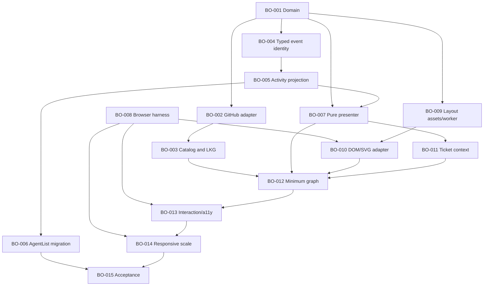

# Build Order Planning Pack

Read this file first. This branch contains reviewed planning evidence and issue
contracts. It does not implement Build Order, launch Aiur, or dispatch work.

## Status

- Plan version: 1
- Build Order ID: `its-everdred/aiur:build-order-dashboard`
- Researched code: `b7c4e7c06b8c7011f306ce9efb0b9cd8fd8cbac5`
- Build Order: 15 executable/capstone tickets, 57 points
- Standalone dashboard companions: 15 tickets, 56 points
- GitHub materialization: pending final validation/reconciliation
- Dispatch: prohibited in this planning run; never add `agent:todo`
- Merge: do not merge this planning branch or the isolated skill branch while
  the current dashboard run is active

The opening estimate of roughly ten tickets was a sizing hypothesis. The final
audit split hidden event identity, browser infrastructure, layout integration,
runtime-control acknowledgement, durable usage, Remote Control accounting,
provider meters and run-summary semantics into independently verifiable work.

## Reading order

1. [Requirements](../brainstorms/2026-07-12-build-order-requirements.md)
2. [Design manifest](design-manifest.md), [dashboard delta](02-dashboard-design-delta.md),
   and [capability audit](06-prototype-capability-audit.md)
3. [Source-of-truth/state model](03-source-of-truth-and-state.md) and
   [usage/accounting decision](04-usage-accounting.md)
4. [Technical decisions](05-technical-decisions.md)
5. [Implementation plan](../plans/2026-07-12-005-feat-build-order-dashboard-plan.md)
6. [Canonical Build Order baseline](build-order.json) and [member tickets](tickets/)
7. [Standalone companion index](dashboard-companions.md)
8. [Validation report](validation-report.md)
9. [Publication receipt](github-publication.md)
10. [Executor handoff](EXECUTOR-HANDOFF.md)

Supporting context: [research spike](00-research-spike.md),
[decomposition patterns](01-decomposition-patterns.md),
[deferred findings](deferred-findings.md), and [questions](questions.md).

## Build Order graph

Phase is presentation and rollout guidance, not a barrier. Native GitHub hard
dependencies, ticket state, declared serialization conflicts and current
capacity determine readiness. BO-003 and BO-005 serialize on the supervision
tree even after their different hard prerequisites land.

## Authority

1. Current explicit operator decisions.
2. Captured/versioned design evidence.
3. Accepted requirements and technical decisions.
4. GitHub for materialized identity, membership, ticket facts, labels,
   lifecycle and native hard blockers.
5. Aiur for current runtime activity and retained usage.
6. This pack for the approved baseline, scheduling metadata and evidence.

`build-order.json` is the canonical approved baseline before publication and a
scheduling/reference artifact afterward. It never overrides newer GitHub
membership or blockers. The prototype is a behavioral/visual reference, not a
pixel-perfect or architectural mandate.

## Finite boundary

Build Order finishes only when BO-001 through BO-015 are implemented, reviewed,
green on the current configured integration branch, merged, documented,
cleaned up and proven after merge through the real CLI plus authenticated
browser workflow. BO-015 owns the acceptance matrix and root closure.

The fifteen dashboard companions, Linear parity #1067, skill-delivery tracking,
deferred findings and optimizations do not change that denominator or ETA.
During execution, contained review findings return to the existing ticket;
only an independent P0/P1 acceptance blocker can expand the active feature.
P2/P3 findings and optimizations remain in the deferred ledger. If promoted
work outpaces completion, promotion freezes until the bounded feature lands.

## Publication boundary

Materialize one non-dispatchable root plus fifteen direct native sub-issues.
Each member receives exactly one `complexity:N`, `model:codex`, one `phase:N`
and one `build-lane:*`; the root receives only `build-order` from this label
family. Materialize the fifteen companions separately with complexity and
`model:codex`, no Build Order parent/phase/lane, and their real native blockers.

After publication, requery node IDs, membership, hard relationships and labels.
Validation must prove that no created/updated issue has `agent:todo` or another
active dispatch state.
