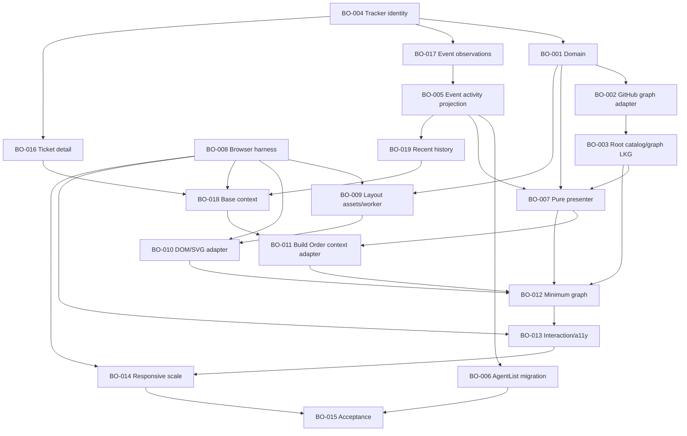

# Build Order Planning Pack

> **Successor note (2026-07-13):** the shipped-dashboard delta was reopened
> after new production screenshots/source evidence. Read
> [PLANNING-HANDOFF.md](PLANNING-HANDOFF.md) before using the counts or
> publication instructions below; the DASH-026..034 split has now been
> propagated through the manifests, tickets, and requirements, and the
> publication validation re-run remains pending.

Read this file first. This branch contains reviewed planning evidence and issue
contracts. It does not implement Build Order, launch Aiur, or dispatch work.

## Status

- Plan version: 1
- Build Order ID: `its-everdred/aiur:build-order-dashboard`
- Researched code: `9849f32963c2a65367bce565b3f5ede3777c218f`
- One consolidated Build Order (operator decision 2026-07-13): 54 members —
  20 BO tickets (73 points) plus 34 DASH tickets (111 points) — across five
  lanes (plan-graph, runtime, dashboard-ui, accounting, platform)
- GitHub graph: 56 issues — 54 members plus the root and the skill-delivery
  issue — with 107 native blocker edges
- GitHub materialization: mechanically valid; two clean semantic passes and
  final reconciliation remain pending
- Dispatch: prohibited in this planning run; never add `agent:todo`
- Execution gates: the integration baseline is resolved (`origin/main` at
  `9849f32963c2a65367bce565b3f5ede3777c218f`); the bounded Executor skill
  installation gate remains unresolved; see `build-order.json`
- Merge: do not merge this planning branch or the isolated skill branch while
  the current dashboard run is active

The opening estimate of roughly ten tickets was a sizing hypothesis. The final
audit split configured-repository identity from event propagation; detail,
history, base context and Build Order relationships; browser infrastructure
from layout integration; and durable usage ledger, query, retention and
selected-order integration into independently verifiable work.

## Reading order

1. [Requirements](../brainstorms/2026-07-12-build-order-requirements.md)
2. [Design manifest](design-manifest.md), [dashboard delta](02-dashboard-design-delta.md),
   and [capability audit](06-prototype-capability-audit.md)
3. [Source-of-truth/state model](03-source-of-truth-and-state.md) and
   [usage/accounting decision](04-usage-accounting.md)
4. [Technical decisions](05-technical-decisions.md)
5. [Implementation plan](../plans/2026-07-12-005-feat-build-order-dashboard-plan.md)
6. [Canonical Build Order baseline](build-order.json) and member tickets in
   [tickets/](tickets/) and [companion-tickets/](companion-tickets/)
7. [Companion history and ownership boundaries](dashboard-companions.md)
8. [Auxiliary publication manifest](publication.json)
9. [Validation report](validation-report.md)
10. [Publication receipt](github-publication.md)
11. [Executor handoff](EXECUTOR-HANDOFF.md)

Supporting context: [research spike](00-research-spike.md),
[decomposition patterns](01-decomposition-patterns.md),
[deferred findings](deferred-findings.md), and [questions](questions.md).

## Build Order graph

The diagram shows the BO spine; the canonical baseline renders all 54 members.
Phase is presentation and rollout guidance, not a barrier. Native GitHub hard
dependencies, ticket state, declared serialization conflicts and current
capacity determine readiness. BO-003, BO-005, BO-016, BO-019, DASH-002,
DASH-009, DASH-012, DASH-018, DASH-019, DASH-024, DASH-025, and DASH-026
declare symmetric serialization pairs on the central application-supervision
bootstrap surface wherever hard dependencies do not already order them.

BO-004, BO-008, DASH-006, DASH-017, and DASH-018 are the independent initial
implementation nodes; no BO node is ready until both external gates are
recorded as resolved on the live root, and DASH-013/019 additionally wait on
their named Claude-protocol gates (GATE-004/GATE-003). The integration baseline is resolved — `origin/main` at
`9849f32963c2a65367bce565b3f5ede3777c218f` contains the completed OCC
predecessor — while the bounded Executor skills remain isolated in PR #1065;
the skill gate may not be inferred away.

## Authority

1. Current explicit user decisions.
2. Captured/versioned design evidence.
3. Accepted requirements and technical decisions.
4. GitHub for materialized identity, membership, ticket facts, labels,
   lifecycle and native hard blockers.
5. Aiur for current runtime activity and retained usage.
6. This pack for the approved baseline, scheduling metadata and evidence.

`build-order.json` is the canonical approved baseline before publication and a
scheduling/reference artifact afterward. It never overrides newer GitHub
membership or blockers. The prototype is a behavioral/visual reference, not a
pixel-perfect or architectural mandate.

## Finite boundary

Build Order finishes only when all 54 members — BO-001 through BO-020 and
DASH-001 through DASH-034 — are implemented, reviewed,
green on the current configured integration branch, merged, documented,
cleaned up and proven after merge through the real CLI plus authenticated
browser workflow. BO-015 owns the acceptance matrix and root closure, and
DASH-033 is the in-graph dashboard-parity proof it depends on.

Linear parity #1067, skill-delivery tracking,
deferred findings and optimizations do not change that denominator or ETA.
During execution, contained review findings return to the existing ticket;
only an independent P0/P1 acceptance blocker can expand the active feature.
P2/P3 findings and optimizations remain in the deferred ledger. If promoted
work outpaces completion, promotion freezes until the bounded feature lands.

## Publication boundary

Materialize one non-dispatchable root plus all 54 direct native sub-issues.
Each member receives exactly one `complexity:N`, `model:codex`, one `phase:N`
and one `build-lane:*`; the root receives only `build-order` from this label
family.

Every one of the 56 titles comes from its approved document H1, and every body
links the real immutable approval commit and carries one schema-2 logical-ID
marker. After publication, requery node IDs, exact titles, bodies,
exact `OPEN` and unlocked state, membership, hard relationships, full labels,
parenthood, non-root subissue absence, and the uniquely
marked pending reconciliation comment. Run both the isolated `/aiur-build`
canonical validator and `scripts/validate_publication.py`. The canonical
validator owns the membership/label/dependency receipt for all 54 members;
the publication validator proves standalone root/skill
parenthood, observed labels, expected-versus-observed exact titles, body
markers/hashes, the external-skill
blocker edges, approval identity, and structured pending-comment evidence. No
newly published issue may have any `agent:*` state.

The immutable materialization uses core receipt v3 and auxiliary receipt
v2. The final verifier derives its expected graph only from that
validated receipt and reads GitHub twice with finite bounds. Both complete
snapshots must be identical and exactly cover 56 open, unlocked issues, the
54 root members, 107 native blockers, all logical-marker matches including
closed and PR-shaped collisions, and the exact pending/successful comment. Run
it before and after the one pending-to-successful comment edit.

The immutable receipt also freezes
`trusted_repository_ref=refs/heads/build-order-research`. Final verification
fetches the exact receipt-recorded comment directly from GitHub and requires
approval plus receipt to remain ancestors of an unchanged tip of that branch,
and independently proves approval is an ancestor of receipt. Authority reads
pin `github.com` with finite timeouts; replace objects are disabled and any
worktree/common-dir legacy graft entry fails closed. Branch deletion or a
force-push that removes either commit revokes the start gate; no other ref is an
implicit fallback.
