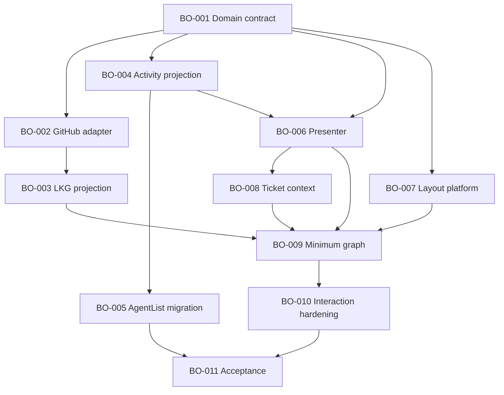

# Build Order Planning Pack

Read this file first. This branch is a planning artifact, not an active Aiur
run or a second live tracker.

## Status

- Plan version: 1
- Build Order ID: `its-everdred/aiur:build-order-dashboard`
- Researched code: `3d67b7be722eb649f28088fc8d609dd7b75254c7`
- Build Order tickets: 11 executable/capstone tickets, 40 points
- Standalone dashboard companions: 8 tickets, 29 points
- GitHub materialization: pending operator answers and ticket review
- Execution: not authorized; do not add `agent:todo` or run Aiur
- Merge: do not merge this planning branch into `main` while the dashboard
  agents are active

After materialization, GitHub owns current ticket facts, labels, relationships,
and lifecycle. Aiur owns current runtime state, progress, alerts, and events.
This pack owns reviewed intent, decisions, evidence, and the baseline graph.

## Reading order

1. [Requirements](../brainstorms/2026-07-12-build-order-requirements.md)
2. [Design manifest](design-manifest.md) and
   [dashboard delta](02-dashboard-design-delta.md)
3. [Source of truth and state model](03-source-of-truth-and-state.md)
4. [Technical decisions](05-technical-decisions.md)
5. [Implementation plan](../plans/2026-07-12-005-feat-build-order-dashboard-plan.md)
6. [Canonical graph](build-order.json) and [Build Order tickets](tickets/)
7. [Standalone companion index](dashboard-companions.md)
8. [Validation report](validation-report.md)
9. [Executor handoff](EXECUTOR-HANDOFF.md)

Supporting research:

- [Research spike](00-research-spike.md)
- [Prior-run decomposition patterns](01-decomposition-patterns.md)
- [Usage/accounting research](04-usage-accounting.md)
- [Deferred findings](deferred-findings.md)
- [Questions and commands](questions.md)
- [GitHub publication plan](github-publication.md)

## Canonical implementation graph

BO-003 and BO-004 also serialize on the application supervision surface. Phase
is not a barrier. Reverse edges, readiness, counts, and publication mappings are
generated from the canonical JSON/GitHub rather than maintained in prose.

## Source precedence

1. Current explicit operator decisions.
2. Captured/versioned design evidence.
3. Accepted requirements and decisions.
4. GitHub for materialized plan facts.
5. Aiur for runtime facts.
6. This pack for the approved baseline and evidence.

The refreshed design is a behavioral/visual reference, not a pixel-perfect or
architectural mandate. The two captured artifacts and their hashes are recorded
in `build-order.json` and `design-manifest.md`.

## Finite boundary

Build Order is complete only when the 11 tickets are implemented, reviewed,
current-base green, merged, documented, cleaned up, and proven using the real
CLI and authenticated browser workflow. The 8 companion tickets, Linear parity
issue #1067, deferred findings, and optimizations do not affect that condition.

The later Executor classifies new findings before creating work: promote only
true P0/P1 acceptance blockers, return contained findings to rework, and record
P2/P3 or optimization findings in the ledger. If promotion outpaces completion,
new promotion freezes until the bounded feature completes.

## Publication boundary

After operator approval, create one non-dispatchable root plus 11 member issues
and 8 standalone companion issues. The root receives `build-order` only from
the planning label family. Runnable members receive one `complexity:N`,
`model:codex`, one `phase:N`, and one `build-lane:*`; companions receive only
complexity and `model:codex`. No new issue receives `agent:todo`.

Native sub-issue membership and native hard blockers are published and then
requeried. `serializes_with` is scheduling metadata, not a fake GitHub blocker.
