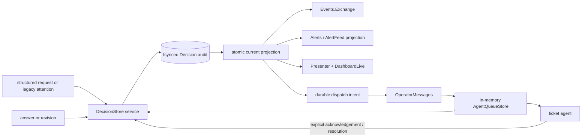

# OCC-0 audit and design decisions

**Status:** Accepted for OCC implementation

**Date:** 2026-07-12

**Source:** [Executor Control Center planning PR #971](https://github.com/its-everdred/aiur/pull/971), especially `00-prd.md` and `01-brainstorm-and-decomposition.md`

This note resolves the phase-0 questions that block OCC-1 through OCC-9. It
records current ownership and the few new seams OCC needs; it does not define
the full Decision schema or implement feature code.

## Current-system audit

| Path | What exists now | OCC consequence |
|---|---|---|
| Decision attention | `Aiur.AgentRunner.ToolExecutor` maps `attention.*` and Executor-decision `blocked` / `pause.request` events into `Aiur.DecisionAttention`. That GenServer owns repeat reminders in memory and stores only the open slug in `Aiur.Events.SubscriptionStore`; the question itself survives only in alert logs. Generic `decision.*` events do not enter this path. | Keep `DecisionAttention` as the legacy-attention adapter/reminder owner, but make `DecisionStore` own the full durable record before any reminder is emitted. |
| Alerts | `Aiur.Alerts` publishes to `Aiur.Events.Exchange`, then best-effort appends an alert to workspace `agent.ndjson` or central `alerts.ndjson`, broadcasts to the agent UI, and refreshes observability. `Aiur.AlertFeed` reconstructs a read model by scanning those logs and matching `.resolved` topics. | Alerts and `AlertFeed` remain notification/history projections. Their payload is lossy and their current publish-before-log order makes them unsuitable as canonical Decision storage. |
| Event bus | `Aiur.Events.Publisher` assigns durable monotonic event IDs, applies filtering/dedup policy, records issue-log markers, and hands events to `Aiur.Events.Exchange`. The exchange is an in-memory, asynchronous topic router. | Reuse this bus after a Decision mutation is durable. Do not add another bus and do not treat exchange delivery as persistence. |
| Executor messages | `Aiur.AgentChat` calls `Aiur.Orchestrator.OperatorMessages`, which validates the message, safely reactivates/resumes the target when capacity permits, and inserts an item into `Aiur.AgentQueueStore`. The queue is explicitly in-memory. Item IDs restart with the orchestrator. | Reuse this delivery path, including its wake/resume gates. A durable Decision outbox and deterministic idempotency key must cover daemon restarts and correlate the transient queue item. |
| Delivery settlement | Queue items move `pending` -> `delivered` when claimed and `consumed` after a successful agent turn. Interrupted/paused paths restore them; terminal turn failures mark them failed. `OperatorWaitLog` calls “delivered” the point at which text is handed to the backend. | These transitions can support recorded / queued / handed-off / failed. `consumed` is not proof that the agent understood a decision, so acknowledgement must remain a separate agent-emitted Decision event. |
| Dashboard and API | `AiurWeb.Presenter` projects only the live orchestrator snapshot (running and retrying). `AiurWeb.DashboardLive` refreshes through `AiurWeb.ObservabilityPubSub` and sends writes through `AgentChat`; `AiurWeb.ObservabilityApiController` reads through `Presenter` and sends Executor text through the orchestrator. Browser writes fail closed behind `dashboard_writable`; REST writes additionally pass the configured basic-auth policy, same-origin checks, and `X-Aiur-Request`. | Compose Decision and outcome projections into `Presenter`/`DashboardLive`; route LiveView and API mutations through the same public `DecisionStore` API, preserving the existing writable and request-security gates. |
| File persistence | `Aiur.JsonStore` provides fsynced atomic JSON replacement. `SubscriptionStore` demonstrates one serializing GenServer per owner. Agent, alert, wait-time, and debug telemetry streams use append-only NDJSON, but those writers are best-effort and do not fsync each record. | Reuse the single-writer, NDJSON, and atomic-projection patterns, with stronger write acknowledgement for Decision mutations. |
| SQLite | The only SQLite dependency is used by `Aiur.Opencode.DB` to adapt to opencode's owned database. Aiur has no application `Ecto.Repo`, migrations, backup policy, or shared relational store. | There is no existing Aiur SQLite subsystem to extend. Adding one for Decisions would create the parallel lifecycle the PRD cautions against. |
| PR merges | `Aiur.Events.GithubFirehose` converts a GitHub `PullRequestEvent` (`closed`, `merged: true`) to `ticket.<id>.pr.merged` only when the PR head is a recognized ticket branch. It preserves the sanitized PR payload, bypasses the tracked-ticket filter, and drops old pre-boot events. The orchestrator marks the ticket done; debug telemetry may record an external `pr_merged` point. | The event authoritatively links a merge to a ticket/branch and merge time, but carries no Aiur run or worker-attempt identity. It supports a recent repository-merges view, not causal current-run attribution. |

## Decision 1: file-first, event-sourced persistence

Use one instance-scoped `DecisionStore` GenServer with:

- a canonical append-only `decisions.ndjson` audit stream;
- a rebuildable `decisions.json` current-state projection written through
  `Aiur.JsonStore`; and
- in-memory indexes plus existing PubSub/event notifications for fast reads.

Both files belong in a stable instance state directory, not a ticket workspace
and not the timestamped per-run log directory. Add a single path helper rooted
under `AIUR_BG_STATE_DIR`, keyed by the existing `AIUR_INSTANCE_KEY` and tracker
project identity. This lets open decisions survive a daemon/launcher restart
while isolating two project instances owned by the same user. Files containing
decision context must be owner-only (`0700` directory, `0600` files). Run logs
may contain redacted projections, but are not a second source of truth.
Sanitize every derived path component through `Aiur.Config.Paths`; never join a
raw environment or tracker value into the state path.

Every accepted mutation follows this order:

1. validate identity, version, actor, idempotency key, and bounded content;
2. append the audit event and fsync it;
3. update the in-memory projection and atomically replace `decisions.json`;
4. only then publish to `Events.Exchange`, project an alert, refresh LiveView,
   or attempt Executor-message delivery.

Validation before append must bound identifier and text sizes, reject unsafe
control data, canonicalize artifact paths beneath configured safe roots, allow
only approved URL schemes/hosts, and redact known credential forms. Do not
ingest environment dumps or raw agent transcripts. Treat stored Markdown as
data, not trusted HTML: use the safe Markdown/HTML rendering path for browsers
and structured JSON encoding for APIs. OCC-1 owns the exact schema, roots,
allowlists, and limits, but these controls are part of the persistence contract
rather than optional UI hardening.

If projection replacement fails after the audit append, replay repairs it; the
audit record remains authoritative. If the canonical append cannot be made
durable, return an error and do not report the Decision or answer as accepted.

Append each event as one newline-terminated record. On startup, validate the
stream before replay: an incomplete final record that was never acknowledged
may be truncated, while malformed interior records are corruption and must fail
closed (read-only with an Executor alert), never be silently skipped. Rebuild
the projection only from the validated prefix.

The event volume is low and the access patterns are “open list + one detail +
recent history,” so a serialized file writer and in-memory indexes are enough.
When retention is added, rotate the active stream into immutable segments and
remove only sealed, terminal-history segments. Retention must never delete an
open Decision or rewrite accepted events in place.

SQLite is deferred until measured needs justify it: multiple concurrent writers,
relational constraints that cannot be enforced in `DecisionStore`, or query
volume/pagination that makes replay and indexes inadequate. None exists today.

## Decision 2: one launcher-created BEAM VM is the canonical run

A **run** begins after Aiur successfully boots in a fresh BEAM VM created by the
launcher and ends when that VM exits, whether cleanly or after a crash. It is
scoped beneath the stable `AIUR_INSTANCE_KEY` (project root identity). A
supervised child/application subtree restart inside the same VM does not create
a run. Dashboard reconnects, tmux attach/detach, agent turns, and worker retries
also do not create one.

Extend the always-on `Aiur.Boot` boundary with one opaque `run_id` and make
`Aiur.RunTelemetry` use that same value. Do not mint an OCC-only identifier.
The existing telemetry `boot_id` demonstrates the required random ID and
per-boot sequence, but its ownership is currently debug-only and should be
promoted/delegated to the neutral boot owner.

| Identity | Lifetime | Meaning |
|---|---|---|
| `AIUR_INSTANCE_KEY` | Stable across launches from one project root | Which Aiur installation/project owns state |
| `run_id` | One launcher-created BEAM VM lifetime | Canonical OCC run/window |
| ticket-agent `session_id` | Backend conversation; may resume across daemon boots | Conversation continuity, not a run boundary |
| telemetry `attempt_id` | One dispatched worker attempt | Retry/worker attribution within a run |
| queue item ID | One orchestrator process | Transient delivery handle only |

Decision history is per instance/repository across runs. Each audit event records
the run that accepted it; a Decision retains `created_run_id` while later answer,
delivery, acknowledgement, or revision events may carry a different run. Open
decisions remain visible after restart regardless of their originating run.

## Decision 3: merge events are not run attribution

The current tracker path can prove:

- configured repository, PR number, head branch/SHA, ticket identifier, merge
  timestamp, and any `merged_by` metadata present in the GitHub PR payload; and
- which daemon observed and persisted the event, once the OCC store stamps its
  `run_id`.

It cannot prove that the observing run created the PR, performed its work, or
caused the merge. A PR may have been opened in an earlier run and merged by a
human while a later run happens to be active. Poll timing and the pre-boot
filter also make “observed by this boot” a weaker fact than authorship.

Therefore OCC-6 must label the default panel **Recent repository merges**.
Keep temporal and ingestion facts separate: “Merged during this run window” is
valid when `merged_at` falls between the run boundaries, while “Observed by this
run” is valid only when the persisted fact carries that `observed_run_id`.
Neither may be rendered as “merged by this run.” True run attribution requires
an explicit durable association made when Aiur opens or adopts the PR (run ID +
attempt ID + PR number), followed by matching the merge event to that
association. That association does not exist today.

The current firehose is only a real-time seed for this panel: it discards
pre-boot events and recognizes only ticket-branch merges. OCC-6 must persist
observed merge facts and reconcile a bounded recent window through the tracker
or GitHub API after startup and polling gaps. Store whether each fact was
observed live or backfilled. Without that reconciliation, the honest panel name
is **Recent observed ticket merges**, not **Recent repository merges**.

## Decision 4: DecisionStore is the outbox; existing modules keep transport

`DecisionStore` means the single public Decision application service and its
serialized persistence owner. LiveView, REST, legacy-attention adapters, queue
transition callbacks, and agents all use this API; this note does not introduce
a second “Decision service” beside the store.

The intended flow is:

An answer/revision event contains a stable action ID. The persisted state then
shows `dispatch_pending`; a dispatcher calls `OperatorMessages` with that action
ID as a deterministic dedupe/correlation key. OCC-3 must extend the Executor
message API and queue item with this key. `AgentQueueStore` must retain an index
across pending (including restored), delivered, consumed, failed, and superseded
states for that queue-store lifetime, returning the previously accepted queue
handle when `DecisionStore` retries the same action while the store survives.

Queue acceptance appends a `dispatch_queued` event with the queue item ID, and
later queue transitions append handed-off, consumed, restored, or failed events.
After an orchestrator/queue-store or daemon restart, the transient queue and its
index are gone, so reconciliation retries every durable intent without a
terminal dispatch result. Each attempt must carry the same action ID and
Decision version; the audit records attempt-specific queue IDs beneath that one
logical action.

This transport is **at least once** across crash windows, not exactly once.
`DecisionStore` suppresses retries after a terminal dispatch result or explicit
acknowledgement, and the agent intake path must treat a repeated action ID +
version as a replay rather than a new answer. Any downstream side effect that
supports an idempotency key must receive the action ID; otherwise the agent must
reconcile whether the effect already happened before repeating it. OCC-3 may
extend Executor queue items and transition notifications, but must not create
another queue or claim exactly-once delivery.

The agent must explicitly emit acknowledgement/resolution with the Decision ID
and version. Queue claim or turn completion alone must not advance a Decision to
Acknowledged or Resolved.

## Downstream constraints

- **OCC-1:** own the schema, validation/redaction limits, event-log recovery,
  projection, neutral run ID, versioning, deduplication, and post-persist
  notifications in `DecisionStore`.
- **OCC-2:** make `DecisionAttention` a legacy adapter keyed by ticket + slug;
  preserve alerts as projections and enrich the same record when a structured
  request later arrives.
- **OCC-3:** implement the durable outbox/correlation contract over
  `OperatorMessages`, including action-ID idempotency across all queue states;
  expose queue transitions, make agent intake replay-aware, and require explicit
  agent ack.
- **OCC-4 / OCC-7:** route LiveView and API mutations through the same
  `DecisionStore` API and retain all existing read-only/auth/request gates.
- **OCC-5:** treat `run_id` as BEAM-VM scope while showing all tracker work seen
  by the run, not only current OS processes or backend sessions.
- **OCC-6:** store live merge facts, reconcile bounded polling/startup gaps, and
  distinguish observed from backfilled facts; never imply PR/run causality
  until an explicit association exists.
- **OCC-8 / OCC-9:** append revisions and lifecycle timestamps; never rewrite
  prior events or infer acknowledgement from queue consumption.

## Rejected alternatives

- **SQLite now:** no shared Aiur repo/migration/backup lifecycle exists, and the
  expected workload does not need relational queries or concurrent writers.
- **`alerts.ndjson` as truth:** it is best-effort, lossy, notification-shaped,
  and currently published before it is written.
- **Workspace `agent.ndjson` as truth:** it is ticket/host/workspace scoped and
  may disappear with workspace lifecycle; remote events already require a
  central path.
- **Per-run log storage:** the launcher mints a new timestamped log root, so it
  cannot satisfy restart survival without cross-directory discovery.
- **Agent `session_id` as the run:** sessions can resume across daemon boots and
  multiple agents participate in one run.
- **Exactly-once delivery over the in-memory queue:** the daemon and agent cannot
  atomically commit one outcome across a crash boundary; use one stable logical
  action, at-least-once attempts, and consumer-side idempotency instead.
- **Merge-time window as attribution:** time overlap proves observation, not
  causation or ownership.

## Questions intentionally left to later tickets

Exact Decision field validation belongs to OCC-1; external supervising-agent
authentication and autonomy defaults belong to OCC-7. Neither changes the
storage, run-boundary, delivery, or merge-attribution decisions above.
