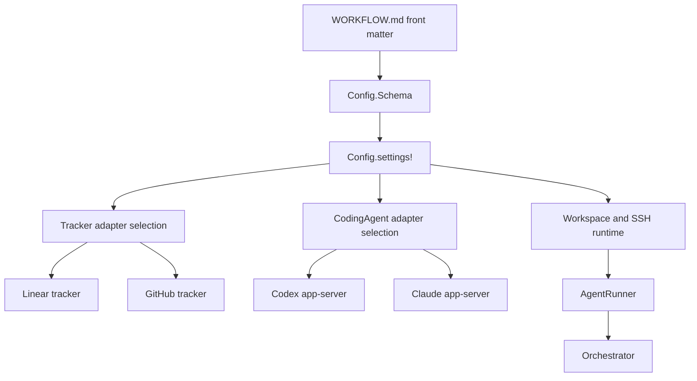

# refactor: Sync Sapsaldog Symphony fork with OpenAI upstream

## Summary

Merge OpenAI `upstream/main` into this fork by adopting upstream's hardened config, workspace, SSH worker, and Codex fixes as the base, then re-layering the fork's Claude Code and GitHub Issues support through explicit extension points. The goal is to retain the Sapsaldog fork capabilities while making future OpenAI updates cheaper to absorb.

---

## Problem Frame

This repository diverged from OpenAI Symphony after the Sapsaldog fork added multi-backend coding agents, GitHub Issues tracking, Claude Code app-server support, Homebrew packaging, and release automation. Since that fork point, OpenAI added schema-backed config, SSH worker support, orchestration/workspace hardening, live E2E coverage, and Codex app-server fixes. A direct merge has broad conflicts in `Config`, `AgentRunner`, `Orchestrator`, `Workspace`, and tests, so preserving both lines of work requires an architecture-first merge rather than mechanical conflict resolution.

---

## Requirements

- R1. Preserve Claude Code as a first-class coding-agent backend.
- R2. Preserve GitHub Issues as a tracker backend, including label-based state transitions.
- R3. Preserve Codex and Linear compatibility with OpenAI upstream behavior.
- R4. Adopt OpenAI upstream updates since the fork point, especially schema-backed config, SSH worker support, workspace/path safety, Codex app-server fixes, action pinning, and live E2E coverage.
- R5. Reduce future upstream merge friction by keeping OpenAI-owned core modules close to upstream and moving fork-specific behavior behind small extension boundaries.
- R6. Keep the existing fork test baseline passing and expand coverage for combined upstream-plus-fork behavior.

---

## Scope Boundaries

- This plan does not implement the separate `symphony-claude` app-server binary; it only preserves Symphony's ability to talk to that app-server.
- This plan does not redesign the Symphony protocol or issue lifecycle semantics.
- This plan does not replace Homebrew/release automation unless upstream conflicts require small compatibility edits.
- This plan does not attempt to upstream these fork changes into OpenAI's repository.

### Deferred to Follow-Up Work

- Upstream contribution strategy: evaluate later whether generic tracker/agent abstractions should be proposed to OpenAI.
- Automated recurring upstream sync workflow: add only after this merge establishes a stable low-conflict shape.

---

## Context & Research

### Relevant Code and Patterns

- Current fork agent abstraction: `elixir/lib/symphony_elixir/coding_agent.ex`, `elixir/lib/symphony_elixir/claude/coding_agent.ex`, `elixir/lib/symphony_elixir/codex/coding_agent.ex`.
- Current fork tracker abstraction: `elixir/lib/symphony_elixir/tracker.ex`, `elixir/lib/symphony_elixir/tracker_config.ex`, `elixir/lib/symphony_elixir/github/tracker.ex`, `elixir/lib/symphony_elixir/linear/tracker.ex`.
- OpenAI upstream config core: `elixir/lib/symphony_elixir/config.ex`, `elixir/lib/symphony_elixir/config/schema.ex`.
- OpenAI upstream runtime hardening: `elixir/lib/symphony_elixir/path_safety.ex`, `elixir/lib/symphony_elixir/ssh.ex`, `elixir/lib/symphony_elixir/workspace.ex`, `elixir/lib/symphony_elixir/orchestrator.ex`, `elixir/lib/symphony_elixir/agent_runner.ex`.
- OpenAI upstream verification: `elixir/test/symphony_elixir/live_e2e_test.exs`, `elixir/test/symphony_elixir/ssh_test.exs`, `elixir/test/support/live_e2e_docker/*`.

### External References

- Sapsaldog post: `https://sapsaldog.com/posts/symphony-with-claude-code`
- OpenAI upstream remote: `https://github.com/openai/symphony.git`

---

## Key Technical Decisions

- Use OpenAI `upstream/main` as the architectural base for conflicted core modules: upstream made the larger durability investment in config validation, workspace safety, SSH workers, and E2E coverage, and future OpenAI changes will likely continue from that shape.
- Re-layer fork-specific behavior as schema extensions rather than parallel config helpers: this avoids long-term drift between `NimbleOptions`-based fork config and upstream's `Ecto.Schema` config.
- Keep `CodingAgent` and tracker abstractions, but make their selection read from upstream-compatible `Config.settings!()`: the abstraction is the fork's key value, but config source-of-truth should be upstream's schema.
- Rename Codex telemetry concepts only where the abstraction requires it: preserve upstream event handling semantics first, then expose generic names at presentation boundaries if useful.
- Resolve tests by porting fork tests onto upstream's newer test helpers rather than preserving stale assertions about permissive config fallback behavior.

---

## Open Questions

### Resolved During Planning

- Should this be a direct merge? No. `git merge-tree` shows conflicts across the main runtime modules and tests; direct conflict resolution would obscure the intended architecture.
- Should the fork keep its current config model? No. The merge should adopt upstream's schema-backed config and extend it for `github`, `claude`, and `memory`.

### Deferred to Implementation

- Exact schema shape for `github` and `claude` sections: defer field-level naming to implementation after mapping current fork config and tests.
- Whether terminal dashboard labels should remain generic `agent_*` or upstream `codex_*`: decide while reconciling presenter and dashboard tests.

---

## High-Level Technical Design

> *This illustrates the intended approach and is directional guidance for review, not implementation specification. The implementing agent should treat it as context, not code to reproduce.*

The intended shape is: upstream owns config parsing and runtime hardening; the fork owns adapter selection and the extra GitHub/Claude implementations.

---

## Implementation Units

### U1. Establish Upstream Merge Base

**Goal:** Bring OpenAI upstream files into the branch in a controlled merge workspace and preserve a clear conflict inventory.

**Requirements:** R3, R4, R5

**Dependencies:** None

**Files:**
- Modify: `.github/workflows/make-all.yml`
- Modify: `.github/workflows/pr-description-lint.yml`
- Modify: `SPEC.md`
- Modify: `elixir/Makefile`
- Modify: `elixir/README.md`
- Modify: `elixir/WORKFLOW.md`
- Modify: `elixir/mix.exs`
- Modify: `elixir/mix.lock`
- Create: `elixir/lib/symphony_elixir/path_safety.ex`
- Create: `elixir/lib/symphony_elixir/ssh.ex`
- Create: `elixir/test/support/live_e2e_docker/Dockerfile`
- Create: `elixir/test/support/live_e2e_docker/docker-compose.yml`
- Create: `elixir/test/support/live_e2e_docker/live_worker_entrypoint.sh`
- Create: `elixir/test/support/live_e2e_docker/symphony-live-worker.conf`
- Create: `elixir/test/symphony_elixir/live_e2e_test.exs`
- Create: `elixir/test/symphony_elixir/ssh_test.exs`

**Approach:**
- Start from the current fork branch and merge `upstream/main`.
- For low-level upstream additions that do not conflict with fork behavior, prefer upstream as-is.
- Keep the conflict inventory explicit for `Config`, `AgentRunner`, `Orchestrator`, `Workspace`, `StatusDashboard`, `Tracker`, `Presenter`, and related tests.

**Patterns to follow:**
- OpenAI upstream commit range `e65f5ee..58cf97d`.
- Existing fork commit range `8b63cc0..932e5f4`.

**Test scenarios:**
- Test expectation: none -- this unit is merge staging and conflict inventory; behavioral verification happens in later units.

**Verification:**
- Upstream-only files are present.
- Workflow action pinning and upstream docs/spec updates are retained.
- No fork-specific Claude/GitHub files are removed.

### U2. Reconcile Config Around Upstream Schema

**Goal:** Make `Config.Schema` the single source of truth while preserving fork-specific `github`, `claude`, `codex`, `linear`, and `memory` settings.

**Requirements:** R1, R2, R3, R4, R5, R6

**Dependencies:** U1

**Files:**
- Modify: `elixir/lib/symphony_elixir/config.ex`
- Create/Modify: `elixir/lib/symphony_elixir/config/schema.ex`
- Modify: `elixir/lib/symphony_elixir/github/config.ex`
- Modify: `elixir/lib/symphony_elixir/claude/config.ex`
- Modify: `elixir/lib/symphony_elixir/codex/config.ex`
- Modify: `elixir/lib/symphony_elixir/linear/config.ex`
- Modify: `elixir/lib/symphony_elixir/memory/config.ex`
- Test: `elixir/test/symphony_elixir/workspace_and_config_test.exs`
- Test: `elixir/test/symphony_elixir/core_test.exs`

**Approach:**
- Port upstream `Config.settings/0`, `settings!/0`, `validate!/0`, `codex_runtime_settings/2`, and schema parsing.
- Add schema fields for `tracker.kind: github`, GitHub-specific config, `agent.kind` or equivalent backend selection, and Claude-specific config.
- Preserve upstream stricter validation behavior; update fork tests that expected invalid values to silently fall back.
- Keep compatibility helpers such as `Config.agent_kind/0`, `Config.tracker_kind/0`, `Config.active_states/0`, and `Config.agent_max_turns/0` only as thin wrappers over `settings!()`.

**Execution note:** Characterize current GitHub and Claude config behavior with tests before rewriting wrappers to use `Config.Schema`.

**Patterns to follow:**
- Upstream `elixir/lib/symphony_elixir/config/schema.ex` embedded-schema structure.
- Current fork config modules under `elixir/lib/symphony_elixir/*/config.ex`.

**Test scenarios:**
- Happy path: `WORKFLOW.md` with `tracker.kind: github` and `claude.command` validates and selects GitHub plus Claude.
- Happy path: `WORKFLOW.md` with `tracker.kind: linear` and `codex.command` validates and selects Linear plus Codex.
- Edge case: missing `tracker.kind` uses the intended fork default only if the plan explicitly preserves defaults; otherwise it fails with an operator-visible config error.
- Error path: invalid numeric values in polling, hooks, agent, and Codex settings return schema validation errors rather than silent defaults.
- Integration: `Config.codex_runtime_settings/2` still resolves upstream sandbox policy behavior after adding fork-specific fields.

**Verification:**
- Config tests pass for upstream schema behavior and fork backend selection.
- No runtime module reads raw workflow maps except through `Config.settings!()` or thin compatibility helpers.

### U3. Reapply Agent Abstraction on Top of Upstream Runner Changes

**Goal:** Preserve Claude and Codex agent pluggability while adopting upstream `AgentRunner` changes for SSH worker execution, runtime info, and Codex app-server fixes.

**Requirements:** R1, R3, R4, R5, R6

**Dependencies:** U2

**Files:**
- Modify: `elixir/lib/symphony_elixir/agent_runner.ex`
- Modify: `elixir/lib/symphony_elixir/coding_agent.ex`
- Modify: `elixir/lib/symphony_elixir/claude/coding_agent.ex`
- Modify: `elixir/lib/symphony_elixir/codex/coding_agent.ex`
- Modify: `elixir/lib/symphony_elixir/codex/event_humanizer.ex`
- Modify: `elixir/lib/symphony_elixir/claude/event_humanizer.ex`
- Modify: `elixir/lib/symphony_elixir/event_humanizer.ex`
- Modify: `elixir/lib/symphony_elixir/event_humanizer_helpers.ex`
- Test: `elixir/test/symphony_elixir/app_server_test.exs`
- Test: `elixir/test/symphony_elixir/coding_agent_claude_test.exs`

**Approach:**
- Start from upstream `AgentRunner`, then replace direct `Codex.AppServer` calls with the fork's `CodingAgent` boundary.
- Preserve upstream worker host selection, `worker_runtime_info`, SSH lifecycle, and sandbox policy handling.
- Ensure Codex-specific runtime settings are passed only to Codex, while Claude receives the command/session options it understands.
- Keep normalized event output consistent enough for orchestrator and dashboard aggregation.

**Patterns to follow:**
- Upstream `AgentRunner.run_on_worker_host/4` and worker host metadata flow.
- Current fork `CodingAgent` callbacks and event normalization.

**Test scenarios:**
- Happy path: Codex backend starts a session, runs turns, emits normalized events, and stops session using upstream runtime settings.
- Happy path: Claude backend starts a session, accepts Codex-compatible input payloads, emits normalized events, and stops session.
- Integration: remote worker host metadata is sent to the orchestrator when using configured SSH hosts.
- Error path: backend session start failure propagates through `AgentRunner` and triggers the existing retry path.
- Edge case: continuation turns use backend-neutral language and preserve prior thread context.

**Verification:**
- Codex app-server tests retain upstream malformed JSON/event handling fixes.
- Claude coding-agent tests still pass after the runner uses upstream worker-host flow.

### U4. Reconcile Tracker Abstraction With Upstream Orchestration

**Goal:** Preserve GitHub Issues and Linear tracker support while adopting upstream orchestration fixes, retry token handling, active-state reconciliation, and worker-host retry metadata.

**Requirements:** R2, R3, R4, R5, R6

**Dependencies:** U2, U3

**Files:**
- Modify: `elixir/lib/symphony_elixir/tracker.ex`
- Modify: `elixir/lib/symphony_elixir/github/tracker.ex`
- Modify: `elixir/lib/symphony_elixir/github/client.ex`
- Modify: `elixir/lib/symphony_elixir/linear/tracker.ex`
- Modify: `elixir/lib/symphony_elixir/linear/client.ex`
- Modify: `elixir/lib/symphony_elixir/issue.ex`
- Modify: `elixir/lib/symphony_elixir/orchestrator.ex`
- Test: `elixir/test/symphony_elixir/tracker_github_test.exs`
- Test: `elixir/test/symphony_elixir/github_client_test.exs`
- Test: `elixir/test/symphony_elixir/core_test.exs`
- Test: `elixir/test/symphony_elixir/orchestrator_status_test.exs`

**Approach:**
- Start from upstream `Orchestrator` and keep retry token, `tick_token`, worker-host metadata, and stricter config error handling.
- Restore tracker adapter selection so `Tracker.fetch_candidate_issues/0`, `fetch_issue_states_by_ids/1`, and terminal cleanup work for both Linear and GitHub.
- Keep the fork's shared `Issue` struct if it remains the cleanest common contract; otherwise adapt Linear and GitHub results into the upstream-compatible issue shape at the tracker boundary.
- Preserve the GitHub label query fix that fetches each label separately.

**Patterns to follow:**
- Upstream `Orchestrator` state fields and retry scheduling.
- Current fork `GitHub.Tracker` label lifecycle.

**Test scenarios:**
- Happy path: GitHub tracker fetches issues with any configured active label and normalizes them into shared issues.
- Happy path: Linear tracker behavior remains compatible with upstream tests.
- Error path: GitHub API failure returns an error that the orchestrator logs without crashing.
- Integration: an active GitHub issue dispatches through the same orchestrator path as a Linear issue.
- Integration: terminal state reconciliation stops or cleans up workers for both tracker kinds.

**Verification:**
- GitHub tracker/client tests pass.
- Upstream orchestration tests still cover retry token and worker-host behavior after adapter selection is restored.

### U5. Reconcile Workspace, SSH, Dashboard, and Presentation Surfaces

**Goal:** Preserve upstream workspace safety and SSH support while keeping dashboard/presenter output backend-neutral where the fork needs it.

**Requirements:** R1, R2, R3, R4, R5, R6

**Dependencies:** U2, U3, U4

**Files:**
- Modify: `elixir/lib/symphony_elixir/workspace.ex`
- Modify: `elixir/lib/symphony_elixir/status_dashboard.ex`
- Modify: `elixir/lib/symphony_elixir_web/presenter.ex`
- Modify: `elixir/lib/symphony_elixir_web/live/dashboard_live.ex`
- Modify: `elixir/priv/static/dashboard.css`
- Test: `elixir/test/symphony_elixir/ssh_test.exs`
- Test: `elixir/test/symphony_elixir/workspace_and_config_test.exs`
- Test: `elixir/test/symphony_elixir/status_dashboard_snapshot_test.exs`
- Test: `elixir/test/fixtures/status_dashboard_snapshots/*.snapshot.txt`
- Test: `elixir/test/fixtures/status_dashboard_snapshots/*.evidence.md`

**Approach:**
- Prefer upstream `Workspace` implementation for path safety, SSH remote lifecycle, hook execution, and cleanup.
- Thread shared `Issue` and tracker-neutral identifiers through workspace naming without regressing upstream path canonicalization.
- Keep dashboard internals compatible with upstream token/rate-limit aggregation, then rename user-facing labels only where generic agent terminology improves fork clarity.
- Update snapshots intentionally after behavior is reconciled.

**Patterns to follow:**
- Upstream `PathSafety` and `SSH` helpers.
- Existing fork dashboard snapshots for backend-neutral language.

**Test scenarios:**
- Happy path: local workspace creation, hooks, and cleanup still work for GitHub and Linear issues.
- Happy path: remote SSH workspace creation, hooks, and cleanup use upstream command quoting and path safety.
- Edge case: unsafe or overlong paths return upstream-style errors.
- Integration: dashboard renders active agent sessions with worker host, workspace path, token totals, and rate-limit information.
- Integration: web presenter preserves issue URLs for GitHub and Linear.

**Verification:**
- Workspace/config, SSH, and dashboard snapshot tests pass with intentional snapshot updates.
- No workspace path construction bypasses `PathSafety` where upstream introduced it.

### U6. Consolidate Tests, Docs, and Release Tooling

**Goal:** Finish the merge by documenting combined configuration, keeping packaging/release behavior, and validating the full fork against upstream plus fork coverage.

**Requirements:** R1, R2, R3, R4, R5, R6

**Dependencies:** U1, U2, U3, U4, U5

**Files:**
- Modify: `elixir/README.md`
- Modify: `elixir/WORKFLOW.md`
- Modify: `elixir/docs/troubleshooting.md`
- Modify: `SPEC.md`
- Modify: `.github/workflows/bump-homebrew.yml`
- Modify: `.claude/skills/release/SKILL.md`
- Test: `elixir/test/symphony_elixir/extensions_test.exs`
- Test: `elixir/test/symphony_elixir/live_e2e_test.exs`

**Approach:**
- Update docs to show both supported dimensions: tracker (`linear`, `github`, `memory`) and coding agent (`codex`, `claude`).
- Preserve OpenAI's clarified service specification while documenting fork extensions as implementation-defined behavior.
- Keep Homebrew and release automation if still compatible with `mix.exs` version handling.
- Run the full Elixir test suite and separately evaluate whether live E2E requires opt-in credentials or Docker setup.

**Patterns to follow:**
- Sapsaldog post's documented GitHub Issues plus Claude `WORKFLOW.md` shape.
- Upstream `SPEC.md` wording around implementation-defined extensions.

**Test scenarios:**
- Happy path: sample GitHub plus Claude workflow parses and validates.
- Happy path: sample Linear plus Codex workflow parses and validates.
- Error path: docs examples do not reference stale config keys that schema rejects.
- Integration: live E2E remains either passing in the expected environment or explicitly skipped/gated when credentials are absent.

**Verification:**
- `mise exec -- mix test` passes from `elixir/`.
- Documentation includes examples for OpenAI-compatible Codex/Linear and fork-specific Claude/GitHub usage.
- Release/version tooling still reads version from `elixir/mix.exs`.

---

## System-Wide Impact

- **Interaction graph:** `WORKFLOW.md` config feeds schema parsing, adapter selection, workspace setup, agent session execution, tracker polling, dashboard rendering, and docs examples.
- **Error propagation:** Config errors should use upstream structured validation where possible, with tracker/agent-specific messages added at semantic validation boundaries.
- **State lifecycle risks:** GitHub label transitions and Linear states must both flow through the same active/terminal state logic; retries must not duplicate workers.
- **API surface parity:** CLI, dashboard, tracker adapters, and prompt rendering all need the same shared `Issue` contract.
- **Integration coverage:** Unit tests alone are insufficient for runner/orchestrator/workspace behavior; keep upstream live E2E and SSH tests available.
- **Unchanged invariants:** Codex/Linear should remain the OpenAI-compatible path, while Claude/GitHub remain fork extensions selected by config.

---

## Risks & Dependencies

| Risk | Mitigation |
|------|------------|
| Config merge regresses fork defaults | Add explicit tests for GitHub/Claude and Linear/Codex workflow examples before removing compatibility wrappers. |
| Agent abstraction hides Codex-specific upstream fixes | Start from upstream Codex runtime behavior and require Codex app-server tests to pass before generic renames. |
| SSH worker support assumes Codex-only payloads | Thread worker-host metadata through `CodingAgent` without making Claude accept unsupported Codex settings. |
| GitHub tracker lifecycle drifts from Linear assumptions | Keep shared `Issue` contract small and test orchestrator dispatch/reconciliation with GitHub issues. |
| Future upstream merges remain noisy | Keep upstream-shaped core modules and confine fork extensions to adapter modules plus schema extension fields. |

---

## Documentation / Operational Notes

- The merged README should explicitly state that OpenAI upstream compatibility is maintained through Codex/Linear defaults, while Claude/GitHub are fork extensions.
- The sample `WORKFLOW.md` should include one minimal Codex/Linear example and one Claude/GitHub example.
- Live E2E tests may require Docker, Codex credentials, or Linear credentials; document expected skips or setup.
- Current baseline before merge: `mise exec -- mix test` passes with `228 tests, 0 failures`.

---

## Sources & References

- Sapsaldog fork write-up: `https://sapsaldog.com/posts/symphony-with-claude-code`
- Upstream remote: `https://github.com/openai/symphony.git`
- Merge base inspected: `b0e0ff0082236a73c12a48483d0c6036fdd31fe1`
- Current fork head inspected: `932e5f423bf1fd17c067677a6b42e4910e98047e`
- Current upstream head inspected: `58cf97da06d556c019ccea20c67f4f77da124bf3`
- Related code: `elixir/lib/symphony_elixir/config.ex`
- Related code: `elixir/lib/symphony_elixir/coding_agent.ex`
- Related code: `elixir/lib/symphony_elixir/tracker.ex`
- Related code: `elixir/lib/symphony_elixir/orchestrator.ex`
- Related tests: `elixir/test/symphony_elixir/workspace_and_config_test.exs`
