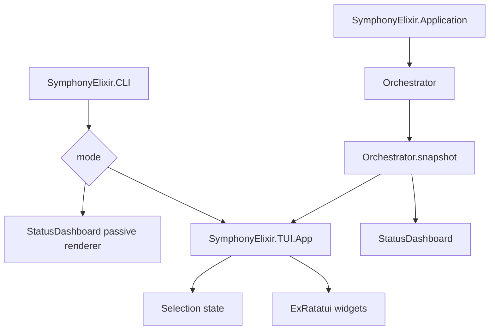

# feature: Add interactive TUI CLI alongside status dashboard

## Summary

Add a new ExRatatui-powered interactive CLI alongside Symphony's existing passive terminal dashboard. The first version should visually match the current `StatusDashboard` shape as closely as practical, but add keyboard interaction for selecting active agents with `j`/`k` and arrow keys. The web dashboard and current CLI renderer remain intact.

## Problem Frame

The current CLI is a passive GenServer renderer: it polls orchestrator snapshots, formats one full ANSI string, clears the terminal, and writes the frame. That works for monitoring, but it has no terminal event loop, selection state, focus model, or future path for live log panes, pausing agents, messaging agents, or split panes.

The first slice should establish the TUI foundation without collapsing the existing implementation into it. This plan uses the brainstorm as the source of truth and keeps profile switching deferred (see origin: `docs/brainstorms/2026-05-11-interactive-cli-requirements.md`).

## Requirements

- R1. Add a new interactive CLI implementation under a separate TUI module/folder boundary.
- R2. Keep the existing passive CLI/status dashboard working as-is by default.
- R3. Keep the Phoenix web dashboard working as-is, with only narrow shared helper extraction if duplication becomes real.
- R4. Make the first TUI screen look like the current status dashboard: header metrics, running agents table, and backoff queue.
- R5. Support agent selection with `j`, `k`, up arrow, and down arrow.
- R6. Keep the first TUI slice current-project only.
- R7. Avoid provider-specific UI concepts in the new TUI boundary.
- R8. Add tests for dependency wiring, rendering, state transitions, and CLI option behavior.

## Scope Boundaries

- This plan does not implement profile/project switching. That is tracked in GitHub issue #6.
- This plan does not implement focused log view, pausing agents, or messaging agents yet; it creates the structure those features will use.
- This plan does not replace `SymphonyElixir.StatusDashboard`.
- This plan does not change the existing `agents` script default until the user explicitly confirms the new CLI should become default.

## Context & Research

### Local Patterns

- `elixir/lib/symphony_elixir/status_dashboard.ex` owns passive terminal rendering and already has pure formatting helpers plus snapshot tests.
- `elixir/lib/symphony_elixir/cli.ex` owns escript argument parsing, workflow/log/port setup, and application startup.
- `elixir/lib/symphony_elixir.ex` starts `StatusDashboard` unconditionally in the OTP supervision tree.
- `elixir/lib/symphony_elixir_web/presenter.ex` already projects orchestrator state for the web API and dashboard.
- `elixir/lib/symphony_elixir_web/live/dashboard_live.ex` contains local agent-log path, read, and parse logic that should be extracted later when the TUI log view is built.
- Existing dashboard coverage lives in `elixir/test/symphony_elixir/status_dashboard_snapshot_test.exs` and `elixir/test/symphony_elixir/orchestrator_status_test.exs`.
- CLI option behavior is covered in `elixir/test/symphony_elixir/cli_test.exs`.

### External References

- ExRatatui v0.9.0 is the current package version on Hex and supports local TTY apps, supervised `ExRatatui.App` modules, key events, widget rendering, and headless test mode.
- ExRatatui core docs: `https://hexdocs.pm/ex_ratatui/ExRatatui.html`
- ExRatatui app docs: `https://hexdocs.pm/ex_ratatui/0.9.0/ExRatatui.App.html`
- Hex package: `https://hex.pm/packages/ex_ratatui`

## Key Technical Decisions

- Use ExRatatui for the new interactive CLI: the expected roadmap includes split panes, live logs, focus management, text input, and richer interaction. A native key reader would become a private TUI framework.
- Keep the current `StatusDashboard` as the default passive renderer: this avoids a risky migration and preserves the existing scripts/tests while the TUI matures.
- Add the TUI behind an explicit opt-in entry path first, likely `--tui` on `bin/symphony` and `agents tui` in `scripts/agents`: this keeps the implementation alongside the current CLI without introducing a second release artifact.
- Disable only the passive terminal renderer in TUI mode: the web dashboard should still run, but `StatusDashboard` must not write to the same terminal while ExRatatui owns it.
- Reuse existing snapshot data rather than inventing a new domain model: the first TUI can adapt `Orchestrator.snapshot/2` and existing presenter functions, then extract shared helpers when log view work makes duplication real.

## Open Questions

### Resolved During Planning

- Should the new TUI replace the current CLI? No. It should live alongside it and remain opt-in for the first version.
- Should the first version include live logs? No. The first version should look like the current CLI and add agent selection only.
- Should profile switching be part of the first implementation? No. It is deferred to issue #6.

### Deferred to Implementation

- Exact command spelling: prefer `--tui` and `agents tui`, but implementation can choose the least invasive spelling if the existing parser or script shape suggests a better local fit.
- Exact ExRatatui layout widgets: choose during implementation after confirming the widget API in v0.9.0, but preserve the current dashboard's visual hierarchy.
- Whether to share current `StatusDashboard` formatting helpers immediately or duplicate small presentational pieces in the TUI until common helper extraction is justified.

## High-Level Technical Design

The new implementation should sit under a TUI namespace and consume the same runtime data as the current dashboard:

The TUI app owns keyboard state and rendering. The existing `StatusDashboard` owns passive terminal output. The web dashboard remains independent.

## Implementation Units

### U1. Add TUI Dependency and Opt-In Startup Path

**Goal:** Install ExRatatui and provide an opt-in way to start the new TUI without changing the existing passive CLI default.

**Requirements:** R1, R2, R8

**Dependencies:** None

**Files:**
- Modify: `elixir/mix.exs`
- Modify: `elixir/mix.lock`
- Modify: `elixir/lib/symphony_elixir/cli.ex`
- Modify: `scripts/agents`
- Test: `elixir/test/symphony_elixir/cli_test.exs`

**Approach:**
- Add `{:ex_ratatui, "~> 0.9"}` to dependencies.
- Add an explicit TUI mode to the CLI entrypoint while preserving all current arguments.
- Add an `agents tui` convenience path that passes through the same workflow/log/port setup as the current foreground command.
- Do not make `agents` default to the TUI in this unit.

**Test scenarios:**
- Existing CLI tests still pass for version, guardrail acknowledgement, workflow path, logs root, and port parsing.
- `--tui` mode starts through the same validated workflow path as passive mode.
- Invalid `--tui` combinations return the existing usage/error style.
- `agents tui` assembles a foreground command and does not use `--bg` semantics.

**Verification:**
- `mix deps.get` resolves ExRatatui.
- `mix compile` succeeds with the new dependency.

### U2. Prevent Terminal Renderer Contention in TUI Mode

**Goal:** Ensure the passive `StatusDashboard` does not write frames while ExRatatui owns the terminal.

**Requirements:** R1, R2, R3, R8

**Dependencies:** U1

**Files:**
- Modify: `elixir/lib/symphony_elixir.ex`
- Modify: `elixir/lib/symphony_elixir/cli.ex`
- Test: `elixir/test/symphony_elixir/cli_test.exs`
- Test: `elixir/test/symphony_elixir/orchestrator_status_test.exs`

**Approach:**
- Add a small runtime configuration switch for passive dashboard terminal rendering, set only by TUI startup.
- Keep `StatusDashboard`'s existing behavior unchanged when the switch is absent.
- Keep `HttpServer` and Phoenix observability dashboard enabled unless the workflow itself disables observability.

**Test scenarios:**
- Passive mode still starts with `StatusDashboard` enabled.
- TUI mode sets the passive dashboard terminal renderer disabled before application startup.
- `StatusDashboard.format_snapshot_content_for_test/2` and existing snapshot tests remain unaffected.
- The offline marker behavior remains unchanged for passive shutdown paths.

**Verification:**
- Existing status dashboard snapshot tests pass unchanged.

### U3. Create TUI Module Boundary and Initial App Shell

**Goal:** Add the new TUI namespace and a minimal ExRatatui app that can render a current-project status screen.

**Requirements:** R1, R4, R6, R7, R8

**Dependencies:** U1, U2

**Files:**
- Create: `elixir/lib/symphony_elixir/tui/app.ex`
- Create: `elixir/lib/symphony_elixir/tui/state.ex`
- Create: `elixir/lib/symphony_elixir/tui/snapshot_source.ex`
- Create: `elixir/lib/symphony_elixir/tui/widgets/status_screen.ex`
- Test: `elixir/test/symphony_elixir/tui/app_test.exs`
- Test: `elixir/test/symphony_elixir/tui/status_screen_test.exs`

**Approach:**
- Use `ExRatatui.App` with local transport for foreground TUI mode.
- Keep app state small: current snapshot, selected index, terminal size or frame-derived layout, and last refresh metadata.
- Fetch current-project data from `Orchestrator.snapshot/2`; do not introduce multi-project/profile state.
- Render the same top-level sections as the current dashboard: status header, running agents, backoff queue.

**Test scenarios:**
- Headless ExRatatui test terminal renders a status frame containing `SYMPHONY STATUS`, agent count, project, running section, and backoff queue.
- Empty snapshot renders cleanly with no active agents and no selected row crash.
- Snapshot error/unavailable state renders an unavailable marker.
- The TUI app can mount in test mode without a real TTY.

**Verification:**
- TUI tests pass in non-interactive CI using ExRatatui test mode.

### U4. Add Agent Selection State and Key Handling

**Goal:** Make active agents selectable with `j`/`k` and arrow keys while preserving the current dashboard-like display.

**Requirements:** R4, R5, R6, R7, R8

**Dependencies:** U3

**Files:**
- Modify: `elixir/lib/symphony_elixir/tui/app.ex`
- Modify: `elixir/lib/symphony_elixir/tui/state.ex`
- Modify: `elixir/lib/symphony_elixir/tui/widgets/status_screen.ex`
- Test: `elixir/test/symphony_elixir/tui/state_test.exs`
- Test: `elixir/test/symphony_elixir/tui/app_test.exs`
- Test: `elixir/test/symphony_elixir/tui/status_screen_test.exs`

**Approach:**
- Normalize key events into small domain actions such as `:select_next`, `:select_previous`, and `:quit`.
- Clamp selection to the available running-agent rows.
- Reset or clamp selection when the running-agent list changes between refreshes.
- Render a visible selection marker or highlighted row without changing table columns more than necessary.

**Test scenarios:**
- `j` selects the next running agent.
- Down arrow selects the next running agent.
- `k` selects the previous running agent.
- Up arrow selects the previous running agent.
- Selection at the first row stays at the first row when moving up.
- Selection at the last row stays at the last row when moving down.
- Selection is cleared or clamped safely when the running list becomes empty.
- Rendered output visibly distinguishes the selected row.

**Verification:**
- Headless app tests inject key events and assert selected row changes.

### U5. Wire Refresh and Exit Behavior

**Goal:** Keep the TUI display fresh and make exit behavior predictable.

**Requirements:** R1, R2, R4, R8

**Dependencies:** U3, U4

**Files:**
- Modify: `elixir/lib/symphony_elixir/tui/app.ex`
- Modify: `elixir/lib/symphony_elixir/tui/snapshot_source.ex`
- Test: `elixir/test/symphony_elixir/tui/app_test.exs`

**Approach:**
- Refresh snapshots on a timer aligned with existing observability refresh settings.
- Also refresh when the app receives observability update messages if that can be done without coupling tightly to Phoenix LiveView code.
- Support `q` and Ctrl-C-compatible shutdown behavior through ExRatatui where practical.
- Keep TUI shutdown from stopping background/systemd services unexpectedly; it should behave like leaving the foreground passive CLI.

**Test scenarios:**
- Timer refresh updates the stored snapshot.
- Selection survives refresh when the selected agent still exists.
- Selection clamps when the selected agent disappears.
- `q` exits the TUI app cleanly in test mode.

**Verification:**
- Manual smoke test can start `agents tui`, see the dashboard-like screen, navigate active agents, and quit.

### U6. Preserve Existing Dashboard and Script Behavior

**Goal:** Confirm that adding the TUI did not regress passive CLI, web dashboard, or service/background flows.

**Requirements:** R2, R3, R8

**Dependencies:** U1-U5

**Files:**
- Modify as needed: `scripts/agents`
- Test: `elixir/test/symphony_elixir/status_dashboard_snapshot_test.exs`
- Test: `elixir/test/symphony_elixir/orchestrator_status_test.exs`
- Test: `elixir/test/symphony_elixir/extensions_test.exs`

**Approach:**
- Treat existing snapshot fixtures as regression guards for the passive CLI.
- Keep web presenter/API tests unchanged unless a narrow shared helper extraction requires test updates.
- Confirm `agents`, `agents all`, `agents --bg all`, and `agents stop` keep their current meanings.

**Test scenarios:**
- Current passive CLI snapshot fixtures are unchanged.
- Phoenix observability API/dashboard tests still pass.
- `agents` still starts the passive foreground command.
- `agents tui` starts only the new TUI foreground path.
- `agents --bg all` does not start a foreground TUI.
- `agents stop` still stops configured services.

**Verification:**
- `mix test`
- `mix compile`
- `mix format --check-formatted`
- `mix lint`

## Suggested Commit Plan

- `Add TUI dependency`
- `Add TUI startup mode`
- `Create TUI app shell`
- `Render TUI status screen`
- `Add TUI agent navigation`
- `Preserve CLI defaults`

Each commit should include focused tests before moving to the next unit.

## Risks

- ExRatatui is young and uses Rust NIFs. Mitigate by keeping the TUI opt-in and using its headless test mode before changing defaults.
- Passive dashboard contention can make the terminal unreadable if disabled too late. Mitigate by setting TUI mode before `Application.ensure_all_started/1`.
- Visual parity with the existing CLI may be limited by widget APIs. Mitigate by prioritizing section order, labels, data, and row density over byte-for-byte ANSI output.
- Adding a dependency may affect release packaging. Mitigate by verifying `mix compile`, `mix test`, and escript build before PR.

## Implementation Notes

- Do not move or rewrite `SymphonyElixir.StatusDashboard` during this first slice.
- Keep provider-specific names out of TUI module names and UI labels where a generic agent/tracker term already exists.
- Prefer simple state transition functions that can be tested without a terminal.
- Use ExRatatui headless test support for rendering assertions instead of relying on manual terminal captures.
