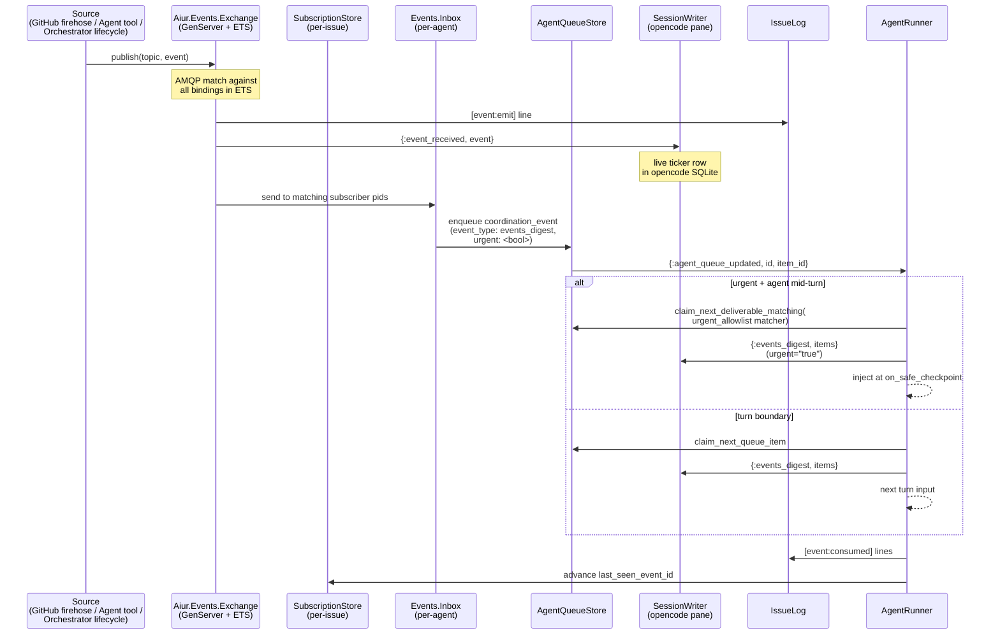
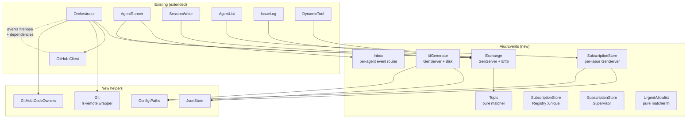

# feat: Aiur event system foundation (Ticket A)

## Overview

Implement the cross-ticket event publishing + subscription system described in the brainstorm's Ticket A scope. Adds an AMQP-topic-exchange routing layer (`Aiur.Events.Exchange`) on top of the existing `Aiur.PubSub`, persistent monotonic event IDs (`Aiur.Events.IdGenerator`), per-issue subscription state (`Aiur.Events.SubscriptionStore`), GitHub `/repos/{owner}/{repo}/events` firehose + `git ls-remote` low-latency override, native GitHub issue-dependencies API integration (`aiur_declare_blocker` / `aiur_unblock` tools), and the visibility surfaces the operator and agents need (per-issue log markers, opencode pane inject via `SessionWriter`, agent-list `Latest` column with dual emoji slot, open-attentions expand).

Tickets B (alerts.yaml v2 + `Aiur.Alerts` glob refactor) and C (dashboard parity + cleanup) are out of scope and tracked as separate plans.

---

## Problem Frame

Today an agent sees only its own ticket. If issue 1 blocks 2 blocks 3, the agent on 3 has no signal when 1 lands — it polls or is told manually by the operator. Aiur already has Phoenix.PubSub (`Aiur.PubSub`), per-agent topics, `IssueLog`, `Aiur.Alerts` with sound playback, multi-machine worker support via `worker_host`, and a 5-second orchestrator tracker poll. The missing layer is **cross-ticket subscription**, a small set of new event sources (GitHub firehose, agent-emitted `emit_event`), and the surfaces that make event flow visible to agents and the operator.

The brainstorm settled the contracts (topic namespace, agent vocab allowlist, payload shape, sanitization order, at-least-once cursor semantics) and the architectural model (AMQP topic exchange via custom ETS+GenServer, GitHub native issue-dependencies REST API, mid-turn checkpoint drain for blocking-critical events, `SessionWriter` inject for opencode pane visibility). This plan turns those contracts into an implementable sequence.

(see origin: `docs/brainstorms/2026-05-24-aiur-event-publishing-subscriptions-requirements.md`)

---

## Requirements Trace

- R1. New `Aiur.Events.Exchange` implements AMQP topic-exchange semantics on ETS + GenServer; coexists with `Aiur.PubSub` (literal per-agent topics) without conflict
- R2. `Aiur.Events.IdGenerator` persists `last_id` to disk for restart-safe monotonic event IDs (replaces `:erlang.unique_integer([:positive, :monotonic])` for event IDs only)
- R3. `Aiur.Events.SubscriptionStore` per-issue GenServer owns reads/writes to `<logs-root>/<repo>.<id>.subscriptions.json` via atomic-rename writes
- R4. GitHub `/events` firehose with `If-None-Match` ETag polling integrates into orchestrator's existing `:run_poll_cycle`; rate-limit-free on 304; respects `X-Poll-Interval`
- R5. `git ls-remote origin <running-branches>` low-latency push override runs on the same poll tick; dedups with firehose by `(repo, ref, sha)`
- R6. Native GitHub issue-dependencies REST API integration: orchestrator polls `/dependencies/blocked_by` + `/dependencies/blocking` per running issue; firehose does NOT carry these events
- R7. New agent tools: `emit_event(name, message, payload?)`, `emit_alert(name, message)`, `aiur_subscribe(topic_pattern)`, `aiur_unsubscribe(topic_pattern)`, `aiur_declare_blocker(issue_number)`, `aiur_unblock(issue_number)`
- R8. Agent emit allowlist locked to: `progress.<slug>`, `decision.<slug>`, `blocked`, `unblocked`, `attention.<slug>`, `attention.resolved`, `pause.request`, `custom.<slug>`
- R9. Asymmetric auto-subscription on `blocked_by`: blockee gets actionable subset of blocker (+ CODEOWNERS-filtered comments); blocker gets only blockee's `agent.blocked`/`agent.unblocked`
- R10. Universal auto-subscription to `system.<default-branch>.branch.push`; base branch resolved via `gh repo view --json defaultBranchRef`
- R11. Payload sanitization pipeline: CODEOWNERS author allowlist (with team/org expansion via `read:org`), per-field truncation (commit subjects 200ch, comment/review bodies 500ch), `<external-content source="github" author="…">` wrapper, secret-regex redaction
- R12. CODEOWNERS resolution: parse `.github/CODEOWNERS`; expand `@org/team` and `@org` entries via GitHub API; refresh on `events.codeowners_refresh_seconds` schedule (default 3600); always include the orchestrator's own `bot_account` in the allowlist (fail-closed never locks the system out)
- R13. Turn-boundary digest delivery rides existing `Aiur.AgentQueue` infrastructure as `category: :coordination_event` with `event_type: :events_digest`
- R14. Mid-turn checkpoint drain delivers a narrow allowlist of blocking-critical events (`ticket.<blocker>.branch.{push,force-push}`, `ticket.<blocker>.agent.unblocked`, `ticket.<blocker>.agent.decision.*`) at the next safe checkpoint inside a turn; `<aiur:events urgent="true">` framing
- R15. At-least-once delivery contract: cursor advances after consumption checkpoint completes; renderer dedupes by event `id`; urgency flag persists with queue item so redelivery preserves `urgent="true"` framing
- R16. Bootstrap-on-subscription-creation uses **JetStream-style lifecycle split** sourced from `IssueLog.disk_history/2`: fresh subscriptions (`last_seen_event_id == nil`) replay events with `id > subscription_created_at_event_id` (an `IdGenerator.peek()` snapshot stored at binding-creation time, not wall-clock — eliminates clock-skew entirely); resuming subscriptions (`last_seen_event_id != nil`) replay with `id > last_seen_event_id`
- R17. New per-issue log markers `[event:emit]`, `[event:emit:alert]`, `[event:consumed]`, `[event:self]` extend `Aiur.IssueLog` with matching `disk_history` parse + role mapping; single log line per event (no doubled `[alert]` row)
- R18. `Aiur.Opencode.SessionWriter` gains two new `handle_info` clauses: `{:event_received, event}` (live-ticker, one system-role row per event) and `{:events_digest, items}` (turn-consumption marker); no opencode source modifications
- R19. Agent-list adds `Latest` column on far right (existing columns + order unchanged); State column expands to dual emoji slot (existing status + reserved `❗` slot); `Enter` on a row expands open-attentions detail with slug + message + emit timestamp
- R20. `❗` shows in the second State emoji slot while `open_attentions` MapSet is non-empty; renders as `❗N` when N > 1; clears only on `attention.resolved` matching emission, never on operator pane-open
- R21. Custom event quota: max `events.custom_events_per_turn_max` (default 5) `custom.*` emissions per turn; subsequent calls return tool error
- R22. Block/unblock state debounce: `agent.blocked`/`agent.unblocked` arriving within `events.block_state_debounce_seconds` (default 10) collapse to latest-wins in subscriber digests; both still hit per-issue log for audit
- R23. Configuration: clean rename `polling.interval_ms` → `polling.interval_seconds` (no deprecation alias); new `events.*` section with `block_state_debounce_seconds`, `custom_events_per_turn_max`, `codeowners_refresh_seconds`
- R24. Shared agent prompt (`elixir/prompts/shared-agent-instructions.md`) gains six reflex rules: events between turns, blocking-others-is-highest-priority, temp-unblock-yourself, you-can-re-block, close-attentions-you-open, subscribing-to-more, search-before-expanding-scope
- R25. New `.claude/skills/aiur/` skill with 5 reference docs (`overview.md`, `event-taxonomy.md`, `emit-and-subscribe.md`, `attention-and-resolve.md`, `stub-then-fetch.md`); `.codex/skills/aiur` symlink for runtime parity
- R26. `aiur --test` CLI flag with 4 required safety guards (pinned ticket IDs via `.aiur-test-tickets.json`, clean-git-tree via `git status --porcelain`, expected git remote, dry-run by default with `--confirm` opt-in)
- R27. 3-ticket sandbox scaffold lives at `elixir/lib/aiur/sandbox/event_flow_demo.ex` + three `event_flow_unrelated_N.ex` siblings; baseline files restored by `aiur --test`
- R28. End-to-end feature spec at `elixir/test/aiur/regression/event_flow_e2e_test.exs` exercises 3-agent coordination against a mocked GitHub firehose

**Origin actors:** A1 (operator), A2 (agent — Codex backend running through opencode pane), A3 (orchestrator)
**Origin flows:** F1 (blockee receives push event from blocker → fetches + integrates), F2 (agent emits attention → operator sees ❗ → operator replies → agent resolves), F3 (agent discovers mid-work that it's blocked → declares via `aiur_declare_blocker` → auto-subscribes → receives bootstrap replay)
**Origin acceptance examples:** AE1 (3-ticket end-to-end manual test, covers R1-R28)

---

## Scope Boundaries

- No git hook installation on workspaces — firehose + `git ls-remote` cover push detection across single-machine and SSH workers (per origin: "No git hooks in v1")
- No GitHub webhook endpoint (`/aiur/github/webhook`) — requires public Aiur URL; firehose + per-issue dependency poll handles everything
- No transitive subscription propagation — info propagates hop-by-hop (1→2→3 chain works without it)
- No operator force-drain UI for agents on long turns — mid-turn checkpoint drain handles the load-bearing case
- No restoration of dashboard chat-log historical read (`Aiur.AgentLog.parse` path drifted with opencode rewrite)
- No Tailscale serve URL re-point (one-line operator config, not code)

### Deferred to Follow-Up Work

- Ticket B (alerts refactor): glob-keyed `alerts.yaml` v2 + `Aiur.Alerts` matching layer refactor + orchestrator `Alerts.emit_system` callsite migration + authoritative-event-wins rules (drop `chat.send`-as-noise, PR-merge sound on `pr.merged`) — depends on Ticket A's topic shape and `Aiur.Events.Topic.matches?/2` matcher
- Ticket C (dashboard parity + cleanup): events panel (per-issue + firehose tabs) + open-attentions chips on dashboard rows + dashboard write-parity verification + startup credential gate + CSRF defense + compile-warning cleanup in `lib/aiur/opencode/attach_pool.ex` and `lib/aiur/agent_list/app.ex` — depends on Ticket A's event publishing; parallel-with Ticket B

---

## Context & Research

### Relevant Code and Patterns

- **Supervision tree**: `elixir/lib/aiur.ex` — `Aiur.Application.start/2` registers all named Registries and DynamicSupervisors; new Ticket A children (`Aiur.Events.Exchange`, `Aiur.Events.IdGenerator`, `Aiur.Events.SubscriptionStore.Registry`, `Aiur.Events.SubscriptionStore.Supervisor`) slot in after `{Phoenix.PubSub, name: Aiur.PubSub}` and before `Aiur.Orchestrator`
- **AMQP-style ETS registry precedent**: `elixir/lib/aiur/opencode/token_registry.ex` — `:named_table, :public, read_concurrency: true` ETS owned by a GenServer; `ensure_table/0` lazy init; lookup bypasses GenServer for hot path
- **Per-key GenServer + Registry pattern**: `elixir/lib/aiur/issue_log.ex` — `{:via, Registry, {Aiur.IssueLog.Registry, identifier}}`, `restart: :transient`, idempotent `attach/1`. `Aiur.Events.SubscriptionStore` mirrors this exactly
- **Orchestrator poll integration**: `elixir/lib/aiur/orchestrator.ex:153` (`:run_poll_cycle`) + `maybe_dispatch/1:302` + `sync_polled_issue_state/2:629` + `emit_dependency_transition_events/3` + `enqueue_dependency_event/4:733` — DIRECT PRECEDENT for diff-then-enqueue-coordination-event for cross-issue events
- **Coordination event queue**: `elixir/lib/aiur/agent_queue.ex` + `agent_queue_item.ex:8` (already has `category: :coordination_event`, `event_type`, `dedupe_key`, `causal_refs`, `subscription` fields — no schema change needed); `agent_queue_store.ex:87` (`claim_next_deliverable_matching/3` — already accepts a matcher closure for the mid-turn allowlist)
- **Mid-turn checkpoint hook**: `elixir/lib/aiur/agent_runner.ex` `safe_checkpoint_handler/2` is passed into `CodingAgent.run_turn` as `on_safe_checkpoint` — when codex reaches a safe checkpoint, the handler claims the next matching item via `Orchestrator.claim_next_checkpoint_queue_item/2`. Ticket A's allowlist matcher fits here
- **Turn-boundary drain**: `elixir/lib/aiur/agent_runner.ex:344` (`drain_operator_messages/5` after `CodingAgent.run_turn` returns) + `queue_item_text/1:609` (already has `:coordination_event` branch). Extend to recognize `event_type: :events_digest` and format with `<aiur:events>` wrapper
- **Codex dynamic tool pattern**: `elixir/lib/aiur/codex/dynamic_tool.ex` — module attributes for tool name + description + input schema; `tool_specs/0` exposes the list; `execute/3` dispatches per name; injection via closures in `AgentRunner.tool_executor/3:760`. All new Ticket A tools follow this exact pattern
- **GitHub HTTP client**: `elixir/lib/aiur/github/client.ex` — `Req`-based, `request_fun:` injection for tests, fixed headers (`Authorization: Bearer`, `Accept: application/vnd.github+json`, `X-GitHub-Api-Version`); pagination per-call; `client_module/0` indirection via `Application.get_env(:aiur, :github_client_module, Client)` gives end-to-end test seam
- **`SessionWriter` write+nudge flow**: `elixir/lib/aiur/opencode/session_writer.ex:116-144` — `handle_info({:transcript_event, %{role: :user}}, …)` skip, `{:transcript_event, event}` write+nudge, `{:alert, event}` write+nudge. Ticket A adds two new clauses: `{:event_received, event}` (live ticker) and `{:events_digest, items}` (consumed-digest marker). Write path: `write_event/2` → `Db.with_conn` → `insert_body_parts/6` → `nudge_tui/2` (POSTs synthetic user with `__aiur_stream__:<msg_id>` marker)
- **Agent-list TUI columns**: `elixir/lib/aiur/agent_list/renderer.ex` — `compute_layout/2:578`, `table_header_row/2:350`, `render_row/5:397` are the three places to extend for the `Latest` column + dual emoji slot; `Aiur.AgentList.App.handle_cast(:toggle_help, …):420` is the precedent for the open-attentions expand toggle key handler
- **Config schema additions**: `elixir/lib/aiur/config/schema.ex` — add new `defmodule Events do … embedded_schema … end` and `embeds_one(:events, Events, …)`; `Aiur.Config` accessor function; `Aiur.WorkflowStore` hot-reloads on file mtime change
- **CLI flag pattern with safety guards**: `elixir/lib/aiur/cli.ex:16-23,80,85` — `OptionParser.parse` with `strict:`, `require_guardrails_acknowledgement/1` is the only existing "scary flag" precedent

### Institutional Learnings

- **SessionWriter race bugs from PR #83 / commit `6832d29` and commit `ad2f1b5`**: strict pattern matches on async results crashed sibling slots. Apply `case` not `:ok =` everywhere new SessionWriter paths are added. Shared SQLite is a serialization bottleneck under fan-out — reuse `Db.with_transaction/1` and caller-owned connection variants when writing bursts of event rows
- **PR #96 (SlotRegistry collapse, commit `e14e02d`)**: one `:changed` broadcast + ETS re-read beats N mirrored state copies. For the event system, prefer "broadcast `topic.K.changed`; consumers re-read SubscriptionStore via ETS lookup helper" over mirroring subscription state in multiple GenServers
- **Orphan writer accumulation (rel-1 from `.context/ce-code-review/20260523-115650-b4478663/reliability.json`)**: when a slot's opencode-serve rebuilds, the old SessionWriter persists. Lifecycle teardown must be explicit, not "shutdown-only `delete_all`". Apply to `SubscriptionStore`: terminate when issue reaches terminal state, not just on application stop
- **Synchronous `GenServer.call` inside cast handlers (`AttachPool.do_seed` precedent)**: 5 slots × 2 removals × 5s call = 50s mailbox stall, every concurrent call returns `:miss`. `Aiur.Events.Exchange.publish/2` must use `send/2` (asynchronous fanout); never call into subscribers synchronously
- **Unsupervised `Task.start` (rel-4 same review batch)**: relied on the Task to send cleanup; if Task crashed the bookkeeping leaked forever. For event-delivery Tasks (bootstrap-on-subscribe digests, mid-turn drain), use `Task.Supervisor.async_nolink` (via `Aiur.TaskSupervisor`) with a monitor and a `handle_info({:DOWN, ...})` cleanup clause
- **Duplicate-key registry + `Enum.find_value` lookup is non-deterministic (adversarial finding)**: `SessionWriterRegistry.lookup/1` can return any of multiple writers. Ticket A's `Aiur.Events.SubscriptionStore.Registry` MUST be `:unique` (one writer per issue); resist any urge to make it `:duplicate`
- **No `docs/solutions/` exists yet** — after Ticket A lands, run `/ce-compound` to seed entries for: (a) Exchange ETS-with-GenServer-owner pattern, (b) atomic-rename JSON write convention, (c) firehose-on-poll-tick with ETag + ls-remote override, (d) `IssueLog` row-marker convention

### External References

- **AMQP 0-9-1 topic exchange spec** (https://www.rabbitmq.com/tutorials/tutorial-five-elixir, https://www.rabbitmq.com/docs/exchanges): `*` matches exactly one word, `#` matches zero or more words. Edge cases NOT pinned in spec (treat as test fixtures): empty segments (`a..b`), empty routing key, multiple `#` in same pattern (`#.foo.#`), `#` at start/end. **Backtracking matcher required** for `#` — LavinMQ blog post (https://lavinmq.com/blog/rewriting-lavinmqs-topic-exchange) flags this as the bug-magnet
- **GitHub Issue Dependencies REST API** (https://docs.github.com/en/rest/issues/issue-dependencies?apiVersion=2026-03-10): four endpoints — `GET /repos/{owner}/{repo}/issues/{issue_number}/dependencies/blocked_by`, `POST /repos/.../dependencies/blocked_by` (body `{"issue_id": int}` — internal ID, not number), `DELETE /repos/.../dependencies/blocked_by/{issue_id}`, `GET /repos/.../dependencies/blocking`. Permissions: Issues:read (poll), Issues:write (declare/remove). 422 is catch-all for cycle/duplicate (don't rely on cycle detection — implement client-side pre-check). **Dependency add/remove fires on a separate `issue_dependencies` webhook, NOT on the events firehose** — orchestrator MUST poll `/dependencies/*` per running issue
- **GitHub Repo Events API** (https://docs.github.com/en/rest/activity/events): 300-event cap (30/page × 10 pages); eventual consistency up to **6 hours** (not 5 minutes — that was the deprecated global firehose); `If-None-Match` ETag returns 304 with no rate-limit cost; `X-Poll-Interval` response header (obey it); `PushEvent.commits[]` **truncates silently at 20** (check `size` vs `commits.length` to detect)
- **Origin brainstorm**: `docs/brainstorms/2026-05-24-aiur-event-publishing-subscriptions-requirements.md` — the source of truth for every contract this plan implements

---

## Key Technical Decisions

- **AMQP topic exchange on ETS + GenServer (not Phoenix.PubSub extension)**: Phoenix.PubSub matches topics literally only. The new `Aiur.Events.Exchange` is additive — Phoenix.PubSub continues to handle literal per-agent topics (`agent:<identifier>`, `agents:running`, etc.). Two systems, one event firing on both when needed
- **Pure-function matcher in `Aiur.Events.Topic`, separate from Exchange GenServer**: matcher is `matches?(pattern, topic) :: boolean()` — pure, testable, callable from `Aiur.Alerts` (Ticket B will use this for glob `alerts.yaml` keys). Exchange wraps it with ETS-backed subscription registry
- **Bootstrap replay window — JetStream-style lifecycle split**, not a single combined predicate. The earlier `(id > cursor) AND (emitted_at > subscription_created_at)` framing merged two semantics that no canonical pub/sub system (Kafka, RabbitMQ, NATS JetStream) combines in one expression. Aiur adopts the same lifecycle-split shape:
  - **Fresh subscription** (`last_seen_event_id == nil`): floor at `subscription_created_at_event_id` (an `IdGenerator.peek()` snapshot taken at `add_subscription/3` time, NOT wall-clock — eliminates NTP-step / leap-second / VM-clock-drift concerns entirely). Replay events with `id > subscription_created_at_event_id`. Analog to JetStream `DeliverPolicy: new` / Kafka `auto.offset.reset = latest`, but the floor is an event-ID, not a timestamp.
  - **Resuming subscription** (`last_seen_event_id != nil`): cursor-fenced — replay events with `id > last_seen_event_id`. Analog to Kafka committed-offset / JetStream `by_start_sequence`.
  - `subscription_created_at_event_id` is **persisted per-binding and never refreshed on SubscriptionStore restart** — that makes the floor permanent. Multiple manual subscriptions each carry their own `subscription_created_at_event_id` so adding a second binding doesn't pull events emitted between the first and second.
  - Replay source is `IssueLog.disk_history/2` (durable file re-parse with arbitrary `limit`), **not** the in-memory ring (`IssueLog.history/2`, capped at 100, volatile across restart). Earlier "ring (last 100)" wording was incorrect.
- **`IdGenerator` persistence — three-layer recovery with Snowflake reserve-before-return**. Layered by likelihood:
  1. **Happy path** (file present, valid): persist `last_id + batch_size` (e.g., `+50`) BEFORE issuing IDs from that batch — Snowflake-style reserve-before-return. A `kill -9` between writes loses at most one batch of *unused* IDs (gap in sequence); no issued ID can ever be reissued. Tolerates `terminate/2` not running on brutal kills.
  2. **Cold-boot fallback (file missing/corrupt)**: **unconditionally** scan `IssueLog.disk_history` across all per-issue logs for max event ID, then seed counter at `max(disk_max, System.system_time(:microsecond)) + safety_margin` (e.g., +1M microseconds). Not "if suspicious" — always. Cost is one filesystem walk per cold-boot; benefit is provable monotonicity even after NTP step-backwards, leap seconds, or VM clock drift (all of which OTP's `time_correction` docs warn can move wall-clock backward). Log a `Logger.warning` distinguishable from corrupt-file warning so operators correlate ID jumps to missing-file events.
  3. **Genuinely fresh install** (no `IssueLog`, no counter file): `System.system_time(:microsecond)` is the only floor. Wall-clock — not `System.monotonic_time` (which resets at BEAM start and would defeat the purpose).
  - `IdGenerator` runs on the **orchestrator node only**, never on worker SSH hosts. Worker nodes publish via RPC to the orchestrator. No multi-node coordination problem.
  - `aiur --test` reset (U25) **preserves** `<repo>.event_id` (does NOT delete it) — keeps cursors valid across test runs.
  - **Rejected alternatives**: `:erlang.unique_integer([:positive, :monotonic])` (per-BEAM-process; resets on restart); DETS (slow sync per-write); UUIDv7 RFC 9562 (sortable but not strictly monotonic across restarts; still needs counter for cursor contract); external Postgres/Redis sequence (overkill, adds runtime dep).
- **`Aiur.JsonStore` durability — fsync before rename**. Atomic-rename gives crash-consistency of the directory entry but not durability of file contents unless `:file.sync/1` runs on the FD before close+rename. On ext4 default `data=ordered` this happens to work for small files; on XFS it does not. Both `IdGenerator` and `SubscriptionStore` write through `JsonStore` so fsync is required for both.
- **Module namespace flat, not nested**: source modules go at `Aiur.Events.{Topic, Exchange, IdGenerator, SubscriptionStore, SubscriptionStoreSupervisor, Inbox, UrgentAllowlist, Publisher, GithubFirehose, GitLsRemote, Dependencies}`. No `Aiur.Events.Source.*` 3-level namespace (no precedent in the repo); no `subscription_store/supervisor.ex` 3-deep file path (no other module in `lib/aiur/` uses 3 levels). Matches `Aiur.GitHub.{Client, Tracker, Config}` + `Aiur.Opencode.{SessionWriter, SlotPolicy, SessionWriterRegistry}` flat-per-namespace convention.
- **Test file paths flat to match existing convention**: `elixir/test/aiur/events/*_test.exs` is defensible (8+ test files), but new tests outside `events/` flatten — `aiur/github_code_owners_test.exs`, `aiur/github_client_dependencies_test.exs` (matching existing `aiur/github_client_test.exs`), `aiur/config_paths_test.exs` (single-file subdirs unusual), `aiur/dynamic_tool_dependencies_test.exs` (matches existing `aiur/dynamic_tool_test.exs`).
- **`Aiur.Events.Publisher` shared helper**: extract from U10 the publish boundary (`IdGenerator.next_id + Exchange.publish`), the `(repo, ref, sha)` dedup table, and the contamination filter into one shared module. The three source helpers (`GithubFirehose`, `GitLsRemote`, `Dependencies`) become thin parsers that delegate to it. Resolves the previously-unspecified `Source.poll_all/1` reference and prevents the same logic being implemented three times.
- **Truncation standardization**: route Sanitizer's per-field truncation through `Aiur.EventHumanizerHelpers.truncate/2` (existing, public, `...` suffix). The repo currently has 4 parallel truncation helpers with 3 different suffixes (`event_humanizer_helpers.ex:33`, `linear/client.ex:375`, `workspace.ex:346`, `opencode/api_client.ex:103`). Don't introduce a 5th.
- **Cycle detection lives in `Aiur.GitHub.IssueDependencies`, not `DynamicTool`**. The `aiur_declare_blocker` cycle-check BFS belongs in a GitHub-domain module; `DynamicTool`'s `execute_aiur_declare_blocker/2` becomes a thin shim that delegates (mirrors `execute_linear_graphql/2` → `Aiur.Linear.Client`). Keeps `DynamicTool` lean even as 5 new tools land.
- **`tool_executor/3` passes a single `tools_context` map**, not 5+ separate keyword keys. With 7 tools (existing `emit_alert` + `linear_graphql` + new `emit_event`, `aiur_declare_blocker`, `aiur_unblock`, `aiur_subscribe`, `aiur_unsubscribe`), the existing per-tool keyword-key pattern doesn't scale. Replace with `%{event_publisher: fn, blocker_declarer: fn, ...}` map.
- **`Aiur.Config.Paths` consolidation includes `Aiur.LogFile`**: `LogFile.default_log_file/0,1` independently computes the same `<cwd>/log` path that `IssueLog.log_root_dir/0` computes. Real duplication. Fold `LogFile` callsites into `Aiur.Config.Paths.log_root_dir/0` as part of U3. Do NOT fold `AgentEventLog` / `AgentLog` / `Workspace.workspace_path` — those are workspace-relative paths, a different concern.
- **Urgency flag persists with queue item**: `AgentQueueItem` already supports arbitrary `event_type`. Add `urgent: boolean()` field (or encode in `event_type` value); renderer reads it at digest construction time so redelivery-after-crash preserves `urgent="true"` framing
- **`SubscriptionStore` registers bindings with `Exchange` on init (lazy per-issue), not Exchange-walks-all-files-on-boot**: avoids supervision-tree ordering pitfalls. Exchange holds the bindings ETS; each SubscriptionStore re-publishes its persisted bindings on `init/1` via `Exchange.subscribe/1`. Idempotent
- **CODEOWNERS fail-closed safety net**: always include the orchestrator's own `bot_account` (configured) in the resolved allowlist regardless of CODEOWNERS contents. If `read:org` scope is missing, log a `CRITICAL` warning and degrade to direct-user entries + the bot account. Never produce an empty allowlist. **`bot_account` is validated at orchestrator startup** — if missing, empty, or whitespace-only, refuse to start (matches HttpServer credential gate from Ticket C; treats misconfiguration as a deployment error rather than silent degradation). Author comparison uses **exact string equality**, never `String.contains?/2` (which would treat an empty bot_account as matching every author and silently bypass the whole filter).
- **Sanitization pipeline order: CODEOWNERS filter (drop entire event) → truncation → `<external-content>` wrap → secret regex**: filter cheap things first; only events that survive the CODEOWNERS gate run through the expensive regex. The `<external-content>` wrapper is structural defense-in-depth even for trusted authors
- **Single-writer pattern for the per-issue subscription file** mirroring `IssueLog.via/1` (`:unique` Registry + `restart: :transient` + DynamicSupervisor). Resist `:duplicate` registry temptation; the SessionWriterRegistry duplicate-key bug (adversarial finding) is the reason
- **`Aiur.JsonStore` extracted as a small helper** (atomic-rename writer + reader). Reused by `SubscriptionStore`, `IdGenerator`, the `aiur --test` `.aiur-test-tickets.json` reader, and likely Ticket C work. Place at `elixir/lib/aiur/json_store.ex`
- **`Aiur.Config.Paths` extraction**: `IssueLog.log_root_dir/0` becomes `Aiur.Config.Paths.log_root_dir/0`; both `IssueLog` and `SubscriptionStore` call into it (matching the brainstorm's resolved-question entry). Single source of truth for log/subscription/event-id directory resolution
- **`polling.interval_ms` → `polling.interval_seconds` is a hard rename, no deprecation alias**: matches origin's explicit decision and the user's "no-historical-comments" convention. Workflow YAML files migrate in the same commit; load-time validation fails loudly with a clear message if old key is present

---

## Open Questions

### Resolved During Planning

- **Topic dispatch model**: AMQP topic exchange via custom `Aiur.Events.Exchange` (decided in brainstorm; matches AMQP standards; reuses matcher for `alerts.yaml`)
- **GitHub dependency detection**: native REST API (decided in brainstorm; verified in research that webhook `issue_dependencies` is NOT in events firehose, so per-issue polling is the v1 path)
- **Bootstrap replay window**: JetStream-style lifecycle split (fresh: time-fenced from `subscription_created_at`; resuming: cursor-fenced), sourced from `IssueLog.disk_history/2` (not the volatile in-memory ring). Replaces the earlier ORed-predicate framing (resolved per external standards research; standards over custom)
- **Urgency framing on redelivery**: persist with queue item via dedicated field (resolved here to prevent flow-analyzer finding #14)
- **CODEOWNERS fail-closed escape hatch**: always include bot account; never empty allowlist (resolved here to prevent flow-analyzer finding #21)
- **Tool-call boundary for mid-turn drain**: reuse existing `on_safe_checkpoint` callback contract in `CodingAgent.run_turn`; "between tool result and next tool call" is what opencode's existing safe-checkpoint semantics already deliver (resolved by inheriting existing contract)
- **Supervision ordering**: Exchange starts before any SubscriptionStore; SubscriptionStores re-register bindings lazily on `init/1` (resolved here)

### Deferred to Implementation

- **Exact matcher caching strategy** (precompiled regex per binding vs. recursive matcher per call): benchmark during implementation; default to recursive matcher first, add caching only if a microbenchmark shows >5% CPU on the publish path
- **GitHub `read:org` token scope verification at startup**: how loud to make the warning when scope is missing — `Logger.critical` + visible CLI banner on next operator interaction. Exact UX deferred
- **Sandbox file initial content for the test scaffold**: the brainstorm specifies function signatures and test assertion shape, but the exact initial-baseline content (what `event_flow_demo.ex` looks like *before* any agent has touched it) is best decided when writing the `aiur --test` restore step — likely an empty module body that the agents flesh out
- **Manual GitHub test ticket creation**: operator-side step. Plan documents the labels and titles; actual `gh issue create` calls are run by the operator (or scripted) during first end-to-end test. Cannot pre-create — issue numbers must come from GitHub
- **`PushEvent.commits[]` truncation handling**: when `size > 20`, the firehose drops detail. Plan emits the event with what we have + a `truncated: true` flag in the payload; agent prompt rules can mention "if truncated, fetch the branch to see full commits." Exact wording deferred
- **Exchange ETS table durability across crashes**: if Exchange crashes (rare; supervised), bindings are gone until SubscriptionStores re-register on their own restarts. Acceptable for v1; revisit if it bites

---

## Output Structure

```
elixir/
├── lib/
│   └── aiur/
│       ├── config/
│       │   ├── paths.ex                          # new — extracted log_root_dir/0
│       │   └── schema.ex                         # modified — Events embedded schema; Polling interval_seconds rename
│       ├── events/
│       │   ├── exchange.ex                       # new — AMQP topic exchange (GenServer + ETS)
│       │   ├── id_generator.ex                   # new — persistent monotonic counter
│       │   ├── inbox.ex                          # new — per-agent event → queue routing
│       │   ├── subscription_store.ex             # new — per-issue subscriptions JSON
│       │   ├── subscription_store/
│       │   │   └── supervisor.ex                 # new — DynamicSupervisor
│       │   ├── topic.ex                          # new — AMQP pattern matcher
│       │   └── urgent_allowlist.ex               # new — matcher for mid-turn drain
│       ├── git.ex                                # new — git ls-remote helper
│       ├── github/
│       │   ├── client.ex                         # modified — events firehose, dependencies, ETag
│       │   ├── code_owners.ex                    # new — CODEOWNERS parse + team/org expand
│       │   └── tracker.ex                        # modified — wire dependencies poll
│       ├── json_store.ex                         # new — atomic-rename helpers
│       ├── orchestrator.ex                       # modified — wire firehose + dependencies + ls-remote
│       ├── sandbox/
│       │   ├── event_flow_demo.ex                # new — sandbox baseline
│       │   ├── event_flow_unrelated_1.ex         # new
│       │   ├── event_flow_unrelated_2.ex         # new
│       │   └── event_flow_unrelated_3.ex         # new
│       ├── agent_runner.ex                       # modified — events_digest drain + urgent matcher
│       ├── agent_list/
│       │   ├── app.ex                            # modified — open-attentions expand state
│       │   ├── input.ex                          # modified — Enter key dispatch
│       │   └── renderer.ex                       # modified — Latest column + dual emoji slot
│       ├── codex/
│       │   └── dynamic_tool.ex                   # modified — emit_event, aiur_subscribe, aiur_declare_blocker, aiur_unblock
│       ├── opencode/
│       │   └── session_writer.ex                 # modified — :event_received + :events_digest handle_info
│       └── issue_log.ex                          # modified — [event:*] markers + parse update
├── prompts/
│   └── shared-agent-instructions.md              # modified — six reflex rules
├── test/
│   └── aiur/
│       ├── events/
│       │   ├── exchange_test.exs                 # new
│       │   ├── id_generator_test.exs             # new
│       │   ├── subscription_store_test.exs       # new
│       │   ├── topic_test.exs                    # new (AMQP edge-case fixture table)
│       │   └── urgent_allowlist_test.exs         # new
│       ├── github/
│       │   ├── code_owners_test.exs              # new
│       │   └── client_dependencies_test.exs      # new
│       ├── json_store_test.exs                   # new
│       └── regression/
│           └── event_flow_e2e_test.exs           # new — 3-agent integration
├── lib/mix/tasks/
│   └── aiur.config.workspace_root.ex             # new — helper for scripts/aiur
└── scripts/
    └── aiur                                       # modified — --test flag with 4 guards
.claude/skills/aiur/                              # new — skill + 5 reference docs
.codex/skills/aiur                                # new — symlink
.aiur-test-tickets.json                           # new — pinned IDs
```

---

## High-Level Technical Design

> *This illustrates the intended approach and is directional guidance for review, not implementation specification. The implementing agent should treat it as context, not code to reproduce.*

### Event publish + dispatch flow



### Module boundaries



---

## Implementation Units

### Phase 1 — Foundation modules

- [ ] U1. **`Aiur.Events.Topic` AMQP pattern matcher**

**Goal:** Pure matcher implementing AMQP 0-9-1 topic-exchange wildcard semantics (`*` = one segment, `#` = zero or more), backtracking required for `#`.

**Requirements:** R1

**Dependencies:** None

**Files:**
- Create: `elixir/lib/aiur/events/topic.ex`
- Test: `elixir/test/aiur/events/topic_test.exs`

**Approach:**
- `matches?(pattern, topic) :: boolean()` is the only public function
- Implementation splits both on `.` and recurses segment-by-segment; `#` is greedy-then-backtrack
- Edge cases that drive the fixture table: empty segments (`a..b`), empty routing key, multiple `#` in same pattern (`#.foo.#`), `#` at start (`#.error`), `#` at end (`task.#`), `*` at boundaries, pattern with no wildcards (acts as direct match)

**Execution note:** Test-first. Write the full edge-case fixture table from external research as the test suite, then implement the matcher to pass all of it.

**Patterns to follow:**
- Pure-function modules in `elixir/lib/aiur/agent_events.ex` (helpers only, no GenServer state)

**Test scenarios:**
- Happy path: `ticket.101.branch.push` matches pattern `ticket.101.branch.push` (literal)
- Happy path: `ticket.101.branch.push` matches `ticket.101.#`
- Happy path: `ticket.101.branch.push` matches `ticket.*.branch.push`
- Happy path: `ticket.101.branch.push` matches `*.*.branch.push`
- Edge case: `lazy` matches `lazy.#` (`#` matches zero words)
- Edge case: `lazy.orange.elephant` matches `lazy.#`
- Edge case: `quick.lazy.fox` does NOT match `lazy.#` (prefix must match)
- Edge case: `quick.orange` does NOT match `*.orange.*` (`*` requires exactly one word)
- Edge case: `orange` does NOT match `*.orange.*` (three segments required)
- Edge case: empty routing key matches only `#` alone
- Edge case: `a..b` matches `a.*.b` (empty segment is a word)
- Edge case: `a.b.c.d.e` matches `#.foo.#` returns false (no `foo` in topic)
- Edge case: `x.foo.y` matches `#.foo.#`
- Edge case: `foo.error` matches `#.error`
- Edge case: 255-byte routing key (max length per spec) is accepted
- Error path: nil pattern or topic raises `FunctionClauseError`

**Verification:**
- All edge cases in the AMQP fixture table pass
- Matcher is pure: zero process state, zero ETS reads, callable from any context including tests with `async: true`

---

- [ ] U2. **`Aiur.JsonStore` atomic-rename helper**

**Goal:** Single source of truth for atomic JSON file writes (write `<file>.tmp`, then `File.rename/2`) and reads with graceful missing-file handling.

**Requirements:** R3

**Dependencies:** None

**Files:**
- Create: `elixir/lib/aiur/json_store.ex`
- Test: `elixir/test/aiur/json_store_test.exs`

**Approach:**
- `write!(path, term)` encodes to JSON, writes to `<path>.tmp`, renames; raises on failure
- `read(path, default \\ nil)` returns `{:ok, term}` on success, `{:ok, default}` on missing file, `{:error, reason}` on corrupt JSON or other failure
- No directory traversal protection — caller resolves paths via `Aiur.Config.Paths`
- Reused by `SubscriptionStore`, `IdGenerator`, `.aiur-test-tickets.json` reader

**Patterns to follow:**
- `Aiur.AgentEventLog.write/3` for the rescue/return pattern; differ in using atomic rename rather than append
- `Jason.encode!` + `Jason.decode` (already in deps)

**Test scenarios:**
- Happy path: write a map, read it back identically
- Happy path: read missing file returns default
- Edge case: write to a path whose directory doesn't exist creates intermediate dirs
- Edge case: read corrupt JSON returns `{:error, %Jason.DecodeError{}}`
- Edge case: write fails mid-rename (simulate via mocked `File.rename`) — original file unchanged, `<path>.tmp` may or may not remain (acceptable)
- Edge case: concurrent reads during a write see either pre-write or post-write state, never partial JSON
- Error path: write to a read-only path returns `{:error, :eacces}`

**Verification:**
- 100% line coverage; atomic-rename property verified by deliberate-crash-mid-write test

---

- [ ] U3. **`Aiur.Config.Paths` extracted helper**

**Goal:** Extract `IssueLog.log_root_dir/0` + `repo_name/0` + `sanitize/1` into a shared helper so `SubscriptionStore`, `IdGenerator`, and future modules resolve the same directory.

**Requirements:** R3

**Dependencies:** None

**Files:**
- Create: `elixir/lib/aiur/config/paths.ex`
- Modify: `elixir/lib/aiur/issue_log.ex` (delegate `log_root_dir/0`, `repo_name/0`, `sanitize/1` to `Aiur.Config.Paths`; keep existing public API intact)
- Modify: `elixir/lib/aiur/log_file.ex` (refactor `default_log_file/0,1` to delegate through `Aiur.Config.Paths.log_root_dir/0` for the directory component, then append the existing `@default_log_relative_path` (`"log/aiur.log"`) — `LogFile` returns a full file path including `aiur.log`, while `Config.Paths.log_root_dir/0` returns just the directory; both stay correct, just share the directory computation. Audit all `LogFile.default_log_file/0,1` callers in the codebase before refactoring)
- Test: `elixir/test/aiur/config_paths_test.exs` (flat path matches existing test convention)

**Approach:**
- Three pure functions moved verbatim from `IssueLog`
- `IssueLog` retains its private wrappers as thin delegations to keep the existing call shape stable

**Patterns to follow:**
- `Aiur.PathSafety` is a similar small pure-helper module

**Test scenarios:**
- Happy path: `log_root_dir/0` returns `Path.dirname(Application.get_env(:aiur, :log_file))` when set
- Happy path: `log_root_dir/0` falls back to `Path.join(File.cwd!(), "log")` when env unset
- Happy path: `repo_name/0` returns sanitized last path segment of tracker project identity
- Happy path: `repo_name/0` returns `"aiur"` when tracker identity fails
- Happy path: `sanitize/1` replaces non-alphanumeric characters with `_`
- Edge case: empty repo identity returns `"aiur"` not empty string

**Verification:**
- All existing `IssueLog` tests still pass unchanged
- New tests verify the extraction is behavior-preserving

---

- [ ] U4. **`Aiur.Events.IdGenerator` persistent monotonic counter**

**Goal:** Single-writer GenServer that issues monotonic event IDs persisting across BEAM restarts. Replaces `:erlang.unique_integer([:positive, :monotonic])` for event IDs only.

**Requirements:** R2

**Dependencies:** U2 (JsonStore), U3 (Paths)

**Files:**
- Create: `elixir/lib/aiur/events/id_generator.ex`
- Modify: `elixir/lib/aiur.ex` (add to supervision tree — insert between `Aiur.WorkflowStore` and `Aiur.Orchestrator` so the IdGenerator + Events stack has a loaded config when it boots)
- Test: `elixir/test/aiur/events/id_generator_test.exs`

**Approach:**
- GenServer registered as `__MODULE__`, named singleton; **orchestrator node only** (worker nodes RPC into the orchestrator's Exchange to publish; never start their own IdGenerator)
- Persistence file: `<logs-root>/<repo>.event_id` (single-file JSON: `{"last_id": N, "reserved_through": N + batch_size}`)
- **Reserve-before-return (Snowflake pattern)**: persist `reserved_through = last_id + batch_size` (default `batch_size = 50`) BEFORE issuing any ID from that batch. `next_id/0` increments the in-memory counter and only triggers a new persistence write when it crosses `reserved_through`. Crash between writes loses up to `batch_size` unused IDs (gap in sequence); no issued ID is ever reissued. Tolerates `terminate/2` not running on `kill -9` or VM abort.
- **Cold-boot fallback (file missing/corrupt)**: unconditionally scan `IssueLog.disk_history` across all per-issue logs for the max event ID; seed counter at `max(disk_max_id, System.system_time(:microsecond)) + safety_margin` (e.g., `+1_000_000` microseconds). Log `Logger.warning("IdGenerator cold-boot fallback: counter file missing/corrupt; seeded from disk_max=N + safety margin")` — distinguishable from corrupt-file warning.
- **Genuinely fresh install** (no IssueLog history, no counter file): seed at `System.system_time(:microsecond)`. Wall-clock — not `System.monotonic_time` (which resets at BEAM start).
- `peek/0` returns current counter without incrementing (test-friendly)
- Module `@moduledoc` comment explains the wall-clock-not-monotonic choice so future contributors don't "fix" this to `monotonic_time`

**Patterns to follow:**
- `Aiur.WorkflowStore` for singleton GenServer with disk-backed state
- `Aiur.JsonStore` (U2) for atomic-rename writes

**Test scenarios:**
- Happy path: `next_id/0` returns strictly increasing values
- Happy path: counter survives GenServer restart (set initial state, terminate, re-start, verify next value is `last_id + 1`)
- Happy path: reserve-before-return — after `batch_size` `next_id/0` calls without any persistence write, the persisted `reserved_through` is at least the latest issued ID
- Edge case: missing persistence file on boot with no `IssueLog` history → seed from `System.system_time(:microsecond)` (>0); warning logged
- Edge case: missing persistence file on boot WITH `IssueLog` history containing event IDs → unconditional disk_history scan finds max; counter seeds at `max(disk_max, system_time) + safety_margin`; warning logged
- Edge case: corrupt persistence file → same path as missing (warning + unconditional scan + fallback)
- Edge case: rapid burst of 10,000 `next_id/0` calls all return unique values; persistence file is updated at least `10_000 / batch_size = 200` times
- Edge case: simulated `kill -9` between writes (terminate without flush) — restart resumes at persisted `reserved_through + 1`, NOT at the last in-memory counter (acceptable gap, no reuse)
- Integration: between two BEAM restarts with `kill -9` in between, no ID is ever reused across 100 such bounces
- Error path: `terminate/2` fails to write — log warning, do not crash (recovery handled by reserve-before-return — `reserved_through` was already persisted before the IDs were issued)

**Verification:**
- All IDs across restarts are unique and monotonically increasing
- Batched-write throughput >50k IDs/sec in benchmark (sanity, not a hard requirement)

---

- [ ] U5. **`Aiur.Events.Exchange` AMQP topic exchange**

**Goal:** GenServer + ETS-backed subscription routing table implementing AMQP topic-exchange dispatch. Subscribers bind with patterns; `publish/2` matches every binding against the event topic and async-sends to matching pids.

**Requirements:** R1

**Dependencies:** U1 (Topic matcher)

**Files:**
- Create: `elixir/lib/aiur/events/exchange.ex`
- Modify: `elixir/lib/aiur.ex` (add to supervision tree — insert between `Aiur.WorkflowStore` and `Aiur.Orchestrator` for the same reason as IdGenerator)
- Test: `elixir/test/aiur/events/exchange_test.exs`

**Approach:**
- Named GenServer; ETS table `Aiur.Events.Exchange.Bindings` (`:named_table, :public, read_concurrency: true`) owned by the GenServer
- Row schema: `{pattern, subscriber_pid, monitor_ref}` — duplicate-bag (one subscriber can bind multiple patterns; one pattern can have multiple subscribers)
- Public API: `subscribe(pattern)`, `unsubscribe(pattern)`, `publish(topic, event)`, `bindings_for(pid)`, `matches?(pattern, topic)` (delegates to `Aiur.Events.Topic.matches?/2`)
- `subscribe/1` monitors caller pid; `:DOWN` handler reaps stale bindings
- `publish/2` does `:ets.foldl/3` over bindings, applies `Topic.matches?/2`, `send(pid, {:event, event})` to each match — NEVER synchronous; never blocks publisher
- Exchange does NOT persist bindings; SubscriptionStore (U7) owns persistence and re-registers on its own restart

**Execution note:** Apply learned patterns from `AttachPool.start_attach_task` reliability findings: no `Task.start` without supervisor; no synchronous calls into subscribers from `publish/2`.

**Patterns to follow:**
- `Aiur.Opencode.TokenRegistry` for the GenServer-owns-ETS pattern
- `Phoenix.PubSub.broadcast/3` for async-send-to-many semantics

**Test scenarios:**
- Happy path: subscriber to `ticket.101.#` receives event published to `ticket.101.branch.push`
- Happy path: subscriber to `*.*.branch.push` receives events from any ticket on any surface
- Happy path: subscriber that does NOT match receives nothing
- Happy path: multiple subscribers to overlapping patterns all receive matching events
- Edge case: subscribe + immediately unsubscribe — no events delivered after unsubscribe
- Edge case: subscriber pid dies — binding reaped on `:DOWN`; subsequent `publish/2` does not error
- Edge case: publisher publishes 10k events; subscriber receives all (no drops in async fanout)
- Edge case: subscribe with malformed pattern (e.g., `""`) raises `ArgumentError`
- Integration: `Exchange.matches?/2` returns identical results to `Topic.matches?/2` (verifies delegation)
- Integration: under burst (1k subscribers, 1k events, all matching), `publish/2` completes in <100ms (sanity)
- Error path: GenServer crashes — ETS table also disappears; supervision restarts both; SubscriptionStores re-register on their own restarts

**Verification:**
- ETS state matches publish results; `:DOWN` cleanup is timely (<100ms after pid death)
- `publish/2` is genuinely async; publisher is never blocked by slow subscribers (verified by sleeping subscriber test)

---

### Phase 2 — Per-issue subscription state + config

- [ ] U6. **`Aiur.Events.SubscriptionStore` per-issue GenServer**

**Goal:** Per-issue GenServer that owns subscription state (`subscribed_to[]`, `last_seen_event_id`, `open_attentions[]`, `subscription_created_at[]`) persisted to `<logs-root>/<repo>.<id>.subscriptions.json`. Registers bindings with Exchange on init.

**Requirements:** R3, R9, R10, R16, R20

**Dependencies:** U2 (JsonStore), U3 (Paths), U5 (Exchange)

**Files:**
- Create: `elixir/lib/aiur/events/subscription_store.ex`
- Create: `elixir/lib/aiur/events/subscription_store_supervisor.ex` (DynamicSupervisor; flat sibling per repo convention, NOT `subscription_store/supervisor.ex` 3-deep path)
- Modify: `elixir/lib/aiur.ex` (add Registry `Aiur.Events.SubscriptionStoreRegistry` `:unique` + the supervisor)
- Test: `elixir/test/aiur/events/subscription_store_test.exs`

**Approach:**
- Registered via `{:via, Registry, {Aiur.Events.SubscriptionStoreRegistry, identifier}}`; `restart: :transient`
- Public API: `attach(identifier)` (idempotent ensure), `add_subscription(identifier, pattern, reason)`, `remove_subscription(identifier, pattern)`, `advance_cursor(identifier, last_id)`, `add_attention(identifier, slug, message)`, `resolve_attention(identifier, slug)`, `snapshot(identifier)` (synchronous read)
- **Per-binding `subscription_created_at_event_id`**: each entry in `subscribed_to[]` carries its own event-ID snapshot captured at `add_subscription/3` time via `Aiur.Events.IdGenerator.peek/0`. **NOT a wall-clock timestamp** — using an event-ID floor instead of a timestamp eliminates NTP-step / leap-second / VM-clock-drift / clock-skew concerns entirely. Persisted; never refreshed on SubscriptionStore restart. The bootstrap-replay (U18) reads the per-binding floor for fresh subscriptions — multiple bindings each get their own floor.
- JSON shape: `{"subscribed_to": [{"topic": "...", "reason": "...", "subscription_created_at_event_id": 4287}], "last_seen_event_id": N, "open_attentions": ["slug1", "slug2"]}`
- On `init/1`: read JSON via `JsonStore`; for each `subscribed_to` entry, call `Exchange.subscribe(pattern)` (this monitors the SubscriptionStore pid, not the agent pid)
- All mutations write through `JsonStore.write!/2` atomically (atomic-rename + fsync per Key Technical Decisions)
- `terminate/2`: best-effort flush of pending writes; explicit `Exchange.unsubscribe/1` for each binding so the Exchange ETS doesn't accumulate stale rows
- Lifecycle: orchestrator calls `attach/1` when an issue enters running state; calls `stop/1` when issue reaches terminal state (closed, cancelled). Plan documents the call sites; orphan-prevention modeled on the `SessionWriter` orphan finding (rel-1)

**Patterns to follow:**
- `Aiur.IssueLog` for the per-key Registry + DynamicSupervisor + `attach/1` idempotent pattern
- Atomic-rename writes via U2

**Test scenarios:**
- Happy path: `attach/1` for new identifier creates empty subscriptions file + starts GenServer
- Happy path: `add_subscription/3` writes file atomically AND registers binding with Exchange
- Happy path: `snapshot/1` returns current state without GenServer call timeout
- Happy path: `advance_cursor/2` updates `last_seen_event_id` and persists
- Happy path: `add_attention/3` adds slug to MapSet, persists, broadcasts (no Exchange involvement)
- Happy path: `resolve_attention/2` removes slug, persists; no-op if slug not present (per origin: ignore unknown slug rather than error to agent)
- Edge case: restart of SubscriptionStore reloads bindings into Exchange (verify via Exchange `bindings_for/1`)
- Edge case: concurrent `add_subscription/3` calls from two callers serialize through the GenServer (no JSON corruption)
- Edge case: `terminate/2` is called on supervisor shutdown — bindings reaped from Exchange
- Edge case: subscription_created_at is recorded per-pattern; used downstream by bootstrap replay
- Integration: SubscriptionStore + Exchange + Topic — publish event, verify only subscribers whose patterns match receive it
- Error path: corrupt JSON on read — log warning, start with empty state, persist clean state on next mutation

**Verification:**
- File contents match in-memory state at all times after writes complete
- Exchange bindings match SubscriptionStore.snapshot subscribed_to list (1:1 correspondence)

---

- [ ] U7. **Config schema: `polling.interval_seconds` rename + `events.*` section**

**Goal:** Rename `polling.interval_ms` → `polling.interval_seconds` (hard rename, no alias). Add `events:` section with `block_state_debounce_seconds`, `custom_events_per_turn_max`, `codeowners_refresh_seconds`.

**Requirements:** R21, R22, R23

**Dependencies:** None

**Files:**
- Modify: `elixir/lib/aiur/config/schema.ex` (rename Polling field; add Events embedded schema + `embeds_one`)
- Modify: `elixir/lib/aiur/config.ex` (rename `poll_interval_ms/0` → `poll_interval_seconds/0`; add `events_*` accessors)
- Modify: `elixir/lib/aiur/orchestrator.ex` (line 100 + line 2582 callsites)
- Modify: `elixir/test/support/test_support.exs` (lines 124, 164, 214 fixture builder)
- Modify: All test fixtures that hardcode `interval_ms`
- Modify: `elixir/local-workflows/WORKFLOW.aiur.local.md` + `elixir/local-workflows/WORKFLOW.actions.local.md` (replace `interval_ms: 5000` with `interval_seconds: 5`)
- Test: `elixir/test/aiur/config_test.exs` extend with Events schema cases

**Approach:**
- `Polling.changeset` rejects unknown `interval_ms` key with a clear error message: `interval_ms is no longer supported; rename to interval_seconds (value in seconds, not milliseconds)`
- `Aiur.Config.poll_interval_seconds/0` returns the integer; `Aiur.Orchestrator` multiplies by 1000 at the callsite (single-line change)
- `Events.changeset` validates positive integers; defaults: `block_state_debounce_seconds: 10`, `custom_events_per_turn_max: 5`, `codeowners_refresh_seconds: 3600`

**Patterns to follow:**
- All other `defmodule … do … embedded_schema` blocks in `config/schema.ex`

**Test scenarios:**
- Happy path: workflow YAML with `polling: interval_seconds: 5` parses; `Config.poll_interval_seconds()` returns 5
- Happy path: workflow YAML with `events:` block parses with all defaults applied
- Happy path: custom values override defaults
- Edge case: workflow YAML with deprecated `interval_ms` raises a clear error at load time
- Edge case: workflow YAML missing `events:` section uses all defaults
- Error path: negative values rejected via changeset validation

**Verification:**
- Existing test suite passes after fixture migration
- WorkflowStore hot-reload still works on file mtime change

---

### Phase 3 — GitHub integration

- [ ] U8. **GitHub Client extensions: events firehose with ETag, dependencies endpoints, ls-remote helper**

**Goal:** Extend `Aiur.GitHub.Client` with `fetch_repo_events/2` (ETag-gated), `fetch_blocked_by/2`, `fetch_blocking/2`, `add_dependency/3`, `remove_dependency/3`. Add `Aiur.Git.ls_remote/2` as a small helper.

**Requirements:** R4, R5, R6

**Dependencies:** None (uses existing `Req`-based pattern)

**Files:**
- Modify: `elixir/lib/aiur/github/client.ex` (add 5 new functions)
- Modify: `elixir/lib/aiur/github/config.ex` (add `bot_account/0` accessor reading from WORKFLOW.md)
- Create: `elixir/lib/aiur/git.ex` (`ls_remote/2` wrapper)
- Test: `elixir/test/aiur/github/client_dependencies_test.exs`
- Test: `elixir/test/aiur/github/client_events_test.exs`
- Test: `elixir/test/aiur/git_test.exs`

**Approach:**
- `fetch_repo_events(opts)`: GET `/repos/{owner}/{repo}/events`, send `If-None-Match: <etag>` if cached; return `{:ok, {:not_modified, etag}}` on 304, `{:ok, {:events, [...], etag, poll_interval}}` on 200; respect `X-Poll-Interval` header
- `fetch_blocked_by(issue_number, opts)`: GET `/repos/{owner}/{repo}/issues/{number}/dependencies/blocked_by` → Issue[]
- `fetch_blocking(issue_number, opts)`: GET `/repos/{owner}/{repo}/issues/{number}/dependencies/blocking` → Issue[]
- `add_dependency(blocked_issue_number, blocker_issue_id, opts)`: POST with body `{"issue_id": blocker_id}`; handle 201/403/404/410/422 distinctly
- `remove_dependency(blocked_issue_number, blocker_issue_id, opts)`: DELETE
- All functions accept `request_fun:` for test injection
- `X-GitHub-Api-Version` header upgraded to `2026-03-10` for dependency endpoints; existing `2022-11-28` retained for everything else (single map of per-endpoint header overrides)
- `Aiur.Git.ls_remote(remote, refs)`: `System.cmd("git", ["ls-remote", remote | refs], stderr_to_stdout: true)`; parses `"<sha>\t<ref>"` lines into a map

**Patterns to follow:**
- Existing `Aiur.GitHub.Client.fetch_issue/2` + `update_issue/3` shape
- `request_fun:` injection in all existing functions
- `Aiur.CLI` git shell-out at `cli.ex:11` for `System.cmd` + pattern-match

**Test scenarios:**
- `fetch_repo_events`: 200 with events returns parsed list + ETag + poll_interval
- `fetch_repo_events`: 304 returns `{:ok, {:not_modified, ^etag}}`
- `fetch_repo_events`: 200 with empty list returns ETag (for next poll)
- `fetch_repo_events`: handles page-1-only response (cap at 30 — first page is sufficient for v1)
- `fetch_blocked_by`: 200 returns Issue[]
- `fetch_blocked_by`: 404 returns `{:error, {:github_api_status, 404}}`
- `add_dependency`: 201 returns Issue; 422 returns `{:error, {:github_api_status, 422}}` (caller pre-checks cycles)
- `remove_dependency`: 200 returns Issue; 404 → error
- `Aiur.Git.ls_remote`: returns `%{ref => sha}` for matching refs
- `Aiur.Git.ls_remote`: empty result for unknown ref
- Error path: `Aiur.Git.ls_remote` on missing git binary returns clear error

**Verification:**
- All four dependency endpoints + events firehose + ls-remote callable with mocked HTTP/`System.cmd`
- ETag caching path round-trips cleanly

---

- [ ] U9. **`Aiur.GitHub.CodeOwners` parser + team/org expansion**

**Goal:** Parse `.github/CODEOWNERS`, extract user/team/org tokens, resolve teams + orgs to member sets via GitHub API. Cache resolved set with TTL refresh. Always include `bot_account` in fallback allowlist.

**Requirements:** R11, R12

**Dependencies:** U8 (GitHub Client for member resolution)

**Files:**
- Create: `elixir/lib/aiur/github/code_owners.ex`
- Modify: `elixir/lib/aiur/github/client.ex` (add `fetch_team_members/3`, `fetch_org_members/2`)
- Test: `elixir/test/aiur/github/code_owners_test.exs`

**Approach:**
- `Aiur.GitHub.CodeOwners` is a GenServer; `allowed?(author)` is a public read
- On `init/1` and on `:refresh` timer (configurable via `events.codeowners_refresh_seconds`), parse the CODEOWNERS file, expand teams/orgs via GitHub API, build a MapSet
- File location resolution order: `.github/CODEOWNERS`, `docs/CODEOWNERS`, `CODEOWNERS` (per GitHub's documented search path)
- Token classification: `@username` → user; `@org/team` → team; `@org` → org
- Member resolution: paginate `GET /orgs/{org}/members` + `GET /orgs/{org}/teams/{team_slug}/members`; needs `read:org` token scope
- Fail-closed safety: if file missing → log critical warning, allowlist contains only the bot account; if `read:org` scope missing → log critical, fall back to user entries + bot account
- `bot_account` always included (read from `GitHub.Config.bot_account/0`); prevents the orchestrator from locking itself out

**Patterns to follow:**
- `Aiur.WorkflowStore` for the GenServer-watches-file-with-periodic-refresh pattern
- `request_fun:` injection in client tests

**Test scenarios:**
- Happy path: CODEOWNERS with `* @user1 @user2` resolves allowlist to `[user1, user2, bot]`
- Happy path: CODEOWNERS with `* @org/team` resolves team members + bot
- Happy path: CODEOWNERS with `* @org` resolves all org members + bot
- Happy path: mixed line `* @user1 @org/team @org` deduplicates union + bot
- Happy path: refresh timer re-fetches member set; allowlist updates without restart
- Edge case: CODEOWNERS file missing → log critical; allowlist = `[bot]` only
- Edge case: file present but empty → allowlist = `[bot]` only
- Edge case: `read:org` scope missing — API returns 403; log critical; fall back to user entries + bot (no team/org members resolved)
- Edge case: team with 0 members resolves to empty (allowlist still has bot)
- Edge case: team with 100+ members paginates correctly
- Edge case: file references nonexistent team — log warning, skip that token
- Error path: rate-limited during refresh — keep stale allowlist; log warning
- Integration: `allowed?/1` returns true for any member of any allowlisted team/user/org + bot; false otherwise

**Verification:**
- Allowlist never empty (always at minimum `[bot]`)
- Refresh interval respected

---

- [ ] U10. **Orchestrator integration: wire firehose, dependencies poll, ls-remote, contamination filter**

**Goal:** Hook GitHub `/events` firehose + per-running-issue `/dependencies/*` polls + `git ls-remote origin <running-branches>` into `:run_poll_cycle`. Filter firehose contamination; publish events through `Aiur.Events.Exchange`.

**Requirements:** R4, R5, R6, R10

**Dependencies:** U4 (IdGenerator), U5 (Exchange), U6 (SubscriptionStore), U8 (Client+Git), U9 (CodeOwners)

**Files:**
- Modify: `elixir/lib/aiur/orchestrator.ex` (extend `maybe_dispatch/1` between `Tracker.fetch_candidate_issues/0` and `sync_polled_issue_state/2`; cache `events_etag` + `events_poll_interval` + `last_polled_dependencies` + `last_polled_branch_shas` in `State`)
- Modify: `elixir/lib/aiur/github/tracker.ex` (thin facade additions if any)
- Create: `elixir/lib/aiur/events/publisher.ex` (shared helpers: `next_id + Exchange.publish` boundary; `(repo, ref, sha)` dedup ETS; contamination filter; base-branch resolver) — see U30
- Create: `elixir/lib/aiur/events/github_firehose.ex` (publish-from-firehose; thin parser delegating to Publisher)
- Create: `elixir/lib/aiur/events/git_ls_remote.ex` (publish-from-ls-remote; thin parser delegating to Publisher)
- Create: `elixir/lib/aiur/events/dependencies.ex` (publish-from-dependencies-diff; thin parser delegating to Publisher)
- Test: `elixir/test/aiur/orchestrator_events_integration_test.exs` (new file; reuse existing orchestrator test patterns with mocked client)

> **Cross-ticket coordination flag**: if this unit introduces any new `Alerts.emit_system(...)` callsites (e.g., for events_etag fetch failures), add an entry to Ticket B's U4 translation table in the same PR. Ticket B's enumeration was done at A's pre-rebase state; new callsites would otherwise be silently missed.

**Approach:**
- One new call inside `maybe_dispatch/1`: `Aiur.Events.Publisher.poll_all(state)` (see U30) which sequentially runs firehose → dependencies-per-running-issue → ls-remote-per-running-branch and returns updated state
- Firehose: read cached ETag from `State.events_etag`, call `Client.fetch_repo_events(if_none_match: etag)`, on 200 parse events, publish each via `Exchange.publish/2` after filter
- Contamination filter: drop events whose issue/PR number is not in `(running ∪ queued ∪ recent-history)` set; drop events whose actor is the configured `bot_account` (self-loop prevention); keep `PushEvent` to base branch always (universal subscription)
- Base-branch resolver: cached `gh repo view --json defaultBranchRef` result; re-fetched only on config reload (every WORKFLOW.md change)
- Dependencies: for each running issue, call `Client.fetch_blocked_by` + `fetch_blocking`; diff against `State.last_polled_dependencies`; publish `ticket.<id>.issue.blocked_by.changed` events with `{added: [...], removed: [...]}` payload; auto-add/remove SubscriptionStore subscriptions per origin's asymmetric subset rule
- ls-remote: for each running issue's `aiur/<id>` branch, run `Aiur.Git.ls_remote("origin", ["aiur/<id>"])`; if SHA changed since `State.last_polled_branch_shas`, publish `ticket.<id>.branch.push` with SHA-deduped against firehose
- Events get IDs from `IdGenerator.next_id/0` at the publish-helper boundary

**Patterns to follow:**
- `Orchestrator.sync_polled_issue_state/2:629` + `emit_dependency_transition_events/3` + `enqueue_dependency_event/4:733` — DIRECT PRECEDENT for the diff-then-enqueue pattern

**Test scenarios:**
- Happy path: firehose 200 with PushEvent for a running ticket → `ticket.<id>.branch.push` published
- Happy path: firehose 304 → no events published; state unchanged
- Happy path: PushEvent commits[] length 20 with `size: 25` → published with `truncated: true` flag
- Happy path: dependencies poll detects new `blocked_by: #80` → publishes `ticket.<id>.issue.blocked_by.changed` with `added: [80]`; SubscriptionStore for `<id>` gains 9 bindings (blockee default subset)
- Happy path: ls-remote SHA changes → publishes `ticket.<id>.branch.push` once (deduped if firehose also reports same SHA)
- Edge case: firehose returns event for issue Aiur isn't tracking → dropped silently
- Edge case: firehose returns event whose actor is the configured `bot_account` → dropped silently
- Edge case: PushEvent to base branch from non-bot actor → published as `system.<base>.branch.push` (universal sub) regardless of tracked-set filter
- Edge case: dependencies poll on issue not in tracked set → skipped (no API call)
- Edge case: ls-remote on branch that doesn't exist remotely → no SHA, no publish; no error
- Edge case: same SHA arriving via ls-remote then firehose 30s later → second publish deduplicated by `(repo, ref, sha)`
- Error path: firehose returns 403 (rate limit) → log warning; retry on next tick; cache stale ETag
- Error path: dependencies endpoint returns 404 (issue deleted from GitHub) → drop from tracked set; no crash
- Integration: 3 running issues with full poll cycle — verify Exchange receives correct event set; verify no events for untracked issues

**Verification:**
- `:run_poll_cycle` runs in <2s for 10 running issues (acceptable load)
- ETag-gated polls observed via `X-RateLimit-Remaining` (sanity)
- Contamination filter verified with deliberate noise injection

---

### Phase 4 — Agent-facing tools

- [ ] U11. **New `emit_event` tool + agent allowlist + per-turn quotas**

**Goal:** Add `emit_event(name, message, payload?)` Codex dynamic tool. Validate name against the locked agent allowlist. Enforce `events.custom_events_per_turn_max` quota.

**Requirements:** R7, R8, R21

**Dependencies:** U5 (Exchange), U4 (IdGenerator)

**Files:**
- Modify: `elixir/lib/aiur/codex/dynamic_tool.ex` (add `@emit_event_tool`, `@emit_event_description`, `@emit_event_input_schema`, `execute_emit_event/2`)
- Modify: `elixir/lib/aiur/agent_runner.ex` (extend `tool_executor/3` to inject `event_publisher` closure + per-turn quota counter)
- Test: `elixir/test/aiur/codex/dynamic_tool_test.exs` extend with `emit_event` cases

**Approach:**
- Tool input schema: `{name: string, message: string, payload?: object}`
- Validation: name must match one of `progress.<slug>`, `decision.<slug>`, `blocked`, `unblocked`, `attention.<slug>`, `attention.resolved`, `pause.request`, `custom.<slug>`
- Topic construction: `ticket.<current-issue>.agent.<name>` (current issue resolved from `opts[:issue]`)
- Quota: `agent_runner` maintains a per-turn counter passed via closure; `custom.*` calls increment; over-quota returns tool error without publishing
- Publish via `Aiur.Events.Exchange.publish/2` with event constructed using `IdGenerator.next_id/0`

**Patterns to follow:**
- Existing `emit_alert` tool in `dynamic_tool.ex` for the full structure
- `AgentRunner.tool_executor/3` for the per-turn closure injection pattern

**Test scenarios:**
- Happy path: `emit_event("progress.brainstorm-end", "Done")` publishes `ticket.<id>.agent.progress.brainstorm-end`
- Happy path: `emit_event("blocked", "Need function_a from #80", %{blocking_issue: 80})` publishes with payload
- Edge case: `emit_event("invalid.category", "x")` returns tool error (not in allowlist)
- Edge case: `emit_event("custom.heartbeat", ...)` succeeds up to quota; 6th call returns error
- Edge case: missing `name` or `message` returns input-validation error
- Error path: Exchange publish raises — tool returns failure response (no crash to agent runner)

**Verification:**
- All allowlist categories accepted; all non-allowlist names rejected
- Quota enforced per turn (resets at turn boundary)

---

- [ ] U12. **Refactor `emit_alert` tool to wrap `emit_event` + alert overlay**

**Goal:** Existing `emit_alert(name, message)` tool now publishes the same event as `emit_event` AND triggers the existing alert path (sound + ❗). Preserves the operator-facing alert experience while feeding the event bus.

**Requirements:** R7, R8, R17

**Dependencies:** U11 (emit_event)

**Files:**
- Modify: `elixir/lib/aiur/codex/dynamic_tool.ex` (rework `execute_emit_alert`)
- Modify: `elixir/lib/aiur/alerts.ex` (small additions to bridge emit_alert tool to the existing alert path; full alerts.yaml glob refactor is Ticket B)
- Modify: `elixir/test/aiur/codex/dynamic_tool_test.exs`

**Approach:**
- `execute_emit_alert/2` calls the same publish path as `emit_event` (so the event lands on Exchange), then calls into `Alerts.emit_custom/2` to fire sound + broadcast on `agent:<identifier>` (existing behavior)
- The `Alerts` matching layer stays literal-keyed in Ticket A; Ticket B will refactor to glob matching using `Aiur.Events.Topic.matches?/2`
- IssueLog gets a single `[event:emit:alert]` row (not doubled with separate `[alert]` row) — covered by U20

**Patterns to follow:**
- Existing `Aiur.Alerts.emit_custom/3`

**Test scenarios:**
- Happy path: `emit_alert("attention.scope-question", "OK to namespace?")` publishes event AND fires alert
- Happy path: alert with matching `alerts.yaml` entry plays sound; alert without entry plays no sound but event still publishes
- Edge case: alert name not in agent allowlist → tool error (no event, no alert)
- Edge case: `system-owned` name (task.*, agent.*, chat.*) — existing reject behavior preserved
- Integration: subscriber to the published topic receives the event AND a separate observer on `agent:<id>` Phoenix.PubSub receives the alert broadcast (both fire)

**Verification:**
- Behavioral parity with current `emit_alert` for operator (sound still fires)
- Event also published (verified via Exchange subscriber assertion)

---

- [ ] U13. **`aiur_declare_blocker` + `aiur_unblock` tools with cycle pre-check**

**Goal:** Add agent tools that use GitHub's native issue-dependencies REST API to declare/remove blockers. Pre-check for cycles client-side before POST (don't rely on 422).

**Requirements:** R7

**Dependencies:** U8 (Client dependencies endpoints)

**Files:**
- Modify: `elixir/lib/aiur/codex/dynamic_tool.ex` (add 2 tools as thin shims that delegate to `Aiur.GitHub.IssueDependencies` — see U29)
- Modify: `elixir/lib/aiur/agent_runner.ex` (inject `tools_context` map containing `blocker_declarer`/`unblocker` closures — single context map, not per-tool keyword keys; see Key Technical Decisions)
- Test: `elixir/test/aiur/dynamic_tool_test.exs` extend
- Test: `elixir/test/aiur/dynamic_tool_dependencies_test.exs` (new file for the two new tools and their cycle behavior; flat path matches existing `dynamic_tool_test.exs` convention)

**Approach:**
- `aiur_declare_blocker(issue_number)` is a thin shim in `DynamicTool` that delegates to `Aiur.GitHub.IssueDependencies.declare/2` (see U29) — same pattern as `execute_linear_graphql/2` delegating to `Aiur.Linear.Client.graphql/3`. Keeps `DynamicTool` lean.
- `Aiur.GitHub.IssueDependencies.declare/2` (in U29) resolves the blocker's numeric `id` via `Client.fetch_issue(blocker_number)`, walks the existing dependency graph for the current issue (transitive blockers + blockees) to detect cycles, then POSTs via `Client.add_dependency`
- `aiur_unblock(issue_number)` shim delegates to `Aiur.GitHub.IssueDependencies.unblock/2`
- Cycle detection: BFS over blocking/blocked-by graph starting from the proposed blocker; if the path reaches the current issue, return cycle error without POSTing
- Distinct error response shapes per failure: `cycle_detected`, `blocker_not_found`, `permission_denied`, `network_error` — gives the agent something actionable to reason about
- Idempotency: declaring an already-existing blocker returns success with `already_present: true`

**Patterns to follow:**
- Existing `emit_alert` tool structure
- `Client.fetch_issue` for the id lookup

**Test scenarios:**
- Happy path: `aiur_declare_blocker(80)` POSTs to GitHub with resolved id; returns `{ok: true, blocker: <issue>}`
- Happy path: `aiur_unblock(80)` DELETEs; returns `{ok: true}`
- Edge case: blocker doesn't exist (404) → returns `{error: blocker_not_found}`
- Edge case: would create cycle (`80 blocks current, current blocks 80`) → returns `{error: cycle_detected}` without POST
- Edge case: deep cycle (`80 → 90 → current → 80`) → detected via BFS; same error
- Edge case: already-existing blocker → returns success with `already_present: true` (no second POST)
- Edge case: token lacks Issues:write — 403 → returns `{error: permission_denied}`
- Integration: declare blocker, verify SubscriptionStore for current issue gains the default subset of bindings to the blocker (after orchestrator's next poll)

**Verification:**
- Cycle pre-check catches direct and transitive cycles
- All error types map to distinct agent-facing responses

---

- [ ] U14. **`aiur_subscribe` + `aiur_unsubscribe` tools**

**Goal:** Agent-callable manual subscription tools for watch use cases (not blocker declarations).

**Requirements:** R7

**Dependencies:** U6 (SubscriptionStore)

**Files:**
- Modify: `elixir/lib/aiur/codex/dynamic_tool.ex` (add 2 tools)
- Modify: `elixir/lib/aiur/agent_runner.ex` (inject closure)
- Test: `elixir/test/aiur/codex/dynamic_tool_test.exs` extend

**Approach:**
- `aiur_subscribe(topic_pattern)`: validates pattern syntax (must parse as AMQP — `Topic.matches?(pattern, "")` is a sanity check that doesn't raise); calls `SubscriptionStore.add_subscription(identifier, pattern, "manual")`
- `aiur_unsubscribe(topic_pattern)`: `SubscriptionStore.remove_subscription(identifier, pattern)`
- Both idempotent: subscribing an existing pattern is a no-op success

**Patterns to follow:**
- Other agent tools in `dynamic_tool.ex`

**Test scenarios:**
- Happy path: `aiur_subscribe("ticket.200.pr.merged")` succeeds, persisted, registered with Exchange
- Happy path: `aiur_unsubscribe` removes the binding
- Happy path: subscribing twice is idempotent (no error)
- Edge case: pattern with `*` and `#` accepted
- Edge case: malformed pattern (e.g., empty string) returns tool error
- Edge case: subscribing to `*.*.*` (high wildcards) is accepted but logged (could be high-volume; warn the operator via dashboard later — out of scope for v1)

**Verification:**
- SubscriptionStore reflects every subscribe/unsubscribe within one orchestrator tick
- Exchange routes events according to new subscriptions immediately after tool returns

---

### Phase 5 — Delivery pipeline

- [ ] U15. **Sanitization pipeline: CODEOWNERS filter + truncation + `<external-content>` wrap + secret regex**

**Goal:** All events with `source: :github` and a user-content payload field run through the four-stage sanitization pipeline before delivery to any agent surface (digest, log row injected into pane).

**Requirements:** R11, R12

**Dependencies:** U9 (CodeOwners)

**Files:**
- Create: `elixir/lib/aiur/events/sanitizer.ex`
- Test: `elixir/test/aiur/events/sanitizer_test.exs`

**Approach:**
- Public API: `sanitize_for_agent(event) :: {:ok, event} | :filtered`
- Stage 1: if `source: :github` and `author` not in `CodeOwners.allowed?/1` → `:filtered` (event dropped from agent-bound delivery; operator-side log still receives it)
- Stage 2: truncate fields by category — `commit.subject` 200ch, `commit.message` 500ch, `comment.body` 500ch, `pr.review.body` 500ch, `pr.title` unbounded. **Adopt existing `Aiur.EventHumanizerHelpers.truncate/2`** (public function, `...` suffix). Since that module is currently `@moduledoc false`, remove the `@moduledoc false` line and add a one-line doc declaring `truncate/2` as the canonical truncation helper for new code; this avoids introducing a 5th parallel truncation helper. URL field preserved alongside truncated body.
- Stage 3: wrap user-content fields with `<external-content source="github" author="<login>">…</external-content>`. **Tag-break protection**: before wrapping, escape any literal `</external-content>`, `<external-content`, `</aiur:tool>`, `<aiur:tool`, and similar Aiur-control-tag occurrences in the body (replace `<` with `&lt;` and `>` with `&gt;` for those specific patterns). Prevents trusted authors from breaking out of the wrapper via injected closing tags.
- Stage 4: secret regex pass over all wrapped content; replace with `[REDACTED:<pattern-name>]`. Pattern set (extensible):
  - OpenAI classic: `sk-[A-Za-z0-9]{20,}`
  - OpenAI project-scoped: `sk-proj-[A-Za-z0-9_-]{48,}`
  - Anthropic: `sk-ant-[A-Za-z0-9_-]{95,}`
  - GitHub PAT: `ghp_[A-Za-z0-9]{36,}`
  - GitHub OAuth: `gho_[A-Za-z0-9]{36,}`
  - GitHub user-to-server: `ghu_[A-Za-z0-9]{36,}`
  - GitHub server-to-server: `ghs_[A-Za-z0-9]{36,}`
  - Slack bot: `xoxb-[A-Za-z0-9-]+`
  - Stripe live: `sk_live_[A-Za-z0-9]{24,}`
  - AWS access key: `AKIA[A-Z0-9]{16}`
  - AWS secret key: `[A-Za-z0-9/+=]{40}` (high false-positive risk; apply only when accompanied by a key-id pattern within N chars)
  - The pattern set lives in module-level configuration (not hardcoded in the regex source) so operators can extend without code change. Add a regression test fixture table (one secret per family) verifying redaction.
- Returns sanitized event for delivery; original event still goes to log

**Patterns to follow:**
- Pure module pattern (like `Aiur.Events.Topic`)

**Test scenarios:**
- Happy path: trusted author (in CODEOWNERS) + short comment → returns wrapped but otherwise unchanged
- Happy path: trusted author + 600ch comment → returns truncated to 500ch + URL preserved
- Happy path: comment containing `sk-abcdefghijklmnopqrstuvwx` → replaced with `[REDACTED:openai_api_key]`
- Edge case: untrusted author → `:filtered` (does not return event for agent delivery)
- Edge case: bot account (always in allowlist) → returns sanitized event (not filtered)
- Edge case: commit subject containing AWS access key → redacted; structure preserved
- Edge case: nested user-content (PR review body with quoted commit message) → both layers sanitized
- Integration: full event-to-agent delivery — verify pane and digest never see untrusted-author events; verify per-issue log still has them

**Verification:**
- Sanitizer is pure (no GenServer, no side effects)
- All four stages exercised by the test suite

---

- [ ] U16. **`Aiur.Events.Inbox` — per-agent event-to-queue router**

**Goal:** Per-agent GenServer that subscribes to the Exchange on behalf of the agent's SubscriptionStore, applies sanitization, applies block/unblock debounce, and enqueues into the per-agent queue store as `category: :coordination_event` with `event_type: :events_digest`.

**Requirements:** R13, R15, R22

**Dependencies:** U5 (Exchange), U6 (SubscriptionStore), U15 (Sanitizer)

**Files:**
- Create: `elixir/lib/aiur/events/inbox.ex`
- Modify: `elixir/lib/aiur/events/subscription_store.ex` (spawn Inbox alongside; or supervise both under a single per-issue PartitionSupervisor)
- Test: `elixir/test/aiur/events/inbox_test.exs`

**Approach:**
- One Inbox per identifier; receives `{:event, event}` messages from Exchange (Exchange sends to the binding's pid — the Inbox pid)
- For each event: call `Sanitizer.sanitize_for_agent/1`; if `:filtered`, log to IssueLog only and stop; else enqueue
- Block/unblock debounce: if event is `agent.blocked` or `agent.unblocked` and last block/unblock for the same source topic happened within `events.block_state_debounce_seconds`, supersede the prior queued item (uses `AgentQueueStore.maybe_supersede_deduped/3`)
- Urgency flag: matched against the urgent allowlist (U17); persisted with queue item via `event_type: :events_digest_urgent` vs `:events_digest` (or a `urgent: true` field in the item — exact shape decided during impl)
- Queue items use the existing `AgentQueue.coordination_event/4` builder

**Execution note:** Defensive failure handling around Sanitizer + queue writes — never crash the Inbox on a single bad event. Pattern matches use `case`, not `=`.

**Patterns to follow:**
- `Aiur.IssueLog` for per-key GenServer + Registry lifecycle
- `AgentQueueStore.maybe_supersede_deduped/3` for debounce

**Test scenarios:**
- Happy path: matched event arrives → sanitized → enqueued; queue has 1 item
- Happy path: urgent event arrives → enqueued with urgent flag
- Edge case: untrusted-author event → filtered → not enqueued; IssueLog still gets `[event:emit]`
- Edge case: block + unblock within debounce window → only the latest survives in queue
- Edge case: block + unblock spaced beyond debounce → both in queue separately
- Edge case: Exchange sends 100 events in rapid succession → all processed; no drops
- Integration: full SubscriptionStore → Exchange → Inbox → Queue path verified with mocked publisher

**Verification:**
- Inbox crashes do not lose the SubscriptionStore subscriptions (Exchange bindings owned by SubscriptionStore, not Inbox)
- Queue items reach the agent runner via `notify_running_queue_update/2`

---

- [ ] U17. **Mid-turn checkpoint drain: urgent allowlist matcher**

**Goal:** Add an allowlist matcher that filters queue items to the brainstorm's blocking-critical set (`ticket.<blocker>.branch.{push,force-push}`, `agent.unblocked`, `agent.decision.*` from a direct blocker). Wire into `AgentRunner.safe_checkpoint_handler/2`.

**Requirements:** R14

**Dependencies:** U16 (Inbox produces urgency-flagged items)

**Files:**
- Create: `elixir/lib/aiur/events/urgent_allowlist.ex` (pure function `urgent?(event, blocker_set)`)
- Modify: `elixir/lib/aiur/agent_runner.ex` (`safe_checkpoint_handler/2` passes the urgent matcher to `AgentQueueStore.claim_next_deliverable_matching/3`)
- Modify: `elixir/lib/aiur/orchestrator.ex` (claim_next_checkpoint_queue_item delegates the matcher; may need a new `claim_next_urgent_queue_item/2` variant)
- Test: `elixir/test/aiur/events/urgent_allowlist_test.exs`
- Test: `elixir/test/aiur/agent_runner_checkpoint_test.exs` extension

**Approach:**
- Pure matcher: `urgent?(event, blocker_set) :: boolean()`
- `blocker_set` is computed once per drain (small list — direct blockers from SubscriptionStore snapshot)
- Matcher logic: `event.topic` parsed; if surface is `branch.push`/`branch.force-push`/`agent.unblocked` or starts with `agent.decision.` AND `event.source_ticket ∈ blocker_set` → urgent
- `safe_checkpoint_handler/2` calls `Orchestrator.claim_next_urgent_queue_item(identifier, blocker_set)` which delegates to `AgentQueueStore.claim_next_deliverable_matching/3` with the matcher
- Drained items get rendered as `<aiur:events urgent="true">…</aiur:events>` block
- After delivery and successful tool call, cursor advances

**Patterns to follow:**
- Existing `safe_checkpoint_handler/2` and `Orchestrator.claim_next_checkpoint_queue_item/2`
- `AgentQueueStore.claim_next_deliverable_matching/3` (already accepts matcher closure)

**Test scenarios:**
- Happy path: blocker's branch.push qualifies as urgent → drains mid-turn
- Happy path: blocker's agent.decision.scope qualifies as urgent
- Edge case: non-blocker's branch.push does NOT qualify (filtered out at the matcher)
- Edge case: blocker's agent.progress.x does NOT qualify (not in allowlist)
- Edge case: empty blocker_set → no events qualify → safe_checkpoint returns no-op
- Edge case: multiple urgent events queued → all drain in single `<aiur:events urgent="true">` block
- Integration: full path — blocker pushes via firehose → orchestrator publishes → Inbox enqueues with urgency flag → next safe checkpoint drains → agent prompt input contains `<aiur:events urgent="true">`

**Verification:**
- Non-urgent events never drain mid-turn (only at turn boundary)
- Urgent events that arrive between two tool calls reach the agent within the same turn

---

- [ ] U18. **Turn-boundary drain: events digest builder**

**Goal:** Extend `AgentRunner.drain_operator_messages/5` to also drain non-urgent event-digest queue items. Construct `<aiur:events>` block as turn-input prefix. Advance cursor after agent's next tool call following the inject.

**Requirements:** R13, R15, R16

**Dependencies:** U16 (Inbox), U17 (urgent matcher)

**Files:**
- Modify: `elixir/lib/aiur/agent_runner.ex` (`drain_operator_messages/5` + `queue_item_text/1`)
- Modify: `elixir/lib/aiur/events/subscription_store.ex` (`advance_cursor/2` hook for post-drain)
- Test: `elixir/test/aiur/agent_runner_events_drain_test.exs`

**Approach:**
- After `CodingAgent.run_turn` returns ok, claim coordination_event items via `Orchestrator.claim_next_queue_item/2` (existing path; events digests look like operator messages from queue's perspective)
- `queue_item_text/1` `:coordination_event` branch extends: if `event_type: :events_digest`, render `<aiur:events>` block with all events in the batch; if `event_type: :events_digest_urgent`, render with `urgent="true"` attribute
- Bootstrap-on-subscription-creation: when `SubscriptionStore.add_subscription/3` fires for a new pattern, the new SubscriptionStore checks `IssueLog.disk_history` for events matching the pattern within `(id > 0) AND (emitted_at > subscription_created_at)`; pushes them through Inbox as a single bootstrap digest
- Cursor advance happens via `Orchestrator.consume_delivered_queue_items/2` → `SubscriptionStore.advance_cursor/2` callback chain

**Patterns to follow:**
- Existing `drain_operator_messages/5` flow
- Existing `:coordination_event` branch in `queue_item_text/1`

**Test scenarios:**
- Happy path: 3 events queued during turn → at next turn boundary, agent prompt has `<aiur:events>...3 events...</aiur:events>` prefix
- Happy path: 0 events → no `<aiur:events>` block emitted
- Edge case: digest with mix of urgent + non-urgent → urgent ones already drained mid-turn; turn-boundary digest only contains non-urgent
- Edge case: 50 events queued (rare burst) → digest contains all 50 (no truncation in v1; flag as future concern in plan)
- Edge case: bootstrap-on-new-subscription with no historical events in IssueLog ring → empty bootstrap digest (no block emitted)
- Edge case: bootstrap with 100 historical events matching pattern → single `<aiur:events>` block with all 100
- Edge case: crash after digest delivery, before tool call → cursor unchanged; redelivery on restart
- Integration: full e2e — Inbox enqueues, drain happens at turn boundary, agent sees, cursor advances after agent's next tool call

**Verification:**
- Cursor only advances after successful consumption checkpoint
- Bootstrap replay window honored (fresh subscriptions: `emitted_at > subscription_created_at`; resuming subscriptions: `id > last_seen_event_id`)
- Urgent and non-urgent items handled distinctly

---

### Phase 6 — Visibility surfaces

- [ ] U19. **`IssueLog` event marker extension**

**Goal:** Extend `IssueLog` to emit `[event:emit]`, `[event:emit:alert]`, `[event:consumed]`, `[event:self]` rows; update `disk_history` parser to recognize them so post-restart replay works.

**Requirements:** R17

**Dependencies:** U5 (Exchange — IssueLog subscribes to events for its issue)

**Files:**
- Modify: `elixir/lib/aiur/issue_log.ex` (`format_*`, `tag_for_role/1`, `disk_history` regex + `role_from_tag/1`, subscribe to events)
- Test: `elixir/test/aiur/issue_log_test.exs` extend

**Approach:**
- IssueLog subscribes to its own per-issue topic patterns (`ticket.<id>.#`) via `Exchange.subscribe/1` on init (in addition to existing `agent:<id>` PubSub subscription)
- New `handle_info({:event, event}, state)` clause writes appropriate `[event:*]` row based on event metadata
- `disk_history`'s parse regex extended to `\A([0-9T:\-\.Z]+) \[((?:event:[a-z:]+|alert|agent|user|sys|cmd))\] (.*)\z`
- `role_from_tag/1` extended with `event:emit`, `event:emit:alert`, `event:consumed`, `event:self` mappings (used by SessionWriter replay)

**Patterns to follow:**
- Existing format/tag functions in `IssueLog`

**Test scenarios:**
- Happy path: event arrives → `[event:emit]` line appended to file
- Happy path: alert-bearing event → `[event:emit:alert]` line (single line, not doubled)
- Happy path: agent's own emission → `[event:self]` line
- Happy path: digest consumed → `[event:consumed]` line per event in the batch
- Edge case: malformed event in handler → log warning, don't crash
- Edge case: `disk_history` reparse handles all four new tags
- Integration: full e2e — publish event, check log file contains expected line; restart, `disk_history` returns the event

**Verification:**
- All four new markers parseable post-restart
- No legacy `[alert]` row left for alert-bearing events (single-row contract)

---

- [ ] U20. **`Aiur.Opencode.SessionWriter` opencode-pane inject**

**Goal:** Add two new `handle_info` clauses to SessionWriter: `{:event_received, event}` (live ticker — one system-role row per event) and `{:events_digest, items}` (consumed-digest marker row at the moment the agent reads them).

**Requirements:** R18

**Dependencies:** U5 (Exchange — SessionWriter subscribes to its issue's events)

**Files:**
- Modify: `elixir/lib/aiur/opencode/session_writer.ex`
- Modify: `elixir/lib/aiur/opencode/protocol.ex` (helper for system-role row JSON if not already present)
- Test: `elixir/test/aiur/opencode/session_writer_events_test.exs`

**Approach:**
- On `handle_continue(:boot, ...)` SessionWriter subscribes to `ticket.<identifier>.#` via Exchange (in addition to existing AgentPubSub subscription)
- New clauses use the same `write_event/2` → `Db.with_conn` → `insert_body_parts/6` → `nudge_tui/2` flow but write system-role rows
- Ticker rows tagged distinctively in the body: `<aiur:ticker topic="<topic>">...</aiur:ticker>`
- Digest consumed-marker: `<aiur:digest-consumed turn-id="<id>" events="N">...</aiur:digest-consumed>` (informs the operator-side pane that the events shown in the ticker have been read by the agent)
- Apply learned patterns: `case` not `=`; reuse `Db.with_transaction/1` for digest batches; never raise on a single bad event
- All ticker writes are pre-sanitized — Exchange's published events have already passed through Sanitizer at Inbox time; but SessionWriter ticker writes are operator-facing, not agent-facing. Operator-facing surfaces show CODEOWNERS-filtered events with a marker (per origin: operator visibility preserved)

**Patterns to follow:**
- Existing `handle_info({:transcript_event, event}, state)` at `session_writer.ex:118`
- Existing `handle_info({:alert, event}, state)` at `session_writer.ex:131`

**Test scenarios:**
- Happy path: `{:event_received, event}` → row written; opencode SQLite contains the message + parts
- Happy path: `{:events_digest, items}` → single marker row + N detail rows
- Edge case: same event arrives via ticker, then later as part of consumed-digest → both rows present in pane (intentional — ticker is "arrival", consumed marker is "agent read it"; document operator UX expectation)
- Edge case: 100 events in rapid succession → all written; `Db.with_transaction/1` used for bursts to avoid lock contention
- Edge case: untrusted-author event → ticker still writes (operator-facing) but body wraps with `<aiur:untrusted-content>` marker; digest path excludes (agent-facing)
- Error path: SQLite write fails → log warning, do not crash SessionWriter (precedent from PR #83 lessons)
- Integration: subscribe + publish + verify opencode session shows rows; verify `nudge_tui/2` POSTs marker so attached opencode-tui re-renders

**Verification:**
- Pane shows event rows distinctly from agent/user messages
- No crash under burst load
- No regression in existing transcript_event / alert handling

---

- [ ] U21. **Agent-list `Latest` column + dual emoji slot + open-attentions expand**

**Goal:** Add `Latest` column on far right of agent list (existing columns + order unchanged). Expand State column to two emoji slots (status + reserved `❗`). `Enter` on a row expands open-attentions detail.

**Requirements:** R19, R20

**Dependencies:** U6 (SubscriptionStore for `open_attentions`)

**Files:**
- Modify: `elixir/lib/aiur/agent_events.ex` (extend `agent_summary` type with `latest_event` field; drop `alert_count`)
- Modify: `elixir/lib/aiur/agent_list/renderer.ex` (`compute_layout/2`, `table_header_row/2`, `render_row/5`; new `attentions_detail_block/2`)
- Modify: `elixir/lib/aiur/agent_list/app.ex` (subscribe to events for latest_event tracking; new `:toggle_attentions` cast)
- Modify: `elixir/lib/aiur/agent_list/input.ex` (Enter key dispatch)
- Test: `elixir/test/aiur/agent_list/renderer_test.exs` extend with new column scenarios
- Test: `elixir/test/aiur/agent_list/app_test.exs` extend with attentions expand scenarios

**Approach:**
- `agent_summary` grows `latest_event: %{topic: String.t(), message: String.t(), timestamp: DateTime.t()} | nil`
- `compute_layout/2` adds Latest column width (flexible, takes remaining terminal width up to a max); State column is 5 visual columns wide (2 status emoji + space + 2 attention emoji)
- Attention slot reserved blank space when no attention open; shows `❗` or `❗N` when present
- `Aiur.AgentList.App` subscribes to events broadcast on a new aggregate topic (e.g., `agents:events_summary`) that the orchestrator publishes — each event publish also fires a small summary broadcast for the agent-list (`{:agent_event_summary, identifier, latest_event}`)
- `:toggle_attentions(identifier)` cast tracks expanded state in `app_state.expanded_attentions :: MapSet.t()`; renderer reads it to draw the detail block under the row when expanded
- Detail block format: list of `<slug> · <message> · <relative_time>` entries

**Patterns to follow:**
- `Aiur.AgentList.App.handle_cast(:toggle_help, ...)` at `app.ex:420` for the expand-toggle pattern
- Existing `compute_markers/2` for per-identifier render state
- `:agents:running` broadcast for the running-list updates

**Test scenarios:**
- Happy path: agent_summary with `latest_event` → row shows truncated message in Latest column
- Happy path: 0 open attentions → State column shows status emoji + 2 blank spaces
- Happy path: 1 open attention → State column shows status emoji + ❗
- Happy path: 3 open attentions → ❗3
- Happy path: Enter on row with open attentions → detail block appears below row
- Happy path: Enter again → detail block collapses
- Edge case: latest_event nil → Latest column shows empty
- Edge case: latest_event message longer than column width → truncated with `…` suffix
- Edge case: monochrome terminal (no color support) → emojis still render; text decoration absent
- Edge case: row with no agent (queued) → Latest column shows "—" or blank
- Integration: publish event → agent-list row updates within 100ms; Enter expands; Enter collapses

**Verification:**
- Existing columns and ordering unchanged
- Status emoji and ❗ both visible simultaneously (no preemption)
- Column layout stable regardless of attention state (no jitter)

---

### Phase 7 — Operator surfaces + sandbox

- [ ] U22. **Shared agent prompt updates**

**Goal:** Add six reflex rules to `elixir/prompts/shared-agent-instructions.md` covering events between turns, blocking-others priority, temp-unblock, re-block allowed, close attentions, subscribing to more, and search-before-expanding-scope.

**Requirements:** R24

**Dependencies:** U11-U14 (the rules reference the new tools)

**Files:**
- Modify: `elixir/prompts/shared-agent-instructions.md`
- Test: `elixir/test/aiur/prompt_builder_test.exs` (assert the new rules appear in the rendered prompt)

**Approach:**
- Append a new `### Events between turns` section with all six rules verbatim from the brainstorm's `Shared Agent Instructions — additions` block
- Keep section reflex-only (one-line rules); mechanics live in the on-demand skill (U23)

**Test scenarios:**
- Happy path: rendered prompt includes all six rule snippets
- Happy path: prompt builder still works with the new content

**Verification:**
- Manual diff against brainstorm wording
- Existing prompt-builder tests pass

---

- [ ] U23. **`.claude/skills/aiur/` skill + `.codex/skills/aiur` symlink + 5 reference docs**

**Goal:** New on-demand skill with reference docs covering events mechanics. `.codex` symlink so both runtimes load identical content.

**Requirements:** R25

**Dependencies:** None (pure docs)

**Files:**
- Create: `.claude/skills/aiur/SKILL.md` (frontmatter + concise body <50 lines, points to references)
- Create: `.claude/skills/aiur/references/overview.md`
- Create: `.claude/skills/aiur/references/event-taxonomy.md`
- Create: `.claude/skills/aiur/references/emit-and-subscribe.md`
- Create: `.claude/skills/aiur/references/attention-and-resolve.md`
- Create: `.claude/skills/aiur/references/stub-then-fetch.md`
- Create: `.codex/skills/aiur` (symlink to `../../.claude/skills/aiur`)

**Approach:**
- Content distilled from brainstorm's resolved-questions table + delivery semantics
- Each reference doc focuses on one concept; SKILL.md links them in a "when to load which" order
- Symlink is a relative path so it works across machine-local checkouts

**Test scenarios:**
- Manual verification: `ls -la .codex/skills/aiur` shows symlink to `.claude/skills/aiur`
- Manual verification: loading the skill via `/aiur` (or however the runtime loads it) returns expected reference docs

**Test expectation:** none — pure documentation files; verification is manual readability + symlink correctness.

**Verification:**
- 5 reference files exist
- Symlink resolves correctly
- SKILL.md frontmatter is valid

---

- [ ] U24. **Sandbox scaffold: `event_flow_demo.ex` + 3 `event_flow_unrelated_*.ex` baseline files**

**Goal:** Initial baseline content for the sandbox files that the 3-ticket test exercises. Empty module bodies that agents flesh out; restored by `aiur --test`.

**Requirements:** R27

**Dependencies:** None

**Files:**
- Create: `elixir/lib/aiur/sandbox/event_flow_demo.ex` (empty `defmodule Aiur.Sandbox.EventFlowDemo do end`)
- Create: `elixir/lib/aiur/sandbox/event_flow_unrelated_1.ex` (empty module)
- Create: `elixir/lib/aiur/sandbox/event_flow_unrelated_2.ex` (empty module)
- Create: `elixir/lib/aiur/sandbox/event_flow_unrelated_3.ex` (empty module)

**Approach:**
- Each file is a single empty defmodule with `@moduledoc false` (so credo doesn't warn)
- No tests yet — tests are added by the test agents during the 3-ticket run
- **Baseline-committed-to-HEAD** is part of this unit's deliverable: the four files must land in the same commit as their creation step, so that U25's `git checkout HEAD -- elixir/lib/aiur/sandbox/` reset has a valid baseline target. U25 includes an integrity check (`git cat-file -e HEAD:elixir/lib/aiur/sandbox/event_flow_demo.ex`) before attempting checkout.

**Execution note:** This unit MUST land before U25 in commit order. U25's integrity check aborts cleanly if baseline isn't in HEAD; there is no override (the operator commits the baseline as part of this unit, which is one commit).

**Test expectation:** none — scaffolding files with no behavioral content.

**Verification:**
- All four files compile cleanly
- Credo passes (no warnings)

---

- [ ] U25. **`aiur --test` reset flag: CLI + 4 safety guards + GitHub teardown + workspace teardown**

**Goal:** New top-level CLI flag for the test reset workflow. Four required safety guards (pinned ticket IDs, clean-git, expected git remote, dry-run by default). Cleans GitHub state + workspaces + subscription files; restores sandbox baseline.

**Requirements:** R26

**Dependencies:** U2 (JsonStore for reading `.aiur-test-tickets.json`), U6 (SubscriptionStore for cleanup), U8 (GitHub Client for teardown), U28 (mix task for workspace_root)

**Files:**
- Modify: `scripts/aiur` (add `--test` flag parsing + a **top-level dispatch short-circuit** *before* the standard run/attach dispatch — mirror the `--logs`/`--log` short-circuit at `scripts/aiur:1264-1310`. `--test` is a one-shot reset operation; it must NOT go through `run_foreground`/`run_in_tmux`. Bash invokes a new `mix aiur.test.reset --confirm` command and `exec`s out)
- Modify: `elixir/lib/aiur/cli.ex` (add `--test` switch + new `evaluate/2` branch that dispatches to `Aiur.TestReset.run/1` and exits, bypassing the existing `wait_for_shutdown` path)
- Create: `elixir/lib/aiur/test_reset.ex` (the reset orchestrator)
- Create: `.aiur-test-tickets.json` (initial empty — populated by operator once tickets are created)
- Test: `elixir/test/aiur/test_reset_test.exs`

**Approach:**
- `Aiur.TestReset.run(opts)`: reads `.aiur-test-tickets.json`, runs 4 guards, prints dry-run summary, executes if `--confirm` is passed
- Guard 1 (pinned IDs): every ticket-related action checks `id ∈ pinned_set`; refuses on mismatch (first-time-run path: if pinned set is empty, instructs operator to manually `gh issue create --label test:event-flow:1` etc. and populate `.aiur-test-tickets.json` — runbook below)
- **Integer validation**: every `id` in `.aiur-test-tickets.json` must satisfy `is_integer(id) and id > 0`; reject string/empty/path-segment values before any API call (prevents path-traversal via crafted `id`)
- Guard 2 (clean-git): `git status --porcelain` empty; `--force` override
- Guard 3 (expected remote): `git remote get-url origin` matches `tracker.repo` in active WORKFLOW; `--allow-remote` override
- Guard 4 (dry-run default): without `--confirm`, prints plan and exits
- Pre-step integrity check: `git cat-file -e HEAD:elixir/lib/aiur/sandbox/event_flow_demo.ex` (and 3 siblings) — verify U24's baseline exists in HEAD before any destructive action. If missing, abort with clear error directing the operator to commit U24's baseline first. No override flag — committing the baseline is one commit and shouldn't be papered over.
- Reset steps: force-delete `origin/aiur/<id>` branches via `gh api ... --method DELETE`; close PRs via `gh pr close`; strip `agent:*` labels + add `agent:todo`; `rm -rf <workspace.root>/<id>` (delegates to `Aiur.Workspace.remove_issue_workspaces/1` which already fans out across `worker.ssh_hosts`); restore sandbox via `git checkout HEAD -- elixir/lib/aiur/sandbox/`; delete each ticket's `<logs-root>/<repo>.<id>.subscriptions.json`; **PRESERVE** `<logs-root>/<repo>.event_id` (do NOT delete — keeps `IdGenerator` cursor monotonic across test runs)

**Patterns to follow:**
- `Aiur.CLI` flag parsing pattern (`cli.ex:16-23`)
- `Aiur.CLI.require_guardrails_acknowledgement/1` for the "scary flag" precedent

**Test scenarios:**
- Happy path: dry-run prints plan with all 3 tickets' actions; no side effects
- Happy path: `--confirm` executes all steps; verifies via subsequent `git ls-remote` and `gh issue view`
- Edge case: pinned set empty → refuses to run; prints clear "no tickets pinned, populate .aiur-test-tickets.json"
- Edge case: dirty working tree → refuses with porcelain output; `--force` override succeeds
- Edge case: wrong remote → refuses with current remote + expected; `--allow-remote` override succeeds
- Edge case: one ticket's branch delete fails (e.g., 404 — already deleted) → continues; logs warning; final exit code 0 if all "primary" steps for that ticket completed (re-runnability)
- Edge case: workspace path doesn't exist → no-op; not an error
- Edge case: sandbox file restore fails because no committed baseline → ABORT with clear error message ("U24 baseline must be committed to HEAD before --test reset"). No override.
- Edge case: empty `.aiur-test-tickets.json` (first-time-run) → ABORT with clear error directing operator to `gh issue create ...` and populate the file per the runbook
- Edge case: non-integer `id` in `.aiur-test-tickets.json` (e.g., string, `..`, empty) → ABORT before any API call (input validation)
- Error path: GitHub API returns 403 on label strip → log error; mark ticket as partial; exit code 1
- Integration: full reset from a dirty state → clean state matches initial baseline

**Verification:**
- All 4 guards enforced
- Reset idempotent (re-running is safe)

### Operator runbook (manual 3-ticket test)

**First-time setup** (one-time, not part of this unit):
1. Create 3 GitHub test tickets via `gh`:
   ```sh
   gh issue create --repo its-everdred/aiur --label test:event-flow:1 --title "test:event-flow:1 — function_a" --body "<from brainstorm test-scaffold ticket #A body>"
   gh issue create --repo its-everdred/aiur --label test:event-flow:2 --title "test:event-flow:2 — function_b" --body "<from brainstorm test-scaffold ticket #B body>"
   gh issue create --repo its-everdred/aiur --label test:event-flow:3 --title "test:event-flow:3 — function_c" --body "<from brainstorm test-scaffold ticket #C body>"
   ```
2. Set GitHub native dependencies: `gh api ... /dependencies/blocked_by` POST `{"issue_id": <id-of-1>}` on ticket #2. Ticket #3 starts with NO blocker (discovery scenario).
3. Populate `.aiur-test-tickets.json` with the assigned numbers: `{"tickets": [<id-1>, <id-2>, <id-3>]}`
4. Commit `.aiur-test-tickets.json` to the repo.

**Each test run**:
1. **Reset**: `aiur --test --confirm` (lands the system in a clean state)
2. **Start Aiur**: `scripts/aiur` (foreground or `--bg`)
3. **Label-flip the 3 pinned tickets** to `agent:todo` on GitHub (after reset they're already at `agent:todo`; on subsequent runs the reset re-flips them)
4. **Observe** the agent-list `Latest` column and dashboard events panel; verify events flow per success criteria 1-13 in the brainstorm
5. **Capture findings manually**: read each ticket's `<logs-root>/<repo>.<id>.log` directly (tail the file or `cat`). Look for: `[event:self] ... agent.blocked` (did agent declare?), `[event:emit] ticket.<blocker>.branch.push` (did upstream event arrive?), `[event:consumed]` markers (was digest drained?), `subscriptions.json` `open_attentions` empty (attention resolved?). Cross-check the opencode pane for visible event rows via `tmux capture-pane`.
6. **File findings**: any discrepancy vs success criteria becomes a follow-up issue. The first time this loop is painful, file `mix aiur.test.report` automation as its own ticket — but only after observation reveals what's actually worth automating.

---

- [ ] U26. **Mix task `mix aiur.config.workspace_root`**

**Goal:** Helper mix task that prints `Aiur.Config.settings!().workspace.root` so `scripts/aiur` can resolve the workspace root without parsing YAML in bash.

**Requirements:** R26 (supporting)

**Dependencies:** None (uses existing Config)

**Files:**
- Create: `elixir/lib/mix/tasks/aiur.config.workspace_root.ex`
- Test: `elixir/test/mix/tasks/aiur_config_workspace_root_test.exs`

**Approach:**
- Standard Mix.Task; `run/1` calls into `Aiur.Config` and `IO.puts` the result
- Tested without running the full app (`Mix.Task.run("loadconfig")` if needed)

**Patterns to follow:**
- `elixir/lib/mix/tasks/workspace.before_remove.ex` (140 LOC — `gh` CLI multi-step cleanup) is the direct functional analog; mirror its module shape
- Other existing tasks: `elixir/lib/mix/tasks/pr_body.check.ex`, `elixir/lib/mix/tasks/specs.check.ex` — confirm the mix task convention in this repo

**Test scenarios:**
- Happy path: task prints the workspace root path
- Edge case: workflow not loaded → task prints a clear error to stderr; exits non-zero

**Verification:**
- `mix aiur.config.workspace_root` prints a single path line

---

### Phase 8 — Verification

- [ ] U27. **E2e wiring test: blocker-declare + replay + delivery pipeline**

**Goal:** ExUnit integration test exercising the full event-pipeline wiring (Exchange → Inbox → Queue → Drain → Bootstrap replay) against a mocked GitHub firehose. **Verifies the wiring works when `aiur_declare_blocker` IS called**; does NOT attempt to verify whether an agent would *choose* to call it (that's an operator-judgment item observed manually by reading `IssueLog` after the 3-ticket test run). Prevents regressions in the event-pipeline integration boundary.

**Requirements:** R28

**Dependencies:** All prior pipeline units (U1-U23)

**Files:**
- Create: `elixir/test/aiur/regression/event_flow_e2e_test.exs`
- Modify: `elixir/test/support/test_support.exs` (helpers for spinning up mock firehose + mock agents + `CodeOwners.set_allowlist_for_test/1`)
- Modify: `elixir/lib/aiur/github/code_owners.ex` (add `set_allowlist_for_test/1` test-injection helper)

**Approach:**
- Test uses `start_supervised!/1` to bring up the events stack (Exchange, IdGenerator, 3 SubscriptionStores, 3 Inboxes) inside the test
- Mock GitHub Client (`request_fun:` injection) returns a scripted sequence of `PushEvent`, `IssuesEvent`, and dependency state
- **All GitHub Client calls in this test file are `request_fun:`-injected**; absent injection raises in `setup` (prevents accidental real-API hits)
- Mock agent #1 → publishes push event for `aiur/<id-1>` → verifies agent #2's Inbox receives it
- Scripted scenario: mock agent #2 calls `aiur_declare_blocker(<id-A>)` mid-turn → verifies subscription created → verifies bootstrap replay delivered prior events
- Scripted scenario: mock agent #3 starts with no blocker, scripted to call `aiur_declare_blocker` mid-work → verifies the wiring delivers correctly (this test does NOT verify the agent's prompt actually leads to the discovery — that's an operator-judgment item observed manually by reading `IssueLog` for `[event:self] ... agent.blocked` markers)
- Verifies `[event:*]` log markers appear correctly
- Verifies dual emoji slot + Latest column update via direct calls into renderer (without spinning up the full TUI)

**Patterns to follow:**
- Existing integration-style tests in `elixir/test/aiur/orchestrator_*_test.exs`
- `elixir/test/aiur/regression/shared_prewarm_e2e_test.exs` for `async: false` + per-test supervisor pattern

**Test scenarios:** (each becomes an `ExUnit.test/3` block)
- Covers AE1: full 3-ticket chain (1 → 2 → 3 with declared blockers) — push from 1 → 2 sees event → 2 pushes → 3 sees event
- Wiring: scripted `aiur_declare_blocker` mid-turn → subscription created → bootstrap replay delivered prior events (scripted call, NOT discovery)
- Attention lifecycle: agent emits attention.scope-question → ❗ count rises → resolves → ❗ count clears
- Urgency: blocker pushes during ticket 2's long turn → urgent allowlist matches → mid-turn drain delivers
- Sanitization: untrusted-author comment on blocker's issue → filtered from agent's digest; present in per-issue log (uses `CodeOwners.set_allowlist_for_test/1` to fix the test-time allowlist)
- Quota: agent emits 6 custom.* events in one turn → 6th returns quota error
- Debounce: blocker emits blocked + unblocked within 10s → subscriber sees only the latest
- **Cursor redelivery**: kill the runner mid-delivery → restart → verify digest re-appears (at-least-once contract); renderer dedupes by event id; no duplicate appears in agent's prompt
- **Urgency persistence across redelivery**: scripted crash after urgent digest delivery but before agent's next tool call → restart → digest re-delivered with `urgent="true"` framing preserved (via the `urgent` flag persisted on the queue item, not reconstructed)

**Verification:**
- Test runs in <30s
- All scenarios green
- Catches regressions in any of the U1-U23 units' integration boundaries

---

- [ ] U29. **`Aiur.GitHub.IssueDependencies` — domain module with cycle detection**

**Goal:** Extract the cycle-detection BFS and `add_dependency`/`remove_dependency` orchestration into a GitHub-domain module. `DynamicTool` becomes a thin shim that delegates here (mirrors `execute_linear_graphql/2` → `Aiur.Linear.Client.graphql/3`). Keeps `DynamicTool` lean as 5 new tools land.

**Requirements:** R7 (supports `aiur_declare_blocker` / `aiur_unblock`)

**Dependencies:** U8 (GitHub Client dependencies endpoints)

**Files:**
- Create: `elixir/lib/aiur/github/issue_dependencies.ex`
- Modify: `elixir/lib/aiur/codex/dynamic_tool.ex` (`execute_aiur_declare_blocker/2` + `execute_aiur_unblock/2` shims delegating to this module)
- Test: `elixir/test/aiur/github_issue_dependencies_test.exs`

**Approach:**
- Public API: `declare(current_issue_number, blocker_issue_number, opts \\ [])`, `unblock(current_issue_number, blocker_issue_number, opts \\ [])`
- `declare/3`:
  - Resolve blocker's numeric id via `Client.fetch_issue(blocker_number)`
  - BFS over blocking/blocked-by graph starting from the proposed blocker with **`MapSet` visited-set** (never re-queues a visited node), depth-bounded at 100 hops, **API-call budget bounded at 200 calls per declaration** (returns `{:error, :rate_limited}` if exceeded) — if path reaches the current issue, return `{:error, :cycle_detected}` without POSTing
  - Check idempotency: if blocker already declared, return `{:ok, :already_present}`
  - POST via `Client.add_dependency`
  - Distinct error returns: `{:error, :cycle_detected}`, `{:error, :blocker_not_found}`, `{:error, :permission_denied}`, `{:error, {:network, reason}}`
- `unblock/3`: similar — resolve id, DELETE via `Client.remove_dependency`
- All API calls accept `request_fun:` for test injection (matches `Aiur.GitHub.Client` convention)

**Patterns to follow:**
- `Aiur.Linear.Client` for GitHub-domain-module-with-delegation-shim pattern
- `Aiur.GitHub.Client` for `request_fun:` injection convention

**Test scenarios:**
- Happy path: `declare/3` with non-cyclic blocker → POSTs; returns `{:ok, issue}`
- Happy path: `unblock/3` removes dependency → DELETEs; returns `{:ok}`
- Edge case: blocker doesn't exist (404 on fetch) → `{:error, :blocker_not_found}`
- Edge case: direct cycle (proposed blocker already blocks current) → `{:error, :cycle_detected}` without POST
- Edge case: deep cycle (3-hop transitive cycle through other issues) → detected via BFS
- Edge case: blocker already declared → `{:ok, :already_present}` (idempotent)
- Edge case: token 403 → `{:error, :permission_denied}`
- Edge case: BFS depth bound reached without cycle found (very deep graph) → return success (don't refuse on suspicion)

**Verification:**
- Cycle detection BFS verified across direct + transitive cycles
- `DynamicTool` shims are <10 lines each (delegation only)

---

- [ ] U30. **`Aiur.Events.Publisher` — shared publish/dedup/contamination-filter helper**

**Goal:** Extract from U10 the shared logic across `GithubFirehose`, `GitLsRemote`, and `Dependencies` source modules: the publish boundary (`IdGenerator.next_id + Exchange.publish`), the `(repo, ref, sha)` dedup ETS table, the contamination filter (drop events on untracked issues + bot self-loops), and the base-branch resolver. Source modules become thin parsers that delegate. Resolves the previously-unspecified `Aiur.Events.Source.poll_all/1` reference.

**Requirements:** R4, R5, R6, R10

**Dependencies:** U4 (IdGenerator), U5 (Exchange), U6 (SubscriptionStore for tracked-set lookup)

**Files:**
- Create: `elixir/lib/aiur/events/publisher.ex`
- Test: `elixir/test/aiur/events/publisher_test.exs`

**Approach:**
- Public API: `publish_event(topic, payload, opts)` (handles next_id + sanitization gate + contamination filter + dedup + Exchange.publish), `tracked?(issue_number)` (consults orchestrator's running/queued/recent sets), `base_branch()` (cached `gh repo view --json defaultBranchRef`), `dedup_seen?(repo, ref, sha)` + `dedup_record!(repo, ref, sha)` (ETS-backed sliding window)
- Dedup table: ETS owned by Publisher GenServer (or named table), entries TTL'd at e.g. 5 minutes (covers firehose-vs-ls-remote arrival skew)
- Contamination filter: drops events whose issue/PR number isn't in `(running ∪ queued ∪ recent-history)`; drops events whose actor matches configured `bot_account`
- Base-branch resolver: cached per orchestrator lifetime; re-fetched only on config reload

**Patterns to follow:**
- `Aiur.Opencode.TokenRegistry` for the GenServer-owns-ETS pattern
- Existing `Orchestrator.sync_polled_issue_state/2` for the diff-then-publish pattern

**Test scenarios:**
- Happy path: publish event for tracked issue → dispatched via Exchange
- Edge case: untracked issue → dropped silently; not published
- Edge case: bot self-loop → dropped silently
- Edge case: same `(repo, ref, sha)` arrives twice within dedup window → second publish suppressed
- Edge case: same `(repo, ref, sha)` arrives outside dedup window → second publish goes through
- Integration: `GithubFirehose` and `GitLsRemote` both report the same push → exactly one event published (dedup wins)

**Verification:**
- `GithubFirehose`/`GitLsRemote`/`Dependencies` modules contain no duplicated publish/dedup/filter logic
- Dedup TTL behaviour verified

---

## System-Wide Impact

- **Interaction graph:**
  - `Aiur.Orchestrator` now publishes events into `Aiur.Events.Exchange` from `:run_poll_cycle`; existing operator-message and dispatch paths unchanged
  - `Aiur.AgentRunner` extends `drain_operator_messages/5` and `safe_checkpoint_handler/2` to handle event-digest items alongside operator messages
  - `Aiur.Codex.DynamicTool` gains 5 new tools (emit_event refactored emit_alert + aiur_declare_blocker + aiur_unblock + aiur_subscribe + aiur_unsubscribe); the per-tool injection in `AgentRunner.tool_executor/3` grows
  - `Aiur.Opencode.SessionWriter` gains two new `handle_info` clauses; existing transcript/alert handlers unchanged
  - `Aiur.AgentList.App` subscribes to an aggregate events broadcast; renderer columns shift to accommodate Latest + dual emoji slot
  - `Aiur.IssueLog` adds `Exchange.subscribe/1` on its per-issue topic patterns; existing `agent:<id>` Phoenix.PubSub subscription unchanged
- **Error propagation:**
  - All new GenServers terminate gracefully on supervisor shutdown; SubscriptionStore unsubscribes from Exchange in `terminate/2` to prevent orphan bindings
  - Sanitizer failures (regex errors) log + skip the bad event; never crash Inbox
  - GitHub API failures (rate limit, 5xx) log warning; orchestrator retries on next tick; ETag preserved
  - SessionWriter SQLite failures log warning; do not crash slot (precedent from PR #83)
- **State lifecycle risks:**
  - Subscription file write race during BEAM restart: mitigated by atomic-rename + single-writer GenServer per issue
  - IdGenerator counter file corruption: mitigated by `system_time(:microsecond)` fallback; at-least-once contract tolerates re-issued IDs
  - SubscriptionStore orphan after issue closes: mitigated by orchestrator calling `SubscriptionStore.stop/1` on terminal-state transition (lifecycle teardown explicit per orphan-writer learning)
- **API surface parity:**
  - No external API additions in Ticket A (the dashboard panel + write parity are Ticket C)
  - New agent tools are internal-only (Codex tool surface; not over HTTP)
- **Integration coverage:**
  - The 3-agent e2e spec (U27) is the load-bearing integration test
  - All cross-layer touches (Exchange ↔ SubscriptionStore ↔ Inbox ↔ AgentRunner ↔ SessionWriter ↔ IssueLog ↔ AgentList) exercised via the spec
  - Mid-turn checkpoint drain verified end-to-end (not just unit-tested)
- **Unchanged invariants:**
  - `Aiur.PubSub` (Phoenix.PubSub) topics and semantics unchanged; existing subscribers continue working
  - `Aiur.AgentEvents` payload contracts for `:transcript_event`, `:alert`, `:running_changed`, `:status_changed` unchanged (additions only)
  - `Aiur.AgentQueue` + `AgentQueueStore` external API unchanged; new `event_type` values use existing extensibility
  - Operator-message → agent path (`AgentChat.send` → `Orchestrator.send_operator_message` → drain) unchanged
  - `Aiur.IssueLog.attach/1` and `history/2` behavior unchanged for non-event consumers
  - `Aiur.Workspace` hooks API unchanged
  - Existing `emit_alert` tool's user-facing behavior (sound, ❗, log line) unchanged — internals route through Exchange + Alerts

---

## Risk Analysis & Mitigation

| Risk | Likelihood | Impact | Mitigation |
|------|-----------|--------|------------|
| AMQP matcher edge case escapes test suite | Medium | High (silent dropped/extra events) | TDD with edge-case fixture table from external research; LavinMQ blog's worked bugs incorporated |
| GitHub firehose latency exceeds 6h in practice | Low | High (downstream agents stall) | `git ls-remote` low-latency override on every poll tick covers `branch.push`; document the limitation; revisit with webhook in later ticket if needed |
| CODEOWNERS resolution fails on `read:org` scope | Medium | Medium (allowlist degrades to direct users + bot) | Critical-level log warning; never produce empty allowlist (bot always included); document `read:org` token requirement |
| At-least-once cursor races on agent crash | Medium | Low (duplicate digest delivered, agent dedupes by id) | At-least-once contract documented; renderer dedupes by event id; tests cover the crash-mid-turn scenario |
| SubscriptionStore orphan after issue closes | Medium | Medium (Exchange ETS bloats over time) | Explicit `stop/1` on terminal-state transition; `terminate/2` unsubscribes; e2e test verifies no stale bindings after issue close |
| `IssueLog` ring (100) too small for bootstrap replay | Low | Medium (newly-subscribed agent misses older events) | Document the cap; rely on `disk_history` reparse if needed; `[event:emit]` rows are parsable; future enlargement is a config knob |
| SessionWriter SQLite contention on event burst | Medium | Low (pane lag during burst; no crash) | `Db.with_transaction/1` for batches; precedent from PR #83 already in code; e2e covers burst |
| Hard rename of `polling.interval_ms` breaks downstream workflows | Low | Medium (operator workflow files fail to load) | Migration documented; load-time validation has clear error message; same commit updates the canonical local workflow files |
| `aiur --test` accidentally destroys real ticket data | Low (with 4 guards) | Critical | 4 required guards (pinned IDs + clean-git + expected remote + dry-run-default); `.aiur-test-tickets.json` review-required in PR |
| Cycle detection in `aiur_declare_blocker` misses transitive cycle | Low | Medium (GitHub returns 422; agent learns indirectly) | Client-side BFS pre-check; GitHub's 422 is the safety net; distinct error response distinguishes cycle from other failures |
| Sandbox restore step fails because no committed baseline (first-time run) | Medium | Low (test scaffold not fully ready) | Initial baseline committed in U24; `aiur --test` checks for baseline existence and falls back to "touch empty modules" with a warning |

---

## Dependencies / Prerequisites

- GitHub repo (`its-everdred/aiur`) has `read:org` scope on `GITHUB_TOKEN` for CODEOWNERS team resolution (otherwise CODEOWNERS degrades to direct-user entries — see CODEOWNERS finding)
- GitHub repo has `.github/CODEOWNERS` file present (current value: `* @its-everdred @its-applekid`)
- Native GitHub issue-dependencies API enabled on the repo (GA since August 2025 per release notes — confirmed available)
- 3 test tickets manually created on GitHub with labels `test:event-flow:1`, `test:event-flow:2`, `test:event-flow:3` before first `aiur --test` run (operator step; populate `.aiur-test-tickets.json` with the issue numbers)
- `gh` CLI authenticated in the operator's environment (for `aiur --test` GitHub teardown)

---

## Phased Delivery

### Phase 1 — Foundation modules
- U1 (Topic matcher) — test-first; lays AMQP correctness floor
- U2 (JsonStore) — atomic-rename helper
- U3 (Config.Paths) — extraction
- U4 (IdGenerator) — persistent monotonic IDs
- U5 (Exchange) — AMQP topic exchange on ETS

### Phase 2 — Per-issue subscription state + config
- U6 (SubscriptionStore) — per-issue GenServer
- U7 (Config schema rename + events.*)

### Phase 3 — GitHub integration
- U8 (Client extensions + Git helper)
- U9 (CodeOwners parser + expansion)
- U10 (Orchestrator integration)

### Phase 4 — Agent-facing tools
- U11 (emit_event)
- U12 (refactor emit_alert)
- U13 (aiur_declare_blocker + aiur_unblock)
- U14 (aiur_subscribe + aiur_unsubscribe)

### Phase 5 — Delivery pipeline
- U15 (Sanitizer)
- U16 (Inbox)
- U17 (Urgent allowlist + checkpoint drain)
- U18 (Turn-boundary drain + bootstrap replay)

### Phase 6 — Visibility surfaces
- U19 (IssueLog markers)
- U20 (SessionWriter pane inject)
- U21 (Agent-list Latest column + dual emoji + attentions expand)

### Phase 7 — Operator surfaces + sandbox
- U22 (Shared prompt updates)
- U23 (Skill + reference docs + symlink)
- U24 (Sandbox baseline files)
- U25 (aiur --test reset + 4 guards + teardown)
- U26 (Mix task helper)

### Phase 8 — Verification + tooling
- U27 (E2e wiring test — pipeline integration)
- U29 (`Aiur.GitHub.IssueDependencies` — domain module extracted from DynamicTool)
- U30 (`Aiur.Events.Publisher` — shared publish/dedup/contamination-filter helper for U10)

> **Deferred to follow-up tickets** (per scope-guardian + product-lens review): `mix aiur.test.create_tickets` (operator can use `gh issue create` for the one-time setup) and `mix aiur.test.report` (operator reads log files directly for first manual run; automate after observed pain). U-IDs U28 and U31 are retired; not renumbered per stability rule.

---

## Documentation Plan

- Update `elixir/AGENTS.md` to reference the new event system (one paragraph; primary doc is the brainstorm + skill)
- After landing, run `/ce-compound` to seed `docs/solutions/` entries for: Exchange ETS-with-GenServer-owner pattern; atomic-rename JSON write convention; firehose-on-poll-tick with ETag + ls-remote override; IssueLog row-marker convention; CODEOWNERS team/org expansion pattern
- Skill at `.claude/skills/aiur/` (U23) is the agent-facing reference; covers mechanics

---

## Operational / Rollout Notes

- Single commit migrating `polling.interval_ms` → `polling.interval_seconds` in both schema + every WORKFLOW.md file in repo (no in-place upgrade story; operators with custom workflows must update at the same time)
- First boot after Ticket A lands: `<logs-root>/<repo>.event_id` is created; existing per-issue subscription files are zero (no prior agents have subscribed); orchestrator's existing `:run_poll_cycle` adds firehose + dependency polls automatically
- No downtime expected; no data migration; new state files materialize as needed
- Manual operator step before first `aiur --test`: create 3 GitHub issues with `test:event-flow:1/2/3` labels; populate `.aiur-test-tickets.json` with their numbers
- Compile-warning cleanup (Ticket C) does not run here — `attach_pool.ex` and `agent_list/app.ex` warnings remain visible during Ticket A development

---

## Sources & References

- **Origin document:** [docs/brainstorms/2026-05-24-aiur-event-publishing-subscriptions-requirements.md](../brainstorms/2026-05-24-aiur-event-publishing-subscriptions-requirements.md)
- **GitHub Issue Dependencies API:** https://docs.github.com/en/rest/issues/issue-dependencies?apiVersion=2026-03-10
- **GitHub Repo Events API:** https://docs.github.com/en/rest/activity/events
- **AMQP 0-9-1 topic exchange:** https://www.rabbitmq.com/tutorials/tutorial-five-elixir, https://www.rabbitmq.com/docs/exchanges
- **LavinMQ topic-exchange rewrite (backtracking bug taxonomy):** https://lavinmq.com/blog/rewriting-lavinmqs-topic-exchange
- Related PRs (institutional precedent):
  - PR #96 / commit `e14e02d` — SlotRegistry collapse (one-broadcast + ETS re-read pattern)
  - PR #83 / commit `6832d29` — SessionWriter race fixes (case-not-equals, lifecycle teardown)
  - PR #44 — AgentPubSub + IssueLog infrastructure that this work extends
- Related code:
  - `elixir/lib/aiur.ex` — supervision tree insertion points
  - `elixir/lib/aiur/orchestrator.ex` — `:run_poll_cycle`, `sync_polled_issue_state/2`, `emit_dependency_transition_events/3`, `enqueue_dependency_event/4`
  - `elixir/lib/aiur/agent_queue.ex` + `agent_queue_item.ex` — coordination event envelope
  - `elixir/lib/aiur/agent_runner.ex` — `drain_operator_messages/5`, `safe_checkpoint_handler/2`, `tool_executor/3`
  - `elixir/lib/aiur/issue_log.ex` — per-issue file writer; tag table + parser
  - `elixir/lib/aiur/opencode/session_writer.ex` — write+nudge flow
  - `elixir/lib/aiur/opencode/token_registry.ex` — ETS-with-GenServer-owner precedent
  - `elixir/lib/aiur/codex/dynamic_tool.ex` — agent tool registration pattern
  - `elixir/lib/aiur/github/client.ex` — GitHub HTTP client conventions
  - `elixir/lib/aiur/agent_list/renderer.ex` — TUI column layout
  - `elixir/lib/aiur/config/schema.ex` — embedded schema additions
