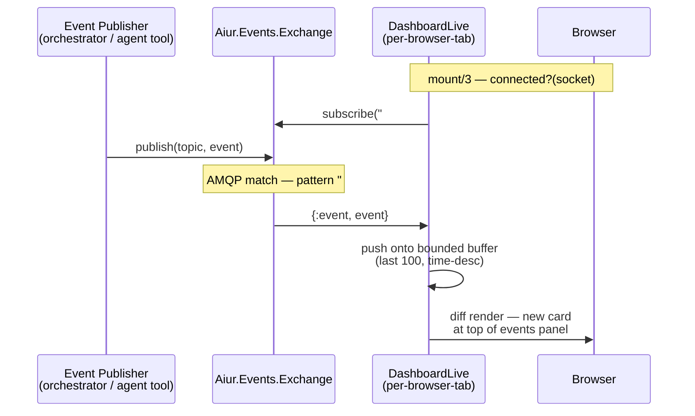
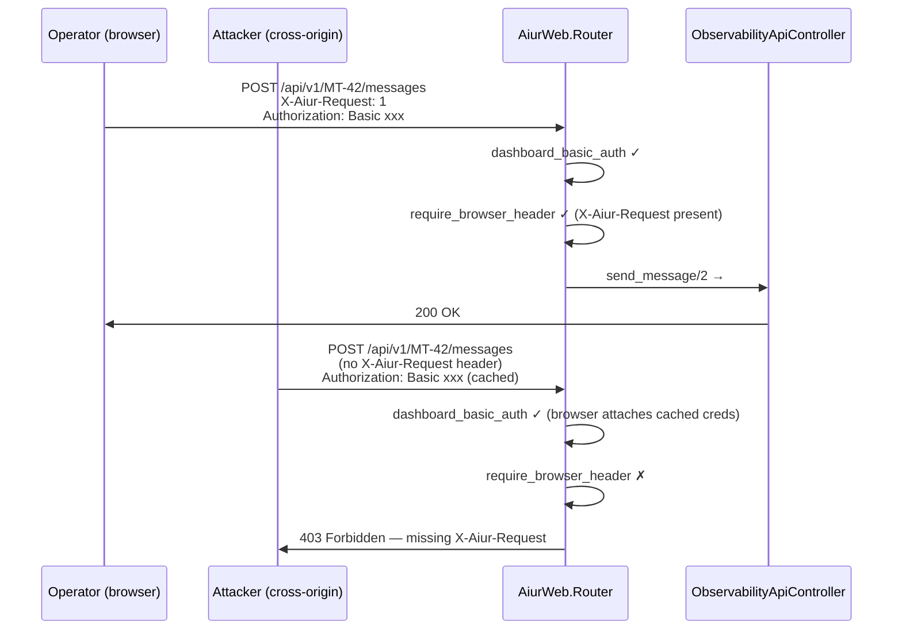

# feat: dashboard events panel + open-attentions chips + security hardening + warning cleanup (Ticket C)

## Overview

Bring the Phoenix LiveView dashboard to event-system parity with the CLI agent list (events panel + open-attentions chips), verify dashboard write-parity (chat composer + pause button) end-to-end after the Ticket A event pipeline lands, harden security (startup credential gate for non-loopback binds; CSRF defense on `POST /api/v1/*` write endpoints), and clean up the compile warnings left behind by PR #96 (opencode pre-warm simplification).

Depends on Ticket A landing first (events flow through `Aiur.Events.Exchange`; `Aiur.Events.SubscriptionStore` exposes `snapshot/1` for `open_attentions`). Independent of Ticket B (alerts refactor) — Tickets B and C can run in parallel after A.

---

## Problem Frame

Operators run Aiur in the terminal but also have the dashboard at `http://<server.host>:<server.port>/` open as a second screen (the local workflow points to a Tailscale IP). After Ticket A, events are flowing on the bus and the CLI agent list shows the `Latest` column + `❗` dual emoji slot. The dashboard is currently stale relative to that — it has the running-agents table but no events surface, no attentions visibility, and no way to act on cross-ticket signals without dropping back to the terminal.

Three deferred concerns from the brainstorm review also land here:
1. **Security** — `AiurWeb.Router.dashboard_basic_auth/2` passes through unauthenticated when env vars are unset. `AGENTS.md` actively encourages this for local dev. The moment an operator runs `aiur --host <tailscale-ip>` (the local workflow's default `server.host` is `100.81.109.51`), every tailnet device can POST to `/api/v1/<issue>/messages` with no credentials. Plus there's a cached-basic-auth CSRF surface on the same endpoint.
2. **Compile warnings** — PR #96 (opencode pre-warm simplification, commit `e14e02d`) deleted the eager fan-out but left dead helper functions (`start_attach_task/4`, `identifier_already_attached?/3`) and dead module attributes (`@hidden_target_height`, `@hidden_target_width`) in `attach_pool.ex`, plus ungrouped `handle_info` / `handle_cast` clauses in both `attach_pool.ex` and `agent_list/app.ex`.
3. **Write-parity verification** — code analysis says the dashboard chat composer + pause path is intact (5/5 unit tests pass; `AgentChat.send` → `Orchestrator.send_operator_message` → drain). Brainstorm review punted a live end-to-end verification to this ticket with the explicit escape hatch: bail to a follow-up ticket if it's actually broken at runtime.

These four pieces share the same `lib/aiur_web/` neighborhood (plus the two `lib/aiur/` files for warnings), making a single bundled ticket the right unit of work.

(see origin: `docs/brainstorms/2026-05-24-aiur-event-publishing-subscriptions-requirements.md`)

---

## Requirements Trace

- R1. Dashboard events panel: new card below the existing running-agents table; two tabs (`Per-issue events` + `Firehose`); shared time-range filter (default last 30 min); free-text search of `message`; surface-family color chips; per-event compact card row with topic chip, message, relative time, expandable JSON payload, "open ticket on GitHub" link, "open agent pane" reference
- R2. Real-time event delivery to dashboard: LiveView subscribes to `Aiur.Events.Exchange` with a wildcard pattern (`#`) when `connected?(socket)` is true; receives `{:event, event}` messages; pushes onto a bounded buffer in socket state (default last 100 events) for the firehose tab; per-issue tab filters by topic prefix
- R3. Open-attentions chips on agent rows: when an issue has open attentions in its `Aiur.Events.SubscriptionStore` snapshot, render inline chips listing each slug; HTML `title` attribute carries the original message (no custom tooltip JS); chips disappear when `open_attentions` MapSet becomes empty
- R4. Open-attentions data flow: `AiurWeb.Presenter.running_entry_payload/1` includes `open_attentions: [%{slug, message, emitted_at}]` for each running agent; reads from `Aiur.Events.SubscriptionStore.snapshot/1`
- R5. Dashboard write-parity verification (chat composer + pause): unit tests still green; manual verification during impl confirms a typed operator message round-trips through `AgentChat.send` → `Orchestrator.send_operator_message` → `AgentRunner.drain_operator_messages` → agent reply visible in opencode pane AND agent.md log read by the dashboard modal; pause button transitions agent to `:paused` state; verification surface a new `elixir/test/aiur_web/dashboard_write_parity_test.exs` (LiveView-level test)
- R6. Bail-out condition for R5: if write-parity is broken at runtime, file a follow-up ticket and remove the dashboard chat composer + pause button from this PR (preserves operator-facing dashboard for reads-only); the events panel + chips + security + cleanup still ship
- R7. Startup credential gate: `Aiur.HttpServer.start_link/1` checks the resolved host (after `parse_host/1`); if not `{127, 0, 0, 1}` / `{0, 0, 0, 0, 0, 0, 0, 1}` AND either `AIUR_DASHBOARD_USERNAME` or `AIUR_DASHBOARD_PASSWORD` is unset/blank, log a `Logger.error/1` naming the resolved host + env vars + loopback fix, then return `:ignore` (matches existing `http_server.ex:46-48` pattern). Supervisor treats `:ignore` as a successful non-start; the rest of the application keeps running; operator sees the error log and knows to fix it or run with `--host 127.0.0.1`
- R8. CSRF defense for write APIs: new `:api_write` Phoenix pipeline applied to `POST /api/v1/refresh` and `POST /api/v1/:issue_identifier/messages` (and any future write endpoints) that runs two private plugs in sequence: `verify_same_origin/2` (Origin/Referer allowlist check against `AiurWeb.Endpoint.url()` + loopback variants `127.0.0.1` / `localhost`) AND `require_custom_header/2` (verifies `X-Aiur-Request: 1`). Either gate's failure returns `403 Forbidden` with a JSON error body naming the gate that failed
- R9. LiveView form composer + pause button: existing `phx-submit` and `phx-click` handlers route through LiveView channels (not HTTP REST), so they're already CSRF-protected by the LiveSocket session. **Verify no JS `fetch()` path bypasses LiveView** (grep `dashboard_live.ex` + `priv/static/` for `fetch(` / `XMLHttpRequest`); if any direct HTTP call exists from operator UI, attach `X-Aiur-Request: 1` to it
- R10. Compile-warning cleanup in `elixir/lib/aiur/opencode/attach_pool.ex`: delete dead `start_attach_task/4` and `identifier_already_attached?/3`; delete unused `@hidden_target_width` and `@hidden_target_height` attributes; reorder the private function between two `handle_info` clauses (line 259-261) to live below the catch-all `handle_info` (after line 312)
- R11. Compile-warning cleanup in `elixir/lib/aiur/agent_list/app.ex`: move private helpers `schedule_refresh_tick/0` and `schedule_geometry_tick/0` (lines 224-230) from between `init/1` and `handle_cast` into the helpers section at the bottom; move the single `handle_call(:snapshot, ...)` clause (line 439) above the `handle_cast` block (or below the `handle_info` block) so callback clauses are contiguous
- R12. Verification: clean `mix compile --force` produces zero warnings from the four cleanup targets

**Origin actors:** A1 (operator — interacts with dashboard in browser; uses chat composer; observes events panel)
**Origin flows:** F1 (operator opens dashboard, sees per-issue events stream in real time, drills into open attentions, sends a chat message that round-trips to the agent)

---

## Scope Boundaries

- No re-pointing of the existing Tailscale `tailscale serve` URL (currently proxies port 18789 to "OpenClaw Control"); operators wanting the friendly URL re-pointed do it via `tailscale serve` outside this ticket
- No restoration of the dashboard chat-log historical read path (`Aiur.AgentLog.parse` has drifted with the opencode rewrite — Ticket A scope explicitly excludes this; the events panel is the new operator surface, not a fix for chat-log history)
- No new agent tools or event publishers — Ticket C is consumer-side only (LiveView reads events from Ticket A's pipeline)
- No `alerts.yaml` changes — Ticket B owns the alerts refactor
- No dashboard write endpoints beyond what already exists (chat send + pause + refresh) — new operator actions would be a separate ticket
- No Tailwind / CSS framework introduction — extend the existing hand-authored `priv/static/dashboard.css` with new chip + tab styles

### Deferred to Follow-Up Work

- Restore dashboard chat-log historical read (separate refactor of `Aiur.AgentLog.parse` to handle current opencode-era message formats) — only if operators want it back after using the events panel; not load-bearing for Ticket C
- Re-point Tailscale serve URL at Aiur — one-line operator config, not code; outside this ticket's scope
- Restore dashboard write parity to a follow-up ticket **only** if manual verification reveals runtime breakage in R5 (Bail-out per R6)

---

## Context & Research

### Relevant Code and Patterns

- **LiveView dashboard entry point**: `elixir/lib/aiur_web/live/dashboard_live.ex` — single 559-line module; `mount/3` lines 13-28 (assigns `:payload = load_payload()`; subscribes to `ObservabilityPubSub`; schedules `:runtime_tick` every second); all HEEx in one `~H` sigil inside `render/1`. Extend in place rather than extracting a component module (matches existing style; only extract when reuse appears)
- **Payload shape**: produced by `Aiur.Observability.Presenter.state_payload(orchestrator(), snapshot_timeout_ms())` at `elixir/lib/aiur_web/presenter.ex` (shape documented at lines 9-32). For Ticket C, extend `running_entry_payload/1` (lines 102-123) with `open_attentions: [...]` read from `SubscriptionStore.snapshot/1`
- **Existing re-render trigger**: `handle_info(:observability_updated, socket)` at dashboard_live.ex:37-45 — fired by `AiurWeb.ObservabilityPubSub.broadcast_update/0`. Coarse "refresh entire snapshot" model. For Ticket C events panel, **bypass this and subscribe directly to `Aiur.Events.Exchange`** with `subscribe("#")` (firehose) — broadcast-then-snapshot loses per-event identity that the panel needs
- **Router pipelines**: `elixir/lib/aiur_web/router.ex` lines 9-19 declare two pipelines (`:dashboard_auth` basic-auth-only, `:browser` full LiveView stack with `protect_from_forgery`). The LiveView route uses `pipe_through [:dashboard_auth, :browser]` so it has CSRF. The `/api/v1/*` write routes use `pipe_through(:dashboard_auth)` only — no CSRF. Ticket C adds a third `:browser_api` pipeline applying `:dashboard_auth` + a new `require_browser_header/2` private plug
- **Auth plug + test pattern**: `dashboard_basic_auth/2` at router.ex:52-63 reads env vars on every request; test pattern at `elixir/test/aiur_web/router_auth_test.exs` (uses `Plug.Test.conn/2` + `Router.call(conn, Router.init([]))` + env-vars in `setup`/`on_exit`). Direct precedent for testing the new CSRF plug + the startup credential gate's accept/reject paths
- **CLI host resolution + HttpServer boot**: `scripts/aiur` lines 920-922 inject `--host 127.0.0.1` unless operator passes `--host` explicitly. `Aiur.CLI.maybe_set_server_host/2` (cli.ex:226-245) writes `Application.put_env(:aiur, :server_host_override, host)`. `Aiur.HttpServer.start_link/1` (`elixir/lib/aiur/http_server.ex:20-49`) reads `Config.server_host()` and calls `parse_host/1` (DNS resolution for hostnames). The credential gate inserts **after** `parse_host/1` returns the resolved tuple and **before** `Endpoint.start_link/0`
- **Supervision tree boot order**: `lib/aiur.ex:25-70`, children at lines 47-63. `Aiur.HttpServer` starts before opencode supervisors and before the interactive CLI children. Returning `{:error, reason}` from `HttpServer.start_link/1` propagates as a startup failure with a clear cause if we shape the error tuple thoughtfully
- **Static assets / CSS**: hand-authored `elixir/priv/static/dashboard.css` (698 lines) with custom-property design system (`--accent`, `--ink`, `--muted`, etc.). Embedded at compile time via `AiurWeb.StaticAssets` — release rebuild required after CSS changes. Direct precedents to mirror: `.state-badge` family + `state_badge_class/1` helper at dashboard_live.ex:455-465 for the surface-family chips; `.section-card` + `.section-header` shape for the new events panel card
- **LiveView test pattern**: `elixir/test/aiur/extensions_test.exs` is the canonical example — `start_test_endpoint/1` helper at lines 825-834, `StaticOrchestrator` test double at lines 61-91 injected via endpoint `:orchestrator` config key, `live(build_conn(), "/")` interaction + `render_click`/`render_submit`, `assert_eventually/1,2` polling helper at lines 888-899 for re-renders triggered by PubSub broadcasts. Reuse the same shape for the events-panel and chips tests
- **`SubscriptionStore.snapshot/1` interface** (from Ticket A U6): returns `%{subscribed_to: [...], last_seen_event_id: int, open_attentions: [%{slug: string, message: string, emitted_at: DateTime}]}`. Synchronous read; no GenServer.call timeout fragility because the snapshot is in-memory state
- **`Aiur.Events.Exchange.subscribe/1`** (from Ticket A U5): caller-monitored ETS binding; sends `{:event, event}` to subscriber pid. LiveView's `mount/3` calls `subscribe("#")` to receive everything; `handle_info({:event, event}, socket)` pushes the event onto a bounded buffer

### Institutional Learnings

- **`AGENTS.md` quote** (root) lines 81-85: "Set them empty (or unset) to disable basic auth locally." This is the convention Ticket C respects — loopback bind keeps the current quiet-dev behavior; only non-loopback binds enforce credentials. The startup gate is a *guardrail*, not a posture change
- **The orphan-writer / lifecycle-teardown pattern** (Ticket A reliability finding rel-1 from `.context/ce-code-review/20260523-115650-b4478663/reliability.json`) applies here too: if the LiveView subscribes to `Aiur.Events.Exchange` and disconnects, Exchange's `:DOWN` cleanup reaps the binding automatically (already specced in Ticket A U5). No manual cleanup needed in the LiveView's `terminate/2`
- **PR #96 (`e14e02d`) precedent**: the same commit that deleted eager fan-out left the dead code we're cleaning up. The cleanup is small enough to bundle (4 lines deleted in `attach_pool.ex`, ~10 lines reordered across both files) and doesn't risk regression because the deleted functions/attributes have zero callers (verified by grep during Ticket A research)
- **Phoenix/LiveView 1.1 patterns**: existing dashboard already uses canonical patterns (subscribe in `mount/3` when `connected?`; `handle_info` for PubSub events; bounded-buffer state in socket assigns). The events panel additions follow this exact shape; no architectural deviations
- **Existing CSRF setup for LiveView**: `Plug.CSRFProtection.get_csrf_token/0` in `AiurWeb.Layouts.root/1` (layouts.ex:10), rendered into `meta[name="csrf-token"]` and passed into the JS LiveSocket constructor as `params: {_csrf_token: csrfToken}`. The LiveSocket route (line 30 in router) stays as-is; CSRF defense is added only to the bare REST API write routes

### External References

- **Phoenix LiveView 1.1 streams** (`stream/4`, `stream_insert/4`, `stream_configure/3`): the canonical 1.1-era pattern for bounded buffers / firehoses. `:limit` with negative value prunes from the start of the container (matches the `at: 0` prepend pattern for newest-first feeds). `phx-update="stream"` required on the container; each child needs a stable `id`
- **`<.portal>` (LV 1.1)**: new primitive for rendering content outside the parent's overflow context — useful for tooltips that need to escape overflow:hidden parents. Aiur uses CSS-only tooltips instead (cheaper); flag `<.portal>` as a future option if richer tooltips emerge
- **LiveView 1.1 testing notes**: migration from Floki → LazyHTML; Floki-specific selectors (`fl-contains`, `fl-icontains`) no longer work; use standard CSS selectors. Duplicate DOM ids now raise in tests by default — use stream-style `dom_id` functions for list rendering. Form submission tests now include current DOM values to mimic browsers
- **Plug.CSRFProtection 1.19.1**: protects via session-stored tokens via `_csrf_token` param or `x-csrf-token` header. **Wrong tool for REST APIs not driven by own LiveView** — Phoenix issue #3221 + maintainer guidance both reach this conclusion. The right defense for a Basic-Auth-protected JSON API is Origin/Referer allowlist + custom-header check
- **Origin/Referer-based CSRF defense**: `Origin` is set by browsers on cross-origin POSTs and *cannot be forged from JS*. Fallback to `Referer` when `Origin` is absent. Reject writes when both are missing. Loopback edge case: `127.0.0.1` and `localhost` are distinct origins for cached basic-auth purposes — accept both
- **Custom-header CSRF defense rationale**: browsers refuse to send custom request headers (`X-Aiur-Request: 1`) cross-origin without a successful CORS preflight. Aiur exposes no `Access-Control-Allow-Headers`, so a malicious cross-origin POST's preflight fails before the actual request fires. Well-established pattern (jQuery historically used `X-Requested-With: XMLHttpRequest` for this)
- **Supervisor `:ignore` semantics**: `start_link/1` returning `:ignore` is treated as a successful non-start; supervisor keeps the spec but with PID `:undefined`; no restart retries unless manually triggered; **does not crash the application**. Right primitive for "don't bind to a public interface without auth configured." Pair with `Logger.error/1` so the `:ignore` isn't silent
- **Elixir 1.19 / OTP 28 compile warnings**: "clauses for the same def should be grouped together" behavior unchanged; unused-attribute warnings behavior unchanged; no new warning categories affecting the AttachPool + AgentList cleanup. New 1.19 warnings to flag (informational, not blocking): type inference on anonymous functions, protocol mismatch on `for` generators, deprecated struct update syntax `%URI{uri | path: "..."}` — none of these are in the Ticket C touch area
- **Pinned versions confirmed via `mix.lock`**: Phoenix 1.8.4, LiveView 1.1.25, Plug 1.19.1, Bandit 1.10.3, Elixir ~> 1.19 / OTP 28

---

## Key Technical Decisions

- **Events panel subscribes to `Aiur.Events.Exchange` directly with `subscribe("#")`** (firehose pattern). The existing `ObservabilityPubSub.broadcast_update` re-render model is fine for the running-agents table snapshot but loses per-event identity that the panel needs. Two PubSub paths firing on the same event is acceptable — Exchange routes via ETS lookup (fast) and the LiveView's `handle_info({:event, event}, socket)` runs in milliseconds
- **Use Phoenix.LiveView `stream/4` with `:limit` (LV 1.1 pattern), not assigns-list**. `stream_configure(:events, dom_id: &"evt-#{&1.id}")` + `stream(:events, [], limit: -100)` then `stream_insert(socket, :events, event, at: 0, limit: -100)` on each `handle_info`. Streams keep data on the client and prune the DOM; LiveView process holds zero history. Each event row carries a stable DOM id derived from the persistent monotonic event id (Ticket A's `IdGenerator`). Per-tab filtering: one stream per tab; `handle_info` decides which streams the event belongs to and `stream_insert`s into those
- **Time-range filter is server-side** in the LiveView `handle_event("filter-time-range", ...)` handler, not JS. Server-side wins because filter affects pruning (a 5-min view shouldn't keep an hour of memory) AND it's testable via `render(view)`. Filter state lives in socket assigns
- **Surface-family color chip is a function component**, not inline HEEx. Promote the inline `state_badge_class/1` private helper pattern (dashboard_live.ex:455-465) into `AiurWeb.Components.Badges.chip/1` with `attr :tone, :string, values: ~w(issue branch pr agent chat system)`. Compile-time `values:` validation prevents drift. Reused by event cards + open-attentions chips
- **Tab switching: `phx-click` + `assign(:active_tab, ...)` server-side**, not URL `patch` or pure-JS `JS.show`/`JS.hide`. URL-shareable tabs aren't a goal; server-side state enables future optimizations (pre-filter per active tab). Matches existing dashboard idioms
- **CSRF defense: Origin/Referer allowlist + custom-header check (defense in depth)**. The Phoenix maintainer guidance is explicit that `Plug.CSRFProtection` is the wrong tool for REST APIs not driven by your own LiveView. Two layered checks: (a) `Origin` (or `Referer` fallback) header must match `AiurWeb.Endpoint.url()`; absent on a write request → reject; (b) custom `X-Aiur-Request: 1` header must be present; browsers refuse to send custom headers cross-origin without a successful CORS preflight, and Aiur exposes no `Access-Control-Allow-Headers`, so a malicious cross-origin POST's preflight fails. Either gate blocks the attack independently
- **Startup credential gate returns `:ignore` from `HttpServer.start_link/1`** with `Logger.error/1` describing the cause. `:ignore` is already an existing pattern in `http_server.ex:46-48`. The supervisor treats `:ignore` as a successful non-start (doesn't crash the BEAM, doesn't keep retrying); the rest of the application keeps running. Loopback bind without credentials still starts the server (preserves dev convenience per AGENTS.md)
- **Open-attentions chip data sourced via `SubscriptionStore.snapshot/1`** at render time, called from `Presenter.running_entry_payload/1`. Performance note: snapshot is in-memory; per-render call is cheap (< 1ms × ~10 running agents = negligible)
- **Tooltips: CSS-only via `[data-tooltip]` + `:hover::after`** rather than HTML `title` attribute. Native `title` has ~1s browser delay; CSS tooltips are instant + themable + work with the existing custom-property design system. Zero JS surface. Matches the hand-CSS philosophy already in `dashboard.css`
- **Compile-warning cleanup is bundled because we're already touching the neighborhood** (dashboard_live.ex and the larger `lib/aiur_web/` area; AttachPool and AgentList are adjacent in the supervision tree to the LiveView's data sources). All four cleanup targets are mechanical reorderings or dead-code deletions — zero behavior change

---

## Open Questions

### Resolved During Planning

- **Events panel data source**: directly from `Aiur.Events.Exchange.subscribe("#")`, not via the existing `ObservabilityPubSub` snapshot (resolved here)
- **Bounded buffer mechanism**: Phoenix LiveView 1.1 `stream/4` with `:limit`, not assigns list (resolved per external research — streams prune DOM client-side; LiveView process holds zero history; canonical 1.1 pattern)
- **Tooltip approach**: CSS-only via `[data-tooltip]` + `:hover::after`, not HTML `title` attribute or custom JS (resolved per external research — `title` has ~1s browser delay; CSS tooltips instant and themable)
- **CSRF approach**: Origin/Referer allowlist + custom `X-Aiur-Request` header (defense in depth), not custom-header alone (resolved per external research — Phoenix issue #3221 + maintainer guidance recommend layered checks for REST APIs sharing browser session)
- **Startup gate halt mechanism**: return `:ignore` with `Logger.error/1`, not `{:error, ...}` (resolved per external research — `:ignore` is existing pattern at `http_server.ex:46-48`; supervisor treats it as a successful non-start without crashing the app; loopback fallback preserved)
- **Tab switching**: `phx-click` + `assign(:active_tab, ...)` server-side, not URL `patch` or pure-JS (resolved per external research — URL-shareable tabs aren't a goal; server-side state enables pre-filter optimizations)
- **Bail-out for write-parity**: if broken at runtime during R5 manual verification, file a follow-up ticket and remove dashboard chat composer + pause button from this PR; events panel + chips + security + cleanup still ship (resolved here)

### Deferred to Implementation

- **Exact buffer-size constant for events panel** — 100 is a reasonable default; revisit if the operator finds it too small/large during manual testing
- **CSS color values for surface-family chips** — pick during impl when actually authoring `dashboard.css` additions; ensure contrast against existing dark theme
- **Whether to extract a `<.event_chip />` LiveView function component or inline the HEEx** — decide when writing the panel; inline if used in one place, extract if reused
- **Exact error-log shape for the startup gate** — pick during impl; should include both the resolved host and a one-line "to fix: set AIUR_DASHBOARD_USERNAME/PASSWORD or run with --host 127.0.0.1" hint
- **Exact JSON shape for `403` CSRF rejection responses** — match existing error patterns in `ObservabilityApiController` if any; pick during impl

---

## High-Level Technical Design

> *This illustrates the intended approach and is directional guidance for review, not implementation specification. The implementing agent should treat it as context, not code to reproduce.*

### Events panel layout

```
+----------------------------------------------------------+
| Operations Dashboard                  [Live][Offline]    |
+----------------------------------------------------------+
| METRICS GRID  (existing, unchanged)                      |
+----------------------------------------------------------+
| Running sessions  (existing, extended w/ attention chips)|
| #    Title           State    Agent  Tokens  Attentions  |
| 101  Add function_a  🟢 ❗     ...    ...    [scope-q?]  |
| 102  Add function_b  🟢                                  |
+----------------------------------------------------------+
| Retry queue  (existing, unchanged)                       |
+----------------------------------------------------------+
| Events                                                   |
|  [ Per-issue events ] [ Firehose ]   [last 30 min ▼]    |
|                                                          |
|  [issue] ticket.101.issue.label.added.agent.todo  3s    |
|         Task entered todo                                |
|  [branch] ticket.101.branch.push  abc123  18s            |
|           add function_a                                 |
|  [agent] ticket.101.agent.decision.architecture  2m      |
|          namespace function_a under Foo.Bar              |
|          [▶ payload]                                     |
+----------------------------------------------------------+
```

### Real-time event flow



### CSRF defense flow



---

## Implementation Units

### Phase 1 — Security hardening (lands first; gate behavior change is load-bearing)

- [ ] U1. **Startup credential gate**

**Goal:** `Aiur.HttpServer.start_link/1` refuses to start when bound to a non-loopback host without `AIUR_DASHBOARD_USERNAME` and `AIUR_DASHBOARD_PASSWORD` set. Loopback binds preserve current quiet-dev behavior.

**Requirements:** R7

**Dependencies:** None

**Files:**
- Modify: `elixir/lib/aiur/http_server.ex` (add credential check after `parse_host/1` returns; return `{:error, {:credentials_required_for_network_bind, resolved_host}}` with `Logger.error` describing the cause + remediation)
- Test: `elixir/test/aiur/http_server_test.exs` (new file or extend existing — verify start_link behavior across loopback / non-loopback × credentials-set / unset matrix)

**Approach:**
- Resolved-host check: after `parse_host/1` returns the inet tuple or string, normalize against `[{127,0,0,1}, {0,0,0,0,0,0,0,1}, "127.0.0.1", "localhost", "::1"]`
- Credentials read: `System.get_env("AIUR_DASHBOARD_USERNAME")` and `System.get_env("AIUR_DASHBOARD_PASSWORD")`; `nil` / `""` / whitespace-only = unset
- Refusal path: emit a clear `Logger.error/1` with the resolved host, the env var names, and the loopback fix; return `:ignore` from `start_link/1` (matches existing pattern at `http_server.ex:46-48`); supervisor treats this as a successful non-start, doesn't crash the BEAM, doesn't retry — the rest of the app keeps running and the operator sees the error log
- Extend the existing `with` chain in `start_link/1` to include `:ok <- validate_security(host)` before the existing endpoint-start; on `{:halt, reason}` log + `:ignore`
- `0.0.0.0` is treated as non-loopback (binds to all interfaces; same exposure as Tailscale IP)

**Execution note:** Start with a failing test for the rejection path (non-loopback + missing creds) before implementing the gate. Test-first matches the security-sensitive nature.

**Patterns to follow:**
- Existing `HttpServer.start_link/1` body (lines 20-49)
- `Logger.error/1` usage in `Aiur.Orchestrator` for clear operator-facing error messages

**Test scenarios:**
- Happy path: loopback `{127, 0, 0, 1}` bind + no credentials → starts successfully (preserves dev convenience)
- Happy path: loopback `{0, 0, 0, 0, 0, 0, 0, 1}` (IPv6 loopback) → starts successfully
- Happy path: string-form `"127.0.0.1"` / `"localhost"` / `"::1"` → starts successfully (handle all host-shape variants)
- Happy path: non-loopback bind + both credentials set → starts successfully
- Refusal path: non-loopback bind + missing `AIUR_DASHBOARD_USERNAME` → returns `:ignore` with `Logger.error/1` naming the resolved host + env vars + loopback fix
- Refusal path: non-loopback bind + missing `AIUR_DASHBOARD_PASSWORD` → same `:ignore` + log
- Refusal path: non-loopback bind + both env vars set to `""` → treated as missing → `:ignore`
- Refusal path: `0.0.0.0` bind without credentials → `:ignore` (binds to all interfaces — same exposure as Tailscale IP)
- Edge case: `parse_host/1` fails to resolve hostname → existing error path preserved; gate doesn't fire
- Integration: with the supervisor running, simulate refusal — verify the rest of the supervised children continue running (orchestrator, agent list, etc.)

**Verification:**
- `aiur --host 100.81.109.51` without credentials prints a clear error and refuses to start
- `aiur --host 127.0.0.1` without credentials still starts (existing behavior preserved)
- `aiur` with no `--host` flag (defaults to `127.0.0.1` via the wrapper) still starts

---

- [ ] U2. **CSRF defense for `POST /api/v1/*` — Origin/Referer + custom-header (defense in depth)**

**Goal:** Reject POST requests to `/api/v1/refresh` and `/api/v1/:issue_identifier/messages` unless BOTH gates pass: (a) `Origin` (or `Referer` fallback) matches the endpoint's URL or a loopback variant, AND (b) `X-Aiur-Request: 1` is present. Layered defense prevents cached-basic-auth CSRF from cross-origin forms/scripts.

**Requirements:** R8, R9

**Dependencies:** None

**Files:**
- Modify: `elixir/lib/aiur_web/router.ex` (new `:api_write` pipeline with `dashboard_basic_auth` + new private plug `verify_same_origin/2` + new private plug `require_custom_header/2`; apply to the two POST routes; leave GET routes on the existing `:dashboard_auth` pipeline)
- Modify: `elixir/lib/aiur_web/live/dashboard_live.ex` (verify no JS fetch path bypasses LiveView; grep `dashboard_live.ex` + `priv/static/` for `fetch(` / `XMLHttpRequest`; LiveView's own `phx-submit` and `phx-click` go through LiveView channels — already CSRF-protected by the LiveSocket session)
- Test: `elixir/test/aiur_web/router_auth_test.exs` (extend with the matrix below)

**Approach:**
- `verify_same_origin(conn, _opts)`:
  - `expected = AiurWeb.Endpoint.url()` (e.g., `"http://127.0.0.1:4000"`)
  - Read `get_req_header(conn, "origin")`; if present, `String.starts_with?(value, expected)` is the pass condition. If `nil`, fall back to `Referer`.
  - Loopback equivalence: also accept origins starting with `"http://localhost:#{port}"` and `"http://127.0.0.1:#{port}"` when the configured host is loopback
  - Absent both Origin and Referer on a write → reject
  - On failure, `Plug.Conn.send_resp(conn, 403, Jason.encode!(%{error: %{code: "csrf_origin_mismatch", message: "Origin/Referer does not match endpoint"}}))` + halt
- `require_custom_header(conn, _opts)`:
  - Read `get_req_header(conn, "x-aiur-request")`; pass if `["1"]`; reject otherwise
  - On failure, `send_resp(conn, 403, Jason.encode!(%{error: %{code: "missing_browser_header", message: "Missing X-Aiur-Request header"}}))` + halt
- Both plugs run in pipeline order; either failure short-circuits with halt
- LiveView review: grep confirms `dashboard_live.ex` uses `phx-submit`/`phx-click` only (LiveView channel transport); no direct HTTP fetch. If `priv/static/` contains any JS that calls `fetch` against `/api/v1/*`, attach both `X-Aiur-Request: 1` and let the browser set `Origin` (same-origin AJAX automatically attaches it)

**Patterns to follow:**
- Existing `dashboard_basic_auth/2` private plug in router.ex:52-63
- Pipeline definition pattern in router.ex:13-19
- `Plug.Conn.get_req_header/2` always returns a list (empty if absent)

**Test scenarios:**
- Happy path: `POST /api/v1/foo/messages` with `Origin: http://127.0.0.1:4000` + `X-Aiur-Request: 1` + valid basic-auth → routes to controller
- Happy path: `POST /api/v1/foo/messages` with `Origin: http://localhost:4000` (loopback equivalent) + custom header + basic-auth → routes (loopback variants accepted)
- Happy path: `POST /api/v1/foo/messages` with only `Referer: http://127.0.0.1:4000/dashboard` (Origin absent) + custom header + basic-auth → routes (Referer fallback)
- Error path: `POST /api/v1/foo/messages` with no Origin + no Referer + custom header + basic-auth → 403 `csrf_origin_mismatch`
- Error path: `POST /api/v1/foo/messages` with `Origin: https://evil.example.com` + custom header + basic-auth → 403 `csrf_origin_mismatch`
- Error path: `POST /api/v1/foo/messages` with matching Origin but no custom header → 403 `missing_browser_header`
- Error path: `POST /api/v1/foo/messages` with no Origin AND no custom header → 403 (first failing gate reports — `csrf_origin_mismatch` per pipeline order)
- Happy path: `GET /api/v1/state` without Origin or custom header → 200 (GET stays on existing `:dashboard_auth` pipeline; no CSRF check)
- Happy path: LiveView composer submission still works after this lands (verified by LiveView test in U6, not here — LiveView channels bypass the REST API entirely)
- Edge case: `OPTIONS` preflight to `/api/v1/*` — confirm no special handling needed (browser preflight without `Access-Control-Allow-Headers: X-Aiur-Request` in response will block the actual cross-origin POST; same-origin POSTs don't preflight)

**Verification:**
- Manual: open dashboard, send chat message via composer → works (LiveView channel)
- Manual: `curl -u user:pass -X POST http://localhost:4000/api/v1/foo/messages -d '{"message":"hi"}'` → 403 (no Origin, no header)
- Manual: `curl -u user:pass -H "Origin: http://localhost:4000" -H "X-Aiur-Request: 1" -X POST http://localhost:4000/api/v1/foo/messages -d '{"message":"hi"}'` → 200 (or specific controller response)
- Manual cross-origin CSRF simulation: create a tiny HTML file with a form posting to `http://localhost:4000/api/v1/.../messages`, open it from a different file:// origin in the same browser session → 403 (no `Origin` matching loopback)

---

### Phase 2 — Dashboard events panel + open-attentions chips

- [ ] U3. **Presenter extension: `open_attentions` on running entries**

**Goal:** `AiurWeb.Presenter.running_entry_payload/1` reads from `Aiur.Events.SubscriptionStore.snapshot/1` and includes `open_attentions: [%{slug, message, emitted_at}]` for each running agent.

**Requirements:** R4

**Dependencies:** Ticket A U6 (SubscriptionStore.snapshot)

**Files:**
- Modify: `elixir/lib/aiur_web/presenter.ex` (extend `running_entry_payload/1` at lines 102-123)
- Test: `elixir/test/aiur_web/presenter_test.exs` (new or extend; mock SubscriptionStore with stub function via existing test patterns)

**Approach:**
- Read snapshot: `Aiur.Events.SubscriptionStore.snapshot(identifier)` returns `%{open_attentions: [...]}` (per Ticket A U6 spec)
- Defensive: if SubscriptionStore not yet attached (issue is new), snapshot returns empty `open_attentions`
- New field name: `:open_attentions` in the running entry payload map

**Patterns to follow:**
- Existing `running_entry_payload/1` shape — map-extension only

**Test scenarios:**
- Happy path: running entry with 0 open attentions → `open_attentions: []` in payload
- Happy path: running entry with 2 open attentions → `open_attentions: [%{slug, message, emitted_at}, ...]`
- Edge case: SubscriptionStore not attached for the identifier → `open_attentions: []` (defensive empty)
- Edge case: SubscriptionStore crashes during snapshot call → caught; payload returns empty open_attentions; logged

**Verification:**
- Existing presenter tests still pass
- New tests cover the three scenarios above

---

- [ ] U4. **Open-attentions chips in running-agents table**

**Goal:** When an agent row has non-empty `open_attentions`, render inline chips listing each slug; HTML `title` attribute carries the original message.

**Requirements:** R3

**Dependencies:** U3 (presenter exposes the field), U9 (Badges component for chip)

**Files:**
- Modify: `elixir/lib/aiur_web/live/dashboard_live.ex` (extend the running-sessions table cell at lines 232-241 — add inline chip stack using `<.chip>` component from U9)

**Approach:**
- HEEx inline iteration over `entry.open_attentions`; each chip is `<.chip tone="warn" tooltip={attention.message}><%= attention.slug %></.chip>` (from U9's Badges component)
- Empty list = no chips rendered (no placeholder)
- CSS tone `warn` already defined in U9

**Patterns to follow:**
- Existing `.state-badge` HEEx shape in dashboard_live.ex lines around 240
- `.status-badge` family CSS in `dashboard.css`

**Test scenarios:**
- Happy path: running entry with 2 open attentions → 2 `<.chip>` elements in rendered HTML (each with `status-chip-warn` class)
- Happy path: no open attentions → no chip elements (clean row)
- Happy path: chip's `data-tooltip` attribute contains the attention message
- Edge case: attention message with HTML special chars → properly escaped via HEEx (Phoenix.HTML default behavior)
- Edge case: very long attention message → still set as `data-tooltip`; CSS handles overflow visually (could use `text-overflow: ellipsis` if needed; deferred)
- LV 1.1 testing: stream/list rendering with duplicate ids now raises — use `phx-value-slug` or per-attention dom_id if list rendering surfaces require uniqueness

**Verification:**
- Visual inspection via LiveView test render + DOM assertion
- Manual: trigger an `agent.attention.scope-question` in a test scenario, verify chip appears, hover → CSS tooltip shows message instantly

---

- [ ] U5. **Events panel: subscription + LV streams + tabs + filters**

**Goal:** Add `Events` card below the existing tables. Subscribe to `Aiur.Events.Exchange.subscribe("#")` on `mount/3`; receive `{:event, event}` messages; maintain Phoenix.LiveView **streams** (`stream/4` with `:limit`) for the firehose tab + a per-issue tab; render with surface-family chip function component, relative time, expandable JSON payload, CSS-only tooltips.

**Requirements:** R1, R2

**Dependencies:** Ticket A U5 (`Exchange.subscribe/1`), Ticket A U4 (events carry persistent monotonic `id`, `topic`, `emitted_at`, `message`, `payload`, `source`), U9 (Badges component for chip)

**Files:**
- Modify: `elixir/lib/aiur_web/live/dashboard_live.ex` (extend `mount/3` to subscribe + `stream_configure` + `stream(:events_firehose, [], limit: -100)` + `stream(:events_per_issue, [], limit: -100)`; add `handle_info({:event, event}, socket)` to `stream_insert` into the appropriate stream(s); add `handle_event` clauses for tab switch, time-range filter, free-text search; render new section in `~H` using `phx-update="stream"`)
- Modify: `elixir/priv/static/dashboard.css` (`.events-section`, `.events-tabs`, `.event-card`, surface-family color tokens via custom properties matching the existing design system)
- Modify: `elixir/lib/aiur_web/live/dashboard_live.ex` (helper function `event_surface_tone/1` mapping event topic → tone atom for the `<.chip>` component)

**Approach:**
- On `mount/3` when `connected?(socket)`:
  - `Aiur.Events.Exchange.subscribe("#")`
  - `socket |> stream_configure(:events_firehose, dom_id: &"evt-fh-#{&1.id}") |> stream_configure(:events_per_issue, dom_id: &"evt-pi-#{&1.id}") |> stream(:events_firehose, [], limit: -100) |> stream(:events_per_issue, [], limit: -100)`
  - `assign(:active_events_tab, :firehose) |> assign(:events_time_range_min, 30) |> assign(:events_search, "") |> assign(:focused_issue, nil)`
- `handle_info({:event, event}, socket)`:
  - Always `stream_insert(socket, :events_firehose, event, at: 0, limit: -100)`
  - If `event.topic` starts with `"ticket.#{focused_issue}."`, also `stream_insert(socket, :events_per_issue, event, at: 0, limit: -100)`
  - Note: `:limit, -100` keeps the last 100 in DOM (newest at top); LiveView prunes older client-side
- `handle_event("events-tab", %{"tab" => tab}, socket)`: switch tab; if switching to per-issue and no `focused_issue`, render empty state
- `handle_event("events-filter-time", %{"min" => min}, socket)`: update time range; events older than cutoff are filtered at render time via `:if={event.emitted_at >= cutoff}` on `:for` (LV 1.1 supports `:if` on comprehensions)
- `handle_event("events-search", %{"q" => q}, socket)`: update search; same filter pattern
- `handle_event("events-expand-payload", %{"id" => id}, socket)`: toggle membership of id in `:expanded_event_ids` MapSet assign
- `handle_event("focus-issue", %{"id" => id}, socket)`: set focused_issue; clear per-issue stream and re-seed from firehose stream filtered by topic prefix (since stream history is client-side, may need to subscribe to `ticket.<id>.#` separately and replay from `IssueLog.disk_history` — defer exact mechanism to impl)
- Surface tone: `event_surface_tone(event)` parses second segment of topic (`ticket.42.branch.push` → second segment `branch` → `:branch`); falls back to `:system` for `system.*`; returns `:neutral` for unknown surfaces
- Template uses `<div id="events-firehose" phx-update="stream">` + `<div :for={{dom_id, event} <- @streams.events_firehose} :if={event_visible?(event, @events_time_range_min, @events_search)} id={dom_id} class="event-card">`
- LV 1.1 LazyHTML migration: tests use standard CSS selectors (no `fl-contains`); list rendering requires unique DOM ids (stream `dom_id` function provides this)
- Cleanup: LiveView's natural process termination triggers Exchange's `:DOWN` cleanup (no manual unsubscribe needed); test asserts no orphan bindings after `Process.exit(view.pid, :shutdown)`

**Execution note:** Wire the subscription + firehose stream + a minimal render first; verify events flow end-to-end via `live/2` + `send(view.pid, {:event, ...})` + `render(view) =~ "..."`. Then add the per-issue stream + tab switch + filters in a second pass.

**Patterns to follow:**
- Existing `mount/3` pattern (dashboard_live.ex:13-28) for `connected?` check + subscriptions
- Existing `handle_event` clauses at lines 47-110 for the action pattern
- LiveView 1.1 `stream/4` + `stream_insert/4` with `:limit, -N` (canonical firehose pattern; see external research)
- Function component `<.chip tone="branch">` (defined in U10)

**Test scenarios:**
- Happy path: LiveView mounts → subscribed to Exchange (verify via `Exchange.bindings_for(view.pid)`)
- Happy path: `send(view.pid, {:event, %{id: 1, topic: "ticket.42.branch.push", message: "abc", emitted_at: DateTime.utc_now(), payload: %{}, source: :github}})` → `render(view) =~ "abc"` (synchronous via LiveViewTest)
- Happy path: 150 events sent → DOM contains last 100 (verify via stream test pattern — `view |> element("#events-firehose") |> render() |> ...`)
- Happy path: switch to "Per-issue events" tab with no `focused_issue` → empty state visible
- Happy path: set `focused_issue: "42"` → switch to per-issue tab → only events with topic `ticket.42.*` visible (stream-level filtering)
- Happy path: time-range filter "last 5 min" → events older than cutoff hidden (server-side `:if` on `:for`)
- Happy path: free-text search "function_a" → only events with that string in message visible
- Happy path: click expand on event card → JSON payload renders below (formatted)
- Edge case: event with no payload (just topic + message) → no expand toggle rendered
- Edge case: event from an unfamiliar surface → `<.chip tone="neutral">` falls back; values: validation prevents typos at compile time
- Edge case: LiveView disconnects → Exchange's `:DOWN` cleanup reaps binding (no leak; verified by `Exchange.bindings_for(view.pid)` returning empty after disconnect)
- Edge case: duplicate event id arrives (at-least-once redelivery from Ticket A) → `stream_insert` with the same `dom_id` updates the existing DOM element rather than duplicating (LV 1.1 stream semantics)
- Integration: full flow — publish event via `Aiur.Events.Exchange.publish/2` → LiveView receives via subscription → renders in `render(view)`
- Integration: LV 1.1 duplicate-DOM-id raise — without `stream` + `dom_id` function, two events with the same `id` would trigger LiveView's new duplicate-id raise; verify our `dom_id: &"evt-fh-#{&1.id}"` prevents this

**Verification:**
- Manual: open dashboard, trigger a `branch.push` event in the 3-ticket test scenario, verify it appears in firehose tab in real time
- Manual: focus an issue, switch to per-issue tab, verify only that ticket's events show
- Manual: send 200 events in rapid burst, verify DOM stays bounded at 100 (oldest pruned client-side; LiveView process holds no buffer)

---

### Phase 3 — Write-parity verification

- [ ] U6. **Dashboard write-parity verification test + manual confirmation**

**Goal:** Add a LiveView-level integration test asserting the chat composer round-trip works after Ticket A's event pipeline lands. Manual confirmation during impl. If broken: bail per R6.

**Requirements:** R5, R6

**Dependencies:** Ticket A complete (`Aiur.Events.Exchange` running so events fire naturally)

**Files:**
- Create: `elixir/test/aiur_web/dashboard_write_parity_test.exs`

**Approach:**
- Test: spin up endpoint + StaticOrchestrator + real `AgentChat`/`Orchestrator` (or stub appropriately); open LiveView; submit chat composer form; assert `AgentChat.send` was called with expected args; assert no error in `socket.assigns.chat_errors`
- Test: click pause button; assert `AgentChat.pause` was called
- Test: simulate error path (orchestrator returns `{:error, :no_running_agent}`); assert error renders in `socket.assigns.chat_errors[identifier]`
- Manual verification: run the 3-ticket test scenario; with one agent running, open the dashboard chat modal; type and send a message; verify the agent receives it (visible in opencode pane) and replies (visible in dashboard chat-log modal even with current `Aiur.AgentLog.parse` limitations — agent's own response will at minimum trigger a `[event:emit]` line in the per-issue log)
- Decision tree at end of manual verification:
  - **Works**: ship dashboard write-parity as-is in this PR
  - **Broken**: file follow-up ticket; remove `phx-submit="send-operator-message"` and `phx-click="pause-agent"` from the modal (preserve everything else)

**Patterns to follow:**
- `elixir/test/aiur/extensions_test.exs` for the full LiveView test setup

**Test scenarios:**
- Happy path: composer submit with non-empty message → AgentChat.send called; no errors in assigns
- Happy path: composer submit with empty message → no AgentChat.send call; no errors (matches existing line 78-81 behavior)
- Happy path: pause button click → AgentChat.pause called; no errors
- Error path: AgentChat.send returns `{:error, :no_running_agent}` → error in `socket.assigns.chat_errors[identifier]`
- Error path: AgentChat.send returns `{:error, :message_too_long}` → mapped error in chat_errors
- Edge case: modal closed when handler fires (modal nil) → no-op (matches existing line 95)

**Verification:**
- Test suite green
- Manual 3-ticket test scenario: dashboard chat round-trip works OR the bail-out path activates cleanly

---

### Phase 4 — Compile-warning cleanup

- [ ] U9. **`AiurWeb.Components.Badges` chip function component + CSS-only tooltips**

**Goal:** Extract a reusable `<.chip tone="...">` function component (replacing the inline `state_badge_class/1` private helper at dashboard_live.ex:455-465). Add CSS-only tooltip styles via `[data-tooltip]` + `:hover::after`. Both the open-attentions chips (U4) and the events panel surface-family chips (U5) use this.

**Requirements:** R1, R3

**Dependencies:** None

**Files:**
- Create: `elixir/lib/aiur_web/components/badges.ex` (new module; `Phoenix.Component`; exposes `chip/1` and `surface_chip/1` if helpful)
- Modify: `elixir/priv/static/dashboard.css` (add `.status-chip`, `.status-chip-issue/-branch/-pr/-agent/-chat/-system/-neutral/-warn`, `[data-tooltip]:hover::after` styles)
- Modify: `elixir/lib/aiur_web/live/dashboard_live.ex` (optionally migrate the existing inline `state_badge_class/1` callsites to use `<.chip>` — low priority; do it if it falls out of the impl naturally)
- Test: `elixir/test/aiur_web/components/badges_test.exs` (new — component renders correctly per tone; values validation catches typos)

**Approach:**
- `chip(assigns)` is a `Phoenix.Component` with `attr :tone, :string, default: "neutral", values: ~w(issue branch pr agent chat system neutral warn active danger live info)` and `slot :inner_block, required: true`
- `values:` provides compile-time validation — wrong tone fails at compile time, not runtime
- Inline HEEx: `<span class={["status-chip", "status-chip-#{@tone}"]} {assigns_for_tooltip(assigns)}><%= render_slot(@inner_block) %></span>`
- Tooltip integration: optional `attr :tooltip, :string, default: nil`; renders as `data-tooltip={@tooltip}` attribute; CSS handles the visual via `:hover::after`
- CSS pattern (in `dashboard.css`):
  ```css
  [data-tooltip] { position: relative; }
  [data-tooltip]:hover::after {
    content: attr(data-tooltip);
    position: absolute;
    bottom: 100%;
    left: 50%;
    transform: translateX(-50%);
    background: var(--ink);
    color: var(--bg);
    padding: 0.25rem 0.5rem;
    border-radius: 4px;
    white-space: nowrap;
    font-size: 0.75rem;
    z-index: 10;
  }
  ```
- Surface-family color tokens: pick from existing `--accent` palette in `dashboard.css:1-19`; if new tones needed (issue/branch/pr/agent/chat/system), add new custom properties

**Patterns to follow:**
- Existing `Phoenix.Component` definitions in `elixir/lib/aiur_web/components/layouts.ex`
- Existing custom-property design system in `dashboard.css:1-19`
- LV 1.1 `attr :tone, :string, values: ~w(...)` compile-time validation pattern

**Test scenarios:**
- Happy path: `<.chip tone="branch">push</.chip>` renders `<span class="status-chip status-chip-branch">push</span>`
- Happy path: `<.chip tone="branch" tooltip="abc123 commit">push</.chip>` includes `data-tooltip="abc123 commit"` attribute
- Happy path: `<.chip>plain</.chip>` defaults to `tone="neutral"`
- Edge case: tone with unknown value → compile-time error from LV's `attr` validation
- Edge case: missing required `inner_block` slot → compile-time error
- Edge case: tooltip with HTML special chars → escaped (Phoenix.HTML default)

**Verification:**
- New component renders per test scenarios
- CSS class names match the existing design-system convention
- Tooltip shows on hover in manual verification (no JS required)

---

- [ ] U7. **AttachPool warning cleanup**

**Goal:** Delete dead `start_attach_task/4` + `identifier_already_attached?/3`. Delete unused `@hidden_target_width` and `@hidden_target_height`. Reorder private function out of `handle_info` clause group.

**Requirements:** R10, R12

**Dependencies:** None

**Files:**
- Modify: `elixir/lib/aiur/opencode/attach_pool.ex` (delete lines 633-700 — both functions; delete lines 954-955; move private function at lines 259-261 below the catch-all `handle_info` after line 312)

**Approach:**
- Pure mechanical deletion + reordering; zero behavior change (verified by grep — no callers for the dead functions, no references for the unused attributes)
- After change, `mix compile --force` produces no warnings from these targets

**Patterns to follow:** N/A — straight cleanup

**Test scenarios:**

Test expectation: none — pure dead-code deletion + private-function reorder; no behavior change. Verified by clean compile + existing test suite remaining green.

**Verification:**
- `mix compile --force 2>&1 | grep -c "warning"` — count from these targets is zero
- Existing test suite green

---

- [ ] U8. **AgentList.App warning cleanup**

**Goal:** Move `schedule_refresh_tick/0` + `schedule_geometry_tick/0` private helpers from the awkward midfile spot (lines 224-230) to the helpers section. Move the single `handle_call(:snapshot, ...)` clause (line 439) to be contiguous with the `handle_cast` block above OR below the `handle_info` block.

**Requirements:** R11, R12

**Dependencies:** None

**Files:**
- Modify: `elixir/lib/aiur/agent_list/app.ex`

**Approach:**
- Mechanical reorder; zero behavior change
- After change, `mix compile --force` produces no warnings from these targets

**Patterns to follow:** N/A — straight cleanup

**Test scenarios:**

Test expectation: none — pure private-function + callback-clause reorder; no behavior change. Verified by clean compile + existing test suite remaining green.

**Verification:**
- `mix compile --force 2>&1 | grep -c "warning"` — count from these targets is zero
- Existing test suite green (especially `test/aiur/agent_list/*_test.exs`)

---

## System-Wide Impact

- **Interaction graph:**
  - LiveView subscribes to `Aiur.Events.Exchange` on `mount/3`; receives every event; bounded-buffer state in socket assigns
  - LiveView reads `SubscriptionStore.snapshot/1` indirectly via `Presenter.running_entry_payload/1` on each `:observability_updated` re-render
  - Router gains a new pipeline `:browser_api`; existing `:dashboard_auth` and `:browser` pipelines unchanged
  - `HttpServer.start_link/1` gains a credential gate; existing `parse_host/1` + `Endpoint.start_link/0` calls unchanged
- **Error propagation:**
  - Startup gate failure: `{:error, ...}` from `HttpServer.start_link/1` → app supervisor sees the error → app fails to start → operator sees clear `Logger.error/1` message in stdout/stderr (matches existing operator-facing error patterns)
  - CSRF rejection: `403` JSON response; no halt; no crash
  - Events panel: events arrive async; never blocks the LiveView's render cycle
- **State lifecycle risks:**
  - LiveView socket disconnect → Exchange `:DOWN` cleanup reaps subscription (no leak; precedent from Ticket A U5)
  - Bounded buffer size (100) prevents unbounded growth even during event bursts
  - No persistent state introduced
- **API surface parity:**
  - `POST /api/v1/refresh` and `POST /api/v1/:issue_identifier/messages` now require `X-Aiur-Request: 1` header — **breaking change for any external API consumer**; document in PR description; existing operator workflows go through LiveView, not REST API
  - GET endpoints unchanged
  - No new endpoints introduced
- **Integration coverage:**
  - Events panel + chips covered by LiveView tests (U5 + U4)
  - Write-parity by U6's LiveView test + manual verification
  - Security paths by router tests (U1 startup test + U2 CSRF rejection tests)
  - Compile warnings verified by clean `mix compile --force` after U7 + U8
- **Unchanged invariants:**
  - LiveView dashboard at `/` continues to load with no operator-visible change to existing tables (metrics grid, running sessions, retry queue all preserved)
  - Loopback bind without credentials still works (dev convenience preserved)
  - LiveView's chat composer + pause button continue to function (UNLESS R6 bail-out activates)
  - `Aiur.Events.Exchange` API contract unchanged (Ticket C is a consumer only)
  - `Aiur.AgentChat` + `Aiur.Orchestrator.send_operator_message` unchanged
  - All existing tests pass

---

## Risks & Dependencies

| Risk | Mitigation |
|------|------------|
| Ticket A not yet merged when Ticket C starts | This plan declares Ticket A as a hard prerequisite; ce-work will not begin Ticket C until Ticket A's PR is green |
| Write-parity actually broken at runtime (R5) | R6 bail-out: file follow-up ticket; remove chat composer + pause button from this PR; ship everything else |
| CSRF custom-header approach breaks an undocumented external API consumer | Doc breaking change in PR description; mitigation if surfaced: add `Origin`/`Referer` allowlist as alternative |
| Startup gate breaks an operator's existing workflow (someone running `--host <ip>` without credentials and relying on dev-quiet behavior) | Clear error message names env vars + loopback fix; documented in PR description; AGENTS.md updated |
| Events panel re-render too slow under burst (e.g., 100 events in 5 seconds) | Bounded buffer + LiveView's diff-based render handle this; revisit with `live_stream/3` if measured slow |
| LiveView's WebSocket connection drops during operator session | Phoenix LiveView automatic reconnect handles this; `mount/3` re-runs on reconnect; Exchange resubscribes |
| Warning cleanup accidentally removes code with a hidden caller | Pre-deletion grep verified zero callers (per Ticket A research); test suite green proves no behavior change |

---

## Documentation / Operational Notes

- Update `AGENTS.md` (root) to note that non-loopback `--host` requires `AIUR_DASHBOARD_USERNAME` + `AIUR_DASHBOARD_PASSWORD` to be set; the existing "Set them empty (or unset) to disable basic auth locally" line stays accurate for loopback binds only
- PR description names the breaking change to `POST /api/v1/*` (custom header required)
- No data migration; no operator runtime migration; new behavior is additive (events panel) or stricter (security gate)

---

## Sources & References

- **Origin document:** [docs/brainstorms/2026-05-24-aiur-event-publishing-subscriptions-requirements.md](../brainstorms/2026-05-24-aiur-event-publishing-subscriptions-requirements.md) — specifically the "Surfaces #4 — Dashboard LiveView events panel" section + "Dashboard scope" + "Security hardening" subsections
- **Ticket A plan:** [docs/plans/2026-05-24-001-feat-event-system-foundation-plan.md](2026-05-24-001-feat-event-system-foundation-plan.md) — provides `Aiur.Events.Exchange`, `Aiur.Events.SubscriptionStore.snapshot/1`, and the event payload shape Ticket C consumes
- **Ticket B plan:** [docs/plans/2026-05-24-002-refactor-alerts-yaml-glob-keys-plan.md](2026-05-24-002-refactor-alerts-yaml-glob-keys-plan.md) — independent; runs in parallel
- Related code:
  - `elixir/lib/aiur_web/live/dashboard_live.ex` — primary LiveView module
  - `elixir/lib/aiur_web/router.ex` — pipelines + CSRF defense site
  - `elixir/lib/aiur_web/presenter.ex` — payload shape extension
  - `elixir/lib/aiur/http_server.ex` — startup credential gate site
  - `elixir/priv/static/dashboard.css` — hand-authored CSS for chips + tabs
  - `elixir/lib/aiur/opencode/attach_pool.ex` — warning cleanup target
  - `elixir/lib/aiur/agent_list/app.ex` — warning cleanup target
  - `elixir/test/aiur/extensions_test.exs` — LiveView test pattern
  - `elixir/test/aiur_web/router_auth_test.exs` — auth + plug test pattern
- External research (pending): Phoenix LiveView 1.1 events panel patterns, CSRF defense for REST APIs sharing session with LiveView, Phoenix startup-validation patterns, LiveView testing patterns
- Related PRs:
  - PR #96 / commit `e14e02d` — left the compile warnings being cleaned up here
