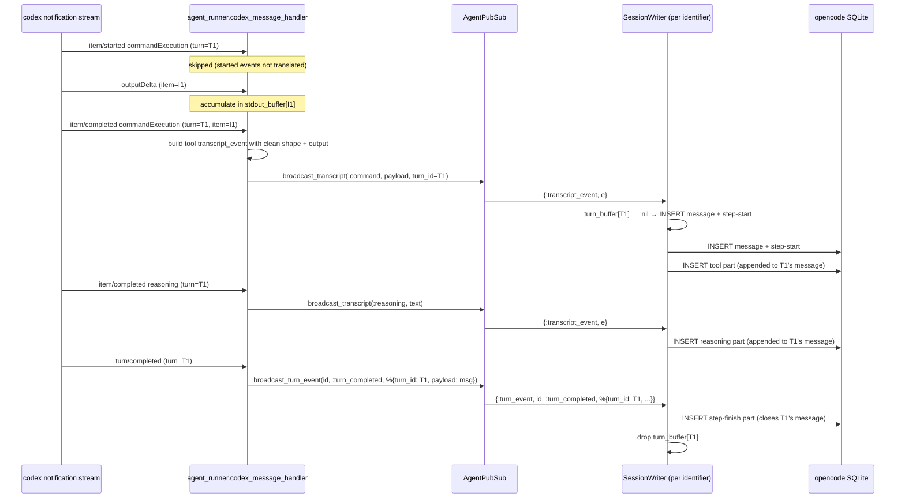
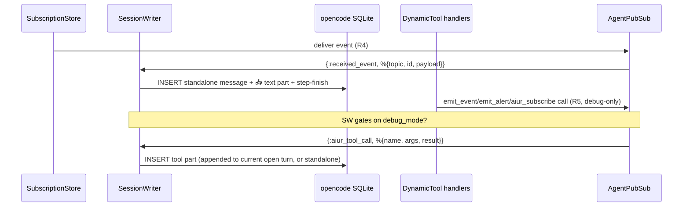

# feat: Aiur chat pane — native opencode parity + aiur event surface

## Overview

Today aiur synthesizes one opencode assistant message per codex event, producing dozens of stacked `▣ Build · issue-N · timing` chrome headers per agent turn with mostly empty bodies. This plan refactors `Aiur.Opencode.SessionWriter` to group every codex event sharing a `turnId` into a single assistant message, translates the codex item types we currently drop (`reasoning`, `dynamicToolCall`, `fileChange`), captures bash stdout, and adds two aiur-specific surfaces inline in the chat: incoming cross-ticket event cards (always shown) and outgoing aiur tool calls like `emit_event` / `aiur_subscribe` (shown only under `--debug`). The ULID-monotonic fix on `aiur/22-events-foundation` already gave us correct part ordering — this plan is the bigger UX correction on top of that foundation.

---

## Problem Frame

The chat pane is the operator's primary surface for watching an agent work. Today it shows so many empty chrome rows that the operator can't follow the work — they see `▣ Build · issue-N · 4.4s` repeated 8+ times with no visible commands or output. The operator's mental model is native opencode (which renders commands, reasoning, file edits, and tool calls fully inline under one assistant message per turn). Aiur's synthesis path drifted from that shape because the original session writer focused on "get events into the DB" rather than "render the agent's turn coherently."

The work also needs to surface the *cross-ticket coordination layer* the events-foundation PR (issue #22) is building — when ticket 100 subscribes to ticket 99's progress, ticket 100's chat pane should be where the operator sees ticket 99's signals arrive, not a separate event ticker.

See origin: `docs/brainstorms/2026-05-25-aiur-chat-pane-native-parity-requirements.md`.

---

## Requirements Trace

- **R1.** One assistant message per codex turn, keyed by `turnId`. Parts append on item completion. `step-start` on first event, `step-finish` on turn termination.
- **R2.** Translate `reasoning`, `dynamicToolCall`, `fileChange` codex items (currently dropped). Keep `agentMessage` and `commandExecution` translation; preserve unchanged `userMessage` rendering.
- **R3.** Clean tool-part shape — `state.input.command` without `$ ` prefix, populated `state.output` from accumulated outputDelta, descriptive `state.title`, `state.input.workdir` from agent workspace.
- **R4.** Cross-ticket received events render inline in chat as **system-role live-ticker rows** — one row per delivered event, always visible. Same SessionWriter shape as `session_writer.ex:131`'s alert path, repurposed for events. (Matches the events brainstorm's "live-as-emitted ticker" decision, which deliberately moved away from turn-boundary digest grouping because agent turns typically span an entire feature and turn-boundary delivery is too slow for coordination signals.)
- **R5.** Outgoing aiur tool calls (`emit_event`, `emit_alert`, `aiur_subscribe`, `aiur_unsubscribe`, `aiur_declare_blocker`, `aiur_unblock`) render as **system-role live-ticker rows** in chat — one row per published event, always visible (no `--debug` gate). Matches the events-foundation brainstorm's "every published event generates a one-line system-role row" model so cross-ticket coordination signals reach the operator faster than turn-boundary timing allows.
- **R6.** Resolve the duplicate "Starting work on issue #N…" rendering with a SessionWriter dedup guard, sized to cover the replay window.

**Origin acceptance examples:** AE1 (R1) — one chrome header per turn; AE2 (R2) — file-edit tools render as distinct parts; AE3 (R3) — clean bash shape with real stdout; AE4 (R4) — incoming event card always visible; AE5 (R5) — outgoing aiur calls visible only under `--debug`; AE6 (R6) — opening message appears exactly once after re-attach.

---

## Scope Boundaries

- Real-time output **streaming** during a long command (state.output updates as deltas arrive) — deferred. We accumulate deltas in memory and write to `state.output` only on item completion.
- Workflow-phase milestone markers (brainstorm→plan→work→review separators) — deferred; the agent_list ticker + alert sounds already cover this.
- Reasoning-item visibility toggle — deferred; reasoning is always shown for now.
- Narrow-pane `???` / merged-rows wrap bug in the agent_list pane — out of scope (tracked separately as task #19; different code surface).
- Modifying opencode itself — out of scope. We only synthesize opencode-shaped rows.
- Replacing the existing event-debug ticker on agent_list — out of scope; the chat-pane cards are a complement, not a replacement.

---

## Context & Research

### Relevant Code and Patterns

- `elixir/lib/aiur/opencode/session_writer.ex` — the GenServer that writes synthetic opencode rows. Currently `write_event/2` writes one message + step-start/body/step-finish per event. Needs per-turn buffering.
- `elixir/lib/aiur/opencode/protocol.ex` — owns the JSON wire shapes (`assistant_message_data`, `text_part_data`, `tool_part_data`, `step_start_part_data`, `step_finish_part_data`). New helpers needed for reasoning parts and richer tool input.
- `elixir/lib/aiur/agent_runner.ex` — `codex_message_handler/5` is the funnel for codex notifications. `transcript_event_from/2` decides what becomes a transcript event. Needs new branches for `reasoning`, `dynamicToolCall`, `fileChange`, plus outputDelta accumulation.
- `elixir/lib/aiur/agent_events.ex` — defines `transcript_event/3` and the role atom set. Will need a richer payload (typed part data) to carry tool / reasoning / file-change details, not just `body`.
- `elixir/lib/aiur/agent_pubsub.ex` — broadcasts transcript events on a per-identifier topic. SessionWriter subscribes here. No changes expected.
- `elixir/lib/aiur/issue_log.ex` — captures the same stream to disk and an in-memory ring buffer. `history/2` and `disk_history/2` feed SessionWriter replay. Replay race candidate for R6.
- `elixir/lib/aiur/codex/dynamic_tool.ex` — defines `emit_event`, `emit_alert`, `aiur_subscribe`, `aiur_unsubscribe`, `aiur_declare_blocker` tool surface. Handlers fire `event_publisher.(name, message, payload)` and return `%{ok: true, ...}` results. R5 inserts a tool-part at this seam.
- `elixir/lib/aiur/events/subscription_store.ex` — per-identifier inbox of received cross-ticket events. R4 hooks into the delivery path.
- `elixir/lib/aiur/events/debug_log.ex` — Phoenix.PubSub topic `aiur:events:debug` already used by the agent_list ticker. Can be reused for the SessionWriter to be alerted of inbox deliveries without duplicating SubscriptionStore wiring.
- `elixir/lib/aiur/agent_list/app.ex:137-179` — example of how `debug_mode?` is plumbed through (`opts[:debug?]` with `AIUR_DEBUG` env fallback). Reuse the same pattern for SessionWriter.

### Institutional Learnings

- `docs/solutions/` doesn't carry chat-pane-specific learnings yet. The closest are the opencode-row-shapes notes (`elixir/docs/notes/opencode-row-shapes-1.15.6.md`) — that's the authoritative shape reference.
- The ULID-monotonic fix (commit `2c4a5db` on this branch) means part lexical ordering is now reliable. We can append parts within a turn and trust them to render in insertion order.
- Recent prior art for SessionWriter changes: `Stop SessionWriter replay races + Ctrl+C trap crash (#83)` — the `await_replay` cap, single `BEGIN IMMEDIATE → COMMIT` transaction during replay, and per-identifier `:via` registration are stable patterns to keep.

### External References

None — opencode's row shape doc is in-repo (`elixir/docs/notes/opencode-row-shapes-1.15.6.md`), and the codex notification surface is observed empirically in `logs/agent.ndjson` dumps captured during the brainstorm.

---

## Key Technical Decisions

- **Turn-state lifetime — keep on SessionWriter state, not a separate process.** SessionWriter is already per-identifier (`:via` registry); adding a `current_turn` field plus a small `turns_buffer` map (keyed by `turn_id`) avoids spinning up a second GenServer per chat. Trade-off: SessionWriter mailbox processes turn events serially, which is what we want anyway (events for a single turn are inherently sequential). Rationale: minimum-viable change, no new supervision tree, single owner of part-ordering within a chat.
- **Turn termination signal — `broadcast_turn_event` already on the agent topic.** `agent_runner.ex:90` broadcasts via `AgentPubSub.broadcast_turn_event/3` (`agent_pubsub.ex:80-86`), which fans out on `AgentEvents.agent_topic(identifier)` as **`{:turn_event, identifier, event_tag, %{turn_id, payload}}`** (4-tuple). `event_tag` is one of `:turn_completed | :turn_failed | :turn_cancelled | :turn_input_required`. SessionWriter already subscribes to the agent topic in `handle_continue(:boot, ...)`, so it will receive these messages once a `handle_info({:turn_event, _, tag, payload}, state)` clause is added. No PubSub-layer changes required.
- **Out-of-turn events** (transcript events with `turn_id: nil`) — write a one-off message with its own step-start/body/step-finish, as today. R1.5 codified. The same code path handles aiur tool calls fired outside any open turn (per R5) and the standalone event cards for R4.
- **`fileChange` tool name → `"edit"`.** Native opencode renders `"read" | "write" | "edit"` with built-in TUI styling. `"edit"` is the closest match to codex's `fileChange` semantics. Validation step in U2: synthesize one test row with codex's actual `fileChange` payload, capture-pane on a live aiur run, confirm opencode's TUI renders cleanly (or falls back to generic). If the shape doesn't fit, fall back to a neutral tool name like `"fileChange"`.
- **Event-card visual marker — leading `📥` text part with a fixed format.** R4 cards are a single text part with the format:

  ```
  📥 <topic> from #<source_ticket>
  <payload summary>
  id=<event_id>
  ```

  Where `<payload summary>` is `Jason.encode!(payload)` truncated to 200 chars (with `…` if truncated). Missing `source_ticket` renders as `from #?`. Missing `payload` renders as `(no payload)`. Decision: avoid a bespoke "received event" tool name in opencode (might fall through to generic rendering). Plain text with a stable marker is readable and trivially testable. Open question 3 resolved.
- **Event-card chrome distinction — accept that R4 cards share the `▣ Build · issue-N · timing` chrome with turn messages.** The `📥` leading character in the text part is the visual differentiator. The chrome timing reflects only the card write window (sub-second), which is acceptable. If operators find cards hard to distinguish in practice, revisit via a distinct modelID in a follow-up.
- **Mid-turn re-attach replay** — when `replay_history` rebuilds the SQLite for a re-attached chat, *finalize any open turns* with a synthetic `step-finish` (`reason: "stop"`). Open question 4 resolved. **Replay ordering:** subscribe AFTER replay completes (swap the order in `handle_continue`) to eliminate the live-mailbox-during-replay race. Trade-off: live events that fire during the few-hundred-ms replay window land in PubSub but not in our subscription — they'll arrive in IssueLog regardless (IssueLog subscribes separately) and replay on the *next* attach. Cost is acceptable; benefit is no double step-finish race.
- **R6 dedup strategy — itemId when codex provides it; fallback (turn_id, role, body, sequence) hash; ring sized to ≥ history pull.** SessionWriter keeps a `seen_keys` ring sized to **600** (above the 500-event replay history cap in `replay_history/1`). Key encoding: prefer `event[:item_id]` (codex's itemId, present on most item types); fall back to `:erlang.phash2({turn_id, role, body, per_turn_sequence})` where `per_turn_sequence` is a monotonic counter scoped to the turn — so a repeated identical command within a turn (`ls` twice) produces distinct keys and isn't dropped. Doesn't require knowing the exact race source (replay-vs-live vs codex re-emission) — defends against all of them.
- **`outputDelta` accumulator ownership — per-identifier ETS table.** Closure capture can't mutate state across codex callbacks; Process dict belongs to whichever process invokes the on-message callback and is unsafe across concurrent agents. Use a single named ETS table `:aiur_codex_output_buffer`, keyed by `{identifier, item_id}`, holding `iodata` accumulators. Created in `Aiur.Application` start_link, cleared per-key on `item/completed`, and swept on turn termination. 256 KB cap per item with truncation marker per Open Questions.
- **U6 turn_id threading — read from SessionWriter at write-time, not from the broadcast site.** DynamicTool handlers don't have a turn_id parameter and threading one through every handler is invasive. Instead: when SessionWriter receives an `:aiur_tool` transcript event, it consults its own `turns_buffer` for the *most recently opened, still-open* turn for this identifier and appends the tool part there. If no open turn exists, it writes a standalone message. This puts the "current turn" decision at the only place that has authoritative state.
- **Turn-buffer leak protection — sweep on a fixed timer in U1, not punted.** SessionWriter installs a 10-minute periodic sweep (`Process.send_after/3`) that finalizes any turn whose first event landed > 10 minutes ago with `step-finish reason: "stop"`. This bounds memory and handles the "codex crashed mid-turn / never sent turn_completed" failure mode at scale, not just under manual verification.
- **Debug-mode plumbing for SessionWriter — read AIUR_DEBUG env at write-time, not at spawn.** SessionWriter reads `System.get_env("AIUR_DEBUG")` (or `Aiur.Config.debug?/0` if it exists; check during impl) at the moment it processes an `:aiur_tool` event. Avoids the static-flag staleness issue if operators toggle mid-session. Same pattern as how `Aiur.AgentList.App` flips between debug and non-debug rendering at handle_info time.
- **`AgentEvents.transcript_event/3` role expansion** — the role guard at `agent_events.ex:102` (`when role in [:user, :assistant, :system, :command, :alert]`) plus the `@type role` typespec must add `:reasoning`, `:tool`, and `:aiur_tool`. Additionally `IssueLog.tag_for_role/1` (`elixir/lib/aiur/issue_log.ex:275-278`) carries the same closed set for the disk log format — extend with stable tags (`reasoning`, `tool`, `aiur_tool`). The disk log is operator-readable but not externally consumed; tag stability is a soft constraint.
- **SubscriptionStore → AgentPubSub coupling for R4** — SubscriptionStore broadcasts `{:received_event, payload}` via `AgentPubSub.broadcast_received_event/2`, which uses the same `Process.whereis(@pubsub)` guard already in `AgentPubSub.do_broadcast/2`. Early-boot deliveries when PubSub isn't yet registered no-op safely. No direct `Phoenix.PubSub.broadcast` calls outside the AgentPubSub module.
- **Tests for new behavior live alongside existing `session_writer_test.exs` and `protocol_test.exs`.** Use direct GenServer message injection (`send(pid, msg)`) with synthetic `transcript_event` shapes — no `:meck` or codex mocking needed. SessionWriter accepts the protocol directly.

---

## Open Questions

### Resolved During Planning

- **OQ1 (origin): Turn-state lifetime.** Resolved — on SessionWriter state. See Key Technical Decisions above.
- **OQ2 (origin): fileChange tool name.** Resolved — `"edit"` (matches opencode's native edit tool, gets clean TUI styling).
- **OQ3 (origin): Event-card visual marker.** Resolved — single `text` part with leading `📥` + structured one-liner. Plain text, no custom tool name.
- **OQ4 (origin): Mid-turn re-attach replay.** Resolved — finalize open turns on replay with synthetic `step-finish reason: "stop"`.
- **R6 duplicate root cause.** Strongly suspected — `replay_history` reads `IssueLog.history` while a live event is in transit; SessionWriter subscribed first, so the live event also lands in the mailbox while replay is still running. Fix is dedup; identifying the exact race is nice-to-know but not required to ship.

### Deferred to Implementation

- **Exact dedup key encoding.** Pick `itemId` when codex provides one (most codex item types have one); fall back to `:erlang.phash2({turn_id, role, body})`. Final decision during implementation when we see the actual codex payload shapes.
- **`outputDelta` accumulation buffer eviction policy.** A long-running `mix test` could buffer megabytes. Cap at e.g. 256 KB per item, truncate with a `[...output truncated at N bytes...]` marker. Verify the actual size distribution during implementation; might be smaller in practice.
- **Replay write-amplification under U4 (dedup).** If dedup adds a per-event hash lookup inside the `BEGIN IMMEDIATE → COMMIT` replay transaction, profile to confirm the bounded ring keeps replay under the 10s await cap. Likely fine but worth measuring.

---

## High-Level Technical Design

> *This illustrates the intended approach and is directional guidance for review, not implementation specification. The implementing agent should treat it as context, not code to reproduce.*



The same `SessionWriter` also handles two side-channels:



---

## Implementation Units

- [ ] **U1. Per-turn message buffer in SessionWriter**

**Goal:** Refactor `Aiur.Opencode.SessionWriter` so all transcript events sharing a `turn_id` accumulate parts into one assistant message. First event of a turn writes the message + step-start; subsequent events append parts; the turn-end signal writes step-finish. Events with `turn_id: nil` keep today's one-message-each behavior.

**Requirements:** R1 (R1.1–R1.5).

**Dependencies:** None — baseline change.

**Files:**
- Modify: `elixir/lib/aiur/opencode/session_writer.ex`
- Test: `elixir/test/aiur/opencode/session_writer_test.exs`

**Approach:**
- Add `turns: %{}` to SessionWriter state, keyed by `turn_id`, value = `%{message_id, started_at_ms, part_count, last_event_at_ms}`.
- **Swap subscribe/replay order in `handle_continue(:boot, ...)` — replay first, subscribe after.** Eliminates the live-mailbox-during-replay race. Trade-off accepted in Key Technical Decisions.
- On `{:transcript_event, %{turn_id: tid} = e}` with `tid != nil`:
  - If `turns[tid]` exists, append body part(s) to its `message_id` (no new message, no step-start, no step-finish yet).
  - If not, INSERT new message + step-start in one transaction, then append body part(s). Record `started_at_ms` and bump `last_event_at_ms`.
- On `{:turn_event, _identifier, event_tag, %{turn_id: tid}}` (note the actual 4-tuple shape from `AgentPubSub.broadcast_turn_event/3`):
  - Map `event_tag` to step-finish `reason`: `:turn_completed → "stop"`, `:turn_failed → "error"`, `:turn_cancelled → "cancelled"`, `:turn_input_required → "stop"` (the agent is awaiting operator input; treat the turn as terminated for chat purposes).
  - Append step-finish; drop `turns[tid]`.
  - Idempotent: if `turns[tid]` missing, no-op (event arrived twice, or for an unseen turn).
- On `{:transcript_event, %{turn_id: nil}}`: standalone message path — message with step-start/body/step-finish in one transaction.
- On `{:transcript_event, %{role: :user}}`: keep today's filter (no-op; user messages render natively via opencode-attach).
- On replay: process events sequentially as today, but maintain `turns` buffer state during replay. At end of replay, finalize any still-open turn with synthetic step-finish (`reason: "stop"`).
- **Turn-buffer leak sweep:** on init, install `Process.send_after(self(), :sweep_open_turns, 60_000)` (every 60s). Sweep handler finalizes any turn whose `last_event_at_ms` is older than 10 minutes, then re-arms.

**Patterns to follow:**
- `Aiur.Opencode.SessionWriter.write_event/3` — same `with` pipeline shape, just split into "write message + step-start" and "append part" variants.
- `Aiur.Opencode.Db.with_transaction/1` — batch the new message + step-start in one transaction.
- ULID monotonicity guarantee (commit `2c4a5db`) — append-order is preserved by lexical id sort.

**Test scenarios:**
- *Happy path:* Three transcript events with the same `turn_id`, then a `turn_completed`. Covers AE1. Result: 1 message row, parts = step-start, body, body, body, step-finish. Ordered lexically.
- *Happy path:* Two transcript events with different `turn_id`s interleaved. Result: 2 messages, each with its own step-start/body/step-finish.
- *Edge case:* `turn_id: nil` event after a turn-grouped sequence. Result: standalone message with step-start/body/step-finish; the open turn buffer is untouched.
- *Edge case:* `turn_completed` for a `turn_id` that was never seen. Result: no crash; log warning at debug level; no DB write.
- *Edge case:* `turn_completed` arrives twice for the same turn. Result: step-finish written only once; second event no-ops.
- *Edge case:* `turn_failed` instead of `turn_completed`. Result: step-finish reason is `"error"` (or matching reason — finalize during implementation).
- *Integration:* `replay_history` with two open turns at history end. Result: both turns get synthetic step-finish; new live events after replay are treated as new turns.
- *Edge case:* sweep timer fires with a 12-minute-old open turn. Result: that turn gets synthetic step-finish with reason `"stop"` and is dropped from buffer.
- *Edge case:* `event_tag = :turn_input_required` arrives. Result: step-finish with `reason: "stop"`.
- *Edge case:* `event_tag = :turn_failed` arrives. Result: step-finish with `reason: "error"`.

**Verification:** Live aiur run shows ONE `▣ Build · issue-N · timing` header per agent turn in the chat pane, not many.

---

- [ ] **U2. Translate reasoning, dynamicToolCall, fileChange codex items**

**Goal:** Extend `Aiur.AgentRunner.codex_message_handler/5` so codex items currently dropped (reasoning, dynamicToolCall, fileChange) become transcript events with appropriate shape — and SessionWriter knows how to render each.

**Requirements:** R2.

**Dependencies:** U1 (uses the new "append part" path).

**Files:**
- Modify: `elixir/lib/aiur/agent_runner.ex`
- Modify: `elixir/lib/aiur/agent_events.ex` — **required**: expand the role guard at line 102 and `@type role` typespec to include `:reasoning`, `:tool`, `:aiur_tool`; add `:payload` opt to `transcript_event/3` for richer per-role data
- Modify: `elixir/lib/aiur/issue_log.ex` — `tag_for_role/1` needs new tag entries: `reasoning`, `tool`, `aiur_tool` (disk-log format)
- Modify: `elixir/lib/aiur/opencode/protocol.ex` (add `reasoning_part_data/2` helper)
- Modify: `elixir/lib/aiur/opencode/session_writer.ex` (route new transcript event shapes to part inserts; the existing `write_event(_, _, _) :: {:error, :unsupported_role}` fall-through needs new clauses for the new roles)
- Test: `elixir/test/aiur/opencode/session_writer_test.exs` (new shape rendering)
- Test: `elixir/test/aiur/opencode/protocol_test.exs` (new helpers)
- Test: `elixir/test/aiur/agent_events_test.exs` (role guard accepts new roles)

**Approach:**
- New `transcript_event_from/2` branches in `agent_runner.ex` for:
  - `item/completed reasoning` → role `:reasoning`, body = text.
  - `item/completed dynamicToolCall` → role `:tool`, payload includes `tool` (name), `input`, `output`, `title`.
  - `item/completed fileChange` → role `:tool`, payload encodes the file path + change summary; `tool: "edit"`. Implementer validates the rendered shape against opencode's TUI on first dispatch; if fallback to neutral `"fileChange"` is needed, swap in U2.
- Extend `AgentEvents.transcript_event/3` to accept a `:payload` opt for tool/reasoning details so the body field stays a string and richer data rides in payload.
- `SessionWriter.insert_body_parts/5` (or its successor): pattern-match on role → emit appropriate part shape.
- `Protocol.reasoning_part_data/2`: returns `%{"type" => "reasoning", "text" => text, "time" => %{...}}` per the row-shape doc.

**Patterns to follow:**
- `Aiur.AgentRunner.assistant_message_from_codex/1` and `system_activity_from_codex/1` — same with/case shape for the new item types.
- `Aiur.Opencode.Protocol.tool_part_data/1` — copy the keyword-opts pattern for new tool variants.

**Test scenarios:**
- *Happy path:* codex `item/completed reasoning` notification → `:reasoning` transcript event with the reasoning text.
- *Happy path:* codex `item/completed dynamicToolCall` with tool name `"github_create_issue"` → `:tool` transcript event with that tool name and the item's input/output.
- *Happy path:* codex `item/completed fileChange` with a path + diff summary → `:tool` event with `tool: "edit"`.
- *Edge case:* `item/started` (any of the above types) → still `:skip`, no transcript event.
- *Edge case:* reasoning text empty / missing → `:skip` (no part).
- *Integration (with U1):* a turn that contains agentMessage + reasoning + commandExecution + fileChange → one message with text + reasoning + tool + tool parts inside, plus surrounding step-start/step-finish. Covers AE2.

**Verification:** Chat pane for a real agent turn shows reasoning blocks, file-edit blocks, and MCP tool blocks alongside text and bash commands — not just text + bash.

---

- [ ] **U3. Clean bash tool-part shape + outputDelta capture**

**Goal:** Bash tool parts match the native opencode shape from `elixir/docs/notes/opencode-row-shapes-1.15.6.md` — clean `state.input.command` (no literal `$ ` prefix), populated `state.output` from accumulated codex `commandExecution/outputDelta` deltas, `state.title` from the codex-supplied description (or first 60 chars of command), `state.input.workdir` from the agent's workspace.

**Requirements:** R3 (R3.1–R3.3), AE3.

**Dependencies:** U1.

**Files:**
- Create: `elixir/lib/aiur/codex/output_buffer.ex` — small wrapper around a named ETS table `:aiur_codex_output_buffer` with `append/3`, `take/2`, `purge_identifier/1` helpers. Table is started via `Aiur.Application` supervision tree.
- Modify: `elixir/lib/aiur/application.ex` (start the ETS table in init/1)
- Modify: `elixir/lib/aiur/agent_runner.ex` (call OutputBuffer.append on outputDelta; OutputBuffer.take on item/completed; pass workspace path to event payload)
- Modify: `elixir/lib/aiur/opencode/protocol.ex` (`tool_part_data/1` accepts new opts; or `bash_tool_part_data/1` helper)
- Test: `elixir/test/aiur/codex/output_buffer_test.exs` (new)
- Test: `elixir/test/aiur/opencode/protocol_test.exs`
- Test: `elixir/test/aiur/opencode/session_writer_test.exs` (shape assertion against synthesized rows)

**Approach:**
- `Aiur.Codex.OutputBuffer` owns a named ETS table (`:set, :public, :named_table`) keyed by `{identifier, item_id}`, values are `iodata` accumulators.
  - `append/3` — `:ets.update_counter` not applicable for iodata; use `:ets.lookup` + `:ets.insert` with append. Cap individual entry at 256 KB; on overflow, mark `{truncated: true}` and stop appending.
  - `take/2` — returns assembled binary, deletes the key.
  - `purge_identifier/1` — sweep all keys matching identifier (used on turn-completed or session-writer terminate).
- In `codex_message_handler/5`, on `item/commandExecution/outputDelta`: `OutputBuffer.append(identifier, item_id, delta_bytes)`.
- On `item/completed commandExecution`: `output = OutputBuffer.take(identifier, item_id)`, then build the tool transcript event with the assembled output, the agent's workspace cwd, the codex-supplied description as title, and the raw command (no `$ ` prefix).
- On turn termination (any reason): `OutputBuffer.purge_identifier(identifier)` evicts any item_ids that never completed (codex crash mid-command). Prevents accumulator leak.
- Cap accumulated output at 256 KB per item; replace excess with `\n[...truncated]\n`.

**Patterns to follow:**
- Native opencode bash row in `elixir/docs/notes/opencode-row-shapes-1.15.6.md` — copy field shapes.

**Test scenarios:**
- *Happy path:* `item/completed commandExecution` with `command: "git status --short"`, `description: "Shows current git status"`, captured output `"?? test-sandbox/\n"`. Covers AE3. Result: `state.input.command == "git status --short"` (no `$ ` prefix), `state.input.description == "Shows current git status"`, `state.input.workdir` is the agent workspace path, `state.output == "?? test-sandbox/\n"`, `state.title == "Shows current git status"`.
- *Edge case:* command with no description. Result: `state.title` is the first 60 chars of the command.
- *Edge case:* very long output (> 256 KB). Result: truncated with marker; original `state.output` size in the configured cap range.
- *Edge case:* `commandExecution` with no preceding outputDelta events (instant command). Result: `state.output == ""` (acceptable; not a crash).
- *Integration:* full turn with one command — operator opens the chat pane and reads the command + output as a single block.

**Verification:** Synthesized bash tool part matches the field-by-field shape in the row-shape doc for any sample command.

---

- [ ] **U4. SessionWriter dedup guard for duplicate transcript events**

**Goal:** Resolve the duplicate "Starting work on issue #N…" rendering. SessionWriter rejects a second insert that matches the same dedup key (`itemId` if codex provides; otherwise hash of `{turn_id, role, body}`).

**Requirements:** R6, AE6.

**Dependencies:** None structurally; U1 makes the implementation cleaner since `write_event` is already being touched.

**Files:**
- Modify: `elixir/lib/aiur/opencode/session_writer.ex` (add `seen_keys` bounded ring to state, gate insert on dedup)
- Test: `elixir/test/aiur/opencode/session_writer_test.exs`

**Approach:**
- State adds `seen_keys :: :queue.queue(term())` with cap of **600** (above the 500 history pull in `replay_history`, comfortable margin).
- Per-turn monotonic counter (`turn_sequence` in `turns[tid]` state) to disambiguate legitimate repeats of the same command/text within a turn.
- Compute key from event:
  - If `event[:item_id]` present (most codex item types carry one): key = `{:item, item_id}`.
  - Else: key = `{:hash, :erlang.phash2({event.turn_id, event.role, event.body, turn_sequence})}`.
- Before insert: if key in queue → log debug and `{:noreply, state}`. Otherwise enqueue (with cap eviction) and proceed.
- Replay populates the ring as it writes, so any cached PubSub event arriving after replay (caught by the swap-subscribe-after-replay change in U1) collides on the key.

**Patterns to follow:**
- `:queue.in/2` + `:queue.out/1` for a bounded FIFO.

**Test scenarios:**
- *Happy path:* Same transcript event delivered twice → only one DB row written; second is a no-op.
- *Happy path:* Two distinct events with same body but different `turn_id` → both written (key includes turn_id).
- *Edge case:* `seen_keys` exceeds cap. Result: oldest key evicted; very-old replay of the same event would write again (acceptable — caps prevent unbounded memory).
- *Integration (with replay):* simulate replay race — same event in IssueLog.history AND in PubSub mailbox during boot. Result: written exactly once. Covers AE6.

**Verification:** Run aiur, attach to an agent, detach, re-attach. The opening "Starting work on…" message appears exactly once.

---

- [ ] **U5. Inline cross-ticket received-event ticker rows**

**Goal:** When the SubscriptionStore delivers a cross-ticket event to an agent's inbox, SessionWriter writes a **system-role one-line ticker row** in opencode — always visible, no `--debug` gate. Matches the events brainstorm's "live-as-emitted ticker" decision and the existing alert path at `session_writer.ex:131`.

**Requirements:** R4 (R4.1–R4.4), AE4.

**Dependencies:** U1 (cleaner integration with the message-write API).

**Files:**
- Modify: `elixir/lib/aiur/opencode/session_writer.ex` (new `handle_info/2` for `{:received_event, payload}`)
- Modify: `elixir/lib/aiur/events/subscription_store.ex` (broadcast delivery via `AgentPubSub` so SessionWriter sees it)
- Modify: `elixir/lib/aiur/agent_pubsub.ex` (new helper `broadcast_received_event/2` if not already present)
- Test: `elixir/test/aiur/opencode/session_writer_test.exs`
- Test: `elixir/test/aiur/events/subscription_store_test.exs` (broadcast happens on delivery)

**Approach:**
- SubscriptionStore, at the delivery seam (`handle_info({:event, event}, state)` in `subscription_store.ex:276+`), calls `AgentPubSub.broadcast_received_event(identifier, %{topic, id, payload, source_ticket})`. New helper in `agent_pubsub.ex` mirrors `broadcast_transcript/2` and uses the same `Process.whereis(@pubsub)` guard via `do_broadcast/2` — never bypasses to bare `Phoenix.PubSub.broadcast`. Early-boot deliveries before PubSub init no-op safely.
- SessionWriter receives `{:received_event, e}` on its existing agent-topic subscription (no new subscribe call).
- On receipt: write a **system-role one-line message** using a new `write_system_ticker_row/2` helper that mirrors `write_standalone/2` but constructs the assistant message with `role: "system"` (not `"assistant"`). Opencode's TUI renders system-role rows with distinct styling — no `▣ Build · ...` chrome header. Format:
  ```
  📥 <topic> · from #<source_ticket> · id=<event_id>
  ```
  (Single line — payload details belong in the per-issue log file and dashboard panel, not the chat ticker.)
- **Replay idempotency:** dedup key uses `{:received_event, event_id}` and is fed through U4's ring. SubscriptionStore re-delivery on restart hits the dedup ring; doesn't double-write.

**Patterns to follow:**
- `Aiur.AgentPubSub.broadcast_transcript/2` — same broadcast shape, distinct message tag.
- R4.4 (origin) — write once on delivery, never re-emit on replay.

**Test scenarios:**
- *Happy path:* SubscriptionStore receives an event matching a pattern → broadcasts `{:received_event, ...}` → SessionWriter writes a message with text part containing `📥 <topic>` and the payload summary. Covers AE4.
- *Edge case:* SessionWriter receives the same `{:received_event, ...}` twice → only one DB row (covered by U4 dedup, with key including `event_id`).
- *Edge case:* `--debug` off → event card still written (R4.3).
- *Integration:* Ticket 100's agent has `aiur_declare_blocker(99)`. Ticket 99 emits `progress.tests-green`. Ticket 100's chat pane shows the card.

**Verification:** Manual: dispatch two test tickets with a subscription between them; trigger an emit on the subscribed-to ticket; confirm a card appears in the subscriber's chat pane.

---

- [ ] **U6. Outgoing aiur tool-call ticker rows**

**Goal:** Every aiur-owned tool emission (`emit_event`, `emit_alert`, `aiur_subscribe`, `aiur_unsubscribe`, `aiur_declare_blocker`, `aiur_unblock`) writes a **system-role one-line ticker row** in the calling agent's chat pane — always visible, no `--debug` gate. Same SessionWriter path as U5 (received events), just from the outgoing side. Matches the events brainstorm's "every published event = live system-row" rule.

**Requirements:** R5, AE5.

**Dependencies:** U5 (shares `write_system_ticker_row/2` helper and `:received_event`-style broadcast path).

**Files:**
- Modify: `elixir/lib/aiur/codex/dynamic_tool.ex` — after each tool handler succeeds, broadcast `{:emitted_event, %{tool, input, output, identifier}}` via a new `AgentPubSub.broadcast_emitted_event/2`. (Distinct PubSub tag from received events so SessionWriter can format the ticker row differently if useful.)
- Modify: `elixir/lib/aiur/opencode/session_writer.ex` — handle `{:emitted_event, e}` by writing a system-role ticker row via the shared `write_system_ticker_row/2` helper from U5.
- Modify: `elixir/lib/aiur/agent_pubsub.ex` — add `broadcast_emitted_event/2`, mirror existing guards.
- Test: `elixir/test/aiur/codex/dynamic_tool_test.exs` (broadcast happens for each aiur tool handler).
- Test: `elixir/test/aiur/opencode/session_writer_test.exs` (ticker row format).

**Approach:**
- Each successful DynamicTool handler call broadcasts `{:emitted_event, %{tool, input, output, identifier}}`. SessionWriter renders as a single-line system-role ticker row:
  ```
  📤 <tool_name> · <one-line input summary>
  ```
- No turn-id threading needed — the row is a standalone system-role message (chrome-less per opencode's system styling).
- No `--debug` gating — emissions are signal, not noise. Operator sees every coordination move the agent makes.

**Patterns to follow:**
- U5's `write_system_ticker_row/2` helper.
- Existing alert path at `session_writer.ex:131` for system-role row construction.

**Test scenarios:**
- *Happy path:* `emit_event("progress.tests-green", "...")` handler succeeds. Result: SessionWriter writes a system-role row with `📤 emit_event · progress.tests-green`. Covers AE5.
- *Happy path:* `emit_alert("attention.review-ready", "...")` handler succeeds. Result: system-role row `📤 emit_alert · attention.review-ready`.
- *Happy path:* `aiur_declare_blocker(99)` handler succeeds. Result: row `📤 aiur_declare_blocker · #99`.
- *Edge case:* handler returns `{:error, reason}`. Result: row still written, marker prefixed with `⚠ ` to signal failure.
- *Edge case:* DynamicTool called before SessionWriter is up. Result: broadcast no-ops via the AgentPubSub guard; no crash.
- *Integration:* agent emits `progress.brainstorm-end` mid-turn. Pane shows the system-row ticker entry between agent-message turns without disturbing the open turn's message structure.

**Verification:** Live aiur run. Any aiur tool call from a running agent produces a one-line `📤 ...` row in that agent's chat pane immediately, regardless of `AIUR_DEBUG`.

---

## System-Wide Impact

- **Interaction graph:** `agent_runner.ex` (codex notification funnel) → `AgentPubSub.broadcast_transcript` → `SessionWriter` (writes to opencode DB), `IssueLog` (writes to disk + ring buffer). Adds: `SubscriptionStore` (delivery seam) → `AgentPubSub.broadcast_received_event` → `SessionWriter`. Adds: `DynamicTool` (after tool handler) → `AgentPubSub.broadcast_transcript(:aiur_tool, ...)` → `SessionWriter` (debug-gated).
- **Error propagation:** SessionWriter insert failures already log + continue (`Logger.warning("opencode_session_writer write_failed ...")`). New part-insert calls keep the same posture — log + continue, never crash the writer.
- **State lifecycle risks:**
  - *Open turns at writer crash:* SessionWriter GenServer crash drops `turns` map; no rows orphaned because step-start was already written. Re-attach replay reconstructs (and finalizes open turns per OQ4).
  - *outputDelta accumulator leak:* if a `commandExecution` never gets an `item/completed` event (codex crash mid-command), the accumulator entry stays. Mitigation: clear accumulator on turn termination (since turn_completed implies any in-flight commands are abandoned).
  - *Replay double-write under U4:* dedup key in `seen_keys` ring; replay re-populates the ring as it writes, so any cached PubSub event arriving during replay collides on the key.
- **API surface parity:** `AgentEvents.transcript_event/3` gains a `:payload` opt — internal API only; no external consumers.
- **Integration coverage:** SessionWriter ↔ AgentPubSub ↔ DynamicTool path has no direct unit-test coverage today; add integration tests in `session_writer_test.exs` that exercise the full broadcast→write flow with fake codex notifications.
- **Unchanged invariants:** `Aiur.Opencode.Db` schema, `Aiur.Opencode.Protocol.assistant_message_data/1` field set (still mode/agent="build", same modelID format), `Aiur.IssueLog` disk format. ULID monotonicity (commit `2c4a5db`) is unchanged. Slot lifecycle is unchanged.

---

## Risks & Dependencies

| Risk | Mitigation |
|---|---|
| Turn-buffer state leaks if `turn_completed` never fires | 60s periodic sweep in U1 finalizes turns whose `last_event_at_ms` is > 10 min old with `step-finish reason: "stop"`. Bounded memory regardless of codex behavior. |
| Mid-turn re-attach replay (OQ4 resolution) misorders parts | Synthetic step-finish is appended *after* the last real part for that turn; ULID monotonicity guarantees ordering since the synthetic finish is generated with the highest timestamp at replay time. |
| Replay race writes step-finish twice (real + synthetic) | U1 swaps subscribe/replay order — subscribe AFTER replay completes. Eliminates live-mailbox-during-replay class of duplicate. |
| outputDelta accumulator grows unbounded on a runaway agent | 256 KB cap per item with truncation marker. Also `OutputBuffer.purge_identifier/1` clears all entries on turn termination. |
| Dedup ring misses duplicates older than the ring window | Ring sized to 600 (above the 500 history pull). Fallback hash key includes per-turn sequence counter so legitimate repeats aren't dropped. |
| `AIUR_DEBUG` read at write time instead of at SessionWriter init | Same pattern as `AgentList.App` — read env at decision time, not start. Survives operator toggling and avoids stale-flag bugs. |
| `:meck` or test-mock setup grows complex | Prefer GenServer-direct `send(pid, msg)` tests over mocking codex; SessionWriter accepts synthetic transcript events natively. |
| `fileChange` tool name `"edit"` may not match opencode's edit renderer input shape | U2 includes an empirical verification step on first dispatch — capture-pane on a real fileChange and confirm rendering; fall back to a neutral tool name if the shape doesn't fit. |

---

## Documentation / Operational Notes

- `elixir/AGENTS.md` and the in-repo `elixir/docs/notes/opencode-row-shapes-1.15.6.md` already document the SessionWriter / row-shape contract. Update the row-shapes note if any new part shape diverges from native opencode (reasoning + tool parts should match exactly).
- No new env vars, config flags, or Slack channels.
- No rollout/migration — change is invisible to operators except that the chat panes start rendering correctly. Existing rows in `~/.local/share/opencode/opencode.db` remain in their old shape; only new turns benefit. No backfill needed.
- PR body follows the template; include a Complexity routing block citing `complexity:4` rationale (cross-cutting SessionWriter + DynamicTool + SubscriptionStore touches).

---

## Sources & References

- **Origin document:** `docs/brainstorms/2026-05-25-aiur-chat-pane-native-parity-requirements.md`
- **Row-shape contract:** `elixir/docs/notes/opencode-row-shapes-1.15.6.md`
- **Foundation commit:** `2c4a5db` (Fix chat-pane empty-body bug via monotonic ULIDs) on this branch — gates correct lexical part ordering.
- **Events foundation:** `elixir/lib/aiur/events/{publisher,subscription_store,exchange,topic}.ex`, `elixir/lib/aiur/codex/dynamic_tool.ex` — surfaces R4 and R5 depend on.
- **Related issue:** #22 (events-foundation PR — this work lives on top of it).
