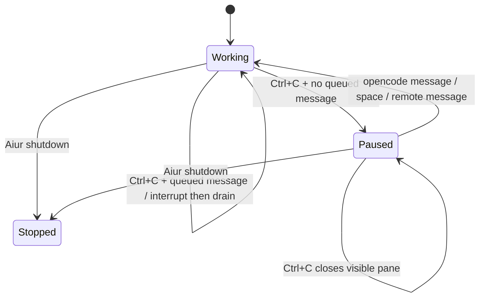

# Fix Remote Control Shutdown and Interrupt Parity

## Summary

This plan hardens the persistent Claude REPL path by making shutdown cleanup authoritative, mirroring remote-origin user turns into the local chat transcript, and adding a local interrupt/pause flow that drains queued opencode messages with Claude/Codex-like semantics.

---

## Problem Frame

The RC dual-chat branch can launch issue #101 with a live Claude Remote Control URL, but the last manual run showed lifecycle and interaction gaps: local shutdown did not clearly end the remote-capable session, remote-origin messages were not visible in opencode, and opencode-origin messages required a remote stop action before the agent consumed them.

---

## Requirements

- R1. Closing Aiur must terminate every local persistent Claude REPL process, tmux pane, and descendant process owned by the current run.
- R2. Stopping Aiur must not schedule issue retries or leave a local worker able to continue issue #101 after shutdown begins.
- R3. Remote Control session visibility must reflect live local ownership where Aiur can control it.
- R4. User turns sent from Claude Remote Control must be rendered into the opencode conversation for the same issue.
- R5. User turns sent from opencode must be delivered to the persistent Claude session and must leave the queued state once consumed or explicitly failed.
- R6. Aiur must log remote-origin and opencode-origin user turns with enough source metadata to debug ordering and delivery failures without exposing secrets.
- R7. Pressing Ctrl+C once while a working agent has queued operator messages must interrupt, drain the queued message into the next turn, and continue with the new context.
- R8. Pressing Ctrl+C once while a working agent has no queued operator messages must pause the agent until the operator sends another message or resumes it.
- R9. Pressing Ctrl+C while already paused must close the visible opencode pane and keep the agent paused.
- R10. Interrupt handling must preserve the invariant that active tool work may finish before interruption applies.
- R11. The next manual run must preserve enough transcript and runtime evidence for debugging.
- R12. The implementation must be covered by focused tests plus the real CLI manual run.

**Origin actors:** A1 Operator, A2 Running agent, A3 Aiur runtime, A4 Claude Remote Control surface
**Origin flows:** F1 Shutdown teardown, F2 Remote-origin message appears locally, F3 Opencode message drains after local interrupt, F4 Ctrl+C pause/kill semantics
**Origin acceptance examples:** AE1, AE2, AE3, AE4, AE5

---

## Scope Boundaries

- Do not attempt to remove historical Claude app session entries that are no longer locally driven.
- Do not change event-flow ticket semantics beyond verification needs.
- Do not merge PR #256 without explicit operator approval.

### Deferred to Follow-Up Work

- A richer remote session browser or stale-session cleanup UI is separate product work.

---

## Context & Research

### Relevant Code and Patterns

- `src/lib/aiur/claude/repl_agent.ex` owns persistent Claude REPL lifecycle, transcript tailing, prompt delivery, and immediate operator message delivery.
- `src/lib/aiur/shutdown.ex` centralizes graceful shutdown and already calls `ReplAgent.sweep_own_panes/0` and workspace process reaping.
- `src/lib/aiur/orchestrator.ex` owns queue state, pause/resume controls, delivery policy normalization, and running-entry control capabilities.
- `src/lib/aiur/opencode/chat_completions.ex` owns opencode chat request handling and currently closes SSE streams for interrupt-like outcomes.
- `src/lib/aiur/agent_queue.ex` and `src/lib/aiur/agent_queue_store.ex` own queued operator message metadata and visible queue state.
- `src/lib/aiur/agent_list/input.ex` maps raw TUI keys for the agent list; opencode pane Ctrl+C flow goes through the opencode integration path, not the agent list.
- `src/log/record/chat.101.ansi` and `src/log/aiur.101.log` from the last run show `hi` queued, `system: :prompt_not_delivered`, remote `Request interrupted by user`, and repeated `Aiur Events` prompt output.

### Institutional Learnings

- `AGENTS.md` defines manual testing strictly as real `scripts/aiurdev --test`/`--test3` TUI interaction via tmux.
- Existing handoff notes warn not to substitute logs or HTTP-only checks for opencode pane rendering.

### External References

- No external research needed; this is an internal lifecycle and TUI parity change with established repo patterns.

---

## Key Technical Decisions

- Use the existing queue and pause/resume control boundary rather than creating a parallel RC control store.
- Treat REPL interrupt as a backend capability so the orchestrator can expose `:interrupt` delivery for `claude-repl` without special-casing every caller.
- Preserve local shutdown guarantees independently from Claude's remote UI history; tests should prove local processes and panes are gone.
- Add diagnostics at source boundaries, not by dumping raw transcript or secrets.

---

## Open Questions

### Resolved During Planning

- Should Ctrl+C be the local interrupt primitive? Yes. It matches the requested Claude/Codex mental model and existing operator expectations.
- Should remote-origin messages be visible in opencode? Yes. The dual-chat feature is one shared session, so user turns from either side must render.

### Deferred to Implementation

- Whether opencode exposes Ctrl+C as a distinguishable request shape or only as an interrupted SSE/request outcome must be confirmed in `chat_completions.ex`.
- Whether remote-origin user transcript records carry enough source metadata to distinguish app-origin from Aiur-origin messages must be confirmed against transcript normalization.

---

## High-Level Technical Design

> *This illustrates the intended approach and is directional guidance for review, not implementation specification. The implementing agent should treat it as context, not code to reproduce.*

---

## Implementation Units

### U1. Characterize Current Logs and Add Diagnostics

**Goal:** Make the next run debuggable without relying on manual recollection.

**Requirements:** R6, R11

**Dependencies:** None

**Files:**
- Modify: `src/lib/aiur/claude/repl_agent.ex`
- Modify: `src/lib/aiur/orchestrator.ex`
- Test: `src/test/aiur/orchestrator_status_test.exs`
- Test: `src/test/aiur/claude/repl_agent_test.exs` if present, otherwise create a focused test module under `src/test/aiur/claude/`

**Approach:**
- Add source-aware, redacted log markers for operator queue enqueue, queue claim, REPL delivery attempt, REPL interrupt, prompt delivery failure, and shutdown cleanup.
- Keep sensitive URLs and tokens out of logs.

**Execution note:** Characterization-first: add tests for existing log/queue metadata behavior before changing delivery semantics where practical.

**Patterns to follow:**
- Existing issue log and orchestrator queue tests in `src/test/aiur/orchestrator_status_test.exs`.
- Existing redaction discipline around `repl_rc_session_url`.

**Test scenarios:**
- Integration: enqueue an operator message and assert source/delivery metadata survives through claim.
- Error path: prompt delivery failure is recorded as a structured reason without logging raw secrets.

**Verification:**
- The next manual run can show when a message entered the queue, when it was claimed, and whether delivery succeeded.

---

### U2. Make REPL Shutdown Authoritative

**Goal:** Ensure Aiur shutdown terminates all local REPL panes and process trees for the current run.

**Requirements:** R1, R2, R3, R11

**Dependencies:** U1

**Files:**
- Modify: `src/lib/aiur/claude/repl_agent.ex`
- Modify: `src/lib/aiur/shutdown.ex`
- Modify: `src/lib/aiur/claude/remote_control.ex`
- Test: `src/test/aiur/claude/repl_agent_test.exs`
- Test: `src/test/aiur/shutdown_test.exs` if present, otherwise create focused coverage under `src/test/aiur/`

**Approach:**
- Verify `sweep_own_panes/0` can identify all current-run REPL windows and kill their process trees, not just direct pane PIDs.
- Ensure shutdown suppresses retry scheduling for agents that fail because shutdown killed their REPL pane.
- Add cleanup evidence that can be inspected after `aiurdev stop`.

**Patterns to follow:**
- Codex process-tree reaping in `src/lib/aiur/codex/coding_agent.ex`.
- Existing `RemoteControl.graceful_kill_tree/1` usage.

**Test scenarios:**
- Happy path: current-run REPL pane is killed during shutdown sweep.
- Edge case: side-by-side REPL pane with another owner pid is not killed.
- Error path: a run ending with `:repl_gone` during shutdown is not scheduled as normal retry work.

**Verification:**
- Host-level process checks after `aiurdev stop` show no local issue #101 REPL driver remains.

---

### U3. Mirror Remote-Origin User Turns into Opencode

**Goal:** Render Claude Remote Control user messages in the local opencode conversation.

**Requirements:** R4, R6, R11

**Dependencies:** U1

**Files:**
- Modify: `src/lib/aiur/claude/transcript.ex`
- Modify: `src/lib/aiur/claude/transcript_tailer.ex`
- Modify: `src/lib/aiur/issue_log.ex`
- Test: `src/test/aiur/claude/transcript_test.exs`
- Test: `src/test/aiur/log_file_test.exs`

**Approach:**
- Confirm how remote-origin user turns appear in Claude's transcript JSONL.
- Normalize those transcript records to the same visible user event shape opencode already renders for local operator messages, with source metadata retained for logs.
- Avoid double-rendering Aiur-origin messages that were typed into the REPL from opencode.

**Patterns to follow:**
- Existing `test "a bare user prompt string -> one :user event"` in `src/test/aiur/claude/transcript_test.exs`.
- Existing transcript event routing from `ReplAgent.start_turn_tailer/4`.

**Test scenarios:**
- Happy path: a remote-origin user transcript record becomes one visible user event.
- Edge case: an Aiur-origin injected message does not render twice.
- Error path: unknown user record shapes are skipped or logged without crashing the tailer.

**Verification:**
- Manual run shows `hello` sent from Claude Remote Control in the opencode pane.

---

### U4. Add Local Interrupt and Queue-Drain Semantics for REPL

**Goal:** Let Ctrl+C in opencode interrupt the REPL turn, drain pending operator messages, and continue with the new context.

**Requirements:** R5, R7, R8, R10, R11

**Dependencies:** U1, U3

**Files:**
- Modify: `src/lib/aiur/coding_agent.ex`
- Modify: `src/lib/aiur/claude/repl_agent.ex`
- Modify: `src/lib/aiur/orchestrator.ex`
- Modify: `src/lib/aiur/opencode/chat_completions.ex`
- Test: `src/test/aiur/coding_agent_test.exs`
- Test: `src/test/aiur/orchestrator_status_test.exs`
- Test: focused opencode chat-completion tests if an existing module covers interrupt handling

**Approach:**
- Expose REPL interrupt support through existing backend capability APIs.
- Map opencode Ctrl+C/request interruption to an orchestrator pause/interrupt control request for the selected issue.
- If queued operator messages exist, interrupt the active REPL turn and make the next turn drain the operator queue immediately.
- If no queued operator messages exist, pause instead of resuming automatically.

**Patterns to follow:**
- Existing `:interrupt` queue policy tests in `src/test/aiur/orchestrator_status_test.exs`.
- Existing SSE close behavior for interrupt-like outcomes in `src/lib/aiur/opencode/chat_completions.ex`.

**Test scenarios:**
- Happy path: queued opencode message plus interrupt marks the item as interrupt-priority and worker receives the control message.
- Edge case: interrupt with no queued operator item pauses the agent.
- Error path: unsupported backend returns a clear error and does not consume queue items.
- Integration: REPL worker receives interrupt, completes current safe point, and claims operator queue item before continuing.

**Verification:**
- Manual run shows `hi` leaving queued state after one Ctrl+C and the agent continuing with `hi` in context.

---

### U5. Preserve Paused-Agent Pane Semantics

**Goal:** Pressing Ctrl+C while already paused closes the visible opencode pane without resuming or killing paused agent state.

**Requirements:** R8, R9

**Dependencies:** U4

**Files:**
- Modify: `src/lib/aiur/pane_manager.ex`
- Modify: `src/lib/aiur/opencode/chat_completions.ex`
- Modify: `src/lib/aiur/orchestrator.ex`
- Test: `src/test/aiur/orchestrator_status_test.exs`
- Test: focused pane manager tests if an existing module covers pane closure

**Approach:**
- Detect interrupted input while the running entry is already paused.
- Close the visible chat pane through existing pane manager closure paths.
- Keep the running entry paused so the agent list remains the source of truth.

**Patterns to follow:**
- Existing pause/resume status tests in `src/test/aiur/orchestrator_status_test.exs`.
- Existing close paths in `src/lib/aiur/pane_manager.ex`.

**Test scenarios:**
- Happy path: Ctrl+C while paused closes visible pane and keeps status `:paused`.
- Edge case: Ctrl+C while paused with no visible pane is a no-op on pane state and keeps status `:paused`.

**Verification:**
- Manual run shows the pane closes while the selected issue remains paused in the agent list.

---

### U6. Manual Verification and CI Follow-Through

**Goal:** Prove the full feature works in the real CLI and keep PR #256 green.

**Requirements:** R12

**Dependencies:** U2, U3, U4, U5

**Files:**
- Modify: `handoff.md` if kept as local handoff artifact; do not commit unless intentionally tracked.
- No source files expected.

**Approach:**
- Run targeted tests after each unit, then the local build/lint/dialyzer gate.
- Run `scripts/aiurdev --test3 --force --allow-remote` through the canonical wrapper tmux flow.
- Verify shutdown with host-level process checks.
- Push small commits and watch GitHub checks for PR #256.

**Patterns to follow:**
- Manual testing section in `AGENTS.md`.
- Existing PR #256 CI check workflow.

**Test scenarios:**
- Manual: remote `hello` appears locally.
- Manual: opencode `hi` queues, Ctrl+C drains it, and agent continues.
- Manual: Ctrl+C with no queue pauses; Ctrl+C while paused closes pane.
- Manual: shutdown leaves no local agent process.

**Verification:**
- Local gates pass, manual CLI proof is recorded, and GitHub PR checks are green.

---

## System-Wide Impact

- **Interaction graph:** opencode chat input, orchestrator queue state, Claude REPL transcript tailing, and shutdown cleanup all meet at the running issue entry.
- **Error propagation:** delivery failures must restore or fail queue items explicitly so visible queued state is not misleading.
- **State lifecycle risks:** shutdown can race with agent task retry scheduling; interrupt can race with queue claim and transcript tailing.
- **API surface parity:** backend capability flags must stay consistent across codex, one-shot Claude, and Claude REPL backends.
- **Integration coverage:** unit tests must be backed by real TUI manual verification because opencode/Claude behavior depends on live process interaction.
- **Unchanged invariants:** event-flow issue completion and PR merge approval rules do not change.

---

## Risks & Dependencies

| Risk | Mitigation |
|------|------------|
| Claude Remote Control may keep stale historical sessions visible after local process teardown | Define success as local ownership teardown and document any Claude-side stale entry separately |
| opencode Ctrl+C may not expose a clean semantic hook | Characterize `chat_completions.ex` request/interruption behavior first and route through the nearest existing control path |
| Remote-origin transcript records may be hard to distinguish from Aiur-injected messages | Add source-aware diagnostics and dedupe by turn/event identity where available |
| Interrupt could drop queued messages | Restore or fail delivered queue items explicitly on any delivery error |

---

## Documentation / Operational Notes

- Update `handoff.md` at the end of the run with the new current state if it remains the local handoff artifact.
- Do not mention AI or agent tooling in commit messages beyond existing product terms like Claude Remote Control, opencode, or Aiur.
- Keep commit messages small and behavior-focused.

---

## Sources & References

- **Origin document:** [docs/brainstorms/2026-06-10-rc-shutdown-interrupt-parity-requirements.md](../brainstorms/2026-06-10-rc-shutdown-interrupt-parity-requirements.md)
- Related plan: [docs/plans/2026-06-08-002-feat-repl-dual-chat-driver-plan.md](2026-06-08-002-feat-repl-dual-chat-driver-plan.md)
- Related code: `src/lib/aiur/claude/repl_agent.ex`
- Related code: `src/lib/aiur/orchestrator.ex`
- Related code: `src/lib/aiur/opencode/chat_completions.ex`
- Related evidence: `src/log/record/chat.101.ansi`
- Related evidence: `src/log/aiur.101.log`
- Related PR: #256
