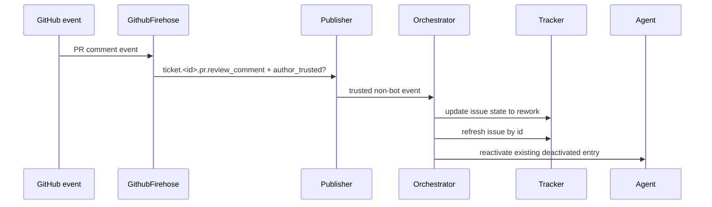

# fix: Auto-trigger rework from owner PR comments

## Summary

When a trusted CODEOWNER comments on an agent PR while the linked issue is parked in `human-review`, Aiur should move that issue to `rework` so the existing active-state dispatch path starts or resumes the agent. The fix extends the current GitHub firehose and orchestrator comment-reactivation path instead of adding a second PR-comment poller.

---

## Problem Frame

Aiur already publishes PR conversation comments and review comments to `ticket.<id>.issue.commented` and `ticket.<id>.pr.review_comment`, and live agents subscribe to those topics. The idle case fails because `human-review` entries are intentionally deactivated and excluded from active dispatch; the current reactivation hook only wakes them after some other actor has already flipped the issue back to an active state.

---

## Requirements

**Comment detection and routing**

- R1. A PR review comment or PR conversation comment from a trusted CODEOWNER on an agent PR transitions the linked issue from `human-review` to `rework`.
- R2. The transition must key by the agent issue identifier resolved from the PR head branch (`aiur/<id>`), not by the PR number.
- R3. Comments from the configured agent/bot account must not trigger rework.

**Dispatch behavior**

- R4. If the issue has a deactivated in-memory entry, the existing active-state reactivation path should wake the agent after the issue refresh observes `rework`.
- R5. If a live agent is already working or paused for the issue, the comment event should remain a normal delivered event and must not spawn a duplicate.
- R6. If no in-memory entry exists, the next poll of active `rework` issues should dispatch the issue through the existing candidate path.

**Trust and scope**

- R7. Non-CODEOWNER PR comments stay visible to operator-facing surfaces but must not flip labels or enter the agent digest as actionable feedback.
- R8. The implementation must preserve existing sanitization, dedupe, contamination-bypass, and event subscription behavior for comments.

---

## Key Technical Decisions

- **Reuse `author_trusted?` from the firehose payload:** `Aiur.Events.Sanitizer.stamp_author_trust/2` already provides the low-latency CODEOWNERS allowlist signal on GitHub events. The orchestrator can gate label mutation on that flag without fetching PR files during the hot path.
- **Transition before revalidation:** For trusted comments with no live agent, the comment handler should call `Tracker.update_issue_state(issue_id, "rework")`. If a deactivated entry exists, it then re-fetches the issue by id and reuses the current `reactivate_issue/2` capacity gate; if no entry exists, the next active-state poll dispatches normally.
- **Let active entries self-handle comments:** Working and paused entries should not be label-flipped by the reactivation helper. They already receive the event through their per-ticket subscription and should finish the current turn or queue the message normally.
- **Keep self-loop filtering at `Publisher`:** The publish boundary already filters actors equal to `github.bot_account`. The new logic should not duplicate bot-account policy beyond tests that pin the behavior.

---

## High-Level Technical Design

The same event also reaches live agent subscribers. The orchestrator mutation is only for the idle/deactivated path; active agents continue to rely on existing event delivery.

---

## Implementation Units

### U1. Gate comment-triggered rework in the orchestrator

- **Goal:** Trusted PR comment events with no active agent move the linked issue to `rework`, then either reactivate the deactivated entry or leave normal polling to dispatch it.
- **Requirements:** R1, R2, R4, R5, R6, R7, R8
- **Dependencies:** None
- **Files:**
  - Modify: `src/lib/aiur/orchestrator.ex`
  - Modify: `src/test/aiur/orchestrator_deactivate_test.exs`
- **Approach:** Pass the full event payload into the comment reactivation helper. Require `author_trusted? == true` before calling `Tracker.update_issue_state(issue_identifier, "rework")` when no active agent is working the issue. For deactivated entries, refresh and reuse the current reactivate path after the update; for missing entries, return and let the next active-state poll claim the now-`rework` issue. Skip mutation for untrusted events and for active entries.
- **Patterns to follow:** `maybe_reactivate_on_comment/3`, `revalidate_comment_reactivation/4`, `maybe_reactivate_or_refresh/2`, and the existing memory-tracker deactivation tests.
- **Test scenarios:**
  - Trusted `ticket.<id>.pr.review_comment` on a deactivated `human-review` entry sends `{:memory_tracker_state_update, issue_id, "rework"}` and reactivates when the refreshed memory issue is `rework`.
  - Trusted `ticket.<id>.pr.review_comment` with no running entry sends `{:memory_tracker_state_update, issue_identifier, "rework"}` and does not create an in-memory entry immediately.
  - Untrusted `ticket.<id>.pr.review_comment` on a deactivated entry does not update state and remains deactivated.
  - Trusted comment on a working or paused entry does not call `update_issue_state` and leaves the existing entry running.
  - Tracker update failure logs and leaves the entry deactivated.
- **Verification:** Orchestrator tests demonstrate the idle path flips to `rework`, active entries avoid duplicate dispatch, and untrusted comments do not mutate labels.

### U2. Pin GitHub firehose trust and self-loop behavior for comments

- **Goal:** Ensure comment events carry the trust signal needed by U1 and still drop bot-authored comments before orchestrator handling.
- **Requirements:** R3, R7, R8
- **Dependencies:** None
- **Files:**
  - Modify: `src/test/aiur/events/github_firehose_test.exs`
  - Modify: `src/test/aiur/events/publisher_test.exs` if existing coverage does not already pin self-loop filtering for comment events
- **Approach:** Extend existing comment firehose tests to assert published PR comment payloads include `author_trusted?` when the CodeOwners allowlist contains the actor. Add or reuse a Publisher test proving bot-authored comment events are filtered.
- **Patterns to follow:** `src/test/aiur/events/github_firehose_test.exs` comment translation tests and `src/test/aiur/events/sanitizer_test.exs` trust-stamp tests.
- **Test scenarios:**
  - CODEOWNER actor on a PR review comment produces an event with `author_trusted?: true`.
  - Non-owner actor on the same event produces `author_trusted?: false` while still publishing to operator subscribers.
  - Configured bot account actor is filtered and does not reach `Exchange`.
- **Verification:** Event tests show the orchestrator receives enough metadata for U1 without adding new GitHub API calls in the event handler.

### U3. Cover poll-cycle dispatch for issues without a running entry

- **Goal:** Verify that once a trusted comment flips a label to `rework`, an issue with no active or deactivated entry is dispatched by the existing active-state candidate path.
- **Requirements:** R1, R6
- **Dependencies:** U1
- **Files:**
  - Modify: `src/test/aiur/orchestrator_deactivate_test.exs` or the nearest orchestrator dispatch test file
- **Approach:** Add a focused regression test around `rework` as an active state with no running entry. This should not require new production code if `fetch_candidate_issues/0` already returns `rework` issues and `should_dispatch_issue?/4` handles them.
- **Patterns to follow:** Existing active-state dispatch tests in `src/test/aiur/orchestrator_deactivate_test.exs` and `src/test/aiur/github_client_test.exs` for `rework` active-state fetching.
- **Test scenarios:**
  - Memory tracker issue in state `rework` with no running entry becomes claimed/dispatched when slots are available.
  - Claimed or already-running issue in state `rework` is not dispatched twice.
- **Verification:** Dispatch tests prove the no-active-agent case uses the normal polling path once the label has been changed.

---

## Scope Boundaries

- Do not introduce a separate PR review polling daemon; the GitHub firehose and tracker poll loop already provide the required detection and dispatch surfaces.
- Do not change the agent digest rendering contract except where tests need to assert the existing `author_trusted?` flag.
- Do not expand CODEOWNERS semantics beyond the repository-wide allowlist already used for firehose trust stamping.

---

## System-Wide Impact

This change affects the transition between `human-review` and `rework`, which is the handoff boundary between human reviewers and agent execution. It relies on existing branch naming (`aiur/<id>`), active-state dispatch, and bot-account filtering, so regressions would show up as either missed rework or duplicate agent starts.

---

## Risks & Dependencies

- **Trust source mismatch:** `author_trusted?` is repository-wide for firehose events, while fetched PR review comments can classify per changed path. This repo's CODEOWNERS currently uses `*`, so the event-time allowlist matches the intended co-owner definition for this issue.
- **Capacity backpressure:** `reactivate_issue/2` may return `:max_concurrent_agents_reached`. The implementation should preserve that behavior instead of forcing a spawn.
- **Tracker mutation failures:** A failed `update_issue_state/2` should log and leave the deactivated entry alone so the operator can still relabel manually.

---

## Acceptance Examples

- A CODEOWNER comments "please fix this" on PR #P whose head is `aiur/509`; issue #509 is in `agent:human-review` with no live agent. The event resolves to ticket `509`, updates the issue to `agent:rework`, refreshes the deactivated entry, and dispatches an agent when capacity allows.
- The configured bot account posts a PR status/update comment on the same PR. Publisher filters it before the orchestrator sees it, and no `agent:rework` label is applied.
- A CODEOWNER comments while an agent is already running for the issue. The event is delivered through existing subscriptions and no additional agent is spawned.

---

## Sources & Research

- `src/lib/aiur/events/github_firehose.ex` already resolves PR comments to the ticket id and publishes `issue.commented` / `pr.review_comment` with contamination bypass.
- `src/lib/aiur/events/sanitizer.ex` stamps `author_trusted?` based on the GitHub CODEOWNERS allowlist.
- `src/lib/aiur/events/publisher.ex` filters bot-account self-loops before publishing.
- `src/lib/aiur/orchestrator.ex` already subscribes to comment topics, deactivates `human-review` entries, and reactivates deactivated entries after refreshed state becomes active.
- `src/test/aiur/orchestrator_deactivate_test.exs` contains the regression surface for comment reactivation and human-review deactivation behavior.
