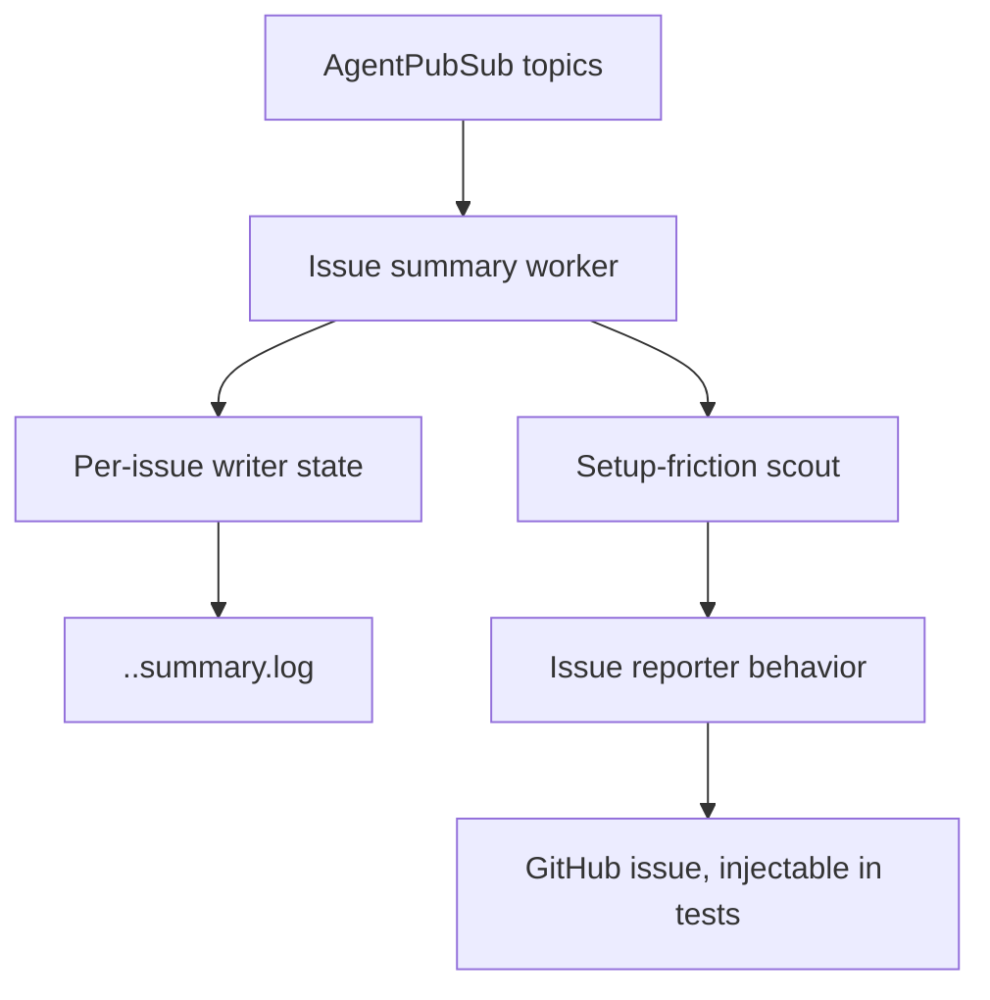

# feat: Add issue summary logs

## Summary

Add a supervised system worker that subscribes to structured agent activity and writes capped, append-only per-issue summary logs beside the existing raw logs. The same worker will scan recent activity for repo-agnostic setup-friction patterns and file triage issues through an injectable reporter.

---

## Problem Frame

Operators currently inspect raw per-issue logs or the main log firehose to understand active agents. Issue #40 asks for concise dated bullets per issue and for an automated scout that notices repeated setup friction without hardcoding this repository's known optimization examples.

---

## Requirements

**Summary logs**

- R1. Each active issue has a `<repo>.<issue>.summary.log` beside `<repo>.<issue>.log`.
- R2. Summary bullets are one dated line each and append only when a meaningful state change occurs.
- R3. Summary files stay glanceable by enforcing a line cap after writes.
- R4. The summary worker runs as system infrastructure and does not consume `agent.max_concurrent_agents` slots.

**Event handling**

- R5. Summary generation uses structured internal events where available instead of tailing raw log text.
- R6. Duplicate or repeated non-changing events do not append duplicate bullets.
- R7. Transcript-derived bullets cover commands, tool use, agent prose, alerts, turn outcomes, running changes, status changes, and errors without dumping full raw content.

**Optimization scout**

- R8. The scout detects generic patterns: repeated env-var command prefixes, tool-not-found fallbacks, setup-then-workaround loops, stale polling, idle loops after state transitions, and copied workaround hints.
- R9. Scout detections file new GitHub issues through an injectable reporter with labels `enhancement`, `agent-setup-optimization`, and `needs-triage`.
- R10. Scout issue bodies include pattern observed, evidence with count and timestamp range, suggested fix, and the repo-specific caveat.

---

## Key Technical Decisions

- **Subscribe to PubSub, not raw files:** `Aiur.AgentPubSub` already carries per-agent transcript and alert events plus global running/status changes. Consuming those contracts avoids reparsing `Aiur.IssueLog` output and keeps the summary worker independent of log formatting.
- **Use a supervised system worker:** Adding a normal child to `Aiur.Application.child_specs/1` runs the summarizer in both interactive and headless modes without creating an agent slot.
- **Keep summary files as simple capped text:** A line cap is enough for glanceability and avoids introducing another retention subsystem. The existing session-level retention still bounds total log history.
- **Make issue filing injectable:** The scout should be testable without GitHub network calls and should not hardwire GitHub client details into pattern analysis.
- **Start with deterministic heuristics, not LLM analysis:** The directive forbids hardcoded Aiur-specific checks, not simple pattern recognizers. Deterministic recognizers give predictable tests and can later feed a richer analyzer.

---

## High-Level Technical Design

The worker subscribes to global running/status topics at startup. It starts a per-issue tracking state when running/status events name an identifier, subscribes to that agent topic, and writes deduplicated bullets for meaningful per-agent messages.

---

## Implementation Units

### U1. Summary Log Path and Writer

- **Goal:** Provide a small API for summary log paths, bullet formatting, dedupe keys, and line-cap enforcement.
- **Requirements:** R1, R2, R3, R6.
- **Dependencies:** None.
- **Files:** `src/lib/aiur/issue_summary_log.ex`, `src/test/aiur/issue_summary_log_test.exs`.
- **Approach:** Mirror `Aiur.IssueLog.log_path/1` for path naming and `Aiur.Config.Paths` sanitization. Keep capped writes synchronous and small because each write is one line plus a bounded rewrite when trimming.
- **Patterns to follow:** `src/lib/aiur/issue_log.ex`, `src/lib/aiur/logs/retention.ex`, `src/test/aiur/issue_log_event_history_test.exs`.
- **Test scenarios:** Write a bullet to the expected path; append several unique bullets in order; skip duplicate dedupe keys; trim to the configured maximum; sanitize identifiers in filenames.
- **Verification:** Targeted tests prove file naming, append behavior, dedupe behavior, and cap behavior.

### U2. Supervised Summary Worker

- **Goal:** Subscribe to structured events and write meaningful per-issue bullets automatically.
- **Requirements:** R4, R5, R6, R7.
- **Dependencies:** U1.
- **Files:** `src/lib/aiur/issue_summary_worker.ex`, `src/lib/aiur.ex`, `src/test/aiur/issue_summary_worker_test.exs`, `src/test/aiur/application_test.exs`.
- **Approach:** Start one GenServer under the app supervisor. Subscribe to `agents:running` and `agents:status`; attach per-issue subscriptions as identifiers appear; normalize transcript, alert, turn, running, and status events into short bullet candidates with stable dedupe keys.
- **Patterns to follow:** `src/lib/aiur/agent_pubsub.ex`, `src/lib/aiur/agent_events.ex`, `src/lib/aiur/agent_list/app.ex`.
- **Test scenarios:** Running change attaches and writes a running bullet; status change writes a status bullet; transcript command writes a command bullet; repeated unchanged running/status events do not duplicate; application child specs include the worker in both interactive and headless shapes without changing UI-only gating.
- **Verification:** PubSub-driven tests show summaries appear from structured messages without invoking any coding agent.

### U3. Setup-Friction Scout

- **Goal:** Detect repo-agnostic setup friction from recent per-issue activity and emit optimization findings.
- **Requirements:** R8, R9, R10.
- **Dependencies:** U1, U2.
- **Files:** `src/lib/aiur/agent_setup_scout.ex`, `src/lib/aiur/agent_setup_scout/reporter.ex`, `src/test/aiur/agent_setup_scout_test.exs`.
- **Approach:** Feed transcript and event summaries into small pattern accumulators keyed by identifier and pattern family. When a threshold is crossed, build a finding with count, timestamp range, evidence snippets, suggested fix, labels, and caveat, then hand it to an injectable reporter.
- **Patterns to follow:** `src/lib/aiur/alerts.ex` for injectable side effects, `src/lib/aiur/events/publisher.ex` for event shape normalization, and `src/lib/aiur/github/client.ex` for eventual tracker integration boundaries.
- **Test scenarios:** Detect repeated env-var prefixes; detect command-not-found followed by fallback command text; detect repeated polling of the same resource; emit only once per pattern key; produce the required labels and body sections.
- **Verification:** Unit tests assert findings and reporter calls without making network requests.

### U4. GitHub Reporter Integration

- **Goal:** File scout findings as GitHub issues when the active tracker supports it.
- **Requirements:** R9, R10.
- **Dependencies:** U3.
- **Files:** `src/lib/aiur/agent_setup_scout/github_reporter.ex`, `src/test/aiur/agent_setup_scout/github_reporter_test.exs`.
- **Approach:** Keep tracker calls behind a reporter module configured through application env for tests. If GitHub credentials or repository context are unavailable, log the skipped finding and keep the summary worker alive.
- **Patterns to follow:** `src/lib/aiur/github/client.ex`, `src/lib/aiur/tracker.ex`.
- **Test scenarios:** Reporter builds a GitHub issue request with required labels; unavailable configuration returns a non-crashing skip; reporter errors do not crash the worker.
- **Verification:** Tests use a fake client module and assert the request shape.

---

## Scope Boundaries

- This plan does not add a new status CLI renderer; it only creates the files a future status command can read.
- This plan does not run an LLM summarizer. It produces deterministic bullets from structured events and deterministic scout findings from patterns.
- This plan does not hardcode the optimization examples from issue #40; those examples only inform generic pattern families.

### Deferred to Follow-Up Work

- Render `*.summary.log` in `aiur status` or the dashboard.
- Add a configurable summary/scout threshold section to workflow config if the defaults need per-repo tuning.

---

## Risks & Dependencies

- **Noise risk:** Transcript events are high-volume. Dedupe keys and role-specific summarization must avoid writing every line.
- **False-positive scout issues:** Pattern thresholds should start conservative and issue filing should be injectable so tests can lock the request shape before real tracker calls are enabled.
- **Supervisor resilience:** Reporter failures must be isolated so the summary worker cannot take down the app.

---

## Operational Notes

- Manual verification must use the real `scripts/aiurdev --test` TUI path before opening a draft PR.
- The worker should tolerate missing PubSub or tracker state in tests and early boot.
