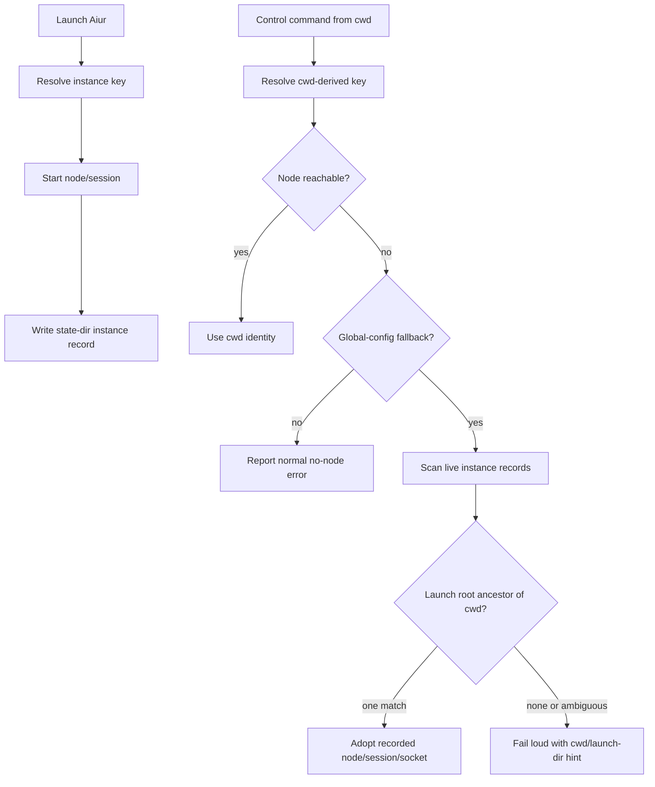

# fix: Resolve global-config control commands from subdirectories

## Summary

Persist the launch identity for each Aiur instance and let control commands use that record when a global-config cwd fallback computes the wrong key from a subdirectory. Keep repo-local identity behavior unchanged and make wrong-directory misses loud instead of silent.

---

## Problem Frame

The #443 global-config identity fix keyed no-repo runs by `realpath($PWD)` so two global-config projects no longer collide. That solved cross-reaping, but it left control commands tied to the exact launch directory because there is no repo-local `.aiur/config` root to find from subdirectories.

For `status`, `pause`, `resume`, and `message`, the miss is noisy but confusing because it names the caller's cwd-derived node. For `stop`, the miss can be silent and exits successfully while the launched BEAM continues running.

---

## Requirements

- R1. A control command run from a subdirectory of a global-config launch directory must target the live launched instance when it can be identified unambiguously.
- R2. `aiur stop` must not silently succeed when it found no node, tmux session, crash marker, or launch record for the caller's cwd-derived identity.
- R3. Wrong-directory misses for global-config fallback identities must print a clear cwd-keyed hint and, when known, the live launch directory.
- R4. Repo-local `.aiur/config` and legacy `.aiurconfig` projects must keep their current walk-up identity behavior.
- R5. Cleanup and reaping must stay scoped to the selected instance identity.

---

## Key Technical Decisions

- **Persist a per-instance launch record in the existing state dir.** The launcher already uses `AIUR_BG_STATE_DIR` for per-node crash and stop markers, so an `instances/` record keeps this lookup local to the owner and avoids scanning arbitrary tmux sockets.
- **Fallback only after the cwd-derived control identity is down.** The normal identity path remains authoritative when it resolves a live node; record lookup is a recovery path for the global-config subdirectory case.
- **Adopt only ancestor launch records.** A live record whose launch directory is an ancestor of the caller's cwd is safe for the subdirectory requirement. Other live records become diagnostics, not automatic targets.
- **Make stop fail loud when no target exists.** `stop` should still clean a selected or crashed instance, but an unmatched global-config fallback should exit non-zero with a hint instead of manufacturing a clean-stop sentinel for the wrong key.

---

## High-Level Technical Design

---

## Implementation Units

### U1. Record launch identities

- **Goal:** Write a small per-instance record after successful startup containing node, key, session, socket, launch root, and root source.
- **Requirements:** R1, R3, R5.
- **Dependencies:** None.
- **Files:** `packaging/npm/aiur-cli/libexec/aiur-engine.sh`; `src/test/aiur_engine_test.exs`.
- **Approach:** Extend identity resolution to expose the resolved project root source, then persist the successful launch identity under `AIUR_BG_STATE_DIR/instances/` using the existing node slug.
- **Patterns to follow:** Existing `aiur_state_slug`, crash marker, and stop sentinel helpers.
- **Test scenarios:** A sourced-engine test writes a record for a fake launch root and verifies the record carries the expected node and root data.
- **Verification:** The launch path records identity only after startup has passed its existing readiness gate.

### U2. Resolve control fallback from records

- **Goal:** When a global-config cwd fallback identity is down, scan live instance records and adopt a single live record whose launch root contains the caller's cwd.
- **Requirements:** R1, R3, R4, R5.
- **Dependencies:** U1.
- **Files:** `packaging/npm/aiur-cli/libexec/aiur-engine.sh`; `src/test/aiur_engine_test.exs`; `src/test/aiur/regression/instance_identity_test.exs`.
- **Approach:** Add a control-only lookup before RPC/stop actions. Reuse the existing epmd liveness probe to validate records and export the selected node identity before invoking the release RPC or tmux cleanup.
- **Patterns to follow:** Existing `probe_node_liveness`, `run_control_rpc`, and `cmd_stop` control flow.
- **Test scenarios:** From a fake subdirectory with no repo-local config, a `status` RPC should use the recorded launch node instead of the caller's cwd-derived node. Repo-local walk-up tests should remain unchanged.
- **Verification:** Focused ExUnit coverage proves fallback is limited to global-config identities and selects only the live ancestor launch record.

### U3. Make unmatched stop/status failures loud

- **Goal:** Print a clear hint for global-config wrong-directory misses and make unmatched `stop` return a failure instead of silently no-oping.
- **Requirements:** R2, R3, R5.
- **Dependencies:** U2.
- **Files:** `packaging/npm/aiur-cli/libexec/aiur-engine.sh`; `src/test/aiur_engine_test.exs`.
- **Approach:** Share the diagnostic formatter between RPC failures and `stop`. Include the caller's cwd-derived root and a launch-root hint when a live record exists but is not a safe ancestor match.
- **Patterns to follow:** Existing stderr guidance in `run_control_rpc` and existing non-zero command handling for invalid control invocations.
- **Test scenarios:** A down global-config `status` with no matching record should print the cwd-keyed hint and exit non-zero. `stop` from an unmatched cwd should not call the BEAM reaper and should return non-zero with the same guidance.
- **Verification:** Tests cover both RPC and stop surfaces so the former confusing error and the latter silent no-op cannot regress.

---

## Scope Boundaries

- Do not change the per-instance hash input for repo-local projects.
- Do not make arbitrary live Aiur instances globally targetable from unrelated directories.
- Do not redesign the RPC transport or tmux naming scheme.
- Do not treat the user's default tmux socket as authoritative.

---

## Risks & Dependencies

- **Stale records:** Record lookup must validate node liveness before adoption, so old state files become harmless diagnostics.
- **Ambiguous live records:** Multiple possible matches should fail with guidance rather than guessing which operator session to control.
- **Stop cleanup scope:** The selected record must update node/session/socket together so `stop` cannot kill the right BEAM but the wrong tmux server.

---

## Sources / Research

- Issue #592 owner triage comment by `its-everdred`.
- `docs/brainstorms/2026-06-22-per-instance-aiur-identity-requirements.md`.
- `docs/plans/2026-06-24-011-fix-global-config-instance-key-plan.md`.
- `docs/brainstorms/2026-06-23-background-control-plane-consistency-requirements.md`.
- `packaging/npm/aiur-cli/libexec/aiur-engine.sh`.
