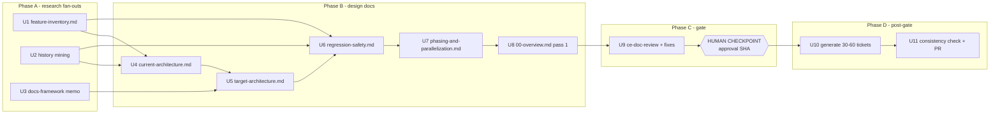

# refactor: Production-Readiness Refactor Planning Spike

## Overview

Produce the complete planning package for aiur's production-readiness refactor:
six planning docs in `docs/refactor/` plus 30–60 issue-ready ticket docs in
`docs/refactor/tickets/`, delivered as one PR on `refactor-planning-prompt`.
The refactor itself (executed later by aiur-loop agents) consolidates ~58.7k
LOC / 162 files into modular, DRY, behavior-preserving code with zero feature
loss. This plan covers the spike only — no refactor implementation.

A hard human gate sits between the planning docs and ticket generation
(origin R13). Everything before the gate optimizes for the human being able to
approve the phase model, architecture, and safety mechanics from the docs alone.

---

## Problem Frame

Aiur accreted features from many agents with divergent context: `orchestrator.ex`
is 7,617 lines, six more files exceed 1,800 lines, duplicate code paths abound,
and the riskiest modules are exempt from coverage. The refactor must preserve
every feature while aiur's own agents execute it ticket-by-ticket — so the
planning package carries all the intelligence: exact scopes, safety mechanics,
and a characterization-test tripwire that makes lesser-agent execution
mechanical and low-risk. (See origin: `docs/brainstorms/2026-07-06-production-readiness-refactor-planning-requirements.md`;
authoritative brief: `docs/refactor/fable-planning-prompt.md`.)

---

## Requirements Trace

- R1. Single PR on `refactor-planning-prompt`; no implementation, no issues opened.
- R2. Six planning docs in `docs/refactor/` (00-overview, feature-inventory,
  current-architecture, target-architecture, regression-safety,
  phasing-and-parallelization).
- R3. 30–60 standalone issue-ready tickets in `docs/refactor/tickets/` matching
  the brief's worked-example shape.
- R4. Zero feature loss; `feature-inventory.md` is the anti-regression contract.
- R5. Repo green after every ticket; behavior-preserving changes only.
- R6. Phase-1 characterization tests + CI tripwire before any risky change.
- R7. ≤3 phases of ~10 parallel agents; same-phase tickets never share files;
  dependencies explicit and resolvable.
- R8. Tickets carry the intelligence; executors make no design decisions.
- R9. Mandated tickets: Phase-1 gate, backend seam, giant-file decomposition,
  docs framework + pages.
- R10. Size/DRY norms as guiding targets; propose adopting
  ethereum-optimism/actions CONTRIBUTING.md norms.
- R11. Research-first order (conventions → inventory → history → norms → design).
- R12. ce-doc-review self-review before the checkpoint; incremental commits/pushes.
- R13. Hard gate: human reviews planning docs before ticket generation.

**Origin actors:** A1 (planning agent), A2 (human operator), A3 (executor
agents), A4 (aiur-loop pipeline)
**Origin flows:** F1 (spike delivery), F2 (ticket execution)

---

## Scope Boundaries

- No refactor implementation — planning artifacts only.
- No new coding-agent backend; no dependency bumps except the docs framework.
- No changes to `its-everdred/claude-app-server`; only aiur-side client code in
  refactor scope.
- No GitHub issues opened by the agent; the human converts ticket docs (with a
  defined conversion protocol — see Key Technical Decisions).
- No agent runtime/model architecture changes unless a ticket scopes it.

### Deferred to Follow-Up Work

- Ticket execution itself: runs later via aiur-loop, guided by the produced docs.
- Opening the `needs-triage` cleanup issues this spike identifies but does not
  scope (e.g., the PR-template contradiction below).

---

## Context & Research

### Ticket contract (from `.claude/skills/using-aiur/` + `.claude/skills/aiur-loop/`)

- Labels: `agent:todo` + `complexity:N` + optional `model:<backend>`. This
  repo's `.aiur/config` routes complexity 1–3 → codex, 4–5 → claude. Backends:
  `codex`, `claude` (headless, not resumable), `claude-repl` (resumable).
- Branch is pre-created `aiur/<N>`; issue body is the contract ("follow the
  issue instructions exactly"); no ISSUE_TEMPLATE exists.
- Pre-PR gate (dev-loop.md, from `src/`): `mix compile --warnings-as-errors`,
  `mix format --check-formatted`, `mix test`, `mix credo --strict`,
  `mix dialyzer`. CI runs the make-target equivalents (`.github/workflows/ci.yml`):
  build, fmt-check + lint (= `specs.check` + credo), coverage (85% threshold),
  regression (tmux shell test), dialyzer.
- Executor agents are guard-blocked from `aiurdev --test*`; manual TUI
  verification is the operator's job at merge.
- Dependency mechanics at runtime: `aiur_declare_blocker(issue#)` + blockee
  merges the blocker's branch (`git merge origin/aiur/<blocker-id>`) — not
  wait-for-main. This shapes the no-same-phase-deps decision below.

### Corrections to the brief (record in `00-overview.md` deviations)

- **Backend seam is half-built.** `src/lib/aiur/coding_agent.ex` already has a
  single registry (`backends/0`) with per-backend `adapter`, `transcript`,
  `resumable`, etc.; `orchestrator.ex` has no backend-literal branching.
  Residual inline branching lives in `src/lib/aiur/agent_runner.ex` (~lines
  638–1052: claude vs claude-repl session reporting, remote-session promotion,
  spawn-failure fallback). The seam ticket = formalize a `@behaviour` +
  migrate those residual branches, not build a registry.
- **Issue #609 is not a generic persistence layer** — it is cross-restart
  session resume for claude backends, built on `Aiur.SessionHandle` +
  `resumable?/1` (#605). "Preps #609" concretely means the behaviour carries
  session-identity/resume semantics cleanly.
- **The brief's worked-example verification block is too small.** The real
  gate is the five-command dev-loop gate / `make ci`, and manual verification
  must be split out (executors cannot run it).

### Test landscape and the coverage ratchet

- 173 test files, ~2,315 tests. `src/test/aiur/regression/` holds 19
  characterization-style tests — the pattern home for Phase-1 tripwire tests.
  Snapshot support exists (`src/test/support/snapshot_support.exs`, ANSI golden
  files, `UPDATE_SNAPSHOTS=1`).
- `src/mix.exs` exempts the giants (Orchestrator, AgentRunner, coding agents,
  GitHub client, PaneManager, Tmux, AgentList, all Opencode, all AiurWeb…)
  from the 85% coverage threshold. **New modules extracted from giants are not
  exempt** — decomposition tickets must ship tests for extracted modules, and
  shrinking `ignore_modules` becomes a measurable success criterion.

### Institutional learnings (docs/plans/, docs/measurements/, project memory)

- Known flake mechanics that must become characterization-test rules: no exact
  counts on shared singletons; `assert_receive` ≥ 2000ms under `--cover`;
  unique `AIUR_RELEASE_NODE` for engine-path tests (a test once SIGKILLed the
  operator's BEAM — PR #498); isolate `:log_file` for anything touching
  `src/lib/aiur/events/` (SubscriptionStore disk-leak flake, partially fixed
  in #687); `Process.sleep`-based sync is banned (SlotPolicyTest flake #506).
- Proven decomposition house style (prewarm/attach simplification,
  `docs/brainstorms/2026-05-23-opencode-prewarm-spaghetti-audit.md` →
  `docs/measurements/2026-06-23-emfile-structural-fix-census.md`): audit
  first, one source of truth per fact (ETS registry), pure policy functions
  instead of synchronous GenServer call chains, no M×N fan-out; pin
  resource-fan-out invariants with census-style assertions.
- Executor realities: lesser agents satisfy the letter of acceptance criteria
  (make them grep-able + named passing tests); codex quota exhaustion silently
  stalls tickets (remedy: `model:claude` reroute); post-#720 main pushes
  notify rather than kill running agents.
- Regression-pinning tests that pruning must whitelist:
  `src/test/aiur/test_reset_test.exs` (label race),
  `src/test/aiur/agent_runner_test.exs` marker fan-out, the
  subscription-store isolation pattern, and the curated `render_state`
  `Map.take` pipeline in `src/lib/aiur/agent_list/app.ex`.
- Regression-hotspot lead: `docs/plans/2026-06-24-*.md` (~20 fix plans from one
  48-hour dogfood run: drain races, stale tmux sessions, workspace git
  metadata, config instance keys, shutdown reap).

### External norms (fetched from ethereum-optimism/actions CONTRIBUTING.md)

≤20-line functions / ≤200-line files / max-2 nesting as targets; extraction
trigger = second concrete usage; shareable code never lives in a concrete
backend (behaviour/base owns cross-cutting work, concrete stays thin, one
dependency direction); mock at boundaries, never pure utilities; every bug fix
adds a regression test; flaky tests get fixed or deleted; zero-new-warnings
ratchet. The norms-adoption proposal ticket adapts these to Elixir + the
existing gate (`make ci`, `mix specs.check`).

---

## Key Technical Decisions

1. **Ticket verification = CI parity.** Every ticket's agent-runnable
   verification is `make ci` from `src/` (or the five dev-loop mix commands)
   plus named targeted tests; `make regression` SKIPs without tmux — noted per
   ticket. No smaller substitute.
2. **Verification splits into "Agent gate" and "Operator at merge".**
   Executors cannot run `aiurdev --test*`; each ticket lists exact headless
   commands for the agent and concrete manual TUI checks for the operator,
   explicitly scoping the dev-loop manual-verification mandate.
3. **Dependencies only cross phase boundaries.** No same-phase `Depends-on`
   (branch-merge chaining makes same-phase deps race-prone). A dependent
   ticket's issue is not opened until its blocker is merged to main.
4. **Characterization tests are read-only for executors.** They live under a
   dedicated path in `src/test/aiur/regression/`, get a CODEOWNERS guard, and
   every risky ticket states: a failing characterization test means your
   change is wrong — stop and report a blocker, never edit the test.
5. **Phase-exit checklist gates each phase.** All phase tickets merged, main
   CI green, characterization suite green, operator manual TUI pass; no
   next-phase issues opened while any current-phase ticket is unresolved.
6. **Ticket conversion protocol.** `Depends-on: T-NNN` is dead metadata at
   runtime; `00-overview.md` embeds a human checklist: open issues in
   dependency order, maintain the T-id→#N map, rewrite Depends-on to issue
   numbers before applying `agent:todo`. After conversion the GitHub issue is
   the source of truth; ticket docs are frozen snapshots.
7. **Structured ticket fields for mechanical validation.** Every ticket
   carries `Files:` (exact paths) and `Inventory-IDs:` (FI-### from
   feature-inventory.md); a check script validates per-phase file
   disjointness, dependency resolution, and index↔files consistency.
8. **Inventory entries get stable FI-### IDs** with per-entry coverage
   pointers (characterization test or a concrete operator manual-check
   recipe) — this is the per-PR "no feature removed" review mechanic.
9. **Backend seam ticket scope corrected** (see brief corrections): formalize
   an `Aiur.CodingAgent.Backend` behaviour over the existing registry and
   migrate the residual `agent_runner.ex` branches; carry `resumable?/`resume
   semantics for #609.
10. **Decomposition tickets must test what they extract** (coverage ratchet);
    each names the extracted modules exactly as pinned in
    `target-architecture.md`'s module/path name map — renames require the
    operator to amend downstream ticket docs before opening them.
11. **Complexity stays 1–3; concurrency-touching tickets pre-apply
    `model:claude`** (matches `complexity-routing.md` guidance and the codex
    quota-stall reality).
12. **Two-pass docs with an approval SHA.** `00-overview.md`,
    `phasing-and-parallelization.md` tables, and regression-safety's
    inventory→coverage mapping finalize after ticket generation; the human
    checkpoint approves the phase model, budgets, and rules; the approved
    commit SHA is recorded so the final PR review diffs only the delta.
13. **Self-review may change *how*, never *whether*.** ce-doc-review findings
    that contradict brief mandates are queued as explicit checkpoint
    questions, not silently applied.
14. **Website tickets ship via the PR flow** (`aiur/<N>` branches) despite the
    website's push-to-main convention; the docs-framework ticket must keep
    the terminal-sim demo and its golden-snapshot guard (`npm run assert`)
    green, and the framework choice is made by U3's evaluation, committed in
    the planning docs.
15. **Halt rule for mid-phase breakage.** Red main or a characterization
    failure: operator pauses aiur, stops opening/claiming issues, files a
    top-priority fix ticket, amends affected downstream ticket docs, then
    resumes. Dialyzer errors outside a ticket's scope: rebase main and rerun;
    still failing → out-of-scope `needs-triage` finding, not scope creep.

---

## Open Questions

### Resolved During Planning

- Where deliverables land: `refactor-planning-prompt` branch, one PR (user).
- Checkpoint placement: after planning docs, before tickets (user).
- Docs framework: chosen by U3 evaluation during execution (user delegated).
- Seam ticket scope, verification gate, coverage ratchet, website PR flow,
  phase-dependency rule — per Key Technical Decisions above.

### To Present at the Human Checkpoint (with defaults)

- Same-phase dependencies allowed at all? Default: no.
- Who rewrites T-id→#N at conversion? Default: the human, via the checklist.
- Characterization tests CODEOWNERS-guarded and read-only? Default: yes, both.
- Phase-exit checklist as in decision 5? Default: yes, no partial overlap.
- Ticket verification standardizes on `make ci`? Default: yes.

### Deferred to Implementation (spike execution)

- Final ticket count and per-phase allocation: falls out of U7 once
  decomposition waves are designed.
- Extent of characterization coverage per subsystem: designed in U6 against
  the flake rules; tmux/TUI surfaces may get operator-recipe coverage instead
  of headless tests where pinning is infeasible.
- Docs framework choice: U3 evaluation (Starlight, VitePress, Fumadocs,
  Docusaurus) against the existing Vite/TS site + terminal-sim constraints.

---

## High-Level Technical Design

> *This illustrates the intended approach and is directional guidance for
> review, not implementation specification.*

The refactor's phase model itself (designed in U7) is expected to shape as:
refactor Phase 1 = safety net + independent low-risk consolidation; Phase 2 =
decomposition waves (orchestrator chain serialized via cross-phase deps);
Phase 3 = consolidation, norms adoption, docs framework + pages. U7 decides
the real allocation under the no-shared-file constraint.

---

## Implementation Units

### Phase A — Research fan-outs (parallel)

- [ ] U1. **Build `feature-inventory.md` via multi-modal workflow sweep**

**Goal:** The exhaustive, ID'd feature/behavior map — the anti-regression
contract (R4).

**Requirements:** R4, R11; F2 (reviewer mechanic)

**Dependencies:** None

**Files:**
- Create: `docs/refactor/feature-inventory.md`

**Approach:**
- Workflow fan-out with agents sliced by subsystem (cli, config, events,
  github, prewarm, alerts, opencode, codex, claude, orchestrator+agent_runner,
  pane/tmux/agent_list, aiur_web, workspace/init, scripts+engine, `.aiur/`
  artifacts, both skill families, website) each extracting entries against a
  fixed schema: FI-### ID, name, behavior, entry points, config knobs,
  evidence paths, existing test coverage, risk class.
- Cross-cutting sweeps by artifact type (every CLI command/flag, every
  `config/schema.ex` option, every event/alert name, every skill) so features
  are found by two independent angles.
- Completeness critic pass + merge/dedup before writing the doc.
- Entries with no automated coverage get a concrete operator manual-check
  recipe (decision 8).

**Test scenarios:**
- Test expectation: none — documentation artifact; correctness enforced by the
  two-angle sweep + critic pass and by U9 review.

**Verification:**
- Every subsystem directory under `src/lib/aiur/` and both skill families
  appear; spot-check that known features (e.g., `emit_alert` lifecycle,
  `agent:*` labels, prewarm, `--record`, workspace skills install #722) have
  entries with evidence paths.

- [ ] U2. **Mine issue/PR history into themes and hotspots**

**Goal:** Regression hotspots, recurring bug classes, and duplication signals
that target the refactor's care (R11 step 3).

**Requirements:** R11; feeds R6 prioritization

**Dependencies:** None

**Files:**
- Create: none directly (feeds U4 pain analysis + U6 priority map; raw notes
  to session scratchpad)

**Approach:**
- Workflow fan-out over all 248 merged PRs + all issues (~730 numbers) in
  batches, plus the `docs/plans/2026-06-24-*.md` fix-plan wave; classify by
  subsystem/path, extract regression recurrences and fix-of-a-fix chains.
- Output: ranked hotspot map (path → incident count → themes) and a
  recurring-theme summary.

**Test scenarios:**
- Test expectation: none — research artifact.

**Verification:**
- Hotspot map covers the known hot areas (tmux/pane races, drain/shutdown,
  label races, subscription flakes) and ranks them with evidence links.

- [ ] U3. **Docs-framework evaluation memo**

**Goal:** Commit to one docs framework for `website/` (user delegated to
research).

**Requirements:** R9 (docs ticket); origin deferred question

**Dependencies:** None

**Files:**
- Create: none directly (decision + rationale land in
  `docs/refactor/target-architecture.md` and the docs tickets)

**Approach:**
- Evaluate Astro Starlight, VitePress, Fumadocs, Docusaurus against: coexists
  with the existing Vite 6 + TS marketing site and terminal-sim demo (golden
  snapshot `npm run assert` stays green), Netlify + bun build, agent-friendly
  authoring (plain markdown, low config), maintenance weight.
- Web research for current (2026) state of each; pick one, record runner-up.

**Test scenarios:**
- Test expectation: none — decision memo.

**Verification:**
- Decision names the framework, integration shape (subpath vs subdomain vs
  merged build), and why the golden-snapshot guard survives.

### Phase B — Design docs (after A)

- [ ] U4. **Write `current-architecture.md`**

**Goal:** How it's built today + pain/theme analysis (the "why" for every
later ticket).

**Requirements:** R2; R11

**Dependencies:** U1, U2

**Files:**
- Create: `docs/refactor/current-architecture.md`

**Approach:**
- Supervision tree (from `src/lib/aiur.ex`), subsystem map, backend dispatch
  reality (registry + residual `agent_runner.ex` branches), oversized-file
  list (re-measured), duplication map, U2's hotspot/theme analysis, coverage
  exemption reality from `src/mix.exs`.

**Test scenarios:**
- Test expectation: none — documentation artifact.

**Verification:**
- Every claim carries a repo path; brief corrections included; hotspots ranked.

- [ ] U5. **Write `target-architecture.md`**

**Goal:** The modular end state + the module/path name map that downstream
tickets treat as a contract (decision 10, gap I5).

**Requirements:** R2, R9, R10

**Dependencies:** U4, U3

**Files:**
- Create: `docs/refactor/target-architecture.md`

**Approach:**
- Module boundaries per subsystem; the formal `Aiur.CodingAgent.Backend`
  behaviour design over the existing registry (callbacks confirmed against
  the residual branches; resume semantics for #609); decomposition shapes for
  each giant using the prewarm house style; size/DRY norms mapping
  (optimism-actions → Elixir); docs-framework integration shape (from U3);
  the full new-module name map (path-level, pinned).

**Test scenarios:**
- Test expectation: none — documentation artifact.

**Verification:**
- Name map covers every module later tickets create; behaviour callback set
  justified against `agent_runner.ex` lines 638–1052; no new backend designed.

- [ ] U6. **Write `regression-safety.md`**

**Goal:** The testing strategy that makes "green after every ticket"
trustworthy for lesser agents.

**Requirements:** R2, R5, R6

**Dependencies:** U1, U2, U5

**Files:**
- Create: `docs/refactor/regression-safety.md`

**Approach:**
- Phase-1 characterization tripwire: what gets pinned, in
  `src/test/aiur/regression/`, following existing patterns + snapshot support;
  hard flake rules (no exact singleton counts, `assert_receive` ≥ 2000ms,
  unique `AIUR_RELEASE_NODE`, `:log_file` isolation, no `Process.sleep` sync).
- Read-only tripwire mechanics: CODEOWNERS guard + per-ticket language
  (decision 4); halt rule (decision 15); operator merge protocol (one merge at
  a time, update-branch + fresh CI — gap I3).
- Pruning rules: prune only when pinned code is gone or replaced by
  higher-level coverage; whitelist the named regression-pinning tests.
- Coverage ratchet: extracted modules must be tested; `ignore_modules` only
  shrinks; net-negative test LOC with higher-value coverage as the goal.
- Phase-1 prerequisites from learnings: global `:log_file` isolation ticket,
  SlotPolicyTest #506 fix ticket.
- Inventory→coverage mapping declared two-pass (skeleton now, per-ticket
  mapping after U10).

**Test scenarios:**
- Test expectation: none — documentation artifact (its rules become ticket
  acceptance criteria).

**Verification:**
- Every flake rule and safety mechanic from research appears; the two
  learning-driven Phase-1 tickets are mandated; pruning whitelist present.

- [ ] U7. **Write `phasing-and-parallelization.md`**

**Goal:** The ≤3-phase model with the dependency and disjointness rules that
make ~10-agent parallel execution safe.

**Requirements:** R2, R7

**Dependencies:** U5, U6

**Files:**
- Create: `docs/refactor/phasing-and-parallelization.md`

**Approach:**
- Phase model + budgets; dependencies only cross phase boundaries (decision
  3); phase-exit checklist (decision 5); orchestrator decomposition sequenced
  as a cross-phase chain (single-file constraint); quota-stall watch signal
  and `model:claude` reroute; concrete per-ticket tables declared two-pass.

**Test scenarios:**
- Test expectation: none — documentation artifact.

**Verification:**
- Rules are stated as operator-executable checklists; the no-shared-file
  constraint has a mechanical check (U11 script) referenced.

- [ ] U8. **Write `00-overview.md` (pass 1)**

**Goal:** Problem, goals, success criteria, phase model summary, deviations
from the brief, ticket-conversion protocol, checkpoint questions — index
placeholder for pass 2.

**Requirements:** R2; decisions 6, 12, 13

**Dependencies:** U4–U7

**Files:**
- Create: `docs/refactor/00-overview.md`

**Approach:**
- Include: brief deviations (seam half-built, #609 nuance, verification-gate
  correction, learning-driven Phase-1 additions); the T-id→#N conversion
  checklist; the five checkpoint questions with defaults; two-pass
  declaration + where the approval SHA will be recorded.

**Test scenarios:**
- Test expectation: none — documentation artifact.

**Verification:**
- A reader can run the checkpoint from this doc alone (questions, what to
  approve, what happens next).

### Phase C — Review and gate

- [ ] U9. **ce-doc-review sweep, fixes, and the human checkpoint**

**Goal:** Self-reviewed docs, pushed, and the hard gate presented (R12, R13).

**Requirements:** R12, R13; decision 13

**Dependencies:** U8

**Files:**
- Modify: the six docs per findings

**Approach:**
- ce-doc-review across the six docs; apply fixes that change *how*; queue any
  mandate-level conflicts as checkpoint questions; commit/push; present the
  checkpoint with the five questions + defaults; on change requests: apply →
  cross-doc consistency pass → targeted re-review of changed docs → re-confirm
  (gap I7). Record the approved SHA in `00-overview.md`.

**Test scenarios:**
- Test expectation: none — review/process unit.

**Verification:**
- Docs pushed; checkpoint presented; approval SHA recorded before any ticket
  file exists.

### Phase D — Post-gate

- [ ] U10. **Generate the ticket backlog (30–60 tickets)**

**Goal:** Issue-ready ticket docs carrying all the intelligence (R3, R8, R9).

**Requirements:** R3, R8, R9; decisions 1, 2, 4, 7, 10, 11

**Dependencies:** U9 (approved)

**Files:**
- Create: `docs/refactor/tickets/T-*.md` (30–60 files)
- Modify: `docs/refactor/00-overview.md` (index, per batch),
  `docs/refactor/phasing-and-parallelization.md` + `regression-safety.md`
  (pass-2 tables)

**Approach:**
- Ticket shape = brief's worked example + structured `Files:` and
  `Inventory-IDs:` fields + split Agent gate / Operator-at-merge verification.
- Mandated tickets first (Phase-1 gate incl. the two learning-driven tickets,
  backend behaviour, giant decompositions, docs framework + pages), then the
  consolidation backlog from U4's duplication map.
- Generate in dependency-graph order, commit+push per batch, update the index
  per batch (resume marker, gap I9).

**Test scenarios:**
- Test expectation: none — documentation artifacts (each ticket embeds its own
  named test requirements for executors).

**Verification:**
- Every ticket passes the U11 script; mandated tickets present; complexity
  labels 1–3 with `model:claude` where decision 11 applies.

- [ ] U11. **Consistency validation + final PR**

**Goal:** Mechanically verified internal consistency; the single deliverable
PR (R1).

**Requirements:** R1, R7; decision 7

**Dependencies:** U10

**Files:**
- Create: `docs/refactor/tickets/check-consistency.sh` (or `.exs` — small,
  documented, operator-reusable)
- Modify: `docs/refactor/00-overview.md` (final index + approval SHA note)

**Approach:**
- Script checks: every `Depends-on` resolves to an existing ticket; no two
  same-phase tickets share a `Files:` entry; deps only cross phases;
  index↔files bijection; every ticket has required sections + labels.
- PR body: plan summary, phase model, ticket count, pointer to review only
  the delta since the approval SHA (gap M4).

**Test scenarios:**
- Happy path: well-formed backlog → script exits 0 with a summary table.
- Error path: introduce a same-phase file collision → script exits non-zero
  naming both tickets. Duplicate/unknown `Depends-on` → non-zero with the
  offending T-id. Missing required section → non-zero naming ticket + section.

**Verification:**
- Script green on the final backlog; PR open with the described body; no
  GitHub issues created.

---

## System-Wide Impact

- **This spike adds only documentation** (plus one check script) — no runtime
  surface changes. The real blast radius is deferred to ticket execution and
  is governed by the safety mechanics the docs encode (halt rule, merge
  protocol, phase-exit checklist, read-only tripwire).
- **Unchanged invariants:** no source, config, CI, or website behavior changes
  in this PR; `docs/refactor/fable-planning-prompt.md` stays intact as the
  historical brief.

---

## Risks & Dependencies

| Risk | Mitigation |
|------|------------|
| Inventory misses a feature → silent loss later | Two-angle sweep (subsystem + artifact type) + completeness critic + FI-ID coverage mapping + operator recipes for untestable entries |
| Characterization infeasible on tmux/TUI surfaces | Existing `test/aiur/regression/` + snapshot patterns; where headless pinning fails, explicit operator manual-check recipes instead of fake coverage |
| History mining at 248 PRs / ~730 issues is noisy | Batched fan-out with fixed classification schema; the 2026-06-24 fix-plan wave as ground-truth calibration |
| Checkpoint rework desyncs the six docs | Change-request loop with cross-doc consistency pass + targeted re-review (gap I7) |
| Ticket generation interrupted mid-stream | Dep-order batches, commit+push per batch, index-as-resume-marker |
| Executors game acceptance criteria | Grep-able criteria + named tests + read-only tripwire + CODEOWNERS guard |
| Codex quota stalls mid-phase | Complexity 1–3 + pre-applied `model:claude` on concurrency tickets + stall watch signal in phasing doc |

---

## Sources & References

- **Origin document:** `docs/brainstorms/2026-07-06-production-readiness-refactor-planning-requirements.md`
- Authoritative brief: `docs/refactor/fable-planning-prompt.md`
- Ticket conventions: `.claude/skills/using-aiur/` (dev-loop, turn-workflow,
  complexity-routing, conventions), `.claude/skills/aiur-loop/SKILL.md`
- Backend registry: `src/lib/aiur/coding_agent.ex`; residual branches:
  `src/lib/aiur/agent_runner.ex`
- CI truth: `.github/workflows/ci.yml`, `src/Makefile`, `src/mix.exs`
  (coverage exemptions)
- Decomposition precedent: `docs/brainstorms/2026-05-23-opencode-prewarm-spaghetti-audit.md`,
  `docs/measurements/2026-06-23-emfile-structural-fix-census.md`
- Related issues/PRs: #609 (resume), #605/#378 (SessionHandle), #506
  (SlotPolicy flake), #687 (subscription isolation), #498 (node-identity
  kill), #720 (main-push notify), #722 (workspace skills)
- External: ethereum-optimism/actions `CONTRIBUTING.md` (fetched 2026-07-06)
