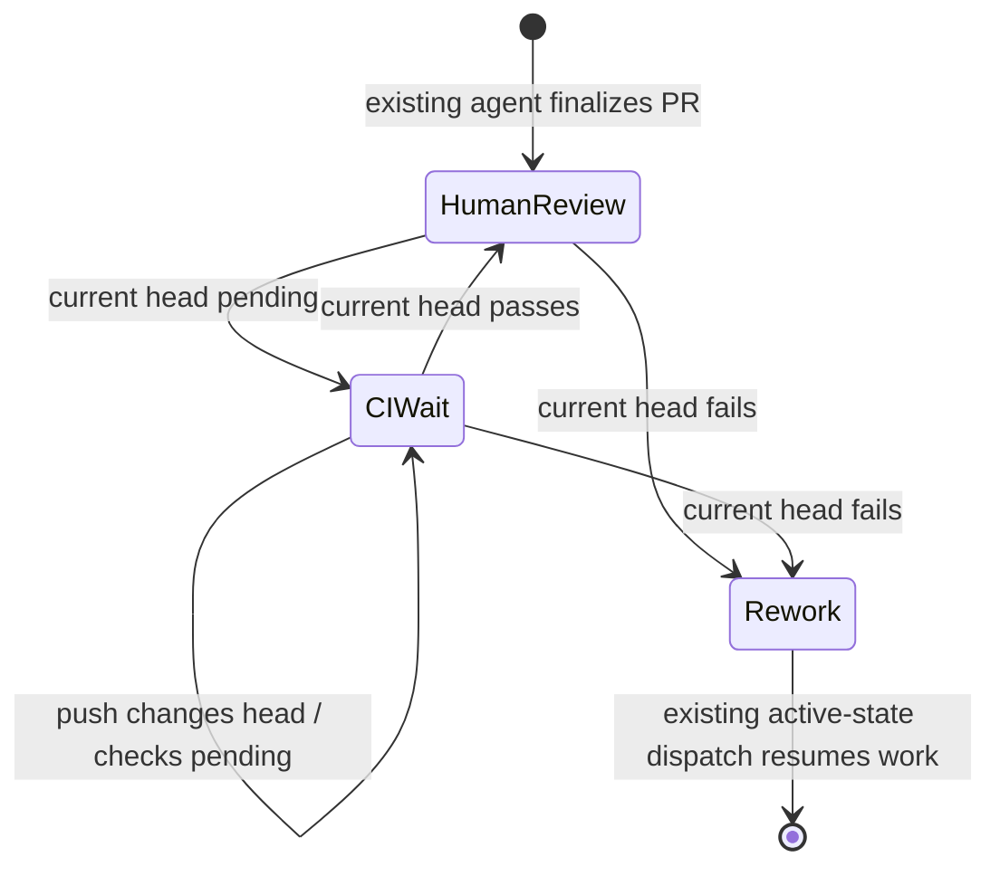
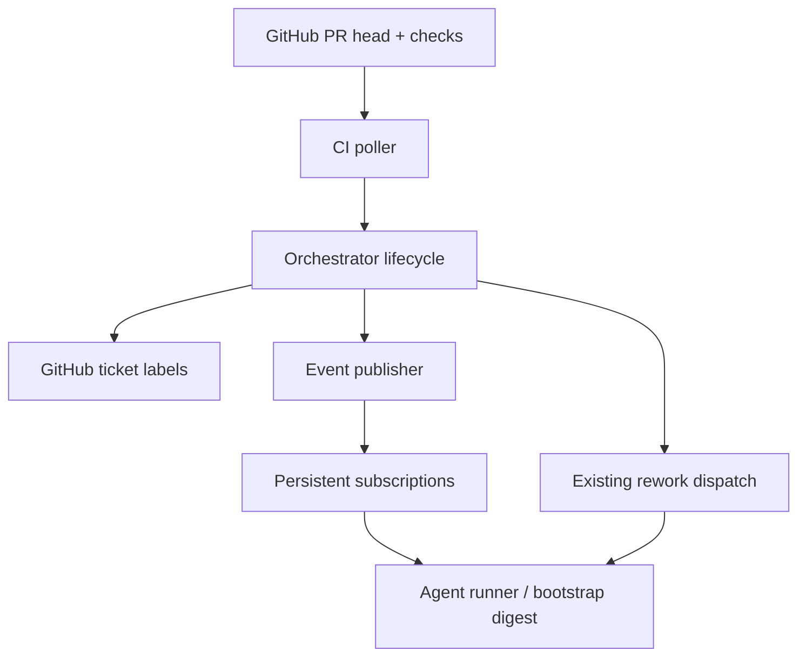

# feat: Close the PR CI feedback loop

## Summary

This plan makes CI a lifecycle gate rather than a post-completion surprise. A ticket with a finalized PR moves into a durable `ci-wait` state while Aiur polls the current PR head; passing CI promotes it to human review, while a failure returns it to rework and delivers the actionable failure context to the next agent turn.

| CI observation | Ticket state | Agent behavior |
| --- | --- | --- |
| Checks still running | `ci-wait` | Paused; no human-review transition yet |
| Current head passes | `human-review` | Stops normally and awaits a human |
| Current head fails | `rework` | Resumes or dispatches with the CI failure event |

---

## Problem Frame

An agent can currently mark its ticket `agent:human-review` as soon as its scoped local checks pass. Full CI subsequently finds an issue, but that label deactivates the worker, leaving a red PR with no automated recovery path. The failure needs to be a durable event and lifecycle transition, not an instruction for an operator or a future prompt revision.

---

## Assumptions

*This plan was authored without synchronous user confirmation. The items below are agent inferences that should be reviewed during implementation and PR review.*

- GitHub's label transition remains the authoritative existing signal that a PR is finalized; Aiur will immediately move a newly observed `human-review` ticket to `ci-wait` while checks are incomplete, without changing the agent prompt or skills.
- `ci-wait` is a non-dispatchable lifecycle label that persists across orchestrator restarts. A failed ticket is re-dispatched through the existing `rework` active-state workflow if no paused runner remains.
- A CI decision is based only on the PR's current head SHA. A missing `guard` check is not treated as pending or failed; other observed check runs and legacy commit statuses determine the outcome.

---

## Requirements

- R1. A finalized Aiur PR must not remain in `human-review` while its current head has pending CI; it must be represented as `ci-wait` instead.
- R2. Poll GitHub check runs and combined commit statuses for each CI-gated PR head until the observed checks are terminal.
- R3. Promote `ci-wait` to `human-review` only when the current head passes; a new push must naturally reset evaluation to the new SHA.
- R4. On failure, change the ticket to `rework` and publish `ticket.<id>.ci.failed` with failed check names and a bounded, sanitized failure excerpt.
- R5. The agent subscribes to `ci.passed` and `ci.failed`; a failure wakes a paused runner when present, otherwise the persisted event reaches the re-dispatched rework turn.
- R6. The flow is idempotent, survives orchestrator restart, tolerates check API errors without a false pass/fail, ignores the absent `guard` check, and leaves a flaky `test` failure for the agent to judge from its delivered context.

---

## Scope Boundaries

- GitHub webhooks and branch-protection required-check discovery are deferred; this change is polling-first.
- No prompt, skill, or operator-runbook change is used as the control mechanism.
- No automatic override of a failed `test` check is introduced. The agent receives the check details and determines whether it is a known flake or needs a fix.
- Existing human review thread validation and PR-review-comment reactivation behavior remain unchanged.

---

## Context & Research

### Relevant Code and Patterns

- `src/lib/aiur/orchestrator.ex` already owns polling-cycle ordering, label transitions, pause/resume, and rework activation.
- `src/lib/aiur/events/github_comments_poller.ex` provides the bounded-concurrency, per-target polling pattern.
- `src/lib/aiur/events/publisher.ex` persists and fans out events but needs an explicit contamination bypass for inactive CI-wait tickets.
- `src/lib/aiur/events/universal_subscriptions.ex` is the idempotent auto-subscription seam for a runner's own ticket topics.
- `src/lib/aiur/github/client.ex` already obtains an Aiur PR by canonical branch and centralizes authenticated REST requests.
- `src/lib/aiur/github/labels.ex` and `src/lib/aiur/test_reset.ex` enumerate lifecycle labels that must stay synchronized.

### Institutional Learnings

- `docs/plans/2026-05-28-001-feat-deactivated-state-plan.md` establishes that label state is the orchestrator-side lifecycle trigger and that inactive tickets require explicit polling/event handling rather than candidate dispatch alone.
- Existing comment polling treats external API failure as retryable and preserves cursors instead of inventing a terminal state; CI polling should keep the same fail-safe posture.

### External References

- GitHub's [check-run REST documentation](https://docs.github.com/en/rest/checks/runs) defines per-run status, terminal conclusions, and output summaries.
- GitHub's [combined commit-status API](https://docs.github.com/en/rest/commits/statuses) reports `success`, `failure`, or `pending` for legacy status contexts on one SHA.

---

## Key Technical Decisions

- **Use `agent:ci-wait` as a lifecycle state, not the existing `agent:paused` overlay.** The state is queryable after an agent exits or Aiur restarts, so the CI watcher is not coupled to a live runner process.
- **Watch both `human-review` and `ci-wait`.** A pending current head converts `human-review` to `ci-wait`; passing converts only `ci-wait` back to `human-review`; failures from either state move to `rework`. This closes the race with the existing agent-owned label transition without requiring a prompt change.
- **Evaluate check runs and legacy statuses together.** Any failed observed result fails; any incomplete observed result waits; all observed results passing succeeds. The evaluator does not require a named `guard` result, so its known absence cannot stall a PR.
- **Fetch the PR every poll and evaluate its returned head SHA.** This makes a re-push reset implicit and prevents stale results from a previous commit driving a transition.
- **Transition before publishing a failure.** Updating to `rework` first makes an existing paused runner resumable and lets a missing runner be picked up by normal active-state dispatch. The event is then published with a bypass so its persisted record survives inactive-ticket filtering.
- **Treat check text as GitHub-sourced external content.** Sanitize, truncate, and mark CI payloads before they enter logs, dashboard rows, or an agent digest.

---

## High-Level Technical Design

> *This illustrates the intended approach and is directional guidance for review, not implementation specification. The implementing agent should treat it as context, not code to reproduce.*

---

## Implementation Units

### U1. Define the CI-wait lifecycle surface

**Goal:** Add `ci-wait` everywhere Aiur enumerates lifecycle labels and display/alert semantics, without making it an active dispatch state.

**Requirements:** R1, R3, R6

**Dependencies:** None

**Files:**
- Modify: `src/lib/aiur/github/labels.ex`
- Modify: `src/lib/aiur/test_reset.ex`
- Modify: `src/lib/aiur/orchestrator.ex`
- Modify: `src/lib/aiur/agent_control_cli.ex`
- Test: `src/test/aiur/github/labels_test.exs`
- Test: `src/test/aiur/test_reset_test.exs`
- Test: `src/test/aiur/orchestrator_deactivate_test.exs`

**Approach:**
- Register `agent:ci-wait` as a state label and include it in sandbox-reset stripping.
- Give the state a non-actionable CI-wait alert/reason and a user-facing status instead of treating it as review-ready.
- Recognize `ci-wait` before the generic non-active-state teardown path, retaining or refreshing a paused entry when one exists while allowing the state to be durable with no runner.

**Patterns to follow:**
- The existing `human-review` special case in `Aiur.Orchestrator`.
- `Aiur.GitHub.Labels` state/marker separation and `Aiur.TestReset.reset_labels_command_args/1` coverage.

**Test scenarios:**
- Happy path: label creation and reset include `agent:ci-wait`.
- Integration: a polled `ci-wait` ticket does not dispatch as active work or get incorrectly treated as terminal.
- Edge case: an already-paused or absent runner remains safe when its ticket is observed in `ci-wait`.

**Verification:**
- CI-wait is a recognized state label, survives label parsing, and never starts an unrelated new worker.

---

### U2. Add GitHub current-head CI evaluation

**Goal:** Provide a testable GitHub client/poller boundary that classifies the current canonical PR head as pending, passed, or failed.

**Requirements:** R2, R3, R6

**Dependencies:** U1

**Files:**
- Modify: `src/lib/aiur/github/client.ex`
- Create: `src/lib/aiur/events/github_ci_poller.ex`
- Test: `src/test/aiur/github_client_test.exs`
- Create: `src/test/aiur/events/github_ci_poller_test.exs`

**Approach:**
- Extend the GitHub client with authenticated REST reads for check runs and combined commit status of a supplied SHA.
- Follow the comment poller's bounded, isolated target execution pattern: find the open canonical PR, read its current head SHA, then return a normalized decision and compact check metadata per ticket.
- Classify terminal conclusions and status contexts conservatively; API failures remain errors, no observed check remains pending, and an absent `guard` does not add a blocking requirement.

**Patterns to follow:**
- `Aiur.Events.GithubCommentsPoller` target normalization, task isolation, and error aggregation.
- `Aiur.GitHub.Client.fetch_open_pull_request_for_branch/2` request/error conventions.

**Test scenarios:**
- Happy path: completed successful check runs and successful status contexts produce a pass for the PR head SHA.
- Error path: a failed check includes its name and sanitized failure source in a failed result.
- Edge case: queued/in-progress check, pending status, or no observed check remains pending; missing `guard` alongside other completed checks does not block success.
- Integration: a new PR head SHA is fetched and evaluated instead of a cached prior-head result.
- Error path: one target API failure is reported without inventing a state change for the other targets.

**Verification:**
- The poller returns deterministic current-head decisions and never turns a network/API error into a pass or failure.

---

### U3. Drive lifecycle transitions from the CI poller

**Goal:** Run the watcher every GitHub polling cycle and make idempotent label transitions from its observations.

**Requirements:** R1, R2, R3, R4, R6

**Dependencies:** U1, U2

**Files:**
- Modify: `src/lib/aiur/orchestrator.ex`
- Modify: `src/lib/aiur/events/sanitizer.ex`
- Test: `src/test/aiur/orchestrator_deactivate_test.exs`
- Test: `src/test/aiur/events/sanitizer_test.exs`

**Approach:**
- During GitHub polling, fetch `human-review` and `ci-wait` tickets independently of active candidates, then pass their identifiers through the CI poller.
- On pending, convert only `human-review` to `ci-wait`; on pass, convert only `ci-wait` to `human-review`; on failure, move either state to `rework`.
- Make repeated observations no-ops and leave failed transition writes retryable on the next poll.
- Add CI failure payload paths to the existing external-content scrubber so check names, summaries, and excerpts are bounded/redacted before any event publish.

**Patterns to follow:**
- `poll_github_comments/2` connectivity accounting and tracker target discovery.
- `reject_human_review_transition/3` for guarded state writes and safe failure logging.

**Test scenarios:**
- Integration: pending human-review PR becomes ci-wait; a later pass becomes human-review.
- Integration: failure from either watched state becomes rework exactly once.
- Edge case: a repeat poll after a successful state write does not issue another write.
- Error path: tracker or CI lookup failure preserves the current label and records a retryable failure.
- Safety: CI-derived external text is sanitized before it can reach a digest.

**Verification:**
- All lifecycle changes are determined from the same poll's current head and are safe to replay after restart.

---

### U4. Publish and consume CI terminal events

**Goal:** Deliver CI outcomes through the existing event bus and turn a failure into immediate agent rework work.

**Requirements:** R4, R5, R6

**Dependencies:** U2, U3

**Files:**
- Modify: `src/lib/aiur/events/universal_subscriptions.ex`
- Modify: `src/lib/aiur/orchestrator.ex`
- Modify: `src/lib/aiur/agent_runner.ex`
- Modify: `src/lib/aiur/agent_list/renderer.ex`
- Test: `src/test/aiur/events/universal_subscriptions_test.exs`
- Test: `src/test/aiur/orchestrator_deactivate_test.exs`
- Test: `src/test/aiur/agent_list/renderer_test.exs`

**Approach:**
- Add the ticket-local `ci.passed` and `ci.failed` subscriptions during normal runner setup, preserving idempotency across restarts.
- Publish terminal outcomes with the current SHA, check names, and bounded failure excerpt. Use the publisher's inactive-ticket bypass so an event remains durable after an agent has exited.
- Add an orchestrator event branch for CI failure: resume an existing CI-paused runner after the ticket becomes rework, or let ordinary rework dispatch start a new runner. Its bootstrap digest receives the persisted failure when no runner was live.
- Render CI events as a concise, recognizable event row without changing the existing review-comment semantics.

**Patterns to follow:**
- `UniversalSubscriptions.topics/1` and `SubscriptionStore` durable cursor behavior.
- Blocker `branch.push` auto-resume and pending-resume handling in `Aiur.Orchestrator`.
- `Publisher.publish/3` event-log persistence and explicit bypass for inactive external wake signals.

**Test scenarios:**
- Happy path: a runner subscribes to both CI topics and receives a persisted failure during its next bootstrap.
- Integration: failure state change precedes wake/resume, so the resumed runner is dispatchable as rework.
- Edge case: no live runner still records the event and a later rework dispatch gets the event once.
- Edge case: duplicate terminal CI observations do not produce duplicate agent work.

**Verification:**
- A failed CI result produces one actionable event and a runnable rework ticket without operator intervention.

---

### U5. Cover end-to-end poll-cycle behavior and operator visibility

**Goal:** Lock the new lifecycle against regressions and preserve the repository's label/test contracts.

**Requirements:** R1-R6

**Dependencies:** U1, U2, U3, U4

**Files:**
- Modify: `src/test/aiur/orchestrator_firehose_test.exs`
- Modify: `src/test/aiur/orchestrator_status_test.exs`
- Modify: `src/test/aiur/events/event_delivery_test.exs`
- Modify: `src/test/aiur/agent_control_cli_test.exs`
- Modify: `src/test/aiur/alerts_test.exs`

**Approach:**
- Add focused test seams only where needed to drive a watcher result through the normal poll cycle, label state, publisher, subscription store, and rework dispatcher.
- Verify the status/alert surfaces describe CI wait as a temporary automatic gate rather than completed human review.
- Keep existing human-review deactivation, review-thread guard, and branch-push blocker tests as compatibility constraints.

**Patterns to follow:**
- Existing `orchestrator_deactivate_test` lifecycle fixtures and injected GitHub client/tracker modules.
- Event-flow regression tests for durable subscription delivery.

**Test scenarios:**
- Integration: pending → pass makes the ticket human-review only after CI passes.
- Integration: pending → failure returns the ticket to rework and an agent sees failed check context.
- Edge case: a repush while waiting discards the prior terminal decision and evaluates the new head.
- Regression: a missing guard never blocks an otherwise successful run, while a flaky `test` failure remains visible to the rework agent.

**Verification:**
- The scoped test suites demonstrate autonomous pass and fail loops, with no change to prompt or skill behavior.

---

## System-Wide Impact

- **Lifecycle:** `human-review` is now provisional until the watcher observes a pass; `ci-wait` is intentionally non-active and restart-safe.
- **Event durability:** CI events must bypass inactive-ticket filtering, then use the existing subscription cursor to avoid repeat delivery.
- **Agent dispatch:** a live paused runner is resumed only after rework is visible; an exited runner is replaced by normal active-state dispatch.
- **External data safety:** check output follows the same sanitize/redact/truncate path as existing GitHub comments.
- **Unchanged invariants:** only terminal CI outcomes alter labels; review-thread readiness checks, human review comments, and agent-defined progress events retain their existing behavior.

---

## Risks & Dependencies

| Risk | Mitigation |
| --- | --- |
| GitHub check APIs lag behind a ready PR | Treat no/incomplete observed work as pending and continue polling; never mark review-ready optimistically. |
| A stale commit result is acted on after a re-push | Fetch the open PR and use its current head SHA every poll. |
| Inactive-ticket filtering drops the failure wake event | Publish CI terminal events with the same explicit bypass used for safe inactive reactivation signals. |
| A third-party check emits sensitive or huge output | Sanitize and truncate CI check payload fields before persistence or digest rendering. |
| A failed `test` job is a known flake | Include the check details for the agent to judge; do not falsely auto-pass it. |
| CI-wait tickets are missed after a restart | Query both CI lifecycle labels on every GitHub poll, independent of in-memory runners. |

---

## Documentation / Operational Notes

- Label initialization and test-reset inventories must include `agent:ci-wait` so test environments cannot retain a stranded CI-gated ticket.
- Existing poll connectivity accounting should give CI reads their own source key so repeated GitHub outages surface with the current alert/backoff policy.
- A later webhook implementation can publish the same normalized poller outcomes without changing lifecycle or event-delivery consumers.

---

## Sources & References

- Related issue: #877
- Existing lifecycle plan: `docs/plans/2026-05-28-001-feat-deactivated-state-plan.md`
- Check runs: https://docs.github.com/en/rest/checks/runs
- Combined commit statuses: https://docs.github.com/en/rest/commits/statuses
