# fix: Contain descendants after an uncooperative pause

## Summary

Pause will arm a dedicated containment owner before requesting the existing cooperative turn interrupt. The owner enforces a bounded fallback for that one agent's recorded local process group even when the orchestrator control call is delayed; a pause latch denies any command or dynamic-tool approval after containment begins.

---

## Problem Frame

A paused Codex agent can leave workspace commands alive when its app-server does not honor the cooperative interrupt or exits before its children. Existing tree reaping depends on a living parent PID and the duration-cap escalation does not cover ordinary operator or tracker pauses.

## Assumptions

- A local app-server can be launched through an `exec`/`setsid` contract, then verified as the leader of a dedicated process group whose members are exclusively that agent's backend and workspace command descendants.
- Remote-worker containment remains outside this change because the local orchestrator cannot safely signal a remote host's process group without a remote control path.
- The existing agent stall timeout is an unsuitable cooperative-pause grace period; containment needs a separately configured, bounded default and deterministic test seam.

---

## Requirements

- R1. Record per-agent local descendant ownership at app-server launch, without broad workspace or daemon selection.
- R2. Arm containment before issuing the normal cooperative pause, then reap only the recorded target group if the matching backend acknowledgement does not arrive by the bounded deadline or its parent exits while descendants remain.
- R3. Reject new turn starts, command approvals, and dynamic tool execution once the per-session pause generation is latched.
- R4. Emit observable cooperative-request, fallback-start, fallback-success, and fallback-failure events with the affected ticket context.
- R5. Cover ignored-pause and parent-exit descendant scenarios, while preserving sibling process groups and the control-RPC timeout contract.

---

## Scope Boundaries

- Do not alter the public control-RPC timeout or retry/error contract.
- Do not scan or kill arbitrary workspace-rooted processes.
- Do not change #881's proactive Mix-work build gate.
- Do not add remote-worker process-group reaping in this change.

### Deferred to Follow-Up Work

- Remote-worker containment: requires an authenticated, host-local reaping protocol rather than local PID assumptions.

---

## Context & Research

### Relevant Code and Patterns

- `src/lib/aiur/app_server/adapter.ex` owns local app-server port launch.
- `src/lib/aiur/codex/app_server_port.ex` captures app-server metadata and tears down a normal port session.
- `src/lib/aiur/app_server/interrupts.ex` latches pause requests; `src/lib/aiur/codex/approvals.ex` services command and dynamic-tool requests.
- `src/lib/aiur/orchestrator.ex` owns each running ticket entry, optimistic pause state, worker `DOWN` handling, and system alerts.
- `src/lib/aiur/claude/remote_control.ex` provides the existing bounded TERM-to-KILL process-tree pattern.
- `src/lib/aiur/process_reaper.ex` is an app-lifetime, non-orchestrator process registry suitable for dedicated containment ownership.
- `docs/brainstorms/2026-06-24-agent-synthetic-load-containment-requirements.md` confirms process-tree containment is complementary to the proactive load gate, but its generator-only scope is not this issue's source specification.

### Institutional Learnings

- No `docs/solutions/` directory exists in this checkout.

---

## Key Technical Decisions

- Use launch-recorded, verified process-group ownership instead of cwd sweeps or late parent/child discovery, so reparented descendants remain attributable to one agent.
- Place arming, timer ownership, and root-liveness checks in an app-lifetime containment owner rather than the congestible orchestrator. `AgentChat.pause/1` arms it before preserving the existing orchestration RPC result.
- Bind every request to a monotonically unique session generation. Only a matching interrupted/cancelled turn acknowledges cooperation; an optimistic UI state does not cancel the fallback.
- A successful fallback retains a `:paused` but contained entry with no live worker. Explicit resume creates a fresh session; it never sends resume to the killed port or auto-retries.
- Treat post-pause approvals and pre-turn start gates as denial paths rather than executing work and hoping later reaping catches it.
- Reuse the structured alert pipeline with named topics so event-bus subscribers, agent logs, and the operator alert feed observe every containment stage.

---

## Open Questions

### Resolved During Planning

- How can a child remain targetable after its parent exits? A dedicated recorded process group retains membership independently of the original parent relationship.
- Should the existing duration watchdog be generalized? No; it is activity-based and intentionally delayed, whereas ordinary pause containment needs a direct deadline.

### Deferred to Implementation

- The default grace value should remain short enough for incident containment but configurable as `agent.pause_containment_grace_ms`; tests should use injected scheduling/reaping rather than wall-clock waits.

---

## High-Level Technical Design

> *This illustrates the intended approach and is directional guidance for review, not implementation specification. The implementing agent should treat it as context, not code to reproduce.*

```mermaid
stateDiagram-v2
  [*] --> Working
  Working --> PauseRequested: pause control + latch
  PauseRequested --> Parked: matching backend acknowledgement
  PauseRequested --> Reaping: deadline or worker exit
  Reaping --> ContainedPaused: target group gone; worker unavailable
  Reaping --> ContainmentFailed: survivors or signal failure
  Parked --> Working: explicit resume (same session)
  ContainedPaused --> Working: explicit resume (fresh session)
```

---

## Implementation Units

### U1. Record Local App-Server Group Ownership

**Goal:** Launch each local app-server in an independently owned process group and carry that group identity into the running ticket entry.

**Requirements:** R1, R2

**Dependencies:** None

**Files:**
- Modify: `src/lib/aiur/app_server/adapter.ex`
- Modify: `src/lib/aiur/codex/app_server_port.ex`
- Modify: `src/lib/aiur/codex/coding_agent.ex`
- Create: `src/lib/aiur/pause_containment.ex`
- Modify: `src/lib/aiur.ex`
- Modify: `src/lib/aiur/config/schema.ex`
- Modify: `src/lib/aiur/config.ex`
- Modify: `src/lib/aiur/orchestrator.ex`
- Test: `src/test/aiur/codex/app_server_port_test.exs`
- Test: `src/test/aiur/pause_containment_test.exs`
- Test: `src/test/aiur/orchestrator_status_test.exs`

**Approach:**
- Extend the local app-server launch path so the port child `exec`s the session-creating launcher and verify its resulting positive PGID before treating it as targetable; leave remote-host startup unchanged.
- Register the verified group, root PID, issue identifier, and opaque session generation in an app-lifetime containment owner as soon as the local session starts. Carry a diagnostic copy in the orchestrator entry without making it the source of truth.
- Add a validated `agent.pause_containment_grace_ms` setting with a short default; preserve PID-reuse safeguards and normal session shutdown. Missing, mismatched, or remote ownership must fail closed for containment selection.

**Execution note:** Add metadata and ownership tests before changing the destructive fallback path.

**Patterns to follow:**
- `Aiur.ProcessReaper` registration metadata and `AppServerPort.stop_port/1` lifecycle ownership.
- Existing orchestrator Codex update integration.

**Test scenarios:**
- Happy path: local launch metadata carries a verified process-group identity into its containment and ticket entries.
- Edge case: remote app-server metadata does not claim a local group.
- Error path: absent or malformed group metadata produces no targetable ownership record.
- Integration: app-server and child share the recorded PGID while the BEAM and a sibling agent have distinct groups.

**Verification:**
- App-server metadata, real-process, and containment registration tests prove only the selected local agent obtains targetable group ownership.

### U2. Reap Only a Recorded Agent Group

**Goal:** Provide independently scheduled bounded TERM-to-KILL containment for a recorded group, including descendants whose direct parent has already exited.

**Requirements:** R1, R2, R5

**Dependencies:** U1

**Files:**
- Modify: `src/lib/aiur/claude/remote_control.ex`
- Modify: `src/lib/aiur/agent_chat.ex`
- Modify: `src/lib/aiur/orchestrator.ex`
- Modify: `src/lib/aiur/agent_control_cli.ex`
- Modify: `src/lib/aiur/pause_containment.ex`
- Test: `src/test/aiur/claude/remote_control_test.exs`
- Test: `src/test/aiur/pause_containment_test.exs`
- Test: `src/test/aiur/orchestrator_status_test.exs`
- Test: `src/test/aiur/agent_control_cli_test.exs`

**Approach:**
- Extend the existing bounded signal-and-poll lifecycle with a process-group-specific helper that reports gone, reaped, or failure without falling back to cwd selection.
- Make `AgentChat.pause/1` arm the ownership-matched containment generation before delegating to the unchanged orchestrator RPC. For an explicit CLI target whose status lookup is overloaded, retain its current timeout failure while still invoking that same safe arm-and-pause path; `--all` remains non-destructive without a target list.
- Schedule the deadline and root-liveness probes in the containment owner. Only the matching interrupted/cancelled backend result acknowledges cooperation; an optimistic control state never does. A root that later exits while the group persists re-enters fallback reaping.
- On successful fallback, mark the worker entry contained-and-paused, suppress automatic retry, and preserve it for an explicit fresh-session reactivation. Every deadline, `DOWN`, resume, replacement, and duplicate message validates its generation before signaling.

**Patterns to follow:**
- `RemoteControl.graceful_kill_tree/1` signal escalation and its real-process test pattern.
- `Orchestrator.transition_control_status/4`, worker `DOWN` processing, and terminal task cleanup.

**Test scenarios:**
- Happy path: an ignoring parent and its child command are both stopped after the pause deadline.
- Edge case: a parent exits before its child; the recorded group still stops the child.
- Edge case: matching cooperative acknowledgement invalidates the deadline and leaves its parked session available for same-session resume.
- Edge case: a confirmed parent's later exit with a surviving group invokes fallback containment.
- Safety: a sibling group remains alive when the target group is reaped.
- Error path: no recorded group logs/alerts a containment failure but never selects a workspace-wide process.
- Race: stale, duplicate, resumed, and replacement-session deadlines leave the newer group untouched.
- Control-RPC contract: an overloaded explicit CLI pause retains the timeout result while its recorded target is still armed for containment.

**Verification:**
- Focused real-process, containment-owner, CLI, and orchestrator tests demonstrate the group survives parent loss for attribution, only that group is reaped, no automatic redispatch occurs, and explicit resume starts a fresh session.

### U3. Latch Pause Before Tool Dispatch

**Goal:** Ensure a paused turn cannot authorize a new command or run an Aiur dynamic tool after containment begins.

**Requirements:** R3, R5

**Dependencies:** None

**Files:**
- Modify: `src/lib/aiur/app_server/adapter.ex`
- Modify: `src/lib/aiur/agent_runner/session_lifecycle.ex`
- Modify: `src/lib/aiur/codex/turn_loop.ex`
- Modify: `src/lib/aiur/codex/approvals.ex`
- Test: `src/test/aiur/app_server/interrupts_test.exs`
- Test: `src/test/aiur/codex/approvals_test.exs`
- Test: `src/test/aiur/agent_runner_test.exs`

**Approach:**
- Consult the containment generation before initial and subsequent turn starts, so a pause queued during session startup parks before backend work begins.
- Propagate the existing pause-request latch and containment state into approval handling.
- Reply deterministically that execution is unavailable during pause instead of invoking the dynamic-tool executor or approving a backend command.
- Preserve the pre-pause approval policy and normal operator-interrupt behavior.

**Patterns to follow:**
- `Aiur.AppServer.Interrupts.handle_pause_request/3` state latch.
- `Aiur.Codex.Approvals` reply and transcript-event handling.

**Test scenarios:**
- Happy path: a pre-pause approval follows its configured policy.
- Edge case: a pause during startup prevents the initial turn from starting work.
- Edge case: a command approval arriving after pause receives a denial response.
- Edge case: a dynamic tool call after pause does not invoke its executor.
- Integration: an ignored interrupt cannot start a later command before fallback reaping occurs.

**Verification:**
- Approval tests assert response shape and no executor side effect after the latch is set.

### U4. Publish Containment Lifecycle Events

**Goal:** Make cooperative pause, fallback initiation, successful reaping, and failed containment visible to operators and subscribers.

**Requirements:** R4, R5

**Dependencies:** U2

**Files:**
- Modify: `src/lib/aiur/orchestrator.ex`
- Modify: `.aiur/alerts.yaml`
- Test: `src/test/aiur/orchestrator_status_test.exs`
- Test: `src/test/aiur/aiur_alert_watch_skill_test.exs`

**Approach:**
- Emit these ticket-scoped system topics exactly once per containment generation: `agent.pause.cooperative`, `agent.pause.fallback_started`, `agent.pause.fallback_succeeded`, and `agent.pause.fallback_failed`. Include issue identifier, session generation, process-group identity when safe, and outcome/reason fields.
- Keep the existing `agent.paused` and `agent.unpaused` semantics unchanged; containment events add diagnosis rather than changing control state.
- Configure operator-facing definitions for the new topics where required while preserving unconfigured event-bus publication behavior.

**Patterns to follow:**
- `maybe_emit_agent_control_alert/3` and `Alerts.emit_system/2` metadata handling.

**Test scenarios:**
- Happy path: a pause request and successful fallback produce ticket-scoped cooperative, fallback-started, and fallback-succeeded events in order.
- Error path: missing ownership or surviving group produces a failure event with no false success event.
- Safety: a cooperative confirmation produces the cooperative event but no fallback-start event.

**Verification:**
- Alert/event tests demonstrate all four lifecycle stages are independently observable.

---

## System-Wide Impact

- **Interaction graph:** explicit operator pause arms the app-lifetime containment owner → existing cooperative control and runner pause gate → matching acknowledgement or independent deadline/root-loss fallback → recorded-group cleanup → contained-paused reactivation or same-session resume → alert/event stream.
- **Error propagation:** control RPC replies retain their current result, including overload timeout; containment failures are recorded asynchronously and do not broaden a pause into a daemon failure.
- **State lifecycle risks:** session generations must be invalidated on confirmation, resume, deactivation, replacement, and entry removal so a stale deadline cannot reap a later session. Successful fallback must suppress the normal worker-DOWN retry.
- **API surface parity:** operator pause, label override, duration pause, and agent pause requests must use the same containment generation where they target a live local agent; an explicitly addressed CLI pause may arm before a congested status lookup returns.
- **Integration coverage:** tests must cover a reparented child process plus a spared sibling group, not just pure state transitions.
- **Unchanged invariants:** `ProcessReaper` shutdown draining and cwd-scoped shutdown reaping remain separate defense-in-depth paths; #881 limits new Mix work but does not own already-running descendants.

---

## Risks & Dependencies

| Risk | Mitigation |
|------|------------|
| Group launcher accidentally includes Aiur daemon processes | Use verified `exec`/`setsid` group leadership at the agent app-server boundary and test a spared sibling group plus the BEAM group. |
| Stale timer targets a resumed or replaced session | Bind deadlines, acknowledgements, and liveness probes to opaque session generations and test duplicate/stale delivery. |
| Fallback silently restarts work | Retain a contained paused entry, suppress worker-DOWN retries, and reactivate only on explicit resume. |
| Backend continues requesting approvals after pause | Enforce containment and local pause latches before turn start, command approval, and dynamic-tool execution. |
| A process group cannot be inspected or signaled | Fail closed for selection, emit failure context, and never widen to cwd- or host-wide killing. |

---

## Documentation / Operational Notes

- Operator logs and the central alert feed should distinguish cooperative pause from fallback containment and report any failed group reap.
- Post-merge dogfood validation should pause a backend with a child command and verify its sibling agent remains alive.

---

## Sources & References

- Related requirements context: `docs/brainstorms/2026-06-24-agent-synthetic-load-containment-requirements.md`
- Related implementation: `src/lib/aiur/app_server/adapter.ex`, `src/lib/aiur/claude/remote_control.ex`, `src/lib/aiur/orchestrator.ex`
- Related issues: #881, #884, #886
