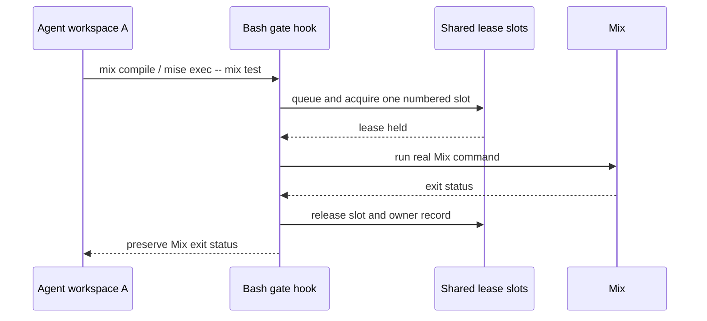

# refactor: Gate fleet-wide Mix verification

## Summary

Add a host-local lease gate for agent-launched `mix compile` and `mix test` work. The gate will cap only those expensive commands, so agents can continue editing, using Git, and reasoning while another workspace verifies. It will use atomically-created, owner-recorded lease slots rather than a daemon-owned counter, preserving recovery when individual agents or the Aiur release exit.

---

## Problem Frame

Concurrent steady-state Mix verification, rather than agent dispatch, saturates the 12-core host. The current dispatch load gate and `Aiur.AgentResourceGuard` constrain different failure modes: neither serializes compile/test work across independent local agent workspaces.

---

## Assumptions

*This plan is being executed from the ticket's explicit scope without a separate requirements-review turn. The items below are implementation assumptions to verify with focused coverage.*

- The configured workspace fleet runs under one OS user, so a user-scoped gate directory represents the host-local fleet.
- The agent shell commands are launched through non-interactive Bash and therefore honor the environment hook injected by `Aiur.AgentEnvironment`.

---

## Requirements

- R1. `agent.max_concurrent_builds` has a conservative default of `2`, accepts non-negative integers, and uses `0` as the explicit unrestricted-verification opt-out.
- R2. Separate local agent processes coordinate on the same capacity without an in-memory coordinator or a lease that survives its owner.
- R3. Direct `mix compile` / `mix test` and the documented `mise exec -- mix …` form acquire capacity; ordinary commands and other Mix tasks remain unblocked.
- R4. Queueing, acquisition, release, timeout, gate-error, and stale-owner recovery are visible in the agent command transcript; current contention is visible from the operator status command.
- R5. Focused coverage demonstrates configuration validation, serial contention, release, stale-owner cleanup, timeout, and shell-command integration.

---

## Scope Boundaries

- This does not limit remote-worker hosts, arbitrary build tools, prewarm/base-build hooks, or an operator who runs Mix outside an agent workspace.
- This does not replace the dispatch load gate or synthetic-load-process guard.
- It does not attempt to intercept intentionally bypassed binary paths or custom shell interpreters.

---

## Context & Research

### Relevant Code and Patterns

- `src/lib/aiur/config/schema.ex` owns agent configuration defaults and numeric validation; `src/lib/aiur/config.ex` exposes typed runtime accessors.
- `src/lib/aiur/agent_environment.ex` is the common local and SSH environment seam for Codex and Claude app-server processes.
- `src/lib/aiur/codex/coding_agent.ex` and `src/lib/aiur/claude/coding_agent.ex` both apply that environment before an agent can issue shell commands.
- `src/lib/aiur/agent_control_cli.ex` renders `aiur status`, the appropriate concise surface for live contention.
- `src/lib/aiur/agent_resource_guard.ex` demonstrates that the existing guard only manages synthetic load-generator descendants and must remain separate.

### Institutional Learnings

- Workspace environment variables are deliberately centralized to prevent agents from inventing cache/trust paths; the build-gate hook must follow that same pattern.
- The ticket prompt requires a scoped verification gate rather than fleet-expensive full-suite/lint loops.

---

## Key Technical Decisions

- Use numbered lease directories in a user-scoped Aiur gate directory. Atomic directory creation grants a slot; an owner PID record lets waiters recover a slot after its owner has exited, without an in-memory coordinator.
- Inject a packaged Bash hook with `BASH_ENV`. It defines functions for direct `mix` and `mise exec -- mix` calls, gates only `compile` and `test`, then delegates to the real executable without recursion.
- Keep diagnostic owner and queue records separate from the lease directories. They make queue/acquire/release/timeout/stale-recovery logs and status possible, but metadata is never treated as permanent capacity.
- Use a bounded default wait time and fail the requested command with a clear timeout signal. An unreadable gate directory fails open with an explicit signal so operators retain local verification.

---

## High-Level Technical Design

> *This illustrates the intended approach and is directional guidance for review, not implementation specification. The implementing agent should treat it as context, not code to reproduce.*

---

## Implementation Units

### U1. Model gate configuration and shared status

**Goal:** Add the operator-facing capacity setting and a small runtime helper that derives the shared gate location and reports live owner/queue records.

**Requirements:** R1, R2, R4

**Dependencies:** None

**Files:**
- Create: `src/lib/aiur/build_gate.ex`
- Modify: `src/lib/aiur/config/schema.ex`
- Modify: `src/lib/aiur/config.ex`
- Modify: `src/lib/aiur/agent_control_cli.ex`
- Modify: `src/test/support/test_support.exs`
- Test: `src/test/aiur/build_gate_test.exs`
- Test: `src/test/aiur/agent_control_cli_test.exs`

**Approach:** Give the setting a default of two and validate zero or a positive integer. Derive a user-scoped path, parse lease and queue records defensively, ignore records whose owner PID is gone, and expose a no-throw status result. Render an additional status line only when there is active or queued contention.

**Patterns to follow:** `Aiur.Config.synthetic_load_process_cap/0`, `Aiur.AgentResourceGuard`, and the current `AgentControlCLI.status/0` table/error handling.

**Test scenarios:**
- Happy path: omitted config resolves to two slots; explicit zero disables hook installation.
- Error path: negative and non-integer values fail schema validation with the field path visible.
- Edge case: stale owner/queue records are ignored without reporting active capacity.
- Integration: a live owner record produces an operator status summary without changing normal empty-status output.

**Verification:** Runtime settings expose the configured limit and status never treats leftover metadata as a held lease.

---

### U2. Inject the durable shell gate into agent command environments

**Goal:** Package and inject a non-interactive Bash hook that acquires capacity around relevant Mix commands across every local agent workspace.

**Requirements:** R2, R3, R4

**Dependencies:** U1

**Files:**
- Create: `src/priv/build_gate.bash`
- Modify: `src/lib/aiur/agent_environment.ex`
- Test: `src/test/aiur/agent_environment_test.exs`
- Test: `src/test/aiur/build_gate_test.exs`

**Approach:** Pass the hook path, configured slot count, shared directory, and wait budget in the existing environment seam. The hook should recognize direct Mix tasks and the standard `mise exec -- mix` spelling, queue before retrying numbered lease directories, write diagnostics only while waiting/holding a slot, and preserve the real command's status. It must remove diagnostics on normal release, timeout cleanly, and recover a stale owner only after confirming its PID is no longer alive.

**Execution note:** Start with focused integration coverage using fake `mix` and `mise` executables in a temporary directory; this proves the hook rather than merely testing helper strings.

**Patterns to follow:** `Aiur.AgentEnvironment.workspace_env/1`, `workspace_env_export_prefix/1`, and shell escaping conventions already used for remote agent launch.

**Test scenarios:**
- Happy path: direct `mix compile` acquires/release logs and runs exactly once.
- Integration: `mise exec -- mix test` is gated while `mix format` and `git status` are delegated immediately.
- Edge case: capacity one makes a second command queue until the first releases, then it completes.
- Error path: a held slot beyond the wait budget reports timeout and does not run Mix; an unreadable gate directory reports its failure mode.
- Recovery: a stale owner record is reclaimed before a subsequent command acquires that slot.

**Verification:** Concurrent shells never run more gated fake Mix commands than configured, and a terminated owner cannot orphan capacity.

---

### U3. Document and surface the operator contract

**Goal:** Make the conservative default, opt-out, affected commands, and observability signals discoverable in generated configuration and repository documentation.

**Requirements:** R1, R3, R4

**Dependencies:** U1, U2

**Files:**
- Modify: `.aiur/config`
- Modify: `.aiur/examples/config.example`
- Modify: `src/README.md`

**Approach:** Add a concise commented configuration example and README behavior note. State that `0` disables the gate, the default is intended for a 12-core host, and the hook limits only agent-sourced compile/test commands. Keep the initializer's existing defaults backwards-compatible rather than adding another interactive setup prompt.

**Test scenarios:**
- Happy path: generated configuration remains valid without an explicit setting and documents the supported override.
- Edge case: configured zero is represented as an intentional opt-out, not as an invalid or absent value.

**Verification:** A new configuration parses with the default, while operators can find the opt-out and status signal without reading source.

---

## System-Wide Impact

- **Interaction graph:** Both coding-agent backends inherit the same environment, so the gate applies consistently without modifying model or Git/editor paths.
- **Error propagation:** A Mix failure retains its original exit status; a gate timeout becomes a clear command failure in the agent transcript.
- **State lifecycle risks:** Lease ownership is atomically acquired; diagnostic files are cleaned on normal release or stale-owner observation and never become capacity by themselves.
- **API surface parity:** Both local coding-agent backends inherit the hook through their shared environment builder; remote-worker capacity remains intentionally out of scope.
- **Unchanged invariants:** Agent dispatch concurrency, synthetic-load trimming, warm-base compilation, and ordinary shell commands retain their existing behavior.

---

## Risk Analysis & Mitigation

| Risk | Likelihood | Impact | Mitigation |
|---|---|---|---|
| Shell hook misses a documented command spelling | Medium | High | Cover direct Mix and `mise exec -- mix`; document the deliberate boundary. |
| Metadata outlives an agent crash | Medium | Medium | Reclaim a lease only after its recorded owner PID is no longer alive. |
| Hook prevents urgent local verification | Low | Medium | Support `max_concurrent_builds: 0` and log gate-directory failures clearly. |
| Status reads introduce a new failure path | Low | Low | Make status observation best-effort and omit its line when no contention exists. |

---

## Documentation / Operational Notes

- Default capacity is two concurrent verification processes, intentionally conservative for the observed 12-core host contention.
- Operators can raise the number after observing load or set it to zero to disable agent-side gating.
- Queue, acquisition, release, timeout, gate-error, and stale-owner signals use a stable `aiur_build_gate` log prefix for transcript search.

---

## Sources & References

- Related issue: #881
- Related code: `src/lib/aiur/agent_environment.ex`, `src/lib/aiur/agent_resource_guard.ex`, `src/lib/aiur/config/schema.ex`
