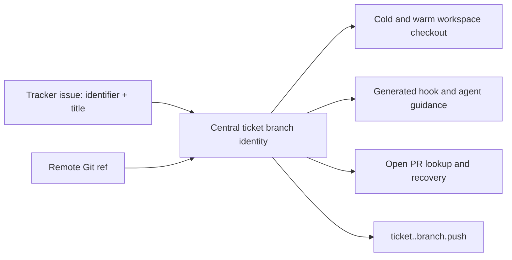

# feat: Add readable Aiur ticket branch slugs

## Summary

Centralize Aiur ticket branch identity so a newly dispatched issue receives a readable, deterministic suffix while every consumer still derives the numeric ticket key. Workspace creation will receive the issue title; event routing, PR discovery, recovery, and agent-facing instructions will accept both new and legacy branch forms.

---

## Problem Frame

`aiur/<issue-number>` is a stable internal key but is hard to recognize in a branch list. The current string construction and exact-match parsing are duplicated across workspace bootstrap, GitHub event routing, PR lookup, recovery, and generated guidance, making a suffix unsafe without a single compatibility boundary.

---

## Assumptions

*This plan was authored without synchronous user confirmation. The items below are agent inferences that fill gaps in the input — un-validated bets that should be reviewed before implementation proceeds.*

- A title-derived branch is only created for a new tracker issue; an existing PR head reference remains authoritative.
- GitHub open-PR lookup will paginate and filter open Aiur PR heads through the centralized parser so it can find either the legacy or suffixed actual head ref.
- ASCII normalization can be implemented with the Elixir/OTP Unicode facilities already available to the application, without adding a dependency.

---

## Requirements

- R1. Generate `aiur/<issue-number>-<title-slug>` for newly dispatched tracker issues, using at most four normalized title words and falling back to `aiur/<issue-number>` when no words remain.
- R2. Normalize title tokens deterministically to ASCII-safe Git-ref text, drop unusable tokens, and never emit malformed separators.
- R3. Parse both legacy and suffixed ticket branches, retaining the numeric ticket identity for event topics and routing.
- R4. Create fresh cold and warm workspaces on the generated branch while preserving actual recorded PR heads and existing legacy branches.
- R5. Update event detection, PR lookup, comment/rework routing, recovery, generated hooks, prompts, and agent guidance to rely on the centralized branch identity.
- R6. Add focused coverage for normalization, compatibility, workspace creation, PR lookup, and suffixed ref-to-topic publication.

---

## Scope Boundaries

- Existing legacy branches and existing PR head references are not renamed or migrated.
- Non-Aiur human PR branches remain PR-anchored and are not parsed as ticket branches.
- This change does not alter ticket event topics: they remain `ticket.<number>.branch.push`.

---

## Context & Research

### Relevant Code and Patterns

- `src/lib/aiur/events/github_keys.ex` is the current exact ref-to-topic classifier used by the ls-remote ticker and GitHub firehose.
- `src/lib/aiur/workspace/{context,checkout,materialize,provisioner,hooks}.ex` owns fresh workspace construction and lifecycle hooks.
- `src/lib/aiur/github/pull_requests.ex` currently queries the exact legacy head ref; `src/lib/aiur/orchestrator.ex` separately recognizes an Aiur-owned PR by the same exact string.
- `.aiur/examples/hooks.example`, `.aiur/examples/prompt.md.example`, and `src/lib/aiur/init/templates.ex` are the embedded init source of truth; the repository's `.aiur/hooks` and `.aiur/prompt.md` are its dogfood counterpart.

### Institutional Learnings

- No relevant `docs/solutions/` entries are present in this checkout.

### External References

- None required; the behavior is repository-local and uses standard Git-ref constraints.

---

## Key Technical Decisions

- One ticket-branch module owns generation and parsing; consumers receive a branch name or ticket identifier rather than constructing string variants.
- The parser accepts exactly `aiur/<positive numeric id>` and `aiur/<positive numeric id>-<non-empty safe slug>`; near misses such as `aiur/123x`, nested refs, and malformed suffixes remain non-ticket refs.
- The workspace context carries the already-generated branch name into both materialized checkout and configured lifecycle hooks, avoiding independent reconstruction from a workspace leaf.
- PR discovery identifies a ticket by parsing returned `head.ref` values, allowing an existing legacy PR or an actual suffixed PR to resume unchanged.
- A blocker event's remote `ref` is the authoritative fetch target for a suffix the dependent cannot derive from its numeric event key; any fallback remote lookup must filter through the centralized parser before use.

---

## High-Level Technical Design

> *This illustrates the intended approach and is directional guidance for review, not implementation specification. The implementing agent should treat it as context, not code to reproduce.*

---

## Implementation Units

### U1. Centralize ticket branch identity

**Goal:** Provide the sole generator and parser for new and legacy Aiur ticket branches.

**Requirements:** R1, R2, R3

**Dependencies:** None

**Files:**
- Create: `src/lib/aiur/ticket_branch.ex`
- Test: `src/test/aiur/ticket_branch_test.exs`

**Approach:** Normalize a title into up to four ASCII alphanumeric tokens, construct the generated branch from the numeric identifier and normalized suffix, and expose parsing for branch and full-ref callers. Retain a clear legacy fallback and reject non-ticket lookalikes.

**Patterns to follow:** Pure small boundary modules such as `src/lib/aiur/events/github_keys.ex` and extracted v2 helpers.

**Test scenarios:**
- Happy path: `Add New Test Cases for Hooks` generates `aiur/123-add-new-test-cases`.
- Edge case: punctuation, separators, repeated dashes, and accented text normalize to a stable ASCII slug.
- Edge case: only the first four usable words contribute to the suffix.
- Error path: empty or unusable titles fall back to the legacy branch without a trailing dash.
- Compatibility: both a legacy branch and a valid suffixed branch parse to the same numeric ticket identity; near-miss and nested refs do not parse.

**Verification:** Every branch-producing and branch-parsing caller can use this module without duplicate slug or ref regex logic.

---

### U2. Carry the generated branch through workspace setup

**Goal:** Create new warm and cold workspaces from the configured base branch on the generated ticket branch, while keeping existing PR heads intact.

**Requirements:** R1, R4, R5

**Dependencies:** U1

**Files:**
- Modify: `src/lib/aiur/workspace.ex`
- Modify: `src/lib/aiur/workspace/context.ex`
- Modify: `src/lib/aiur/workspace/checkout.ex`
- Modify: `src/lib/aiur/workspace/materialize.ex`
- Modify: `src/lib/aiur/workspace/provisioner.ex`
- Modify: `src/lib/aiur/workspace/hooks.ex`
- Modify: `src/lib/aiur/workspace/refresh.ex`
- Test: `src/test/aiur/workspace/context_test.exs`
- Test: `src/test/aiur/workspace/checkout_test.exs`
- Test: `src/test/aiur/workspace_materialize_test.exs`
- Test: `src/test/aiur/workspace/provisioner_test.exs`
- Test: `src/test/aiur/workspace/hooks_test.exs`

**Approach:** Derive the branch once from an issue context containing title and identifier, pass it explicitly through materialization and hook environment setup, and use `pr_head_ref` unchanged where a PR already anchors the workspace. Preserve identifier-only callers with the legacy fallback.

**Patterns to follow:** Existing `Workspace.Context` normalization and the PR-anchored split in `Checkout` and `Materialize`.

**Test scenarios:**
- Happy path: a materialized workspace for issue 123 and the example title checks out `aiur/123-add-new-test-cases` from the live configured base.
- Integration: a configured cold bootstrap hook receives the generated value instead of deriving a bare branch from the workspace directory.
- Compatibility: identifier-only callers and existing PR-anchored workspaces retain their current branch behavior.
- Error path: absent title data selects the legacy branch safely.

**Verification:** New workspace paths never reconstruct `aiur/<id>` independently and PR-anchored creation still checks out its recorded head ref.

---

### U3. Make GitHub, event, and recovery consumers compatibility-aware

**Goal:** Route both ticket branch forms to the same numeric ticket key and discover existing open PRs without assuming an exact legacy head.

**Requirements:** R3, R4, R5, R6

**Dependencies:** U1

**Files:**
- Modify: `src/lib/aiur/events/github_keys.ex`
- Modify: `src/lib/aiur/events/ls_remote_ticker.ex`
- Modify: `src/lib/aiur/events/github_firehose.ex`
- Modify: `src/lib/aiur/github/pull_requests.ex`
- Modify: `src/lib/aiur/github/human_review_gate.ex`
- Modify: `src/lib/aiur/events/github_comments_poller.ex`
- Modify: `src/lib/aiur/orchestrator.ex`
- Test: `src/test/aiur/events/github_keys_test.exs`
- Test: `src/test/aiur/events/ls_remote_ticker_test.exs`
- Test: `src/test/aiur/events/github_firehose_test.exs`
- Test: `src/test/aiur/regression/github_ingestion_test.exs`
- Test: `src/test/aiur/github/pull_requests_test.exs`
- Test: `src/test/aiur/github_client_test.exs`
- Test: `src/test/aiur/orchestrator_deactivate_test.exs`

**Approach:** Delegate ref classification and Aiur-owned head recognition to the centralized parser, publish only the numeric ticket topic, and use parser-based matching when querying paginated open PRs or recovering stale workspaces. Preserve the actual returned head ref for resumed work; downstream blocker fetches consume the validated event ref rather than trying to recreate a suffix from the ticket key.

**Patterns to follow:** The `GithubKeys` classification boundary, ls-remote bootstrap behavior, and the current PR-anchored routing safeguards.

**Test scenarios:**
- Happy path: `refs/heads/aiur/123-add-new-test-cases` publishes `ticket.123.branch.push` after ticker bootstrap.
- Compatibility: `refs/heads/aiur/123` and a legacy open PR continue to route and resume unchanged.
- Error path: `aiur/123x`, malformed suffixes, nested refs, and arbitrary human branches do not route as ticket branches.
- Integration: dependent-ticket event delivery keeps the numeric topic despite the suffixed remote ref.
- Integration: a dependent ticket fetches the suffixed blocker ref carried by the branch-push payload and validates that it resolves to the blocker identifier.
- Integration: open-PR lookup returns an existing suffixed or legacy head as recorded rather than synthesizing a replacement.

**Verification:** No GitHub event, polling, rework, or reset path relies on an exact `aiur/<digits>` string outside the centralized module.

---

### U4. Update generated bootstrap and agent-facing guidance

**Goal:** Ensure scaffolded hooks, dogfood hooks, workspace prompts, and coordination instructions tell agents to use the generated actual branch rather than guessing a bare ref.

**Requirements:** R4, R5

**Dependencies:** U1, U2

**Files:**
- Modify: `.aiur/hooks`
- Modify: `.aiur/prompt.md`
- Modify: `.aiur/examples/hooks.example`
- Modify: `.aiur/examples/prompt.md.example`
- Modify: `.claude/skills/aiur-agent/SKILL.md`
- Modify: `.claude/skills/aiur-agent/dev-loop.md`
- Modify: `.claude/skills/aiur-agent/event-taxonomy.md`
- Modify: `.claude/skills/aiur-agent/emit-and-subscribe.md`
- Test: `src/test/aiur/init/templates_test.exs`
- Test: `src/test/aiur/aiur_agent_skill_test.exs`

**Approach:** Have lifecycle hooks consume an exported generated branch value and describe branch commands as using the workspace’s actual canonical branch. Keep numeric event topics and legacy-fetch compatibility explicit in the coordination guidance, including that blockees fetch the actual validated ref supplied by a branch-push event rather than guessing a bare branch.

**Patterns to follow:** Compile-time template embedding in `Aiur.Init.Templates` and existing skill-content regression tests.

**Test scenarios:**
- Integration: `aiur init` emits hooks and prompts that consume the generated branch value rather than interpolating the workspace leaf.
- Compatibility: guidance explains that an existing recorded head and legacy branch remain valid.
- Error path: blocker instructions do not prescribe a bare branch when the received event identifies only the numeric ticket.

**Verification:** No generated hook, prompt, or agent instruction independently guesses an `aiur/<id>` branch.

---

### U5. Validate the change at feature boundaries

**Goal:** Run the focused feature suite and compilation checks after the centralized changes are in place.

**Requirements:** R6

**Dependencies:** U1, U2, U3, U4

**Files:**
- Test: affected files from U1 through U4

**Approach:** Run the formatter, warnings-as-errors compilation, and the focused test modules covering branch normalization, workspace creation, GitHub event routing, PR lookup, generated templates, and agent guidance.

**Test scenarios:**
- Integration: all focused modules pass together against the extracted `v2` architecture.

**Verification:** The scoped pre-PR gate completes without formatting, compiler-warning, or focused-test failures.

---

## System-Wide Impact

- **Interaction graph:** tracker issue title flows through workspace context to new branch creation; remote refs flow through the same parser into event topics and PR ownership checks.
- **Error propagation:** invalid or titleless input selects the legacy branch rather than emitting an invalid ref; malformed remote refs remain non-ticket events.
- **State lifecycle risks:** existing PR heads must remain authoritative to avoid accidental renames or second branches on resumed work.
- **API surface parity:** local warm materialization, cold configured hooks, GitHub polling, firehose processing, and ls-remote detection must share the parser.
- **Unchanged invariants:** ticket topics remain numeric, agent workspace leaves remain identifiers, and human PR-anchored refs are never treated as Aiur ticket branches.

---

## Risks & Dependencies

| Risk | Mitigation |
|---|---|
| A permissive suffix parser falsely wakes dependent tickets | Accept only the exact generated branch grammar and add negative ref cases. |
| A cold hook reconstructs a different branch than warm materialization | Pass one generated branch value through the workspace context and hook environment. |
| Existing PR lookup misses a legacy or suffixed head | Filter returned open PR heads through the centralized parser and retain the actual ref. |
| Title normalization produces an invalid Git ref | Restrict the suffix to normalized ASCII alphanumeric tokens joined by single dashes, with legacy fallback. |

---

## Documentation / Operational Notes

- No rollout migration is required: legacy branches remain accepted indefinitely.
- Generated `.aiur` hook and prompt examples change only for future initialization; existing configured hooks become correct when updated by users or the dogfood configuration.

---

## Sources & References

- Related issue: #910
- Related code: `src/lib/aiur/events/github_keys.ex`, `src/lib/aiur/workspace/checkout.ex`, `src/lib/aiur/github/pull_requests.ex`
