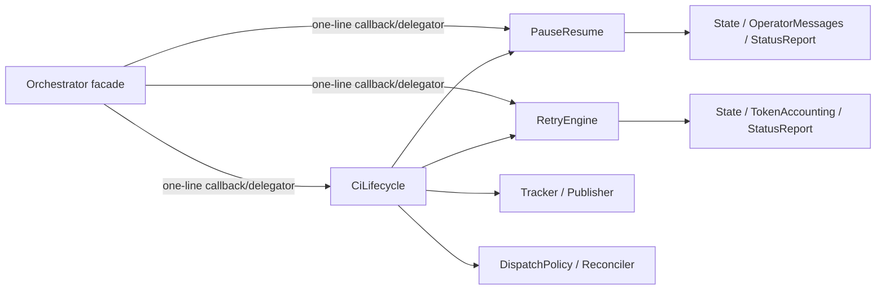

# refactor: Relocate orchestrator lifecycle glue

## Summary

Move control-status ownership into `PauseResume`, introduce `CiLifecycle` for the
CI transition and terminal-event coordinator, and move the complete agent-down
unit into `RetryEngine`. Keep the GenServer facade and existing public seams as
one-line delegators so callers and runtime behavior remain unchanged.

---

## Problem Frame

Round one extracted most orchestrator behavior but left stateful lifecycle glue
inside the 2,824-line facade. FF-W0 now pins the least-tested CI, control-status,
and monitor-routing contracts; this wave can relocate those exact units without
redefining policy or changing the process boundary.

---

## Assumptions

*This plan was authored without synchronous user confirmation. The items below
are agent inferences that fill gaps in the input and should remain visible during
implementation and review.*

- `PauseResume` is the primary owner for both optimistic and worker-confirmed
  control-status writes because it already owns `put_running_control_status`,
  pause-clock policy, and resume-side control transitions.
- `CiLifecycle` absorbs the three named functions, terminal-event formatting and
  deduplication helpers, and the shared CI target/approval-persistence primitives
  needed to avoid calls back through the facade. The wider poll/result decision
  state machine stays in the facade and uses one-line delegators to those moved
  primitives.
- Existing FF-W0 facade tests remain the principal behavior contract; new test
  work is limited to the uncovered external-error preservation path and direct
  destination-module seams where needed.

---

## Requirements

- R1. Move CI ticket transition, terminal event publication, CI-wait pausing,
  and their cohesive private support into a new
  `Aiur.Orchestrator.CiLifecycle` coordinator.
- R2. Move `handle_agent_down` as one atomic normal-versus-crash unit, plus the
  F1-associated active-runner external-error preservation helper, into
  `Aiur.Orchestrator.RetryEngine`.
- R3. Move control-status writers and worker-confirmation handling into their
  primary caller module without creating a `ControlState` abstraction.
- R4. Leave GenServer callbacks and compatibility APIs as one-line facade
  delegators, with all extracted functions still executing synchronously inside
  the orchestrator process.
- R5. Preserve every behavior invariant in
  `docs/refactor/research-arch/giant-orchestrator.md` section 4, especially
  token-guarded timers, no teardown from `handle_agent_down`, claim retention,
  and pause/resume clock ordering.
- R6. Keep the repository green and retain the FF-W0 characterization coverage
  required by origin R5 and R6.

**Origin actors:** A3 (executor agents), A4 (Aiur loop pipeline)

**Origin flows:** F2 (behavior-preserving ticket execution)

---

## Scope Boundaries

- No retry, CI, control-alert, dispatch, tracker, or pause-clock policy changes.
- No `GenServer.call` or asynchronous process boundary between the facade and
  extracted modules.
- No new `ControlState` module and no split of the normal/crash `:DOWN` branch.
- No public client API split, dispatch-helper relocation, label-override pause
  relocation, lifecycle pipeline extraction, or `*_for_test` cleanup.
- No teardown call from the monitor-down path and no reordering of pause/resume
  state mutations.

### Deferred to Follow-Up Work

- FF-W2 owns dispatch, label-override pause, remaining facade glue, and the
  `Lifecycle` extraction.
- FF-W3 owns conversion of facade `*_for_test` seams to direct module calls.

---

## Context & Research

### Relevant Code and Patterns

- `src/lib/aiur/orchestrator.ex` contains the named residual glue and already
  delegates most neighboring behavior through small wrapper functions.
- `src/lib/aiur/orchestrator/pause_resume.ex` owns pause/resume state policy,
  control-message delivery, pause-clock mutation, and the existing running
  control-status writer.
- `src/lib/aiur/orchestrator/retry_engine.ex` owns completion, retry scheduling,
  retry token creation, claim release, and next-attempt semantics.
- `src/lib/aiur/orchestrator/reconciler.ex` exposes the running-issue refresh and
  reactivation operations needed by the CI coordinator.
- `src/test/aiur/orchestrator_ci_lifecycle_test.exs` and
  `src/test/aiur/orchestrator_control_routing_test.exs` are the merged FF-W0
  facade-level behavior pins for this relocation.
- `src/test/aiur/orchestrator/pause_resume_test.exs` and
  `src/test/aiur/orchestrator/retry_engine_test.exs` establish destination-module
  unit-test patterns.

### Institutional Learnings

- No matching `docs/solutions/` entry exists; the authoritative local learning
  is the hotspot and invariant analysis in the two named refactor research docs.
- The facade-extraction pattern keeps execution in the GenServer process and
  uses direct module calls rather than new servers or registry dispatch.

---

## Key Technical Decisions

- Keep facade compatibility wrappers: the F1 design requires zero caller churn,
  and later FF-W3 owns test-seam cleanup.
- Let `CiLifecycle` call the owning leaf modules directly: this preserves the
  approved one-directional coordinator fan-out and avoids calling back through
  the facade for stateful work.
- Keep `handle_agent_down` return shape and branch body together in
  `RetryEngine`: its state pop, runtime accounting, completion/retry scheduling,
  dashboard notification, and logs are one behavior-preservation unit.
- Consolidate control status in `PauseResume`: both optimistic writes and worker
  confirmations depend on its clock and resume policy, while alert delivery and
  dashboard rendering remain delegated to their existing owners.

---

## High-Level Technical Design

> *This illustrates the intended approach and is directional guidance for review, not implementation specification. The implementing agent should treat it as context, not code to reproduce.*

All arrows are ordinary synchronous function calls made while the orchestrator
GenServer owns the state.

---

## Implementation Units

### U1. Consolidate control-status ownership

**Goal:** Make `PauseResume` the single implementation home for optimistic and
worker-confirmed control-status mutations.

**Requirements:** R3, R4, R5

**Dependencies:** FF-W0 merged characterization

**Files:**
- Modify: `src/lib/aiur/orchestrator/pause_resume.ex`
- Modify: `src/lib/aiur/orchestrator.ex`
- Test: `src/test/aiur/orchestrator_control_routing_test.exs`
- Test: `src/test/aiur/orchestrator/pause_resume_test.exs`
- Test: `src/test/aiur/orchestrator/push_routing_test.exs`

**Approach:**
- Move control transition, worker confirmation, pause attribution, alert, clock,
  logging, and auto-resume glue together into `PauseResume`.
- Delegate the facade's worker-control callback clauses and public transition
  seam to `PauseResume`; preserve current cross-module callers.
- Call `State`, `OperatorMessages`, and `StatusReport` directly from the owning
  module without changing mutation order.

**Execution note:** Treat the FF-W0 control-routing assertions as characterization
tests; preserve exact no-op and clock semantics before simplifying wrappers.

**Patterns to follow:**
- Existing resume-side mutation ordering in
  `src/lib/aiur/orchestrator/pause_resume.ex`.
- Existing one-line facade wrappers near the bottom of
  `src/lib/aiur/orchestrator.ex`.

**Test scenarios:**
- Integration: worker pause confirmation keeps capabilities, records attribution,
  freezes the clock, emits the existing alert, and returns the updated state.
- Edge case: duplicate status and unknown worker confirmations remain exact
  no-ops.
- Happy path: worker working confirmation thaws the clock without dropping
  unrelated entry fields.
- Integration: optimistic pause callers continue to observe the same state and
  control-message behavior through the facade delegator.
- Integration: the existing working-to-sleeping route still writes `:sleeping`
  through the facade delegator without changing paused or deactivated entries.

**Verification:**
- The facade contains only callback/delegator lines for this concern and all
  control characterization remains green.

### U2. Introduce the CI lifecycle coordinator

**Goal:** Give the CI transition, CI-wait pause, and terminal-event publication
glue a cohesive module with one-directional dependencies.

**Requirements:** R1, R4, R5

**Dependencies:** U1

**Files:**
- Create: `src/lib/aiur/orchestrator/ci_lifecycle.ex`
- Modify: `src/lib/aiur/orchestrator.ex`
- Test: `src/test/aiur/orchestrator_ci_lifecycle_test.exs`
- Test: `src/test/aiur/orchestrator_deactivate_test.exs`
- Test: `src/test/aiur/orchestrator/reconciler_test.exs`

**Approach:**
- Move the named coordinator functions, terminal-publication support, and shared
  CI target/approval-persistence primitives into the new module, retaining
  tracker-write-before-state/control/event ordering.
- Fan out directly to `Tracker`, `DispatchPolicy`, `Reconciler`, `PauseResume`,
  `RetryEngine`, and the existing event/persistence owners.
- Keep facade calls one line and retain existing facade CI seams until FF-W3.

**Execution note:** Preserve the FF-W0 fail-closed and idempotence assertions as
the acceptance contract for the move.

**Patterns to follow:**
- Coordinator-style direct module calls in
  `src/lib/aiur/orchestrator/reconciler.ex`.
- Event sanitization, contamination bypass, and dedup behavior currently pinned
  by `src/test/aiur/orchestrator_ci_lifecycle_test.exs`.

**Test scenarios:**
- Integration: pending CI writes `ci-wait` before pausing a live runner and
  preserves its claim and pause-clock data.
- Error path: tracker transition failure leaves state unchanged and publishes no
  control or terminal event.
- Integration: pass/fail publication retains ordering, sanitized payload,
  deduplication, stored head state, and existing reactivation behavior.
- Edge case: repeated pending observation for a `ci-wait` issue remains an exact
  no-op.

**Verification:**
- The new module owns the named CI lifecycle implementation and the facade's CI
  paths remain behaviorally identical under the focused suite.

### U3. Move the atomic monitor-down unit into RetryEngine

**Goal:** Put completion/crash routing and active-runner external-error
preservation beside the retry policy they coordinate.

**Requirements:** R2, R4, R5

**Dependencies:** FF-W0 merged characterization

**Files:**
- Modify: `src/lib/aiur/orchestrator/retry_engine.ex`
- Modify: `src/lib/aiur/orchestrator.ex`
- Test: `src/test/aiur/orchestrator/retry_engine_test.exs`
- Test: `src/test/aiur/orchestrator_control_routing_test.exs`
- Test: `src/test/aiur/regression/orchestrator_dispatch_retry_test.exs`

**Approach:**
- Move the complete monitor lookup, running-entry pop, session accounting,
  normal/crash branch, logging, retry scheduling, and dashboard notification as
  one function.
- Keep normal completion on continuation attempt one and crash handling on the
  existing next-attempt derivation, with claims retained across both paths.
- Move external-error runner preservation into the same F1 destination and keep
  its facade compatibility delegator.

**Execution note:** Do not factor the normal and crash branches apart or add any
teardown call while relocating them.

**Patterns to follow:**
- Retry token and budget implementation already in
  `src/lib/aiur/orchestrator/retry_engine.ex`.
- Runtime accounting helpers in
  `src/lib/aiur/orchestrator/token_accounting.ex` and running-entry helpers in
  `src/lib/aiur/orchestrator/state.ex`.

**Test scenarios:**
- Edge case: a stale monitor reference leaves the complete state untouched.
- Happy path: normal exit removes the running entry, records runtime, marks
  completion, retains the claim, and schedules continuation attempt one.
- Error path: abnormal exit records runtime, retains the claim, avoids completion,
  and schedules the next failure attempt with routing metadata.
- Integration: neither monitor route terminates the worker process nor removes
  workspace artifacts.
- Edge case: an externally reported error refreshes the stored issue while
  preserving the live runner and claim.

**Verification:**
- `RetryEngine` contains the entire atomic route, the facade callback is one line,
  and focused tests prove no teardown or policy drift.

### U4. Run the scoped behavior-preservation gate

**Goal:** Confirm the pure move is warning-free, formatted, lint-clean, and green
across every directly affected lifecycle suite.

**Requirements:** R4, R5, R6

**Dependencies:** U1, U2, U3

**Files:**
- Test: `src/test/aiur/orchestrator_ci_lifecycle_test.exs`
- Test: `src/test/aiur/orchestrator_control_routing_test.exs`
- Test: `src/test/aiur/orchestrator/pause_resume_test.exs`
- Test: `src/test/aiur/orchestrator/retry_engine_test.exs`
- Test: `src/test/aiur/orchestrator/push_routing_test.exs`
- Test: `src/test/aiur/orchestrator/reconciler_test.exs`
- Test: `src/test/aiur/orchestrator_deactivate_test.exs`
- Test: `src/test/aiur/regression/orchestrator_dispatch_retry_test.exs`

**Approach:**
- Run the focused FF-W0 suites first, then the destination-module and directly
  related integration suites under the required four-case cap.
- Run compile with warnings as errors, the repository format check, and scoped
  strict lint over changed source and test files.

**Test scenarios:**
- Integration: all affected suites pass together without leaked timers,
  subscriptions, environment, process teardown, or cross-test state.

**Verification:**
- The complete scoped pre-PR gate passes and the diff contains ownership moves,
  delegators, and characterization only.

---

## System-Wide Impact

- **Interaction graph:** GenServer callbacks still enter through the facade, then
  synchronously invoke the three owning modules and their existing leaf helpers.
- **Error propagation:** Tracker failures remain fail-closed; event filtering and
  retry scheduling keep their current return and logging behavior.
- **State lifecycle risks:** CI head persistence, pause clocks, retry tokens,
  claims, completion sets, and runtime totals must be mutated in the same order.
- **API surface parity:** Existing `Aiur.Orchestrator` public/test seams remain
  callable; no external caller migration is part of this wave.
- **Integration coverage:** FF-W0 tests cover tracker-to-control/event ordering and
  facade-to-state transitions; destination suites cover local policy helpers.
- **Unchanged invariants:** Timer token sites, teardown ordering, init/terminate,
  dispatch admission, pause/resume budgets, and publisher tracked-set closure are
  untouched.

---

## Risks & Dependencies

| Risk | Mitigation |
|------|------------|
| A helper moves without a private dependency and reintroduces facade calls | Move cohesive support or call its established owner directly; verify the module graph remains one-directional. |
| Control-status relocation reorders clock or alert writes | Preserve the current pipeline verbatim and rely on FF-W0 plus pause/resume tests. |
| `:DOWN` refactoring accidentally adds cleanup or changes retry classification | Move the entire branch without decomposition; assert worker/workspace survival and retry metadata. |
| CI coordinator publishes before a successful tracker write | Retain the existing case boundary and ordering assertions. |
| FF-W0 is absent or stale | Dependency is satisfied by the current `origin/v2` base commit from merged PR #950. |

---

## Documentation / Operational Notes

- No user-facing behavior, configuration, rollout, migration, or manual TUI flow
  changes. The architecture plan and source module docs are the only relevant
  documentation surfaces.

---

## Sources & References

- **Origin document:** `docs/brainstorms/2026-07-06-production-readiness-refactor-planning-requirements.md`
- Wave design: `docs/refactor/research-arch/orchestrator-facade-finish.md`
- Behavior invariants: `docs/refactor/research-arch/giant-orchestrator.md`
- FF-W0 plan: `docs/plans/2026-07-10-001-refactor-orchestrator-residual-glue-characterization-plan.md`
- FF-W0 characterization: #941 / PR #950
- Originating ticket: #942
