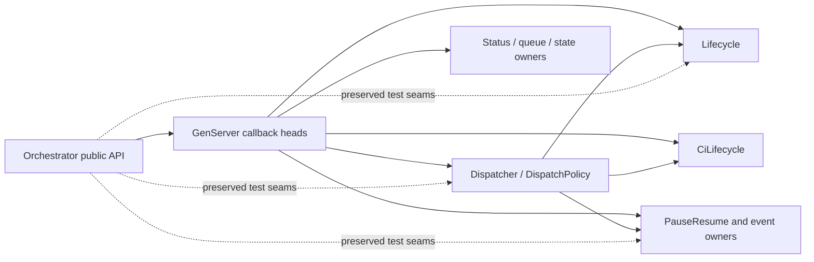

# refactor: Extract orchestrator dispatch and lifecycle glue

## Summary

Move the remaining dispatch, lifecycle, polling, callback, and private facade glue
into its existing synchronous owners, adding only `Aiur.Orchestrator.Lifecycle`.
Leave `Aiur.Orchestrator` as the public GenServer API and thin callback index while
preserving all current runtime ordering and compatibility seams.

---

## Problem Frame

FF-W1 moved the first stateful residual clusters, but the orchestrator facade still
contains 2,535 lines, 150 private clauses, and substantial callback bodies. That
layer obscures the already-extracted owners and keeps the hottest GenServer as an
architectural outlier. FF-W2 must finish the behavior-preserving ownership move
without changing the process boundary or any dispatch/lifecycle policy.

---

## Assumptions

*This plan was authored without synchronous user confirmation. The items below are
agent inferences that fill gaps in the input and should remain visible during
implementation and review.*

- The full GitHub CI polling coordinator belongs in `CiLifecycle`, complementing
  the terminal-transition primitives moved there by FF-W1.
- Label-override pause, startup recovery, and resume cleanup belong in
  `PauseResume`; dispatch should consume their results without owning tracker-label
  mutation.
- Existing owners may gain callback-scale entry functions so facade callbacks can
  delegate in one expression; no additional coordinator module is warranted.
- Existing public client APIs and every `*_for_test` signature remain available in
  this wave. Test seams may delegate directly to extracted owners, but their removal
  and test-callsite conversion stay reserved for FF-W3.
- The 400–800-line facade target is pursued by moving bodies and collapsing direct
  delegators, not by deleting documentation, assertions, public behavior, or
  compatibility contracts.

---

## Requirements

- R1. Relocate dispatch-entry orchestration and load-envelope mutation into
  `Dispatcher` / `DispatchPolicy`, preserving the prewarm-before-load ordering and
  restricting load admission to new work.
- R2. Introduce `Aiur.Orchestrator.Lifecycle` for the complete initialization and
  termination pipelines, preserving startup cleanup order, subscriptions, tracked
  set setup, tick seeding, process trapping, agent teardown order, and
  `ProcessReaper.reap(..., drain: false)`.
- R3. Move every remaining private facade helper and substantive callback body to
  its existing owning module, leaving synchronous one-line or two-line facade
  delegators and no new process boundary.
- R4. Move label-override recovery to `PauseResume` and the remaining CI polling
  pipeline to `CiLifecycle` without changing tracker transitions, pause/resume
  clocks, retry classification, event publication, or connectivity handling.
- R5. Preserve the public `Aiur.Orchestrator` client API, tracked-set publisher
  closure, callback message shapes, return tuples, and all `*_for_test` seams for
  FF-W3.
- R6. Preserve all behavior invariants in
  `docs/refactor/research-arch/giant-orchestrator.md` section 4, including
  single-process execution, token-guarded timers, teardown ordering, claim and retry
  semantics, load-gate scope, and pause/resume clocks.
- R7. Reduce the facade into the approved approximately 400–800-line range while
  keeping the repository green and retaining the characterization coverage required
  by origin R5 and R6.

**Origin actors:** A3 (executor agents), A4 (Aiur-loop pipeline)

**Origin flows:** F2 (behavior-preserving ticket execution)

---

## Scope Boundaries

- No dispatch registry, callback macro, public API split, or new GenServer/process.
- No tracker, CI, load, retry, cleanup, pause/resume, or alert policy changes.
- No timer-token creation/compare changes and no reordering of state mutations.
- No removal or caller conversion of `*_for_test` seams in this wave.
- No edits to `src/test/aiur/regression/`.
- No unrelated cleanup in already-extracted modules.

### Deferred to Follow-Up Work

- FF-W3 / #944 converts `*_for_test` callers to destination modules and removes the
  compatibility seams after verifying coverage does not drop.
- Any future split of public client wrappers from the GenServer remains explicitly
  outside the approved facade-finish architecture.

---

## Context & Research

### Relevant Code and Patterns

- `src/lib/aiur/orchestrator.ex` is the current 2,535-line facade. Its private
  clauses fall into lifecycle, dispatch, CI polling, pause recovery, callback
  routing, status, queue, token, and direct-delegation clusters.
- `src/lib/aiur/orchestrator/dispatcher.ex` already owns issue selection, claim,
  revalidation, workspace dispatch, and thrash accounting; it is the natural owner
  of the dispatch-entry composition.
- `src/lib/aiur/orchestrator/dispatch_policy.ex` already owns prewarm/load decisions,
  adaptive load-envelope policy, state eligibility, and candidate policy.
- `src/lib/aiur/orchestrator/ci_lifecycle.ex` demonstrates FF-W1's approved pattern:
  a synchronous coordinator may fan out one-directionally to tracker, retry,
  reconciliation, and pause owners.
- `src/lib/aiur/orchestrator/pause_resume.ex`,
  `src/lib/aiur/orchestrator/status_report.ex`,
  `src/lib/aiur/orchestrator/operator_messages.ex`,
  `src/lib/aiur/orchestrator/event_topics.ex`, and the state/token/slot modules
  already own the policies that the residual callback bodies compose.
- `docs/plans/2026-07-11-002-refactor-orchestrator-lifecycle-glue-relocation-plan.md`
  establishes the preceding move's facade-delegator, synchronous-execution, and
  characterization-first conventions.
- `src/test/aiur/orchestrator_ci_lifecycle_test.exs` and
  `src/test/aiur/orchestrator_control_routing_test.exs` are the FF-W0 pins for CI,
  control, and callback routing; the dispatch, lifecycle, status, and core tests pin
  the other affected seams.

### Institutional Learnings

- `docs/refactor/research-arch/giant-orchestrator.md` identifies dispatch/load,
  startup/termination, tokenized timers, teardown, and pause clocks as repeated
  regression hotspots. Extraction must preserve source ordering rather than
  reinterpret it.
- `docs/refactor/research-arch/orchestrator-facade-finish.md` rejects a dispatch
  registry and a public API split; the approved mechanism is plain function calls
  from a thin facade to existing owners.
- FF-W1 / merged PR #958 confirmed that direct state-in/state-out coordinators retain
  the GenServer's serialization while reducing facade ownership.

---

## Key Technical Decisions

- **One new module only:** `Lifecycle` is cohesive and explicitly approved; all
  other residual work extends an existing owner rather than manufacturing seams.
- **Keep callbacks as the OTP index:** callback heads and message patterns remain in
  the facade, while destination functions own their bodies and return the same
  callback tuples or state values.
- **Characterization-first execution:** existing FF-W0 and regression pins define
  behavior before moves; destination-module tests supplement coverage only where a
  newly public extraction would otherwise be weak.
- **Preserve test compatibility:** this wave rewires `*_for_test` bodies directly to
  owners but does not remove the facade entry points or rewrite their callers.
- **Measure the facade after formatting:** line reduction is an acceptance signal,
  but it cannot be achieved by compressing away load-bearing comments or changing
  behavior.

---

## Open Questions

### Resolved During Planning

- **Is FF-W1 still a live integration dependency?** No. Issue #942 is closed, PR
  #958 is merged into `v2`, and the current branch starts at that validated commit.
- **Does this wave remove facade test seams?** No. FF-W2 may redirect their bodies to
  owners, but #944 exclusively owns changing test callers and removing the seams.

### Deferred to Implementation

- **What is the exact formatted facade line count after all safe moves?** The source
  does not reveal the final formatter expansion or how many compatibility comments
  remain useful. Measure after U6 and treat a count outside 400–800 as incomplete;
  close the gap with signature-preserving direct delegators, without stealing #944's
  seam-removal scope or weakening documentation to force a number.

---

## High-Level Technical Design

> *This illustrates the intended approach and is directional guidance for review,
> not implementation specification. The implementing agent should treat it as
> context, not code to reproduce.*

All arrows are ordinary function calls made by the orchestrator process. Nothing
calls the GenServer back through its mailbox while a callback is executing.

---

## Implementation Units

### U1. Extract lifecycle initialization, timing, and termination

**Goal:** Create the required lifecycle owner and reduce `init/1`, `terminate/2`,
tick handling, and their private support to facade delegators without changing
ordering.

**Requirements:** R2, R3, R5, R6

**Dependencies:** FF-W1 / #942 (satisfied by merged PR #958)

**Files:**
- Create: `src/lib/aiur/orchestrator/lifecycle.ex`
- Modify: `src/lib/aiur/orchestrator.ex`
- Modify: `src/lib/aiur/orchestrator/tracked_set.ex`
- Test: `src/test/aiur/orchestrator/lifecycle_test.exs`
- Test: `src/test/aiur/core_test.exs`
- Test: `src/test/aiur/orchestrator_status_test.exs`
- Test: `src/test/aiur/orchestrator_deactivate_test.exs`
- Validate unchanged: `src/test/aiur/regression/orchestrator_lifecycle_test.exs`

**Approach:**
- Move state seeding, process trapping, startup cleanups, remote-control cleanup,
  tracked-set setup, subscriptions, publisher closure installation, tick scheduling,
  runtime config refresh, and termination teardown as one ordered lifecycle concern.
- Keep the public tracked-set predicate on the facade as the publisher closure
  contract; move only its state refresh/setup mechanics.
- Preserve token creation, old-timer cancellation, stale-token rejection, and
  `self()` semantics verbatim.

**Execution note:** Begin by re-reading the existing tick, cleanup, and terminate
pins; add direct lifecycle coverage before deleting the facade bodies.

**Patterns to follow:**
- Synchronous state-in/state-out coordination in
  `src/lib/aiur/orchestrator/ci_lifecycle.ex`
- Timer-token invariants in `src/lib/aiur/orchestrator.ex`

**Test scenarios:**
- Happy path: initialization builds the same configured state, performs terminal
  cleanup before todo cleanup, initializes tracking/subscriptions, and seeds an
  immediate tokenized tick.
- Edge case: a stale tick token returns the original state and does not start a
  second poll cycle; rescheduling cancels the prior timer before installing a new
  token and reference.
- Integration: the facade `init`, tick callbacks, refresh request, and terminate
  callbacks return exactly the same OTP tuples/results through `Lifecycle`.
- Cleanup: termination with running entries reaps registered agents with draining
  disabled before killing each remaining REPL session; non-state termination stays
  a no-op.

**Verification:**
- Lifecycle tests cover the new module without adding it to coverage ignores.
- The source ordering matches giant-orchestrator invariants 1–4 and 13.

### U2. Move dispatch entry and load-envelope composition

**Goal:** Make `Dispatcher` own the complete polling/admission entry path and
`DispatchPolicy` own all load-envelope state decisions, leaving facade seams as
direct delegators.

**Requirements:** R1, R3, R5, R6

**Dependencies:** U1 for poll-cycle delegation boundaries

**Files:**
- Modify: `src/lib/aiur/orchestrator.ex`
- Modify: `src/lib/aiur/orchestrator/dispatcher.ex`
- Modify: `src/lib/aiur/orchestrator/dispatch_policy.ex`
- Test: `src/test/aiur/orchestrator/dispatcher_test.exs`
- Test: `src/test/aiur/orchestrator/dispatch_policy_test.exs`
- Test: `src/test/aiur/orchestrator_load_gate_test.exs`
- Test: `src/test/aiur/orchestrator_prewarm_gate_test.exs`
- Test: `src/test/aiur/orchestrator_max_agents_test.exs`

**Approach:**
- Move tracker preflight, poll/reconcile sequencing, candidate fetch, dashboard
  refresh, prewarm gate, CPU load gate, adaptive envelope update, and final issue
  selection as the existing synchronous dispatch pipeline.
- Move the completed poll-cycle callback body with dispatch, then re-arm its next
  token through `Lifecycle` so lifecycle owns timer mechanics without depending on
  dispatch.
- Keep policy predicates pure in `DispatchPolicy`; keep side effects and owner fan-out
  in `Dispatcher`.
- Preserve startup pause-override recovery as a `PauseResume` call within the same
  position in the candidate pipeline.

**Execution note:** Treat the existing load/prewarm tests as characterization tests;
move code in source-order slices and run them after each slice.

**Patterns to follow:**
- Existing selection and revalidation flow in
  `src/lib/aiur/orchestrator/dispatcher.ex`
- Existing pure gates and envelope decisions in
  `src/lib/aiur/orchestrator/dispatch_policy.ex`

**Test scenarios:**
- Happy path: a successful preflight performs each poll/reconcile stage in the
  existing order, fetches candidates, refreshes dashboard state, and dispatches
  within available slots.
- Edge case: disabled load thresholds do not read host load; unavailable load and
  prewarm errors fail open exactly as before.
- Admission boundary: high load holds only new candidate dispatch while retries and
  reactivations retain their existing bypass paths.
- State transition: adaptive envelope decreases/ramp-up and initial envelope values
  remain bounded by static/session limits.
- Failure path: tracker preflight or candidate fetch errors log through
  `TrackerHealth` and retain the current state.

**Verification:**
- Dispatch and policy modules own the named FF-W2 entry functions and no dispatch
  policy remains private in the facade.
- Load, prewarm, slot, and retry bypass tests preserve giant-orchestrator invariants
  5, 6, and 8–9.

### U3. Relocate CI, event, and pause-override coordinators

**Goal:** Move the largest remaining stateful private clusters to their approved
owners while preserving tracker/event/control handoffs.

**Requirements:** R3, R4, R5, R6

**Dependencies:** U2 for the dispatch pipeline caller

**Files:**
- Modify: `src/lib/aiur/orchestrator.ex`
- Modify: `src/lib/aiur/orchestrator/ci_lifecycle.ex`
- Modify: `src/lib/aiur/orchestrator/pause_resume.ex`
- Modify: `src/lib/aiur/orchestrator/event_topics.ex`
- Test: `src/test/aiur/orchestrator_ci_lifecycle_test.exs`
- Test: `src/test/aiur/orchestrator_control_routing_test.exs`
- Test: `src/test/aiur/orchestrator_deactivate_test.exs`
- Test: `src/test/aiur/orchestrator/pause_resume_test.exs`
- Test: `src/test/aiur/orchestrator/push_routing_test.exs`

**Approach:**
- Move CI target refresh, polling, connectivity accounting, result application,
  approval/test-failure persistence, transitions, subscriptions, and CI-failure
  resume into `CiLifecycle` without changing FF-W1's one-directional fan-out.
- Move label-override pause, startup stale-label recovery, label clearing, and
  label-overridden resume into `PauseResume`.
- Move event topic classification/routing composition into the existing event owner;
  continue delegating actual comment, push, merge, CI, and pause behavior to their
  current modules.

**Execution note:** Keep FF-W0 characterization tests unchanged and passing while
moving complete branches; do not split transition branches across modules.

**Patterns to follow:**
- FF-W1 coordination in `src/lib/aiur/orchestrator/ci_lifecycle.ex`
- Pause-clock mutation order in `src/lib/aiur/orchestrator/pause_resume.ex`
- Pure parsing in `src/lib/aiur/orchestrator/event_topics.ex`

**Test scenarios:**
- CI: pending, passing, retryable-test-failure, terminal-failure, persistence,
  connectivity-partial-failure, and event-dedup paths return the same states and
  tracker/event effects.
- Pause override: active, already-paused, deactivated, missing, startup-stale, and
  tracker-removal-failure entries retain existing outcomes and logging.
- Event routing: every recognized topic invokes its existing owner and unknown topics
  remain no-ops.
- Clock invariant: automated resumes retain cumulative duration and activity-reset
  order while operator resumes retain a fresh budget.

**Verification:**
- The FF-W0 CI/control suites pass without assertion deletion or fixture weakening.
- No event or pause path introduces a mailbox call back into the orchestrator.

### U4. Move status and queue callback composition

**Goal:** Move the two largest remaining callback families—status reporting and queue
state transitions—into their established owners while keeping public calls and OTP
reply tuples unchanged.

**Requirements:** R3, R5, R6, R7

**Dependencies:** U1, U2, U3

**Files:**
- Modify: `src/lib/aiur/orchestrator.ex`
- Modify: `src/lib/aiur/orchestrator/status_report.ex`
- Modify: `src/lib/aiur/orchestrator/operator_messages.ex`
- Test: `src/test/aiur/orchestrator_status_test.exs`
- Test: `src/test/aiur/agent_queue_test.exs`
- Test: `src/test/aiur/core_test.exs`

**Approach:**
- Move poll status, active identifier lists, agent status, and full snapshot assembly
  behind `StatusReport` while retaining the same runtime refresh boundary.
- Move digest enqueue/coalescing, normal/checkpoint/operator/blocker-critical claims,
  and consume/restore/fail transitions behind the queue owners.
- Keep queue client functions and callback message heads in the facade; only their
  state manipulation and reply construction move.

**Execution note:** Move one callback family at a time and run its existing
orchestrator-level tests before starting the next family.

**Patterns to follow:**
- Status composition in `src/lib/aiur/orchestrator/status_report.ex`
- Queue ownership in `src/lib/aiur/orchestrator/operator_messages.ex` and
  `src/lib/aiur/orchestrator/digest_coalescer.ex`

**Test scenarios:**
- Status: snapshot, poll status, active identifiers, running identifiers, queue
  depth, capabilities, token totals, rate limits, retry timing, and runtime seconds
  match current responses.
- Queue: digest coalescing, checkpoint/operator/blocker-critical claims, consume,
  restore, and failure transitions preserve store state and reply tuples.
- Blocker-critical drain: only direct-blocker event digests are claimable mid-turn;
  all other queue items retain boundary-drain behavior.

**Verification:**
- Status and queue callbacks are direct owner delegators with byte-for-byte-compatible
  reply shapes, and their former private helpers are absent from the facade.

### U6. Thin runtime and control callbacks and finish the facade

**Goal:** Route runtime-update, token, retry, control, slot, and remaining forwarding
work directly to existing owners so the facade has no residual private helper layer
and reaches the approved size trajectory.

**Requirements:** R3, R5, R6, R7

**Dependencies:** U1, U2, U3, U4

**Files:**
- Modify: `src/lib/aiur/orchestrator.ex`
- Modify: `src/lib/aiur/orchestrator/slots.ex`
- Modify: `src/lib/aiur/orchestrator/state.ex`
- Modify: `src/lib/aiur/orchestrator/token_accounting.ex`
- Modify: `src/lib/aiur/orchestrator/retry_engine.ex`
- Test: `src/test/aiur/orchestrator_control_routing_test.exs`
- Test: `src/test/aiur/core_test.exs`
- Test: `src/test/aiur/orchestrator/token_accounting_test.exs`

**Approach:**
- Give existing owners the minimum cohesive callback-scale entry points needed to
  preserve runtime metadata, token/rate-limit accumulation, retry, sleep/activity,
  interrupt, remote-control, and max-agent reply contracts.
- Replace remaining private forwarding helpers with direct owner calls and collapse
  public compatibility/test seams to direct delegators without removing signatures.
- Keep client wrappers, callback heads, `issue_tracked?/1`, and load-bearing facade
  documentation; remove aliases/constants only after their final use moves.

**Execution note:** Remove residual helpers only after destination calls compile;
use compiler warnings and a final private-definition census as completeness checks.

**Patterns to follow:**
- State/token fallback clauses in their existing owner modules
- Control routing in `src/lib/aiur/orchestrator/pause_resume.ex`,
  `src/lib/aiur/orchestrator/interrupts.ex`, and
  `src/lib/aiur/orchestrator/remote_control_mode.ex`
- Session-cap policy in `src/lib/aiur/orchestrator/slots.ex`

**Test scenarios:**
- Runtime metadata: worker host/workspace and REPL/session fields update only existing
  running entries and preserve unknown-entry no-ops.
- Token/runtime: valid updates retain totals, rate limits, last-event state, and
  dashboard notification; malformed updates preserve current state.
- Retry: stale tokens remain no-ops; valid tokens preserve dashboard refresh and
  retry metadata handling.
- Control: sleep/activity, interrupt, remote-control, trust, and max-agent callbacks
  retain guards, side effects, and reply tuples.
- Compatibility: each retained `*_for_test` entry reaches the extracted owner with
  the same arguments and return shape.

**Verification:**
- `Aiur.Orchestrator` contains no private definitions; callbacks are direct
  delegators or irreducible guard/fallback heads, with no policy reimplementation.
- The exact formatted facade count is recorded within the approved 400–800 target;
  retained FF-W3 seams remain signature-compatible and in scope.

### U5. Run the behavior-preservation gate and inspect ownership

**Goal:** Prove the pure move is formatting-, compile-, test-, and architecture-clean
before handoff.

**Requirements:** R5, R6, R7

**Dependencies:** U1, U2, U3, U4, U6

**Files:**
- Modify if needed: files listed in U1–U4 and U6
- Test: all affected test files listed above

**Approach:**
- Run the scoped compiler/formatter gate and affected tests with the repository's
  four-case cap.
- Inspect the formatted diff, facade private-definition census, facade line count,
  callback heads, module dependency direction, and coverage-sensitive new module.
- Treat any failure as an extraction defect; do not weaken tests or alter policy to
  make the move pass.

**Patterns to follow:**
- Scoped pre-PR gate in `AGENTS.md` and `CONTRIBUTING.md`
- FF-W1's focused behavior batches and structured draft-PR review

**Test scenarios:**
- Integration: combined dispatch, lifecycle, CI, control, status, queue, core, and
  directly affected module tests—including the unchanged orchestrator lifecycle
  regression test—pass together under bounded concurrency.
- Static acceptance: compile has no warnings, formatting is stable, no private
  facade helpers remain, and the new module is not coverage-exempt.
- Regression protection: no files under `src/test/aiur/regression/` changed and no
  existing assertion was deleted or weakened.

**Verification:**
- Scoped validation passes and the final diff is a move/delegation diff with no
  externally observable behavior change.

---

## System-Wide Impact

- **Interaction graph:** GenServer callers and message producers keep targeting
  `Aiur.Orchestrator`; callback bodies synchronously enter lifecycle, dispatch, CI,
  pause, status, queue, and state owners.
- **Error propagation:** tracker, CI, workspace, control, and queue failures retain
  their current structured results/logging and state fallback behavior.
- **State lifecycle risks:** startup cleanup order, timer tokens, load envelope,
  approved CI heads, retry metadata, queue delivery state, tracked-set refresh, and
  pause clocks are all ordering-sensitive.
- **API surface parity:** public client functions and test seams remain unchanged;
  FF-W3 is the only authorized caller migration.
- **Integration coverage:** existing orchestrator-level tests remain essential
  because direct destination tests alone cannot prove callback/message parity.
- **Unchanged invariants:** one orchestrator process serializes all mutations; no
  extracted path calls back through its mailbox or changes timer/teardown policy.

---

## Risks & Dependencies

| Risk | Mitigation |
|------|------------|
| Init or termination order changes during movement | Move the ordered pipeline whole, retain load-bearing comments, and test facade delegation plus cleanup/tick outcomes. |
| Dispatch extraction accidentally gates retries or changes prewarm/load order | Keep retry/reactivation paths outside the moved admission gate and run load/prewarm/retry pins after each slice. |
| Callback extraction changes an OTP tuple, guard, or fallback | Keep callback heads in the facade and move complete bodies behind direct synchronous calls. |
| CI/pause moves reorder tracker, persistence, control, or clock effects | Move complete branches and retain the FF-W0 characterization suites unchanged. |
| New `Lifecycle` module lacks coverage | Exercise it through both direct module tests and facade integration tests; do not add a coverage exemption. |
| Facade size target conflicts with FF-W3 seam preservation | Treat a count above 800 as incomplete and close the gap with signature-preserving delegators; do not cross the FF-W3 removal boundary. |
| FF-W1 API drift | Dependency is already merged at current `v2`; implement against commit `a6f8caa` and its real exported modules. |

---

## Documentation / Operational Notes

- No user-facing docs, configuration, migrations, rollout flags, or monitoring
  changes are required; this is an internal synchronous ownership move.
- Manual TUI behavior is not changed. Agent issue workspaces are prohibited from
  launching the manual `--test` harness, so verification is the scoped compile,
  format, affected-test, CI, and structural review gate.

---

## Sources & References

- **Origin document:** [docs/brainstorms/2026-07-06-production-readiness-refactor-planning-requirements.md](../brainstorms/2026-07-06-production-readiness-refactor-planning-requirements.md)
- Architecture: [docs/refactor/research-arch/orchestrator-facade-finish.md](../refactor/research-arch/orchestrator-facade-finish.md)
- Invariants: [docs/refactor/research-arch/giant-orchestrator.md](../refactor/research-arch/giant-orchestrator.md)
- Predecessor plan: [docs/plans/2026-07-11-002-refactor-orchestrator-lifecycle-glue-relocation-plan.md](2026-07-11-002-refactor-orchestrator-lifecycle-glue-relocation-plan.md)
- Dependency: issue #942 and merged PR #958
- Follow-up seam conversion: issue #944
