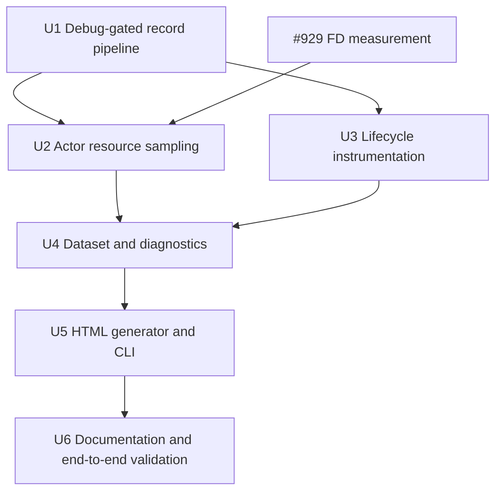

# feat: Add daemon run telemetry

## Summary

Add a debug-only supervised telemetry pipeline with an append-only versioned record stream, explicit lifecycle instrumentation, procfs-based actor sampling, and an offline generator that emits a self-contained interactive HTML dashboard.

---

## Problem Frame

Run analytics currently stop with the external operator-side sampler and cannot distinguish real ticket phases from gaps inferred after the fact. Aiur already owns the process roots, GitHub event exchange, workspace/session lifecycle, and pause/rework transitions needed to record those facts directly (see origin: `docs/brainstorms/2026-07-11-daemon-lifecycle-resource-telemetry-requirements.md`).

---

## Assumptions

*This plan was authored without synchronous user confirmation. The items below are agent inferences that fill gaps in the input — un-validated bets that should be reviewed before implementation proceeds.*

- Run the sampler every five seconds by default, with at most one procfs scan in flight; tests may override the cadence.
- Separate the writer from the sampler so procfs latency or failure cannot delay lifecycle persistence.
- Assign every persisted record a writer-local sequence within its daemon boot, in addition to its source timestamp and stable identity, so equal-timestamp events from independent producers reduce deterministically.
- Key process deltas by PID plus process start time, group agent roots by ticket metadata already held by the process reaper, and exclude ticket trees from daemon/operator aggregates to avoid double-counting.
- Begin a unique attempt identity at every dispatch and carry it through runner lifecycle records. Deduplicate only repeated boundaries for the same attempt/source identity.
- Define the ticket `prewarm` phase as the real warm-base materialization performed for that dispatched attempt. Existing, cold-fallback, disabled, and remote workspaces emit an explicit point outcome rather than inheriting an invented prewarm duration.
- Classify a review wakeup as pending for five minutes after a trusted comment and broken after that grace when no rework-start or agent-resume event appears. The generator exposes an override for analysis at other poll cadences.
- Render charts with inlined browser-native SVG/DOM code; add no external chart or font dependency.
- GitHub enrichment is optional and fail-open at generation time. The generated file never performs network requests.

---

## Requirements

- R1. Start the telemetry supervision subtree only when debug mode is enabled; debug-off runs create no process, timer, procfs scan, or telemetry file.
- R2. Persist an append-only, versioned NDJSON stream under the current session log root with wall time, boot identity, boot-local sequence, record identity, actor/ticket identity, and daemon restart boundaries.
- R3. Sample CPU, RSS, FD, and read/write I/O for the daemon and locally attributable ticket trees, plus best-effort operator attribution and explicit unavailable metadata for remote/indeterminate actors.
- R4. Record dispatch, prewarm, workspace setup, agent spinup, implementation, build/test, PR open, review pause, trusted comment, rework start, and agent pause/resume with causes and attempt identity.
- R5. Use explicit runtime transitions and sanitized internal GitHub events as lifecycle truth; preserve legitimate repeats without poll/replay duplicates.
- R6. Accept one or more telemetry files/session roots, merge them across restarts, tolerate partial/unknown/malformed records, and surface warnings without discarding valid data.
- R7. Optionally enrich observed tickets from GitHub at generation time to recover PR/comment/merge anchors absent from the selected telemetry inputs.
- R8. Produce an interactive per-actor resource timeline, per-ticket lifecycle chart, resource profile, and operational findings/notes.
- R9. Flag trusted review comments that are not followed by the expected rework/resume sequence after the configured grace, while distinguishing still-pending comments.
- R10. Emit one self-contained HTML file with all data, CSS, fonts, and JavaScript inlined and no view-time network or artifact-service dependency.
- R11. Preserve existing orchestrator ordering, tracker transitions, process-reaper safety, IssueLog behavior, live dashboard behavior, and log retention semantics.
- R12. Integrate #929's canonical FD-headroom measurement when available without duplicating its dispatch gate or control policy.

**Origin actors:** A1 (Aiur daemon), A2 (ticket agent), A3 (operator/orchestrator process), A4 (dashboard generator), A5 (operator/reviewer)

**Origin flows:** F1 (debug telemetry capture), F2 (review-to-rework lifecycle), F3 (offline dashboard generation)

**Origin acceptance examples:** AE1 (operator-independent debug capture), AE2 (multi-session restart merge), AE3 (explicit attribution limits), AE4 (ordered repeated lifecycle phases), AE5 (review wakeup diagnosis), AE6 (offline artifact), AE7 (debug-off and procfs failure safety)

---

## Scope Boundaries

- No adaptive resource controller, admission threshold, dispatch/build policy, or saturation-staggering behavior.
- No remote-host sampling transport; a local SSH proxy may be identified but must not be represented as remote resource consumption.
- No raw command text, comment body, prompt, environment, or other potentially sensitive content in the telemetry stream.
- No external database, hosted report service, required Claude artifact, or replacement for the live Phoenix dashboard.
- No general orchestrator refactor beyond narrow lifecycle call sites.
- No duplicate implementation of #929's FD-headroom API.

### Deferred to Follow-Up Work

- Remote worker resource telemetry requires a separate authenticated transport and clock-alignment design.
- Adaptive controller inputs and phase-aware staggering remain owned by their saturation tickets.

---

## Context & Research

### Relevant Code and Patterns

- `src/lib/aiur.ex` builds one OTP supervision tree for interactive and headless modes; optional children are already selected in `Aiur.Application.child_specs/1`.
- `src/lib/aiur/log_file.ex` resolves the session log root and applies config/flag debug state before supervised children start.
- `src/lib/aiur/process_reaper.ex` is the daemon-owned registry of live agent OS roots and already exposes non-mutating entries to `Aiur.AgentResourceGuard`.
- `src/lib/aiur/system_memory.ex` and `src/lib/aiur/system_load.ex` establish small, injectable, fail-open procfs readers.
- `src/lib/aiur/events/exchange.ex` provides in-process topic-pattern subscriptions; PR/comment publications are deduplicated and sanitized by `Aiur.Events.Publisher` and the GitHub pollers.
- `src/lib/aiur/orchestrator/dispatcher.ex`, `src/lib/aiur/agent_runner.ex`, `src/lib/aiur/agent_runner/session_lifecycle.ex`, `src/lib/aiur/orchestrator/human_review.ex`, `src/lib/aiur/orchestrator/comment_wake.ex`, and `src/lib/aiur/orchestrator/pause_resume.ex` own the explicit lifecycle transitions this feature needs.
- `src/lib/aiur/codex/transcript.ex` and `src/lib/aiur/claude/transcript.ex` normalize shell tool activity across backends without coupling callers to one raw protocol.
- `src/lib/aiur/logs/retention.ex` treats whole session directories as retention units, so a telemetry file under the current session root follows existing cleanup behavior.
- `src/lib/mix/tasks/*.ex` establishes OptionParser-based offline task conventions; `scripts/aiurdev` establishes executable wrapper conventions.

### Institutional Learnings

- `docs/measurements/2026-06-22-prewarm-run-findings.md` shows that external observation captured useful CPU/FD evidence but ended with the observer and lacked productive-ticket phase boundaries.
- `docs/brainstorms/2026-06-14-logging-observability-rework-requirements.md` requires debug artifacts to be persistent, greppable, session-scoped, and bounded by existing retention.
- `docs/plans/2026-07-11-003-refactor-orchestrator-dispatch-lifecycle-extraction-plan.md` makes the extracted owner modules—not the GenServer facade—the approved homes for new lifecycle behavior.
- No matching `docs/solutions/` entry exists.

### External References

- Linux kernel procfs documentation defines process directories, status/stat accounting, FD directories, and the precision limits of RSS sampling: https://docs.kernel.org/filesystems/proc.html
- Linux man-pages document `/proc/<pid>/stat`, `/proc/<pid>/status`, and `/proc/<pid>/io`: https://man7.org/linux/man-pages/man5/proc_pid_stat.5.html, https://man7.org/linux/man-pages/man5/proc_pid_status.5.html, https://man7.org/linux/man-pages/man5/proc_pid_io.5.html

---

## Key Technical Decisions

- **Dedicated debug-only subtree rather than extending `Aiur.Perf`:** perf lines remain useful human diagnostics, but a writer plus sampler provides ordering, schema versioning, restart identity, batching, and lifecycle/resource joins without parsing Logger text.
- **One record contract, multiple record kinds:** restart, lifecycle, resource, warning, and optional GitHub-anchor records share a small envelope so readers can skip unknown kinds or versions independently.
- **Two ordering coordinates:** producers stamp the source time and source identity; the writer adds a strictly increasing boot-local sequence. Reducers order by source time and use boot/sequence as the deterministic tie-break without pretending arrival order is causal across producers.
- **Writer and sampler are separate processes:** lifecycle casts stay cheap and ordered while sampling is non-overlapping and failure-isolated.
- **ProcessReaper metadata is the attribution source:** backends add ticket/backend/worker metadata at registration; the sampler performs no tracker polling and does not guess ticket identity from paths or command lines.
- **Tree aggregates are mutually exclusive:** ticket roots win attribution, daemon aggregates exclude ticket trees, and operator aggregates exclude both; this makes totals comparable without double-counting.
- **Explicit lifecycle hooks plus exchange subscription:** local runtime owners record phase boundaries; the writer subscribes to sanitized PR/comment topics for external anchors. General log parsing is not a primary source.
- **Operation identity preserves repeated phases:** build/test boundaries use backend tool-operation identity when available, and dispatch-derived attempt identity separates retries/restarts.
- **Per-ticket prewarm means materialization, not the shared background build:** a dispatched attempt records the actual local warm-base copy/checkout interval when it occurs, and records an honest point outcome for cold, existing, disabled, or remote workspace paths. Shared `RepoBase` preparation remains daemon context rather than being projected into tickets that may never dispatch.
- **Offline reducer before renderer:** input discovery, schema validation, restart merging, lifecycle interval derivation, statistics, and findings are tested independently of HTML presentation.
- **Generation-time GitHub enrichment:** optional GitHub calls produce ordinary normalized anchor records before rendering; failures become report warnings and never make report viewing network-dependent.

---

## Open Questions

### Resolved During Planning

- **Sampling cadence and overlap:** five-second default, one scan at a time, with missed ticks skipped rather than queued.
- **CPU and PID reuse:** calculate utilization from per-process tick deltas keyed by PID plus kernel start time; resolve clock ticks once per debug boot.
- **Lifecycle deduplication:** dedupe identical boundaries within one attempt/source identity, while unique tool IDs, GitHub event IDs, comments, pauses, and restarts remain distinct.
- **Mixed-schema behavior:** parse line-by-line, accept the supported version, skip unknown kinds, warn on unsupported versions/malformed lines, and keep all valid records.
- **Broken resume grace:** five minutes by default, configurable during generation; comments inside the grace render as pending, not broken.

### Deferred to Implementation

- **Exact #929 API name and return shape:** inspect the validated blocker ref and adopt its exported measurement rather than planning against a guessed signature.
- **Backend completion fidelity:** preserve exact start/end boundaries when a backend exposes them; where only a completed command is available, emit a point event and let the report label its duration unavailable rather than inventing one.
- **GitHub timeline pagination details:** settle against existing client helpers and fixture responses while keeping enrichment optional and injectable.

---

## Output Structure

    src/lib/aiur/run_telemetry.ex
    src/lib/aiur/run_telemetry/
      supervisor.ex
      writer.ex
      sampler.ex
      procfs.ex
      lifecycle.ex
      dataset.ex
      github_enricher.ex
      dashboard.ex
    src/lib/mix/tasks/aiur.telemetry.dashboard.ex
    scripts/aiur-telemetry-dashboard
    src/test/aiur/run_telemetry_test.exs
    src/test/aiur/run_telemetry/
      writer_test.exs
      sampler_test.exs
      procfs_test.exs
      lifecycle_test.exs
      dataset_test.exs
      dashboard_test.exs

This tree is a scope declaration, not a constraint; implementation may collapse files when a separation does not earn its carrying cost.

---

## High-Level Technical Design

> *This illustrates the intended approach and is directional guidance for review, not implementation specification. The implementing agent should treat it as context, not code to reproduce.*

```mermaid
flowchart TB
  Debug[Debug-enabled application boot] --> Sup[Run telemetry supervisor]
  Sup --> Writer[Append-only writer and event subscriber]
  Sup --> Sampler[Non-overlapping sampler]
  Reaper[ProcessReaper actor roots] --> Sampler
  Proc[/proc process snapshot] --> Sampler
  Owners[Dispatch, runner, review, rework, pause owners] --> Writer
  Exchange[Sanitized GitHub event exchange] --> Writer
  Sampler --> Writer
  Writer --> Stream[Versioned telemetry NDJSON]
  Stream --> Dataset[Offline merge and lifecycle reducer]
  GitHub[Optional generation-time GitHub anchors] --> Dataset
  Dataset --> HTML[Self-contained HTML dashboard]
```

Lifecycle intervals are derived from begin/end or phase-transition records. Unknown duration stays unknown; no reducer path converts missing evidence into a zero-length successful phase.

---

## Implementation Units



### U1. Establish the debug-gated record pipeline

**Goal:** Add a failure-isolated supervised writer boundary and the stable append-only record envelope, while proving that debug-off runs have no telemetry child or file behavior. U2 adds the sampler behind that boundary.

**Requirements:** R1, R2, R6, R11; F1; AE1, AE2, AE7

**Dependencies:** None

**Files:**
- Create: `src/lib/aiur/run_telemetry.ex`
- Create: `src/lib/aiur/run_telemetry/supervisor.ex`
- Create: `src/lib/aiur/run_telemetry/writer.ex`
- Modify: `src/lib/aiur.ex`
- Modify: `src/lib/aiur/log_file.ex`
- Test: `src/test/aiur/run_telemetry_test.exs`
- Test: `src/test/aiur/run_telemetry/writer_test.exs`
- Test: `src/test/aiur/application_test.exs`
- Test: `src/test/aiur/log_file_test.exs`

**Approach:**
- Resolve debug state once after config-level debug is applied and conditionally add the telemetry subtree in both interactive and headless run shapes.
- Insert the subtree immediately after `Aiur.Events.Exchange` and before `Aiur.Events.Publisher` and later lifecycle producers. `ProcessReaper` and `RepoBase` are already available at that point, while the writer can install all Exchange bindings before the first publisher poll.
- Derive the telemetry path from the configured session log file/root so explicit `--logs-root`, default session roots, and retention remain aligned.
- Give every record a common envelope, assign its strictly increasing boot-local sequence in the writer, and append complete JSON lines; batch multiple resource records into one write without changing their logical one-record-per-line shape.
- Record a daemon restart boundary during writer initialization, including whether the target file already contained prior records.
- Keep the public recording facade best-effort when the subtree is absent or restarting; telemetry failure must never crash dispatch, a runner, or the daemon.

**Execution note:** Define the record-envelope and debug-gating tests before adding lifecycle or procfs producers.

**Patterns to follow:**
- Optional child selection in `Aiur.Application.child_specs/1`.
- Session-root resolution and fail-safe boot handling in `Aiur.LogFile`.
- Append-only structured writing and JSON-safe conversion in `Aiur.AgentEventLog`.

**Test scenarios:**
- Covers AE1 / AE7. Debug false produces no telemetry child spec and invoking the facade creates no file.
- Covers AE1. Debug true starts the subtree in both interactive and headless child lists.
- Ordering: the telemetry subtree follows `Aiur.Events.Exchange` and precedes `Aiur.Events.Publisher`, so subscription succeeds during writer init and captures the first poll.
- Happy path: the writer creates the parent directory and appends valid envelope-bearing records in call order.
- Covers AE2. Starting a writer on an existing file appends a new restart boundary without truncating earlier records.
- Error path: an unwritable path or encoding failure is logged/fail-open and does not terminate the caller or supervision tree.
- Edge case: concurrent producer casts remain whole newline-delimited records with unique record identities and monotonic boot-local sequences.

**Verification:**
- A debug-off child list contains no telemetry module; a debug-on writer produces a parseable append-only stream rooted beside `aiur.log`.

### U2. Sample mutually exclusive actor process trees

**Goal:** Attribute local process trees to daemon, tickets, and best-effort operator actors and emit CPU/RSS/FD/I/O samples without subprocess-per-sample overhead or overlapping scans.

**Requirements:** R1–R3, R11, R12; A1–A3; F1; AE1, AE3, AE7

**Dependencies:** U1; final FD-headroom field depends on the validated #929 branch

**Files:**
- Create: `src/lib/aiur/run_telemetry/sampler.ex`
- Create: `src/lib/aiur/run_telemetry/procfs.ex`
- Modify: `src/lib/aiur/process_reaper.ex`
- Modify: `src/lib/aiur/codex/coding_agent.ex`
- Modify: `src/lib/aiur/claude/coding_agent.ex`
- Modify: `src/lib/aiur/claude/repl/launcher.ex`
- Modify: `packaging/npm/aiur-cli/libexec/aiur-engine.sh`
- Test: `src/test/aiur/run_telemetry/sampler_test.exs`
- Test: `src/test/aiur/run_telemetry/procfs_test.exs`
- Test: `src/test/aiur/process_reaper_test.exs`
- Test: affected backend session/launcher tests

**Approach:**
- Add non-sensitive ticket/backend/worker attribution metadata to agent root registrations; keep existing PID-reuse kill guards unchanged.
- Have the launcher expose its initiating parent PID as a best-effort operator root, while treating missing/dead/unrelated roots as unavailable.
- Read the process directory once per interval to build parent relationships, then read detailed status/I/O/FD data only for claimed actor trees.
- Assign ticket trees first, daemon descendants second, and operator descendants last; remove already-claimed processes at each step.
- Compute CPU and I/O rates from prior snapshots, skip overlapping ticks, and record partial-field warnings rather than aborting a sample.
- Consume #929's actual exported FD-headroom measurement after its validated push; per-process FD counts remain this unit's distinct responsibility.

**Execution note:** Implement procfs parsing and aggregation test-first from fixed fixtures before reading the live host.

**Patterns to follow:**
- Injectable fail-open readers in `Aiur.SystemMemory` and `Aiur.SystemLoad`.
- Read-only registry consumption in `Aiur.AgentResourceGuard`.
- PID-reuse safety in `Aiur.ProcessReaper`.

**Test scenarios:**
- Happy path: a daemon tree and two ticket roots produce three non-overlapping aggregates with CPU, RSS, FD, read, and write values.
- Covers AE3. A remote ticket or missing operator root is represented as unavailable and is never reported as measured zero usage.
- Edge case: overlapping/duplicate roots for one ticket are unioned once; ticket descendants are excluded from daemon and operator totals.
- Edge case: a PID reused with a different start time has no inherited CPU/I/O delta.
- Error path: a process disappearing between directory discovery and file reads contributes a warning/count but the remaining actor sample persists.
- Error path: missing procfs produces an availability record and continues scheduling without crashing.
- Covers AE7. A slow scan causes the next tick to be skipped, not queued concurrently.
- Integration: backend registration metadata reaches ProcessReaper entries without changing reap behavior.
- Integration: #929 headroom fields appear when its provider is available and remain explicitly unavailable otherwise.

**Verification:**
- Fixture aggregates reconcile exactly without double-counting; one live module-only sample returns safely on the current host; existing reaper/backend tests remain unchanged in behavior.

### U3. Record explicit ticket lifecycle transitions

**Goal:** Persist real phase, external-anchor, pause/resume, and attempt events from their owning runtime modules without parsing general logs or recording sensitive content.

**Requirements:** R2, R4, R5, R11; F1, F2; AE4, AE5

**Dependencies:** U1

**Files:**
- Create: `src/lib/aiur/run_telemetry/lifecycle.ex`
- Modify: `src/lib/aiur/run_telemetry/writer.ex`
- Modify: `src/lib/aiur/orchestrator/dispatcher.ex`
- Modify: `src/lib/aiur/agent_runner.ex`
- Modify: `src/lib/aiur/workspace.ex`
- Modify: `src/lib/aiur/workspace/provisioner.ex`
- Modify: `src/lib/aiur/agent_runner/session_lifecycle.ex`
- Modify: `src/lib/aiur/agent_runner/turn_loop.ex`
- Modify: `src/lib/aiur/agent_runner/message_handler.ex`
- Modify: `src/lib/aiur/orchestrator/human_review.ex`
- Modify: `src/lib/aiur/orchestrator/comment_wake.ex`
- Modify: `src/lib/aiur/orchestrator/pause_resume.ex`
- Test: `src/test/aiur/run_telemetry/lifecycle_test.exs`
- Test: affected dispatcher, runner lifecycle, human review, comment wake, and pause/resume tests

**Approach:**
- Generate an attempt identity before task spawn, store it with the running entry, and pass it through worker/session options so asynchronous producers share one correlation key.
- Record dispatch in dispatcher ownership. Thread the attempt context into `Workspace`, record workspace setup around provisioning/hooks, and use the existing `ensure_workspace` outcome to record a nested prewarm materialization interval only for `:materialized`; cold fallback, existing, disabled, and remote paths record explicit point outcomes. Record spinup around session creation and implementation at each turn start.
- Observe raw normalized backend notifications in `MessageHandler` before transcript extraction: correlate Codex `item/started` / `item/completed` by item ID and Claude `tool_call` / `tool_result` by call/result ID. Inspect command text only long enough to classify build/test activity, then persist only operation ID, command class, timing, and outcome; a completion without a matching start remains an honest point event.
- Subscribe the writer to sanitized PR-opened, PR-merged, issue-comment, and review-comment topics. Before dropping comment bodies, reuse `CommentWake.trusted_comment_event?/1` and `CommentWake.benign_review_pass_comment?/1`; only wake-eligible comments become diagnostic lifecycle anchors. Retain only whitelisted anchor identifiers, actor, trust classification, and source timestamps.
- Record review pause only after human-review readiness is accepted, rework start only after the tracker transition succeeds, and pause/resume in the owning state-transition path with the actual cause.
- Dedupe replayed phase boundaries by attempt/source identity while preserving unique operations and external event IDs.

**Execution note:** Add characterization assertions around existing transition order before inserting telemetry calls into orchestrator owners.

**Patterns to follow:**
- Synchronous owner-module transitions from the recent orchestrator extraction plans.
- Backend-normalized transcript/tool boundaries in `Aiur.Codex.Transcript` and `Aiur.Claude.Transcript`.
- Exchange subscription and Publisher dedup semantics in `Aiur.Events.Exchange` / `Aiur.Events.Publisher`.

**Test scenarios:**
- Covers AE4. One dispatch through warm-base reuse, setup, spinup, turn start, build/test operation, and return to implementation yields ordered boundaries once.
- Prewarm semantics: a materialized local workspace records the measured copy/checkout interval under the dispatch attempt; existing, cold, disabled, and remote cases produce their explicit point outcome and never a fabricated interval.
- Edge case: a second build/test operation in the same attempt remains a distinct interval; replaying the same tool/exchange event does not duplicate it.
- Backend parity: Codex start/completion IDs and Claude call/result IDs close equivalent build/test operations; orphan completions remain point events with unavailable duration.
- Error path: failed workspace setup or session spinup emits a failed boundary with reason class but no sensitive output.
- Integration: PR-opened and comment exchange events become lifecycle anchors with source timestamps and IDs.
- Covers AE5. Accepted human review records review pause; a trusted comment followed by successful rework transition and resume records all three in order.
- Comment eligibility: untrusted comments and trusted benign review-pass comments do not create diagnostic comment anchors; the raw body is never persisted.
- Error path: a failed tracker transition records comment receipt but no false rework-start event.
- Edge case: duplicate worker pause confirmation is a no-op; operator, label, blocker, duration, and containment pauses retain distinct causes.
- Integration: telemetry disabled leaves existing transition return values, ordering, and dashboard notifications unchanged.

**Verification:**
- Every required lifecycle name has an explicit producer and focused test; no producer writes raw prompts, commands, output, or comment bodies.

### U4. Reduce mixed telemetry into report data and findings

**Goal:** Discover and merge input streams, validate record versions, derive lifecycle intervals and resource statistics, and diagnose missing pause-to-resume sequences independently of HTML.

**Requirements:** R2, R6, R8, R9; F2, F3; AE2–AE5

**Dependencies:** U2, U3

**Files:**
- Create: `src/lib/aiur/run_telemetry/dataset.ex`
- Test: `src/test/aiur/run_telemetry/dataset_test.exs`
- Add fixtures: `src/test/fixtures/run_telemetry/`

**Approach:**
- Accept files and directories, recursively discover canonical telemetry filenames, and stable-sort by source timestamp, boot identity, boot-local sequence, then record identity.
- Parse each line independently; collect malformed-line, unsupported-version, missing-field, restart-gap, and attribution warnings alongside valid records.
- Partition resource series by actor and boot, compute count/min/mean/median/p95/max and observed data gaps, and preserve unavailable values.
- Build ticket intervals from attempt-aware lifecycle boundaries. Represent point-only and open-ended phases honestly rather than assigning invented durations.
- Diagnose each trusted comment inside an active review pause as resolved, pending, or broken according to rework/resume evidence and the configured grace.
- Normalize optional GitHub anchors into the same reducer input before interval derivation.

**Execution note:** Build the reducer from deterministic multi-session fixtures before implementing the renderer.

**Patterns to follow:**
- Tolerant line-by-line structured log handling in `Aiur.AgentLog` and `Aiur.AlertFeed`.
- Stable timestamp parsing used by GitHub comment pollers.

**Test scenarios:**
- Covers AE2. Two boot streams merge into one timeline with a restart marker and independent rate baselines.
- Covers AE3. Unavailable actors/fields remain absent from statistics and render metadata, not zero-valued samples.
- Covers AE4. Repeated implementation/build phases across attempts produce separate ordered intervals.
- Covers AE5. Comment followed by rework/resume inside grace is resolved; no transition after grace is broken; no transition before grace is pending.
- Eligibility: untrusted and benign review-pass comments cannot open pending/broken diagnostics, including when optional GitHub enrichment supplies them.
- Edge case: merge, another review pause, or end-of-input closes the diagnostic observation window predictably.
- Error path: malformed lines, unknown kinds, and unsupported versions produce warnings while adjacent supported records remain in the dataset.
- Edge case: identical timestamps use boot-local sequence and record identity for deterministic output without merging distinct events.

**Verification:**
- Fixture-derived statistics, phase intervals, restart boundaries, warnings, and findings are deterministic and renderer-independent.

### U5. Generate the self-contained interactive dashboard

**Goal:** Add the offline CLI/script, optional GitHub enrichment, and inlined HTML presentation for resource, lifecycle, profile, and finding views.

**Requirements:** R6–R10; A4, A5; F3; AE2, AE5, AE6

**Dependencies:** U4

**Files:**
- Create: `src/lib/aiur/run_telemetry/github_enricher.ex`
- Create: `src/lib/aiur/run_telemetry/dashboard.ex`
- Create: `src/lib/mix/tasks/aiur.telemetry.dashboard.ex`
- Create: `scripts/aiur-telemetry-dashboard`
- Test: `src/test/aiur/run_telemetry/dashboard_test.exs`
- Test: `src/test/aiur/run_telemetry/github_enricher_test.exs`
- Test: `src/test/aiur/run_telemetry_task_test.exs`

**Approach:**
- Provide repeated input arguments, an output path, optional repository enrichment, and resume-grace control; keep defaults useful for `~/.aiur/logs` without starting the Aiur application.
- Query GitHub only during generation and normalize PR open/merge/comment anchors through an injectable adapter and the same trust/benign-comment rules as runtime capture; report unavailable auth/network as warnings and never serialize credentials or raw comment bodies.
- Inline the reduced dataset as safely escaped JSON and render all source-derived text through text-safe DOM operations.
- Order the report around operator triage: provenance/time range/restart and warning summary first, review-wakeup findings second, actor resource timeline third, ticket lifecycle timeline fourth, then resource profiles and operational notes.
- Draw metric-selectable actor series as compact SVG paths and zoom/filterable ticket phase rows with native SVG/DOM code. Keep large charts in responsive horizontal viewports rather than shrinking labels into illegibility; wrap controls and make tables scroll safely on narrow screens.
- Use native buttons, selects, checkboxes, and focusable detail targets; expose every hover detail on keyboard focus, provide visible focus and zoom reset, announce filter-result counts, honor reduced-motion preferences, and pair every status color with text/shape so color is never the only signal.
- Render explicit complete, empty, partial/unavailable, malformed-input-warning, and enrichment-error states. The inline dataset has no loading state or view-time retry because the artifact performs no network request.
- Include accessible source tables and summaries for both charts so every value and finding remains inspectable without pointer interaction or SVG interpretation.
- Show restart/gap/unavailable markers, per-actor profile statistics, resolved/pending/broken review wakeups, and input/parser warnings.
- Assert the output contains no external script, stylesheet, font, image, or fetch dependency.

**Execution note:** Implement the static artifact contract and HTML safety tests before visual polish.

**Patterns to follow:**
- OptionParser and no-app-start behavior in existing Mix tasks.
- Executable script conventions in `scripts/`.
- Existing Aiur dashboard color/status vocabulary where it improves familiarity, without importing Phoenix runtime assets.

**Test scenarios:**
- Covers AE6. A generated file contains all CSS, JavaScript, and serialized data and has no external resource/fetch references.
- Happy path: actor metric controls, ticket filters, lifecycle tooltips/details, profile tables, and finding cards are present for a complete fixture.
- Interaction states: keyboard focus exposes the same details as hover; filter-empty, partial/unavailable, parser-warning, and enrichment-error fixtures render distinct labelled states; status meaning remains clear with color removed.
- Responsive/accessibility: controls retain native semantics, focus order follows report order, narrow layouts preserve readable chart/table access, and reduced-motion mode introduces no required animation.
- Covers AE5. Broken, pending, and resolved wakeups have distinct accessible labels and evidence timestamps.
- Edge case: quotes, angle brackets, and closing-script text in source metadata cannot escape the inline data block or create markup.
- Error path: GitHub auth/network failure still writes a report with a visible enrichment warning.
- Covers AE2. Repeated input directories discover and deduplicate the same telemetry file.
- CLI edge cases: missing inputs, unwritable output, invalid grace, and `--help` return clear non-zero/help outcomes without starting application supervision.

**Verification:**
- The generated artifact opens directly, renders all four required views from fixtures, remains functional offline, and passes structural, accessibility-state, and XSS-safety assertions.

### U6. Document and validate the operator workflow

**Goal:** Document capture/generation paths and run the scoped delivery gate, including the strongest permitted end-to-end evidence in an agent workspace.

**Requirements:** R1–R12; AE1–AE7

**Dependencies:** U5 and real #929 integration

**Files:**
- Modify: `src/README.md`
- Modify: `AGENTS.md` only if the operator workflow needs a durable runbook addition
- Test: all files named by U1–U5 plus directly related application/orchestrator/backend tests

**Approach:**
- Document the debug-only telemetry location, record/version compatibility, multi-session input usage, optional GitHub enrichment, output path, and offline viewing guarantee.
- Generate a fixture-backed report through the actual script and inspect its structure/content as a user-visible artifact.
- Exercise writer/sampler/lifecycle integration under focused supervision with a temporary session root and deterministic procfs/event inputs.
- Run compile-with-warnings, formatting, and affected tests with the repository's four-case cap.
- Respect the agent-workspace guard: do not bypass a blocked `scripts/aiurdev --test` run. Record operator-root TUI/manual capture as an explicit remaining validation when the guard applies.

**Patterns to follow:**
- Logging/observability documentation in `src/README.md` and `docs/brainstorms/2026-06-14-logging-observability-rework-requirements.md`.
- Manual CLI rules in `AGENTS.md`.

**Test scenarios:**
- Integration: one focused supervised debug run writes restart, lifecycle, and resource records that the real generator consumes into a valid HTML file.
- Covers AE1 / AE7. The equivalent non-debug supervision shape creates no telemetry process or artifact.
- Covers AE6. The generated artifact's required views and inline data are observable without a server.

**Verification:**
- Scoped compile, format, and affected tests pass; the real generator produces the canonical HTML; any operator-root manual TUI verification remains clearly documented rather than substituted with logs or HTTP calls.

---

## System-Wide Impact

- **Interaction graph:** application boot gates the subtree; ProcessReaper supplies attribution; dispatcher/runner/orchestrator owners emit lifecycle boundaries; Exchange supplies GitHub anchors; the offline task consumes only files and optional GitHub responses.
- **Error propagation:** every runtime telemetry boundary fails open and logs warnings; generator input/output errors are explicit CLI failures, while per-line/enrichment errors become report warnings.
- **State lifecycle risks:** attempt correlation, phase deduplication, sampler overlap, process exit/reuse, daemon restart, and partial trailing records are all covered by stable identities and fixture tests.
- **API surface parity:** interactive and headless debug runs both capture; Codex, Claude app-server, and Claude REPL registrations/tool signals receive equivalent attribution/lifecycle treatment.
- **Integration coverage:** application-child gating, backend registration metadata, exchange-to-writer anchors, multi-session reduction, and script-to-HTML generation require cross-layer tests in addition to unit parsers.
- **Unchanged invariants:** process reap/kill semantics, tracker label mutations, pause-clock ordering, Publisher contamination/dedup, live dashboard notifications, IssueLog writes, and retention units do not change.

---

## Alternative Approaches Considered

- **Parse `aiur.log` and workspace logs offline:** rejected because missing log lines cannot distinguish absent work from a failed lifecycle signal, resource samples do not exist there, and Logger formatting is not a stable analytics contract.
- **Fold everything into `Aiur.Perf`:** rejected because PubSub/Logger lines lack durable schema/restart/attempt semantics and would couple the generator to text parsing; existing perf behavior remains unchanged.
- **Keep an external sampler but launch it from the wrapper:** rejected because its lifetime still follows shell/tmux ownership and it cannot observe authoritative internal lifecycle transitions.
- **Add a database or hosted dashboard:** rejected as unnecessary carrying cost and contrary to the canonical self-contained artifact requirement.

---

## Risk Analysis & Mitigation

| Risk | Likelihood | Impact | Mitigation |
|------|------------|--------|------------|
| Procfs scanning adds load at saturation | Medium | Medium | Debug-only child, five-second cadence, one scan in flight, one PID discovery pass, detailed reads only for claimed trees, benchmark/sample-duration fields. |
| Actor trees overlap or PIDs are reused | Medium | High | Attribution priority/exclusion sets and PID-plus-start-time delta keys; fixture coverage for overlap/reuse. |
| Lifecycle casts reorder across orchestrator and runner processes | Medium | High | Dispatch-generated attempt identity, source timestamps/IDs, writer-assigned boot-local sequence, deterministic reducer ordering, and explicit point/open intervals when boundaries are unavailable. |
| Telemetry write failure affects orchestration | Low | High | Dedicated supervised writer, best-effort facade, no synchronous file call in hot owners, and fail-open tests. |
| Raw GitHub/tool data leaks into report | Low | High | Store only whitelisted identifiers/classes/timestamps; safety tests with hostile strings; text-safe DOM rendering. |
| GitHub replay or restart duplicates anchors | Medium | Medium | Reuse Publisher source IDs/dedup, record source identity, and reducer idempotency. |
| Benign or untrusted comments look like failed wakeups | Medium | High | Apply the orchestrator's wake-eligibility predicate before body disposal and repeat the same classification during optional enrichment. |
| #929 API differs from assumptions | High until push | Medium | Native blocker dependency, inspect validated ref, stack on its real branch, and keep only the integration point pending. |
| HTML works structurally but has poor interaction/accessibility | Medium | Medium | Accessible tables/labels as baseline, fixture-backed interaction hooks, and browser/static inspection before review. |
| Agent workspace cannot run canonical manual TUI test | High | Medium | Do not bypass guard; complete focused integration and report operator-root verification explicitly. |

---

## Dependencies / Prerequisites

- #926 is merged and supplies current memory/procfs conventions.
- #929 is a declared blocker for its canonical FD-headroom measurement; independent work proceeds before integration.
- The generator expects Elixir dependencies already used by the repository and a browser capable of ordinary inline SVG/JavaScript; it requires no web service.

---

## Documentation / Operational Notes

- Telemetry is diagnostic and follows `--debug`; `--test`/`--test3` inherit it because they already imply debug.
- The canonical filename lives inside each session's `log/` directory and is removed only when the existing session-retention policy removes that session.
- Reports should list every input path, schema version, time range, restart boundary, and warning so screenshots remain auditable.
- Debug-off overhead should be verified by child absence, not inferred from an empty file.

---

## Sources & References

- **Origin document:** `docs/brainstorms/2026-07-11-daemon-lifecycle-resource-telemetry-requirements.md`
- Related measurement: `docs/measurements/2026-06-22-prewarm-run-findings.md`
- Logging contract: `docs/brainstorms/2026-06-14-logging-observability-rework-requirements.md`
- Orchestrator ownership: `docs/plans/2026-07-11-003-refactor-orchestrator-dispatch-lifecycle-extraction-plan.md`
- Related issues: #926, #929, #930, #931
- Linux procfs documentation: https://docs.kernel.org/filesystems/proc.html
- Linux process accounting manuals: https://man7.org/linux/man-pages/man5/proc_pid_stat.5.html, https://man7.org/linux/man-pages/man5/proc_pid_status.5.html, https://man7.org/linux/man-pages/man5/proc_pid_io.5.html
