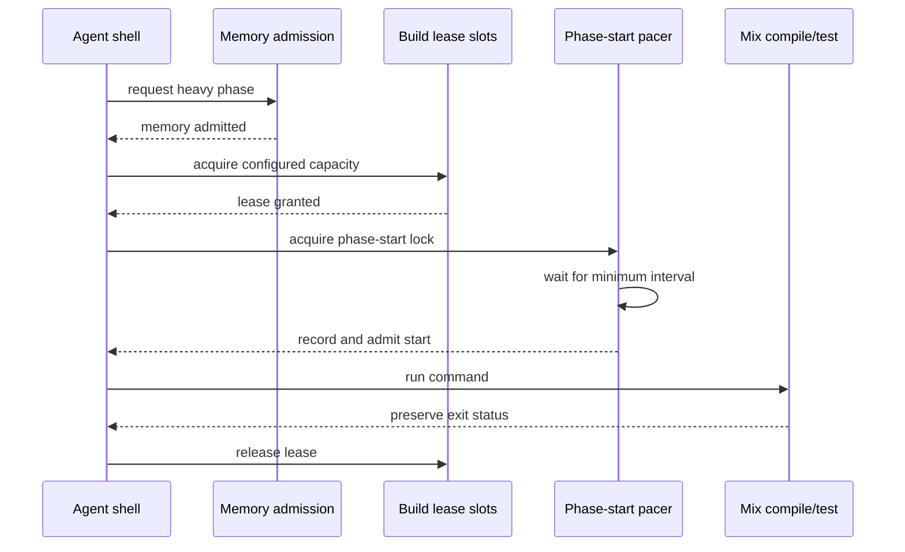

# feat: Stagger fleet Mix phase starts

## Summary

Pace the starts of agent-launched `mix compile` and `mix test` commands across local workspaces at their actual heavy-phase boundary, while retaining overlapping execution, the existing build-cap and memory gates, and the adaptive dispatch controller's authority over agent count.

---

## Problem Frame

Fleet profiling found a mean load of 5.3 but a peak of 18.8 on a 12-core host because several independently progressing agents tend to enter compile and test work together. The earlier dispatch-batching proposal in #861 was rejected after a live spike showed that steady-state agent verification, rather than initial agent startup, creates the load ceiling. The current fleet build gate caps simultaneous Mix work but can still grant multiple free slots at the same instant, preserving a smaller synchronized burst.

---

## Assumptions

*This plan was authored without synchronous user confirmation. The items below are agent inferences that fill gaps in the input -- un-validated bets that should be reviewed before implementation proceeds.*

- "Phase-aware" means admitting work at the observable `mix compile` / `mix test` command boundary, not inferring heavy work from broad agent-authored brainstorm, plan, work, or review alerts.
- The portable built-in default remains zero until measurement establishes a safe cross-repository value; this repository's dogfood workflow enables a provisional five-second interval for the required comparison.
- A one-slot build cap needs no additional staggering because it already prevents simultaneous heavy starts; unlimited or multi-slot configurations retain start pacing.
- The acceptance soak must be run from the operator repository root because ticket workspaces are prohibited from launching the real dogfood `--test` harness.

---

## Requirements

- R1. Agent-launched `mix compile` and `mix test` starts across local workspaces are separated by a configurable minimum interval when more than one command may run concurrently.
- R2. Staggering applies at the actual heavy command boundary while ordinary shell work, agent startup, and already-running Mix commands remain unaffected.
- R3. The existing memory floor is checked before a build claims capacity, the build-slot cap remains authoritative, and pacing happens immediately before the admitted command starts.
- R4. `agent.build_start_stagger_seconds` accepts a non-negative whole-second interval; zero disables pacing, a single build slot avoids redundant delay, and configuration plus shell-environment plumbing are validated and documented.
- R5. A process crash, malformed pacing record, unavailable clock sample, or timeout cannot permanently strand the fleet phase-start lock or a build lease.
- R6. Focused integration coverage proves concurrent commands start apart but still overlap, demonstrating de-synchronization without silently serializing throughput.
- R7. Three matched multi-agent runs per variant show at least a 10% lower median peak load while median completion time regresses no more than 10%, and a stable stagger-hold diagnostic makes the comparison attributable.
- R8. The change remains orthogonal to current and future multi-resource dispatch control: it does not raise effective concurrency, bypass dispatch admission, or reserve future work before resource gates pass.

---

## Scope Boundaries

- Do not reintroduce fixed-delay or batch-based agent dispatch from #861.
- Do not infer build activity from agent-authored phase events or require agents to emit a new event correctly before verification.
- Do not change the set of recognized Mix tasks, intercept arbitrary build tools, or extend the local Bash hook to SSH workers.
- Do not implement the CPU/memory/FD closed-loop controller from #927 or daemon telemetry/dashboard work from #930.
- Do not claim the operator-root saturation comparison from deterministic shell tests alone.

### Deferred to Follow-Up Work

- Multi-resource adaptive saturation and dynamic tuning remain in #927 after memory, FD, and telemetry foundations land.
- Durable per-ticket resource and lifecycle measurement remains in #930; its generator may consume the stable phase-stagger diagnostics added here.

---

## Context & Research

### Relevant Code and Patterns

- `src/lib/aiur/build_gate.ex` is the canonical configuration-to-shell environment seam for host-local Mix admission.
- `src/priv/build_gate.bash` already performs memory admission, atomic numbered lease acquisition, stale-owner recovery, timeout accounting, and exact Mix exit-status propagation.
- `src/lib/aiur/agent_environment.ex` injects the packaged hook consistently into local Codex and Claude agent processes.
- `src/test/aiur/build_gate_test.exs` uses fake Mix/mise executables to prove cross-shell contention and memory hold/recovery without imposing synthetic host load.
- `src/lib/aiur/orchestrator/dispatch_policy.ex` and `src/lib/aiur/orchestrator/dispatcher.ex` own the independent adaptive load envelope and hard resource admission for new agents.

### Institutional Learnings

- `docs/plans/2026-07-09-001-refactor-fleet-mix-build-gate-plan.md` establishes that heavy-command admission must be host-local, crash-recoverable, visible, and independent of the Aiur BEAM lifetime.
- `docs/plans/2026-07-11-005-feat-memory-admission-gate-plan.md` establishes memory-before-lease ordering and deliberately keeps build admission independent from dispatch-controller state.
- Issue #861's spike establishes that delaying agent startup cannot solve recurring steady-state compile/test synchronization.

### External References

- No external research is needed. The relevant concurrency, configuration, and operational contracts are repository-specific and already have direct local patterns.

---

## Key Technical Decisions

- **Pace command starts inside the existing Bash build gate:** This observes the real heavy-phase boundary for every supported local backend without relying on prompt compliance or broad lifecycle guesses.
- **Use a crash-recoverable phase-start lock plus a shared last-start record:** One contender computes and waits for the remaining interval at a time, preventing simultaneous observations from admitting a new burst.
- **Apply pacing after memory and build-slot admission:** Low-memory or over-cap commands do not reserve a future start, while an admitted command holds its lease for only the remaining stagger interval before execution.
- **Use whole seconds and a portable epoch clock:** The operational interval is several seconds, so portable shell behavior and deterministic records are more valuable than sub-second precision.
- **Make the interval independently configurable and dogfood it before defaulting it on:** Zero preserves portable behavior, the checked-in workflow supplies the provisional interval under measurement, and controller work can tune this orthogonal pacing layer without changing dispatch semantics.
- **Skip redundant pacing at capacity one:** Full serialization already prevents a compile/test start storm; adding an idle gap would lower throughput without reducing the peak further.

---

## Open Questions

### Resolved During Planning

- **Should starts be delayed in the orchestrator or at build entry?** At build entry. #861 showed dispatch timing is not the steady-state bottleneck, while the packaged Mix hook observes the exact costly boundary.
- **Should pacing replace the build cap or memory floor?** No. It composes after both admission layers and changes only when an admitted command begins.
- **Should a future multi-resource controller own this implementation?** No. The controller regulates fleet admission; start pacing is a separate actuator that smooths bursts within admitted capacity.

### Deferred to Implementation

- **Exact helper names and shell record names:** Choose them while keeping the existing lease metadata layout and diagnostic vocabulary coherent.
- **Whether a non-zero portable default is justified:** Keep zero in this PR unless the matched dogfood comparison demonstrates a hardware-independent value; the checked-in workflow can retain its measured host-specific interval.

---

## High-Level Technical Design

> *This illustrates the intended approach and is directional guidance for review, not implementation specification. The implementing agent should treat it as context, not code to reproduce.*

---

## Implementation Units

### U1. Add the phase-stagger configuration contract

**Goal:** Expose a validated operator interval and inject it through the existing local build-gate environment without changing dispatch-controller state.

**Requirements:** R1, R2, R4, R8

**Dependencies:** None

**Files:**
- Modify: `src/lib/aiur/config/schema/agent.ex`
- Modify: `src/lib/aiur/config.ex`
- Modify: `src/lib/aiur/build_gate.ex`
- Modify: `src/test/support/test_support.exs`
- Test: `src/test/aiur/workspace_and_config_test.exs`
- Test: `src/test/aiur/build_gate_test.exs`
- Test: `src/test/aiur/agent_environment_test.exs`

**Approach:** Add `agent.build_start_stagger_seconds` as a non-negative interval with a zero portable default. Include it in hook enablement and shell environment derivation so an explicit interval can remain active independently of build capacity or memory admission. Keep the setting out of orchestrator state and adaptive concurrency calculations.

**Patterns to follow:** `agent.max_concurrent_builds`, `agent.min_free_memory_mb`, `Aiur.Config.max_concurrent_builds/0`, and `Aiur.BuildGate.shell_env/1`.

**Test scenarios:**
- Happy path: omitted configuration resolves to zero while the checked-in dogfood override reaches the local agent shell environment.
- Configuration: an explicit positive interval round-trips and explicit zero disables only phase pacing.
- Error path: negative and non-integer values fail schema validation with the field path visible.
- Integration: phase-only mode still installs the hook when build slots are unlimited and no memory floor is configured.
- Edge case: all three admission features disabled returns the pre-existing empty shell environment.

**Verification:** Runtime configuration and child environments expose one stable interval without adding fields or branches to dispatch policy.

### U2. Pace actual Mix phase starts durably

**Goal:** Ensure independently admitted compile/test commands cannot begin together while preserving overlap, timeout behavior, and crash recovery.

**Requirements:** R1, R2, R3, R5, R6, R8

**Dependencies:** U1

**Files:**
- Modify: `src/priv/build_gate.bash`
- Test: `src/test/aiur/build_gate_test.exs`

**Approach:** Extend the host-local metadata directory with an atomically acquired phase-start lock and a last-start timestamp. After memory and lease admission, a contender waits only for the remaining configured interval, records its phase start, releases the pacing lock, and runs Mix. Keep the existing queue record until capacity is claimed and represent a paced multi-slot waiter through its live lease, so current status and a future controller can observe pending demand instead of mistaking paced work for idle headroom. Reuse owner-PID recovery and the existing overall deadline. A deadline exhaustion releases all owned metadata and returns the established timeout; an unavailable clock or non-timeout coordination error logs once and fails open to the already lease-bounded command. Skip the wait when pacing is disabled or capacity one already serializes commands.

**Execution note:** Start with a concurrent fake-Mix integration test that observes command start/end ordering before changing the shell hook.

**Patterns to follow:** Existing numbered lease acquisition, owner records, stale-owner reclamation, queue cleanup, and fake Mix integration coverage in `src/priv/build_gate.bash` and `src/test/aiur/build_gate_test.exs`.

**Test scenarios:**
- Happy path: with two slots, two commands launched together start at least one configured interval apart.
- Throughput: the second command starts before the first ends, proving pacing offsets starts without reducing the fleet to serial execution.
- Task coverage: both direct Mix and documented mise-wrapped compile/test paths use pacing; non-heavy Mix tasks remain untouched.
- Composition: a command below the memory floor does not reserve a phase start, and after recovery it proceeds through lease then pacing admission.
- Edge case: capacity one skips a redundant delay; capacity zero still uses pacing when configured.
- Recovery: a dead phase-lock owner is reclaimed, and a malformed/missing last-start record or unavailable clock sample logs once and starts through the existing lease instead of orphaning capacity.
- Error path: a pacing wait that exhausts the existing deadline returns the established timeout status, does not run Mix, and removes its lease/lock metadata.
- Observability: a delayed start emits one stable diagnostic with phase and remaining wait; an immediate start does not generate hold spam.
- Controller compatibility: status reports a paced multi-slot waiter as live capacity, while phase-only pacing retains its queue metadata until the command starts for future consumers.

**Verification:** Focused shell tests show ordered-but-overlapping start/end events, clean metadata after success/failure, and unchanged command exit statuses.

### U3. Document and measure the operational contract

**Goal:** Make pacing, tuning, diagnostics, controller interaction, and the required peak/throughput comparison discoverable to operators.

**Requirements:** R4, R7, R8

**Dependencies:** U1, U2

**Files:**
- Modify: `.aiur/config`
- Modify: `.aiur/examples/config.example`
- Modify: `src/README.md`

**Approach:** Document the zero portable default, provisional dogfood value, single-slot behavior, and ordering with the existing memory/build gates. Describe the stable phase-hold diagnostic and specify three matched disabled/enabled workload runs using median peak load and elapsed completion time. Require a fresh agent fleet after each configuration change because child shell environments are captured at agent spawn.

**Patterns to follow:** Adjacent build-cap, memory-floor, load-envelope, and dogfood tuning documentation.

**Test scenarios:**
- Configuration example: the annotated example remains valid and presents the interval next to related build controls.
- Operational comparison: three matched runs of the same multi-agent workload meet the 10% median peak reduction and 10% maximum median completion regression; run from the operator root, not an agent workspace.
- Controller integration: varying the effective agent cap never bypasses or duplicates phase pacing because the two controls act on separate boundaries.

**Verification:** Operators can enable, disable, tune, and attribute pacing without reading source, and the manual comparison records both load and throughput rather than peak alone.

---

## System-Wide Impact

- **Interaction graph:** Agent configuration flows through `Aiur.BuildGate` and `Aiur.AgentEnvironment` into independent local Bash processes sharing one host metadata directory; orchestrator dispatch remains outside this path.
- **Error propagation:** Mix retains its real exit status. Pacing uses the existing bounded wait and timeout status, and malformed coordination metadata must fail safely rather than execute twice or block forever.
- **State lifecycle risks:** A process can die while owning a build lease or phase-start lock; owner-PID records and stale recovery must cover both, and timestamp files must never be treated as locks.
- **API surface parity:** Local Codex and Claude backends inherit the hook from the common environment seam. SSH workers remain unchanged by design.
- **Integration coverage:** Pure configuration tests cannot prove cross-process timing; fake executable tests must exercise two real Bash processes and verify ordered overlap.
- **Unchanged invariants:** Current dispatch load/memory admission, the future FD-admission boundary, adaptive effective concurrency, running-agent lifecycle, build-slot capacity, memory-before-lease ordering, recognized Mix tasks, and ordinary commands retain their current semantics.

---

## Alternative Approaches Considered

- **Fixed or batched agent dispatch delays:** Rejected because #861's live spike found recurring steady-state verification, not startup, is the limiting burst source.
- **Agent-authored phase alerts as the gate signal:** Rejected because work/review phases are broad, optional workflow signals and do not reliably identify the instant compile/test CPU begins.
- **Fully load-gated build admission:** Deferred to the multi-resource controller in #927; this ticket adds a deterministic smoothing actuator that composes with resource admission instead of duplicating it.
- **Force build capacity to one:** Rejected because it guarantees lower peaks by serializing throughput; start spacing preserves controlled overlap.

---

## Success Metrics

- Concurrent fake Mix commands have distinct, configured start times while their execution intervals still overlap.
- Across three matched runs, the dogfood workload's median peak load is at least 10% lower with pacing enabled than disabled on the same cap and build capacity.
- Median workload completion regresses no more than 10% rather than approaching the fully serialized baseline.
- No live build lease, pacing lock, or queue record blocks capacity after normal completion, timeout, or stale-owner recovery; inert stale diagnostics remain non-authoritative.

---

## Risks & Dependencies

| Risk | Mitigation |
|---|---|
| A fixed interval shifts starts but long-running phases still converge on the same peak | Keep the portable default off, measure the dogfood value against explicit peak/throughput gates, and do not promote static pacing if no interval satisfies both. |
| The provisional interval is too short to flatten real compiler ramps or too long for short tasks | Make it independently configurable, document zero, and tune only through the required matched comparison. |
| A waiter occupies a build slot briefly before its paced start | Skip pacing at capacity one, wait only for the remaining interval, and prove multi-slot execution still overlaps. |
| Wall-clock adjustment corrupts interval arithmetic | Accept only sane non-negative epoch deltas; treat future/malformed records as unavailable and recover without an unbounded wait. |
| A killed shell strands the phase-start lock | Record its PID, reuse stale-owner recovery, and cover dead-owner reclamation. |
| Future controller work duplicates or fights pacing | Keep the controller authoritative over agent admission and expose pacing as an independent build-boundary setting. |
| Agent workspace cannot prove the real load profile | Run deterministic integration tests here and record the operator-root soak as the remaining acceptance validation. |

---

## Documentation / Operational Notes

- Place the interval next to `max_concurrent_builds` and `min_free_memory_mb`; all three affect heavy Mix admission but solve distinct failure modes.
- Use one stable `aiur_perf` diagnostic for stagger holds, including the Mix phase and remaining wait, so #930 telemetry can recognize it later without coupling this PR to that ticket.
- Compare three enabled and three disabled runs with identical agent cap, build capacity, scheduler cap, tickets, and starting revision. Restart/re-dispatch the fleet after each config change, then compare median peak load and wall-clock completion against the 10% gates.
- If no static interval lowers the median peak by 10% without exceeding the 10% completion regression, leave portable pacing disabled and carry the result to #927 as evidence for load-aware admission rather than claiming this acceptance criterion.
- The operator-root manual run is required for the final empirical acceptance claim; focused tests intentionally avoid synthetic CPU load on the shared agent host.

---

## Sources & References

- Origin issue: #931
- Superseded dispatch batching: #861
- Existing fleet build gate: #881 / PR #887
- Memory admission foundation: #926 / PR #964
- Future multi-resource controller: #927
- FD admission foundation: #929
- Telemetry and lifecycle foundation: #930
- Related code: `src/lib/aiur/build_gate.ex`, `src/priv/build_gate.bash`, `src/lib/aiur/agent_environment.ex`, `src/lib/aiur/orchestrator/dispatch_policy.ex`
