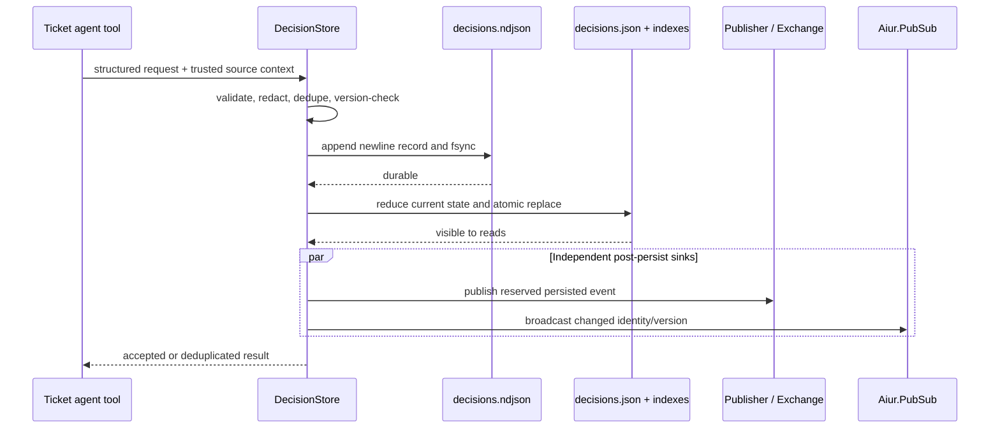
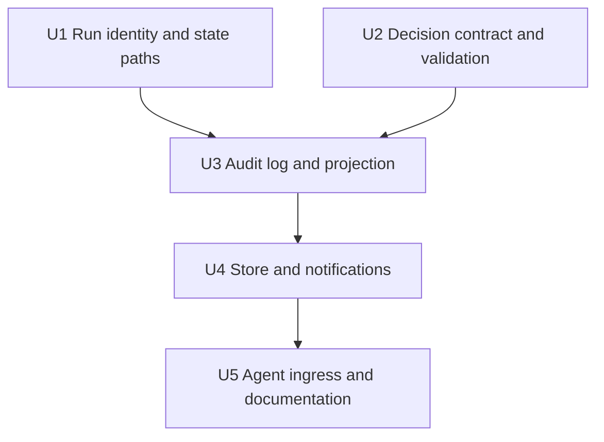
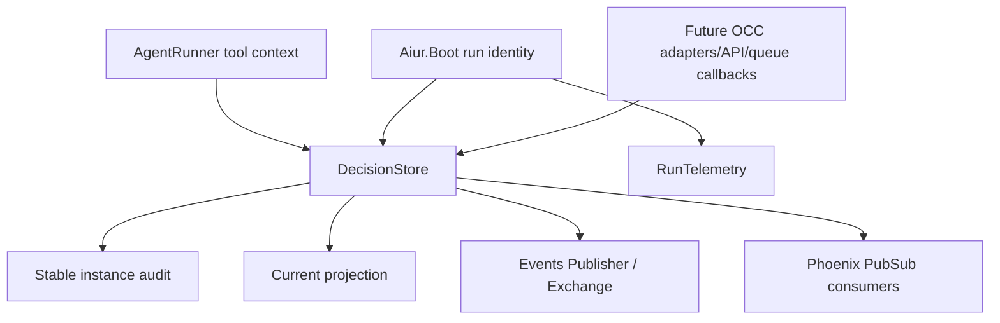

# feat: Add decision domain persistence

## Summary

Introduce one durable Decision application service that validates structured
requests, serializes an append-only audit log, rebuilds a current-state
projection, and notifies the existing event and Phoenix PubSub surfaces only
after persistence succeeds. Promote Aiur's run identity into the neutral boot
boundary and route `decision.requested` through this service at the agent-tool
entry point.

---

## Problem Frame

Aiur can currently surface urgent questions, but it has no canonical,
restart-safe Decision object. The existing agent event path publishes before
writing any durable state, alerts are lossy projections, and the current
attention registry persists only a slug. Eight downstream OCC tickets need one
stable schema and storage owner before they can safely add adapters, delivery,
UI, history, autonomy, revisions, and latency metrics.

---

## Assumptions

*This plan was authored without synchronous user confirmation. The items below
are agent inferences that fill gaps in the input and should be scrutinized
during document, code, and human review.*

- A new Decision starts at version 1. A byte-equivalent replay of an accepted
  decision/version is a successful deduplication; an exact next version is an
  append-only enrichment; stale, conflicting, or gap versions are rejected.
- The agent tool boundary should inject ticket and source-agent identity from
  trusted runtime context rather than accepting those fields solely from the
  agent payload. The current backend conversation/thread identifier is the
  source session identity.
- Canonical lifecycle time is stamped by the store's runtime clock. An optional
  agent-origin timestamp may be preserved as bounded source metadata, but it
  does not control audit ordering, version ordering, or notification age.
- Decision event delivery should reserve one existing durable event ID before
  the audit append and reuse that ID for post-persist Exchange publication, so
  a crash-window retry remains at-least-once without becoming a new logical
  event. Because the current event generator can degrade to in-memory IDs, this
  requires a strict reservation result that fails the Decision request when no
  restart-safe ID block is durable.
- Canonical Decision identity is scoped by trusted project/ticket context. An
  agent-proposed source ID may be stable within its conversation, but it must
  not collide with or mutate another ticket's Decision.
- Local artifacts are permitted only beneath canonicalized workspace and log
  roots. Remote artifacts use HTTPS and a small explicit host allowlist seeded
  from Aiur's supported tracker/control surfaces, with test/runtime overrides
  available for deployments that need another host.
- Existing credential-pattern redaction should be extracted from the GitHub
  event sanitizer into one shared primitive rather than copied into Decision
  validation.

---

## Requirements

- R1. Define and document the versioned `decision.requested` contract and an
  internal `Aiur.Decision` representation covering the PRD's ticket, source,
  authority, urgency, blocking, reversibility, context, option,
  recommendation, consequence, and artifact fields.
- R2. Validate untrusted requests before persistence: bounded identifiers and
  text, accepted enums, unique and internally consistent options, safe control
  characters, canonical artifact paths, approved HTTPS hosts, actor/source
  identity, timestamps, idempotency identity, and known-secret redaction.
- R3. Use one instance-scoped `Aiur.DecisionStore` GenServer as the public
  Decision application service and serialized writer, with read APIs for one
  Decision, the current collection, per-Decision history, and store health.
- R4. Persist canonical, newline-terminated events to owner-only
  `decisions.ndjson` with append-and-fsync acknowledgement, then atomically
  replace an owner-only `decisions.json` current-state projection through
  `Aiur.JsonStore`.
- R5. Resolve both files beneath a stable owner-only state directory rooted at
  `AIUR_BG_STATE_DIR`, isolated by a non-empty, sanitized `AIUR_INSTANCE_KEY`
  and a project-root-unique leaf hashed from the canonicalized project root
  (not the tracker project identity's last path segment alone, which collapses
  when `AIUR_INSTANCE_KEY` is empty and two repos share a directory name).
  Refuse to resolve or start when the instance key is empty or the project
  identity is unavailable/defaults, and reject dot-only (`.`/`..`) path
  components anywhere in the derived path instead of passing them through
  character-class sanitization unchanged. Do not use ticket workspaces or
  timestamped run logs.
- R6. Replay the canonical stream at startup, safely truncate an
  unacknowledged incomplete final record, and fail closed in read-only mode on
  a malformed interior record. Detect interior corruption with more than
  parse-validity: re-run the same schema/invariant validation used at ingress
  against every replayed record instead of trusting anything that merely
  decodes as JSON, since the append+fsync-before-ack barrier already limits a
  crash to tearing only the tail — an interior record that parses but fails
  semantic validation implies bit-rot or local-tamper within the single-writer
  trust boundary, not a crash artifact, and must not replay as a legitimate
  Decision. Surface corruption to the operator without silently skipping it.
- R7. Preserve append-only history while enforcing deterministic request
  deduplication, idempotency-key conflict detection, exact version progression,
  cross-ticket identity isolation, and serialized concurrent mutation behavior.
- R8. Promote one opaque BEAM-lifetime `run_id` and start timestamp into
  `Aiur.Boot`; every accepted audit event records its run, and debug telemetry
  reuses that same identity instead of minting an OCC-only or telemetry-only ID.
- R9. After audit and projection persistence, publish the normalized request
  through the existing `Aiur.Events.Publisher` / `Aiur.Events.Exchange`, then
  refresh consumers through the existing Phoenix PubSub instance. No second
  bus or dashboard-owned state is introduced.
- R10. Route only the structured `decision.requested` agent event through the
  durable service; preserve existing behavior for progress, attention,
  blocker, pause, and arbitrary `decision.<slug>` coordination events.
- R11. Prove creation, replay, versioning, corruption handling, security
  validation, permission hardening, post-persist notification ordering,
  supervision, and agent-tool integration with focused tests and a durable
  contract/design note.

---

## Scope Boundaries

- Do not adapt legacy `attention.*`, `blocked`, or `pause.request` signals into
  Decisions; OCC-2 owns that adapter and `DecisionAttention` remains unchanged.
- Do not implement operator answers, durable dispatch intents, queue
  correlation, wake/resume, delivery settlement, or agent acknowledgement;
  OCC-3 owns those lifecycle transitions.
- Do not add Decision LiveView, Presenter, REST, autonomy, revision, fleet,
  outcomes, or latency-metric features owned by OCC-4 through OCC-9.
- Do not introduce SQLite, Ecto persistence, migrations, a second event bus, a
  second operator-message path, or a per-run/ticket-workspace source of truth.
- Do not add retention or audit compaction. Rotation may be designed later,
  but accepted records are never rewritten or deleted in this ticket.
- Do not infer acknowledgement or resolution from event publication, queue
  delivery, or turn completion. The initial current state remains open and its
  delivery state remains separate.

### Deferred to Follow-Up Work

- Legacy attention projection and structured enrichment: OCC-2.
- Answer/revision outbox and correlated queue delivery: OCC-3 and OCC-8.
- Dashboard/API mutation and authorization surfaces: OCC-4 and OCC-7.
- Decision history presentation, fleet/outcomes, and latency metrics: OCC-5,
  OCC-6, and OCC-9.

---

## Context & Research

### Relevant Code and Patterns

- `docs/operator-control-center/02-occ-0-audit-and-design-decisions.md` fixes the
  file-first storage, run-boundary, persist-before-notify, and outbox direction.
- `src/lib/aiur/json_store.ex` and `src/lib/aiur/fs.ex` provide the fsynced
  atomic-replacement primitive for the rebuildable projection.
- `src/lib/aiur/events/subscription_store.ex` demonstrates a supervised,
  serialized owner with persisted state and synchronous mutation results.
- `src/lib/aiur/events/id_generator.ex`, `src/lib/aiur/events/publisher.ex`, and
  `src/lib/aiur/events/exchange.ex` provide durable event IDs, the shared
  publication boundary, and asynchronous AMQP-topic fanout.
- `src/lib/aiur/boot.ex` and `src/lib/aiur/run_telemetry.ex` contain the current
  boot clock and debug-only boot identity that OCC-0 says to unify.
- `src/lib/aiur/path_safety.ex` and `src/lib/aiur/workspace/layout.ex` provide
  symlink-aware canonicalization and root-containment precedents for artifacts.
- `src/lib/aiur/events/sanitizer.ex` owns the existing credential patterns but
  currently keeps redaction private and GitHub-payload-specific.
- `src/lib/aiur/agent_runner/tool_executor.ex` is the structured event ingress;
  its current generic flow publishes before any Decision persistence.
- `src/lib/aiur_web/observability_pubsub.ex` demonstrates safe publication on
  the existing `Aiur.PubSub` instance without making the browser authoritative.

### Institutional Learnings

- `docs/plans/2026-05-24-001-feat-event-system-foundation-plan.md` records the
  reserve-before-return event identity, single-writer ownership, fsync-before-
  rename, flat module namespace, and asynchronous fanout decisions this work
  should preserve.
- `docs/plans/2026-07-10-001-fix-operator-decision-escalation-plan.md` confirms
  `DecisionAttention` and alerts are reminder projections rather than the rich
  Decision source of truth.
- The repository has no `docs/solutions/` entries relevant to this subsystem;
  accepted OCC-0 decisions and the event-foundation plan are the durable local
  guidance.

### External References

- No external research is needed. Aiur already contains direct patterns for
  GenServer ownership, fsynced file persistence, replay/dedup, event fanout,
  Phoenix PubSub refresh, and symlink-aware path validation.

---

## Key Technical Decisions

| Decision | Rationale |
|---|---|
| Canonical append log plus rebuildable JSON projection | Matches OCC-0, preserves every accepted mutation, and keeps current reads cheap without introducing a database lifecycle. |
| One `DecisionStore` owns writes and read indexes | Serializes concurrency and gives LiveView, API, adapters, agents, and queue callbacks one future application-service seam. |
| Canonical identity includes trusted project/ticket scope | Agent-chosen IDs are not globally unique and must never collide with or mutate another ticket's Decision. The source-provided identity remains available for correlation. |
| Request versions and idempotency are distinct | Decision/version detects stale domain state; idempotency identity detects retried actions and conflicting reuse. Both are needed downstream. |
| Trusted source context is injected at ingress | An agent-provided payload must not impersonate another ticket or session; the running issue/session is already available before a tool call. |
| Request publication is a retryable notification effect, not persistence or answer dispatch | The durable record and projection precede both Exchange and Phoenix PubSub. A strictly reserved event identity permits Exchange crash-window retry without creating a new logical request; OCC-3 still owns the answer-dispatch outbox. |
| Corruption is a store mode, not a skipped line | Interior corruption makes writes read-only and operator-visible; only a non-newline-terminated tail may be truncated as unacknowledged. |
| Corruption detection re-validates full schema/invariants on replay, not parse-validity alone | A crash can only tear the tail, so an interior record that merely decodes as JSON but fails semantic validation implies bit-rot or tamper within the local single-writer trust boundary; parse-validity alone would replay it as a legitimate-but-wrong Decision. |
| Decision state-path leaf is hashed from the canonicalized project root, not the last path segment | `Config.Paths.repo_name/0`'s last-segment-of-identity, combined with a permitted empty `AIUR_INSTANCE_KEY`, can collapse two different repos onto the same `decisions.ndjson`; a project-root-unique leaf plus refusing empty/default identity keeps instances isolated. |
| Decision state and delivery state remain separate | A request is open even after publication; later queue transitions cannot silently resolve or acknowledge it. |

---

## Open Questions

### Resolved During Planning

- How should structured requests avoid the current publish-before-persist path?
  The tool executor delegates `decision.requested` to `DecisionStore`; the
  store uses a post-persist Publisher entry point that accepts its reserved
  event identity. The normal Publisher path rejects direct bypass for that
  topic family.
- Where does source session identity come from? The running app-session already
  owns the backend conversation/thread identifier before turns begin, so the
  runner passes that trusted context into the tool executor.
- How do later OCC tickets extend the domain? They add explicit mutation
  operations to the same service and reducer; this ticket establishes the
  envelope, optimistic version contract, histories, and read/query seam without
  prematurely implementing answer or revision behavior.
- How are secrets handled consistently? Extract one shared redactor and make
  the existing event sanitizer and new Decision validator use it.
- How can a persisted request safely reuse one Exchange event ID? Extend the
  existing ID generator with a strict reservation result that returns only IDs
  backed by a durably reserved block. Its existing generic fail-open API remains
  unchanged for best-effort event sources.
- How are post-persist sinks retried? Attempt Exchange and Phoenix PubSub
  independently after projection succeeds. Exchange retains a durable pending
  marker and retries the same ID with bounded backoff; PubSub is best-effort
  refresh because consumers re-read the durable store on mount/reconnect.

### Deferred to Implementation

- Exact helper/internal-state names and retry interval constants may be chosen
  during implementation while keeping the documented public behavior and file
  formats stable. Retry must remain bounded/backed off and must not block
  unrelated Decision reads.

---

## Output Structure

    src/lib/aiur/
    ├── decision.ex                  # current Decision representation
    ├── decision_validation.ex       # request normalization and limits
    ├── decision_artifact.ex         # URL/path safety policy
    ├── decision_log.ex              # fsynced append and validated replay
    ├── decision_projection.ex       # pure event reducer and serialization
    ├── decision_pubsub.ex           # existing Phoenix PubSub helper
    ├── decision_store.ex            # public API and owning GenServer
    └── secret_redactor.ex           # shared known-credential redaction

This tree is directional. Implementation may combine a very small helper when
cohesion and the repository's file-size norms are better served, but it must not
collapse validation, disk I/O, projection reduction, and GenServer ownership
into one large module.

---

## High-Level Technical Design

> *This illustrates the intended approach and is directional guidance for
> review, not implementation specification. The implementing agent should
> treat it as context, not code to reproduce.*

If audit append fails, nothing after it occurs. If projection replacement fails,
the audit remains canonical, the store rejects further writes while it repairs
from replay, and the failed call does not claim a fully projected success. If
Exchange notification fails, the durable request remains queryable and its
stable notification identity is eligible for retry; a failure in either
notification sink does not suppress the independent sink.

---

## Implementation Units

### U1. Establish neutral run identity and stable Decision paths

**Goal:** Make one BEAM-lifetime run identity available to every subsystem and
resolve owner-only, instance/repository-isolated Decision storage outside run
logs and ticket workspaces.

**Requirements:** R5, R8, R11

**Dependencies:** None

**Files:**
- Modify: `src/lib/aiur/boot.ex`
- Modify: `src/lib/aiur/run_telemetry.ex`
- Modify: `src/lib/aiur/config/paths.ex`
- Modify: `src/config/config.exs`
- Create: `src/test/aiur/boot_test.exs`
- Modify: `src/test/aiur/run_telemetry_test.exs`
- Modify: `src/test/aiur/config_paths_test.exs`

**Approach:**
- Extend the idempotent boot mark with a cryptographically opaque run identity
  and UTC start time. `Aiur.Boot.remark/0` (test-only) mints a new `run_id` in
  the same step as its monotonic/epoch reset, so a simulated reboot changes
  the run identity together with the clocks, not just the clocks.
- Make `Aiur.RunTelemetry.boot_id/0` and `boot_started_at/0` delegate directly
  to `Aiur.Boot`'s identity/start time on every call rather than caching a
  telemetry-only value minted at `start_boot/0`, so telemetry never observes a
  stale `run_id` after a test remark simulates a reboot within one VM. Retain
  only the debug sequence counter and debug gating in `RunTelemetry`'s own
  state.
- Add one canonical Decision state-path helper with a test/application
  override, launcher environment fallback, and explicit directory/file
  permission enforcement by the storage owner. Derive its leaf from a hash of
  the canonicalized (realpath) project root rather than the last segment of
  the tracker project identity, and refuse to resolve the path (fail closed,
  do not fall back to a shared default) when `AIUR_INSTANCE_KEY` is empty or
  the project identity is unavailable/defaults to `"aiur"`.
- Harden the shared `Aiur.Config.Paths.sanitize/1` to reject dot-only path
  components (`.`, `..`, and any segment that sanitizes to one) in addition to
  its existing character-class filtering — today `sanitize("..")` returns
  `".."` unchanged, so an identity like `foo/..` can escape the leaf. Every
  existing consumer of `sanitize/1` benefits from this hardening.
- Point test application boot at its existing suite-temporary root so the new
  always-on child cannot touch operator state.

**Patterns to follow:**
- `Aiur.Boot` persistent-term clock ownership.
- `Aiur.Config.Paths` centralized resolution/sanitization.
- Existing test-only `:log_file` isolation in `src/config/config.exs`.

**Test scenarios:**
- Happy path: repeated boot marking returns one unchanged run ID and start time
  for the BEAM lifetime; elapsed timing still advances from the same mark.
- Edge case: a test remark creates a different run ID/start time and resets the
  clock as one operation.
- Integration: telemetry boot identity and timestamp exactly equal `Aiur.Boot`
  while telemetry sequence behavior remains monotonic.
- Happy path: two instance keys or project identities resolve to distinct
  sanitized Decision directories beneath the configured state root.
- Happy path: two project roots that share only their final path segment
  resolve to distinct Decision directories because the leaf is hashed from
  the full canonicalized root, not the last segment.
- Error path: unsafe instance/project characters cannot escape the state root.
- Error path: an empty `AIUR_INSTANCE_KEY`, or an unavailable/default (`"aiur"`)
  tracker project identity, refuses to resolve the Decision state path instead
  of silently sharing it with another instance.
- Error path: an identity or instance-key component of `.` or `..` (e.g.
  `foo/..`) is rejected by the hardened `sanitize/1` rather than passed
  through unchanged.
- Test isolation: test boot resolves under the suite-temporary tree, never the
  operator's `AIUR_BG_STATE_DIR`.
- Integration: after `Aiur.Boot.remark/0` simulates a reboot within one VM,
  `Aiur.RunTelemetry.boot_id/0` observes the new `run_id` immediately without a
  separate `RunTelemetry.start_boot/0` call, and the sequence counter is
  unaffected.

**Verification:**
- Every subsystem observes one run identity per application boot, and the
  Decision paths are stable across log-root changes but isolated across Aiur
  instances/projects.

### U2. Define and secure the Decision request contract

**Goal:** Normalize untrusted structured requests into a stable Decision object
or return specific, matchable validation errors before any disk or event side
effect.

**Requirements:** R1, R2, R7, R11

**Dependencies:** None

**Files:**
- Create: `src/lib/aiur/decision.ex`
- Create: `src/lib/aiur/decision_validation.ex`
- Create: `src/lib/aiur/decision_artifact.ex`
- Create: `src/lib/aiur/secret_redactor.ex`
- Modify: `src/lib/aiur/events/sanitizer.ex`
- Create: `src/test/aiur/decision_validation_test.exs`
- Create: `src/test/aiur/decision_artifact_test.exs`
- Create: `src/test/aiur/secret_redactor_test.exs`
- Modify: `src/test/aiur/events/sanitizer_test.exs`

**Approach:**
- Define schema version 1 and a typed current-state object with explicit open
  lifecycle and separate not-yet-dispatched delivery state.
- Derive/validate canonical Decision identity under trusted project/ticket
  scope while retaining the source-provided identity for agent correlation.
- Normalize string/atom input keys, ISO timestamps, option/artifact collections,
  optional context, and defaults into one deterministic representation used by
  hashing, persistence, event publication, and public reads.
- Stamp accepted/request lifecycle time at the trusted store boundary; validate
  and preserve any source-reported time separately so an agent cannot forge
  audit order or a Decision's operator-visible age.
- Bound per-field and aggregate content; reject disallowed control data, unknown
  enum values, duplicate option/artifact identities, broken recommendations,
  invalid timestamps, and inconsistent required fields with structured errors.
- Redact known credential patterns before computing the canonical payload hash.
  Preserve Markdown as data rather than trusting or rendering embedded HTML.
- Canonicalize local artifact paths through `Aiur.PathSafety` and prove root
  containment after symlink resolution. Accept remote artifacts only when their
  parsed HTTPS host is an exact approved host or a dot-delimited subdomain of
  one, and the URL has no credentials. Document that file-serving consumers
  must revalidate containment at access time to close post-ingest symlink swaps.

**Execution note:** Implement the pure contract test-first because it defines
the API and persisted shape consumed by every downstream OCC ticket.

**Patterns to follow:**
- Structured error vocabulary from `CONTRIBUTING.md`.
- `Aiur.PathSafety` plus `Aiur.Workspace.Layout` containment checks.
- Credential patterns currently covered by `Aiur.Events.Sanitizer` tests.

**Test scenarios:**
- Happy path: a full PRD payload and a minimal valid payload normalize to schema
  version 1 with stable JSON-safe representations and canonical hashes.
- Happy path: option IDs are unique, recommendation points to an existing
  option, and custom-response-only requests need no invented options.
- Edge cases: Unicode text respects codepoint limits; supported newlines/tabs
  survive; empty optional fields normalize consistently.
- Time boundary: a forged future/past source timestamp cannot change canonical
  accepted order or age, while a valid source timestamp remains available as
  provenance.
- Error paths: missing decision/source/ticket/question/blocking/time fields,
  invalid enums/versions/timestamps, option duplication, dangling
  recommendation, excess list sizes, overlong aggregate content, and unsafe
  control bytes all fail before side effects.
- Isolation: two tickets may submit the same source ID without collision, while
  a later payload cannot use one ticket's canonical ID to mutate another.
- Security: every existing secret pattern is redacted in nested text fields
  before hashing/persistence; the GitHub sanitizer preserves its prior output
  after adopting the shared redactor.
- Security: relative paths, traversal, symlink escapes, paths outside safe
  roots, HTTP/userinfo/local-host URLs, deceptive host suffixes, and
  non-allowlisted HTTPS hosts fail; canonical in-root paths and allowlisted
  HTTPS URLs pass.

**Verification:**
- Equivalent logical input has one deterministic normalized/hash result, and no
  rejected or unredacted payload can reach the persistence boundary.

### U3. Implement canonical audit replay and current projection

**Goal:** Provide crash-aware append/replay primitives and a pure reducer that
reconstructs Decision state, histories, dedup indexes, version indexes, and
pending notification effects from the canonical stream.

**Requirements:** R3, R4, R6, R7, R11

**Dependencies:** U1, U2

**Files:**
- Create: `src/lib/aiur/decision_log.ex`
- Create: `src/lib/aiur/decision_projection.ex`
- Modify: `src/lib/aiur/fs.ex`
- Create: `src/test/aiur/decision_log_test.exs`
- Create: `src/test/aiur/decision_projection_test.exs`
- Modify: `src/test/aiur/fs_test.exs`

**Approach:**
- Ensure the canonical directory is owner-only before opening files and keep
  audit/projection files owner-readable/writable only.
- Reject symlinked canonical directories or audit/projection targets rather
  than following an attacker-controlled link outside the selected state root.
- Encode each accepted event as one bounded JSON object plus newline, append it
  through a raw descriptor, and acknowledge only after descriptor sync.
- Add a directory-fsync primitive to `Aiur.Fs` and call it once, immediately
  after the canonical directory and `decisions.ndjson` are first created,
  so the new directory entry itself is durable — `Aiur.Fs` already fsyncs the
  file descriptor for durable appends, but never the parent directory, so the
  very first file's directory entry could be lost on a crash before any later
  write happens to sync that directory. Only the first-ever creation pays this
  cost, not every append.
- On load, treat a missing file as empty; truncate and sync only bytes following
  the final newline; decode each complete line and re-run it through the same
  request/enrichment schema and invariant validation used at ingress (U2),
  not JSON-decode success alone, in order; return the validated prefix and a
  corruption reason without skipping malformed interior records. A record that
  parses as JSON but fails that validation is corruption, exactly like one that
  fails to parse.
- Reduce immutable request/enrichment records into current Decisions and
  indexes. Internal request-notification settlement records update only the
  notification index, not the Decision version/history presented as domain
  mutations.
- Serialize the current projection with its own schema version and atomically
  replace it only after the in-memory reduction succeeds.

**Execution note:** Write recovery and corruption cases before the happy-path
store integration; incorrect replay behavior is the highest data-integrity
risk in this ticket.

**Patterns to follow:**
- `Aiur.Fs` / `Aiur.JsonStore` fsync and atomic replacement.
- `Aiur.Events.IdGenerator` reserve-before-return reasoning.
- `Aiur.AgentEventLog` one-record-per-line encoding, strengthened here with
  synchronous descriptor sync and fail-closed parsing.

**Test scenarios:**
- Happy path: multiple accepted request versions append in order, replay to the
  latest current Decision, and retain both history records and dedup indexes.
- Integration: projection JSON exactly matches the replayed current state and
  can be deleted/corrupted then rebuilt from an intact audit stream.
- Crash edge: a non-newline-terminated final fragment is truncated, synced, and
  never enters history or indexes.
- Crash edge: the first-ever `decisions.ndjson` creation fsyncs its parent
  directory exactly once; later appends to the existing file do not repeat
  the directory fsync.
- Corruption errors: malformed JSON, valid JSON with an invalid envelope, and a
  corrupt middle record return the line/reason and never skip forward.
- Corruption errors: a record whose bytes decode as valid JSON but fail
  schema/invariant validation (e.g., an out-of-enum field, or a flipped byte in
  an `answer` string that stays valid JSON) is treated as interior corruption,
  not a legitimate replayed Decision.
- Failure paths: append/open/write/sync errors are returned; an existing
  projection remains unchanged when atomic replacement fails.
- Security: created directories are mode 0700 and canonical/projection files
  are mode 0600 even under a permissive process umask.
- Security: a pre-existing symlink at the Decision directory, audit path, or
  projection path fails closed without writing its target.
- Edge case: an audit event from a different run keeps its original run stamp
  while replay occurs in the current run.

**Verification:**
- The audit stream alone deterministically rebuilds current state and indexes;
  no partial or invalid acknowledged record is treated as canonical.

### U4. Own mutations, queries, recovery mode, and notifications

**Goal:** Supervise one Decision application service that serializes requests,
persists before notifying, exposes current reads, and fails closed on canonical
corruption.

**Requirements:** R3, R4, R6, R7, R9, R11

**Dependencies:** U3

**Files:**
- Create: `src/lib/aiur/decision_store.ex`
- Create: `src/lib/aiur/decision_pubsub.ex`
- Modify: `src/lib/aiur/events/id_generator.ex`
- Modify: `src/lib/aiur/events/publisher.ex`
- Modify: `src/lib/aiur.ex`
- Create: `src/test/aiur/decision_store_test.exs`
- Create: `src/test/aiur/decision_pubsub_test.exs`
- Modify: `src/test/aiur/events/id_generator_test.exs`
- Modify: `src/test/aiur/events/publisher_test.exs`
- Modify: `src/test/aiur/core_test.exs`

**Approach:**
- Start the store after event-ID/Publisher infrastructure and before legacy
  decision-attention/dashboard consumers in every run shape.
- On writable startup, replay the audit, rebuild the projection, and schedule
  unresolved post-persist notifications. On interior corruption, retain the
  validated-prefix read model, reject every mutation with a store-corrupt
  reason, log loudly, and emit one actionable operator alert.
- Serialize request handling: normalize, compare idempotency/version indexes,
  strictly reserve the event ID, append+sync, reduce, atomically project, then
  independently publish the persisted event and a compact Phoenix PubSub
  changed notification.
- Keep the generic ID-generator API fail-open for existing best-effort sources,
  but add a strict reservation path that exposes persistence failure and never
  returns an ID outside a durably reserved block.
- Return the same current record for an exact duplicate without appending or
  generating another logical notification ID. If that record still has a
  pending Exchange notification, the duplicate may retry that same effect and
  same ID. Reject same-key/different-payload, stale/same-version conflicts, and
  version gaps with the current version.
- Add a Publisher path for already-persisted events with a caller-supplied ID;
  keep its IssueLog/debug marker behavior. Reject direct generic publication
  of `decision.requested` so future call sites cannot bypass durability.
- Keep notification failures visible and retryable without rolling back the
  already-durable Decision or reporting it as lost.
- If projection replacement fails after the append, retain the candidate replay
  state, enter a write-rejecting recovery mode, and retry projection repair.
  Resume writes only after the on-disk projection matches the canonical stream.

**Patterns to follow:**
- `Aiur.Events.SubscriptionStore` synchronous single-writer calls.
- `Aiur.Events.Publisher` shared marker/fanout boundary.
- `AiurWeb.ObservabilityPubSub` safe use of the existing Phoenix PubSub server.

**Test scenarios:**
- Happy path: append and projection both complete before either Exchange or
  Phoenix PubSub can observe the request; the two post-persist sinks are then
  attempted independently.
- Happy path: get/list/history/health return the current object, chronological
  accepted history, and writable status without reading projection files.
- Dedup: same key and payload or same decision/version/hash returns the existing
  Decision and does not append, allocate, or notify again.
- Conflicts: same idempotency key with different content, same version with
  different content, stale version, version gap, and two concurrent next-version
  requests yield one acceptance and one deterministic conflict.
- Failure ordering: validation and audit failures cause no projection or
  notification; strict ID-reservation failure causes no audit append; projection
  failure leaves the audit authoritative, freezes writes, and returns a
  repairable projection error; either notification failure leaves the Decision
  queryable without suppressing the other sink, and Exchange remains pending
  for retry.
- Restart: a fresh store instance replays open Decisions, repairs projection,
  and completes an unresolved persisted notification with the same event ID.
- Recovery: a transient projection failure repairs in place and re-enables
  writes; a persistent failure keeps reads available and all later mutations
  rejected.
- Corruption: startup exposes validated-prefix reads, reports read-only health,
  emits one operator alert, and rejects writes without modifying either file.
- PubSub integration: a subscriber receives the changed identity/version only
  after a synchronous store read observes the new projection.
- Supervision: the child exists in interactive, headless, and dashboard-disabled
  trees and starts after its dependencies.

**Verification:**
- There is one public service and one writer; accepted requests survive process
  and VM restarts and never become visible to event/dashboard consumers before
  durable current state exists.

### U5. Route structured agent requests and publish the contract

**Goal:** Make the real agent tool path use the durable service with trusted
runtime identity while preserving every existing non-request event behavior.

**Requirements:** R1, R9, R10, R11

**Dependencies:** U4

**Files:**
- Modify: `src/lib/aiur/agent_runner/tool_executor.ex`
- Modify: `src/lib/aiur/agent_runner/turn_loop.ex`
- Modify: `src/lib/aiur/agent_runner/queue_drain.ex`
- Modify: `src/test/aiur/agent_runner/tool_executor_test.exs`
- Modify: `src/test/aiur/dynamic_tool_test.exs`
- Create: `docs/operator-control-center/03-occ-1-decision-contract.md`

**Approach:**
- Pass the running backend conversation/thread identity into the tool executor
  for initial turns and queued-message turns.
- For `decision.requested`, combine the tool's message/payload with trusted
  issue/source context, delegate to `DecisionStore`, and return a structured
  accepted/deduplicated/conflict result containing Decision identity/version
  and event correlation.
- Continue routing all other allowlisted names through the existing generic
  Publisher and current `DecisionAttention` synchronization behavior.
- Document the request fields, limits/enums/defaults, version/idempotency rules,
  persisted event/projection shapes, path and permission policy, run semantics,
  notification topics, read-only corruption behavior, and explicit OCC-2/3
  extension points.

**Execution note:** Add an integration test at the tool boundary before changing
the routing branch so publish-before-persist cannot regress silently.

**Patterns to follow:**
- Existing injected closures in `Aiur.AgentRunner.ToolExecutor`.
- Session/thread ownership in `Aiur.AgentRunner.SessionLifecycle`.
- Existing dynamic-tool success/error serialization rather than a second tool.

**Test scenarios:**
- Integration: a real tool-executor `decision.requested` call persists and
  projects before its Exchange subscriber receives the normalized event.
- Security: payload ticket/source values cannot override the trusted running
  issue, agent, backend conversation, current run, or canonical acceptance
  timestamp.
- Happy path: omitted payload question uses the required tool message; full
  optional request context survives normalization and publication.
- Dedup/conflict: repeat calls surface deduplicated success or structured
  version/idempotency failure without a duplicate Exchange event.
- Failure: unavailable/read-only store returns a tool failure and publishes no
  structured request.
- Regression: progress, attention open/resolve, pause/block escalation,
  arbitrary architectural `decision.<slug>`, and custom events retain their
  current topic/payload/attention behavior.
- Documentation: examples match validator fields and terminology, and do not
  claim answer dispatch, acknowledgement, or resolution exists yet.

**Verification:**
- The only production ingress for an agent-emitted structured request has the
  same persist-before-notify behavior as the direct store API, while unrelated
  agent coordination remains unchanged.

---

## System-Wide Impact

- **Interaction graph:** AgentRunner gains trusted session context; Boot becomes
  the neutral run owner; DecisionStore writes the canonical files and then
  reuses Publisher/Exchange and `Aiur.PubSub`; downstream OCC callers converge
  on the same service.
- **Error propagation:** Boundary validation and version errors are matchable;
  canonical append failures reject acceptance; projection failures report a
  durable-but-unprojected repair condition; corruption changes store health to
  read-only; Exchange notification failures remain pending and visible while a
  PubSub failure remains best-effort and consumers recover by re-reading.
- **State lifecycle risks:** Crash windows exist between append, projection,
  Exchange publication, and notification settlement. Canonical replay,
  deterministic IDs/hashes, strict event-ID reservation, and a request-
  notification marker/index make each window safe to retry without rewriting
  prior history. Projection failure freezes the writer until replayed state is
  durably projected again.
- **API surface parity:** Direct store callers and the agent tool share one
  mutation path. LiveView and REST are deliberately deferred but must later use
  these same read/mutation/version semantics.
- **Integration coverage:** Pure validation/reducer tests are insufficient;
  focused store restart, file failure, PubSub ordering, and real tool-to-
  Exchange tests cover layer crossings.
- **Unchanged invariants:** `DecisionAttention`, alerts, generic event names,
  operator messages, queue items, dashboard security, and orchestrator control
  remain behaviorally unchanged. Alerts and run logs remain projections, never
  Decision truth.

---

## Risks & Dependencies

| Risk | Likelihood | Impact | Mitigation |
|---|---|---|---|
| An accepted append exists but projection replacement fails | Low | High | Return an explicit repair condition, preserve the canonical record, and prove startup replay repairs the projection before writes resume. |
| Event ID was returned from a non-durable reservation | Low | High | Add a strict reservation path and reject the Decision before audit append when the generator cannot durably reserve its block. |
| Crash after publication but before settlement records it | Medium | Medium | Persist a stable event identity first; retries reuse it and rely on existing at-least-once/cursor dedup semantics. |
| Interior corruption hides open Decisions | Low | High | Stop replay at the first invalid complete line, expose validated-prefix reads, reject writes, and emit an actionable corruption alert. |
| Validation silently diverges from downstream needs | Medium | High | Document schema/version rules, keep normalized representations extensible, and make every OCC ticket extend this same reducer/service rather than fork it. |
| Secret or path material reaches durable files | Medium | High | Shared pre-hash redaction, aggregate limits, symlink-aware root containment, HTTPS host allowlisting, owner-only directory/files, and adversarial tests. |
| A canonical path is swapped to a symlink after validation | Medium | High | Reject symlinked store targets and require future artifact-serving consumers to canonicalize and re-check containment at access time. |
| Tool-context changes regress existing event flows | Medium | Medium | Branch only the exact structured request name and run all directly related tool/attention/publisher tests. |
| Always-on store touches operator state during tests | Medium | High | Configure the store beneath the suite's boot-time temporary root before the application starts and assert this behavior. |
| OCC-0 design dependency changes | Low | High | OCC-0 is merged at the branch base; keep its accepted note linked and avoid contradicting its persistence/run/outbox decisions. |

---

## Documentation / Operational Notes

- `docs/operator-control-center/03-occ-1-decision-contract.md` becomes the
  schema/storage handoff for OCC-2 through OCC-9 and must distinguish delivered
  capabilities from deferred lifecycle work.
- The contract doc must state the corruption threat model explicitly: the
  append+fsync-before-ack barrier already limits a crash to tearing only the
  tail, so interior fail-closed detection defends against local bit-rot or a
  single-writer violation, not an adversarial rewriter.
- Corruption remediation is intentionally operator-driven in this ticket. The
  alert and health API must include the exact file/reason without logging
  Decision contents or secrets; no automatic interior-record deletion occurs.
- No migration is required because this is the first canonical Decision store.
  Missing files bootstrap empty; existing attention and alert files are not
  imported until OCC-2.
- Manual `aiurdev --test` verification is blocked inside agent workspaces by
  repository policy. This backend foundation is verified with focused module
  and cross-layer tests; operator-root TUI verification belongs with the first
  dashboard/user-facing OCC ticket.

---

## Sources & References

- **Origin PRD:** `docs/operator-control-center/00-prd.md` on PR #971
- **Decomposition:** `docs/operator-control-center/01-brainstorm-and-decomposition.md` on PR #971
- **Accepted dependency:** `docs/operator-control-center/02-occ-0-audit-and-design-decisions.md`
- **Tracker issue:** #979
- **Planning PR:** #971
- **Event foundation:** `docs/plans/2026-05-24-001-feat-event-system-foundation-plan.md`
- **Decision attention precedent:** `docs/plans/2026-07-10-001-fix-operator-decision-escalation-plan.md`
- **Foundation review amendment (OWNER, 2026-07-12):** five clarifications on
  corruption detection, state-path isolation, dot-component rejection, parent-
  directory fsync, and run_id test-reset delegation, folded into R5, R6, and
  U1/U3 above.
