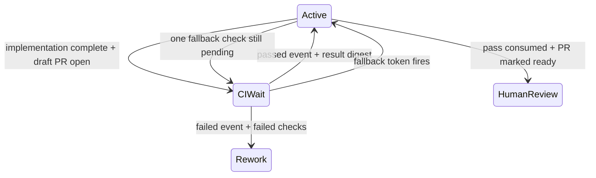

# feat: Pause agents while CI runs

## Summary

This plan moves the final PR-CI wait out of the agent turn and into the existing `ci-wait` lifecycle. Aiur will release the waiting slot, wake the same agent with a terminal result or a token-guarded timeout handoff, and keep the central GitHub CI poller as the only continuous poller.

| Wake reason | Ticket state before wake | Agent action |
| --- | --- | --- |
| CI passed | `ci-wait` | Consume the delivered result, mark the draft PR ready, and move to `human-review` without re-polling. |
| CI failed | `ci-wait` | Consume failed-check context and begin `rework`. |
| Re-wake timeout | `ci-wait` | Check CI once; finalize terminal work or return to `ci-wait` without looping. |

---

## Problem Frame

Agents currently spend live turns and dispatch capacity repeatedly checking their own PR after implementation is otherwise complete. The daemon already polls GitHub CI and publishes terminal events, but only failure wakes a paused runner, successful events do not survive the immediate human-review deactivation path, `ci-wait` pauses still reserve dispatch capacity, and there is no bounded fallback when a terminal event is missed.

---

## Assumptions

*This plan was authored without synchronous user confirmation. The items below are agent inferences that fill gaps in the input and should be scrutinized during implementation and review.*

- A successful terminal observation returns the ticket briefly to the canonical active `in-progress` state so the live or newly dispatched agent can consume the result and perform the existing PR-ready / `human-review` handoff. Leaving it in `human-review` would let the same poll deactivate the runner before event delivery.
- Re-wake timers are session-local runtime state. Restart safety continues to come from the durable `ci-wait` tracker label and central poller; a terminal result after restart moves the ticket active and normal dispatch delivers the persisted event.
- The timeout wake authorizes one direct CI status check as a recovery probe. Continuous observation remains exclusively owned by `Aiur.Events.GithubCiPoller`.

---

## Requirements

- R1. When implementation, local validation, draft-PR self-review, and all code changes are complete, the agent must move the ticket to `agent:ci-wait`, yield its turn, and stop polling PR checks.
- R2. A `ci-wait` paused runner must not reserve a normal dispatch slot; manual, blocker, duration-cap, and operator pauses must preserve their existing slot semantics.
- R3. Both `ticket.<id>.ci.passed` and `ticket.<id>.ci.failed` must wake a CI-wait agent and deliver the terminal event payload, including failed check names and excerpts when present, through the existing event-digest / OperatorMessages path.
- R4. A passed result must let the agent finish the existing ready-for-human-review handoff; a failed result must make rework dispatchable before wake.
- R5. Each live CI-wait pause must arm a token-guarded fallback for `agent.ci_wait_rewake_minutes`; the default is 5 and only positive integers are accepted.
- R6. A matching fallback wake must give the agent one recovery turn to check CI once. Canceled, replaced, stale, operator-paused, inactive, or terminal timer messages must not resume or dispatch work.
- R7. The configuration and ticket lifecycle must be documented without adding an `aiur init` question.

---

## Scope Boundaries

- Do not add a second CI poller, a GitHub webhook path, or an agent-side `gh pr checks` loop.
- Do not change slot reservation for non-CI pauses.
- Do not persist timer references or tokens across daemon restarts.
- Do not alter CI decision classification, sanitization, approved-head tracking, or the one-cycle retry of a test-only failure except where the new wake transition requires it.
- Do not add `agent.ci_wait_rewake_minutes` to init prompts or generated answers.

---

## Context & Research

### Relevant Code and Patterns

- `src/lib/aiur/orchestrator/ci_lifecycle.ex` already owns `ci-wait` transitions, terminal publication, approved-head state, and failure auto-resume.
- `src/lib/aiur/orchestrator/lifecycle.ex` and `src/lib/aiur/orchestrator/retry_engine.ex` demonstrate token-guarded timers whose stale mailbox messages are harmless.
- `src/lib/aiur/events/subscription_store.ex` routes subscribed events through `Aiur.Orchestrator.OperatorMessages`, and `src/lib/aiur/agent_runner/queue_drain.ex` renders the resulting event digest into the resumed turn.
- `src/lib/aiur/orchestrator/push_routing.ex` demonstrates deferred auto-resume when a released slot has already been filled.
- `src/lib/aiur/orchestrator/reconciler.ex` is the revalidation boundary for tracker pause overlays, active states, CI wait, human review, and terminal state.
- `src/lib/aiur/config/schema/agent.ex`, `src/lib/aiur/config.ex`, and `website/docs-app/reference/configuration.md` are the established config schema, accessor, validation, and reference surfaces.
- `.claude/skills/using-aiur/dev-loop.md` is the operational source for draft PR, self-review, CI handoff, and human-review completion; `.aiur/prompt.md` routes ticket agents into that manual.

### Institutional Learnings

- `docs/plans/2026-07-09-001-feat-ci-feedback-loop-plan.md` established the central poller, durable CI topics, `ci-wait` label, subscription delivery, and current-head deduplication that this work must extend rather than duplicate.
- `docs/refactor/research-history-hotspots.md` identifies label and reactivation races as a recurring failure class and requires revalidation at use rather than trusting stale reads.
- `docs/refactor/feature-inventory/orc.md` records that human-review deactivation happens during running-state reconciliation and that pending auto-resumes must survive capacity pressure.

### External References

- None. The repository has direct, current patterns for every implementation surface.

---

## Key Technical Decisions

- **Use one CI-specific timer entry per running issue:** store its timer reference, opaque token, identifier, and deadline in orchestrator state; replacing or clearing the entry invalidates already-delivered timeout messages.
- **Release only CI-wait reservations:** keep CI-wait runners visible and paused, but exclude that pause reason from dispatch-slot reservation while retaining all other paused counts and UI state.
- **Reactivate before the agent handoff:** terminal pass moves to `in-progress`, terminal failure moves to `rework`, and timeout recovery moves to `in-progress`; only then may the live runner resume or normal dispatch start a replacement.
- **Deliver through the existing subscription queue:** attach the ticket's universal subscriptions before terminal publication, preserve the full sanitized event, and wake only after it can be consumed through OperatorMessages / event digest handling.
- **Revalidate every delayed wake:** the timer token, current entry status, pause reason, tracker pause overlay, and expected lifecycle state all gate a wake. Capacity deferral is retried by normal reconciliation; inactive or terminal changes clear stale wake intent.

---

## High-Level Technical Design

> *This illustrates the intended approach and is directional guidance for review, not implementation specification. The implementing agent should treat it as context, not code to reproduce.*

---

## Implementation Units

### U1. Add configurable token-guarded CI re-wakes

**Goal:** Release CI-wait capacity and give every live CI-wait pause one safe timeout recovery path.

**Requirements:** R2, R5, R6, R7

**Dependencies:** None

**Files:**
- Modify: `src/lib/aiur/config/schema/agent.ex`
- Modify: `src/lib/aiur/config.ex`
- Modify: `src/lib/aiur/orchestrator/state.ex`
- Modify: `src/lib/aiur/orchestrator/ci_lifecycle.ex`
- Modify: `src/lib/aiur/orchestrator.ex`
- Modify: `src/lib/aiur/orchestrator/slots.ex`
- Test: `src/test/aiur/config/schema_test.exs`
- Test: `src/test/aiur/orchestrator_ci_lifecycle_test.exs`
- Test: `src/test/aiur/orchestrator/slots_test.exs`

**Approach:**
- Add the five-minute positive-integer agent setting and a focused accessor; do not touch init questions.
- Arm the timer when a live runner first becomes paused for CI, keep repeated reconciliation idempotent, replace it only for a new wait cycle, and cancel/clear it on terminal or active transitions.
- On a matching timeout, revalidate the runner and issue, transition the ticket to `in-progress`, enqueue a concise one-check recovery handoff, and resume through existing reconciliation. Re-arm after a failed tracker transition rather than losing the fallback.
- Exclude only `paused_reason: :ci_wait` entries from global slot reservation so unrelated work may dispatch while the session remains parked.

**Execution note:** Start with timer-token and slot-accounting regression tests because stale mailbox delivery and capacity semantics are the risky boundaries.

**Patterns to follow:**
- Token replacement and stale-message rejection in `Aiur.Orchestrator.Lifecycle` and `Aiur.Orchestrator.RetryEngine`.
- Pause clock and automatic resume behavior in `Aiur.Orchestrator.PauseResume`.
- Per-reason paused-entry classification in `Aiur.Orchestrator.RuntimeWatchdog`.

**Test scenarios:**
- Happy path: parsing no override yields 5 minutes; a positive override is accepted and returned by the accessor.
- Error path: zero, a negative integer, and a non-integer value produce a dotted `agent.ci_wait_rewake_minutes` validation error.
- Integration: entering CI wait arms one timer, pauses the runner, and makes one normal dispatch slot available.
- Edge case: reconciling the same paused wait does not extend or duplicate its timer.
- Happy path: the matching timeout moves the still-waiting issue active, queues one recovery handoff, and resumes when capacity permits.
- Race: a canceled or superseded token, a non-CI pause, a tracker pause overlay, an already-active entry, or a terminal/inactive entry produces no wake.
- Error path: a failed timeout-driven tracker transition leaves the runner paused and schedules a fresh guarded fallback.
- Regression: operator, blocker, and max-duration pauses continue reserving their slots.

**Verification:**
- CI waits consume neither turns nor normal dispatch capacity, and only the current timer for a still-valid wait can create a recovery turn.

---

### U2. Wake on both terminal outcomes with result context

**Goal:** Make pass and failure events symmetric, dispatch-safe wake signals whose resumed turn already has the terminal CI result.

**Requirements:** R3, R4, R6

**Dependencies:** U1

**Files:**
- Modify: `src/lib/aiur/orchestrator/ci_lifecycle.ex`
- Modify: `src/lib/aiur/orchestrator/event_topics.ex`
- Modify: `src/lib/aiur/orchestrator/lifecycle.ex`
- Modify: `src/lib/aiur/orchestrator/reconciler.ex`
- Test: `src/test/aiur/orchestrator_ci_lifecycle_test.exs`
- Test: `src/test/aiur/orchestrator/event_topics_test.exs`
- Test: `src/test/aiur/orchestrator_deactivate_test.exs`

**Approach:**
- Subscribe the orchestrator to both CI terminal topics and classify both through one terminal-event route.
- Before publishing either outcome, ensure the ticket-local universal subscription exists so SubscriptionStore persists and queues the complete sanitized event through OperatorMessages.
- Change the successful terminal transition from immediate `human-review` to `in-progress`; retain `rework` for failures. Publish only after the tracker write succeeds, cancel the wait timer, and resume only the existing valid CI-wait runner.
- If another agent filled the released capacity, retain a CI-specific pending-resume hint and retry it during reconciliation only while the stored issue still matches the expected active outcome. Never reactivate an operator-paused, inactive, deactivated, or terminal entry from a stale hint.

**Execution note:** Preserve the existing transition-before-publish test posture and add pass/fail integration coverage around the event queue before changing lifecycle code.

**Patterns to follow:**
- Failure transition ordering and payload construction in `Aiur.Orchestrator.CiLifecycle`.
- Durable universal subscriptions and event-digest rendering in `Aiur.Events.SubscriptionStore` and `Aiur.AgentRunner.QueueDrain`.
- Capacity-deferred blocker wake hints in `Aiur.Orchestrator.PushRouting`, with stricter CI lifecycle revalidation.

**Test scenarios:**
- Happy path: pass writes `in-progress`, publishes `ci.passed`, resumes the CI-wait runner, and its queued digest contains the PR/head result without a new CI query.
- Happy path: failure writes `rework`, publishes `ci.failed`, resumes the runner, and the queued digest includes all failed check names plus the bounded excerpt.
- Integration: no live runner still gets a universal subscription, active label transition, normal dispatch eligibility, and bootstrap delivery of the persisted event.
- Capacity: a terminal event received while all active slots are occupied remains pending and resumes once capacity opens.
- Race: an operator pause applied after CI wait prevents both immediate and deferred wake.
- Race: an issue moving to human-review, done, canceled, or another non-active state before a deferred resume clears the hint and never dispatches.
- Edge case: duplicate terminal observations and the subscription/event-route fanout result in one rendered CI outcome for the agent.

**Verification:**
- Both outcomes wake exactly one eligible turn with enough context to act, and no stale terminal state can force a new worker or revive a parked one.

---

### U3. Teach the agent and operator workflows to hand CI off

**Goal:** Replace final-turn CI polling with a precise CI-wait / terminal-event / one-shot-fallback contract and document the new setting.

**Requirements:** R1, R3, R4, R5, R7

**Dependencies:** U1, U2

**Files:**
- Modify: `.claude/skills/using-aiur/SKILL.md`
- Modify: `.claude/skills/using-aiur/turn-workflow.md`
- Modify: `.claude/skills/using-aiur/dev-loop.md`
- Modify: `.claude/skills/aiur-monitor/SKILL.md`
- Modify: `.aiur/prompt.md`
- Modify: `.aiur/examples/prompt.md.example`
- Modify: `website/docs-app/reference/configuration.md`
- Modify: `website/docs-app/concepts/ticket-lifecycle.md`
- Modify: `website/docs-app/concepts/what-is-aiur.md`
- Test: `src/test/aiur/aiur_agent_skill_test.exs`

**Approach:**
- After the draft PR is pushed, self-reviewed, and locally complete, direct GitHub agents to set `agent:ci-wait` and end the turn without `gh pr checks` polling.
- Define terminal wake handling: trust the delivered result, fix a failed outcome, or mark a passed draft ready and move to human review. Define timeout handling as one check followed by terminal action or another CI-wait pause.
- Keep the 100% progress signal tied to the later human-review transition, not the CI-wait handoff.
- Clarify in operator monitoring guidance that the daemon owns CI polling and `ci-wait` is expected non-actionable idle state.
- Add the config row and lifecycle state to website documentation while leaving init surfaces unchanged.

**Patterns to follow:**
- Existing no-review-polling turn boundary in `.claude/skills/using-aiur/dev-loop.md`.
- Prompt-to-manual routing contract covered by `Aiur.AiurAgentSkillTest`.
- Concise agent configuration table in `website/docs-app/reference/configuration.md`.

**Test scenarios:**
- Contract: the operating manual and repo prompt both require `agent:ci-wait` after implementation is complete and explicitly forbid continuous `gh pr checks` polling.
- Contract: the manual names pass, failure, and timeout wake behavior and preserves the 100%-at-human-review rule.
- Contract: monitor guidance identifies the central poller as owner and does not tell operators to keep a worker turn alive for CI.
- Regression: existing draft PR, self-review, review-thread, no-self-merge, and scoped verification instructions remain present.
- Documentation: the config reference lists the default and positive-minute behavior, while init questions/templates contain no new prompted answer.

**Verification:**
- A newly dispatched agent has one unambiguous final-CI handoff and no instruction path that leads to an in-turn polling loop.

---

## System-Wide Impact

- **Interaction graph:** agent workflow changes the tracker label; reconciliation pauses and arms the timer; the central poller publishes; SubscriptionStore queues the event; terminal routing resumes; QueueDrain hands the payload to the next turn.
- **Error propagation:** tracker transition failures leave the current state intact; CI API failures remain with the central poller; timer transition failures re-arm rather than pretending to wake.
- **State lifecycle risks:** canceled timers can already be in the mailbox, capacity can be consumed after a CI waiter releases its slot, and tracker state can change between event publication and deferred resume. Tokens plus state-at-use validation cover each race.
- **API surface parity:** both `ci.passed` and `ci.failed` use the same topic parser, queue delivery, timer cancellation, and auto-resume policy.
- **Integration coverage:** focused orchestrator tests must prove the tracker write, event queue, control message, slot release, and stale-state guard together.
- **Unchanged invariants:** central CI classification and sanitization remain authoritative; manual pauses reserve slots; terminal states never dispatch; human-review still deactivates only after its readiness gate; agents never self-merge.

---

## Risks & Dependencies

| Risk | Mitigation |
| --- | --- |
| A passed ticket is deactivated before the result reaches the agent | Transition it to `in-progress` before publish/resume; the agent performs the final human-review handoff. |
| Released capacity is filled before CI completes | Keep a state-validated pending CI resume and retry through normal reconciliation. |
| Canceled timer messages wake a later wait cycle | Match an opaque per-arm token stored with the current issue entry. |
| A timeout wake becomes another polling loop | Queue explicit one-check guidance and require a return to `ci-wait` when still pending. |
| Subscription and orchestrator event fanout duplicate the result | Preserve event IDs and exercise existing digest coalescing/deduplication in integration coverage. |
| Prompt edits drift between repo dogfood and initialized workspaces | Update the operating manual, repo prompt, and embedded prompt example together and guard their contract in tests. |

---

## Documentation / Operational Notes

- `agent.ci_wait_rewake_minutes` is hot-read when a timer is armed, matching other agent runtime settings; changing it affects the next CI wait, not an already-armed deadline.
- `agent:ci-wait` remains a visible, non-actionable lifecycle state. Terminal failure and pass now create an agent turn before human review rather than completing the lifecycle inside the poller.
- Manual TUI verification must run from the operator repo root because agent workspaces are prohibited from launching `scripts/aiurdev --test`; focused lifecycle tests are the local agent-turn verification path.

---

## Sources & References

- Related issue: #976
- Existing CI lifecycle plan: `docs/plans/2026-07-09-001-feat-ci-feedback-loop-plan.md`
- Timer pattern: `src/lib/aiur/orchestrator/retry_engine.ex`
- CI lifecycle: `src/lib/aiur/orchestrator/ci_lifecycle.ex`
- Event handoff: `src/lib/aiur/events/subscription_store.ex`
- Agent workflow: `.claude/skills/using-aiur/dev-loop.md`
