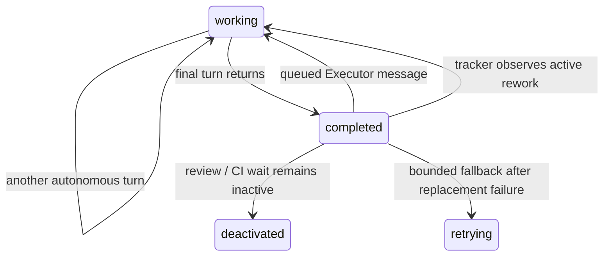

# fix: Re-arm completed runners on rework

## Summary

Represent a runner that has crossed its final turn boundary separately from a working runner, release its dispatch capacity immediately, and replace it when tracker rework or a queued Executor message requires another turn. Keep the durable queue and persisted backend session as the continuity boundaries.

---

## Problem Frame

An agent publishes `turn_completed` before its runner task finishes post-turn bookkeeping and session teardown. If that tail stalls, the orchestrator retains a `:working` entry with no active turn; messages are accepted into the durable queue but only wake the returned task's mailbox, active-state reconciliation merely refreshes the entry, and the stale row consumes a slot until pause/resume or the broad stall watchdog intervenes.

---

## Assumptions

*This plan was authored without synchronous user confirmation. The items below are agent inferences that fill gaps in the input and should remain visible during implementation and review.*

- The persisted session handle, not the lifetime of one `AgentRunner` task, is the intended thread-continuity boundary.
- A final turn boundary is safe to expose as completed before session teardown finishes because delivered queue items are already consumed or restored before that boundary is reported.
- Replacing a completed runner should use existing dispatch and teardown primitives rather than adding a second runner supervisor or scheduler.

---

## Requirements

- R1. A runner that will return after a completed turn must stop reporting `working` and stop consuming active capacity before its teardown tail finishes.
- R2. An accepted Executor message for a completed entry must remain durably ordered and cause a replacement runner to start without pause/resume.
- R3. A tracker transition from CI wait or review back to `rework` must replace a completed entry without duplicate dispatch.
- R4. Replacement must resume the persisted backend thread and consume queued items in their existing order.
- R5. A bounded reconciliation path must repair completed/active mismatches even when no Executor message arrives.
- R6. Multiple completed entries returned to rework together must each release and reacquire capacity according to the existing global and per-host gates.
- R7. Completing or replacing a runner must invalidate stale pause-containment timers so an already-finished process group is not reaped and a clean port exit is not reclassified as a failed turn.

---

## Scope Boundaries

- Keep queue storage, queue ordering, session-handle persistence, tracker state names, and general crash retry budgets unchanged.
- Do not treat the UI stream-idle `:sleeping` state as runner completion; it deliberately retains capacity and has different semantics.
- Do not broaden this fix into app-server teardown performance work unless implementation proves teardown itself violates an existing bounded contract.
- Do not split Executor delivery, roster truth, and rework re-arming into separate changes.

---

## Context & Research

### Relevant Code and Patterns

- `src/lib/aiur/agent_runner/turn_loop.ex` owns the final decision to recurse or return after a successful turn.
- `src/lib/aiur/orchestrator/pause_resume.ex` owns control-state transitions and fresh-task reactivation.
- `src/lib/aiur/orchestrator/reconciler.ex` owns active tracker-state reconciliation.
- `src/lib/aiur/orchestrator/operator_messages.ex` durably enqueues messages before notifying a running entry.
- `src/lib/aiur/orchestrator/retry_engine.ex` normally removes a runner on monitor `:DOWN` and schedules continuation.
- `src/lib/aiur/orchestrator/runtime_watchdog.ex` provides the existing bounded self-heal pattern for stale entries.
- `src/lib/aiur/orchestrator/agent_teardown.ex` provides monitored-task termination and claim release without clearing persisted session handles.
- `docs/plans/2026-06-24-010-fix-queued-drain-race-plan.md` establishes that queue items losing the parent-completion race are restored rather than failed.

### Institutional Learnings

- No `docs/solutions/` directory exists. The strongest local precedent is the completed-parent queue race plan and the orchestrator lifecycle modules' explicit ownership boundaries.

---

## Key Technical Decisions

- Add a distinct completed control state rather than overloading `:sleeping`, `:paused`, or `:deactivated`; only the new state means the runner has no more turns to execute.
- Emit the completed state from `TurnLoop` only on branches that return from the session loop, after queue bookkeeping and tracker refresh have chosen not to recurse.
- Count completed entries as non-active and non-reserved so status and slot admission become truthful immediately.
- Enqueue Executor messages first, then replace a completed entry, preventing a fresh runner from racing ahead of the message it was created to consume.
- Reconcile an active tracker issue plus completed entry through the same replace-and-dispatch operation, making the poll loop the bounded self-heal.
- Park a completed entry observed in CI wait or review as a no-task deactivated entry; never convert it to a paused state whose resume path assumes a live turn loop.
- Release the runner's pause-containment latch at the completed boundary and defensively before replacement so stale deadlines cannot act on the old process generation.
- Preserve the existing monitor-down continuation path as a fallback; stale `:DOWN` messages are harmless after replacement because refs are demonitor-flushed during teardown.

---

## High-Level Technical Design

> *This illustrates the intended approach and is directional guidance for review, not implementation specification.*

---

## Implementation Units

### U1. Expose the final runner boundary

**Goal:** Mark entries completed only when `TurnLoop` is returning control to the orchestrator.

**Requirements:** R1, R4, R7

**Dependencies:** None

**Files:**
- Modify: `src/lib/aiur/agent_runner/turn_loop.ex`
- Modify: `src/lib/aiur/agent_runner/message_handler.ex`
- Modify: `src/lib/aiur/orchestrator.ex`
- Modify: `src/lib/aiur/orchestrator/pause_resume.ex`
- Test: `src/test/aiur/agent_runner/turn_loop_test.exs`
- Test: `src/test/aiur/orchestrator/pause_resume_test.exs`

**Approach:** Extend worker-control reporting with a completed state and send it from successful return branches, never from recursive continuation branches. Store the state through the existing orchestrator control-status owner.

**Test scenarios:**
- Happy path: an active issue below the turn cap recurses without reporting completed.
- Boundary: max turns reached reports completed before returning `:ok`.
- Boundary: refreshed inactive state reports completed before returning `:ok`.
- Error path: failed turns do not report completed.
- Race: an armed containment deadline is released before the completed control state is reported and never reaps the cleanly exited app-server.

**Verification:** The orchestrator can distinguish a live in-turn runner from a task performing only its return/teardown tail.

### U2. Make capacity and status truthful

**Goal:** Ensure completed entries are visible but do not consume active or reserved slots.

**Requirements:** R1, R6

**Dependencies:** U1

**Files:**
- Modify: `src/lib/aiur/orchestrator/state.ex`
- Modify: `src/lib/aiur/orchestrator/waiting_reason.ex`
- Test: `src/test/aiur/orchestrator/state_test.exs`
- Test: `src/test/aiur/orchestrator/slots_test.exs`
- Test: `src/test/aiur/orchestrator/waiting_reason_test.exs`
- Test: `src/test/aiur/orchestrator_status_test.exs`

**Approach:** Add a completed-entry predicate, exclude it from active slot counts, retain it in status snapshots with an actionable non-working control state, and classify active-ticket completion as awaiting dispatch rather than active work.

**Test scenarios:**
- Capacity: several completed entries consume zero active and zero reserved slots.
- Status: a completed entry reports its completed work state and is not rendered as working.
- Compatibility: sleeping entries still retain slots and paused/deactivated accounting is unchanged.

**Verification:** `status`/watch snapshots and slot calculations agree about whether a worker task can execute another turn.

### U3. Re-arm from messages and tracker transitions

**Goal:** Replace completed entries from both explicit Executor messages and normal active-state reconciliation.

**Requirements:** R2, R3, R4, R5, R6

**Dependencies:** U1, U2

**Files:**
- Modify: `src/lib/aiur/orchestrator/pause_resume.ex`
- Modify: `src/lib/aiur/orchestrator/operator_messages.ex`
- Modify: `src/lib/aiur/orchestrator/reconciler.ex`
- Test: `src/test/aiur/orchestrator/operator_messages_test.exs` or nearest existing operator-message integration test
- Test: `src/test/aiur/orchestrator/reconciler_test.exs`
- Test: `src/test/aiur/regression/orchestrator_lifecycle_test.exs`

**Approach:** Introduce one orchestrator-owned completed-entry replacement operation that terminates/demonitors the old task, preserves queue and session artifacts, refreshes the issue, and dispatches through existing capacity gates. Invoke it after message persistence and when polling observes a completed entry in an active state. If capacity is unavailable, retain a truthful completed entry and let the next poll retry.

**Test scenarios:**
- Executor path: message enqueue is observable before replacement dispatch and remains first in queue order.
- Tracker path: CI-wait/review entry completed, then refreshed to rework, starts a fresh runner without pause/resume.
- Inactive boundary: a completed entry refreshed in CI wait or review is parked without a live pid; its later rework transition uses fresh dispatch rather than a resume control message.
- Fleet path: multiple completed entries transition to rework together; available capacity starts the allowed set and later polls drain the remainder.
- Continuity: replacement leaves the persisted session handle untouched and passes the existing issue identity into dispatch.
- Race: late `:DOWN` for the replaced runner does not remove or retry the new runner.
- Race: a stale containment fallback from the old runner is cancelled/ignored and cannot produce `turn_ended_with_error` with `port_exit 0` after replacement.
- Capacity: failed admission retains completed state and retries on a later reconciliation tick.

**Verification:** Focused regression coverage demonstrates both wake sources and the poll-loop self-heal without duplicate runners or queue reordering.

---

## System-Wide Impact

- **Interaction graph:** `TurnLoop` reports the boundary to `Orchestrator`; `PauseResume` stores/replaces; `OperatorMessages` and `Reconciler` trigger replacement; `State`, `Slots`, and `StatusReport` expose the result.
- **Error propagation:** Dispatch admission failures remain ordinary capacity deferrals; actual spawned-task failures continue through `RetryEngine`.
- **State lifecycle risks:** The critical race is an old monitor `:DOWN` arriving after replacement; demonitor-and-flush plus ref matching must keep it from touching the new entry.
- **API surface parity:** CLI message sends, trusted review-event queueing, and tracker label transitions all converge on the same completed-entry behavior.
- **Integration coverage:** Multi-agent rework and queue-before-spawn ordering require orchestrator-level tests, not only pure state tests.
- **Unchanged invariants:** One running-map entry per issue, durable FIFO queue semantics, persisted session handles, active-state capacity gates, and existing retry budgets remain intact.

---

## Risks & Dependencies

| Risk | Mitigation |
|------|------------|
| A completed signal arrives just before a late queue item | Persist the item before replacement and let the replacement drain the durable queue. |
| Replacement races the old monitor | Terminate and demonitor with `[:flush]` before dispatch; retain ref-based `:DOWN` matching. |
| Completed entries repeatedly fail capacity admission | Keep them non-slot-consuming and let each bounded poll reconciliation retry. |
| A normal autonomous continuation is marked completed | Emit only from return branches after the recurse decision. |
| CI-wait semantics regress | Keep CI-wait/review inactive handling separate; only active rework triggers replacement. |

---

## Documentation / Operational Notes

- Update lifecycle/status documentation only if the completed work-state is user-visible outside existing status output.
- Real background-run validation must be performed from an allowed Executor checkout because agent workspaces cannot run the protected dogfood harness.

---

## Sources & References

- Issue #1063
- `src/lib/aiur/agent_runner/turn_loop.ex`
- `src/lib/aiur/orchestrator/operator_messages.ex`
- `src/lib/aiur/orchestrator/reconciler.ex`
- `src/lib/aiur/orchestrator/retry_engine.ex`
- `src/lib/aiur/orchestrator/runtime_watchdog.ex`
- `docs/plans/2026-06-24-010-fix-queued-drain-race-plan.md`
