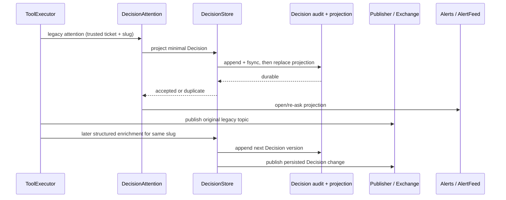

# feat: Add legacy attention decision adapter

## Summary

Extend the existing DecisionStore and DecisionAttention paths so active legacy
attentions become durable, custom-response-only Decisions before reminders or
events fan out, while a later structured request upgrades the same ticket-and-
slug record instead of creating a second Decision.

---

## Problem Frame

Legacy `attention.*` signals currently persist only an open slug and a lossy
alert-log question. They remain visible as reminders, but they do not enter the
restart-safe Decision audit introduced by OCC-1, and the generic tool path
publishes them before any Decision record exists. That leaves the future inbox
unable to represent older or unstructured requests consistently.

---

## Assumptions

*This plan was authored without synchronous user confirmation. The items below are agent inferences that fill gaps in the input — un-validated bets that should be reviewed before implementation proceeds.*

- Every signal already accepted by `Aiur.DecisionAttention` represents a
  blocking operator decision because that component currently labels each one
  “Operator decision required” and emits `needs_attention: true`.
- A structured request that explicitly correlates itself to an attention slug
  is authorized to enrich that Decision within its already-trusted ticket
  scope; it may not select a Decision from another ticket.
- Startup import is best-effort for active alerts discoverable through the
  current project-scoped `AlertFeed`; the adapter must not ingest alerts from a
  different repository merely because ticket identifiers collide.

---

## Requirements

- R1. Project each live legacy `attention.*` and operator-decision
  `blocked`/`pause.request` signal into exactly one minimal Decision keyed by
  trusted ticket identifier plus attention slug, with the question, blocking
  state, slug/source-alert provenance, available trusted ticket context, and no
  invented options.
- R2. Persist the canonical Decision audit and current projection before
  publishing the legacy event, emitting an alert/reminder, or broadcasting
  Decision changes; a persistence failure must fail the tool action without a
  false reminder or open-attention update.
- R3. Import discoverable active legacy attention alerts at startup into the
  same store, preserving a valid alert timestamp only as source provenance,
  without importing resolved alerts or cross-project records.
- R4. Allow a later structured `decision.requested` event to reference the
  legacy slug and append a richer next version to the same Decision identity;
  retries deduplicate and an unknown or cross-ticket correlation fails closed.
- R5. Preserve append-only history, OCC-1 validation/redaction, existing
  generic event topics, open-attention bookkeeping, bounded re-asks, and alert
  resolution behavior.

---

## Scope Boundaries

- Do not implement answers, dispatch correlation, acknowledgement, or the full
  Decision lifecycle owned by OCC-3.
- Do not add dashboard, Presenter, REST, autonomy, revision, fleet, outcome, or
  latency surfaces owned by OCC-4 through OCC-9.
- Do not turn arbitrary alerts, progress events, or generic
  `decision.<slug>` coordination events into Decisions.
- Do not create another store, event bus, reminder registry, or migration file;
  `DecisionStore`, `DecisionAttention`, `AlertFeed`, `SubscriptionStore`, and
  the existing Publisher/Exchange path remain the owners.

### Deferred to Follow-Up Work

- Canonical answered/resolved/delivery state transitions remain in OCC-3; the
  existing legacy `.resolved` alert and `SubscriptionStore` behavior stays
  intact until that lifecycle lands.

---

## Context & Research

### Relevant Code and Patterns

- `docs/operator-control-center/02-occ-0-audit-and-design-decisions.md` assigns
  legacy adaptation to `DecisionAttention` and canonical writes to
  `DecisionStore`, with persist-before-notify ordering.
- `docs/operator-control-center/03-occ-1-decision-contract.md` defines stable
  source identity, exact version progression, append-only history, trusted
  ticket/source injection, and post-persist Exchange/PubSub notification.
- `src/lib/aiur/decision_attention.ex` owns live open/resolve bookkeeping,
  timers, and alert projection.
- `src/lib/aiur/alert_feed.ex` already reconstructs the active alert view by
  resolving `.resolved` records across local and central logs.
- `src/lib/aiur/decision_store.ex` and
  `src/lib/aiur/decision_projection.ex` provide the only canonical mutation,
  replay, version, and notification seams.
- `src/lib/aiur/agent_runner/tool_executor.ex` is the trusted ticket/session
  boundary and the current legacy attention synchronization point.

### Institutional Learnings

- `docs/plans/2026-07-12-001-feat-decision-domain-persistence-plan.md` keeps
  alerts as lossy projections and explicitly defers legacy attention import and
  enrichment to OCC-2.
- The repository has no `docs/solutions/` material for this subsystem; the
  accepted OCC-0 note and merged OCC-1 contract are the local source of truth.

### External References

- None. The repository contains direct, current patterns for every required
  persistence, projection, validation, and event-ordering behavior.

---

## Key Technical Decisions

- Represent legacy provenance as optional validated Decision metadata carrying
  the slug and source alert topic. Keep it in the content integrity hash so
  replay detects provenance corruption, while omitting the field for existing
  OCC-1 records preserves their hashes and compatibility.
- Derive the canonical legacy source identity from ticket scope plus slug.
  Structured enrichment uses an explicit slug correlation handled at the
  trusted ToolExecutor boundary, rather than trusting an agent-provided
  Decision ID or relaxing OCC-1’s source-ID isolation.
- Add adapter-specific serialized mutations to DecisionStore. Minimal repeats
  may update the question without erasing richer structured fields, and
  structured enrichment remains one append on the same history rather than a
  second writer or caller-side read/modify/write race.
- Reconstruct startup candidates through a project-scoped AlertFeed projection,
  not by parsing raw logs in DecisionAttention or treating alert logs as the new
  source of truth.
- Preflight live attention persistence before the generic Publisher call. The
  existing attention topic and alert still fire after acceptance, preserving
  compatibility while satisfying persist-before-notify.

---

## Open Questions

### Resolved During Planning

- How should a legacy and structured request join? Use the accepted OCC-0 key:
  trusted ticket identifier plus attention slug, with a bounded correlation
  hint at the tool boundary.
- Should current alerts become the canonical store? No. They are migration
  input and notification projections only; DecisionStore remains canonical.
- Should a minimal repeat overwrite structured context? No. It may refresh the
  legacy question but must preserve already-enriched fields.

### Resolved During Implementation

- The adapter uses separate `DecisionStore.project_attention/4` and
  `DecisionStore.enrich_attention/4` mutations so minimal refresh and structured
  enrichment keep distinct contracts while sharing the store's serialized
  persistence path.

---

## High-Level Technical Design

> *This illustrates the intended approach and is directional guidance for review, not implementation specification. The implementing agent should treat it as context, not code to reproduce.*

---

## Implementation Units

### U1. Extend Decision provenance and atomic adapter mutations

**Goal:** Give the canonical domain enough validated provenance and serialized
mutation behavior to create, replay, refresh, and enrich a legacy attention
without changing existing OCC-1 records or bypassing version/history rules.

**Requirements:** R1, R2, R4, R5

**Dependencies:** Merged OCC-1 / PR #1017

**Files:**
- Modify: `src/lib/aiur/decision.ex`
- Modify: `src/lib/aiur/decision_validation.ex`
- Modify: `src/lib/aiur/decision_projection.ex`
- Modify: `src/lib/aiur/decision_store.ex`
- Test: `src/test/aiur/decision_validation_test.exs`
- Test: `src/test/aiur/decision_projection_test.exs`
- Test: `src/test/aiur/decision_store_test.exs`

**Approach:**
- Add optional, trusted legacy-attention metadata with bounded slug/topic
  validation and replay-safe serialization.
- Preserve historical content hashes by including this metadata only when it is
  present.
- Keep minimal projection and structured enrichment inside the DecisionStore
  GenServer so identity lookup, dedup, next-version selection, merge-with-
  current behavior, append, projection replacement, and notification remain one
  serialized operation.
- Preserve richer context/options on later minimal repeats and use trusted
  source event identity plus content/version rules to deduplicate structured
  retries.

**Execution note:** Implement the new store transitions test-first because a
wrong merge or replay rule can silently corrupt append-only history.

**Patterns to follow:**
- `Aiur.DecisionValidation.normalize/2` for one validation pipeline on ingress
  and replay.
- `Aiur.DecisionStore.evaluate_and_apply/3` and `persist_and_notify/3` for
  conflict semantics and persist-before-notify.

**Test scenarios:**
- Happy path: a minimal attention creates version 1 with ticket/slug/topic,
  `blocking: true`, empty options, and one history record.
- Dedup: the same minimal attention is returned as a duplicate with no append,
  event-ID allocation, Exchange message, or PubSub broadcast.
- Enrichment: a structured request for the same ticket/slug becomes version 2
  on the original Decision ID and adds context/options/recommendation without a
  second current record.
- Retry: redelivery of the same structured tool action remains one enrichment
  record even after the current state has advanced.
- Edge case: a changed minimal question appends a new version while retaining
  existing structured fields rather than downgrading the Decision.
- Error path: an unknown slug correlation, mismatched provenance topic, unsafe
  slug, stale explicit version, or different ticket is rejected without an
  audit append or notification.
- Compatibility: replay of pre-OCC-2 records without legacy metadata keeps its
  original content hash and remains writable.
- Restart: enriched legacy history replays into one current Decision with all
  versions intact.

**Verification:**
- Store list/history and both durable files prove one identity, append-only
  versions, intact provenance, and unchanged OCC-1 replay behavior.

### U2. Project active and live legacy attentions through existing owners

**Goal:** Import discoverable active attentions and make every new
DecisionAttention open durable before its subscription, timer, or alert
projection changes.

**Requirements:** R1, R2, R3, R5

**Dependencies:** U1

**Files:**
- Modify: `src/lib/aiur/alert_feed.ex`
- Modify: `src/lib/aiur/decision_attention.ex`
- Test: `src/test/aiur/alert_feed_test.exs`
- Test: `src/test/aiur/decision_attention_test.exs`

**Approach:**
- Add a focused AlertFeed projection that returns only active, project-scoped
  decision-attention topics with recovered ticket, slug, question, source
  topic, and timestamp.
- On DecisionAttention startup, project those candidates through DecisionStore
  and restore bounded re-asks/open-attention bookkeeping without emitting a
  duplicate immediate alert.
- On live open, synchronously project first; only then update
  SubscriptionStore, emit the alert, and schedule the timer. Keep resolve and
  `.resolved` alert compatibility unchanged.
- Inject loader/projector callbacks in focused tests so ordering and failures
  are deterministic without a second store implementation.

**Execution note:** Add ordering and failure tests before moving the live alert
side effects.

**Patterns to follow:**
- `AlertFeed.list/1` active-resolution fold for durable legacy discovery.
- Existing DecisionAttention callback injection for isolated alert tests.

**Test scenarios:**
- Import: active local and central attention alerts become normalized
  candidates; resolved, non-attention, and other-project alerts are ignored.
- Timestamp: a valid alert time is retained as `source_created_at` provenance
  while canonical `created_at` remains store acceptance time; malformed
  timestamps cannot crash startup.
- Ordering: the projector callback completes before SubscriptionStore mutation
  or alert emission.
- Failure: a store rejection returns an error and emits no alert, opens no
  attention, and schedules no re-ask.
- Idempotency: restart import over an already-projected attention does not add a
  Decision version or immediate reminder.
- Compatibility: re-ask and resolve still emit the same alert topics and clear
  the same SubscriptionStore slug.

**Verification:**
- Active legacy alerts survive the adapter restart as one durable Decision, and
  live alerts never precede canonical persistence.

### U3. Correlate tool events and document the compatibility contract

**Goal:** Route live legacy and structured calls through the adapter in the
correct order while preserving every unrelated dynamic event behavior.

**Requirements:** R1, R2, R4, R5

**Dependencies:** U1, U2

**Files:**
- Modify: `src/lib/aiur/agent_runner/tool_executor.ex`
- Modify: `docs/operator-control-center/03-occ-1-decision-contract.md`
- Create: `docs/operator-control-center/04-occ-2-attention-adapter.md`
- Test: `src/test/aiur/agent_runner/tool_executor_test.exs`

**Approach:**
- Preflight only legacy attention-producing event names through
  DecisionAttention, then publish their unchanged generic topics.
- Return the correlated Decision identity/version alongside the existing event
  result so a later structured call can deliberately reference the slug.
- At the trusted ticket/session boundary, translate the bounded slug
  correlation into canonical legacy provenance and use the adapter enrichment
  mutation; never accept an arbitrary agent-supplied canonical ID.
- Keep `attention.resolved`, ordinary blocked/pause events, progress,
  coordination decisions, and custom events on their existing paths.
- Document identity, ordering, migration limits, enrichment/retry semantics,
  and the lifecycle explicitly deferred to OCC-3.

**Test scenarios:**
- Integration: attention tool call persists first, then emits the original
  attention event and alert, and returns one Decision identity/version.
- Integration: an operator-decision blocked/pause call uses the fixed legacy
  slug and the same persistence order.
- Enrichment: a later structured call with the same slug updates the same
  Decision, and a retry with the same protocol call ID does not append again.
- Error path: store failure prevents generic publication and yields a
  Decision-specific tool failure.
- Security: agent-supplied ticket, source, Decision ID, or mismatched legacy
  topic cannot redirect enrichment outside the bound issue.
- Regression: `attention.resolved` still clears the slug; non-decision
  blocked/pause, progress, arbitrary coordination decisions, and custom events
  retain their topics and payload behavior.

**Verification:**
- A real ToolExecutor-to-DecisionStore test proves one durable identity and
  post-persist legacy/structured event order without changing unrelated tools.

---

## System-Wide Impact

- **Interaction graph:** ToolExecutor calls DecisionAttention before the generic
  Publisher; DecisionAttention delegates canonical writes to DecisionStore;
  AlertFeed supplies startup candidates; existing Exchange/PubSub/Alerts remain
  read-model fanout.
- **Error propagation:** Validation, store health, append, or projection errors
  fail the dynamic action before an attention appears; bootstrap import logs a
  bounded warning and leaves DecisionStore health authoritative.
- **State lifecycle risks:** Startup redelivery and repeated tool calls must
  deduplicate; minimal repeats must not erase structured context; resolved
  state remains split between the legacy SubscriptionStore and future OCC-3
  lifecycle until that ticket lands.
- **API surface parity:** Direct structured requests remain unchanged unless
  they opt into a legacy slug correlation. No dashboard/API mutation exists in
  this ticket.
- **Integration coverage:** Store-only tests cannot prove Publisher/alert order,
  while ToolExecutor-only mocks cannot prove append-only enrichment; both
  focused layers are required.
- **Unchanged invariants:** DecisionStore is the only canonical writer, alert
  logs remain projections, Publisher guards direct `decision.requested`
  publication, and generic agent event names retain compatibility.

---

## Risks & Dependencies

| Risk | Mitigation |
|------|------------|
| Startup import crosses repository boundaries | Scope workspace roots through the configured tracker repository and treat the current central alert log as instance-local. |
| A legacy re-open downgrades a structured Decision | Merge the minimal question into current content inside the serialized store rather than normalizing a replacement snapshot. |
| New metadata invalidates OCC-1 audit hashes | Omit absent metadata from hash input and add explicit old-record replay coverage. |
| Publish failure occurs after durable acceptance | Preserve the durable Decision and return the existing event failure; consumers recover from DecisionStore rather than assuming Exchange is storage. |
| OCC-3 changes lifecycle shape | Keep resolution out of the canonical schema here and document the temporary legacy open-state join explicitly. |

---

## Documentation / Operational Notes

- Extend the OCC-1 handoff doc and add a concise OCC-2 adapter contract covering
  migration, identity, ordering, enrichment, and what remains legacy.
- No storage migration or destructive rewrite is required; active legacy logs
  seed ordinary append-only version-1 Decision records.
- Agent workspaces may not run `scripts/aiurdev --test`; this backend adapter is
  verified with focused module and cross-layer tests. Operator-root TUI testing
  remains appropriate once OCC-4 exposes the inbox.

---

## Sources & References

- **Origin document:** `docs/operator-control-center/00-prd.md`
- **Decomposition:** `docs/operator-control-center/01-brainstorm-and-decomposition.md`
- **Accepted architecture:** `docs/operator-control-center/02-occ-0-audit-and-design-decisions.md`
- **Merged domain contract:** `docs/operator-control-center/03-occ-1-decision-contract.md`
- **Dependency PR:** #1017
- **Ticket:** #980
