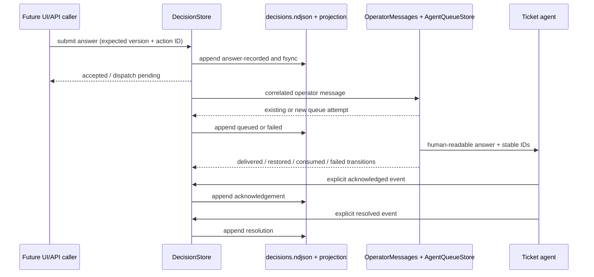
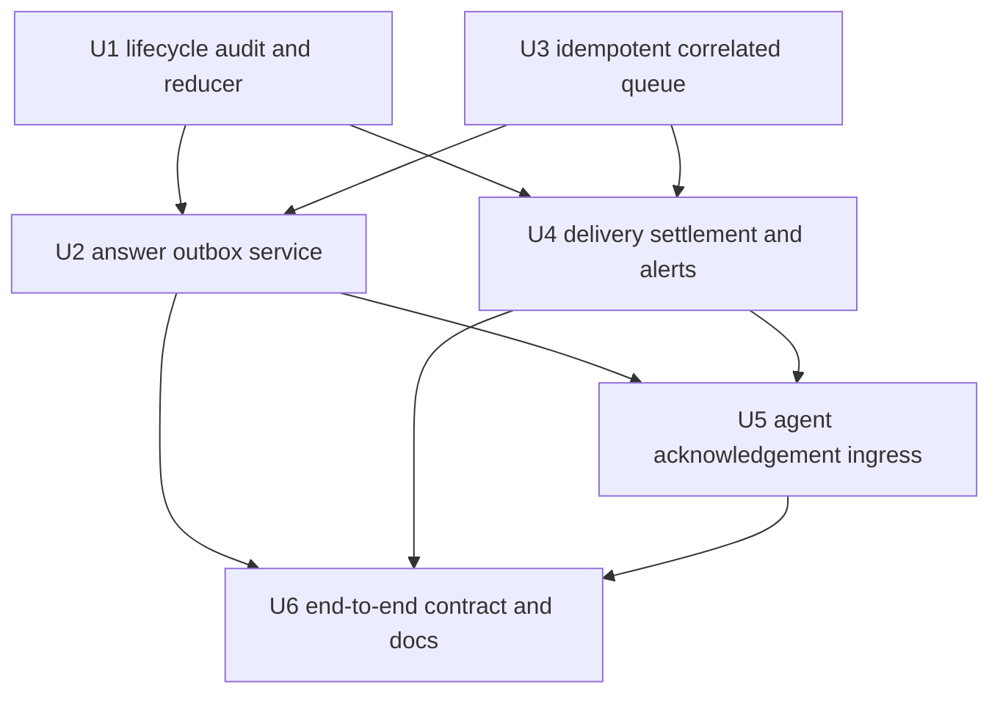

# feat: Add durable decision answer delivery

## Summary

Extend the existing `Aiur.DecisionStore` audit/projection into a durable answer
outbox, then carry one stable action identity through
`Aiur.Orchestrator.OperatorMessages`, `Aiur.AgentQueueStore`, and explicit agent
acknowledgement. Keep decision state and transport state separate while making
every answer and delivery transition replayable after a restart.

---

## Problem Frame

OCC-1 made decision requests durable, but an operator answer still has no
canonical record, no idempotent route into the existing operator-message queue,
and no correlated lifecycle after queue acceptance. A retry, LiveView reconnect,
or daemon restart can therefore either lose an answer or enqueue it twice, and
queue consumption cannot honestly prove that the target agent understood it.

---

## Assumptions

*This plan was authored without synchronous user confirmation. The items below
are agent inferences that fill gaps in the input and should be reviewed before
implementation proceeds.*

- OCC-3 may reserve the exact `decision.acknowledged` and `decision.resolved`
  event names at the existing agent-tool boundary instead of adding a new agent
  tool; unrelated `decision.<slug>` coordination events remain generic.
- The correlated operator-message API may return the existing queue item's
  status and timestamps, while the current plain-text chat API keeps returning
  only its integer queue handle for compatibility.
- Automatic recovery retries durable pending or interrupted dispatches.
  Explicitly failed attempts stay actionable and use a deliberate retry of the
  same logical action rather than an unbounded background retry loop.

---

## Requirements

- R1. Validate and durably append an operator answer before attempting any
  agent wake, resume, queue insert, or event/alert publication.
- R2. Accept either one selected current option or one bounded custom response,
  plus optional rationale and a trusted actor, and preserve a human-readable
  answer for agents without dashboard access.
- R3. Reject an answer whose expected decision version is stale, whose target
  is already resolved/superseded, or whose selected option does not exist on
  the current decision.
- R4. Give every accepted answer one stable logical action ID scoped to its
  Decision and enforce idempotency: the same Decision/client key plus the same
  content is a replay; a conflicting reuse is rejected; two Decisions cannot
  collide merely because their callers reused the same client token; concurrent
  distinct answers to one Decision have one deterministic winner.
- R5. Preserve decision lifecycle and delivery lifecycle separately. Queue
  acceptance, backend handoff, turn consumption, acknowledgement, and
  resolution must never be collapsed into one state transition.
- R6. Carry the decision ID, decision version, action ID, actor, selected/custom
  answer, and rationale through the existing `OperatorMessages` path and its
  wake/resume capability gates.
- R7. Keep one queue item per action ID for an orchestrator/queue-store
  lifetime, including after that item becomes delivered, consumed, restored,
  failed, or superseded. A conflicting reuse must fail rather than overwrite.
- R8. Correlate queue acceptance, delivery, restoration, consumption, and
  failure back into the canonical append-only Decision audit without changing
  unrelated queue items.
- R9. Reconcile durable non-terminal dispatch intents after a DecisionStore or
  daemon restart. Reuse the existing queue item while the queue survives and
  create a new attempt under the same action ID when the in-memory queue does
  not survive.
- R10. Require an explicit, ticket-scoped agent acknowledgement and explicit
  resolution event; queue claim or successful turn completion alone must not
  imply either.
- R11. Project delivery failures into the existing `Alerts`/`AlertFeed`
  attention mechanism and resolve that projection after a later successful
  retry or acknowledgement. The Decision audit remains canonical.
- R12. Publish lifecycle changes through the existing `Events.Exchange` and
  `DecisionPubSub` only after their audit record and current projection are
  durable.
- R13. Preserve replay compatibility with the request-only OCC-1 audit stream,
  including records written before lifecycle event discrimination or run stamps
  are added.
- R14. Demonstrate request-to-answer-to-queue-to-delivery-to-acknowledgement,
  stale-version rejection, restart recovery, and duplicate suppression with
  focused integration coverage.
- R15. Keep a durable answer tied to the request version it answered when a
  later OCC-2 enrichment advances the request version; enrichment must not
  erase, reopen, or automatically re-dispatch an already accepted action.

---

## Scope Boundaries

- Do not build the decision inbox, cards, detail view, answer controls, or
  writable/read-only LiveView UX; OCC-4 owns those surfaces.
- Do not add list/get/decide REST endpoints or supervising-agent authorization;
  OCC-7 will call the same application service built here.
- Do not project legacy attentions into Decisions; OCC-2 owns that adapter.
- Do not implement revisions or superseding follow-up dispatch; OCC-8 owns the
  revision model.
- Do not add fleet-state, history UI, outcomes, or latency dashboards owned by
  OCC-5, OCC-6, and OCC-9.
- Do not add SQLite, Ecto migrations, a second message bus, a second queue, or a
  ticket-workspace source of truth.
- Do not claim exactly-once delivery across a daemon/agent crash boundary. The
  contract is one logical action with at-least-once attempts and replay-aware
  agent intake.
- Do not infer acknowledgement, resolution, or applied side effects from a
  queue item becoming consumed.

### Deferred to Follow-Up Work

- Decision UI and browser reconnect behavior: OCC-4, consuming the idempotent
  answer API and `DecisionPubSub` refresh signal from this plan.
- Supervising-agent answer/API authorization: OCC-7, using the trusted actor and
  action contracts from this plan.
- Decision revisions and follow-up dispatch: OCC-8, adding new lifecycle events
  without rewriting the original answer.
- Decision latency aggregation: OCC-9, deriving metrics from the timestamps
  persisted here.

---

## Context & Research

### Relevant Code and Patterns

- `docs/operator-control-center/02-occ-0-audit-and-design-decisions.md` fixes the
  durable outbox, at-least-once, queue-correlation, explicit-acknowledgement, and
  no-second-queue decisions.
- `docs/operator-control-center/03-occ-1-decision-contract.md` documents the
  landed OCC-1 request schema, optimistic version rules, single-writer store,
  crash-safe log, projection repair, and later-ticket extension seam.
- `src/lib/aiur/decision_store.ex` is the only public Decision mutation service
  and the only writer of `decisions.ndjson` / `decisions.json`.
- `src/lib/aiur/decision_projection.ex` re-validates every canonical record and
  rebuilds current state from the audit prefix; lifecycle support must extend
  this reducer rather than introduce a second projection.
- `src/lib/aiur/orchestrator/operator_messages.ex` owns message validation,
  paused/deactivated wake behavior, delivery-policy normalization, and queue
  transition APIs.
- `src/lib/aiur/agent_queue_store.ex` already retains every in-memory queue item
  through terminal states. Its existing `dedupe_key` intentionally supersedes
  pending coordination events, so answer idempotency needs a separate invariant
  rather than changing that behavior.
- `src/lib/aiur/agent_runner/queue_drain.ex` and
  `src/lib/aiur/agent_runner/checkpoint_delivery.ex` are the shared handoff
  points for queued turns, safe checkpoints, and immediate REPL delivery.
- `src/lib/aiur/agent_runner/tool_executor.ex` already reserves
  `decision.requested` for durable ingress while leaving unrelated
  `decision.<slug>` events on the generic Publisher path.
- `src/lib/aiur/alert_feed.ex` resolves a ticket attention by a stable slug plus
  `.resolved`; delivery-failure notifications can reuse that projection without
  becoming storage.

### Institutional Learnings

- No `docs/solutions/` directory exists on the current branch. The closest
  repository-owned guidance is the accepted OCC-0 decision note and the recent
  operator-message refactor plan at
  `docs/plans/2026-07-11-001-refactor-operator-message-concerns-plan.md`.
- Queue settlement is deliberately best-effort at runner teardown so an
  unavailable orchestrator does not crash an otherwise successful agent turn.
  Decision correlation must preserve that liveness property while making
  missed settlement recoverable from the durable outbox.

### External References

- None. The repository has direct, recent patterns for every affected layer,
  and OCC-0 already chose the persistence and delivery semantics.

---

## Key Technical Decisions

| Decision | Rationale |
|---|---|
| Extend the existing Decision audit with backward-compatible, discriminated lifecycle events | Answer, dispatch, acknowledgement, and resolution are distinct facts at the same decision version. Typed events preserve append-only history without abusing request-version snapshots or rewriting OCC-1 records. |
| Keep one current Decision projection containing independent decision and delivery substates | Operators must distinguish "answered" from "queued", "delivered", "acknowledged", and "resolved"; one combined status would recreate the ambiguity the PRD rejects. |
| Keep request version and lifecycle sequence independent | An answer records the request version it addressed, but answer/queue/ack events do not increment that version. Later structured enrichment can advance request context without rewriting or silently replaying the accepted action. |
| Require a caller-stable idempotency token and derive its canonical action identity under Decision scope | Server-minted randomness after a reconnect cannot correlate an HTTP/LiveView retry, while a raw caller token can collide across Decisions. OCC-4/OCC-7 callers supply the token; DecisionStore preserves it for correlation and derives the Decision-scoped action ID used by the audit and queue. |
| Make `DecisionStore` schedule dispatch only after the answer mutation returns durable | The caller receives `dispatch_pending` after persistence, and no nested queue call can precede the audit barrier. Serialized scheduling also prevents two replay calls from dispatching concurrently. |
| Add answer idempotency separately from coordination-event `dedupe_key` | Coordination events intentionally supersede pending predecessors. Decision actions must instead return the same item across every queue state and reject conflicting reuse. |
| Carry structured correlation metadata beside human-readable queue text | Agents can act without the dashboard, while queue/store code can correlate transitions without parsing prose. The stable IDs in the text make at-least-once replay visible to the agent. |
| Persist backend handoff synchronously at the runner boundary; feed later Orchestrator settlements back asynchronously | The target agent cannot acknowledge before the delivered event is durable, while consume/restore/fail callbacks avoid a `DecisionStore`↔Orchestrator call cycle. Idempotent reconciliation covers missed casts. |
| Treat queue consumption as transport evidence only | A successful turn proves the message was presented to a backend, not that the agent understood or applied the answer. Only the reserved agent lifecycle ingress advances acknowledgement/resolution. |
| Retry one logical action, never mint a replacement answer | A DecisionStore restart reuses the action ID. A surviving queue returns its existing item; a restarted queue creates a new attempt beneath that same action. |
| Use stable, per-action failure-attention slugs | `Alerts`/`AlertFeed` can keep one actionable projection per failed answer and resolve it after recovery without producing duplicate cards or becoming canonical state. |

---

## Open Questions

### Resolved During Planning

- How is stale answer submission detected? Compare the submitted expected
  version with the current request version before appending the answer; return
  the current version in a structured conflict.
- Does a successful agent turn acknowledge a Decision? No. Record queue
  consumption as transport history and wait for explicit agent acknowledgement.
- How does a retried answer avoid a duplicate queue item? The durable action ID
  is also the queue idempotency identity, indexed across every queue state.
- What happens when DecisionStore restarts but Orchestrator does not? Reconcile
  through the correlated operator-message API; it returns the already-indexed
  queue item and current status so missing audit transitions can be repaired.
- What happens when the whole daemon restarts? Re-dispatch non-terminal intents
  with the same action ID and append a new attempt-specific queue handle.
- How are failed deliveries made visible? Append the failure first, then emit a
  stable attention projection through `Alerts`; later success resolves it.
- How do agents acknowledge? The exact lifecycle event names route through the
  same `emit_event` tool executor, with trusted ticket/session context injected
  before the DecisionStore call.
- How are older OCC-1 records handled? Treat request records without an event
  discriminator or run stamp as legacy request events and preserve their
  validated data during replay.

### Deferred to Implementation

- Exact helper/module boundaries inside the lifecycle reducer may shift once
  the existing projection tests are extended; the public store and persisted
  event contracts are the stable boundary.
- Retry timer constants and transient-error classification should follow the
  repository's existing bounded-backoff conventions after inspecting concrete
  Orchestrator error values during implementation.
- The exact operator-facing wording of the delivery envelope and failure alert
  remains implementation detail, provided it contains the required stable IDs,
  answer, actor, rationale, and replay instruction.

---

## High-Level Technical Design

> *This illustrates the intended approach and is directional guidance for
> review, not implementation specification. The implementing agent should treat
> it as context, not code to reproduce.*

The current projection keeps these axes independent:

| Decision state | Meaning | Delivery state examples |
|---|---|---|
| Open | No accepted answer exists | Not dispatched |
| Decided | One durable answer/action won | Pending, queued, delivered, or failed |
| Acknowledged | Target agent explicitly accepted the correlated action | Delivered/consumed evidence retained |
| Resolved | Target agent explicitly reports the fork handled | Terminal audit remains immutable |

---

## Implementation Units

### U1. Extend the canonical audit and projection with lifecycle events

**Goal:** Represent answer and transport facts as validated append-only events
while preserving request-only OCC-1 logs and current read compatibility.

**Requirements:** R3, R5, R8, R12, R13, R15

**Dependencies:** None

**Files:**
- Create: `src/lib/aiur/decision_answer.ex`
- Create: `src/lib/aiur/decision_event.ex`
- Modify: `src/lib/aiur/decision.ex`
- Modify: `src/lib/aiur/decision_projection.ex`
- Modify: `src/lib/aiur/decision_store.ex`
- Test: `src/test/aiur/decision_answer_test.exs`
- Test: `src/test/aiur/decision_projection_test.exs`
- Test: `src/test/aiur/decision_store_test.exs`

**Approach:**
- Define bounded normalized answer data with one option-or-custom response,
  optional rationale, trusted actor metadata, caller idempotency token,
  Decision-scoped action ID, expected request version, acceptance time, and a
  deterministic content hash.
- Introduce a discriminated audit envelope for request, answer, dispatch,
  acknowledgement, and resolution facts. Decode OCC-1 records without a
  discriminator as legacy request events.
- Extend the pure reducer to build current Decisions with separate decision and
  delivery substates, an immutable answer, attempt history, acknowledgement,
  and resolution fields. Keep request-version history available and add a
  complete audit-history read for future timeline consumers.
- Stamp new audit records with the reserved event ID and canonical run ID.
  Add the run stamp to newly written request events while continuing to accept
  older request records that lack it.
- Reuse `DecisionLog` append/fsync and projection-repair behavior; no lifecycle
  event may bypass full replay validation or silently skip an invalid interior
  record.

**Execution note:** Add reducer and replay compatibility tests before changing
the store write path so the landed OCC-1 stream remains a pinned fixture.

**Patterns to follow:**
- `src/lib/aiur/decision_validation.ex` for normalization, trusted context,
  bounds, shared redaction, and deterministic hashing.
- `src/lib/aiur/decision_projection.ex` for decode-through-ingress validation
  and fail-closed content-hash checks.
- `src/lib/aiur/decision_log.ex` for append acknowledgement and corrupt-prefix
  handling.

**Test scenarios:**
- Happy path: a legacy request plus answer, queued, delivered, acknowledged, and
  resolved events reduces to one current Decision with two independent state
  axes and a complete ordered audit history.
- Compatibility: an unmodified OCC-1 request-only log replays and serializes to
  the same open current state after the new event decoder is installed.
- Edge case: multiple dispatch attempts under one action keep their individual
  queue IDs/run IDs while the logical answer remains singular.
- Edge case: a restored attempt moves delivery back to pending/queued without
  reopening or deleting the answer.
- Edge case: a version-2 request enrichment after a version-1 answer preserves
  that answer and its attempt history, records which version it addressed, and
  does not schedule a second dispatch.
- Error path: a lifecycle record with a bad hash, unknown type, invalid state
  transition, wrong decision version, or malformed actor/answer is interior
  corruption and makes the store read-only at that line.
- Error path: a torn final lifecycle record is truncated as unacknowledged while
  the prior durable prefix remains writable.
- Integration: rebuilding `decisions.json` from only the audit stream preserves
  answer, all attempt timestamps, acknowledgement, and resolution.

**Verification:**
- Existing OCC-1 request/version tests remain valid, and the audit alone
  deterministically rebuilds the expanded current projection.

### U3. Add correlated idempotency to the existing operator queue

**Goal:** Reuse `OperatorMessages` and `AgentQueueStore` while returning one
stable queue item per logical decision action across all in-memory states.

**Requirements:** R4, R6, R7, R9

**Dependencies:** None

**Files:**
- Modify: `src/lib/aiur/agent_queue_item.ex`
- Modify: `src/lib/aiur/agent_queue.ex`
- Modify: `src/lib/aiur/agent_queue_store.ex`
- Modify: `src/lib/aiur/orchestrator/operator_messages.ex`
- Modify: `src/lib/aiur/orchestrator.ex`
- Test: `src/test/aiur/agent_queue_test.exs`
- Test: `src/test/aiur/orchestrator_status_test.exs`

**Approach:**
- Add structured Decision correlation and the canonical Decision-scoped action
  identity to operator queue items. Preserve the caller token in the durable
  answer, and preserve the current coordination-event `dedupe_key` supersede
  behavior unchanged.
- Maintain an in-memory action-to-item index covering pending, delivered,
  consumed, restored, failed, and superseded entries. An exact replay returns
  the existing item snapshot; mismatched target/body/correlation under the same
  key returns an idempotency conflict.
- Add a correlated operator-message API that threads this metadata through the
  existing validation, delivery-policy, paused/deactivated wake, capability,
  and notification paths. Keep the plain chat API and return shape unchanged.
- Permit a deliberate retry to restore the same failed correlated item within
  one queue lifetime; after an orchestrator restart, a new item ID is a new
  attempt under the same durable action.

**Execution note:** Characterize existing `dedupe_key` supersession and plain
operator-message returns before adding the independent action index.

**Patterns to follow:**
- `src/lib/aiur/agent_queue_store.ex` immutable transition helpers and pending
  indexes.
- `src/lib/aiur/orchestrator/operator_messages.ex` wake/resume gates and
  `DeliveryPolicy.notify_running_queue_update/2`.

**Test scenarios:**
- Happy path: correlated enqueue returns a new pending item with untouched
  human-readable body and complete structured metadata.
- Idempotency: replay under pending, delivered, consumed, failed, and
  superseded states returns the original item ID rather than allocating a new
  item.
- Conflict: the same action ID with different target, answer text, decision
  version, or actor is rejected without changing the prior item.
- Isolation: two Decisions using the same caller idempotency token derive
  different canonical action identities and enqueue independently.
- Retry: an explicitly retried failed action restores the same item once and
  notifies the running agent once.
- Restart boundary: a fresh queue store has no old transient index and accepts
  a new attempt with the same action ID.
- Regression: coordination-event dedupe still supersedes only pending matching
  predecessors; ordinary operator messages still allocate independently and
  expose the existing integer-handle result.
- Integration: paused and deactivated agents use the existing admission/wake
  gates before a correlated answer is queued, and capacity errors propagate to
  the outbox.

**Verification:**
- The queue contains at most one item for an action ID during its lifetime, and
  existing chat/event queue behavior is unchanged.

### U2. Add persist-before-dispatch answer and recovery APIs

**Goal:** Make `DecisionStore` the durable answer application service and
outbox, with stale-version checks, action idempotency, and restart reconciliation.

**Requirements:** R1, R2, R3, R4, R5, R6, R9, R12

**Dependencies:** U1, U3

**Files:**
- Create: `src/lib/aiur/decision_dispatch.ex`
- Modify: `src/lib/aiur/decision_store.ex`
- Modify: `src/lib/aiur/decision_pubsub.ex`
- Test: `src/test/aiur/decision_dispatch_test.exs`
- Test: `src/test/aiur/decision_store_test.exs`

**Approach:**
- Add one public answer mutation that validates the current decision/version,
  option/custom response, trusted actor, action identity, and current lifecycle
  before appending anything.
- Serialize concurrent answers in the existing GenServer. The first valid
  action wins; an exact replay returns the existing accepted result and a
  conflicting action/content reuse returns a matchable conflict.
- After the answer and projection are durable, return `dispatch_pending` and
  schedule the outbox action. Do not call the Orchestrator before the durable
  mutation or while processing a duplicate already known to be terminal.
- Render a bounded, redacted, human-readable delivery envelope containing the
  exact answer plus decision/action correlation and replay guidance, then call
  the correlated `OperatorMessages` path.
- Append queue acceptance or dispatch failure as a separate event. On startup,
  schedule every non-terminal durable intent once; use bounded retry only for
  transient Orchestrator unavailability and expose explicit retry for failed
  actions.
- Broadcast lifecycle refresh only after each event and projection are durable.

**Execution note:** Start with an injected-dispatcher test that reads the audit
inside the dispatcher callback and proves the answer exists before the first
queue call.

**Patterns to follow:**
- `src/lib/aiur/decision_store.ex` request acceptance, event-ID reservation,
  projection repair, and post-persist notification sequencing.
- `src/lib/aiur/orchestrator/operator_messages.ex` control API timeout and
  unavailable error handling.
- Existing Orchestrator bounded retry/backoff patterns; do not create an
  unbounded polling loop.

**Test scenarios:**
- Happy path: a valid option answer is fsynced before dispatch, returns one
  stable action, and records the correlated queue handle after acceptance.
- Happy path: a valid custom answer and rationale are redacted/bounded and
  rendered understandably without dashboard context.
- Idempotency: the same action ID and normalized answer returns duplicate with
  one audit answer and one queue action; the same action ID with different
  answer/actor/rationale returns conflict.
- Concurrency: two distinct answers submitted concurrently against one open
  version produce one accepted action and one deterministic already-decided
  rejection.
- Stale state: answering version 1 after a version-2 enrichment returns a
  stale-version conflict containing the current version and appends nothing.
- Error path: unknown option, both option and custom response, neither answer,
  overlong content, untrusted actor data, resolved decision, or read-only store
  rejects before dispatch.
- Failure path: transient Orchestrator unavailability records a non-terminal
  failed attempt and retries idempotently; target-agent-gone remains actionable
  without a busy loop.
- Restart: stop the store after answer persistence but before queue settlement,
  restart it on the same path, and observe exactly one reconciliation for the
  same action ID.
- Repair mode: projection failure after append prevents dispatch until the
  canonical projection is repaired.

**Verification:**
- No production answer path can call `OperatorMessages` before its answer event
  is durable, and every outstanding action is discoverable from the current
  projection after restart.

### U4. Correlate transport settlement and failure attentions

**Goal:** Append every relevant queue transition to the Decision audit and keep
failed delivery operator-visible without coupling queue correctness to the
dashboard.

**Requirements:** R5, R8, R9, R11, R12

**Dependencies:** U1, U3

**Files:**
- Modify: `src/lib/aiur/orchestrator/operator_messages.ex`
- Modify: `src/lib/aiur/agent_runner/queue_drain.ex`
- Modify: `src/lib/aiur/agent_runner/checkpoint_delivery.ex`
- Modify: `src/lib/aiur/decision_store.ex`
- Modify: `src/lib/aiur/alert_feed.ex`
- Test: `src/test/aiur/agent_runner/queue_drain_test.exs`
- Test: `src/test/aiur/agent_runner/checkpoint_delivery_test.exs`
- Test: `src/test/aiur/regression/agent_runner_lifecycle_test.exs`
- Test: `src/test/aiur/alert_feed_test.exs`

**Approach:**
- On correlated queue acceptance, backend handoff, restoration, consumption,
  failure, and retry, send an idempotent transition back to `DecisionStore`.
  Ignore unrelated queue items.
- At the shared runner handoff point, synchronously persist the correlated
  delivered event before exposing the answer text to the agent. This creates a
  reliable happens-before edge for an immediate acknowledgement; on failure,
  restore the queue item instead of presenting an untracked delivery.
- Feed later consume/restore/fail transitions asynchronously from Orchestrator
  so an outbox dispatch cannot deadlock with a synchronous callback into its
  own GenServer. The reducer accepts duplicate notifications and safely orders
  or rejects out-of-order transitions for the same attempt.
- Preserve the existing runner-liveness rule: unavailable Decision correlation
  logs/alerts the gap but does not convert a successful agent turn into a
  failure. Reconciliation repairs a surviving queue's status when possible.
- Emit one `Alerts` attention projection under a stable ticket/action slug only
  after a failure event is durable. Resolve that slug after successful retry,
  delivery, or acknowledgement; never scan AlertFeed as state.
- Re-project every currently unresolved failure after daemon restart and make
  `AlertFeed` collapse repeated opens for the same ticket/slug to one current
  item. This keeps at-least-once alert emission restart-safe without turning an
  alert-log write into a second settlement protocol.
- Keep `consumed_at` as transport evidence and leave the decision in Decided
  until explicit acknowledgement.

**Patterns to follow:**
- `src/lib/aiur/agent_runner/queue_drain.ex` existing OperatorWaitLog delivery
  point and exactly-once consume/restore/fail settlement.
- `src/lib/aiur/alert_feed.ex` ticket+slug attention resolution convention.
- `src/lib/aiur/decision_store.ex` post-persist side-effect ordering.

**Test scenarios:**
- Happy path: queue acceptance, handoff, and consumption append once with the
  correct action and queue attempt while decision state remains Decided.
- Immediate/checkpoint/queued-turn parity: each backend path records the same
  delivered transition at its shared handoff point.
- Restoration: pause, interruption, cancellation, and lost completion race
  record restoration and allow the same queue item to deliver again without a
  second answer.
- Failure: terminal turn/send failure records bounded failure detail, keeps the
  answer actionable, and creates one unresolved AlertFeed item.
- Recovery: a later retry/delivery resolves the same failure attention without
  deleting its historical alert or audit event.
- Restart: an unresolved canonical failure is projected into the new run's
  AlertFeed, and repeated projection/store restarts still expose one active item
  for its stable ticket/action slug.
- Idempotency: repeated transition callbacks and a store-reconciliation snapshot
  do not append duplicate lifecycle events.
- Isolation: coordination events and plain operator chat items produce no
  Decision audit transitions or failure attentions.
- Liveness: a stopped/read-only DecisionStore does not crash the queue drain or
  rewrite a successful turn result; a correlated item whose handoff cannot be
  recorded is restored and remains actionable rather than silently consumed.

**Verification:**
- A current Decision exposes accurate queued/delivered/failed transport state
  and attempt history, while AlertFeed is only a resolvable notification view.

### U5. Add explicit acknowledgement and resolution at agent ingress

**Goal:** Let the target ticket agent durably acknowledge and resolve the exact
answer it received, with replay/stale protection and no generic-event bypass.

**Requirements:** R4, R5, R6, R10, R12

**Dependencies:** U2, U4

**Files:**
- Modify: `src/lib/aiur/agent_runner/tool_executor.ex`
- Modify: `src/lib/aiur/events/publisher.ex`
- Modify: `src/lib/aiur/codex/dynamic_tool/emit_event.ex`
- Modify: `.claude/skills/aiur-agent/event-taxonomy.md`
- Modify: `.claude/skills/aiur-agent/emit-and-subscribe.md`
- Test: `src/test/aiur/agent_runner/tool_executor_test.exs`
- Test: `src/test/aiur/events/publisher_test.exs`
- Test: `src/test/aiur/codex/dynamic_tool/emit_event_test.exs`

**Approach:**
- Reserve the exact acknowledgement/resolution lifecycle names beside
  `decision.requested` in ToolExecutor. Inject the executing ticket, backend
  session, and tool invocation identity as trusted source context.
- Validate decision ID, current version, winning action ID, target ticket, and
  legal state transition in DecisionStore before appending and publishing.
- Make an exact acknowledgement/resolution replay return duplicate without a
  second append/publication; reject wrong-ticket, wrong-action, stale-version,
  pre-delivery, already-superseded, or conflicting lifecycle submissions.
- Update the emitted answer text and agent skill documentation so the agent sees
  the correlation IDs, knows a replay may occur, and knows the exact durable
  acknowledgement/resolution path. Do not rely on the agent having dashboard
  access.
- Extend Publisher's durable-topic guard so generic publication cannot bypass
  DecisionStore for the reserved lifecycle family; unrelated architectural
  `decision.<slug>` events keep their current behavior.

**Execution note:** Pin generic `decision.<slug>` compatibility and wrong-ticket
rejection before routing the exact lifecycle names.

**Patterns to follow:**
- `src/lib/aiur/agent_runner/tool_executor.ex` exact-name
  `decision.requested` branch and trusted source ID construction.
- `src/lib/aiur/events/publisher.ex` persisted-publication path and direct
  durability guard.

**Test scenarios:**
- Happy path: the target agent acknowledges the current action/version, then
  resolves it; both events append before Exchange/PubSub publication.
- Replay: the same acknowledgement or resolution tool call returns duplicate
  and publishes no second event.
- Stale/conflict: old decision version, wrong action ID, wrong ticket, or
  conflicting resolution detail is rejected with current correlation context.
- Invalid transition: acknowledgement before an answer/delivery and resolution
  before acknowledgement append nothing.
- Regression: `decision.requested` remains durable, generic
  `decision.use-something` remains generic, and lookalike custom names fail
  through the existing Publisher guard rather than crashing.
- Agent intake: the rendered answer contains selected/custom text, rationale,
  actor, decision ID/version, action ID, and explicit replay/ack instructions.

**Verification:**
- Only a trusted target-agent lifecycle event can advance Acknowledged or
  Resolved; neither state can be inferred from queue settlement.

### U6. Prove the end-to-end contract and document the handoff

**Goal:** Exercise the real application-service/queue seams together and leave
OCC-4/OCC-7/OCC-8 a precise contract rather than implementation folklore.

**Requirements:** R1–R15

**Dependencies:** U2, U4, U5

**Files:**
- Create: `src/test/aiur/decision_delivery_integration_test.exs`
- Create: `docs/operator-control-center/04-occ-3-answer-delivery-contract.md`
- Modify: `docs/operator-control-center/README.md`
- Modify: `docs/operator-control-center/03-occ-1-decision-contract.md`

**Approach:**
- Run an in-process DecisionStore plus Orchestrator/queue seam from request to
  answer, correlated queue acceptance, handoff, explicit acknowledgement, and
  resolution. Assert audit bytes and current projection at each boundary.
- Simulate LiveView/API retry by replaying the same action and stale browser
  state by answering an older decision version; no UI code is needed to prove
  the application-service contract OCC-4 will consume.
- Restart only DecisionStore to prove reuse of a surviving queue item, then
  restart both sides to prove a new queue attempt remains under the same action.
- Document public mutation/read results, persisted lifecycle event meanings,
  state-vs-delivery semantics, queue correlation, retry/restart behavior,
  explicit agent events, failure attention projection, and intentionally
  deferred UI/API/revision work.

**Patterns to follow:**
- `docs/operator-control-center/03-occ-1-decision-contract.md` capability/handoff
  structure.
- `src/test/aiur/decision_store_test.exs` isolated owner-only state directory and
  restart setup.
- `src/test/aiur/regression/agent_runner_lifecycle_test.exs` lightweight real
  Orchestrator queue lifecycle setup.

**Test scenarios:**
- Integration: request v1, answer one option, queue once, claim/deliver/consume,
  acknowledge, and resolve; current state and ordered audit match every step.
- Retry: repeat answer before queue, after queue, after delivery, and after
  acknowledgement; no second logical answer or duplicate queue item appears.
- Reconnect conflict: enrich to v2 before a v1 answer arrives; answer returns a
  stale conflict and the v2 Decision remains open.
- Store-only restart: pending outbox finds the already-enqueued item and records
  its current status without waking the agent twice.
- Full restart: a non-terminal action creates a new attempt with the same action
  ID; a consumed or acknowledged action does not re-dispatch.
- Failure recovery: unavailable target yields failed/actionable state and one
  attention; deliberate retry succeeds and resolves the projection.
- Corruption: lifecycle corruption leaves validated-prefix reads available and
  blocks answer/dispatch/ack mutations.

**Verification:**
- The documented contract matches executable integration assertions and gives
  downstream tickets one service/read model to extend.

---

## System-Wide Impact

- **Interaction graph:** Future DashboardLive/API callers enter DecisionStore;
  DecisionStore appends then schedules OperatorMessages; AgentQueueStore carries
  correlation; QueueDrain/CheckpointDelivery report settlement; ToolExecutor
  returns explicit agent acknowledgement/resolution to the same store.
- **Error propagation:** Validation/version/idempotency failures return
  structured conflicts before append. Canonical append or projection failure
  blocks dispatch. Queue acceptance failures become durable delivery state and
  attention projections. Best-effort transition feedback never crashes an agent
  turn.
- **State lifecycle risks:** Crash windows exist after answer append, after queue
  insert, and around backend handoff. Stable action IDs, queue-lifetime indexing,
  attempt IDs, synchronous delivered-before-agent handoff, canonical replay,
  and explicit acknowledgement make each window retryable without claiming
  exactly-once execution. Later request enrichment preserves rather than resets
  an accepted answer.
- **API surface parity:** OCC-3 adds the application-service contract only.
  OCC-4 LiveView and OCC-7 REST/supervisor routes must call it rather than
  duplicating validation or dispatch logic.
- **Integration coverage:** Pure reducer/queue tests cannot prove persistence
  precedes dispatch or that restart reconciliation reuses the queue. U6 covers
  those cross-GenServer boundaries.
- **Unchanged invariants:** Plain operator chat, coordination-event supersession,
  event subscriptions, DecisionAttention legacy reminders, dashboard write
  security, and request-version enrichment retain their existing contracts.

---

## Alternative Approaches Considered

- Store answer fields by appending another full Decision request snapshot at the
  same version: rejected because request version and lifecycle order are
  different dimensions, and replay validation would either ignore delivery
  facts or corrupt request history.
- Reuse `AgentQueueItem.dedupe_key` for action idempotency: rejected because its
  current semantics deliberately supersede pending coordination events and do
  not return the same item across terminal states.
- Mark Acknowledged when a queue item is consumed: rejected because a successful
  backend turn does not prove the agent understood or applied the decision.
- Add a durable second queue between DecisionStore and OperatorMessages:
  rejected because the accepted OCC-0 design makes DecisionStore's audit the
  outbox and requires reuse of the existing transport.
- Claim exactly-once delivery: rejected because DecisionStore, the in-memory
  queue, and an external agent session cannot atomically commit across a crash.

---

## Risk Analysis & Mitigation

| Risk | Likelihood | Impact | Mitigation |
|---|---|---|---|
| Cross-GenServer call cycle deadlocks DecisionStore and Orchestrator | Medium | High | Dispatch only after durable answer acceptance; persist handoff from the runner rather than Orchestrator; cast later queue settlements; test a concurrent dispatch/claim path. |
| Agent acknowledgement races the delivered event | Medium | High | Make the runner synchronously persist delivered status before it exposes the correlated answer text or tool executor to the agent. |
| New lifecycle decoder makes existing OCC-1 audit unreadable | Medium | High | Pin request-only log fixtures, recognize absent discriminator/run stamp as legacy, and test restart before lifecycle writes. |
| Retry creates duplicate agent work after a crash | Medium | High | Stable action/version in queue metadata and agent-visible envelope, queue-lifetime reuse, no retry after consumed/acknowledged terminal evidence, explicit replay instructions. |
| Queue status feedback arrives duplicated or out of order | High | Medium | Use attempt-scoped transition identities and an idempotent reducer that preserves monotonic facts while accepting restoration as an explicit event. |
| Projection fails after answer append | Low | High | Keep audit authoritative, enter repair/read-only mode, and forbid dispatch until projection repair succeeds. |
| Existing coordination dedupe or chat behavior regresses | Medium | High | Separate idempotency field/API, characterize current behavior first, and keep plain return shapes unchanged. |
| Failure reason or answer leaks secrets into durable state | Medium | High | Reuse shared SecretRedactor, bound serialized failure/answer data, store structured reason classes rather than arbitrary inspected terms. |
| Failure alert becomes a second source of truth or duplicates after restart | Medium | Medium | Emit/rebuild only from canonical failure state, derive a stable slug from the action, collapse repeated opens by ticket/slug in AlertFeed, and make all reads/actions use DecisionStore. |
| Agent never emits acknowledgement | Medium | Medium | Keep state honestly Delivered/Consumed, keep the stable correlation visible, and leave reminders/metrics to downstream tickets rather than inferring success. |

---

## Documentation / Operational Notes

- No database migration or new runtime configuration is expected.
- Owner-only permissions and the existing `AIUR_BG_STATE_DIR` Decision path
  continue to cover answer/rationale/failure context.
- Lifecycle event payloads written to run/debug logs should remain redacted
  projections; `decisions.ndjson` is the only canonical history.
- Manual end-to-end TUI verification must be run from the operator repository
  root with the real foreground `scripts/aiurdev --test` workflow. This agent
  workspace is explicitly guarded from launching that harness, so focused
  application tests are the available pre-PR evidence in this turn.

---

## Sources & References

- **Origin document:** `docs/operator-control-center/00-prd.md`
- **Ticket decomposition:** `docs/operator-control-center/01-brainstorm-and-decomposition.md`
- **Accepted persistence/outbox decisions:** `docs/operator-control-center/02-occ-0-audit-and-design-decisions.md`
- **Landed OCC-1 contract:** `docs/operator-control-center/03-occ-1-decision-contract.md`
- **OCC-1 implementation:** PR #1017 / issue #979
- **Current ticket:** issue #981
- **Planning source:** PR #971
