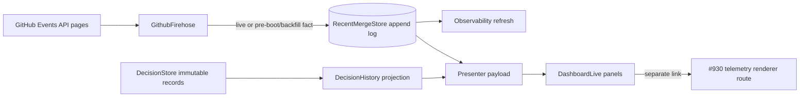

# feat: Add decision history and recent outcomes

## Summary

Project the canonical Decision audit into an honest operator-facing history,
persist a bounded view of recent repository merges through the existing GitHub
firehose, and link the live control center to #930's existing telemetry report
renderer instead of rebuilding analytics inside LiveView.

---

## Problem Frame

OCC-1 now preserves versioned Decision snapshots, but the dashboard does not
explain how a Decision changed over time. GitHub merge events are transient and
currently limited to recognized ticket branches, so the dashboard also cannot
show restart-safe recent outcomes without implying unsupported run ownership.
Finally, #930's analytics report exists only as a separate generator and is not
discoverable from the live operator surface.

---

## Assumptions

*This plan was authored without synchronous user confirmation. The items below
are agent inferences that fill gaps in the input and should be scrutinized
during document, code, and human review.*

- Decision history in this parallel ticket is a read-only projection of the
  immutable records OCC-1 already owns. Request/enrichment versions are visible
  immediately; answer, delivery, acknowledgement, and true decision-revision
  entries appear when OCC-3/OCC-8 append those explicit records to the same
  canonical service. This ticket does not invent lifecycle mutations early.
- When a history record has no explicit human/supervising-agent actor metadata,
  the UI labels its known source identity as a ticket agent or unknown source.
  It never infers a human or supervising actor from naming conventions.
- The existing GitHub Events API firehose can serve as the bounded reconciliation
  source by walking its already-capped pages at startup and after a watermark
  gap. This avoids a second repository polling loop while covering repository
  PRs beyond Aiur ticket branches. The panel exposes when that event-count
  window saturated so “recent” is never mistaken for an exhaustive time range.
- The analytics link targets a read-only route that renders the current durable
  telemetry input through `Aiur.RunTelemetry.Dashboard`. When debug telemetry is
  absent, the live dashboard says so instead of presenting a dead link.

---

## Requirements

- R1. Expose append-only Decision history ordered newest first, including stable
  Decision and ticket identity, source version, timestamp, change kind, actor
  type/label when explicitly known, rationale/choice and delivery fields when
  present, and revision/supersede linkage when present.
- R2. Never label a record as human- or supervising-agent-authored without
  explicit canonical actor metadata; retain ticket-agent and unknown fallbacks.
- R3. Persist recent GitHub pull-request merge facts across daemon restarts with
  merge time, PR/title/link, head branch/SHA, related ticket when derivable,
  merge actor, bounded summary, observation source, and observed run identity
  only when the current run actually saw the live event.
- R4. Reconcile bounded startup and polling gaps from the existing GitHub
  firehose pages, deduplicate repeated API events, and append only when a merge
  fact gains new information. A local persistence failure keeps the prior
  watermark for a bounded retry window without suppressing the existing
  ticket-merge event; after exhaustion, advance past the already-published
  event while keeping storage health degraded and raising operator attention.
- R5. Label the panel **Recent repository merges** and distinguish live-observed
  from backfilled facts. Never claim that the current run or an Aiur agent caused
  a merge without an explicit durable association.
- R6. Refresh the existing dashboard/API projection only after new history or
  merge state is durable. Subscribe the LiveView to the landed Decision PubSub
  signal as well as observability refreshes, and keep durable history/outcomes
  visible even when the orchestrator snapshot itself is unavailable.
- R7. Provide a clear link to the separate #930 telemetry dashboard using the
  existing self-contained renderer; do not duplicate its charts or reducer in
  OCC LiveView.
- R8. Render useful empty/unavailable/partial-window states and safely escape
  all externally sourced text and URLs.

---

## Scope Boundaries

- Do not implement operator answers, queue dispatch, delivery correlation, or
  acknowledgement; OCC-3 (#981) owns those mutations.
- Do not implement decision revise/undo behavior or claim that an earlier side
  effect was rolled back; OCC-8 (#985) owns revisions.
- Do not implement the full redesigned control-center component hierarchy;
  OCC-4 (#987) consumes the provider payloads and may relocate the small panels.
- Do not add a second Decision log, event bus, GitHub polling process, or
  analytics implementation.
- Do not fetch per-PR CI/review data solely for this panel. If final CI/review
  evidence is absent from the merge fact, display it as unavailable.
- Do not claim run, attempt, or agent causality from branch naming, merge time,
  event observation, PR author, or `merged_by`.

### Deferred to Follow-Up Work

- Rich answer/delivery history fields: OCC-3 (#981).
- Human/supervisor decision API and canonical actor metadata: OCC-7 (#984).
- Decision revision and supersession mutations: OCC-8 (#985).
- Full visual productionization and stable Decision deep links: OCC-4 (#987).

---

## Context & Research

### Relevant Code and Patterns

- `docs/operator-control-center/02-occ-0-audit-and-design-decisions.md` fixes the
  merge-attribution language, bounded reconciliation requirement, run boundary,
  and append-before-notify posture.
- `docs/operator-control-center/03-occ-1-decision-contract.md` documents the
  landed `Aiur.DecisionStore.history/2` contract and immutable version records.
- `src/lib/aiur/decision_store.ex` already owns Decision reads and per-Decision
  history; it should gain a bulk read rather than be bypassed with direct file
  access.
- `src/lib/aiur/decision_log.ex` supplies the fsynced append, validated replay,
  owner-only file, and corruption-prefix behavior needed by recent merges.
- `src/lib/aiur/events/github_firehose.ex` already bounds GitHub Events API
  pagination and identifies pre-boot events versus live events.
- `src/lib/aiur_web/presenter.ex`, `src/lib/aiur_web/live/dashboard_live.ex`, and
  `src/lib/aiur_web/observability_pubsub.ex` are the shared read/refresh seams.
- `src/lib/aiur/run_telemetry/dashboard.ex` is the canonical self-contained
  analytics renderer delivered by #930.

### Institutional Learnings

- OCC-0 rejects time-window overlap as run attribution and requires the default
  label **Recent repository merges**.
- OCC-1 established one serialized, file-first owner and full-snapshot history;
  history consumers must read the service instead of scanning `decisions.ndjson`.
- No relevant `docs/solutions/` entry supersedes the accepted OCC design notes.

### External References

- No external research is needed. Current Aiur modules provide direct patterns
  for every persistence, polling, projection, and rendering seam in this ticket.

---

## Key Technical Decisions

| Decision | Rationale |
|---|---|
| Keep history as a pure projection over `DecisionStore` records | OCC-1 remains the only canonical Decision service; OCC-3/OCC-8 can enrich the record vocabulary without a second audit trail. |
| Add a dedicated recent-merge store under the same instance-scoped OCC state root | Merge facts are not Decision mutations, but they need the same restart-safe, owner-only append semantics. |
| Feed merge storage from the existing firehose before dashboard notification | Reuses one GitHub poll/watermark and lets persistence distinguish current-run observation from pre-boot backfill. |
| Reconcile all merged PR events in the bounded fetched pages, not only ticket branches | Makes **Recent repository merges** truthful while retaining ticket linkage only when the head branch proves it. |
| Serve analytics through the #930 reducer/renderer | The live control center links to a separate surface and never forks analytics data or chart logic. |
| Hold the firehose reconciliation cursor on local merge-store failure | The existing ticket event can still publish, while the next poll retries durable outcome capture instead of accepting a lossy cursor advance. |

---

## High-Level Technical Design

> *This illustrates the intended approach and is directional guidance for
> review, not implementation specification. The implementing agent should
> treat it as context, not code to reproduce.*

---

## Implementation Units

### U1. Project canonical Decision history

**Goal:** Provide one stable, honest history payload for LiveView and the future
OCC-4 components without changing Decision mutation ownership.

**Requirements:** R1, R2, R6, R8

**Dependencies:** OCC-1 (merged as #1017)

**Files:**
- Create: `src/lib/aiur/decision_history.ex`
- Modify: `src/lib/aiur/decision_store.ex`
- Create: `src/test/aiur/decision_history_test.exs`
- Modify: `src/test/aiur/decision_store_test.exs`

**Approach:**
- Add one serialized bulk-history read to `DecisionStore`; do not scan the audit
  file or issue one GenServer call per Decision.
- Project immutable records into bounded, newest-first entries. Preserve source
  version and change identity, and carry optional actor/choice/rationale/
  delivery/revision fields only when explicitly present.
- Use explicit actor type metadata when available. For current OCC-1 request
  snapshots, label the known source as a ticket agent; use unknown when even the
  source is absent.

**Patterns to follow:**
- `Aiur.DecisionProjection.reduce/1` for immutable history ordering.
- `AiurWeb.Presenter` payload functions for atom-keyed internal views that
  Phoenix/Jason can safely encode.

**Test scenarios:**
- Happy path: multiple Decisions and versions produce one newest-first history
  with stable Decision/ticket/version/timestamp fields.
- Happy path: explicit human-operator and supervising-agent metadata survives
  projection with distinct actor labels and rationale/choice fields.
- Edge case: current OCC-1 records with no explicit actor metadata are labeled
  ticket-agent or unknown and are never guessed to be human/supervisor.
- Edge case: absent dispatch, acknowledgement, revision, and supersede fields
  remain absent/unavailable rather than receiving fabricated states.
- Integration: the bulk store read returns the same ordered immutable records as
  the existing per-Decision history API after restart replay.

**Verification:**
- Consumers can render every known Decision change from one read, and every
  actor/lifecycle claim is traceable to canonical data.

### U2. Persist and reconcile recent repository merges

**Goal:** Turn the existing transient GitHub merge stream into a bounded,
restart-safe recent-outcomes provider without another poller.

**Requirements:** R3, R4, R5, R6, R8

**Dependencies:** None beyond the existing GitHub firehose and OCC state root

**Files:**
- Create: `src/lib/aiur/recent_merge.ex`
- Create: `src/lib/aiur/recent_merge_store.ex`
- Modify: `src/lib/aiur/events/github_firehose.ex`
- Modify: `src/lib/aiur.ex`
- Create: `src/test/aiur/recent_merge_store_test.exs`
- Modify: `src/test/aiur/events/github_firehose_test.exs`
- Modify: `src/test/aiur/application_test.exs`

**Approach:**
- Normalize only bounded display/correlation fields from a GitHub PR event,
  redact known credentials, validate timestamps/URLs, and derive a ticket only
  through `Aiur.TicketBranch`.
- Store full current snapshots as newline-delimited records using `DecisionLog`'s
  durable mechanics under `Config.Paths.decision_state_dir/0`. Retain the
  newest projections and atomically compact the stream at its record ceiling.
  Replay to an in-memory index and fail read-only on interior corruption.
- Extend the firehose's initial/gap page walk within its existing hard cap. Feed
  every merged PR fact to the store before any OCC dashboard refresh, marking
  pre-boot records backfilled and current-window records live-observed.
- Deduplicate repeated Events API rows; append a later record only when it adds
  information such as a live observed run ID or richer PR fields.
- Treat an externally malformed merge fact as a surfaced source warning that
  cannot enter storage but does not wedge the GitHub cursor forever. Treat a
  valid fact that fails local durable append differently: publish the existing
  load-bearing ticket event, preserve the prior reconciliation cursor for a
  bounded retry window, then advance with degraded health and a needs-attention
  alert so one read-only store cannot freeze the firehose.
- Record whether the bounded page walk hit its hard cap so the provider and UI
  can disclose a partial recent window rather than imply exhaustive coverage.

**Execution note:** Implement normalization, replay, deduplication, and
attribution tests before wiring the firehose.

**Patterns to follow:**
- `Aiur.DecisionLog` for owner-only fsynced append and validated-prefix replay.
- `Aiur.TicketBranch.ticket_id/1` for proven branch-to-ticket linkage.
- `Aiur.Events.GithubKeys.pre_boot_event?/2` for observation classification.

**Test scenarios:**
- Happy path: a live merge persists PR/ticket/link/merge fields, stamps the
  current run only as observer, and survives store restart.
- Happy path: a pre-boot non-ticket PR from a bounded startup page is backfilled
  and appears in **Recent repository merges** without a ticket/agent claim.
- Edge case: repeated API rows do not append duplicates; a later live sighting
  of a backfilled merge appends one enriched snapshot preserving both facts.
- Edge case: a readable or legacy Aiur branch derives its numeric ticket, while
  unrelated/malformed branches remain unattributed.
- Error path: malformed fields, unsafe URLs, secret-shaped text, torn final
  records, and corrupt interior records follow bounded/redacted/fail-closed
  behavior; malformed source facts are warned and skipped without retry loops.
- Failure path: a durable append failure retries the prior firehose watermark a
  bounded number of times while the existing ticket `pr.merged` event still
  publishes once through its normal dedup path; exhaustion advances the
  watermark, degrades health, and alerts without unbounded refetch.
- Integration: a saturated startup/gap response walks only the existing maximum
  number of pages, records merges on later pages, exposes partial-window status,
  and preserves existing ticket `pr.merged` publication behavior.

**Verification:**
- Recent repository merges remain available after restart, carry explicit
  live/backfill provenance, and contain no inferred run or agent ownership.

### U3. Render history/outcomes and link the existing analytics surface

**Goal:** Make both providers visible now and expose a real link to the separate
#930 report, while keeping the payload ready for OCC-4 productionization.

**Requirements:** R1, R5, R6, R7, R8

**Dependencies:** U1, U2, #930 (merged)

**Files:**
- Modify: `src/lib/aiur_web/presenter.ex`
- Modify: `src/lib/aiur_web/live/dashboard_live.ex`
- Modify: `src/priv/static/dashboard.css`
- Modify: `src/lib/aiur/run_telemetry/dashboard.ex`
- Create: `src/lib/aiur_web/controllers/telemetry_dashboard_controller.ex`
- Modify: `src/lib/aiur_web/router.ex`
- Modify: `src/test/aiur_web/live/dashboard_live_test.exs`
- Create: `src/test/aiur_web/controllers/telemetry_dashboard_controller_test.exs`
- Modify: `src/test/aiur/run_telemetry/dashboard_test.exs`
- Modify: `src/README.md`

**Approach:**
- Compose bounded history and merge collections into `Presenter.state_payload/2`
  through safe provider calls; an unavailable optional provider must not hide the
  orchestrator snapshot, and an unavailable orchestrator must not discard the
  independently durable history/outcome sections.
- Subscribe the LiveView to `Aiur.DecisionPubSub` and reload the shared payload
  after a Decision change. Continue using `ObservabilityPubSub` for orchestrator
  and recent-merge refreshes; reconnect always re-reads both stores.
- Render compact, escaped history and **Recent repository merges** sections with
  actor/provenance badges, honest unavailable fields, stable external links, and
  empty states. OCC-4 may later move these payloads into dedicated components.
- Add a basic-auth-protected read-only route that builds the current durable
  telemetry dataset and returns `RunTelemetry.Dashboard.render/2` output. Reuse
  the generator's reducer and self-contained HTML; no OCC chart code is added.
  Route through the existing secure browser headers, accept no caller-selected
  input path, and return the sensitive report with `Cache-Control: no-store`.
- Show the analytics link only when a telemetry input exists; otherwise explain
  that analytics requires a debug telemetry run.

**Patterns to follow:**
- Existing `DashboardLive` section cards and `dashboard.css` tokens.
- `AiurWeb.Router` dashboard-auth read routes.
- `Aiur.RunTelemetry.Dashboard.generate/3` and its safe inline-data tests.

**Test scenarios:**
- Happy path: rendered history distinguishes ticket agent, human operator, and
  supervising agent entries when those actor types are provided.
- Happy path: recent merges show PR link/title/ticket/merge time and explicit
  observed-live or backfilled provenance under the required panel title.
- Empty/unavailable: no Decisions, no merges, absent optional lifecycle fields,
  a saturated reconciliation window, an unavailable orchestrator, and no
  telemetry file each render a clear non-misleading state.
- Security: externally sourced title/summary/actor/link content is escaped and
  unsafe links never reach an anchor.
- Integration: a persisted merge triggers observability refresh and appears on
  the next payload; reconnect reads both stores rather than relying on a missed
  broadcast.
- Integration: a persisted Decision PubSub notification reloads history without
  waiting for an unrelated orchestrator status change.
- Integration: the analytics route returns the same self-contained renderer
  structure as the CLI generator, remains protected by dashboard basic auth,
  uses secure browser headers, and is never cacheable.

**Verification:**
- Operators can inspect history, recent merge outcomes, and open the separate
  analytics report without any browser-owned correctness or duplicated data
  pipeline.

---

## System-Wide Impact

- **Interaction graph:** GitHub firehose pages gain one synchronous durable
  merge-fact sink; post-persist observability refresh causes Presenter/LiveView
  to re-read both providers. Existing ticket merge publication remains intact.
- **Error propagation:** Malformed external facts become bounded warnings.
  Valid-fact persistence failures remain operator-visible, hold the outcome
  reconciliation cursor for bounded retry, then advance in a degraded state;
  they never suppress the orchestrator's existing load-bearing
  `ticket.<id>.pr.merged` event.
- **State lifecycle risks:** A crash may leave only an unacknowledged torn tail;
  repeated GitHub rows must be idempotent; interior corruption makes the merge
  store read-only rather than silently dropping facts.
- **API surface parity:** `Presenter.state_payload/2` is shared by the dashboard
  and state API. The analytics route is read-only and reuses existing dashboard
  auth; no write gate is involved.
- **Integration coverage:** Firehose-to-store-to-Presenter and telemetry-input-
  to-renderer route tests cover the seams pure unit tests cannot.
- **Unchanged invariants:** DecisionStore remains the only Decision truth;
  OperatorMessages remains the only answer transport; Events.Exchange remains
  the existing event fanout; #930 remains the only analytics reducer/renderer.

---

## Risks & Dependencies

| Risk | Mitigation |
|---|---|
| Parallel OCC-3/OCC-4 work changes the eventual history record or component shape | Publish the provider contract early, keep the projector tolerant of optional explicit fields, and confine LiveView markup to a small replaceable section. |
| Persisting inside the orchestrator's firehose poll adds latency | Keep records bounded and deduplicated, append only new information, and never let outcome-store failure suppress existing merge publication. |
| GitHub Events API is a bounded window, not an exhaustive repository database | Keep the hard page cap, expose saturation/partial-window status, describe the panel as recent, retain backfill provenance, and never imply completeness beyond the reconciled window. |
| Analytics rendering reads a file while telemetry is appending | Reuse #930's warning-tolerant dataset parser and return an unavailable state instead of failing the live dashboard. |

---

## Documentation / Operational Notes

- Update `src/README.md` with the live analytics route, its debug-telemetry
  prerequisite, and the distinction between live control-center data and the
  separate self-contained report.
- Agent workspaces cannot perform the canonical `scripts/aiurdev --test` TUI
  verification; the operator-root smoke check remains required before claiming
  end-to-end manual verification.

---

## Sources & References

- **Origin document:** `docs/operator-control-center/00-prd.md`
- Decomposition: `docs/operator-control-center/01-brainstorm-and-decomposition.md`
- Accepted design decisions: `docs/operator-control-center/02-occ-0-audit-and-design-decisions.md`
- OCC-1 handoff: `docs/operator-control-center/03-occ-1-decision-contract.md`
- Related issues: #930, #981, #984, #985, #987
