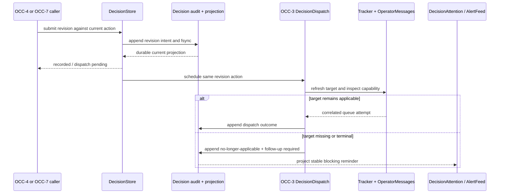

# feat: Add append-only decision revisions

## Summary

Extend the canonical Decision audit and OCC-3 outbox with revision intents,
target revalidation, and corrective follow-up delivery. Preserve every prior
answer and transport fact, make applicability explicit, and project an
actionable blocking follow-up when a revision cannot reach a live target.

---

## Problem Frame

OCC-1 preserves the original request and OCC-3 is adding durable answers and
correlated delivery, but neither contract explains what happens when an
operator later changes a decision. Rewriting the current answer would destroy
audit history, while labeling a new answer as a rollback would falsely imply
that code, commits, migrations, or deployments were undone.

---

## Assumptions

*This plan was authored without synchronous user confirmation. The items below
are agent inferences that fill gaps in the input and should be reviewed before
implementation proceeds.*

- Request version and revision order are independent: a revision targets the
  current request version and active action, but advances a separate revision
  sequence rather than masquerading as request enrichment.
- “No longer applicable” is reserved for a freshly revalidated missing or
  terminal tracker target, or a later explicit target report. Capacity,
  orchestrator unavailability, and queue timeouts remain retryable delivery
  failures so transient infrastructure cannot terminate the revision.
- The new blocking follow-up is a durable required/handled fact on the parent
  revision and is projected through `Aiur.DecisionAttention` / `Aiur.AlertFeed`;
  those notification surfaces do not become a second source of truth.
- OCC-8 owns the public revision application-service contract. OCC-4 presents
  its controls and outcomes, while OCC-7 exposes the same contract through the
  authenticated API without duplicating validation or dispatch.

---

## Requirements

- R1. Preserve the original request, answer, dispatch attempts, acknowledgement,
  and resolution facts; a revision only adds ordered audit events and links.
- R2. Record the revision actor, required reason, replacement option or custom
  answer, source request version, prior action identity, stable revision action
  identity, and acceptance time with the same bounds and redaction as OCC-3.
- R3. Serialize revision mutations in `Aiur.DecisionStore`. Exact retries are
  idempotent, conflicting token reuse fails closed, and concurrent revisions
  against one active action have one deterministic winner.
- R4. Reject invalid, stale, cross-ticket, wrong-action, or already-superseded
  mutations before append or dispatch and return the current correlation state.
- R5. Persist and fsync a valid revision intent and replace the current
  projection before target revalidation, queue insertion, alert projection, or
  event publication.
- R6. Revalidate the target against fresh tracker state rather than only a
  cached running entry. Missing or terminal targets become
  `no_longer_applicable`; transient lookup/control failures remain pending or
  failed under OCC-3 retry semantics.
- R7. When the target remains applicable, dispatch one human-readable
  corrective follow-up through OCC-3's correlated `OperatorMessages` path,
  preserving the new action ID, prior action link, request version, actor, and
  reason across retries and restarts.
- R8. Never claim a prior effect was rolled back, reverted, or undone. The
  follow-up must tell the agent to inspect current state before applying the
  new direction and must retain evidence that earlier instructions may already
  have taken effect.
- R9. When the target is no longer applicable, append that outcome and create
  one stable, blocking follow-up that asks the operator what should happen
  next. Persist its required/handled lifecycle on the parent revision; replays
  and restarts must not duplicate it.
- R10. Keep revision outcome, dispatch state, and target acknowledgement
  distinct. A queued or consumed corrective message does not prove that prior
  effects were reversed or that the revision was applied.
- R11. Publish revision lifecycle changes through the existing
  `Aiur.Events.Exchange`, `Aiur.DecisionPubSub`, and attention/alert projections
  only after the corresponding canonical event is durable.
- R12. Cover accepted, rejected, pending, failed, and no-longer-applicable
  outcomes; idempotency and concurrency; target-state races; restart recovery;
  and rollback-language regressions with focused tests and a downstream
  contract document.

---

## Scope Boundaries

- Do not implement automatic code, commit, migration, deployment, or external
  side-effect rollback.
- Do not infer whether an earlier instruction took effect from queue delivery,
  turn completion, branch state, or elapsed time.
- Do not duplicate OCC-3 answer validation, action correlation, queue indexing,
  settlement, acknowledgement, or retry machinery.
- Do not build the revision button, modal, timeline rendering, or browser
  conflict UX owned by OCC-4.
- Do not add OCC-7 REST routes or supervising-agent authorization policy; those
  callers delegate to the same revision service.
- Do not replace the OCC-2 attention adapter, create a second queue/message bus,
  add SQLite, or treat `AlertFeed` as canonical state.
- Do not aggregate revision latency or blocked-time metrics owned by OCC-9.

### Deferred to Follow-Up Work

- Revision controls and history presentation: OCC-4 consumes the public result
  and canonical projection from this plan.
- Authenticated machine revision endpoint: OCC-7 delegates to the same service
  with its trusted actor/authority checks.
- Revision latency aggregation: OCC-9 derives it from the timestamps added here.

---

## Context & Research

### Relevant Code and Patterns

- `docs/operator-control-center/02-occ-0-audit-and-design-decisions.md` makes
  `DecisionStore` the outbox, fixes at-least-once transport, and forbids
  inferring acknowledgement from queue consumption.
- `docs/operator-control-center/03-occ-1-decision-contract.md` documents the
  landed request schema, versioning, append/fsync barrier, replay validation,
  projection repair, and post-persist notification seam.
- `src/lib/aiur/decision_store.ex`, `src/lib/aiur/decision_projection.ex`, and
  `src/lib/aiur/decision_log.ex` are the single canonical mutation, reducer,
  and append-only persistence path.
- The validated #981 plan introduces discriminated Decision lifecycle events,
  immutable answers, stable action IDs, `Aiur.DecisionDispatch`, correlated
  `OperatorMessages`, and explicit agent acknowledgement/resolution. OCC-8
  extends those exports after inspecting the pushed implementation.
- `src/lib/aiur/orchestrator/dispatcher.ex` already refreshes tracker state and
  distinguishes current, missing, terminal, and fetch-error targets before a
  dispatch/re-activation decision.
- `src/lib/aiur/orchestrator/operator_messages.ex` owns target capabilities,
  paused/deactivated reactivation, delivery-policy gates, and queue insertion.
- `src/lib/aiur/decision_attention.ex` and `src/lib/aiur/alert_feed.ex` provide
  stable ticket/slug attention projection and resolution without owning
  Decision truth.

### Institutional Learnings

- No `docs/solutions/` directory exists on this branch. The accepted OCC-0
  design note and the OCC-1/OCC-3 handoffs are the repository-owned guidance.
- Existing reactivation paths re-fetch tracker state before waking inactive
  work. Revision delivery must retain that race defense instead of trusting a
  stale orchestrator snapshot.

### External References

- None. The repository has direct, recent patterns for persistence, target
  revalidation, correlated delivery, and attention projection.

---

## Key Technical Decisions

- Add typed revision-intent and revision-outcome events to OCC-3's lifecycle
  envelope rather than mutating an answer snapshot. This preserves old bytes,
  keeps replay deterministic, and lets history show the exact sequence.
- Reuse OCC-3's normalized answer and actor value inside a revision, then derive
  a new Decision-scoped action identity linked to the action it supersedes.
  Revision-specific validation adds the required reason and expected active
  action without copying answer bounds or redaction.
- Treat request version, lifecycle order, and revision order as separate axes.
  A revision answers the current request context; it does not manufacture a
  new request version or erase a later enrichment.
- Revalidate applicability in the asynchronous post-persist dispatch seam.
  Fresh missing/terminal tracker state is a semantic outcome; control-plane or
  capacity failures use OCC-3's retryable delivery lifecycle.
- Supersede an undelivered prior queue action only through OCC-3's canonical
  queue transition. If prior guidance was already handed off, send a corrective
  follow-up and retain both attempts; never imply retraction succeeded.
- Persist a stable blocking-follow-up-required fact before opening
  `DecisionAttention`. Derive its stable slug from the revision action and
  rebuild it from `DecisionStore`; alerts and re-asks are replaceable
  projections. Append a handled/superseded fact before resolving its reminder.
- Keep operator-facing vocabulary factual: “revision recorded,” “follow-up
  queued,” “target no longer active,” and “current state must be re-evaluated.”
  “Rolled back,” “reverted,” and “undone” are prohibited success claims.

---

## Open Questions

### Resolved During Planning

- Does a revision overwrite the original answer? No. It appends a new logical
  action and links the prior action as superseded while preserving every event.
- Is a missing running process automatically no longer applicable? No. Fresh
  non-terminal tracker work may be queued or temporarily inactive; only a
  missing/terminal tracker target (or explicit agent outcome) is semantic
  non-applicability.
- Does target revalidation precede persistence? No. The valid revision intent
  is durable first; target inspection and dispatch are recoverable side effects
  with their own outcome events.
- Does delivery prove the revision was applied? No. OCC-3 transport evidence
  and explicit target acknowledgement stay distinct from revision outcome.

### Deferred to Implementation

- The exact extension seam in OCC-3's dispatcher and correlated queue API is
  deferred until #981 publishes its validated implementation branch. OCC-8
  will consume the real exports and remove any provisional seam before push.
- Whether a pending prior queue action can be superseded in place depends on
  OCC-3's final queue transition contract. The correctness fallback is an
  explicit corrective follow-up under a new action ID.
- The exact structured payload for a future explicit agent
  `no_longer_applicable` report is deferred until OCC-3's acknowledgement
  payload is concrete; fresh tracker terminal/missing outcomes are implemented
  independently.

---

## High-Level Technical Design

> *This illustrates the intended approach and is directional guidance for
> review, not implementation specification. The implementing agent should treat
> it as context, not code to reproduce.*

| Result | Trigger | Durable effect | Side effect |
|---|---|---|---|
| Rejected | Invalid/stale version, wrong active action, conflict, unsafe content | None | None |
| Accepted / pending | Valid revision, target check or transport temporarily unavailable | Revision intent plus retryable delivery state | OCC-3 reconciliation retries |
| Accepted / dispatched | Valid revision and fresh non-terminal target | Revision intent plus correlated queue attempt | Corrective follow-up through `OperatorMessages` |
| No longer applicable | Fresh target missing/terminal, or later explicit target report | Revision outcome plus blocking-follow-up-required fact | Stable `DecisionAttention` / `AlertFeed` projection |

---

## Implementation Units

### U1. Add revision events and replay-safe projection

**Goal:** Represent immutable revision intents, outcomes, and follow-up links in
the canonical Decision audit without changing request-only or OCC-3 lifecycle
history.

**Requirements:** R1, R2, R3, R4, R10, R11

**Dependencies:** Merged OCC-1 and the validated #981 lifecycle-event exports

**Files:**
- Create: `src/lib/aiur/decision_revision.ex`
- Modify: `src/lib/aiur/decision.ex`
- Modify: `src/lib/aiur/decision_event.ex`
- Modify: `src/lib/aiur/decision_projection.ex`
- Modify: `src/lib/aiur/decision_store.ex`
- Test: `src/test/aiur/decision_revision_test.exs`
- Test: `src/test/aiur/decision_projection_test.exs`
- Test: `src/test/aiur/decision_store_test.exs`

**Approach:**
- Compose OCC-3's normalized answer/actor data and add bounded revision reason,
  prior-action linkage, expected request version, revision sequence, stable
  client token/action identity, timestamps, and deterministic integrity hash.
- Extend the lifecycle envelope and pure reducer with revision-recorded,
  revision-dispatch, supersession, no-longer-applicable, and blocking-follow-up
  required/handled facts. Preserve the original answer and every attempt in
  ordered history.
- Serialize revision acceptance inside the existing GenServer. Exact content
  replay returns the accepted revision; stale active-action/sequence or
  conflicting token reuse appends nothing.
- Decode pre-OCC-3, OCC-3-without-revisions, and new revision records through
  one replay pipeline. Unknown or invalid interior revision events fail closed.

**Execution note:** Add compatibility fixtures and reducer tests before
changing store mutation behavior.

**Patterns to follow:**
- `src/lib/aiur/decision_answer.ex` and `src/lib/aiur/decision_event.ex` from
  the validated #981 branch for value normalization and lifecycle envelopes.
- `src/lib/aiur/decision_projection.ex` for replay validation and current/history
  reduction.
- `src/lib/aiur/decision_store.ex` for serialized conflicts and
  persist-before-notify ordering.

**Test scenarios:**
- Happy path: an acknowledged original action plus one revision reduces to one
  Decision whose original answer is unchanged and whose current action points
  to the revision.
- Happy path: actor, reason, replacement answer, request version, prior action,
  and revision sequence survive audit replay and projection rebuild.
- Idempotency: exact replay before and after dispatch returns the same revision
  action with one audit intent; different content under the same token fails.
- Concurrency: two revisions against the same active action/sequence produce
  one accepted action and one structured stale/superseded rejection.
- Edge case: a later request enrichment preserves revision history and does not
  silently replay or erase the active revision.
- Error path: wrong ticket, unknown prior action, stale request version,
  overlong reason/answer, invalid actor, or malformed event appends nothing (or
  enters read-only corruption mode when found inside the durable stream).
- Compatibility: OCC-1 request-only and OCC-3 answer/delivery fixtures replay
  unchanged after revision support is installed.

**Verification:**
- The append-only audit alone rebuilds the original action, every revision, the
  active action, and blocking-follow-up state without rewriting historical
  bytes.

### U2. Revalidate the target and dispatch corrective follow-ups

**Goal:** Turn a durable revision intent into one correlated corrective message
when fresh target state permits, while classifying semantic and transient
failures truthfully.

**Requirements:** R5, R6, R7, R8, R10, R11

**Dependencies:** U1 and the validated #981 dispatcher / correlated queue API

**Files:**
- Create: `src/lib/aiur/decision_revision_dispatch.ex`
- Modify: `src/lib/aiur/decision_dispatch.ex`
- Modify: `src/lib/aiur/decision_store.ex`
- Modify: `src/lib/aiur/orchestrator/operator_messages.ex`
- Test: `src/test/aiur/decision_revision_dispatch_test.exs`
- Test: `src/test/aiur/orchestrator_status_test.exs`

**Approach:**
- Schedule revision delivery only after the revision intent and current
  projection are durable, reusing OCC-3's recovery and stable-action machinery.
- Refresh the target issue through the established dispatcher/tracker seam.
  Missing/terminal results append `no_longer_applicable`; fetch errors,
  capacity, and orchestrator/queue failures remain retryable delivery state.
- Send a bounded, redacted corrective envelope through the correlated
  `OperatorMessages` route. Include the original and revision correlation plus
  explicit language that current state must be inspected and prior effects are
  not claimed to be undone.
- If OCC-3 can supersede a still-pending prior action safely, use that public
  transition. Never retract a handed-off/consumed action or infer its effects.
- Reconcile crash windows after intent persistence, target refresh, queue
  acceptance, and outcome append without creating a second revision action.

**Execution note:** Begin with an injected target/dispatcher test that reads the
audit before the first tracker or queue callback.

**Patterns to follow:**
- `src/lib/aiur/orchestrator/dispatcher.ex` fresh issue revalidation and
  missing/terminal/error classification.
- `src/lib/aiur/orchestrator/operator_messages.ex` capabilities,
  paused/deactivated wake, and delivery-policy gates.
- OCC-3's `src/lib/aiur/decision_dispatch.ex` recovery and correlated action
  settlement rather than a second retry worker.

**Test scenarios:**
- Happy path: an active target receives one corrective message after the
  revision event is durable; all required correlation and factual wording are
  present.
- Applicable inactive path: paused/deactivated but non-terminal work uses the
  existing safe reactivation/capacity gates and queues once.
- Semantic failure: fresh missing and terminal targets append
  no-longer-applicable and enqueue nothing.
- Transient failure: tracker fetch, capacity, timeout, unavailable orchestrator,
  and queue failure do not claim non-applicability and retry under the same
  revision action.
- Race: target becomes terminal between initial revision validation and the
  post-persist refresh; the audit shows intent then no-longer-applicable.
- Idempotency: restart/reconciliation against an existing or new queue store
  remains one logical revision action with attempt-specific queue handles.
- Regression: message text never reports rollback/revert/undo success, and
  ordinary OCC-3 answers/plain operator chat retain their behavior.

**Verification:**
- Every valid intent has a recoverable dispatch/applicability outcome, and no
  tracker/control call or queue insertion precedes persistence.

### U3. Project an un-applicable revision into one blocking follow-up

**Goal:** Keep a no-longer-applicable revision visible and actionable without
turning alert logs into truth or creating duplicate follow-ups on replay.

**Requirements:** R8, R9, R10, R11

**Dependencies:** U1, U2

**Files:**
- Modify: `src/lib/aiur/decision_store.ex`
- Modify: `src/lib/aiur/decision_revision_dispatch.ex`
- Test: `src/test/aiur/decision_store_test.exs`
- Test: `src/test/aiur/decision_attention_test.exs`
- Test: `src/test/aiur/alert_feed_test.exs`

**Approach:**
- Append a deterministic blocking-follow-up-required fact keyed by the
  revision action before projecting a stable ticket/slug question through
  `DecisionAttention`. Preserve the original decision and revision outcome.
- Make exact replay/restart detect the existing follow-up and reopen the same
  attention correlation at most once. An OCC-2 attention adapter may expose the
  reminder in the Decision inbox, but it remains a projection of the parent
  revision fact rather than an OCC-8 storage dependency.
- Handling or superseding the follow-up appends a canonical parent event before
  the existing attention resolution path clears the reminder. Audit history
  remains append-only.
- Explain that automatic application was impossible and ask the operator to
  choose a new course; do not represent the original decision as reversed.
- Keep follow-up lifecycle truth in `DecisionStore`. `SubscriptionStore`,
  `Alerts`, and `AlertFeed` remain reminder/read projections and may be rebuilt.
- Run reconciliation outside `DecisionStore`'s `handle_call`: a durable parent
  link is the recovery work item, and the asynchronous dispatcher calls
  `DecisionAttention` only after the parent mutation returns. This avoids a
  `DecisionStore` -> `DecisionAttention` -> `DecisionStore` call cycle.

**Patterns to follow:**
- `src/lib/aiur/decision_attention.ex` stable ticket/slug open, re-ask, and
  resolve lifecycle.
- `src/lib/aiur/alert_feed.ex` attention-resolution projection.
- OCC-3's stable per-action failure attention and post-persist side-effect
  ordering.

**Test scenarios:**
- Happy path: terminal target records one blocking follow-up and exposes one
  unresolved attention with the revision/action link.
- Restart: canonical replay restores the follow-up projection without a second
  durable follow-up or duplicate active AlertFeed card.
- Idempotency: repeated target results and revision retries reuse the stable
  follow-up identity.
- Resolution: handling/superseding the follow-up is durable before its reminder
  clears, while preserving the no-longer-applicable history.
- Failure path: DecisionAttention/AlertFeed unavailability cannot erase or
  falsely resolve the canonical follow-up; a later projection retry recovers.
- Language regression: the blocking question says the target cannot apply the
  revision automatically and never claims prior effects were rolled back.

**Verification:**
- A no-longer-applicable revision remains visible across restart until its
  follow-up is explicitly handled, with exactly one canonical required fact and
  no alert-owned lifecycle state.

### U4. Prove the cross-layer revision contract and downstream handoff

**Goal:** Exercise revision persistence, target races, corrective delivery, and
blocking follow-up together, then document the stable contract for OCC-4,
OCC-6, OCC-7, and OCC-9.

**Requirements:** R1–R12

**Dependencies:** U1, U2, U3

**Files:**
- Create: `src/test/aiur/decision_revision_integration_test.exs`
- Create: `docs/operator-control-center/05-occ-8-decision-revision-contract.md`
- Modify: `docs/operator-control-center/README.md`
- Modify: `docs/operator-control-center/03-occ-1-decision-contract.md`
- Modify: `docs/operator-control-center/04-occ-3-answer-delivery-contract.md`

**Approach:**
- Exercise a real DecisionStore plus OCC-3 dispatcher/queue seam from original
  answer through revision intent, fresh target check, corrective queue attempt,
  explicit acknowledgement, and history read.
- Pin stale browser/API retry behavior by replaying one revision token and
  racing two revisions against the same current action; no UI or REST code is
  required to prove the application-service contract.
- Restart DecisionStore and the transient queue independently across every
  persist/dispatch boundary and assert one logical revision action.
- Exercise missing/terminal target outcomes and prove the blocking follow-up is
  canonical before its attention projection.
- Document result vocabulary, request/revision/action version axes, immutable
  history, target matrix, retry contract, factual message wording, and the
  ownership boundary for downstream UI/API/history/metrics tickets.

**Patterns to follow:**
- OCC-3's decision-delivery integration test and contract document.
- `src/test/aiur/decision_store_test.exs` isolated durable path/restart setup.
- Existing orchestrator status tests for target/capability transitions.

**Test scenarios:**
- Integration: answer a request, acknowledge it, revise it, queue/deliver the
  corrective action, acknowledge the revision, and preserve both histories.
- Retry: replay the revision before queueing, after queueing, after delivery,
  and after acknowledgement; no second logical action or follow-up appears.
- Concurrency: simultaneous revision submissions have one winner and expose the
  current action/sequence to the loser.
- Target race: non-terminal target at submission becomes terminal before
  dispatch; one no-longer-applicable outcome and one blocking follow-up result.
- Crash recovery: restart after intent append, after queue acceptance, and
  before outcome append; reconciliation completes the same action.
- Projection failure/corruption: append or projection failure prevents
  dispatch, and validated-prefix reads remain available without false success.

**Verification:**
- The documented revision contract matches executable cross-layer assertions
  and gives every downstream ticket one canonical service/read model to use.

---

## System-Wide Impact

- **Interaction graph:** OCC-4/OCC-7 callers enter DecisionStore; the store
  appends then schedules OCC-3 dispatch; the dispatcher refreshes tracker state
  and calls correlated OperatorMessages; target settlement returns to the
  audit; no-longer-applicable state projects through DecisionAttention and
  AlertFeed; OCC-6/OCC-9 consume the resulting history/timestamps.
- **Error propagation:** Validation and concurrency conflicts return before
  append. Append/projection failure blocks every side effect. Fresh terminal or
  missing state becomes a durable semantic outcome. Transient target/control
  errors remain structured retryable delivery failures.
- **State lifecycle risks:** Crash windows exist after revision append, target
  refresh, queue insert, and follow-up append. Stable action/follow-up IDs and
  replay reconciliation close each window without claiming exactly-once agent
  execution.
- **API surface parity:** OCC-4 LiveView and OCC-7 REST/supervisor paths consume
  the same result vocabulary and stale/idempotency rules. Neither calls
  OperatorMessages directly.
- **Integration coverage:** Pure reducer tests cannot prove persistence precedes
  tracker/queue calls or that a restart does not duplicate follow-ups. U4 covers
  those GenServer and projection boundaries.
- **Unchanged invariants:** Request enrichment, plain operator chat,
  coordination-event dedupe, queue consumption semantics, dashboard security,
  and legacy attention reminder ownership retain their existing contracts.

---

## Risks & Dependencies

| Risk | Mitigation |
|---|---|
| #981 lands with different lifecycle/dispatcher exports | Inspect the validated branch-push ref, adapt to real public APIs, remove provisional seams, and stack the PR on #981 while it remains open. |
| Target state changes after revision persistence | Make target refresh part of recoverable post-persist dispatch and append the observed outcome under the same action. |
| Revision contradicts an already-delivered instruction | Retain both facts, send explicit corrective guidance, and require current-state inspection; never report retraction or rollback. |
| Transient outage is misclassified as semantic non-applicability | Reserve no-longer-applicable for fresh missing/terminal state or explicit target report; test every control error separately. |
| Cross-GenServer callback cycle deadlocks the outbox | Reuse OCC-3 asynchronous dispatch/settlement boundaries; do not synchronously call Orchestrator from an Orchestrator-originated DecisionStore mutation. |
| Replay creates duplicate blocking follow-ups or alerts | Derive stable follow-up identity from the revision action, check canonical projection first, and treat attention emission as idempotent projection. |
| Revision fields leak secrets or unbounded agent output | Compose OCC-3 normalization and shared SecretRedactor; store structured bounded reasons rather than inspected terms. |
| OCC-4/OCC-7 duplicate revision rules while branches are parallel | Publish the application-service/result contract early and keep presentation/auth routing in downstream tickets. |

---

## Documentation / Operational Notes

- No database migration or new runtime configuration is expected.
- Revision reasons, answers, target outcomes, and follow-up questions remain in
  the existing owner-only Decision state directory.
- Observability/log projections must remain bounded and redacted; the Decision
  audit is the only canonical history.
- Manual real-TUI verification must run from the operator repository root. This
  guarded issue workspace may run focused application tests but must stop if
  `scripts/aiurdev --test` rejects the launch.

---

## Sources & References

- **Origin document:** `docs/operator-control-center/00-prd.md`
- **Ticket decomposition:** `docs/operator-control-center/01-brainstorm-and-decomposition.md`
- **Accepted OCC design decisions:** `docs/operator-control-center/02-occ-0-audit-and-design-decisions.md`
- **Landed OCC-1 contract:** `docs/operator-control-center/03-occ-1-decision-contract.md`
- **OCC-3 reviewed plan:** `docs/plans/2026-07-12-003-feat-decision-answer-delivery-plan.md` on `aiur/981-occ-3-answer-dispatch`
- **Current ticket:** issue #985
- **Planning source:** PR #971
