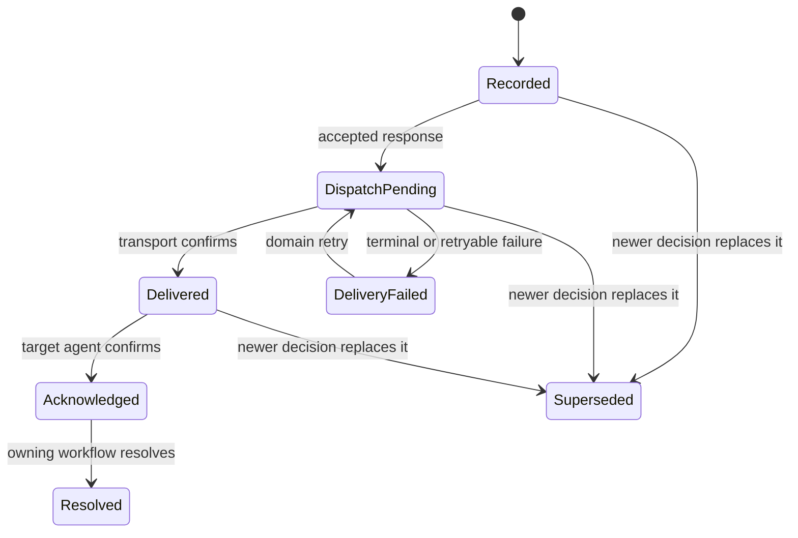
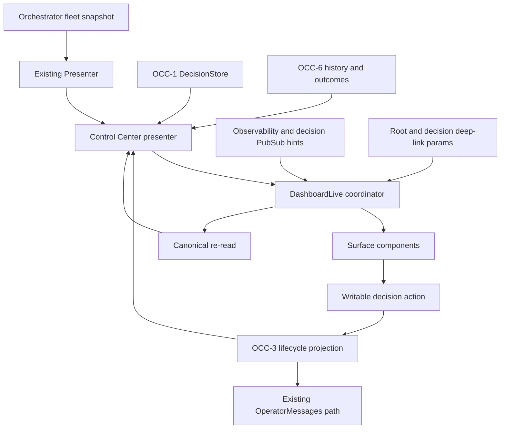
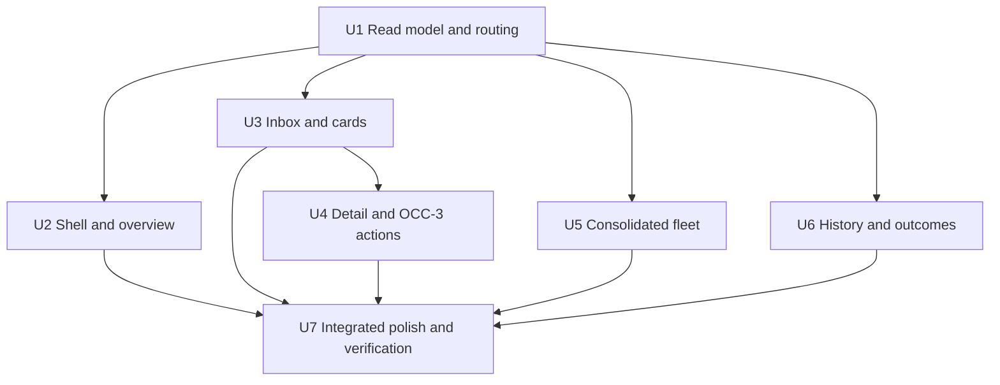
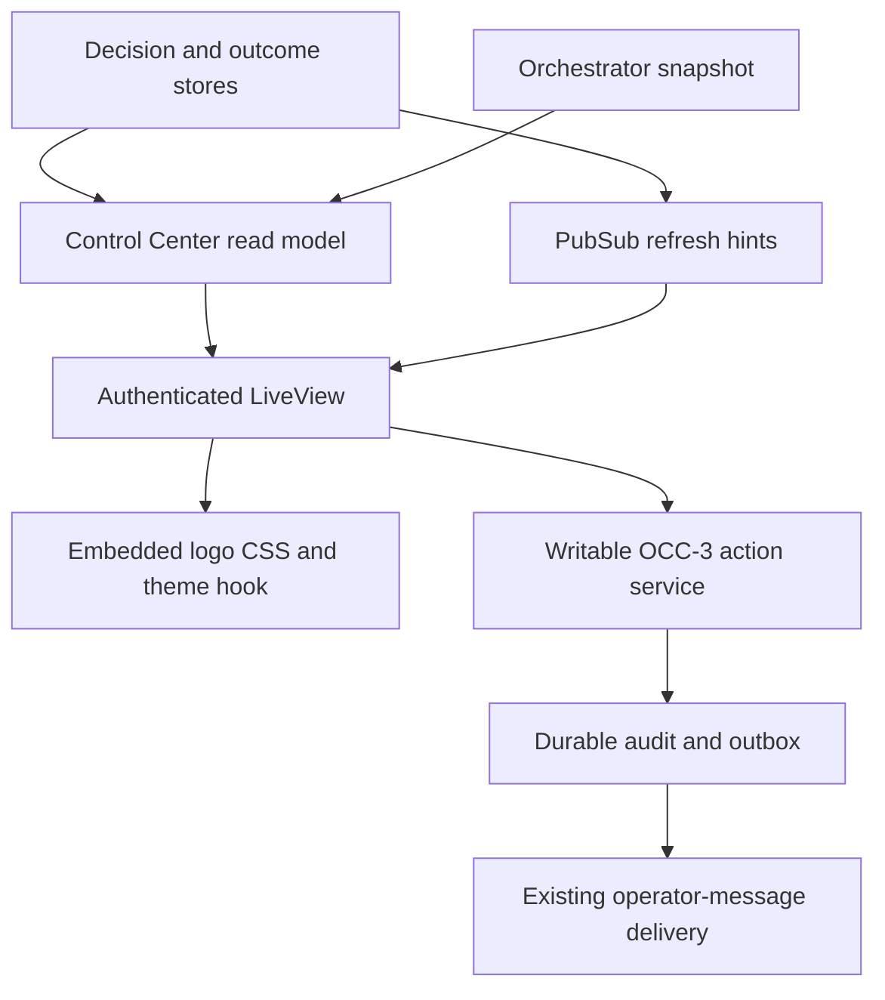

# Operator Control Center LiveView UI

## Summary

Productionize the approved Aiur Operator Control Center design as a set of focused Phoenix LiveView components. The root dashboard will compose the landed fleet projection, canonical decision state, OCC-3 delivery lifecycle, and OCC-6 history/outcomes without introducing mock data or a second control path.

---

## Problem Frame

The current dashboard is an observability surface centered on process state and agent logs. An operator returning after time away still has to reconstruct which decisions are blocking work, whether a response reached the intended agent, and what recently completed.

The approved Claude design establishes the intended hierarchy and interaction model, but it is a single 2,430-line HTML prototype backed by example JavaScript data. It must be rebuilt around Aiur's durable stores, writable gate, PubSub refresh signals, and existing controls while preserving a trustworthy distinction between requested, dispatched, delivered, acknowledged, resolved, failed, and superseded states.

---

## Assumptions

*This plan was authored without synchronous user confirmation. The items below are agent inferences that fill gaps in the input and should be reviewed before implementation proceeds.*

- The existing `/` dashboard becomes the Control Center rather than keeping two competing operator dashboards; `/decisions/:decision_id` provides the stable decision deep link while rendering the same shell.
- Existing agent-log, operator-chat, and pause controls remain available from the fleet surface so productionizing the new design is a superset rather than a functional regression.
- Long decision context is rendered as escaped, pre-wrapped text unless the repository gains an explicitly sanitized Markdown renderer; stored Markdown is never passed through as raw HTML.
- The production dashboard uses local/system font stacks and embedded assets. The prototype's external font requests are design references, not runtime dependencies.
- Missing optional domain fields render as unavailable or are omitted. The UI does not infer option impacts, actor identity, delivery progress, merge attribution, or analytics locations from unrelated fields.
- OCC-3 integration names remain open until its validated branch publishes. OCC-6 announced stable dashboard reads as `Aiur.DecisionHistory.list/1` and `Aiur.RecentMergeStore.snapshot/1`; implementation still waits for the validated branch-push ref before stacking or compiling against them.

---

## Requirements

- R1. Preserve the approved design's hierarchy: prominent unresolved blocking decisions, overview counts, decision inbox/detail, consolidated fleet, history, recent outcomes, and analytics link in first-class light and dark themes.
- R2. Split the LiveView by surface—overview, decision inbox, decision card, decision detail, fleet table, history, and recent outcomes—with each module kept to a rough 200–300-line maximum and `DashboardLive` reduced to coordination.
- R3. Render only canonical domain data from OCC-1, landed OCC-5 fleet state, OCC-3 delivery/action state, and OCC-6 history/outcomes. Do not ship example records, a parallel projection, or optimistic fake lifecycle transitions.
- R4. Sort decisions blocking-first, then urgency, then age; support Open, Blocking, Answered-not-delivered, Decided-by-supervising-agent, Resolved, Superseded, and All views using real lifecycle/actor fields.
- R5. Give every decision a stable deep link and provide option selection, custom response, defer, acknowledgement, retryable failed-dispatch, and revision entry points through OCC-3. Irreversible/destructive choices require confirmation.
- R6. Visibly encode Recorded, Dispatch pending, Delivered, Acknowledged, Resolved, Delivery failed, and Superseded without treating a submitted response as resolved.
- R7. Honor the existing dashboard writable gate end to end. Read-only mode keeps all information visible, removes mutation controls, and presents an explicit disabled-controls notice; server-side handlers still fail closed.
- R8. Consolidate running, retrying, and idle work into one fleet table while retaining explicit waiting reasons, staleness, runtime/turn count, CI/review, open-decision count, issue/log links, and existing safe agent controls when available.
- R9. Render stored text and artifacts safely, accept only trusted link schemes, remain keyboard/screen-reader usable, contain horizontal overflow, and adapt at desktop, tablet, and mobile widths.
- R10. Cover projection, sorting/filtering, deep-link, writable/read-only, lifecycle, stale/error, asset, and responsive markup behavior with focused tests and visual evidence before handoff.

---

## Scope Boundaries

- Do not reimplement OCC-3's persist-before-dispatch outbox, idempotency, correlation, acknowledgement, or stale-version rules.
- Do not reimplement OCC-6's append-only actor history, revision projection, merge collection/attribution, or analytics target selection.
- Do not add the OCC-7 machine-readable decision API or supervising-agent policy engine.
- Do not add OCC-8 revision semantics beyond presenting and dispatching the action exposed by the owning domain service.
- Do not embed or rebuild the offline telemetry dashboard; link to the location supplied by OCC-6.
- Do not add a general-purpose Markdown/HTML rendering subsystem as part of this UI ticket.
- Do not copy the prototype's mock JavaScript, sample decisions, sample fleet rows, animation timers, read-only demo switch, or external asset requests into production.

### Deferred to Follow-Up Work

- Decision latency analytics remain in OCC-9 and the offline telemetry dashboard.
- Any richer sanitized Markdown renderer should be evaluated as an explicit dependency/security change outside this UI unless an existing safe renderer lands first.

---

## Context & Research

### Relevant Code and Patterns

- `src/lib/aiur_web/live/dashboard_live.ex` owns the current LiveView lifecycle, observability subscription, agent-log modal, operator chat, pause actions, and writable assign. It is currently 705 lines and is the primary decomposition target.
- `src/lib/aiur_web/presenter.ex` projects the orchestrator snapshot for both dashboard and observability API. OCC-5 already supplies explicit waiting reasons, staleness, open-decision counts, CI, review, and idle rows; several existing snapshot fields are not yet forwarded to the browser projection.
- `src/lib/aiur/orchestrator/status_report.ex` is the canonical fleet snapshot source. It already exposes title/URL, work state, runtime, turn count, staleness, waiting reason, decision count, and cached CI data for the applicable row types.
- `src/lib/aiur/decision_store.ex` and `src/lib/aiur/decision_pubsub.ex` provide OCC-1's canonical list/get/version-history reads and best-effort change notification. Consumers must re-read the store on mount and after a signal.
- `src/lib/aiur/decision_artifact.ex` already enforces absolute contained paths and allowlisted credential-free HTTPS URLs at decision ingestion. The UI should preserve that trust boundary: URL artifacts may become links, while local path artifacts remain escaped text unless a separately authorized file-serving route exists.
- `src/lib/aiur_web/router.ex` and `Aiur.HttpServer` already enforce basic auth and the dashboard writable configuration. LiveView mutation handlers must preserve the same fail-closed posture.
- `src/lib/aiur_web/static_assets.ex` embeds CSS and Phoenix JavaScript at compile time, which is the established place to embed the homepage logo without adding a runtime static-file server.
- `src/lib/aiur_web/components/layouts.ex` owns the small embedded LiveSocket setup and is the appropriate boundary for a minimal theme-preference hook.
- `src/priv/static/dashboard.css` supplies the existing dashboard tokens and components but is light-only. The imported mock supplies approved semantic tokens and responsive layouts for both themes.
- `src/test/aiur_web/live/dashboard_live_test.exs` and `src/test/aiur_web/presenter_test.exs` establish the current focused rendering/projection test pattern without booting the full application.

### Institutional Learnings

- `docs/operator-control-center/02-occ-0-audit-and-design-decisions.md` establishes `DecisionStore` as the canonical file-first decision service, persist-before-dispatch ownership in OCC-3, and honest repository-level merge labeling when run attribution is uncertain.
- `docs/operator-control-center/03-occ-1-decision-contract.md` establishes the untrusted-input boundary, versioned decision identity, safe rendering requirement, and re-read-after-PubSub consumer model.
- `docs/plans/2026-07-12-001-feat-fleet-state-expansion-plan.md` defines the OCC-5 projection boundary and explicitly avoids new GitHub polling from the dashboard.

### Design Source

- Imported file: `Aiur Operator Control Center.html`
- Claude Design project: `https://claude.ai/design/p/5e62b9a9-39c1-4ca2-9a76-6dff123a088c?file=Aiur+Operator+Control+Center.html`
- Imported source SHA-256: `94e0deb0b9ec8a2299c7e03d27af50b705e85432eab821e8c1536ba75859f4b0`
- Visual thesis: a quiet, warm control-room shell in which blocking decisions use form and semantic color to outrank secondary fleet telemetry; dense detail is progressively disclosed rather than shown as a wall of tables.
- Content plan: persistent nav/status, blocking-decision banner and overview, inbox/cards/detail, consolidated fleet, then recent history/outcomes. Empty and failure states preserve that order.
- Interaction plan: URL-backed decision selection, server-backed filters, explicit confirmation, canonical lifecycle refresh after mutation, local theme preference, and restrained state transitions rather than simulated delivery animation.

---

## Key Technical Decisions

| Decision | Choice | Rationale |
|---|---|---|
| Dashboard ownership | Evolve `DashboardLive` at `/` and add a decision path to the same LiveView | Keeps one authenticated operator surface and preserves existing fleet controls. |
| Read composition | Add a Control Center presenter/read-model layer above existing providers | Prevents UI components from calling GenServers and makes provider failures/test doubles explicit without changing the observability API contract. |
| Mutation ownership | Dispatch only through OCC-3 and re-read canonical state after every result | Preserves persist-before-dispatch, idempotency, version conflicts, and honest delivery state. |
| Component boundary | Stateless HEEx components by requested surface; LiveView owns URL/event orchestration | Keeps modules reviewable and avoids independent component state drifting from the domain projection. |
| Safety | Escaped text by default; reuse validated artifact kinds; controls omitted in read-only mode and handlers re-check the endpoint gate | Decision content is untrusted, local paths are not browser URLs, and hiding buttons alone is not authorization. |
| Asset/runtime posture | Embed the exact homepage PNG and local CSS/JS with no external requests | Matches the existing release packaging model and makes the dashboard self-contained. |

### Lifecycle Presentation



The UI never advances this diagram on a timer. It renders the state read from the owning projection and uses a pending affordance only to prevent duplicate browser submission while a command is in flight.

---

## Open Questions

### Resolved During Planning

- Which design is authoritative? The imported `Aiur Operator Control Center.html` file above, verified by source hash and visual inspection.
- Should this be a second dashboard? No. The PRD and decomposition call for extending `DashboardLive`; the root remains the operator entry point.
- How should missing decision detail be handled? Omit or label it unavailable; never derive content from example data or unrelated log text.
- How should decision Markdown be rendered safely? Escaped/pre-wrapped by default because the repository has no sanitizing Markdown dependency.
- How should live updates work? Subscribe for hints, then re-read canonical stores rather than mutating UI state from event payloads.
- Which OCC-6 provider reads should the dashboard consume? Cross-ticket decision event `1783850905740967` established `Aiur.DecisionHistory.list/1` and `Aiur.RecentMergeStore.snapshot/1`, composed through `AiurWeb.Presenter.state_payload/2`.

### Deferred to Implementation

- The exact OCC-3 action/lifecycle module and result types: inspect the validated #981 branch push and bind to its public API before implementing U4.
- Whether the analytics target is a served URL, configured file URI, or unavailable state: render only the representation OCC-6 deliberately exposes.

---

## Output Structure

```text
src/lib/aiur_web/
├── control_center_presenter.ex
├── live/
│   ├── dashboard_live.ex
│   └── operator_control_center/
│       ├── overview.ex
│       ├── decision_inbox.ex
│       ├── decision_card.ex
│       ├── decision_detail.ex
│       ├── lifecycle_components.ex
│       ├── fleet_table.ex
│       ├── agent_log_modal.ex
│       ├── history.ex
│       └── recent_outcomes.ex
└── components/layouts.ex

src/priv/static/
├── dashboard.css
└── aiur-logo.png
```

The tree is directional. Shared helpers may be adjusted during implementation, but requested surface modules must remain independently reviewable and roughly within the 200–300-line limit.

---

## High-Level Technical Design



Mount and reconnect always build a fresh read model. Observability, decision, delivery, and outcome notifications schedule the same re-read path; their payloads are hints, not browser-owned state. Provider-specific failures are represented per panel so a temporarily unavailable decision store does not erase fleet visibility, and vice versa.

---

## Implementation Units



### U1. Compose the canonical Control Center read model and URL state

**Goal:** Give the LiveView one testable projection that composes fleet, decisions, delivery, and outcomes while preserving partial availability and stable decision URLs.

**Requirements:** R3, R4, R6, R8, R10

**Dependencies:** OCC-1 and OCC-5 already landed; inspect OCC-3/OCC-6 read contracts when available.

**Files:**
- Create: `src/lib/aiur_web/control_center_presenter.ex`
- Modify: `src/lib/aiur_web/presenter.ex`
- Modify: `src/lib/aiur_web/live/dashboard_live.ex`
- Modify: `src/lib/aiur_web/router.ex`
- Test: `src/test/aiur_web/control_center_presenter_test.exs`
- Test: `src/test/aiur_web/presenter_test.exs`
- Test: `src/test/aiur_web/live/dashboard_live_test.exs`
- Test: `src/test/aiur/extensions_test.exs`

**Approach:**
- Forward already-captured title/URL, agent work state, runtime, tag, and other applicable OCC-5 fields through the existing fleet presenter without changing the REST payload's established meanings.
- Compose fleet rows, canonical decisions, lifecycle/actor metadata, decision history, outcomes, and analytics target behind independent provider boundaries. Normalize presentation enums once rather than in every component.
- Keep the composition boundary private to the dashboard until the blocker contracts exist; do not publish a guessed adapter protocol that would become a second domain API.
- Keep per-panel availability/error information so one provider failure degrades its own surface instead of replacing the whole dashboard with the current global error card.
- Subscribe to observability and decision refresh topics on connected mount, add the owning OCC-3/OCC-6 notifications once known, and funnel them through a debounced canonical reload.
- Add the stable decision route, validate URL identifiers via the store, and keep filter/selection state URL-backed where it affects sharing or browser navigation.
- Extend connected-endpoint coverage so routing, basic-auth/browser session behavior, and provider recovery are exercised through the same LiveView handshake used in production.

**Execution note:** Characterize current Presenter and deep-link behavior first; then introduce the composed read model behind existing render tests.

**Patterns to follow:**
- `AiurWeb.Presenter.state_payload/2` for snapshot timeout/error normalization.
- `Aiur.DecisionPubSub` documentation for re-read-after-signal semantics.
- Existing `DashboardLive.mount/3` connected-subscription guard.

**Test scenarios:**
- Happy path: fleet, decisions, delivery metadata, history, outcomes, and analytics provider values compose into stable sorted panel data.
- Edge case: equal blocking/urgency decisions remain deterministically ordered by canonical creation time and identity.
- Error path: DecisionStore unavailable produces a decision-panel error while fleet rows remain rendered.
- Error path: unknown deep-link identity renders a useful not-found state without crashing or selecting another decision.
- Integration: root and `/decisions/:decision_id` render the same shell, and a decision change signal causes a canonical re-read rather than trusting event content.

**Verification:** All components can render from one documented assign shape, and `DashboardLive` contains coordination/event logic rather than surface markup.

---

### U2. Build the Control Center shell, overview, logo, theme, and read-only state

**Goal:** Establish the approved information hierarchy and self-contained visual shell before filling the deeper panels.

**Requirements:** R1, R2, R7, R9, R10

**Dependencies:** U1

**Files:**
- Create: `src/lib/aiur_web/live/operator_control_center/overview.ex`
- Add: `src/priv/static/aiur-logo.png` from `website/public/assets/aiur-logo.png`
- Modify: `src/lib/aiur_web/static_assets.ex`
- Modify: `src/lib/aiur_web/controllers/static_asset_controller.ex`
- Modify: `src/lib/aiur_web/router.ex`
- Modify: `src/lib/aiur_web/components/layouts.ex`
- Modify: `src/priv/static/dashboard.css`
- Test: `src/test/aiur_web/live/dashboard_live_test.exs`
- Test: `src/test/aiur_web/static_assets_test.exs`

**Approach:**
- Rebuild the prototype's compact top bar with the exact homepage logo, connection status, generated time, telemetry link, and a persisted light/dark/system theme choice.
- Render overview counts from the composed model and make unresolved blocking decisions dominate by layout, contrast, iconography, and text—not color alone.
- Apply OCC-6's attribution confidence to the overview merge metric as well as the outcomes panel: use a repository-level label whenever a current-run/window claim is not supported.
- Keep the prototype's warm sand/near-black visual language while mapping it onto semantic CSS tokens and the existing self-contained asset pipeline.
- Present a persistent read-only notice and omit all mutation controls from component output when the endpoint gate is closed.
- Keep the theme hook minimal, resilient when storage is unavailable, and independent from LiveView reconnects.

**Patterns to follow:**
- Existing `StaticAssets` compile-time embedding and authenticated asset routes.
- Existing `phx-connected` live/offline badges.
- Imported design's `.topbar`, `.decision-banner`, `.summary-strip`, semantic token, and responsive header patterns.

**Test scenarios:**
- Happy path: the exact PNG is served with the correct content type and appears in the nav.
- Happy path: blocking decisions produce the dominant alert/count while a zero count produces the quiet state.
- Edge case: uncertain merge attribution produces a repository-level overview label and never claims the count belongs to the current run.
- Edge case: read-only render retains every informational panel and contains one clear disabled-controls notice but no decision/chat/pause mutation buttons.
- Edge case: theme markup initializes without an existing browser preference and remains usable without JavaScript.
- Error path: missing analytics target renders an unavailable explanation rather than a dead link.

**Verification:** The top viewport matches the approved hierarchy in light and dark modes without external requests or sideways page overflow.

---

### U3. Implement the real decision inbox, cards, filters, and lifecycle primitives

**Goal:** Make pending decisions scannable and navigable from canonical OCC data without action-state ownership leaking into components.

**Requirements:** R1, R2, R3, R4, R6, R9, R10

**Dependencies:** U1 for OCC-1 Open/Blocking data; validated OCC-3/OCC-6 mappings before the remaining production filters are considered integrated.

**Files:**
- Create: `src/lib/aiur_web/live/operator_control_center/decision_inbox.ex`
- Create: `src/lib/aiur_web/live/operator_control_center/decision_card.ex`
- Create: `src/lib/aiur_web/live/operator_control_center/lifecycle_components.ex`
- Modify: `src/lib/aiur_web/live/dashboard_live.ex`
- Modify: `src/priv/static/dashboard.css`
- Test: `src/test/aiur_web/live/operator_control_center/decision_inbox_test.exs`
- Test: `src/test/aiur_web/live/dashboard_live_test.exs`

**Approach:**
- Render filter counts and cards from the normalized read model; do not compute domain lifecycle or actor identity from copy in HEEx.
- Implement the required presentation/filter vocabulary against an internal normalized view model, but map Answered-not-delivered, supervising-agent, Resolved, and Superseded only after the owning blocker projections publish. Test fixtures validate component behavior, not a substitute production lifecycle.
- Preserve exact decision questions and supplied context summaries, and show ticket, source agent, authority, blocking, urgency, age, recommendation, options, and real lifecycle state only when present.
- Use text, icon/shape, border treatment, and semantic color together for blocking, human-required, supervising-agent, success, failure, and superseded states.
- Make the whole card keyboard-navigable through a proper deep-link target while keeping nested artifact/action links valid and accessible.
- Provide deliberate empty, unavailable, and no-filter-match states using operator-facing copy.

**Execution note:** The OCC-1 Open/Blocking inbox and presentation primitives can proceed independently. Do not mark the remaining real filter integrations complete until U4/U6 bind the blocker projections.

**Patterns to follow:**
- Imported design's card hierarchy, severity stripe, filter toolbar, recommendation callout, and lifecycle chips.
- Phoenix function components with declared attributes and escaped HEEx interpolation.

**Test scenarios:**
- Happy path: mixed decisions sort blocking-first, urgency-second, age-third and expose the required real fields.
- Happy path: every supported lifecycle renders a distinct textual and structural indicator.
- Edge case: legacy/minimal decision without options or recommendation remains actionable through its detail link without invented choices.
- Edge case: each filter includes only decisions whose canonical lifecycle/actor metadata matches it.
- Error path: untrusted HTML remains escaped, validated URL artifacts render as external links, and validated local paths remain text rather than becoming browser navigation.

**Verification:** An operator can identify the highest-priority decision, its owner, recommendation, and delivery state without opening logs.

---

### U4. Implement decision detail and dispatch actions through OCC-3

**Goal:** Let writable operators understand and answer a decision in one or two steps while preserving OCC-3's durable lifecycle and conflict guarantees.

**Requirements:** R2, R3, R5, R6, R7, R9, R10

**Dependencies:** U3 and validated OCC-3 branch/API from #981

**Files:**
- Create: `src/lib/aiur_web/live/operator_control_center/decision_detail.ex`
- Modify: `src/lib/aiur_web/live/dashboard_live.ex`
- Modify: `src/lib/aiur_web/control_center_presenter.ex`
- Modify: `src/priv/static/dashboard.css`
- Test: `src/test/aiur_web/live/operator_control_center/decision_detail_test.exs`
- Test: `src/test/aiur_web/live/dashboard_live_test.exs`
- Test: `src/test/aiur/extensions_test.exs`

**Approach:**
- Inspect and stack on the validated #981 ref, then call OCC-3's public action service for option selection, custom response, defer, acknowledgement, retryable failed dispatch, and revision entry. Do not call `OperatorMessages` directly from LiveView.
- Render long escaped context, consequence of delay, option benefits/drawbacks/risk, recommendation rationale, normalized artifacts, lifecycle status, and the history slot from data actually supplied by the owning projections.
- Carry canonical decision identity and version through submissions; surface stale/conflict results with a refresh path and preserve the operator's unsent custom response where safe.
- Add an explicit confirmation surface for irreversible/destructive choices. Read-only mode omits the form, and every mutation handler reads the current endpoint writable configuration instead of trusting only the mount-time assign.
- Disable only the submitted action while it is in flight, show the durable OCC-3 result, and immediately re-read canonical state. Never animate to Delivered/Acknowledged without those states being persisted.
- Keep OCC-3 command failures and stale results on the same socket without crashing the LiveView; distinguish “command rejected before persistence” from a persisted Delivery failed lifecycle supplied by OCC-3.
- Use URL navigation/close behavior that preserves browser back/forward semantics and focus restoration.

**Execution note:** Park only this integration unit until #981 publishes; U1–U3 and U5 can proceed independently.

**Patterns to follow:**
- Existing writable resolution in `DashboardLive` and endpoint fail-closed configuration.
- OCC-3's landed persist-before-dispatch service and stale-version/idempotency tests.
- Imported design's detail layout, option cards, delivery panel, confirmation modal, and custom-response form.

**Test scenarios:**
- Happy path: selecting a reversible option calls OCC-3 once with the displayed version and re-renders the returned canonical dispatch state.
- Happy path: a custom legacy-attention response and defer/ack actions use their owning OCC-3 commands.
- Edge case: an irreversible option cannot dispatch until explicit confirmation; cancelling leaves the decision unchanged.
- Edge case: read-only renders full detail/history but no mutation form, and a forged event still fails closed.
- Edge case: a socket mounted writable stops accepting mutations if the endpoint gate is subsequently closed.
- Error path: stale version keeps the decision open, explains that newer state exists, and reloads without silently retrying.
- Error path: a pre-persistence OCC-3 rejection remains a form error and is not mislabeled as Delivery failed.
- Error path: delivery failure remains visibly failed and exposes OCC-3's retry command only when the canonical state is retryable; retry preserves action idempotency and never appears resolved before settlement.
- Integration: repeated submit/reconnect does not create duplicate dispatch because the browser uses the canonical action/version identity and OCC-3 idempotency.

**Verification:** Every decision mutation is auditable through OCC-3 and the displayed lifecycle always matches the durable projection after reload.

---

### U5. Consolidate fleet state and preserve existing agent controls

**Goal:** Replace separate running/retrying/idle tables with one operator-scannable view of all work while retaining the current log/chat/pause capabilities.

**Requirements:** R1, R2, R7, R8, R9, R10

**Dependencies:** U1 and landed OCC-5

**Files:**
- Create: `src/lib/aiur_web/live/operator_control_center/fleet_table.ex`
- Create: `src/lib/aiur_web/live/operator_control_center/agent_log_modal.ex`
- Modify: `src/lib/aiur_web/live/dashboard_live.ex`
- Modify: `src/priv/static/dashboard.css`
- Test: `src/test/aiur_web/live/operator_control_center/fleet_table_test.exs`
- Test: `src/test/aiur_web/live/dashboard_live_test.exs`

**Approach:**
- Normalize the existing running/retrying/idle buckets into one stable row list without changing orchestrator ownership or adding dashboard-triggered GitHub calls.
- Show the strongest available real data: ticket/title, tracker and control state, explicit waiting reason, last update age, runtime/turns, CI/PR, review, decisions, queue/retry, progress summary, and issue/log links. Omit unavailable branch/phase fields rather than manufacturing them.
- Keep semantic waiting-reason labels specific and reserve the blocked treatment for actual decision/dependency states.
- Extract the existing agent-log modal into its own component and retain LiveView-owned chat/pause events. Hide writable controls under the same global gate while leaving log inspection available.
- Use a contained wide-table scroller at desktop and a label/value card layout at narrow widths without duplicating domain logic.

**Patterns to follow:**
- OCC-5 `WaitingReason` and Presenter tests for vocabulary and source ownership.
- Existing `AgentLogPanel` hook and `DashboardLive` composer behavior.
- Imported design's consolidated fleet columns and compact state chips.

**Test scenarios:**
- Happy path: running, retrying, CI-waiting, human-review, paused, and idle issues each appear exactly once with their explicit reason.
- Edge case: a row with no activity/CI/URL renders safe unavailable values and no dead links.
- Edge case: agent-unresponsive is distinct from dependency/human/CI waiting and includes real staleness.
- Edge case: read-only permits opening logs but omits chat and pause controls.
- Integration: opening a row still loads structured logs, composing/sending still uses the existing operator-message path, and closing restores focus.

**Verification:** The fleet table is a complete run inventory, introduces no new polling, and does not regress current operator log/control behavior.

---

### U6. Render OCC-6 actor history, recent outcomes, and analytics link

**Goal:** Make past decisions and recent repository outcomes trustworthy, attributable, and connected to the separate offline analytics surface.

**Requirements:** R1, R2, R3, R5, R6, R9, R10

**Dependencies:** U1, stable OCC-6 provider decision `1783850905740967`, and the validated #983 branch push before integration

**Files:**
- Create: `src/lib/aiur_web/live/operator_control_center/history.ex`
- Create: `src/lib/aiur_web/live/operator_control_center/recent_outcomes.ex`
- Modify: `src/lib/aiur_web/control_center_presenter.ex`
- Modify: `src/lib/aiur_web/live/dashboard_live.ex`
- Modify: `src/priv/static/dashboard.css`
- Test: `src/test/aiur_web/live/operator_control_center/history_test.exs`
- Test: `src/test/aiur_web/live/operator_control_center/recent_outcomes_test.exs`
- Test: `src/test/aiur_web/live/dashboard_live_test.exs`

**Approach:**
- Inspect and stack on the validated #983 ref, then consume `Aiur.DecisionHistory.list/1` for bounded newest-first canonical history and `Aiur.RecentMergeStore.snapshot/1` for merges, health, and reconciliation-window state through the shared Presenter target.
- Present history entries with explicit human/supervising-agent actor labels, choice/rationale/time, dispatch/acknowledgement state, and revision/supersession linkage only when those optional canonical fields are present.
- Reuse the same history component inside decision detail and the page-level recent section while keeping source records ordered canonically.
- Render recent merges using OCC-6's attribution confidence. Use “Recent repository merges” whenever run/agent responsibility is uncertain, and never infer causality from workspace presence or event timing.
- Link only to the analytics target deliberately exposed by OCC-6; otherwise explain how/why analytics is unavailable without fabricating a file path.
- Render only external issue/PR/commit links that OCC-6 marks safe under an explicit URL policy; do not reuse a permissive raw string field or turn local paths into links.

**Execution note:** Park only this integration unit until #983 publishes; do not scrape GitHub or telemetry files from the LiveView as a substitute.

**Patterns to follow:**
- OCC-0's honest merge-attribution decision and separate telemetry-surface boundary.
- OCC-6's announced `DecisionHistory` projection ordering/actor vocabulary and `RecentMergeStore` snapshot health/reconciliation shape.
- Imported design's outcome cards, actor badges, revision markers, and Recent two-column layout.

**Test scenarios:**
- Happy path: human and supervising-agent decisions have unambiguous actors and preserve dispatch/ack/revision relationships.
- Edge case: a superseded/revised decision links versions without implying rollback.
- Edge case: uncertain merge attribution selects the repository-level heading and omits unsupported responsible-agent claims.
- Edge case: missing/invalid analytics location renders no clickable target.
- Error path: outcome provider failure leaves inbox/fleet available and gives the recent panel a contained error state.

**Verification:** History and outcomes contain only durable OCC-6 facts and the analytics control links out rather than duplicating telemetry charts.

---

### U7. Integrate responsive, accessible visual polish and run the scoped gate

**Goal:** Bring every real state to design quality, remove monolithic leftovers, and collect evidence that the production LiveView is safe and coherent.

**Requirements:** R1, R2, R7, R9, R10

**Dependencies:** U2, U3, U4, U5, U6

**Files:**
- Modify: `src/lib/aiur_web/live/dashboard_live.ex`
- Modify: `src/priv/static/dashboard.css`
- Modify: affected tests from U1–U6
- Update if needed: `docs/operator-control-center/README.md`

**Approach:**
- Remove replaced inline markup/helpers and keep each surface module around the requested size; share only genuine lifecycle/formatting primitives.
- Audit focus order, landmarks/headings, labels, confirmation focus trap/return, live-region use, contrast, reduced-motion behavior, touch targets, long text, and nested scrolling.
- Compare desktop/mobile and light/dark renders against the imported design screenshots using real-shaped test fixtures only inside tests; production remains free of sample data.
- Exercise read-only, writable, empty, partial-provider-error, blocking, delivery-failed, and superseded states.
- Exercise the connected LiveView through the existing `start_test_endpoint` pattern so handler authorization is tested independently of hidden markup.
- Run formatter, warnings-as-errors compilation, and only affected tests with the required case cap. Do not run local Credo or the full suite as a gate.
- Request the required operator-root real-CLI/TUI verification because the agent-workspace `--test` guard forbids performing it here.

**Test scenarios:**
- Integration: connected LiveView handles observability/decision/delivery/outcome refreshes, deep-link navigation, filters, and writable actions without losing drafts or duplicate commands.
- Integration: all requested lifecycle states and actor modes are visibly distinguishable in both themes.
- Edge case: very long questions, titles, paths, and failure messages wrap/scroll within their component and never widen the page.
- Accessibility: keyboard-only navigation reaches filters, cards, detail, confirmation, fleet/log controls, outcomes, and close/back actions in a sensible order.
- Security: script-like stored text stays escaped, unsafe artifact schemes produce text only, and read-only event forgery cannot mutate domain state.

**Verification:**
- `mise exec -- mix compile --warnings-as-errors`
- `mise exec -- mix format`
- `mise exec -- mix test --max-cases 4` for all touched and directly related test files
- Browser screenshots at representative desktop/mobile widths in light and dark modes
- Operator-root `scripts/aiurdev --test --force --allow-remote` TUI verification, performed outside this guarded agent workspace

---

## System-Wide Impact



- **Interaction graph:** Orchestrator snapshot, DecisionStore, OCC-3 lifecycle/action service, OCC-6 projection, PubSub, router/basic-auth/browser session, StaticAssets, Layouts, DashboardLive, and existing agent-log/operator-message controls all meet at the composed read model and LiveView coordinator. No new write endpoint bypasses the authenticated LiveView handshake.
- **Error propagation:** Provider exits/timeouts become panel-local states; invalid deep links become explicit not-found detail; pre-persistence OCC-3 command errors remain attached to the active decision; persisted delivery failures come back through the lifecycle projection; endpoint/supervision failures continue using the current top-level error behavior where no useful shell can render.
- **State lifecycle risks:** Browser assigns are disposable. Canonical version/action identity prevents duplicate dispatch, a per-action in-flight guard prevents accidental double clicks, reconnects re-read stores, and no UI timer or optimistic patch advances delivery state. A stale socket never silently retries a rejected command.
- **API surface parity:** Extending shared fleet Presenter fields also affects `/api/v1/state`; additions must be backward-compatible. OCC-7 API work remains separate, and LiveView uses the same OCC-3 service rather than an HTTP-only path.
- **Integration coverage:** Unit tests cannot prove real release packaging, theme behavior, focus management, or TUI-visible workflow. Browser evidence and operator-root CLI verification cover that tail.
- **Unchanged invariants:** Basic auth, CSRF/same-origin API defenses, `dashboard_writable`, DecisionStore ownership, orchestrator snapshot ownership, existing OperatorMessages routing, no dashboard GitHub polling, and offline telemetry generation remain intact.

---

## Risks & Dependencies

| Risk | Likelihood | Impact | Mitigation |
|---|---|---|---|
| OCC-3 or OCC-6 lands with an API different from planning assumptions | High | High | Declare both blockers, inspect their validated push refs, adapt to exported APIs, remove any temporary seam, and stack only after the needed contracts exist. |
| Two open blocker branches cannot both be the PR base | Medium | Medium | Keep independent UI work local; do not publish a misleading combined PR. If neither dependency has merged, coordinate a serial stack or wait. Once one lands, refresh from `v2` and base the OCC-4 PR on the single remaining validated dependency. |
| Read and action state race while a decision is revised elsewhere | Medium | High | Submit canonical version/action identity, let OCC-3 reject stale work, preserve safe draft text, and re-read before presenting another action. |
| Untrusted Markdown or artifact values become an XSS/open-redirect vector | Medium | High | HEEx escaping, no raw HTML, reuse `DecisionArtifact`'s URL/path distinction, require OCC-6 link validation, safe link attributes, and malicious-content tests. |
| Read-only controls leak through a nested component or forged event | Low | High | Central writable assign, component-level omission, handler-level fail-closed check, and negative tests for every mutation path. |
| Large CSS rewrite regresses current logs or narrow layouts | Medium | Medium | Preserve existing hooks/class responsibilities, use semantic tokens, test long content, and perform screenshot passes before cleanup. |
| Recent outcomes overclaim run or agent attribution | Medium | High | Treat OCC-6 confidence/labels as authoritative and default to “Recent repository merges.” |
| Decision or outcome provider is unavailable at boot | Medium | Medium | Panel-local errors, resilient subscription setup, and canonical reload after recovery. |
| Manual real-CLI verification is unavailable inside this workspace | Certain | Medium | Stop at the workspace guard and hand the exact operator-root TUI scenario to the operator; do not substitute HTTP/log checks. |

### External Prerequisites

- #980 (OCC-2) must land before the legacy-attention path can be proven end to end; the UI remains compatible with its canonical minimal Decision projection and does not duplicate the adapter.
- #981 (OCC-3) must publish the durable action and delivery-correlation API before U4 can complete.
- #983 (OCC-6) has announced stable history/outcome reads, but must still publish their validated branch plus the analytics-link representation before U6 can complete.
- The approved design import is complete and source-verified.

---

## Alternative Approaches Considered

- **Paste the single HTML artifact into one HEEx template:** rejected because it preserves mock JavaScript state, duplicates domain truth, and violates the explicit module-size/surface decomposition requirement.
- **Keep expanding `DashboardLive`:** rejected because the existing module is already 705 lines and would entangle rendering, filtering, actions, lifecycle, logs, and outcomes.
- **Create a new OCC store/action path so UI work can finish before dependencies:** rejected because it would violate OCC-0 ownership decisions and create irreconcilable audit/idempotency behavior.
- **Block all UI work until OCC-3 and OCC-6 merge:** rejected because the shell, read composition, inbox, fleet, assets, responsive system, and tests are independent; only their concrete integration units need to wait.
- **Create a separate `/occ` application and leave `/` unchanged:** rejected because operators need one control surface and the design was specified as a dashboard superset.
- **Add a Markdown library immediately:** rejected because safe sanitization is a separate security/dependency decision and escaped text satisfies the current contract without broadening scope.

---

## Success Metrics

- A cold operator can see unresolved blocking decisions before secondary runtime/token information and reach a stable detail URL in one action.
- Every visible decision, lifecycle step, actor, fleet status, history entry, outcome, and link can be traced to a named canonical provider; production contains zero example records.
- Read-only mode exposes the complete informational dashboard and zero mutation controls; writable actions persist/dispatch through OCC-3 and display real delivery state.
- Running, retrying, and idle work appear in one table with no duplicates and no generic waiting label where a specific OCC-5 reason exists.
- Requested surface modules and the LiveView coordinator remain roughly within the stated size budget, with focused tests at their boundaries.
- Scoped compile/format/tests pass, representative visual states are captured, CI is green, and operator-root TUI verification confirms the rendered workflow.

---

## Phased Delivery

### Phase 1 — Independent production shell

- Complete U1, U2, U3, and U5 against landed OCC-1/OCC-5.
- Treat U3's non-Open filter states as presentation-complete only; their production mappings complete with U4/U6.
- Keep U4/U6 integration boundaries private and explicit, with no mock records, provisional domain stores, or guessed public adapter API.
- Validate component structure, safe rendering, read-only behavior, and responsive visual hierarchy.

### Phase 2 — Dependency integration and final proof

- Inspect the actual #981/#983 validated refs supplied by branch-push events and confirm their exports before integration.
- Complete U4 and U6 using their real contracts, then run U7's integrated review and scoped gate.
- Publish only after there is one truthful base: the remaining validated dependency branch, or `v2` once both land. Then wait for authoritative CI and request operator-root manual verification.

---

## Documentation / Operational Notes

- Update the OCC README only if implementation introduces operator-visible routing, setup, or analytics-link behavior not already documented in the PRD.
- The homepage PNG should be copied byte-for-byte; record its source hash in the implementation/PR notes so visual provenance is auditable.
- No database migration or state backfill is owned by this ticket. Read-model compatibility with pre-existing OCC-1 records and missing optional OCC-3/OCC-6 fields is required.
- Dashboard refreshes must not add GitHub/API polling; all external outcome enrichment remains in the owning backend projection.
- The final PR should include light/dark desktop and narrow-screen evidence plus a concise note identifying operator-root TUI verification as required if the workspace guard prevents it.

---

## Sources & References

- **Origin PRD:** `docs/operator-control-center/00-prd.md`
- **Architecture decisions:** `docs/operator-control-center/02-occ-0-audit-and-design-decisions.md`
- **OCC-1 contract:** `docs/operator-control-center/03-occ-1-decision-contract.md`
- **OCC decomposition:** `docs/operator-control-center/01-brainstorm-and-decomposition.md`
- **OCC-5 plan:** `docs/plans/2026-07-12-001-feat-fleet-state-expansion-plan.md`
- **Approved design source:** `https://claude.ai/design/p/5e62b9a9-39c1-4ca2-9a76-6dff123a088c?file=Aiur+Operator+Control+Center.html`
- **Design implementation ticket:** #987
- **Action/delivery dependency:** #981
- **Legacy-attention integration:** #980
- **History/outcomes dependency:** #983
- **OCC-6 provider decision:** event `1783850905740967`
- **OCC specification PR:** #971
- **Offline telemetry dashboard:** #930
- **Related code:** `src/lib/aiur_web/live/dashboard_live.ex`, `src/lib/aiur_web/presenter.ex`, `src/lib/aiur/decision_store.ex`, `src/lib/aiur/orchestrator/status_report.ex`
