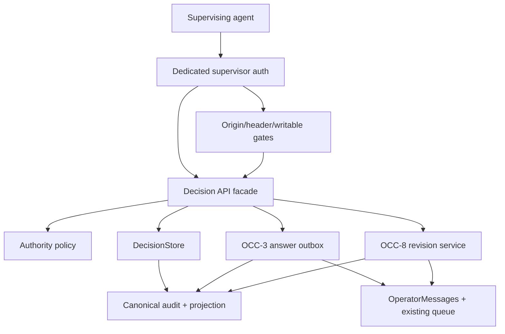
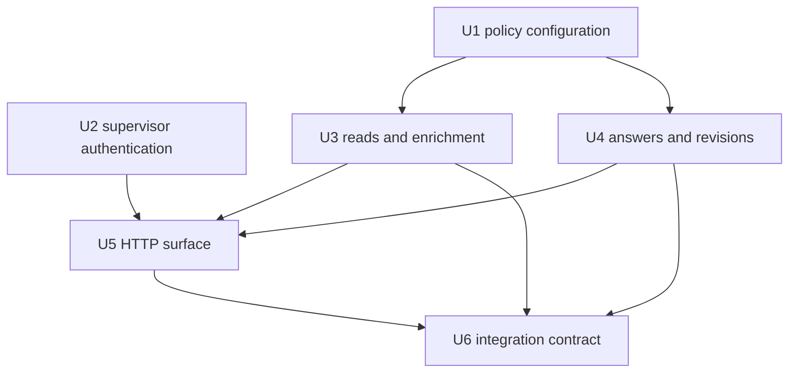
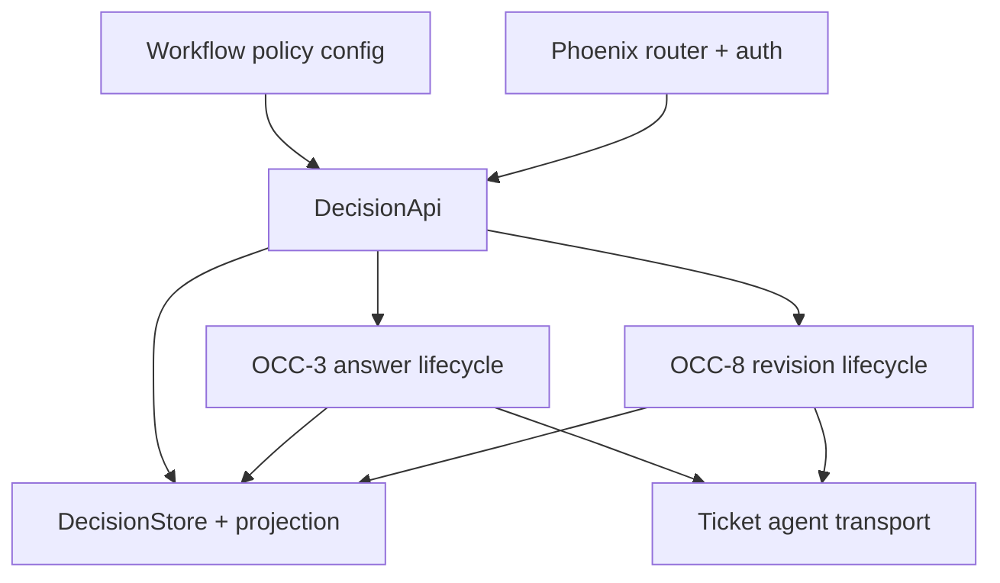

# feat: Add supervisor decision API

## Summary

Add a separately authenticated machine API over the existing DecisionStore,
with fail-closed delegation policy and trusted supervisor audit metadata. Reads,
enrichment, answers, and revisions reuse the OCC decision and outbox services;
this work introduces no parallel persistence, dispatch, or revision path.

---

## Problem Frame

OCC-1 made requests durable, while OCC-3 and OCC-8 own durable answers and
revisions. A supervising agent still lacks an authenticated, machine-readable
surface that can inspect those records, safely enrich them, or act within an
operator-defined delegation policy without impersonating a human or bypassing
the canonical audit and dispatch lifecycle.

---

## Requirements

- R1. Expose machine-readable list, get, enrich, decide, and revise operations
  for canonical Decisions, with stable routes and structured success/error
  responses.
- R2. Authenticate every Decision API request with a dedicated supervisor
  credential that is independent of dashboard Basic Auth, never accepted from
  request content, persisted, or logged. Missing, blank, or insufficiently
  strong configured credentials leave the API fail-closed. The MVP accepts only
  bearer-safe tokens of at least 32 bytes with no surrounding whitespace.
- R3. Derive one trusted supervising-agent actor from the authenticated request;
  reject payload attempts to choose or impersonate the actor.
- R4. Preserve the existing HTTP safety model: mutations remain fail-closed
  behind dashboard writability, same-origin/Referer validation, and the
  `X-Aiur-Request` custom-header gate; reads remain authenticated but do not
  require browser-oriented mutation gates. Origin comparison must parse and
  compare exact scheme, host, and effective port rather than use string-prefix
  matching.
- R5. Treat `human_required` as absolute. Configuration may not authorize a
  supervising agent to answer or revise a Decision carrying that authority.
- R6. Permit `supervisor_allowed` and `supervisor_preferred` actions only when
  the Decision kind is explicitly allowlisted by operator configuration.
  Missing or unknown kinds remain human-required in effect.
- R7. Require a second explicit configuration opt-in before a supervisor may
  act on irreversible or partially reversible Decisions. The default policy
  therefore keeps destructive, credential, product, contractual, and materially
  irreversible choices human-required unless deliberately delegated.
- R8. Restrict enrichment to context-building fields such as summaries,
  options, recommendations, consequences, and artifacts. Enrichment must not
  weaken authority, change risk/reversibility, retarget the ticket/source, or
  forge canonical identity/timestamps.
- R9. Serialize enrichment through DecisionStore with an expected version,
  append-only actor provenance, full existing validation/redaction, and stale or
  idempotency conflicts that append and publish nothing.
- R10. Delegate supervisor answers to OCC-3's public DecisionStore answer/outbox
  operation. Preserve its persist-before-dispatch ordering, action identity,
  stale/idempotency semantics, delivery correlation, and wake/resume gates.
- R11. Require supervisor decisions to record a bounded rationale, confidence,
  policy basis, alternatives considered, and reversibility belief in addition
  to OCC-3's selected option or custom response.
- R12. Delegate revisions to OCC-8's public DecisionStore revision operation,
  injecting only the trusted actor/authority context. The API must not call
  OperatorMessages, inspect the tracker, or create/resolve follow-up attentions
  itself. OCC-8 owns the durable parent follow-up fact and must append its
  handled/superseded fact before the stable reminder projection is resolved.
- R13. Return deterministic, redacted Decision JSON that includes current
  request/lifecycle correlation and a policy evaluation explaining whether the
  supervisor may act. List results must be deterministically ordered and
  bounded.
- R14. Reuse DecisionStore, DecisionProjection, Events.Exchange,
  DecisionPubSub, OperatorMessages, and the existing HTTP router/controller
  conventions. Do not add a second store, queue, event bus, or dashboard LLM
  call.
- R15. Cover configuration, authentication, authorization, enrichment,
  delegated answer/revision handoff, stale/idempotency conflicts, redaction,
  read-only mode, route ordering, and restart-safe integration with focused
  tests and a downstream contract document.

---

## Scope Boundaries

- Do not build the Decision inbox, cards, detail view, browser controls, or
  supervisor-decision history UI; OCC-4 and OCC-6 own those surfaces.
- Do not project legacy attentions into Decisions; OCC-2 owns that adapter.
- Do not reimplement OCC-3 answer normalization, queue correlation, delivery,
  acknowledgement, resolution, or retry behavior.
- Do not reimplement OCC-8 revision validation, target revalidation, corrective
  dispatch, or no-longer-applicable parent follow-up facts, stable attention
  projection, handling, or supersession behavior.
- Do not make a new model call from the dashboard or automatically choose an
  answer. The external supervising agent decides when it calls the API.
- Do not introduce multi-user RBAC, token issuance/rotation services, OAuth,
  cross-run analytics, or unrelated observability API refactors.
- Do not put supervisor credentials in workflow YAML, Decision payloads, logs,
  query strings, or the canonical Decision audit.

### Deferred to Follow-Up Work

- Browser Decision controls and human-actor authentication remain with OCC-4.
- Rich history/timeline presentation remains with OCC-6.
- Policy templates, multiple supervisor identities, scoped tokens, and
  automatic policy-driven invocation remain post-MVP follow-ups.

---

## Context & Research

### Relevant Code and Patterns

- `src/lib/aiur/decision_store.ex` is the sole public Decision application
  service and serialized writer; every new mutation must preserve its
  persist-before-notify boundary.
- `src/lib/aiur/decision_projection.ex` owns JSON-safe canonical projection and
  replay validation. API encoding should extend/reuse this representation
  rather than construct a second drifting schema.
- `src/lib/aiur_web/router.ex` already separates dashboard Basic Auth, REST
  mutation CSRF defenses, and fail-closed dashboard writability.
- `src/lib/aiur_web/controllers/observability_api_controller.ex` establishes
  the repository's controller response and injected-runtime dependency
  patterns.
- `src/lib/aiur/config/schema/observability.ex` and
  `src/lib/aiur/config/schema.ex` establish embedded, validated workflow
  configuration with safe defaults.
- `docs/operator-control-center/04-occ-3-answer-delivery-contract.md` (from
  #981 when its implementation branch becomes usable) owns answer/outbox and
  action-correlation semantics.
- `docs/operator-control-center/05-occ-8-decision-revision-contract.md` and
  `Aiur.DecisionRevision` (from #985) own revision correlation and validation;
  downstream callers inject actor context and delegate to the store.

### Institutional Learnings

- `docs/operator-control-center/02-occ-0-audit-and-design-decisions.md` fixes
  DecisionStore as the durable outbox and existing modules as transport. This
  rules out a controller-owned queue or a new API-specific service of record.
- `docs/operator-control-center/03-occ-1-decision-contract.md` makes ticket,
  source, timestamps, and canonical identity trusted runtime data and documents
  the existing bounded/redacted validation path.
- No `docs/solutions/` directory exists on the baseline branch. The accepted OCC
  design notes and sibling contract documents are the relevant repository-owned
  precedents.

### External References

- [Plug.BasicAuth](https://hexdocs.pm/plug/Plug.BasicAuth.html) documents the
  low-level pattern for parsing credentials, assigning an authenticated actor,
  and comparing credentials without ordinary equality.
- [Plug.Crypto](https://hexdocs.pm/plug_crypto/2.1.1/Plug.Crypto.html) provides
  constant-time binary comparison for the supervisor token.
- [Phoenix routing](https://hexdocs.pm/phoenix/routing.html) confirms that route
  order and scoped pipelines are the appropriate boundary for the dedicated
  Decision API authentication stack.

---

## Key Technical Decisions

| Decision | Rationale |
|---|---|
| Use a dedicated high-entropy bearer credential from `AIUR_SUPERVISOR_TOKEN` | Dashboard Basic Auth identifies a browser/operator boundary and cannot truthfully distinguish machine decisions. A separate secret lets the API inject a trusted supervisor actor without accepting actor claims from JSON. Requiring at least 32 bearer-safe bytes, rejecting surrounding whitespace, and documenting random generation turns “high entropy” into a mechanical fail-closed check. |
| Keep the machine routes outside the dashboard Basic Auth pipeline | An HTTP request cannot carry both Basic and Bearer schemes in one Authorization header. The Decision API receives its own required auth pipeline while the existing dashboard routes remain unchanged. |
| Preserve `api_write` and `require_writable` on mutations | Bearer authentication answers who is calling; it does not replace the existing defense-in-depth and operator opt-in for state changes. |
| Make supervisor eligibility an explicit kind allowlist plus a non-reversible opt-in | A denylist over the existing free-form kind field is bypassable by unknown labels. An empty allowlist is safely inert, and risky categories become eligible only through operator configuration. |
| Keep `human_required` absolute | A supervisor credential or configuration change must not silently override the authority recorded on a specific Decision. Reclassification requires a trusted human-owned path outside this API. |
| Introduce one `Aiur.DecisionApi` facade | Controllers need a stable list/get/enrich/decide/revise contract, but DecisionStore remains the writer. The facade handles policy, trusted actor injection, encoding, and dependency adaptation without becoming persistence. |
| Make enrichment a narrow patch, not a general Decision update | The PRD asks supervisors to add context/options/recommendations. Preventing policy and identity fields from changing closes a privilege-escalation path and preserves the origin agent's exact fork. |
| Delegate answers and revisions without dispatch code in the API | OCC-3 and OCC-8 already own persistence, target checks, retries, OperatorMessages, and follow-up behavior. Thin delegation preserves one append-only lifecycle and one outbox. |
| Snapshot policy reasoning into accepted supervisor actions | Configuration can change later. Audit history must retain which authority and policy checks justified the action at acceptance time rather than recomputing history from current config. |

---

## Open Questions

### Resolved During Planning

- How does an external supervisor authenticate? A dedicated high-entropy bearer
  credential is required for every Decision API operation; it is sourced from
  the environment, must contain at least 32 bearer-safe bytes without surrounding
  whitespace, and is compared through fixed-length digests in constant time.
- How are risky categories kept safe when `kind` is free-form? Supervisor
  autonomy uses an allowlist, not a risky-kind denylist. Unknown and missing
  kinds are ineligible.
- Can configuration override a `human_required` record? No. Configuration only
  narrows or permits Decisions already marked `supervisor_allowed` or
  `supervisor_preferred`.
- Can enrichment change authority or reversibility? No. It is limited to
  explanatory context/options/recommendation/artifact fields.
- Who implements revision side effects? OCC-8. The API supplies the trusted
  actor and delegates to its DecisionStore operation; it never calls transport
  or opens/resolves the no-longer-applicable reminder. OCC-8 durably records the
  parent follow-up requirement and any handled/superseded fact before projecting
  or resolving that stable reminder.
- Can list/get use dashboard Basic Auth instead? No. Keeping one machine
  identity across reads and mutations makes the audit and operational contract
  predictable and avoids ambiguous actor provenance.

### Deferred to Implementation

- The exact OCC-3/OCC-8 function names and result tuples must be reconciled
  against their validated pushed branches before integration. Their documented
  semantics, not provisional names, are the stable dependency.
- The final response envelope fields should reuse the expanded
  DecisionProjection after #981/#985 land; small naming adjustments may be
  needed to avoid a second serializer.
- Whether policy configuration belongs in a compact `decisions` schema or a
  nested supervisor-policy schema may be adjusted to match nearby config style,
  while retaining the same safe defaults and public YAML meaning.

---

## High-Level Technical Design

> *This illustrates the intended approach and is directional guidance for
> review, not implementation specification. The implementing agent should treat
> it as context, not code to reproduce.*

Policy is evaluated from the current canonical Decision plus current operator
configuration. The accepted answer/revision stores the policy decision as audit
metadata before any downstream dispatch occurs.

| Recorded authority | Kind allowlisted | Reversibility permitted | Supervisor mutation |
|---|---:|---:|---|
| `human_required` | Any | Any | Denied |
| `supervisor_allowed` | No | Any | Denied |
| `supervisor_preferred` | No | Any | Denied |
| Allowed/preferred | Yes | No | Denied |
| Allowed/preferred | Yes | Yes | Delegated to canonical store service |

---

## Implementation Units

### U1. Add fail-closed supervisor authority policy

**Goal:** Represent explicit operator delegation in validated configuration and
evaluate one current Decision without mutating it.

**Requirements:** R5, R6, R7, R13, R15

**Dependencies:** OCC-1 (merged)

**Files:**
- Create: `src/lib/aiur/config/schema/decisions.ex`
- Create: `src/lib/aiur/decision_authority.ex`
- Modify: `src/lib/aiur/config/schema.ex`
- Modify: `src/lib/aiur/config.ex`
- Modify: `.aiur/examples/config.example`
- Test: `src/test/aiur/config/schema_test.exs`
- Test: `src/test/aiur/decision_authority_test.exs`
- Test: `src/test/aiur/workspace_and_config_test.exs`

**Approach:**
- Add Decision policy configuration whose defaults contain no delegated kinds
  and do not permit non-reversible actions.
- Normalize configured kinds into a bounded, deterministic set and reject
  invalid/blank entries rather than silently broadening policy.
- Evaluate recorded authority first, kind allowlisting second, and
  reversibility last. Return a structured eligibility result with reasons so
  both API responses and persisted action metadata use the same policy logic.
- Treat both irreversible and partially reversible as non-reversible for the
  default gate. Never provide a configuration path that overrides
  `human_required`.

**Execution note:** Implement policy tests first because this is the safety
boundary for every later mutation.

**Patterns to follow:**
- `src/lib/aiur/config/schema/observability.ex` for embedded-schema defaults and
  validation.
- `src/lib/aiur/decision_validation.ex` for bounded enums/text and structured
  matchable failures.

**Test scenarios:**
- Happy path: a reversible, allowlisted `supervisor_allowed` Decision is
  eligible and returns the policy facts that authorized it.
- Happy path: `supervisor_preferred` follows the same safety checks while
  retaining its distinct recorded authority.
- Safe default: empty configuration denies every supervisor mutation without
  changing the Decision.
- Safe default: human-required Decisions remain denied even when their kind and
  reversibility are configured as delegable.
- Edge case: missing, blank, differently-cased, duplicate, unknown, or overlong
  kinds normalize or reject deterministically without wildcard behavior.
- Risk gate: irreversible and partially reversible Decisions remain denied
  until the explicit non-reversible opt-in is enabled.
- Configuration: omitted fields preserve safe defaults; valid explicit values
  round-trip through workflow parsing and `Config` accessors.

**Verification:**
- No current Decision can become supervisor-eligible unless all three recorded
  authority, configured kind, and reversibility gates permit it.

### U2. Add a dedicated trusted supervisor authentication boundary

**Goal:** Authenticate machine callers independently of the human dashboard and
inject one trusted actor without exposing the secret.

**Requirements:** R2, R3, R4, R15

**Dependencies:** None

**Files:**
- Create: `src/lib/aiur_web/supervisor_auth.ex`
- Modify: `src/lib/aiur_web/router.ex`
- Test: `src/test/aiur_web/supervisor_auth_test.exs`
- Test: `src/test/aiur_web/router_auth_test.exs`

**Approach:**
- Require a high-entropy bearer token sourced from `AIUR_SUPERVISOR_TOKEN`;
  missing, blank, malformed, mismatched, shorter-than-32-byte, or
  surrounding-whitespace credentials fail closed before controller code. Limit
  accepted configured values to the HTTP Bearer token character set and
  document generation from at least 32 random bytes. Read the environment at
  request time so deliberate rotation does not require an Aiur restart.
- Compare fixed-length cryptographic digests with Plug's constant-time primitive
  and avoid interpolating either the configured or presented token into
  logs/errors.
- Assign the fixed actor kind and stable MVP identity `supervising-agent` to the
  connection. Ignore and later reject actor fields in request bodies; multiple
  supervisor identities remain explicitly out of scope.
- Give Decision API routes their own authentication pipeline rather than
  stacking Bearer on dashboard Basic Auth. Keep all existing dashboard and
  machine-hook routes on their present pipelines.
- Apply same-origin/custom-header/writable pipelines in addition to supervisor
  auth for mutations, not for read-only list/get.
- Replace the current origin-prefix comparison with parsed, exact scheme, host,
  and effective-port equality before the new mutation routes depend on it.
  Reject userinfo, malformed origins, suffix hosts such as
  `localhost.example`, and origin path/query/fragment components.

**Execution note:** Characterize current dashboard Basic Auth and generic route
matching before inserting the more-specific Decision routes.

**Patterns to follow:**
- `src/lib/aiur_web/router.ex` runtime auth and mutation-gate plugs.
- Plug.BasicAuth's low-level authenticate-and-assign pattern and
  `Plug.Crypto.secure_compare/2`.

**Test scenarios:**
- Happy path: the configured bearer token authenticates list/get and injects a
  supervisor actor without exposing the token in the response.
- Authentication: absent configuration, missing header, wrong scheme, empty or
  weak token, whitespace-padded token, invalid Bearer characters, duplicate
  authorization headers, and mismatched token all halt before dispatch with the
  same fixed redacted response.
- Security: request bodies containing actor/type/id cannot alter the assigned
  actor.
- Mutation gates: a valid token without allowed Origin/Referer, custom header,
  or dashboard writability is still rejected.
- Origin boundary: exact loopback/Endpoint origins and normalized default ports
  pass; prefix/suffix lookalikes, userinfo, paths, malformed values, and port
  mismatches fail.
- Read parity: a valid token can use list/get without Origin or writable mode.
- Regression: dashboard Basic Auth, pane controls, Claude hooks, state/issue
  reads, and generic method/not-found responses retain their existing behavior.

**Verification:**
- Every Decision API action receives its actor only from successful dedicated
  authentication, while no pre-existing route changes auth behavior.

### U3. Add canonical reads and constrained supervisor enrichment

**Goal:** Give machine callers deterministic Decision inspection and safe
context enrichment through the canonical store.

**Requirements:** R1, R3, R8, R9, R13, R14, R15

**Dependencies:** U1; adopt #981's event/projection model before modifying
Decision lifecycle files

**Files:**
- Create: `src/lib/aiur/decision_api.ex`
- Create: `src/lib/aiur/decision_enrichment.ex`
- Modify: `src/lib/aiur/decision_store.ex`
- Modify: `src/lib/aiur/decision_event.ex` (from #981)
- Modify: `src/lib/aiur/decision_projection.ex`
- Test: `src/test/aiur/decision_api_test.exs`
- Test: `src/test/aiur/decision_enrichment_test.exs`
- Test: `src/test/aiur/decision_store_test.exs`

**Approach:**
- Make DecisionApi the non-persistent facade over injected/default
  DecisionStore and policy dependencies.
- Reuse the canonical JSON-safe projection for list/get and augment it with a
  current policy evaluation rather than copying Decision serialization.
- Deterministically sort list output and support only bounded, validated filters
  and limits; malformed filters fail explicitly rather than broadening results.
- Normalize enrichment as a narrow patch over the current record. Accept only
  context, options, recommendation, consequence, and artifacts, then run the
  merged content through the existing Decision validation/redaction pipeline.
- Require the caller's expected version. Persist enrichment as an append-only
  event/snapshot carrying trusted supervisor provenance, then publish only
  after audit and projection durability.
- Reject immutable/policy fields and actor claims instead of silently ignoring
  them, so clients cannot believe a forbidden update succeeded.

**Execution note:** Start with failing store/API tests that prove stale and
forbidden enrichment appends nothing and sends no live notification.

**Patterns to follow:**
- `src/lib/aiur/decision_store.ex` serialized optimistic versioning and
  persist-before-notify sequencing.
- `src/lib/aiur/decision_projection.ex` canonical JSON-safe representation.
- `src/lib/aiur/decision_validation.ex` full-object normalization after a patch
  is merged.

**Test scenarios:**
- Read: list returns deterministic bounded records and get returns one full
  canonical record plus current supervisor eligibility.
- Read: empty store, unknown Decision, corrupt/read-only store, and supported
  filters return explicit stable outcomes without mutation.
- Enrichment: a current-version context/options/recommendation patch appends one
  version with the trusted supervisor actor and publishes after persistence.
- Idempotency: replaying the same enrichment returns the existing version with
  no second append/publication; same version plus different content conflicts.
- Stale state: enriching an older version returns current correlation and
  appends nothing.
- Authorization: authority, kind, reversibility, question, identity, source,
  ticket, timestamp, content hash, and actor fields are rejected as forbidden.
- Validation: dangling recommendation, unsafe artifact, secret-like text,
  control bytes, overlong fields, and excessive collections reuse current
  validation/redaction behavior.
- Lifecycle: enrichment after an accepted answer preserves OCC-3 answer/action
  and delivery history and does not schedule another dispatch.

**Verification:**
- API reads are projections of DecisionStore, and every accepted enrichment is
  a durable, attributed version that cannot weaken delegation policy.

### U4. Delegate supervisor answers and revisions to sibling services

**Goal:** Authorize rich supervisor actions, snapshot the policy basis, and hand
them to OCC-3/OCC-8 without duplicating their lifecycle or transport.

**Requirements:** R3, R5, R6, R7, R10, R11, R12, R14, R15

**Dependencies:** U1; #981 must expose the reviewed answer/outbox service; #985
must expose the reviewed DecisionStore revision service and be stacked on the
usable #981 contract

**Files:**
- Create: `src/lib/aiur/decision_delegation.ex`
- Modify: `src/lib/aiur/decision_api.ex`
- Modify: `src/lib/aiur/decision_answer.ex` (from #981, only for bounded
  supervisor decision-basis metadata if its landed extension seam requires it)
- Test: `src/test/aiur/decision_delegation_test.exs`
- Test: `src/test/aiur/decision_api_test.exs`

**Approach:**
- Re-read the current Decision and evaluate policy immediately before each
  mutation. Do not authorize from stale list/get output.
- Normalize required supervisor rationale, confidence, alternatives,
  reversibility belief, and the evaluated authority/policy facts into bounded,
  redacted decision-basis metadata.
- Inject the authenticated actor and normalized policy snapshot through trusted
  options. Reject any payload actor or claimed authority/policy substitution.
- For decide, call OCC-3's one public answer operation with expected request
  version and caller-stable idempotency key; return its recorded/queued/
  conflict state without calling transport.
- For revise, call OCC-8's one public revision operation with expected request
  version, active action, revision sequence, and caller-stable idempotency key;
  return its rejected/recorded/dispatched/no-longer-applicable vocabulary
  without tracker, transport, or attention calls.
- When OCC-8 reports or later reconciles `no_longer_applicable`, leave its
  deterministic parent `follow_up_required` fact, stable attention projection,
  and eventual handled/superseded ordering entirely inside that service. The
  API may encode the service result but must not resolve the reminder itself.
- Preserve exact OCC-3/OCC-8 duplicate and conflict semantics. Policy denial
  occurs before either mutation and appends nothing.

**Execution note:** Use injected fake sibling services first, then replace them
with the actual validated exports from #981/#985 and rerun the same contract
tests.

**Patterns to follow:**
- #981's `Aiur.DecisionAnswer` and DecisionStore answer API for bounds, action
  correlation, durable outbox, and trusted actor handling.
- #985's `Aiur.DecisionRevision` and DecisionStore revision API for ordered
  corrections and target revalidation.

**Test scenarios:**
- Decide happy path: an eligible current Decision with complete supervisor basis
  delegates exactly once and persists actor, authority, policy basis,
  confidence, alternatives, and reversibility belief before dispatch.
- Revise happy path: an eligible current action delegates once to OCC-8 and
  preserves its result vocabulary and corrective dispatch semantics.
- Authority: human-required, unallowlisted kind, missing kind, and disallowed
  reversibility are rejected before either sibling service runs.
- Input: missing/invalid confidence, rationale, alternatives, reversibility
  belief, expected correlation, or idempotency key fails before store mutation.
- Trust: payload actor/authority/policy fields cannot replace authenticated and
  evaluated values.
- Stale/concurrent: stale request version, active action, or revision sequence
  surfaces current correlation; two racing calls retain the sibling service's
  one-winner behavior.
- Idempotency: exact API retries return the existing answer/revision action;
  conflicting token reuse appends and dispatches nothing.
- Failure: unavailable/read-only DecisionStore, target unavailable, dispatch
  pending/failed, and no-longer-applicable results are mapped without a second
  retry loop in DecisionApi.
- Follow-up ordering: a no-longer-applicable result is observable only through
  OCC-8's durable parent fact and stable reminder projection; handling or
  superseding it records the canonical parent fact before reminder resolution.
- Isolation: DecisionApi never calls OperatorMessages, tracker clients,
  DecisionAttention, Alerts, or Events.Exchange directly for answer/revision.

**Verification:**
- Every supervisor answer/revision is either denied before mutation or appears
  in the same append-only action lifecycle used by human callers.

### U5. Expose the versioned HTTP Decision API

**Goal:** Route authenticated JSON operations to DecisionApi with consistent
status, conflict, and redaction behavior.

**Requirements:** R1, R2, R3, R4, R13, R15

**Dependencies:** U2, U3, U4

**Files:**
- Create: `src/lib/aiur_web/controllers/decision_api_controller.ex`
- Modify: `src/lib/aiur_web/router.ex`
- Modify: `src/lib/aiur/http_server.ex`
- Test: `src/test/aiur_web/controllers/decision_api_controller_test.exs`
- Test: `src/test/aiur_web/router_auth_test.exs`

**Approach:**
- Add list/get routes plus explicit enrich/decide/revise action routes under
  `/api/v1/decisions`, before the existing generic issue-identifier route.
- Give read and mutation scopes the dedicated auth pipeline; add existing
  mutation safety pipelines only to enrich/decide/revise.
- Inject DecisionApi/runtime dependencies through Endpoint configuration for
  isolated controller tests, preserving production defaults.
- Translate validation, authentication/authorization, missing record,
  optimistic conflict, unavailable dependency, and accepted/pending outcomes
  into stable JSON error/result categories. Never serialize raw exceptions,
  tokens, inspected payloads, or unredacted downstream terms.
- Add explicit method handling so a wrong verb does not fall through to the
  existing `/api/v1/:issue_identifier` route and masquerade as an issue lookup.

**Execution note:** Pin route-order and mutation-gate tests before adding
controller behavior because the generic issue route is an existing external
contract.

**Patterns to follow:**
- `src/lib/aiur_web/controllers/observability_api_controller.ex` JSON response,
  dependency injection, method-not-allowed, and not-found conventions.
- `src/lib/aiur_web/router.ex` scoped pipeline ordering and fail-closed plugs.

**Test scenarios:**
- HTTP happy path: authenticated list/get return canonical Decision data; valid
  enrich/decide/revise requests reach the matching DecisionApi operation.
- Methods: unsupported verbs on collection, detail, and action paths return
  method-not-allowed rather than issue data or generic not-found.
- Authentication: all five operations require the supervisor token; mutation
  auth failures occur before parsing/delegation side effects.
- Mutation safety: valid auth still requires allowed origin/custom header and
  writable mode; list/get remain available in read-only mode.
- Errors: not found, invalid input, forbidden policy, stale/idempotency conflict,
  store unavailable, and dispatch/revision pending/failure map to stable,
  redacted response categories.
- Parser boundary: path Decision ID wins over body/query collisions, and body
  actor/policy values cannot affect trusted context.
- Regression: existing `/api/v1/state`, `/api/v1/:issue_identifier`, messages,
  pane, hook, dashboard, and catch-all routes retain exact behavior.

**Verification:**
- A caller with only the documented supervisor credential and safety headers
  can drive all five operations without a browser, and no route bypasses its
  intended authentication or mutation gate.

### U6. Prove and document the end-to-end supervisor contract

**Goal:** Demonstrate policy-to-audit-to-dispatch behavior across real
application seams and leave a precise machine-client handoff.

**Requirements:** R1-R15

**Dependencies:** U3, U4, U5; usable integrated #981 and #985 branches

**Files:**
- Create: `src/test/aiur/decision_api_integration_test.exs`
- Create: `docs/operator-control-center/06-occ-7-supervisor-decision-api-contract.md`
- Modify: `docs/operator-control-center/README.md`
- Modify: `src/README.md`
- Modify: `.env.example`

**Approach:**
- Start the real DecisionStore plus the smallest real OCC-3/OCC-8 application
  seams needed to prove reads, enrichment, answer outbox, and revision
  delegation under one authenticated actor.
- Assert canonical audit/projection bytes and zero side effects at each denied,
  stale, duplicate, or conflicting boundary.
- Exercise HTTP auth and mutation gates through Endpoint while observing the
  same store state used by direct application calls.
- Document credentials, configuration defaults, routes, required correlation,
  policy evaluation, result/error vocabulary, retry/idempotency rules, and the
  fact that revision never implies rollback.
- Document the deployment caveat that bearer credentials require a protected
  transport boundary: prefer loopback/private tunnel or an HTTPS reverse proxy
  for remote access.

**Patterns to follow:**
- `src/test/aiur/decision_delivery_integration_test.exs` from #981 for durable
  outbox/restart setup.
- `docs/operator-control-center/04-occ-3-answer-delivery-contract.md` and
  `05-occ-8-decision-revision-contract.md` for downstream contract structure.
- Existing endpoint integration tests in `src/test/aiur/extensions_test.exs`.

**Test scenarios:**
- End to end: authenticated list/get, context enrichment, eligible supervisor
  answer, queue acceptance, and explicit lifecycle evidence all appear in one
  canonical Decision history with trusted actor/policy metadata.
- Revision: an authenticated eligible revision reaches OCC-8, preserves the
  original answer, and exposes recorded/dispatched/no-longer-applicable without
  any rollback claim.
- Revision follow-up: no-longer-applicable durably appends the deterministic
  parent `follow_up_required` fact before projecting one stable reminder, and a
  later handle/supersede action appends its parent fact before that reminder is
  resolved. DecisionApi performs none of those side effects directly.
- Safe defaults: configured token plus default policy can read/enrich but cannot
  answer/revise; audit and queue remain unchanged.
- Human required: even permissive kind/non-reversible configuration cannot
  delegate a human-required Decision.
- Retry: HTTP replays before and after queue/revision settlement return the same
  logical actions and do not duplicate messages.
- Concurrency: two authenticated calls racing the same version/action produce
  the canonical one-winner conflict behavior.
- Restart/read-only: open Decisions remain readable; corrupt/unavailable store
  blocks enrichment/answer/revision and never dispatches.
- Security: token and secret-like payload text are absent from response bodies,
  logger capture, generic events, alerts, and persisted unredacted fields.

**Verification:**
- The documented machine workflow matches executable tests from HTTP
  authentication through canonical persistence and sibling-owned dispatch.

---

## System-Wide Impact

- **Interaction graph:** Dedicated auth assigns the actor; DecisionApi reads
  policy/config and delegates to DecisionStore, OCC-3, or OCC-8; those services
  alone publish and dispatch after persistence.
- **Error propagation:** Authentication and policy failures stop at HTTP/API
  boundaries. Validation and optimistic conflicts retain structured current
  correlation. Store/outbox/revision availability failures propagate without
  controller retries or inspected internal terms.
- **State lifecycle risks:** Policy can change between read and mutation, so it
  is re-evaluated at mutation time and snapshotted into accepted actions.
  Enrichment advances request version without erasing answer/revision state.
- **API surface parity:** Human LiveView controls will eventually call the same
  DecisionStore operations but do not share the machine credential or
  supervisor policy assumption.
- **Integration coverage:** Unit tests cannot prove that authorization metadata
  survives persistence or that no dispatch precedes audit; U6 crosses those
  boundaries.
- **Unchanged invariants:** Dashboard Basic Auth, generic observability reads,
  pane/hook machine routes, plain operator chat, legacy attentions, and generic
  `decision.<slug>` coordination events keep their existing contracts.

---

## Dependencies / Prerequisites

- OCC-1 / PR #1017 is merged and supplies the request schema, durable store,
  projection, validation, and PubSub foundation.
- #981 must publish a usable answer/outbox implementation matching its reviewed
  contract. The currently inspected branch initially contained only its plan.
- #985 must publish the DecisionStore revision operation matching
  `05-occ-8-decision-revision-contract.md`. Its inspected branch currently
  supplies replay-safe `Aiur.DecisionRevision` validation and deterministic
  follow-up helpers through `6bcf97b`, but not the complete store/dispatcher
  integration.
- When both blocker branches are open, stack on the branch that contains the
  integrated OCC-3 + OCC-8 contracts and base this PR on that validated ref.
  Do not merge temporary stubs or duplicate blocker-owned modules.

---

## Phased Delivery

### Phase 1 — blocker-independent safety boundaries

- Land U1 policy configuration/evaluation and U2 dedicated authentication with
  their unit and route-regression tests.
- Build the injected DecisionApi read/policy facade where it can compile against
  OCC-1, but do not invent answer/revision modules or publish placeholder
  transport behavior.

### Phase 2 — validated sibling integration

- Inspect the actual #981 and #985 pushed exports and stack on the branch that
  contains both reviewed contracts.
- Complete U3-U6 against the real audit envelope, answer outbox, and revision
  operation; remove any local-only seam assumptions before pushing the
  implementation PR.
- Base the draft PR on the still-open integrated blocker branch when required,
  then retarget to `v2` only after the blockers merge.

---

## Alternative Approaches Considered

- Reuse dashboard Basic Auth for the supervisor API: rejected because one
  shared browser credential cannot truthfully distinguish a supervising-agent
  actor in the audit and conflicts with machine Bearer semantics.
- Accept actor and authority from JSON: rejected because an authenticated caller
  could impersonate a human or claim a broader policy than configuration grants.
- Use a risky-kind denylist: rejected because Decision kind is intentionally
  free-form; unknown labels would bypass a denylist. An allowlist fails closed.
- Allow configuration to override `human_required`: rejected because the PRD
  explicitly forbids silently automated human-required decisions.
- Let the controller merge enrichment and call `request/2`: rejected because
  actor provenance, allowed fields, version conflicts, and post-persist
  notification belong in the serialized Decision application service.
- Dispatch answers or revisions directly from the API: rejected because it
  creates a second transport path and breaks persist-before-dispatch,
  idempotency, target revalidation, and append-only lifecycle ownership.
- Wait for OCC-4 and expose only LiveView controls: rejected because OCC-7's
  machine-readable, browser-independent supervisor API is an explicit goal.

---

## Risk Analysis & Mitigation

| Risk | Likelihood | Impact | Mitigation |
|---|---|---|---|
| Supervisor token is weak or leaks through logs/errors | Medium | High | At least 32 bearer-safe bytes without surrounding whitespace, documented random generation, environment-only secret, fixed-length digest comparison, fixed redacted auth errors, logger-capture tests, and no payload/query support for credentials. |
| Free-form kind accidentally grants risky autonomy | Medium | High | Empty-by-default allowlist; missing/unknown kinds deny; explicit non-reversible opt-in; human-required absolute. |
| Policy changes after a list/get response | High | Medium | Re-read the Decision and re-evaluate policy inside the mutation flow; persist the accepted policy snapshot. |
| Enrichment becomes privilege escalation | Medium | High | Narrow mutable-field allowlist; reject authority/kind/reversibility/identity/actor fields; rerun canonical validation. |
| API duplicates OCC-3/OCC-8 side effects | Medium | High | Thin injected delegates only; tests assert no direct queue/tracker/attention/event calls; stack on real blocker exports. |
| Two sibling branches diverge or expose incompatible provisional APIs | High | High | Treat reviewed contracts as stable, inspect validated pushes, stack on the branch integrating both, and defer exact function names to that integration point. |
| Generic `/api/v1/:issue_identifier` captures Decision paths | Medium | Medium | Define and test specific Decision routes/method catchalls before the generic route. |
| Read-only mode is bypassed by machine auth | Low | High | Keep `require_writable` plus Origin/custom-header gates in addition to Bearer auth for every mutation. |
| Prefix-based Origin matching accepts a lookalike host | Medium | High | Parse and compare exact scheme/host/effective port; reject malformed origins, userinfo, paths, suffix hosts, and port mismatches; pin regression tests before exposing supervisor mutations. |
| Bearer credential sent over unprotected remote HTTP | Medium | High | Document loopback/private-tunnel/HTTPS deployment; retain non-loopback dashboard credential startup guard; never claim transport encryption. |
| Response schema drifts from canonical projection | Medium | Medium | Reuse DecisionProjection and add policy metadata through one facade; contract and equality tests pin output. |

---

## Documentation / Operational Notes

- Document `AIUR_SUPERVISOR_TOKEN` as a required secret for this API and keep it
  out of checked-in workflow configuration. Add only a placeholder to
  `.env.example`; document generation from at least 32 random bytes, the exact
  bearer-safe/no-whitespace validation, and request-time rotation behavior.
- Document the safe default Decision policy and examples that explicitly
  delegate a bounded kind while retaining the non-reversible gate.
- Document that `dashboard_writable: true` is still required for mutations;
  configuring a token alone enables authenticated reads, not control.
- Document required Origin/Referer and `X-Aiur-Request` headers for machine
  mutations, including the endpoint's own externally visible origin.
- Document that supervisor-preferred is an authorization/routing signal, not a
  dashboard-owned automatic model call.
- Document that a revision is an append-only corrective instruction and never
  proof of rollback, revert, undo, or successful application. Document that
  no-longer-applicable is a durable parent follow-up fact with a stable reminder
  projection, not a child Decision, and that OCC-8 records handling before the
  reminder resolves.
- Manual foreground TUI verification is guarded in agent workspaces. Run the
  real `scripts/aiurdev --test` workflow only from the operator repository root;
  focused application/Endpoint tests are the available agent-turn evidence.

---

## Sources & References

- **Origin document:** `docs/operator-control-center/00-prd.md`
- **Ticket decomposition:** `docs/operator-control-center/01-brainstorm-and-decomposition.md`
- **Accepted OCC audit/design:** `docs/operator-control-center/02-occ-0-audit-and-design-decisions.md`
- **OCC-1 contract:** `docs/operator-control-center/03-occ-1-decision-contract.md`
- **OCC-3 reviewed plan:** `docs/plans/2026-07-12-003-feat-decision-answer-delivery-plan.md` on #981
- **OCC-8 contract:** `docs/operator-control-center/05-occ-8-decision-revision-contract.md` on #985
- **Current ticket:** issue #984
- **Planning source:** PR #971
- **Authentication guidance:** https://hexdocs.pm/plug/Plug.BasicAuth.html
- **Constant-time comparison:** https://hexdocs.pm/plug_crypto/2.1.1/Plug.Crypto.html
- **Phoenix route pipelines:** https://hexdocs.pm/phoenix/routing.html
