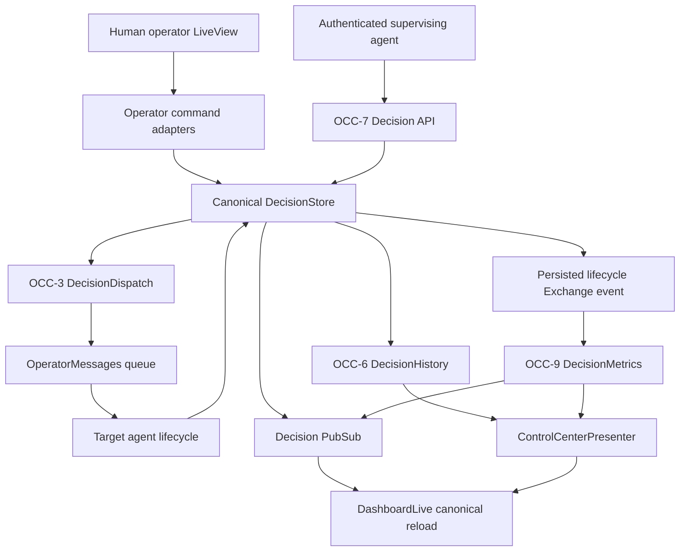
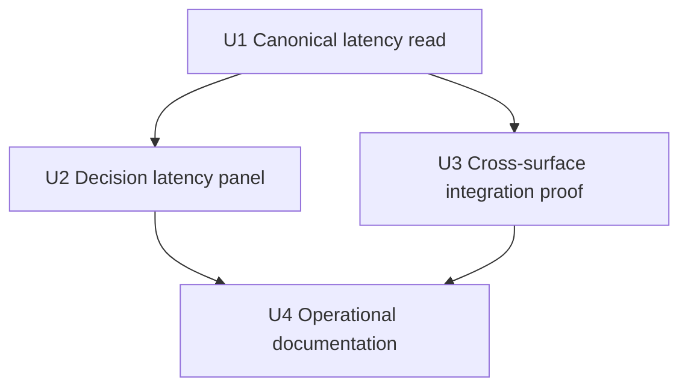

# feat: Complete OCC end-to-end integration

## Summary

Complete the Operator Control Center by reading OCC-9 latency snapshots into the decision detail surface and proving that human LiveView commands, supervising-agent API commands, OCC-8 revisions, OCC-3 delivery correlation, history, outcomes, and stable deep links all converge on the same canonical stores.

---

## Problem Frame

The OCC backend wave and the production dashboard are now merged, but the final integration is uneven. The dashboard already has human answer, retry, and revision handlers backed by `Aiur.DecisionStore`, while the supervising-agent API and latency collector landed independently. There is no latency panel, and existing tests prove the slices mostly in isolation rather than proving the complete request-to-dashboard-to-queue-to-agent-lifecycle flow.

The capstone must close those seams without relabeling human actions as supervising-agent actions, duplicating durable state, or inventing optimistic lifecycle transitions.

---

## Assumptions

*This plan was authored without synchronous user confirmation. The items below are agent inferences that fill gaps in the input — un-validated bets that should be reviewed before implementation proceeds.*

- Human dashboard answers and revisions continue through the canonical `Aiur.DecisionStore` application service with an operator actor; routing them through the supervisor-only `Aiur.DecisionApi` would weaken its trusted-actor boundary and misattribute audit history.
- Supervising-agent enrich/decide/revise actions remain on OCC-7's authenticated machine API. The LiveView must render their resulting canonical state and authority outcomes, but it must not expose a browser control that impersonates the supervising agent.
- A decision becomes acknowledged or resolved only from correlated target-agent lifecycle events. The operator UI displays those transitions after store refresh and does not add a manual button that skips agent acknowledgement.
- OCC-9 latency belongs in the selected decision detail, where one decision's lifecycle intervals can be interpreted without introducing aggregate analytics or recomputing timestamps in the view.

---

## Requirements

- R1. A human answer submitted from the writable LiveView is persisted before OCC-3 dispatch, reaches the real `OperatorMessages` queue with correlation, and never advances the UI beyond canonical store state.
- R2. The UI renders the real Recorded, Dispatch pending, Delivered, Acknowledged, Resolved, Delivery failed, and Superseded states and refreshes after canonical PubSub signals.
- R3. Human revision controls use OCC-8's append-only revision service, retain the original answer, and show the revision in both detail and OCC-6 history.
- R4. OCC-7 enrich/decide/revise mutations share the same DecisionStore projection consumed by LiveView; `human_required` remains absolute while allowed supervisor decisions are visibly attributed.
- R5. The decision detail renders OCC-9 request-to-decision, decision-to-dispatch, dispatch-to-delivery, delivery-to-ack, blocked-time, reminder, actor, and revised facts from the metrics worker, with honest missing/unavailable states.
- R6. History and recent outcomes continue to read OCC-6 providers, and fleet state continues to read the orchestrator projection; the integration must not create substitute stores or recompute those panels in the LiveView.
- R7. Read-only mode hides every mutation control and server handlers continue to fail closed if writability changes after mount.
- R8. `/decisions/:decision_id` remains stable before and after human actions, supervisor API actions, lifecycle transitions, and revisions.
- R9. Focused tests cover every existing decision event handler plus the cross-layer real-store flows, and the PR records the operator-root manual drive-through status.

---

## Scope Boundaries

- Do not redesign the OCC layout, add a second dashboard, or introduce aggregate latency analytics.
- Do not relax OCC-7 supervisor authentication or allow browser payloads to claim an actor, authority, or policy basis.
- Do not add a manual acknowledge/resolve shortcut that bypasses the correlated target-agent lifecycle.
- Do not duplicate `DecisionStore`, `DecisionHistory`, `RecentMergeStore`, or `DecisionMetrics` projections inside `AiurWeb`.
- Do not remove the bounded recent-audit changes that the OCC-4 merge contributed to the canonical backend modules; current `main` contains one copy of each module, and those changes are integration hardening rather than parallel definitions.
- Do not replace the offline `/analytics` report owned by OCC-6.

---

## Context & Research

### Relevant Code and Patterns

- `src/lib/aiur_web/live/dashboard_live.ex` already routes the six decision form/click events through `DecisionEvents`, rechecks the endpoint writable gate server-side, and reloads canonical data after commands.
- `src/lib/aiur_web/operator_control_center/decision_commands.ex` records human answers and retries through `DecisionStore`; `revision_commands.ex` records OCC-8 revisions and parent follow-ups through the same store.
- `src/lib/aiur/decision_api.ex` is deliberately a supervisor-only facade for list/get/enrich/decide/revise and delegates durable mutations to `DecisionStore` after authority evaluation.
- `src/lib/aiur/decision_metrics.ex` owns bounded redacted OCC-9 snapshots but currently exposes only a one-decision read, which is not an efficient dashboard composition boundary.
- `src/lib/aiur/decision_store.ex` publishes the canonical Decision refresh immediately after persistence, while `DecisionMetrics` observes the corresponding Exchange event asynchronously. A dashboard reload can therefore win the mailbox race unless metrics publishes its own refresh hint after updating its projection.
- `src/lib/aiur_web/control_center_cache.ex` keys its short-lived shared payload cache by the provider tuple. The metrics provider must participate in that key so test/runtime providers and restarts cannot reuse another provider set's payload.
- `src/lib/aiur_web/control_center_presenter.ex` and `payload_loader.ex` isolate provider failures and are the established place to compose real domain reads before rendering.
- `src/test/aiur/decision_delivery_integration_test.exs` proves the real DecisionStore → DecisionDispatch → OperatorMessages → delivery/ack/resolution path and provides the setup pattern for a capstone LiveView integration test.
- `src/test/aiur_web/live/dashboard_live_test.exs` already covers human answer, retry, revision, stale conflicts, destructive confirmation, and writable-gate changes with focused handlers.

### Institutional Learnings

- `docs/operator-control-center/00-prd.md` keeps decision state independent from delivery state, forbids Open→Resolved browser shortcuts, and requires the machine API and LiveView to share one application service.
- `docs/operator-control-center/04-occ-3-answer-delivery-contract.md` makes persist-before-dispatch and exact action correlation non-negotiable.
- `docs/operator-control-center/06-occ-7-supervisor-decision-api-contract.md` treats the supervisor actor as server-derived and keeps `human_required` absolute.
- No relevant `docs/solutions/` entry exists; the OCC contract and merged feature plans are the local source of truth.

---

## Key Technical Decisions

| Decision | Choice | Rationale |
|---|---|---|
| Metrics read boundary | Add one bounded bulk snapshot read to `DecisionMetrics` and compose it through `ControlCenterPresenter` | Avoids one GenServer call per decision, preserves OCC-9 as the source of truth, and keeps provider failure isolated. |
| Metrics refresh boundary | Publish a best-effort metrics-changed hint only after the metrics projection records a new event | Eliminates the DecisionStore/metrics observation race without refreshing on ignored or duplicate deliveries, while preserving canonical re-read semantics and letting the existing dashboard debounce/cache coalesce nearby hints. |
| Human command boundary | Retain operator-attributed `DecisionStore` commands | OCC-7's public facade is supervisor-only; reusing it for browser actions would misstate authority and history. |
| Supervisor integration | Prove API-to-LiveView convergence through the shared store and PubSub | Exercises OCC-7 authority without adding an unsafe browser impersonation control. |
| Resolution ownership | Render acknowledgement/resolution from target-agent lifecycle events | Prevents the UI from claiming work was acknowledged or resolved merely because an answer was submitted. |
| Test posture | Add a focused capstone integration test while retaining the existing handler tests | Gives the cross-layer contract one readable proof without duplicating every lower-level edge case. |

---

## Open Questions

### Resolved During Planning

- Are the prerequisite branches still outstanding? No. Issues #981, #983, #984, #985, #986, and #987 are closed and their implementations are present on current `origin/main`.
- Did the OCC-4 merge leave duplicate backend modules? No. The tree contains one canonical `Aiur.DecisionStore` and one `Aiur.DecisionHistory`; the UI merge adjusted those shared modules but did not leave parallel `AiurWeb` copies.
- Should the latency UI derive durations from decision timestamps? No. It must display the already-redacted OCC-9 snapshot.

### Deferred to Implementation

- Exact latency empty-state copy and compact layout: settle while rendering the existing design tokens and responsive detail grid.
- Whether the capstone integration cases fit cleanly in `dashboard_live_test.exs` or merit a dedicated test file: choose the smaller review surface after reusing the existing endpoint/orchestrator helpers.

---

## High-Level Technical Design

> *This illustrates the intended approach and is directional guidance for review, not implementation specification. The implementing agent should treat it as context, not code to reproduce.*

---

## Implementation Units

### U1. Expose and compose canonical decision latency snapshots

**Goal:** Give the dashboard one bounded, failure-isolated OCC-9 read without copying or recomputing metrics.

**Requirements:** R5, R6

**Dependencies:** Merged OCC-9 implementation.

**Files:**

- Modify: `src/lib/aiur/decision_metrics.ex`
- Modify: `src/lib/aiur/decision_pubsub.ex`
- Modify: `src/lib/aiur_web/control_center_presenter.ex`
- Modify: `src/lib/aiur_web/live/dashboard_live.ex`
- Modify: `src/lib/aiur_web/operator_control_center/payload_loader.ex`
- Test: `src/test/aiur/decision_metrics_test.exs`
- Test: `src/test/aiur/decision_pubsub_test.exs`
- Test: `src/test/aiur_web/control_center_cache_test.exs`
- Test: `src/test/aiur_web/control_center_presenter_test.exs`
- Test: `src/test/aiur_web/live/dashboard_live_test.exs`

**Approach:**

- Add a serialized bounded read of retained redacted snapshots, preserving the metrics worker's sample bound and returning no decision content.
- Treat the metrics worker as an independent provider in the control-center payload. Attach snapshots to matching canonical decision rows or expose a decision-id-indexed map, but do not derive intervals from Decision fields.
- Represent provider unavailability separately from a healthy provider that has no retained sample for a decision.
- Route the runtime provider through endpoint/test configuration in the same style as DecisionStore and RecentMergeStore.
- Broadcast a best-effort metrics refresh hint only when a new observation returns `:ok` after updating the in-memory sample; ignored and duplicate deliveries do not refresh the dashboard. Handle the hint through the existing debounced payload reload so the earlier DecisionStore hint and later metrics hint coalesce when possible and still converge when they do not.
- Include the metrics provider in the shared-cache identity, preserving isolation across custom test providers and runtime restarts.

**Patterns to follow:**

- `DecisionMetrics.snapshot/2` for redacted output shape.
- `DecisionPubSub` for best-effort, re-read-only refresh signaling.
- `ControlCenterPresenter.safe_read/3` and provider-health handling for partial dashboard availability.
- `PayloadLoader.providers/0` for runtime dependency selection and test injection.

**Test scenarios:**

- Happy path: multiple retained metrics samples are returned once, remain bounded, and preserve every OCC-9 duration/count/actor/revised field.
- Edge case: a canonical decision with no retained sample renders as missing data rather than zero latency.
- Error path: a stopped metrics worker marks only latency unavailable while decisions, fleet, history, and outcomes remain present.
- Integration: presenter composition associates snapshots by exact decision ID and never leaks one decision's metrics onto another row.
- Integration: a metrics observation that trails the DecisionStore broadcast emits its own hint, causes a later canonical reload, and becomes visible without a browser reconnect or periodic poll.
- Cache: two otherwise-identical provider sets with different metrics workers do not share a cached payload.

**Verification:**

- One presenter load reads OCC-9 once, its payload distinguishes available, missing, and unavailable latency, and a late metrics update reliably reaches an already-connected dashboard.

### U2. Render the OCC-9 latency panel from provider data

**Goal:** Make real lifecycle latency and reminder/revision facts visible on the stable decision detail page.

**Requirements:** R2, R5, R7, R8

**Dependencies:** U1

**Files:**

- Create: `src/lib/aiur_web/components/operator_control_center/decision_latency.ex`
- Modify: `src/lib/aiur_web/components/operator_control_center/decision_detail.ex`
- Modify: `src/priv/static/dashboard.css`
- Test: `src/test/aiur_web/operator_control_center_components_test.exs`
- Test: `src/test/aiur_web/live/dashboard_live_test.exs`

**Approach:**

- Render the canonical interval fields, blocked time, reminder/attention counts, actor class, and revised flag in the detail metadata hierarchy using existing cards/chips and responsive tokens.
- Render unknown individual intervals as pending/unavailable rather than zero; render a provider-level failure distinctly from a decision that simply has no sample yet.
- Keep the panel informational in both writable and read-only modes and preserve the same deep-link route across refreshes.
- Use semantic labels/definition relationships and textual pending/error states so interval meaning and status do not depend on color or visual layout.

**Patterns to follow:**

- `DecisionDetail` metadata blocks and `History` result chips for compact factual presentation.
- `RecentOutcomes` provider-health states for honest empty/degraded/unavailable copy.

**Test scenarios:**

- Happy path: a complete snapshot renders all four stage intervals, blocked time, actor, reminders, and revised state.
- Edge case: an in-flight decision with partial milestones renders pending fields without invented numbers.
- Error path: unavailable metrics renders a local panel error while the answer/revision controls and history remain usable.
- Integration: the panel survives canonical PubSub reloads and the stable deep link remains selected.
- Read-only: latency remains visible while every mutation form/button stays absent.
- Accessibility: each interval and count has a programmatic label, and pending/error meaning remains available without color.

**Verification:**

- Decision detail visibly reflects OCC-9 snapshots and contains no duration arithmetic based on Decision timestamps.

### U3. Prove human, supervisor, revision, and lifecycle convergence

**Goal:** Add one real-store integration proof spanning the previously independent OCC action surfaces.

**Requirements:** R1, R2, R3, R4, R6, R7, R8, R9

**Dependencies:** U1; merged OCC-3, OCC-6, OCC-7, and OCC-8.

**Files:**

- Modify: `src/test/aiur_web/live/dashboard_live_test.exs` or create `src/test/aiur_web/live/dashboard_live_integration_test.exs`
- Modify if a discovered seam requires correction: `src/lib/aiur_web/operator_control_center/decision_commands.ex`
- Modify if a discovered seam requires correction: `src/lib/aiur_web/operator_control_center/revision_commands.ex`
- Modify if a discovered seam requires correction: `src/lib/aiur_web/operator_control_center/decision_events.ex`

**Approach:**

- Reuse the real orchestrator/worker queue setup from `decision_delivery_integration_test.exs` so a LiveView answer exercises `DecisionDispatch` and `OperatorMessages`, not a stub lifecycle transition.
- Drive the six existing decision events through LiveView and assert canonical audit and queue facts, including stale/idempotent and writable-gate behavior already characterized by focused tests.
- Deliver, acknowledge, and resolve the correlated action through the owning backend boundaries, asserting that each store transition appears after LiveView canonical reload.
- Exercise OCC-7 against the same store: reject `human_required`, accept allowed supervisor enrichment/decision, preserve server-derived supervisor attribution, and show the resulting state/history in LiveView.
- Revise an answered decision through the UI and, separately where allowed, the supervisor API; assert original-answer preservation, OCC-6 history, metrics revised state, and stable deep-link resolution.
- Keep existing handler code unchanged unless this end-to-end proof reveals a concrete seam; do not rewrite already-working OCC-4 handlers for the sake of diff volume.

**Execution note:** Start with the failing cross-layer test and make the smallest integration changes needed for it to pass.

**Patterns to follow:**

- `src/test/aiur/decision_delivery_integration_test.exs` for real queue and target-agent lifecycle setup.
- `src/test/aiur/decision_api_integration_test.exs` for supervisor authority and shared-store mutations.
- Existing LiveView handler cases in `dashboard_live_test.exs` for forms, conflicts, and dynamic writable-gate changes.

**Test scenarios:**

- Integration: request a human-required decision, open its deep link, submit the LiveView answer, observe exactly one correlated queue item, then observe Delivered → Acknowledged → Resolved only after real backend lifecycle calls.
- Integration: revise the human answer from the LiveView, preserve the original action, display the correction in detail/history, and retain the same deep link.
- Authorization: OCC-7 supervisor decide/revise rejects `human_required` and unsafe categories without persisting or dispatching.
- Integration: an allowed supervisor enrichment and decision updates the shared store and appears in LiveView with supervising-agent attribution after PubSub reload.
- Failure: dispatch failure remains actionable and retry schedules the same durable action without recording a second answer.
- Read-only: each submitted mutation event fails closed after the endpoint gate flips, even if the socket mounted writable.
- Coverage audit: every control rendered by `DecisionAction` and `DecisionRevisionAction` maps to a tested `DecisionEvents` handler; no dangling controls remain.
- Integration: the same connected dashboard renders inbox/detail from DecisionStore, history from DecisionHistory, outcomes from RecentMergeStore, latency from DecisionMetrics, and fleet state from the orchestrator projection without fallback records or view-side recomputation.

**Verification:**

- Audit, queue, history, metrics, and rendered state agree on action identity, actor, version, and lifecycle without any UI-owned transition.

### U4. Document the operator-root drive-through and integration ownership

**Goal:** Leave reviewers a reproducible running-daemon acceptance script and a concise ownership map.

**Requirements:** R6, R8, R9

**Dependencies:** U2, U3

**Files:**

- Modify: `docs/operator-control-center/README.md`
- Modify: PR description at handoff

**Approach:**

- Document how an operator-root run creates a real decision, opens its stable URL, answers and revises it from the dashboard, watches queue/delivery/ack/resolution, and confirms history/outcomes/latency/fleet panels.
- State which module owns each write/read boundary and that no duplicate backend projection remains.
- Record the agent-workspace `--test` guard honestly in the PR; do not substitute HTTP calls, logs, or a copied harness for the required operator-root TUI/dashboard drive.

**Test scenarios:**

- Test expectation: none — this unit documents the already-tested integration and the required external manual verification procedure.

**Verification:**

- A reviewer can perform the exact acceptance drive from the operator repository root and knows which visible states and durable facts to inspect.

---

## System-Wide Impact

- **Interaction graph:** Human LiveView events and OCC-7 supervisor requests converge on DecisionStore; store events drive OCC-3 delivery, OCC-6 history, OCC-9 metrics, DecisionPubSub, and the presenter reload.
- **Error propagation:** Mutation conflicts remain form-local after canonical refresh; provider failures degrade only the latency/history/outcomes/fleet panel they own.
- **State lifecycle risks:** Cache staleness, asynchronous metrics observation, duplicate submissions, and out-of-order transport events must never create optimistic UI state, hide a completed metric indefinitely, or duplicate queue items.
- **API surface parity:** The dashboard does not duplicate supervisor endpoints; integration coverage proves both surfaces observe the same canonical state while retaining distinct trusted actors.
- **Integration coverage:** Only a real DecisionDispatch/OperatorMessages queue plus agent lifecycle can prove persist-before-dispatch and the full rendered lifecycle.
- **Unchanged invariants:** DecisionStore remains the sole writer/projection, OCC-7 remains supervisor-authenticated, OCC-6 owns durable history/outcomes, OCC-9 owns redacted latency, and read-only mode remains fail-closed.

---

## Risks & Dependencies

| Risk | Mitigation |
|---|---|
| Calling the supervisor facade from a human handler weakens authority or misattributes history | Preserve separate trusted actor boundaries and prove convergence through the shared store. |
| Bulk latency reads turn into unbounded UI work | Return only the worker's already-bounded retained sample set in one GenServer call. |
| Global PubSub/endpoint state makes the integration test flaky | Reuse existing non-async test setup, unique process names, deterministic wait helpers, and bounded `--max-cases 4` execution. |
| The agent workspace cannot satisfy the required real TUI drive | Run all focused non-manual verification, document the exact operator-root procedure, and report the explicit guard instead of substituting a proxy. |
| OCC-4's large squash obscures duplicate-code cleanup | Audit module definitions and ownership explicitly; remove only true parallel copies, not canonical integration hardening. |

---

## Documentation / Operational Notes

- The manual verification must be performed from the operator repo root because issue workspaces are prohibited from launching `scripts/aiurdev --test`; the PR must not claim that drive-through passed until the operator performs it.
- The running acceptance should inspect rendered dashboard content and actual queue/store lifecycle, not only logs or direct HTTP responses.

---

## Sources & References

- `docs/operator-control-center/00-prd.md`
- `docs/operator-control-center/01-brainstorm-and-decomposition.md`
- `docs/operator-control-center/04-occ-3-answer-delivery-contract.md`
- `docs/operator-control-center/05-occ-8-decision-revision-contract.md`
- `docs/operator-control-center/06-occ-7-supervisor-decision-api-contract.md`
- `docs/plans/2026-07-12-003-feat-operator-control-center-ui-plan.md`
- `src/lib/aiur/decision_store.ex`
- `src/lib/aiur/decision_api.ex`
- `src/lib/aiur/decision_metrics.ex`
- Issues #981, #983, #984, #985, #986, and #987
