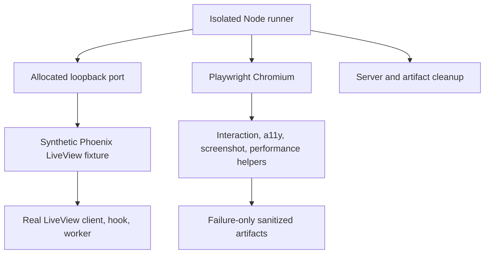
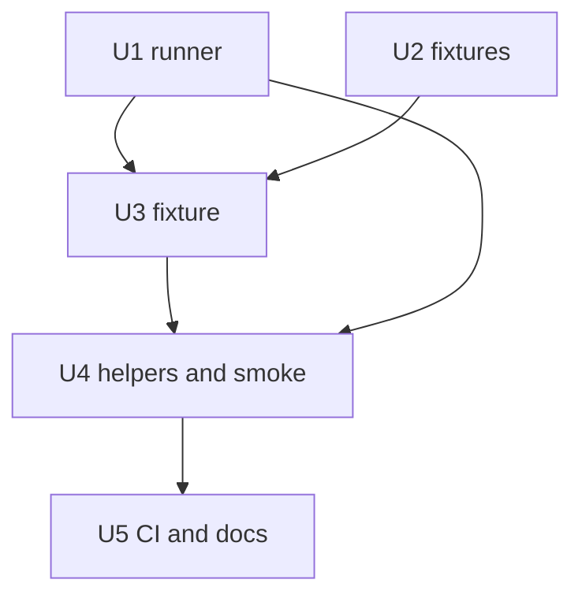

# feat: Add LiveView browser harness

## Summary

Add an isolated, pinned Chromium/Playwright test package for the Elixir application. It will boot a synthetic LiveView fixture on an allocated loopback port, exercise reusable interaction and accessibility helpers, retain sanitized failure evidence, and run as a dedicated CI job without coupling dashboard acceptance to the website package.

---

## Problem Frame

The repository's existing Playwright runner is a documentation-capture tool in `website/`: it reuses an isolated Phoenix fixture and correctly demonstrates screenshots and overflow checks, but it is not the reusable LiveView acceptance layer required before Build Order UI work begins. `src` has no Node/Chromium setup in its CI path and no accessibility engine, while later tickets need deterministic fixtures, browser input helpers, failure evidence, and performance measurement primitives that do not define product semantics. (see origin: `docs/brainstorms/2026-07-12-build-order-requirements.md`)

---

## Assumptions

*This plan was authored without synchronous user confirmation. The items below are agent inferences that should be reviewed before implementation proceeds.*

- A dedicated `src/browser` npm package is preferable to expanding `website/`, because the harness validates the Phoenix/LiveView application and must run when `src` changes.
- The accepted current lockfile resolution, Playwright 1.61.1, will be pinned exactly for the new package; `@axe-core/playwright` 4.11.3 is the corresponding automated accessibility adapter. Its upstream repository is MPL-2.0 licensed.
- The test server will be synthetic and test-only, with fixed fixture identities and explicit read-only/writable modes instead of production records or real credentials. Its browser-visible environment is an allowlist rather than a copy of the developer/CI environment.

---

## Requirements

- BOREQ-008: provide deterministic rendered-LiveView browser accessibility, interaction, screenshot, and performance fixtures, including 20/50/100-member and degraded graph cases.
- BOREQ-014: provide the reusable responsive-scale measurement and assertion layer; BO-014 supplies the final product budgets.
- Browser runs use an isolated local server and browser without a globally installed browser or interactive TTY.
- Fixtures are bounded, deterministic, neutral, and synthetic; they do not define Build Order domain, readiness, provider, or identity semantics.
- Failure evidence is useful and sanitized, while successful runs do not retain unbounded artifacts.

**Origin flows:** Follows the browser and Executor-experience path that must precede graph UI delivery.

---

## Scope Boundaries

- Do not implement production graph UI, layout geometry, pan/zoom policy, or BO-014's final performance thresholds.
- Do not add Build Order domain records, readiness policy, provider health, production adapters, or external provider access.
- Do not replace the real CLI proof owned by BO-015 or make screenshots the only behavior/accessibility assertion.
- Do not mutate the website documentation-capture API beyond reusing its isolation and cleanup patterns.

### Deferred to Follow-Up Work

- Production Build Order views bind these neutral fixtures through downstream adapters after their domain contracts land.
- BO-009 through BO-015 consume the helpers, fixture vocabulary, and measurement API; each owns its product-specific assertions and thresholds.

---

## Context & Research

### Relevant Code and Patterns

- `website/scripts/capture-executor-control-center.mjs` allocates a loopback port, starts a `mix run --no-start` fixture, scrubs inherited dashboard secrets, waits on a synthetic marker, and tears down child processes and temporary state.
- `src/test/manual/executor_control_center_docs_fixture.exs` starts an isolated Phoenix endpoint with synthetic-only data and dependency injection, proving the test-server shape can avoid application supervision and live credentials.
- `website/playwright.config.ts` and `website/tests/*.spec.ts` establish the repository's Playwright style, responsive checks, and existing CI browser install command.
- `src/lib/aiur_web/components/layouts.ex`, `src/lib/aiur_web/static_assets.ex`, and `src/lib/aiur_web/controllers/static_asset_controller.ex` show the current real LiveView client and asset delivery model that the fixture should exercise rather than emulate with static HTML.
- `.github/workflows/ci.yml` establishes the Elixir gates; `.github/workflows/website.yml` shows pinned action style, npm caching, and Chromium installation for a separate Node concern.

### Institutional Learnings

- The approved implementation pointers identify the key boundary: no Node/browser toolchain exists in the `src` CI job, and the website package must not become an implicit dashboard-acceptance dependency.

### External References

- Playwright documents version-coupled browser installation, `webServer` lifecycle support, and retain-on-failure trace, screenshot, and video options.
- Deque publishes `@axe-core/playwright` as the Playwright integration for axe-core under MPL-2.0; Playwright Test 1.61.1 is Apache-2.0.

---

## Key Technical Decisions

- **Separate browser package:** create `src/browser` with its own exact lockfile, configuration, scripts, tests, and ignored artifact root so application browser acceptance is independently reproducible.
- **Chromium-only deterministic smoke:** pin the Playwright test runner and install its matching headless Chromium through CI; do not rely on system Chrome or a global browser install.
- **Fixture-owned isolation:** use an ephemeral loopback port and a synthetic test endpoint for each runner invocation. The endpoint will load real Phoenix LiveView client assets and hooks/workers, but it will never access real tracker or account data.
- **Failure-only evidence:** configure Playwright traces, screenshots, and video for failures; permit explicit local screenshots through an opt-in environment flag. Browser-visible fixture state is allowlisted synthetic data, while textual diagnostics are scrubbed before entering the generated artifact root and CI uploads only that sanitized root.
- **Measurement primitives, not product budgets:** use browser monotonic clocks, warmups, fixed repetitions, long-task observation, and all-sample budget assertions. The harness proves its assertion semantics but leaves final numeric limits to BO-014.

---

## Open Questions

### Resolved During Planning

- **Where browser tooling lives:** `src/browser`, not root or `website`, because it exercises the Phoenix application and must be scheduled in the existing application CI matrix.
- **How browser installation remains reproducible:** `npm ci` plus the version-matched Playwright Chromium installation and a cache keyed by the browser package lockfile.

### Deferred to Implementation

- **Fixture module decomposition:** keep the server script and test-support modules together unless implementation reveals a more maintainable split; all must remain test-only.
- **Exact generous smoke-only timing envelopes:** select only values that validate the measurement plumbing and mark them as harness checks, not BO-014 product budgets.

---

## Output Structure

    src/browser/
    ├── package.json
    ├── package-lock.json
    ├── playwright.config.mjs
    ├── scripts/
    │   ├── run-browser-tests.mjs
    │   └── verify-failure-artifacts.mjs
    └── tests/
        ├── support/
        │   ├── browser-helpers.mjs
        │   └── measurements.mjs
        ├── liveview-smoke.spec.mjs
        └── harness-failures.spec.mjs

    src/test/browser/
    ├── fixture_server.exs
    └── assets/
        ├── browser_harness.js
        └── browser_worker.js

    src/test/support/browser_harness/
    └── fixtures.ex

---

## High-Level Technical Design

> *This illustrates the intended approach and is directional guidance for review, not implementation specification. The implementing agent should treat it as context, not code to reproduce.*

---

## Implementation Units

### U1. Pinned browser package and deterministic runner

**Goal:** Establish an independently installable browser test package that allocates its own port, starts and owns the fixture process, and has bounded failure artifacts.

**Requirements:** BOREQ-008, deterministic local/CI execution, failure evidence, no global browser dependency.

**Dependencies:** None.

**Files:**
- Create: `src/browser/package.json`
- Create: `src/browser/package-lock.json`
- Create: `src/browser/playwright.config.mjs`
- Create: `src/browser/scripts/run-browser-tests.mjs`
- Create: `src/browser/scripts/verify-failure-artifacts.mjs`
- Modify: `src/.gitignore`

**Approach:** Pin Playwright and axe exactly, pass the allocated port into Playwright and the fixture process, use Playwright's web-server lifecycle only for the owned fixture, and make retries unable to convert a failed budget into a pass. Start the fixture from an allowlisted environment containing only its synthetic settings, redact textual diagnostics before writing them to the generated ignored artifact root, and retain trace/screenshot/video only on a failure or when the documented local capture switch is explicitly enabled.

**Patterns to follow:** `website/scripts/capture-executor-control-center.mjs`, `website/playwright.config.ts`, and existing ignored build/test outputs in `src/.gitignore`.

**Test scenarios:**
- Happy path: a direct local browser command allocates a usable loopback port and reports the synthetic fixture URL without requiring a preinstalled browser path.
- Error path: runner startup rejects an unavailable/missing required port value promptly and tears down any child it created.
- Error path: a deliberately failing browser assertion produces trace and screenshot evidence only in the generated artifact root.
- Edge case: two runner allocations yield distinct ports and do not share fixture state.
- Security: a failure probe proves synthetic secret-like diagnostic input is redacted before it is copied into the artifact root, and the fixture's browser-visible state contains no inherited credentials for traces or screenshots to serialize.

**Verification:** The runner is repeatable locally and in CI, leaves no fixture process or listening port, and successful smoke execution leaves no retained evidence.

---

### U2. Neutral bounded graph fixtures

**Goal:** Provide deterministic, test-only scenario builders for later UI adapters without declaring production graph semantics.

**Requirements:** BOREQ-008, 0/1/20/50/100-member coverage, multi-root/degraded/live-update fixture vocabulary.

**Dependencies:** None.

**Files:**
- Create: `src/test/support/browser_harness/fixtures.ex`
- Create: `src/test/aiur/browser_harness/fixtures_test.exs`
- Modify: `src/test/test_helper.exs`

**Approach:** Define a compact neutral fixture schema with stable synthetic identities, exact scenario counts, and explicit malformed/external/missing/degraded variants. Keep it in test support, accept caller-provided adapters at the boundary, and make live-update sequences deterministic rather than deriving product readiness or provider meaning.

**Patterns to follow:** deterministic synthetic data in `src/test/manual/executor_control_center_docs_fixture.exs` and pure fixture conventions in `src/test/aiur/`.

**Test scenarios:**
- Happy path: 0, 1, 20, 50, and 100-member scenarios have exact node, edge, and root counts with stable identities across repeated construction.
- Happy path: multi-root and DAG scenarios preserve their declared fixture topology without adding product labels or readiness fields.
- Edge case: cycles and self-loops remain representable rather than causing a fixture-builder crash.
- Error path: external/missing endpoints, invalid payloads, and degraded payloads are explicit neutral states and have deterministic diagnostics.
- Integration: each live-update sequence has a stable initial fixture and a reproducible next snapshot for browser consumers.

**Verification:** Fixture tests prove every named size and scenario is bounded, deterministic, and adapter-neutral.

---

### U3. Synthetic LiveView fixture and client behavior

**Goal:** Start a real Phoenix LiveView endpoint that demonstrates the reusable browser paths: mode-aware navigation, hooks/workers, input, focus, theme/motion, reconnect, and responsive rendering.

**Requirements:** BOREQ-008, rendered LiveView interaction, auth-mode helpers, hook/worker/reconnect coverage, screenshot readiness.

**Dependencies:** U1, U2.

**Files:**
- Create: `src/test/browser/fixture_server.exs`
- Create: `src/test/browser/assets/browser_harness.js`
- Create: `src/test/browser/assets/browser_worker.js`
- Create or modify: test-only Phoenix layout/router/controller support co-located with the fixture server

**Approach:** Use a dedicated endpoint and router started by `mix run --no-start`, bind only to its allocated loopback port, and serve the repository's real Phoenix/LiveView client assets plus test-only hook/worker assets. The fixture starts from an allowlisted synthetic environment, supplies read-only and writable mode markers without real credentials, changes state via LiveView events, and exposes explicit readiness and reconnect signals for event-driven browser waits.

**Patterns to follow:** `src/test/manual/executor_control_center_docs_fixture.exs`, `src/lib/aiur_web/components/layouts.ex`, and `src/lib/aiur_web/static_assets.ex`.

**Test scenarios:**
- Integration: a browser connects to a rendered LiveView, navigates between fixture states, and receives a LiveView state update rather than relying on static response assertions.
- Integration: the JavaScript hook starts a worker, publishes readiness, and performs a synthetic worker round-trip before browser tests proceed.
- Happy path: pointer, keyboard, touch, focus-visible, theme, and reduced-motion interactions update the rendered fixture state accessibly.
- Edge case: narrow desktop/mobile viewports and 200% text zoom keep page controls reachable while the intended graph viewport may scroll/pan.
- Error path: fixture startup timeout and explicitly injected degraded data present deterministic readiness/error markers.
- Integration: a forced LiveView transport interruption reconnects and reflects the current fixture snapshot.

**Verification:** The test fixture proves real LiveView transport, hook, worker, interaction, accessibility-state, and reconnect seams without accessing production data or services.

---

### U4. Reusable browser helpers, accessibility checks, and measurement API

**Goal:** Make later UI tickets consume one concise test API for modes, input, screenshots, a11y, reconnect, and browser-side performance samples.

**Requirements:** BOREQ-008, BOREQ-014, automated accessibility, failure-only evidence, monotonic measurements.

**Dependencies:** U1, U3.

**Files:**
- Create: `src/browser/tests/support/browser-helpers.mjs`
- Create: `src/browser/tests/support/measurements.mjs`
- Create: `src/browser/tests/liveview-smoke.spec.mjs`
- Create: `src/browser/tests/harness-failures.spec.mjs`

**Approach:** Wrap Playwright context and page setup for fixture auth modes, viewport/theme/reduced-motion, pointer/touch/keyboard/focus, LiveView reconnect, worker readiness, and intentional screenshots. Run axe against stable rendered states and express color-independent/focus assertions in browser behavior tests. Measurements collect `performance.now()` samples after an explicit warmup, observe long tasks and responsiveness, preserve all post-warmup samples, and fail a supplied budget when any sample violates it.

**Patterns to follow:** `website/tests/brand.spec.ts` for behavior/contrast testing and Playwright's retain-on-failure configuration model.

**Test scenarios:**
- Integration: read-only and writable fixture modes each navigate and render the expected capability state without placing credentials in URLs, DOM, screenshots, or traces.
- Integration: a smoke test covers navigation, worker readiness, pointer/keyboard/touch input, focus, theme, reduced motion, reconnect, and an opt-in screenshot through the helpers.
- Accessibility: axe reports no violations for the synthetic fixture's supported state and keyboard/focus assertions do not depend on color alone.
- Happy path: measurement output includes warmup exclusion, fixed repetitions, layout/redraw responsiveness, and long-task observations.
- Error path: a budget assertion rejects one bad post-warmup sample even when the remaining samples pass; retry configuration cannot hide it.
- Security: failure artifact validation proves diagnostic redaction before artifact creation and verifies the test fixture never places credential-like values in the DOM, URLs, screenshots, or traces.

**Verification:** The browser test suite demonstrates every reusable helper path and gives downstream tickets clear helper entry points rather than test-specific copies.

---

### U5. CI integration and contributor documentation

**Goal:** Schedule the smoke in the application PR matrix with cache-aware, pinned setup and document the local commands, artifacts, license, and failure-proof procedure.

**Requirements:** BOREQ-008 at-merge gate, documented cache/artifact behavior, no residual processes.

**Dependencies:** U1, U4.

**Files:**
- Modify: `.github/workflows/ci.yml`
- Modify: `src/README.md`
- Modify: `CONTRIBUTING.md` if the test gate needs a contributor-facing command reference

**Approach:** Add an independent browser/a11y job triggered with the existing application matrix. Install Node 20, cache npm and Playwright's browser data using the browser-package lockfile, install the matching Chromium dependency set, run the documented smoke, run the artifact sanitizer after a failure, and upload only the sanitized failure root. Explain the artifact root, screenshot opt-in, deliberate failure proof, browser cache key, exact dependency/license decision, and cleanup guarantees.

**Patterns to follow:** `.github/workflows/website.yml` action pinning and npm cache setup; `.github/workflows/ci.yml` application-job conventions.

**Test scenarios:**
- Integration: CI can restore or populate the npm/browser cache, install the locked Chromium, run the browser/a11y smoke, and upload evidence only after a failure.
- Error path: a deliberately failing local probe leaves inspectable sanitized evidence and no server/browser process or listening port.
- Documentation: documented local invocation works from a clean checkout without a global browser installation or interactive TTY.

**Verification:** The PR matrix owns browser/a11y acceptance alongside compile/lint/test, and contributors can reproduce and inspect a bounded failure locally.

---

## System-Wide Impact

- **Interaction graph:** Node runner starts the synthetic endpoint; the rendered LiveView executes real client hooks/workers; helpers drive the browser and collect evidence/measurements; CI provisions the matching browser.
- **Error propagation:** Fixture readiness, worker readiness, browser action failures, and measurement failures fail tests with bounded, sanitized diagnostics rather than arbitrary sleeps or shared-state leakage.
- **State lifecycle risks:** Ports, endpoint processes, temporary fixture state, and test artifacts must be uniquely scoped and cleaned on success and failure.
- **API surface parity:** The helper and fixture vocabulary becomes a test-only contract for downstream Build Order and dashboard tickets; production dashboard APIs and asset behavior remain unchanged.
- **Integration coverage:** End-to-end LiveView transport, hook/worker execution, browser input, a11y, reconnect, artifact capture, and CI setup must be exercised together.
- **Unchanged invariants:** Browser infrastructure does not invoke the CLI, contact trackers/providers, change authentication policy, introduce production graph semantics, or set BO-014 performance thresholds.

---

## Risks & Dependencies

| Risk | Mitigation |
|---|---|
| Browser binary/version mismatch | Pin the test package and lockfile; install the version-matched Chromium in CI and document the local install path. |
| Test server or port leakage | Allocate loopback ports per invocation, own the child lifecycle, and test cleanup/failure paths. |
| Secrets entering artifacts | Start from an allowlisted synthetic environment so traces/screenshots never receive real values; sanitize textual diagnostics before they enter the upload root, and retain artifacts only on failure or opt-in capture. |
| Browser test flakiness | Use injected readiness markers and event-driven waits, fixed repetitions, no retries for budget assertions, and deterministic fixture updates. |
| Harness becoming a product semantic owner | Keep graph fixture fields neutral and adapter-oriented; defer domain mapping and final budgets to their owning tickets. |

---

## Documentation / Operational Notes

- The new package must state exact dependency versions and license implications, how the npm and Chromium caches are keyed, and how to run its smoke from `src/browser`.
- CI must publish the ignored artifact root only after a failed browser job. Successful runs clean the generated fixture state and evidence.
- The documented manual proof uses the browser smoke and a deliberately failing assertion; it does not claim the separate real-CLI acceptance owned by BO-015.

---

## Sources & References

- **Origin document:** `docs/brainstorms/2026-07-12-build-order-requirements.md`
- **Approved ticket contract:** `docs/build-order/tickets/BO-008-build-browser-test-harness.md`
- **Technical decisions:** `docs/build-order/05-technical-decisions.md` (DEC-007, DEC-013)
- **Existing isolation precedent:** `website/scripts/capture-executor-control-center.mjs`
- **Synthetic Phoenix precedent:** `src/test/manual/executor_control_center_docs_fixture.exs`
- **Approved planning authority:** https://github.com/its-everdred/aiur/tree/4d8de9508206e08e314f2730cd916501a3b4cafd/docs/build-order
- **Playwright browser management:** https://playwright.dev/docs/browsers
- **Playwright web-server lifecycle:** https://playwright.dev/docs/test-webserver
- **axe-core Playwright package:** https://github.com/dequelabs/axe-core-npm
