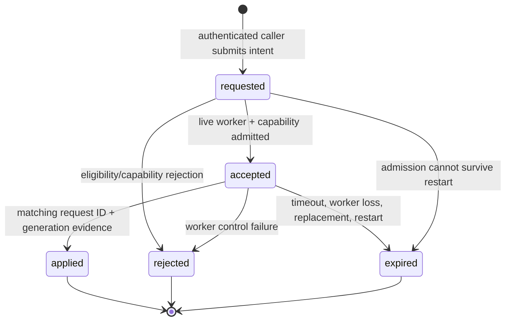
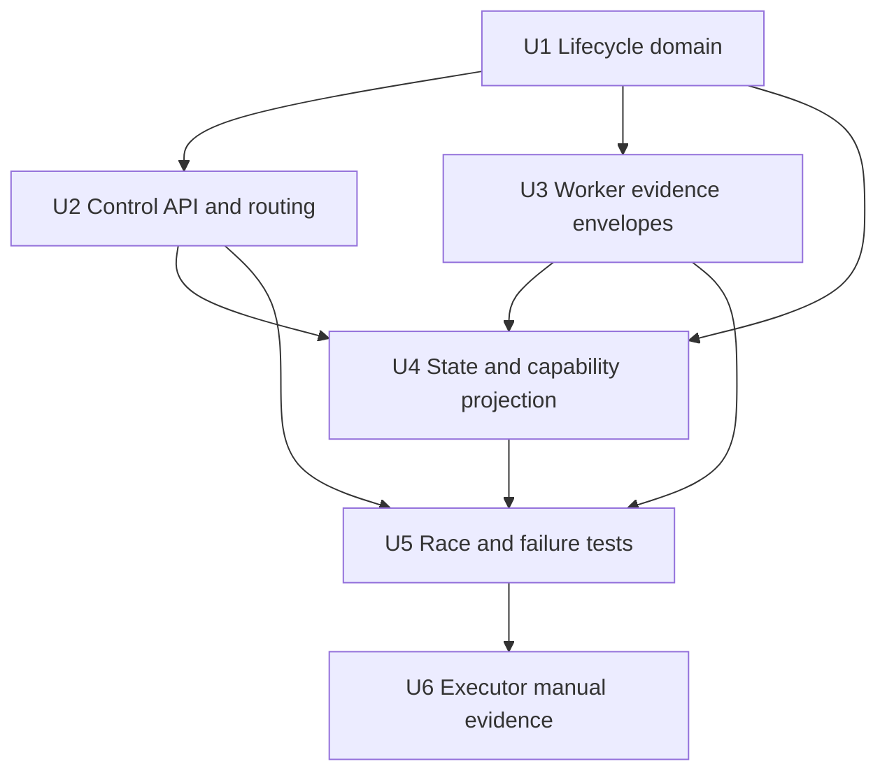

# feat: Confirm applied unit controls

## Summary

Introduce one versioned, correlation-aware control lifecycle owned by the
Orchestrator. It will distinguish a routed pause or resume from a state change
actually confirmed by the targeted worker, while preserving the existing
AgentChat and worker-message seams.

---

## Problem Frame

The current pause and resume paths mint an integer request ID but mutate the
running entry immediately. Pause acknowledgements may carry that ID, while
working and completed notifications do not, so a snapshot can falsely look
worker-confirmed. DREQ-004 requires that lifecycle certainty be explicit and
that replacements, late messages, and retries cannot forge application.

---

## Requirements

- DREQ-004. Admit versioned, identity-bearing pause/resume requests and model
  `requested`, `accepted`, `applied`, `rejected`, and `expired` separately.
- DREQ-004. Require matching request and worker generation before declaring a
  control applied; duplicates and out-of-order acknowledgements are idempotent.
- DREQ-004. Expose confirmation capability accurately, preserve independent
  pause/wait reasons, and publish bounded, redacted lifecycle evidence.
- DREQ-004. Expire unresolved work on timeout, worker loss, replacement, and
  daemon restart rather than reporting it applied.

---

## Scope Boundaries

- No dashboard rendering or new dashboard RPC; DASH-005 consumes the control
  projection this work exposes.
- No capacity-policy, tracker-label, scheduler, or cancellation redesign.
- No raw command transport, transcript, credential, workspace, account, or
  capability URL in an audit or PubSub payload.

### Deferred to Follow-Up Work

- Dashboard action labels, confirmation interaction, and visual lifecycle
  rendering remain owned by DASH-005.
- Backends that cannot provide a matching application acknowledgement remain
  request-only or unsupported; this ticket does not fabricate parity.

---

## Context & Research

### Relevant Code and Patterns

- `src/lib/aiur/agent_chat.ex` is the authenticated caller seam. Pause must
  continue to arm `Aiur.PauseContainment` before submission.
- `src/lib/aiur/orchestrator/pause_resume.ex` owns pause/resume transitions;
  its current optimistic `:paused` and `:working` writes must become lifecycle
  admission/routing only.
- `src/lib/aiur/orchestrator/operator_messages.ex` already routes a generated
  control request to a live worker, and
  `operator_messages/capabilities.ex` is the existing capability projection.
- `src/lib/aiur/agent_runner/message_handler.ex`, `turn_loop.ex`, and
  `queue_drain.ex` are the shared worker-envelope seams. They already carry a
  pause `request_id` in some paths but omit it on working/completed messages.
- `src/lib/aiur/tracker_identity.ex` and `Aiur.Issue.tracker_identity/1`
  provide BO-004's versioned repository-qualified identity.
- `src/lib/aiur/orchestrator/status_report.ex`, `Aiur.AgentPubSub`, and
  `Aiur.AgentEvents` are the existing public projection and event vocabulary
  seams; extend them instead of adding dashboard-specific state.
- `src/lib/aiur/orchestrator/state.ex` and the completed-entry paths in
  `pause_resume.ex` define replacement and completed-provenance races that
  must expire pending requests.

### Institutional Learnings

- The approved DASH-004 implementation pointers confirm that pause request IDs
  already round-trip in a subset of worker paths. Extend that envelope; do not
  create a parallel RPC.
- Paused-state clock and containment handling are safety-critical existing
  invariants. Lifecycle confirmation must not move or weaken them.

### External References

- No external research: this protocol extends established repository-local
  process, PubSub, and tracker-identity contracts.

---

## Key Technical Decisions

- **The Orchestrator remains lifecycle owner:** workers emit evidence only;
  AgentChat and UI callers receive a normalized admission/lifecycle result.
- **Every application acknowledgement contains request ID and generation:**
  status alone is an observation, not proof that a particular control applied.
- **Authoritative state changes only at `applied`:** `requested` and
  `accepted` are separately visible and never alter work/pause state merely to
  make a control feel responsive.
- **The projection has a compact replayable audit journal:** restart recovery
  converts every persisted unresolved request to expired/unknown evidence
  before it exposes current state. The current status remains authoritative
  only when established independently by the worker lifecycle.
- **Capability is an explicit level:** confirmed application, request-only, or
  unsupported. The level is computed from the active backend and generation,
  not inferred from a state snapshot.

---

## Open Questions

### Resolved During Planning

- **Where should new state live?** On the Orchestrator state and its normalized
  per-unit projection, because that is the existing single lifecycle owner and
  status source.
- **How should identity be carried?** Reuse the already versioned
  `TrackerIdentity` attached to each `Issue`; reject a request that lacks a
  joinable identity instead of falling back to a bare issue number.
- **How should current callers migrate?** Preserve `AgentChat.pause/1` and
  `resume/1` as convenience entry points that create a request. Add an explicit
  request form that accepts a caller-supplied request ID for safe retry.

### Deferred to Implementation

- Exact timeout configuration ownership and test clock injection point should
  follow the existing Orchestrator configuration patterns once the lifecycle
  module is added.
- Exact event names and payload field ordering should be finalized alongside
  existing AgentEvents conventions, with schema tests enforcing redaction.

---

## High-Level Technical Design

> *This illustrates the intended approach and is directional guidance for
> review, not implementation specification. The implementing agent should
> treat it as context, not code to reproduce.*

---

## Implementation Units

### U1. Define the versioned control lifecycle domain

**Goal:** Establish the request, lifecycle, rejection, capability, and
redacted-event contract in a dedicated module with deterministic time seams.

**Requirements:** DREQ-004.

**Dependencies:** BO-004 tracker identity baseline.

**Files:**
- Create: `src/lib/aiur/orchestrator/control_lifecycle.ex`
- Create: `src/test/aiur/orchestrator/control_lifecycle_test.exs`
- Modify: `src/lib/aiur/orchestrator/state.ex`

**Approach:**
- Model request version, request ID, typed `TrackerIdentity`, action,
  generation, expected state/version, requester class, and request time.
- Model stable rejection classes and bounded pending/history entries. Make
  duplicate IDs idempotent and conflicting newer intent explicitly supersede
  the prior pending request.
- Write an allowlisted compact lifecycle journal and replay only enough state
  to expire unresolved requests after a daemon restart; do not store worker
  transport, workspace, account, credential, prompt, or transcript data.
- Accept injected clock/timer functions so timeouts, restarts, and generation
  loss can be tested without sleeping.

**Execution note:** Start with domain tests that describe the state graph and
late-acknowledgement rules before wiring the Orchestrator.

**Patterns to follow:**
- `src/lib/aiur/tracker_identity.ex`
- `src/lib/aiur/orchestrator/state.ex`

**Test scenarios:**
- Happy path: a valid pause request is admitted, accepted, then applied only
  after matching evidence.
- Edge case: a same-ID retry returns the original lifecycle rather than routing
  another intent.
- Edge case: a conflicting action supersedes a pending request and a later
  acknowledgement for the superseded request is ignored.
- Error path: unjoinable identity, unsupported capability, stale generation,
  and invalid expected state produce a classified, redacted rejection.
- Error path: timer, worker loss, and restart resolution produce expired or
  unknown rather than applied.
- Security: replayed audit records contain only lifecycle IDs, typed identity,
  action, generation, safe reason class, and timestamps.

**Verification:** The lifecycle domain can fold every valid event
deterministically and never emits an `applied` terminal state without matching
request/generation evidence.

### U2. Route correlated control intents through the existing control plane

**Goal:** Extend AgentChat, Orchestrator, PauseResume, and
OperatorMessages so a caller can submit or retry one explicit intent while the
Orchestrator records requested and accepted lifecycle facts.

**Requirements:** DREQ-004.

**Dependencies:** U1.

**Files:**
- Modify: `src/lib/aiur/agent_chat.ex`
- Modify: `src/lib/aiur/orchestrator.ex`
- Modify: `src/lib/aiur/orchestrator/pause_resume.ex`
- Modify: `src/lib/aiur/orchestrator/operator_messages.ex`
- Modify: `src/test/aiur/agent_chat_test.exs`
- Modify: `src/test/aiur/orchestrator_control_routing_test.exs`

**Approach:**
- Preserve existing one-argument pause/resume call sites by generating an
  intent, but expose a request-ID-bearing form for safe retry.
- Capture the running worker/backend generation and expected state/version at
  admission, and advance the entry's authoritative version on worker-applied
  transitions. Route only to the exact live worker selected by that admission.
- Retain PauseContainment arm/release behavior, but do not change control
  status, pause attribution, clocks, or telemetry until U4 accepts matching
  worker evidence.

**Patterns to follow:**
- `src/lib/aiur/agent_chat.ex`
- `src/lib/aiur/orchestrator/operator_messages.ex`
- `src/lib/aiur/orchestrator/pause_resume.ex`

**Test scenarios:**
- Happy path: caller receives a request record whose lifecycle moves from
  requested to accepted after the message is routed to the live worker.
- Edge case: retrying an accepted request ID sends no conflicting second
  control.
- Edge case: a request with an obsolete expected state/version is rejected
  before it reaches a worker.
- Error path: missing, completed/deactivated, dead, or replaced worker returns
  the defined rejection/expiry classification without a state flip.
- Integration: containment is armed for an admitted pause and is not released
  by an unconfirmed lifecycle event.

**Verification:** Existing callers retain compatibility while callers that
provide a request ID observe an idempotent correlated result.

### U3. Carry correlated application evidence across every supported worker path

**Goal:** Add request and generation context to worker control envelopes and
accurately classify each active adapter's confirmation level.

**Requirements:** DREQ-004.

**Dependencies:** U1.

**Files:**
- Modify: `src/lib/aiur/agent_runner/message_handler.ex`
- Modify: `src/lib/aiur/agent_runner.ex`
- Modify: `src/lib/aiur/agent_runner/turn_loop.ex`
- Modify: `src/lib/aiur/agent_runner/queue_drain.ex`
- Modify: `src/lib/aiur/app_server/turn_loop.ex`
- Modify: `src/lib/aiur/claude/repl/transcript_turn.ex`
- Modify: `src/lib/aiur/claude/repl/hook_turn.ex`
- Modify: `src/test/aiur/agent_runner/message_handler_test.exs`
- Modify: backend protocol tests under `src/test/aiur/app_server/` and
  `src/test/aiur/claude/`

**Approach:**
- Extend the existing worker control-state envelope instead of introducing a
  side channel. Every supported pause/resume completion includes the admitted
  request ID and worker generation.
- Preserve unsolicited worker pauses/completions as ordinary worker state
  observations; they must not accidentally apply an unrelated request.
- Mark adapters unable to prove application as request-only. In particular,
  characterize the actual Codex, Claude headless, and Claude Remote Control
  paths rather than promoting interrupt delivery to confirmation.

**Patterns to follow:**
- `src/lib/aiur/agent_runner/message_handler.ex`
- `src/lib/aiur/agent_runner/queue_drain.ex`
- `src/lib/aiur/app_server/turn_loop.ex`
- `src/lib/aiur/claude/repl/transcript_turn.ex`

**Test scenarios:**
- Happy path: paused and working worker acknowledgements both retain the
  original request/generation tuple.
- Edge case: duplicate and out-of-order acknowledgements are harmless.
- Error path: an interrupt failure or acknowledgement timeout becomes
  request-only/rejected/expired according to adapter evidence, never applied.
- Integration: a worker completion racing a pause cannot apply the pause to a
  replacement generation.

**Verification:** Worker-to-Orchestrator envelopes permit exact correlation
without leaking transport payloads.

### U4. Project lifecycle evidence without overwriting independent runtime state

**Goal:** Make PauseResume, capabilities, status snapshots, PubSub, and audit
consumers report lifecycle truth while preserving pause owner/reason and
waiting context.

**Requirements:** DREQ-004.

**Dependencies:** U1, U2, U3.

**Files:**
- Modify: `src/lib/aiur/orchestrator/pause_resume.ex`
- Modify: `src/lib/aiur/orchestrator/status_report.ex`
- Modify: `src/lib/aiur/orchestrator/operator_messages/capabilities.ex`
- Modify: `src/lib/aiur/agent_events.ex`
- Modify: `src/lib/aiur/agent_pubsub.ex`
- Modify: `src/lib/aiur_web/presenter.ex`
- Modify: `src/lib/aiur/run_telemetry/lifecycle.ex`
- Modify: `src/test/aiur/orchestrator/pause_resume_test.exs`
- Modify: `src/test/aiur/orchestrator_status_test.exs`
- Modify: `src/test/aiur/agent_pubsub_test.exs`
- Modify: `src/test/aiur_web/presenter_test.exs`
- Modify: `src/test/aiur/run_telemetry/lifecycle_test.exs`

**Approach:**
- Apply the authoritative control-status transition only after U3's matching
  evidence. Preserve tracker pauses, worker pauses, dependency waits, capacity
  drains, and requester-specific pause attribution independently.
- A successful resume may clear only pause state owned by that control path;
  unrelated reasons survive. Completed provenance and replacement paths expire
  any pending request before dispatching a new generation.
- Publish normalized, bounded lifecycle records and lookup/current-pending
  projection through existing status/PubSub seams and the compact audit
  journal. Limit payloads to IDs, types, state, times, reason classes, and
  safe display text.

**Patterns to follow:**
- `src/lib/aiur/orchestrator/status_report.ex`
- `src/lib/aiur/agent_events.ex`
- `src/lib/aiur/agent_pubsub.ex`
- `src/lib/aiur_web/presenter.ex`

**Test scenarios:**
- Happy path: snapshots report requested/accepted separately from worker-applied
  state and expose the confirmation capability level.
- Edge case: a request-only backend never labels an intent applied.
- Edge case: stale-generation, duplicate, and superseded acknowledgements do
  not change current state.
- Error path: daemon restart, crash, timeout, and completed replacement leave
  no indefinitely pending request and publish redacted expiry evidence.
- Integration: tracker-owned pause and dependency waiting survive a successful
  resume belonging to a different control owner.
- Security: serialized audit/PubSub output contains none of the forbidden raw
  transport, credential, workspace, account, or capability fields.

**Verification:** Every consumer can distinguish routed from applied control,
and no unrelated state is erased by the lifecycle projection.

### U5. Characterize and harden lifecycle races end to end

**Goal:** Cover the protocol matrix across Orchestrator, worker messages,
replacement, and backend capability combinations.

**Requirements:** DREQ-004.

**Dependencies:** U2, U3, U4.

**Files:**
- Modify: `src/test/aiur/orchestrator_control_routing_test.exs`
- Modify: `src/test/aiur/orchestrator/pause_resume_telemetry_test.exs`
- Modify: `src/test/aiur/orchestrator_deactivate_test.exs`
- Modify: `src/test/aiur/regression/orchestrator_lifecycle_test.exs`
- Modify: directly related backend protocol tests

**Approach:**
- Use pure lifecycle state and injected timers for deterministic ordering;
  avoid sleeps and process-load repros.
- Characterize completed-to-working replacement, completed-to-deactivated, and
  completed-to-paused/replacement behavior before locking regression tests.

**Patterns to follow:**
- `src/test/aiur/orchestrator_control_routing_test.exs`
- `src/test/aiur/orchestrator/pause_resume_test.exs`
- `src/test/aiur/regression/orchestrator_lifecycle_test.exs`

**Test scenarios:**
- Accepted-to-applied, structured rejection, timeout, worker crash, daemon
  restart, generation replacement, duplicate acknowledgement, and out-of-order
  acknowledgement.
- Superseding pause/resume intent and late acknowledgement from the old intent.
- Concurrent worker completion and pause/resume admission.
- Confirmed, request-only, and unsupported backend capabilities.

**Verification:** The required agent gate scenarios run deterministically with
the affected module suites and no success path depends on an optimistic state
write.

### U6. Capture Executor-root manual evidence

**Goal:** Verify the user-visible requested, accepted, and applied lifecycle
using a real supported worker once automated coverage is green.

**Requirements:** DREQ-004.

**Dependencies:** U5 and an Executor-root Aiur test session.

**Files:**
- Test expectation: none -- this is evidence collection through the canonical
  TUI, not a repository artifact owned by this ticket.

**Approach:**
- From the Executor repository root only, use the documented wrapper-tmux
  workflow to drive pause and resume through the visible control surface.
- Capture the chat/control display proving requested, accepted, and worker
  applied; capture a rejected or expired case as well.

**Test scenarios:**
- Integration: a supported worker shows the full lifecycle in the user-visible
  control surface.
- Error path: one rejection or expiry is visible without substituting logs for
  the rendered state proof.

**Verification:** Manual evidence follows the repository's canonical TUI
procedure and is not attempted from this agent workspace.

---

## System-Wide Impact

- **Interaction graph:** AgentChat callers, Orchestrator routing, worker
  adapters, StatusReport, AgentPubSub, and dashboard presenters share one
  lifecycle record.
- **Error propagation:** Admission, routing, and worker application failures
  become classified lifecycle outcomes; none mutates runtime state as a proxy
  for success.
- **State lifecycle risks:** Replacement, completion, restart, timeout, and
  stale process delivery must invalidate pending correlation before any new
  worker can receive it; the replay journal must turn unfinished records into
  expired/unknown evidence before snapshots are published.
- **API surface parity:** Existing pause/resume callers remain compatible;
  dashboard consumers receive capability and lifecycle projection through
  existing snapshot channels.
- **Integration coverage:** Tests span synchronous control calls, asynchronous
  worker envelopes, lifecycle events, status snapshots, and redaction.
- **Unchanged invariants:** Pause containment, slot accounting, tracker pause
  overrides, completion provenance, and normal unsolicited worker state remain
  independent from the new command lifecycle.

---

## Risk Analysis & Mitigation

| Risk | Likelihood | Impact | Mitigation |
|---|---|---|---|
| Late worker acknowledgement applies to replacement | Medium | High | Require both request ID and generation; expire on replacement. |
| Existing paused/reason semantics regress | Medium | High | Separate command lifecycle from pause ownership and characterize existing races. |
| Remote backend overclaims evidence | Medium | High | Explicit confirmed/request-only/unsupported capabilities with backend tests. |
| Lifecycle data leaks sensitive transport metadata | Low | High | Build normalized allowlisted event payloads and add serialization tests. |
| Pending controls never resolve | Medium | Medium | Injected timeout plus worker-loss/restart expiration paths. |

---

## Documentation / Operational Notes

- DASH-005 should consume the normalized lifecycle and capability projection;
  it must not infer confirmation from `work_state`.
- Executor-root manual verification remains a required final gate. Agent
  workspaces must not invoke `scripts/aiurdev --test` directly.

---

## Sources & References

- **Origin document:** `docs/brainstorms/2026-07-12-build-order-requirements.md`
  at approved planning commit `4d8de9508206e08e314f2730cd916501a3b4cafd`.
- Approved ticket contract:
  `docs/build-order/companion-tickets/DASH-004-applied-unit-control-protocol.md`
  at the same commit.
- Implementation pointers:
  `docs/build-order/08-implementation-pointers.md` at the same commit.
- Related code: `src/lib/aiur/orchestrator/pause_resume.ex`,
  `src/lib/aiur/orchestrator/operator_messages.ex`, and
  `src/lib/aiur/agent_runner/message_handler.ex`.
- Related issue: #1111.
