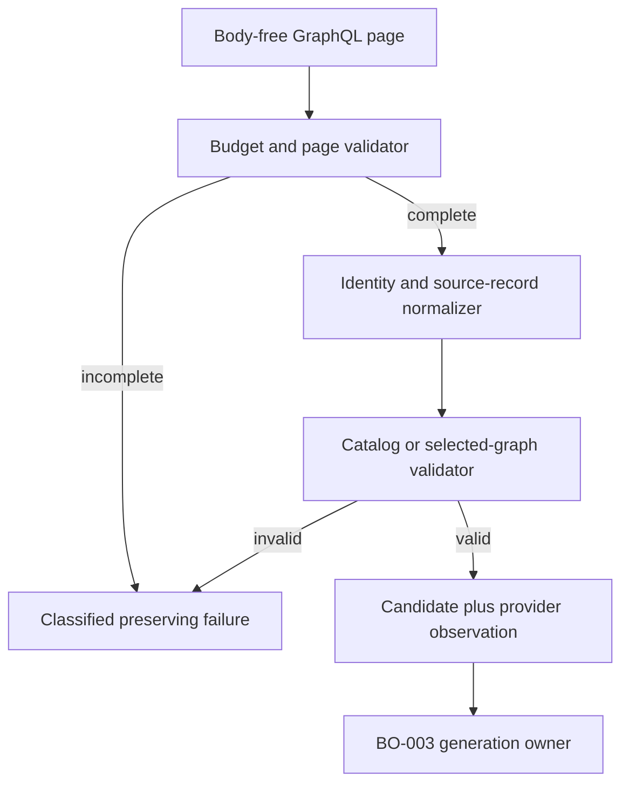
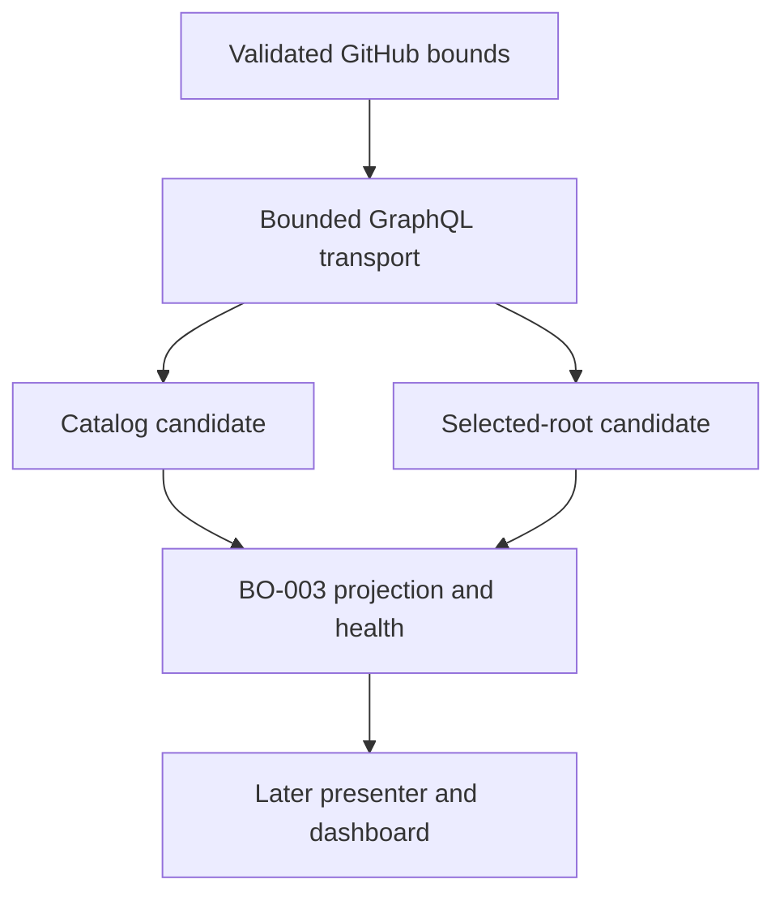

# feat: Fetch complete GitHub planning graph

## Summary

Add a read-only, bounded GitHub GraphQL adapter that discovers controlled
Build Order roots and fetches one root's direct-member dependency graph without
ever treating an incomplete provider response as a valid candidate. It will
produce the BO-001 domain records and safe provider evidence for BO-003, while
leaving refresh, caching, projection ownership, and rendering outside this
change.

---

## Problem Frame

The ordinary GitHub issue poller is intentionally dispatch-oriented: it reads
REST issue lists and can hydrate individual dependencies. It cannot establish
whether an entire Build Order catalog or selected graph is complete. A missing
connection page, partial GraphQL response, cross-repository endpoint, or
over-limit result must therefore remain explicit provider or structural evidence
rather than appearing as an empty dependency list or a smaller successful graph.

GitHub's authenticated schema was re-introspected on 2026-07-13. `Issue`
provides `parent`, `subIssues`, `blockedBy`, `blocking`, `databaseId`, lifecycle
reason, labels, timestamps, and URLs; the connections expose `nodes`,
`pageInfo`, and `totalCount`. The selected REST API version is `2022-11-28`.
That makes a bounded GraphQL read the only path required for v1's complete
connection semantics.

---

## Requirements

- BOREQ-001: Discover only configured-repository issues with the controlled
  `build-order` role, retain GitHub node identity, and keep each selection
  isolated to its own root.
- BOREQ-002: Treat direct native sub-issues as membership; retain body-free
  ticket facts, lifecycle, labels, metadata warnings, and parent evidence.
- BOREQ-003: Preserve both native dependency directions and normalize them as
  blocker-to-blocked edges without allowing anything except completed closure to
  clear a later readiness edge.
- BOREQ-004: Bound catalog and selected-root reads independently, detect an
  exact bound plus one, preserve complete-generation failure evidence, and
  never hide a malformed root behind its valid siblings.
- DEC-001 through DEC-005: Keep GitHub planning truth separate from Aiur
  activity; use controlled roots, direct membership, native `blockedBy`,
  single-valued metadata, and complete provider generations (see origin:
  `docs/brainstorms/2026-07-12-build-order-requirements.md`).

---

## Scope Boundaries

### In scope

- GitHub configuration validation for finite root, page, and provider-call
  limits; body-free GraphQL catalog and selected-root reads.
- Normalization and validation into the landed `Aiur.BuildOrder` contracts,
  including dependency endpoint direction, external-reference diagnostics, and
  safe request/rate-limit evidence.
- Focused fixtures for happy paths, boundaries, malformed provider data, and
  classified failures.

### Deferred for later

- BO-003 refresh cadence, retry policy, last-known-good retention, generation
  swaps, PubSub, and projection supervision.
- BO-016 root-independent ticket detail and its cache.
- Build Order presentation, dashboard routes, and browser behavior.

### Outside this product's identity

- Mutating GitHub labels, issues, sub-issue membership, lifecycle, or native
  dependency relationships.
- Fetching an external dependency's repository or issue body.

### Deferred to Follow-Up Work

- Generalizing the dispatch-oriented ordinary issue poller. This adapter must
  remain isolated so it cannot weaken its established polling behavior.

---

## Assumptions

- A shared adapter result will carry the validated BO-001 candidate together
  with bounded, redacted provider observations; BO-003 will own converting
  those observations into a published generation and health lifecycle.
- A fixed internal GraphQL page size and finite default page/call budgets can
  cover the configured maximum of 100 roots or direct members without
  per-member follow-up I/O. The exact constants will be selected and documented
  beside the implementation after fixture/query-cost validation.
- Connections whose first bounded response signals additional pages will fail
  as incomplete/overflow rather than triggering one request per endpoint.

---

## Key Technical Decisions

| Decision | Chosen approach | Rationale |
| --- | --- | --- |
| Provider protocol | GraphQL only | The authenticated schema contains every required field and complete connection evidence in one bounded response shape; the ordinary REST path cannot offer equivalent all-connection completeness without N+1 reads. |
| Root discovery | Repository issues filtered by the controlled `build-order` label | Matches DEC-002 and prevents body parsing or unscoped repository reads. |
| Overflow handling | Page/call budget, cursor, `totalCount`, and canonical-identity checks are validation gates | A lower count is never returned as a success after any gate is exceeded or inconsistent. |
| Dependency scope | Read `blockedBy` and `blocking`, normalize blocker-to-blocked, and retain external references as nonfetchable | Supports reconciliation and future cycle/readiness calculation without turning foreign endpoints into internal misses. |
| Ordinary tracker separation | New Build Order adapter and Client facade; leave `Aiur.GitHub.Issues` unchanged | The existing poller may remain dispatch-optimized without inheriting planning-view failure semantics. |

---

## High-Level Technical Design

This illustrates the intended approach and is directional guidance for review,
not implementation specification. The implementing agent should treat it as
context, not code to reproduce.

The normalizer will extend the BO-001 source records where needed to retain
provider-native database IDs, timestamps, parent/direct-membership evidence,
dependency direction/counts, and a nonjoinable external endpoint reference.
Only repository-qualified node identity is an internal join key. The adapter
will never create a candidate from the failure branch, and BO-003 remains the
only publisher of a health generation.

---

## System-Wide Impact

The adapter is the only new provider-facing surface. Configuration constrains
every request; BO-001 record extensions keep native facts and diagnostics
renderer-safe; BO-003 alone owns generation publication. Existing tracker
polling and dependency mutation retain their behavior and APIs.

---

## Implementation Units

### U1. Define bounded planning-read configuration and result evidence

**Goal:** Make the catalog root bound, page budget, and provider-call budget
explicit, finite, validated, and observable without leaking secrets or raw
provider bodies.

**Requirements:** BOREQ-004; DEC-005.

**Dependencies:** None.

**Files:** `src/lib/aiur/config/schema/tracker.ex`,
`src/lib/aiur/github/config.ex`, `src/lib/aiur/build_order/diagnostic.ex`,
`src/lib/aiur/build_order/provider_result.ex`,
`src/lib/aiur/build_order/github_graph.ex`,
`src/test/aiur/config/schema_test.exs`,
`src/test/aiur/build_order/github_graph_test.exs`.

**Approach:** Extend the GitHub embedded configuration with positive defaults
and hard ceilings for root, page, and call limits; reject zero, negative,
non-numeric, and unbounded values. Define a typed Build Order provider-result
boundary that wraps a candidate with bounded call/page counts, safe rate-limit
facts, and existing GitHub error classifications. Add controlled diagnostics for
budget exhaustion, pagination mismatch, duplicate identity, unresolved internal
endpoint, and over-limit results instead of exposing provider text.

**Patterns to follow:** `Aiur.Config.Schema.Github` changesets,
`Aiur.GitHub.Config`, `Aiur.GitHub.Errors`, and
`Aiur.BuildOrder.Diagnostic`.

**Test scenarios:**

- Default configuration accepts exactly 100 roots and finite positive page/call
  budgets; lower positive overrides are accepted.
- Zero, negative, non-integer, and values above the hard ceiling are rejected
  before a provider request is attempted.
- Request observations retain call and rate-limit classification without a
  token, authorization header, raw GraphQL error, or issue body.
- Exhausted page or call budgets return preserving failure evidence rather than
  a partial catalog or graph.

**Verification:** Invalid configuration cannot construct a planning read;
successful reads expose only bounded safe evidence needed by BO-003.

### U2. Build fail-closed GraphQL pagination primitives

**Goal:** Add the reusable, injected-request GraphQL boundary that reads only
the configured repository and enforces finite request/page accounting before
normalization.

**Requirements:** BOREQ-001, BOREQ-004.

**Dependencies:** U1.

**Files:** `src/lib/aiur/build_order/github_graph.ex`,
`src/lib/aiur/github/client.ex`, `src/lib/aiur/github/transport.ex`,
`src/test/aiur/build_order/github_graph_test.exs`,
`src/test/aiur/github/transport_test.exs`.

**Approach:** Reuse `Aiur.GitHub.Transport.github_graphql/4`, configured
repository parsing, token resolution, and GitHub failure classification. Add
query fragments that remain body-free and include connection page info and
counts. Validate each response shape, cursor progression, page count, request
count, and GraphQL partial-data condition before admitting any accumulated
nodes. Keep request injection for deterministic fixtures; leave the ordinary
REST issue poller and dependency mutation transport untouched.

**Patterns to follow:** `Aiur.GitHub.ReviewThreads` paginated GraphQL loop and
`Aiur.GitHub.Transport` error behavior.

**Test scenarios:**

- The request uses only the configured owner/repository and body-free selected
  fields; no query follows a foreign endpoint.
- Multiple valid pages produce one complete accumulated collection with bounded
  call accounting.
- Page-two transport error, GraphQL partial response, missing connection,
  malformed page info, repeated/missing cursor, count drift, and exhausted
  page/call budget all fail closed.
- Current auth, permission, rate-limit, timeout, network, schema, and HTTP
  classifications remain distinguishable and sanitized.

**Verification:** A request stub can prove a finite number of calls independent
of browser count and no error becomes an empty successful connection.

### U3. Normalize the independently valid root catalog

**Goal:** Discover every bounded controlled root while keeping malformed roots
visible alongside valid selectable siblings.

**Requirements:** BOREQ-001, BOREQ-004.

**Dependencies:** U1, U2.

**Files:** `src/lib/aiur/build_order/github_graph.ex`,
`src/lib/aiur/tracker_identity.ex`,
`src/lib/aiur/build_order/root_summary.ex`,
`src/lib/aiur/build_order/catalog.ex`,
`src/test/aiur/build_order/github_graph_test.exs`,
`src/test/aiur/build_order/catalog_test.exs`,
`src/test/aiur/tracker_identity_test.exs`.

**Approach:** Convert each root's node ID, database ID, number, title, URL,
parent, timestamps, labels, and repository facts into canonical identity and
`RootSummary` source fields. Extend the immutable identity/source summary only
where BO-001 currently lacks a required provider-native fact, preserving node ID
as the join key and retaining database ID/timestamps as non-join metadata. Treat
an invalid parent, missing required field, duplicate canonical identity, count
discrepancy, or bound-plus-one as the required per-root or catalog-level
diagnostic; do not discard valid sibling entries for a root-local structural
defect. Keep catalog-level auth and transport failure distinct from malformed
entry results.

**Patterns to follow:** `Aiur.TrackerIdentity`, `Aiur.BuildOrder.RootSummary`,
`Aiur.BuildOrder.Catalog`, and the fixture style in
`src/test/aiur/github/issues_test.exs`.

**Test scenarios:**

- Empty, one-root, multiple-root, and exactly-100-root catalogs succeed when
  page and count evidence is complete.
- A malformed root among valid siblings stays visible as structurally invalid
  while valid roots remain selectable.
- A duplicate node identity, parented root, missing required identity field,
  `hasNextPage` at the configured bound, or 101st root is diagnosed rather than
  silently truncated.
- Catalog auth or transport failure is returned separately from per-root
  structural diagnostics.

**Verification:** Every returned catalog entry is traceable to the configured
repository and no invalid root can cause valid roots to vanish.

### U4. Fetch and validate a complete selected direct-member graph

**Goal:** Return one root and all of its bounded direct members with native
dependency endpoints, lifecycle facts, metadata warnings, and external
reference diagnostics.

**Requirements:** BOREQ-002, BOREQ-003, BOREQ-004.

**Dependencies:** U1, U2, U3.

**Files:** `src/lib/aiur/build_order/github_graph.ex`,
`src/lib/aiur/build_order/member.ex`,
`src/lib/aiur/build_order/selected_root.ex`,
`src/lib/aiur/build_order/graph.ex`,
`src/test/aiur/build_order/github_graph_test.exs`,
`src/test/aiur/build_order/catalog_test.exs`.

**Approach:** Query the selected root by its repository-qualified identity,
enforce direct-child membership, and normalize each body-free node into a
`Member`. Extend the source record to retain its parent evidence, timestamps,
and each dependency connection's count/direction; normalize `blockedBy` as
blocker-to-member and `blocking` as member-to-blocked so later readiness and
cycle logic can reconcile both source connections. Resolve an endpoint internally
only with same-repository node identity; represent another repository as a
nonfetchable external endpoint reference plus an optional validated GitHub URL,
never as a joinable internal member. Reject the entire selected candidate when a
required member/connection page or field is incomplete, an internal endpoint
cannot resolve, membership is over limit, or the selected root is structurally
invalid. Leave metadata warnings and cycle classification renderable rather than
erasing otherwise complete ticket facts.

**Patterns to follow:** `Aiur.BuildOrder.Member`, `Dependency`, `Metadata`,
`Lifecycle`, `Graph`, and `SelectedRoot`.

**Test scenarios:**

- Zero, one, and exactly-100 direct members succeed with canonical identity,
  database ID, lifecycle, timestamps, labels, parent evidence, and body-free
  title/URL data retained.
- Direct-child enforcement rejects nested/non-member nodes and duplicate member
  identities; 101 members, a reported count mismatch, or a pending page is not
  a successful graph.
- `COMPLETED` and `NOT_PLANNED` lifecycle reasons remain distinguishable, and
  all missing/duplicate planning-label variants become member warnings rather
  than graph removal.
- Native upstream and downstream links are retained for a cycle fixture;
  their normalized blocker-to-blocked direction and connection counts agree;
  external blockers perform no follow-up I/O, never join internally, and carry
  an explicit safe diagnostic/reference.
- Missing endpoint, malformed connection, partial GraphQL data, and page-two
  failure invalidate the selected candidate while preserving safe reason data.

**Verification:** A complete selected result contains every direct member and
required native connection exactly once; any completeness uncertainty prevents
a valid result.

### U5. Expose the adapter without coupling it to tracker polling

**Goal:** Provide a stable GitHub client facade and focused contract coverage
for BO-003 while proving existing polling and dependency mutation behavior is
unchanged.

**Requirements:** BOREQ-001 through BOREQ-004; DEC-001 and DEC-005.

**Dependencies:** U3, U4.

**Files:** `src/lib/aiur/github/client.ex`,
`src/lib/aiur/build_order/github_graph.ex`,
`src/test/aiur/build_order/github_graph_test.exs`,
`src/test/aiur/github/client_events_test.exs`,
`src/test/aiur/github/dependencies_api_test.exs`.

**Approach:** Add narrow catalog and selected-root entry points beside existing
client reads, documenting that they are read-only candidate fetches rather than
ordinary workflow polling. Assert the facade preserves adapter outcomes and
provider metadata, while the existing REST dependency API and issue-list paths
retain their current contracts.

**Patterns to follow:** `Aiur.GitHub.Client` delegating facade and existing
GitHub request-function tests.

**Test scenarios:**

- Facade calls have no mutation path and return catalog/selected outcomes with
  their safe provider evidence.
- Call-bound fixtures show the same request count for different consumer or
  browser counts and no per-node dependency hydration.
- Existing dependency add/remove and ordinary candidate polling tests continue
  to pass without changed request behavior.

**Verification:** BO-003 can consume a single complete candidate result without
depending on ordinary tracker polling, and no legacy GitHub behavior regresses.

---

## Risks and Mitigations

| Risk | Mitigation |
| --- | --- |
| GitHub schema or connection semantics drift | Use the re-introspected fields, fixture every required shape, and fail as a classified schema/provider error instead of guessing. |
| Nested dependency payload creates an N+1 path | Query bounded connections with member pages and reject additional endpoint pages; provider calls stay budgeted independently of members and browsers. |
| Partial data makes blocked work appear ready | Treat every response error, missing endpoint, count mismatch, duplicate identity, and cursor anomaly as a non-successful candidate. |
| External issue causes unbounded I/O or unsafe links | Never follow a foreign endpoint; retain only its diagnostic and a separately validated canonical GitHub URL. |
| BO-003 health semantics leak into this adapter | Return candidate evidence only; BO-003 remains the sole owner of refresh, last-known-good, and atomic generation publication. |

---

## Dependencies and Sequencing

`Aiur.BuildOrder` and `Aiur.TrackerIdentity` from the landed BO-001 contract
are available at `6446dc6c`. U1 and U2 establish the only provider boundary;
U3 and U4 use it to build independent catalog and selected-root candidates; U5
publishes the narrow facade and regression proof. BO-003 is the downstream
consumer and must not be implemented in this branch.

---

## Validation Strategy

- Run the focused Build Order graph, catalog, GitHub transport/config/client,
  and dependency API tests with the repository's four-case cap.
- Run compile with warnings as errors and formatting after all adapter/config
  changes.
- Review GraphQL fixtures for bodies, tokens, authorization headers, and raw
  provider errors before opening the draft PR.
- Preserve the current full-suite/CI ownership boundary: scoped tests prove this
  adapter locally; repository CI remains the authoritative broad regression
  gate.
