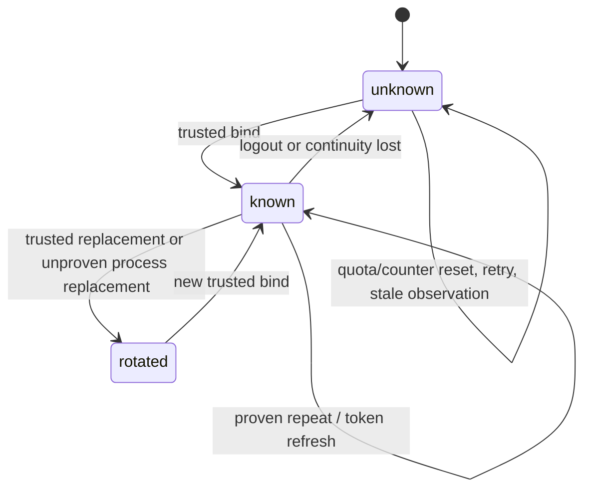

# feat: Own provider account generation

## Summary

Add one supervised, in-memory provider-account generation owner. It will mint opaque local values only from trusted lifecycle adapters, expose a binding-scoped lookup and change subscription, and treat every unproven continuity transition as unknown or rotated.

---

## Problem Frame

DREQ-018 requires usage and meter facts to share an account-generation key only when they belong to the same proven provider/account binding. Existing Codex account notifications are merely humanized, while Claude currently has no trusted account lifecycle evidence; using process, run, counter, or provider-only identifiers would create unsafe joins.

## Assumptions

*This plan was authored without synchronous user confirmation. The items below are agent inferences that fill gaps in the input — un-validated bets that should be reviewed before implementation proceeds.*

- Current Codex `account/updated` establishes a trusted binding but does not expose enough safe identity evidence to prove continuity across a later process; a later unproven bind must rotate rather than reuse.
- A Codex token refresh confirms an already-known process binding but is not itself a credential/account replacement.
- Claude remains unknown until DASH-019 supplies a trusted auth/process lifecycle adapter.

---

## Requirements

- DREQ-018. One shared owner mints a random, non-derivable, provider/backend/auth-process-scoped generation only after trusted binding evidence.
- DREQ-018. Stable proven observations preserve one generation; login, logout, credential/account replacement, backend replacement, and loss of continuity invalidate or rotate it.
- DREQ-018. Unknown bindings are explicit and cannot join known facts; quota resets, retries, counter resets, and token refreshes do not rotate a proven binding.
- DREQ-018. State/events expose only versioned lifecycle status, opaque generation, source, freshness, and health; they retain, log, and publish no provider payload, account identity, credential, hash, capability, or workspace value.

---

## Scope Boundaries

- No usage-envelope, meter-snapshot, token/cost, plan-tier, dashboard, or storage-projection implementation.
- No provider account ID, email, organization, project, credential, credential-derived fingerprint, raw response, or persistent continuity record.
- No guessed Claude binding: it remains an explicit unknown state until a trusted lifecycle owner exists.

### Deferred to Follow-Up Work

- DASH-008 and DASH-012 consume the lookup from their usage and meter adapters.
- DASH-019 owns the Claude lifecycle adapter and authenticated telemetry transport.

---

## Context & Research

### Relevant Code and Patterns

- `src/lib/aiur.ex` owns the central supervision list; the new owner must start with the daemon services, before adapter consumers.
- `src/lib/aiur/codex/coding_agent.ex` creates and tears down the trusted Codex app-server process session, and `src/lib/aiur/codex/turn_loop.ex` receives its generic notifications.
- `src/lib/aiur/codex/event_humanizer.ex` already recognizes `account/updated` and `account/chatgptAuthTokens/refresh`, but currently only renders them for logs.
- `src/lib/aiur/agent_pubsub.ex` demonstrates a guarded Phoenix.PubSub wrapper so early boot and isolated tests do not crash producers.
- `src/lib/aiur/events/publisher.ex` demonstrates dependency-injected time-like test seams, while `src/test/aiur/process_reaper_test.exs` demonstrates named, isolated GenServer instances.

### Institutional Learnings

- The approved Build Order implementation pointer for DASH-018 identifies the Codex lifecycle events above as the only present trusted source and explicitly records the absence of a Claude account source.
- `Aiur.ModelAvailability` is a deliberately lossy rate-limit compatibility ledger and must remain a consumer-adjacent concern, not the account-generation owner.

### External References

- None. The established in-repository app-server protocol fixtures and approved planning evidence are the authoritative implementation inputs for this baseline.

---

## Key Technical Decisions

- **In-memory continuity only:** Daemon restart kills the app-server process and therefore loses safe proof; restart begins unknown rather than persisting a correlation mechanism.
- **Binding-scoped lookup:** Callers supply the trusted local auth-process binding; provider/backend alone never returns a known generation and so cannot create an unsafe cross-process join.
- **Conservative rebinding:** A new binding rotates the previous value unless a trusted owner explicitly supplies continuity proof. Stale or duplicate observations cannot invalidate a newer binding.
- **Opaque event contract:** Change events contain a schema version, provider/backend class, optional opaque generation, source/freshness/health, and reason class only. The internal binding and raw notification never leave the owner.
- **Thin Codex adapter:** The adapter normalizes only allowlisted lifecycle meaning before calling the owner; it never forwards an app-server payload or persists auth mode/account data.
- **Lifecycle-event redaction:** Account lifecycle notifications are reduced to an allowlisted, human-readable audit shape before the ordinary message handler can write them; all non-account notifications retain their current path unchanged.

---

## Open Questions

### Resolved During Planning

- **Which current lifecycle sources are trusted?** Codex app-server account notifications and its session/process owner; no current Claude source qualifies.
- **Should a daemon restart reuse a value?** No. The live process binding is gone, so continuity is unproven.

### Deferred to Implementation

- **Which future Claude protocol transition can prove continuity?** DASH-019 must establish it from a reviewed sibling protocol before adding an adapter.

---

## High-Level Technical Design

> *This illustrates the intended approach and is directional guidance for review, not implementation specification. The implementing agent should treat it as context, not code to reproduce.*

---

## Implementation Units

### U1. Supervised opaque generation owner

**Goal:** Create the versioned, provider/backend/auth-process-binding service that owns all generation minting, invalidation, lookup, health state, and change publication.

**Requirements:** DREQ-018.

**Dependencies:** None.

**Files:**
- Create: `src/lib/aiur/provider_account_generation.ex`
- Modify: `src/lib/aiur.ex`
- Create: `src/test/aiur/provider_account_generation_test.exs`
- Modify: `src/test/aiur/application_test.exs`

**Approach:**
- Maintain only active local binding references and opaque generated values in a named GenServer; use a cryptographically strong default mint and injectable mint/clock hooks for deterministic tests.
- Return a typed, explicit unknown result without a generation when no exact trusted binding is active. Publish only a versioned, redacted lifecycle-change projection through guarded Phoenix.PubSub.
- Model confirmed repeat, replacement, logout, loss of continuity, backend isolation, and stale/out-of-order observations as explicit transitions. Never infer identity from provider/backend, counters, rate limits, timestamps, process IDs, or payload values.

**Execution note:** Implement the transition tests before finalizing each state transition.

**Patterns to follow:**
- `src/lib/aiur/agent_pubsub.ex`
- `src/lib/aiur/events/publisher.ex`
- `src/test/aiur/process_reaper_test.exs`

**Test scenarios:**
- Happy path: an initial lookup is unknown; a trusted bind mints one opaque generation; a confirmed repeat returns that exact value.
- Edge case: different provider/backend bindings receive distinct values, and an unknown binding cannot read or join a known value.
- Edge case: quota reset, request retry, counter reset, and token refresh retain a known generation.
- Error path: logout, missing/ambiguous evidence, unproven replacement, and lost continuity invalidate the old binding and expose named unknown health/reason classes.
- Error path: duplicate and stale old-binding lifecycle observations leave the current newer binding intact.
- Integration: two fixture consumers lookup the same trusted binding and see one generation; after rotation, neither can join its old fact to the new binding.
- Security: generated values are opaque and non-ordinal; state, return values, PubSub events, and captured logs contain no supplied email/account/org/project/credential/hash/raw payload/capability data.
- Integration: the application child list includes the owner in both interactive and headless daemon shapes.

**Verification:**
- The owner alone mints values, all lookup/change results are schema-versioned and redacted, and no known result can be addressed using only provider/backend.

---

### U2. Codex trusted lifecycle adapter

**Goal:** Route current Codex auth/process lifecycle evidence through the shared owner without making raw protocol events or process metadata part of its public contract.

**Requirements:** DREQ-018.

**Dependencies:** U1.

**Files:**
- Create: `src/lib/aiur/codex/account_generation.ex`
- Modify: `src/lib/aiur/codex/coding_agent.ex`
- Modify: `src/lib/aiur/codex/turn_loop.ex`
- Modify: `src/test/aiur/codex/turn_loop_test.exs`
- Create: `src/test/aiur/codex/account_generation_test.exs`

**Approach:**
- Give each trusted app-server session a local-only binding capability. The adapter consumes allowlisted `account/updated` and auth-token-refresh notifications before ordinary rendering, retaining only the normalized lifecycle meaning.
- An account update establishes or conservatively replaces a binding; a refresh can only confirm an already-known binding. Session/process teardown reports lost continuity so a later process cannot reuse the value without new proof.
- Replace raw account-lifecycle messages with a narrow, allowlisted audit projection before the existing message handler can write the agent log; leave every non-account notification on its current path. Keep the lifecycle tap at the Codex owner/turn loop rather than browser, agent payload, rate-limit, or meter surfaces. Claude has no adapter in this unit and therefore remains unknown.

**Patterns to follow:**
- `src/lib/aiur/codex/coding_agent.ex`
- `src/lib/aiur/codex/turn_loop.ex`
- `src/lib/aiur/codex/event_humanizer.ex`

**Test scenarios:**
- Happy path: a trusted Codex account update creates a generation and later refresh/repeated proof for the same binding preserves it.
- Edge case: a malformed or unsupported account update leaves the binding unknown; a rate-limit update or quota reset does not change an existing generation.
- Error path: account replacement and session-process replacement without continuity rotate or invalidate the former value; a stale teardown cannot invalidate the newer binding.
- Integration: the generic turn-loop notification path reaches the owner; non-account messages retain their current message/log behavior while account lifecycle messages use only the redacted audit projection.
- Security: a notification containing identity-like extra fields is neither returned, published, persisted, nor logged; capture the emitted agent message to prove its raw payload is absent.

**Verification:**
- Only the Codex app-server owner invokes lifecycle transitions, and all event paths expose shared opaque generation through U1 rather than locally minting a substitute.

---

### U3. Consumer contract and compatibility characterization

**Goal:** Lock the shared lookup contract needed by future usage and meter adapters, and make the current Claude unsupported state explicit without creating a parallel counter or meter owner.

**Requirements:** DREQ-018.

**Dependencies:** U1, U2.

**Files:**
- Modify: `src/test/aiur/provider_account_generation_test.exs`
- Modify: `src/test/aiur/codex/account_generation_test.exs`

**Approach:**
- Use simple usage/meter fixture functions in the owner tests to prove both consumers read one central value, then prove a rotation invalidates both joins together.
- Characterize Claude as an explicit provider/backend unknown result rather than attempting to extract identity from hooks, transcripts, REPL state, display text, or meter/usage values.
- Keep `Aiur.ModelAvailability`, counter epochs, run IDs, session IDs, and storage generations outside the API and test them as prohibited substitutes.

**Patterns to follow:**
- `src/lib/aiur/model_availability.ex`
- `src/lib/aiur/codex/event_humanizer.ex`

**Test scenarios:**
- Integration: shared usage and meter fixtures receive one value for a proven Codex binding and cannot join known/unknown or pre-/post-rotation facts.
- Edge case: Claude lookup is unknown with an unavailable lifecycle source until a trusted Claude adapter exists.
- Security: attempts to use counter, quota, run, session, process, or backend-only data as a lookup key do not return a known generation.

**Verification:**
- DASH-008 and DASH-012 have a stable binding-scoped lookup and subscription contract, while current Claude behavior is safely and truthfully unsupported.

---

## System-Wide Impact

- **Interaction graph:** Codex session owner → redacting lifecycle adapter → supervised generation owner → guarded PubSub and future usage/meter callers. Claude has no inbound edge at this baseline.
- **Error propagation:** Missing, malformed, ambiguous, stale, or unavailable lifecycle evidence returns explicit unknown state and never blocks an agent turn or reuses a value.
- **State lifecycle risks:** A wrong continuity decision would create an unsafe financial join; the service therefore keeps no restart persistence and invalidates old bindings before publishing a replacement.
- **API surface parity:** Both future adapter families call the same binding-scoped lookup and receive the same versioned health/freshness fields.
- **Integration coverage:** Turn-loop tests prove the trusted tap; owner tests prove rotations and two-consumer sharing; application tests prove supervision in both run shapes.
- **Unchanged invariants:** `Aiur.ModelAvailability` continues to own only compatibility rate-limit observations. Run/session/counter/storage identifiers remain independent namespaces.

---

## Risks & Dependencies

| Risk | Mitigation |
|------|------------|
| Codex protocol does not reveal exact cross-process account continuity | Treat every unproven replacement as a rotation or unknown; do not persist a guessed correlation. |
| Raw app-server payload leaks through a new seam | Normalize inside the trusted adapter, keep the owner payload-free, and test state/events/log capture for forbidden values. |
| Future consumers create local substitute generations | Expose one lookup/change contract and include consumer-fixture tests that prove a shared value. |
| Claude lacks a trusted lifecycle source | Return explicit unknown and defer the adapter to DASH-019. |
| Serial peer changes alter the supervisor list | Reconcile the short shared list immediately before integration and preserve established child-order assertions. |

---

## Documentation / Operational Notes

- The owner is intentionally in-memory: process/daemon restart produces unknown until a trusted bind occurs again.
- No operator-facing UI or account identity diagnostic is added; health/reason categories are for typed consumer handling and test evidence only.

---

## Sources & References

- **Origin document:** approved Build Order requirements at commit `4d8de9508206e08e314f2730cd916501a3b4cafd`, DREQ-018.
- **Approved implementation pointer:** `docs/build-order/08-implementation-pointers.md`, DASH-018 at the same commit.
- Related code: `src/lib/aiur/codex/coding_agent.ex`, `src/lib/aiur/codex/turn_loop.ex`, `src/lib/aiur.ex`.
- Related issues: #1090, DASH-008, DASH-012, DASH-019.
