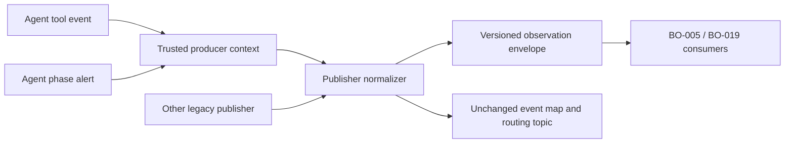

# feat: Propagate ticket observation envelopes

## Summary

Attach one normalized, versioned ticket-observation envelope at the event-publisher boundary. Trusted agent-event and alert producers provide BO-004 identity and available runtime provenance; legacy and unrelated publishers retain their existing payloads but become explicitly unattributed rather than guessed joins.

---

## Problem Frame

The current event exchange routes on bare ticket text and the AgentList derives progress, stage, and latest activity from those topics. That routing text cannot safely distinguish two configured repositories with the same display number, and raw payloads are not a safe activity contract for later projections.

---

## Assumptions

*This plan was authored without synchronous user confirmation. The items below are agent inferences that should be reviewed with the implementation.*

- The phase alert emitted by an agent is the available active CE-stage producer; pane-status PubSub and StatusReport lifecycle ownership stay outside this ticket.
- A concise, typed alert classification is sufficient as the initial latest-safe-evidence observation; arbitrary alert message and reason text are deliberately excluded from the envelope.

---

## Requirements

- R1. Satisfy BOREQ-005 by carrying only BO-004 tracker identity as a joinable ticket key; topics and display identifiers remain routing/locator text only.
- R2. Satisfy BOREQ-006 by providing a typed, headless-safe observation input for progress, active stage, and safe evidence without taking ownership of StatusReport lifecycle fields.
- R3. Preserve existing Publisher, Exchange, SubscriptionStore, IssueLog, and AgentList payload compatibility while classifying legacy events as unattributed.
- R4. Retain only bounded, typed, redacted provenance and attributes; malformed timestamps stay unknown and no local paths, credentials, raw prompts, or model output enter the envelope.

---

## Scope Boundaries

- This change does not add the BO-005 projection/reducer, migrate AgentList consumers, retain history, or choose the latest observation.
- It does not alter BO-004 Issue/StatusReport identity semantics, event-topic routing, durable DecisionStore publishing, or tracker parity.

### Deferred to Follow-Up Work

- BO-005: own ordering, deduplication, freshness, restart behavior, and projections over these envelopes.
- BO-019: retain and query bounded safe history from typed observations.

---

## Context & Research

### Relevant Code and Patterns

- `src/lib/aiur/tracker_identity.ex` supplies the joinable/unjoinable BO-004 contract.
- `src/lib/aiur/events/publisher.ex` is the single normal publish funnel and must retain top-level `id`, `topic`, and legacy payload entries.
- `src/lib/aiur/agent_runner/tool_executor.ex` is the trusted context for agent progress emissions, tool-call identity, backend session, and issue identity.
- `src/lib/aiur/alerts.ex` publishes phase-alert observations and is the closest current source of safe latest evidence.
- `src/lib/aiur/agent_list/event_intake.ex` and `src/lib/aiur/events/subscription_store.ex` consume the legacy map shape and are compatibility constraints, not owners of the new contract.

### Institutional Learnings

- The approved Build Order implementation pointers require an optional envelope at the Publisher boundary rather than backend-specific payload variants, and warn that topic text must never qualify an observation.

---

## Key Technical Decisions

- Add an optional `ticket_observation` field after Publisher assigns the event ID, leaving every existing top-level field intact.
- Use a pure normalizer that keeps absent or malformed times unknown; the Publisher supplies the explicit ingestion timestamp with injectable clock support. Its only identity acceptance criterion is `TrackerIdentity.joinable?/1`.
- Bind producer identity/provenance at `ToolExecutor` and `Alerts`, where the trusted Issue and session context are available; do not derive it from topics, workspace paths, or current configuration.
- Store only enumerated source/event kinds, bounded opaque run/session/tool identifiers, occurrence/ingestion times, and typed progress/stage/alert attributes. Do not copy free-form messages or payload maps into the envelope.

---

## High-Level Technical Design

> *This illustrates the intended approach and is directional guidance for review, not implementation specification. The implementing agent should treat it as context, not code to reproduce.*

---

## Implementation Units

### U1. Define the ticket-observation contract and normalizer

**Goal:** Introduce a total, versioned envelope that distinguishes joinable trusted identity from explicit unattributed input.

**Requirements:** R1, R4

**Dependencies:** BO-004 identity contract

**Files:**
- Create: `src/lib/aiur/ticket_observation.ex`
- Test: `src/test/aiur/ticket_observation_test.exs`

**Approach:** Normalize identity, source/event identity, bounded run/session/tool provenance, source occurrence time, ingestion observation time, payload version, and an allowlisted typed attribute set. Keep malformed or missing input unknown, never synthesized from routing text.

**Patterns to follow:**
- `src/lib/aiur/tracker_identity.ex`
- `src/lib/aiur/events/sanitizer.ex`
- `src/lib/aiur/secret_redactor.ex`

**Test scenarios:**
- Happy path: a joinable GitHub identity with trusted tool provenance produces a joinable progress envelope.
- Edge case: two repository identities with the same display number remain distinct.
- Error path: missing/invalid identity, malformed occurrence time, malformed observed time, invalid provenance, and invalid attributes produce an unattributed/unknown envelope without raising.
- Integration: duplicate and out-of-order source observations retain their own event/source IDs and times without a reducer choosing a winner.
- Security: message text, payload prose, credentials, local paths, account data, and capability URLs are not copied into attributes.

**Verification:** The public normalizer is deterministic with an injected clock and exposes only typed, bounded fields.

---

### U2. Attach observations at the Publisher compatibility boundary

**Goal:** Publish normalized observations alongside the existing event map without changing topic routing or legacy subscriber fields.

**Requirements:** R1, R3, R4

**Dependencies:** U1

**Files:**
- Modify: `src/lib/aiur/events/publisher.ex`
- Test: `src/test/aiur/events/publisher_test.exs`

**Approach:** Once an event ID is assigned, attach the normalized envelope from optional trusted producer metadata. Publishers with no metadata receive an explicit unattributed envelope; persisted decision publishing continues its existing durability path.

**Patterns to follow:**
- `src/lib/aiur/events/publisher.ex`
- `src/lib/aiur/events/exchange.ex`

**Test scenarios:**
- Happy path: Exchange subscribers receive the old fields plus a joinable envelope.
- Compatibility: SubscriptionStore/IssueLog-required `id`, `topic`, and message fields remain unchanged.
- Edge case: legacy topic, bare number, path-like payload, or active-workflow-like text cannot qualify identity.
- Integration: malformed producer metadata and duplicate/out-of-order publications remain publishable and explicitly nonjoinable.

**Verification:** All current generic and persisted publication semantics remain intact while envelope classification is present.

---

### U3. Migrate trusted progress and stage/evidence producers

**Goal:** Supply trusted BO-004 identity and available runtime provenance from the actual producer contexts.

**Requirements:** R1, R2, R3, R4

**Dependencies:** U1, U2

**Files:**
- Modify: `src/lib/aiur/agent_runner/tool_executor.ex`
- Modify: `src/lib/aiur/alerts.ex`
- Test: `src/test/aiur/agent_runner/tool_executor_test.exs`
- Test: `src/test/aiur/alerts_test.exs`

**Approach:** Mark agent progress/check-in events with the trusted Issue identity plus run/session/tool-call provenance. Mark phase alerts with their trusted Issue identity and safe stage/evidence classification. Preserve their existing topics and free-form legacy payloads, but never promote that prose into the envelope.

**Patterns to follow:**
- `src/lib/aiur/agent_runner/tool_executor.ex`
- `src/lib/aiur/alerts.ex`
- `src/lib/aiur/boot.ex`

**Test scenarios:**
- Happy path: progress, check-in, phase start/end, and generic alert paths publish joinable envelopes when the Issue carries BO-004 identity.
- Edge case: retry/session change updates provenance without altering tracker identity.
- Error path: absent legacy Issue identity remains explicitly unattributed.
- Integration: existing subscribers still receive the routing topic and legacy payload shape.
- Security: agent event/alert message content cannot appear in safe observation attributes.

**Verification:** Each inventoried source declares its producer metadata directly; none reconstructs identity from the topic, workspace, or current workflow.

---

### U4. Publish the migration inventory and compatibility window

**Goal:** Leave a durable record of covered producers, legacy behavior, and downstream compatibility for BO-005/BO-019.

**Requirements:** R2, R3

**Dependencies:** U2, U3

**Files:**
- Create: `docs/ticket-observation-producer-inventory.md`
- Test: `src/test/aiur/ticket_observation_test.exs`

**Approach:** Document migrated progress and phase/evidence producers, publishers that remain explicitly unattributed, envelope version rules, and compatibility guarantees. Link the inventory to the normalizer’s public source classification so documentation cannot describe unsupported data.

**Patterns to follow:**
- `docs/plans/2026-07-13-003-feat-aiur-debug-skill-plan.md`

**Test scenarios:**
- Integration: the documented source classifications remain represented by the public inventory.

**Verification:** A BO-005 implementer can identify migrated and legacy producer behavior without parsing logs or inferring from topics.

---

## System-Wide Impact

- **Interaction graph:** ToolExecutor and Alerts add optional trusted metadata; Publisher adds envelopes; Exchange, SubscriptionStore, IssueLog, and AgentList continue consuming existing fields.
- **Error propagation:** Invalid metadata degrades to an unattributed envelope and does not interrupt publication.
- **State lifecycle risks:** The envelope has no retention or winner selection; BO-005 owns duplicate, ordering, freshness, restart, and eviction rules.
- **API surface parity:** Plain and persisted Publisher paths retain their contracts; only producer context opt-in makes an observation joinable.
- **Unchanged invariants:** Event topics route only; StatusReport remains the execution-lifecycle authority; legacy subscribers need not understand observations.

---

## Risks & Dependencies

| Risk | Mitigation |
|------|------------|
| A public map-shape change breaks legacy consumers | Add only an optional field and assert legacy keys/topic behavior in Publisher and producer tests. |
| Free-form agent text leaks into a new shared projection | Build attributes from source-specific allowlists; never copy `message`, `reason`, or arbitrary payload maps. |
| Delayed observations are mistaken for current state | Preserve independent occurrence and observation times; leave ordering to BO-005. |
| Identity becomes inferred from routing text | Accept joinable identity only from BO-004 records passed by trusted producer context. |

---

## Sources & References

- Origin: `docs/brainstorms/2026-07-12-build-order-requirements.md` at approved planning commit `4d8de9508206e08e314f2730cd916501a3b4cafd`
- Approved ticket plan: `docs/build-order/tickets/BO-017-propagate-ticket-events.md` at the same commit
- Related issue: #1104
