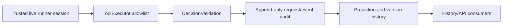

# feat: Persist trusted Decision provenance

## Summary

Add a versioned, optional provenance value to the canonical Decision request
snapshot. It will be captured exactly once from the live runner session,
persisted with its Decision version, and replayed unchanged through events,
projections, enrichments, and history while legacy records remain explicitly
unknown.

---

## Problem Frame

DREQ-017 requires source-backed backend/model/session/attempt facts, but the
current Decision request path retains only a smaller trusted source identity.
Parsing event prose or accepting agent-authored fields would make that audit
data forgeable. See origin: `docs/brainstorms/2026-07-12-build-order-requirements.md`.

---

## Assumptions

*This plan was authored without synchronous user confirmation. The items below
are agent inferences that fill gaps in the input — un-validated bets that should
be reviewed before implementation proceeds.*

- The coding-agent registry can provide a static, trusted family mapping for
  each backend, allowing `claude-repl` to retain the `claude` family without
  interpreting display text.
- No current backend exposes an authoritative resolved-model fact at Decision
  acceptance; that field remains absent until such a runtime fact exists.

---

## Requirements

- R1. Fulfill DREQ-017: version and migrate optional trusted backend,
  requested-model, resolved-model, session, and attempt provenance.
- R2. Capture only safe runtime/session facts at Decision acceptance; do not
  trust agent payloads, display strings, prompts, transcripts, or logs.
- R3. Preserve the captured provenance with the immutable Decision version
  through answer, revision, delivery, acknowledgement, resolution, replay, and
  history.
- R4. Keep legacy and human-authored provenance unknown without manufacturing
  historical values.
- R5. Preserve `DecisionDelegation.basis` and
  `DecisionAnswer.supervisor_basis`, including integer confidence `0..100`,
  exactly as they are.

---

## Scope Boundaries

- No retained-query, pagination, UI, or presentation changes owned by DASH-006
  or DASH-007.
- No model inference from tool arguments, prose, prompts, transcripts, current
  config after acceptance, or persisted legacy values.
- No additional confidence field, confidence conversion, or change in
  supervisor authority semantics.

### Deferred to Follow-Up Work

- Capture a resolved model only when a backend exposes an authoritative runtime
  field; this change represents its absence as unknown.

---

## Context & Research

### Relevant Code and Patterns

- `src/lib/aiur/agent_runner/tool_executor.ex` strips agent-authored identity
  and supplies trusted ticket/session context to `DecisionStore.request/2`.
- `src/lib/aiur/agent_runner/session_lifecycle.ex` resolves backend/model before
  session startup; backend sessions retain the requested model and thread id.
- `src/lib/aiur/decision_validation.ex` is the canonical trusted-context
  injection boundary and preserves absent optional provenance outside the
  historic content-hash material.
- `src/lib/aiur/decision_projection.ex` replays request snapshots through that
  validator and writes the current JSON projection; its legacy-attention
  optional-key pattern preserves old hashes.
- `src/lib/aiur/decision_enrichment.ex` and `src/lib/aiur/decision_history.ex`
  already preserve request-version context separately from later lifecycle
  events.
- `src/lib/aiur/decision_event.ex` rejects event schema versions other than 1;
  provenance must therefore be additive optional request data, not an event
  envelope schema bump.

### Institutional Learnings

- The accepted Decision audit is append-only and replay-validated; optional
  historical fields must remain absent from legacy hash material.

### External References

- Not used. The repository has direct, current patterns for safe optional
  provenance and deterministic replay.

---

## Key Technical Decisions

- **Use a nested, versioned `DecisionProvenance` value:** its schema version is
  independent from the fixed event-envelope version, making future additive
  provenance evolution explicit without invalidating current events.
- **Treat absence as unknown:** omit provenance for legacy/human records and
  omit unavailable individual facts rather than storing guesses or sentinel
  strings.
- **Capture on request acceptance only:** derive family/backend/requested model,
  thread id, attempt id, source, and capture time from the live runner context;
  resolved model is present only when the adapter supplies it authoritatively.
- **Keep provenance immutable across enrichments:** copy the original request
  value into each new Decision version and reject enrichment mutations.
- **Leave supervisor basis untouched:** the existing answer/delegation value
  remains the only confidence representation and is tested at `0`, `100`, and
  representative values alongside provenance.
- **Validate provenance as a complete durable boundary:** a nested schema must
  reject unknown fields and unsafe values rather than silently retaining a
  partial raw session map. This avoids turning a future runtime addition into
  an accidental audit or secret-retention surface.

### Alternatives Considered

- **Add provenance to `DecisionEvent` only:** rejected because the canonical
  request snapshot and legacy replay path would remain unable to provide the
  version-scoped value to current projections and later lifecycle history.
- **Use `Decision.source` for all facts:** rejected because that existing
  correlation identity has different semantics and cannot distinguish requested
  from resolved model without changing its established contract.
- **Capture current session state while rendering history:** rejected because
  it guesses past facts after the Decision was accepted and violates append-only
  audit provenance.

---

## Open Questions

### Resolved During Planning

- **Can event schema version change?** No. Existing decoder rejection of any
  version other than `1` requires additive request data for rollback-compatible
  replay.
- **Can resolved model be populated now?** No. It lacks a current authoritative
  runtime source, so it remains unknown.

### Deferred to Implementation

- Exact value bounds and field names should follow existing Decision validation
  conventions while keeping the durable allowlist limited to the required safe
  facts.

---

## Implementation Units

### U1. Define trusted, versioned provenance and immutable request semantics

**Goal:** Add the optional provenance type to canonical Decisions and make
validation, hashing, serialization, decoding, and enrichment preserve it
without accepting an agent-controlled value.

**Requirements:** R1, R2, R3, R4, R5

**Dependencies:** None

**Files:**
- Create: `src/lib/aiur/decision_provenance.ex`
- Modify: `src/lib/aiur/decision.ex`
- Modify: `src/lib/aiur/decision_validation.ex`
- Modify: `src/lib/aiur/decision_projection.ex`
- Modify: `src/lib/aiur/decision_enrichment.ex`
- Test: `src/test/aiur/decision_provenance_test.exs`
- Test: `src/test/aiur/decision_validation_test.exs`
- Test: `src/test/aiur/decision_projection_test.exs`
- Test: `src/test/aiur/decision_store_test.exs`

**Approach:**
- Normalize a bounded, allowlisted nested provenance value only from a trusted
  `DecisionValidation` option; drop all similarly named raw payload fields.
- Keep the legacy request hash shape unchanged whether optional provenance is
  absent or present, so rollback readers can still decode request snapshots;
  the typed Decision-event envelope hashes all request data, including
  provenance, so new event replay still fails closed on tampering.
- Serialize the optional key only when present, decode it through the same
  canonical validator, preserve it in request-shaped enrichment data, and add
  it to the immutable enrichment base comparison.
- Retain `DecisionEvent` envelope schema version `1`; its request data carries
  the optional value without an envelope-code change.
- Exercise both decoded legacy request records and lifecycle-event request data
  so the single validation boundary proves rollback-compatible replay rather
  than only serializer output.

**Execution note:** Add characterization coverage for current absent-provenance
hashes before extending the serializer.

**Patterns to follow:**
- Optional `legacy_attention` validation, hash inclusion, and serialization in
  `src/lib/aiur/decision_validation.ex` and
  `src/lib/aiur/decision_projection.ex`.
- Existing typed event replay in `src/lib/aiur/decision_event.ex`.

**Test scenarios:**
- Happy path: a trusted complete runtime context normalizes to a versioned
  provenance value with backend, requested model, session, attempt, source,
  and capture time.
- Edge case: missing context and legacy persisted request records decode with
  no provenance and retain their existing content hashes.
- Error path: malformed or disallowed provenance fields, account/email/org,
  prompt/transcript/session payload, credentials, environment values, and
  capability URLs are rejected or excluded before persistence/logging.
- Integration: request, enrichment, answer, revision, transport, lifecycle,
  store restart, and replay retain the same provenance captured by that Decision
  version.
- Integration: an enrichment based on an older request version keeps that
  version's provenance and a mutation attempt fails before append.
- Regression: supervisor-basis confidence `0`, `100`, and a representative
  value retain identical integer values and JSON keys through the extended
  snapshot path.

**Verification:**
- Canonical and persisted request snapshots round-trip with provenance when
  known and without it when unknown; tampered provenance fails replay while
  legacy snapshots remain readable.

---

### U2. Supply provenance from authoritative runner session context

**Goal:** Make the Decision tool acceptance path carry only live, safe session
facts into the canonical request validator.

**Requirements:** R1, R2, R4

**Dependencies:** U1

**Files:**
- Modify: `src/lib/aiur/coding_agent.ex`
- Modify: `src/lib/aiur/agent_runner/session_lifecycle.ex`
- Modify: `src/lib/aiur/agent_runner/tool_executor.ex`
- Test: `src/test/aiur/agent_runner/session_lifecycle_test.exs`
- Test: `src/test/aiur/agent_runner/tool_executor_test.exs`

**Approach:**
- Give the backend registry a trusted static family mapping and retain the
  resolved session backend, requested model, thread identifier, and runner
  attempt identity on the active session object.
- Construct provenance inside `ToolExecutor` from that object and pass it as
  trusted request options; exclude raw tool arguments and payload display data.
- Leave resolved model absent until the active backend provides an explicit
  authoritative fact; do not fall back to configured/requested model.
- Pass a deliberately small scalar map to the Decision boundary, not the live
  session map, so port metadata, workspace details, containment state, and any
  future runtime additions cannot cross into audit persistence by default.

**Patterns to follow:**
- `SessionLifecycle.start_agent_session/3` backend tagging and fallback behavior.
- `ToolExecutor.trusted_source/1` and its identity-overwrite tests.

**Test scenarios:**
- Happy path: Codex and Claude session maps pass their trusted family, backend,
  requested model, thread id, and attempt identity to a Decision request.
- Edge case: a fallback backend records the actual session backend while
  preserving the configured requested-model fact; unavailable resolved model
  stays absent.
- Error path: agent-provided provenance, `originName`, question, rationale,
  or display values cannot override runtime provenance.
- Error path: raw session metadata, account/email/org, prompt/transcript,
  credential-like values, environment values, and capability URLs are absent
  from both requester options and persisted snapshots.
- Integration: repeated tool calls with the same trusted session correlate as
  before and capture stable provenance without exposing raw session metadata.

**Verification:**
- Tool-executor tests observe only trusted option provenance at the requester
  seam, with no prohibited payload or log values.

---

### U3. Expose optional provenance to history consumers without changing basis

**Goal:** Include canonical optional provenance in the Decision history shape
while retaining existing supervisor-basis output and lifecycle semantics.

**Requirements:** R3, R4, R5

**Dependencies:** U1

**Files:**
- Modify: `src/lib/aiur/decision_history.ex`
- Test: `src/test/aiur/decision_history_test.exs`
- Test: `src/test/aiur/decision_api_integration_test.exs`
- Test: `src/test/aiur/decision_delegation_test.exs`
- Test: `src/test/aiur/decision_answer_test.exs`

**Approach:**
- Attach provenance from each request-version context to history entries without
  parsing prose or reconstructing missing facts.
- Preserve `DecisionAnswer.supervisor_basis` as the existing canonical basis;
  do not add or reinterpret confidence in the history mapping.

**Patterns to follow:**
- Version-context lookup in `DecisionHistory.project_event/3`.
- Current supervisor-basis JSON and API integration assertions.

**Test scenarios:**
- Happy path: history for a request, answer, revision, delivery,
  acknowledgement, and resolution carries the provenance of its request
  version.
- Edge case: legacy and human-originated histories expose unknown/absent
  provenance rather than current-session data.
- Integration: API/store/history replay retains provenance independently from
  supervisor-basis confidence for values `0`, `100`, and a representative
  midrange value.

**Verification:**
- DASH-006/007 can consume a stable optional provenance field and the existing
  supervisor-basis contract without a second confidence representation.

---

## System-Wide Impact

- **Interaction graph:** Runner session → tool executor → Decision validation →
  append-only request/event store → projection/history/API consumers.
- **Error propagation:** Invalid trusted provenance rejects only the malformed
  provenance construction path; missing optional facts leave a valid Decision
  provenance-unknown.
- **State lifecycle risks:** Snapshot hash and enrichment-version immutability
  must prevent replay tampering or late mutation while keeping old records
  readable.
- **API surface parity:** Current projection and history receive the same
  optional canonical value; DASH-006/007 add retained-query and presentation
  behavior separately.
- **Integration coverage:** Restart/replay plus later answer/revision/transport
  events must continue to reference the captured request version.
- **Unchanged invariants:** Decision event schema version remains `1`; existing
  `supervisor_basis.confidence` stays an integer `0..100` with unchanged
  validation, persistence, authority, API, and presentation semantics.

The durable value crosses the following boundary exactly once:

This illustrates the intended approach and is directional guidance for review,
not implementation specification. In particular, rendering and agent payloads
are not inputs to the provenance path.

---

## Risks & Dependencies

| Risk | Mitigation |
|---|---|
| A new field changes historic request hashes | Omit it entirely when absent and characterize legacy fixtures before edits. |
| Agent-authored text contaminates audit provenance | Construct the value only from the active runner session; reject/drop raw provenance keys. |
| Enrichment silently mutates captured facts | Preserve the original nested value and list it among immutable request fields. |
| Configured model is mistaken for resolved model | Store it as requested only; emit resolved model only from a future authoritative backend fact. |
| Confidence contract regresses while shared code changes | Extend existing `0..100` delegation, answer, API, replay, and history regression fixtures unchanged. |
| A raw live session map gains sensitive fields later | Construct an explicit scalar allowlist and assert excluded-field absence in requester and durable-record tests. |
| Current projection, audit replay, and history disagree on optionality | Drive the same known/unknown fixture through serialization, restart/replay, and history projection. |

---

## Documentation / Operational Notes

- No direct UI change. History consumers should label missing optional facts as
  unknown rather than inferring from surrounding text.
- This is additive replay migration: no backfill or rewrite of Decision audit
  records is required.

---

## Sources & References

- **Origin document:** `docs/brainstorms/2026-07-12-build-order-requirements.md`
  at approved planning commit `4d8de9508206e08e314f2730cd916501a3b4cafd`.
- **Implementation pointers:** `docs/build-order/08-implementation-pointers.md`
  at the approved planning commit (DASH-017).
- Related code: `src/lib/aiur/decision_validation.ex`,
  `src/lib/aiur/decision_projection.ex`,
  `src/lib/aiur/agent_runner/tool_executor.ex`.
- Related issues: #1089 (DASH-017), DASH-006, DASH-007.
