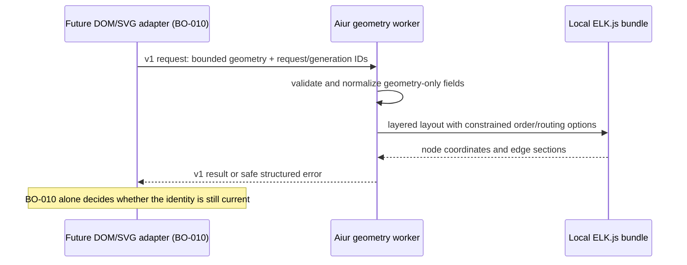
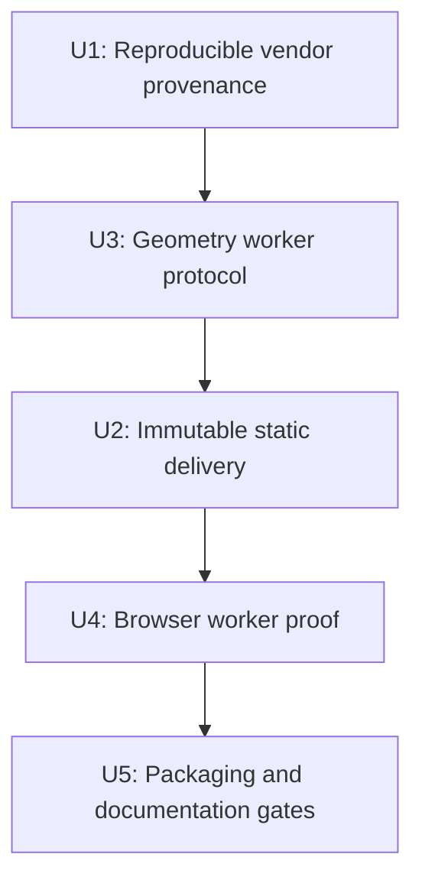

# feat: Vendor layout worker platform

## Summary

Package ELK.js 0.11.1 as a reproducible, locally served static asset and expose it only through a bounded v1 geometry-worker protocol. The engine will compute layout entirely in a dedicated worker; LiveView and the future DOM/SVG adapter retain all product state, accessibility, and currency decisions.

---

## Problem Frame

Build Order needs directed, routed graph geometry for graphs up to 100 members without freezing the browser or relying on a remote CDN. The current dashboard has inline JavaScript and a small authenticated static-asset controller, but no JavaScript bundle pipeline, asset digesting, or Content-Security-Policy header; the platform must add a narrow release-safe delivery seam rather than assume those facilities already exist.

---

## Assumptions

*This plan was authored without synchronous user confirmation. The items below are implementation inferences that should be reviewed with the change.*

- The current ELK.js release, `0.11.1`, remains the accepted pin after its committed provenance, integrity, license, size, and fixture checks pass.
- Per-asset content revisions, recorded in a small committed layout manifest, are the appropriate immutable-cache boundary until the dashboard gains a general asset-manifest pipeline.
- The browser harness's synthetic fixture server is the right isolated surface for worker execution tests; BO-010 will own production-hook integration.

---

## Requirements

- BOREQ-009. Pin, audit, package, and serve a maintained layout-only engine locally with no CDN or runtime dependency.
- BOREQ-009. Keep all product state and semantic rendering outside the engine and worker.
- DEC-007. Use ELK.js layered layout with routed edges behind an isolated adapter/worker and retain accessible DOM plus SVG ownership outside this ticket.
- Ticket acceptance. Bound v1 messages to the 100-member graph limit, reject malformed or sensitive payloads safely, return coordinates/routed points/diagnostics, and make stale request identity explicit.
- Ticket acceptance. Prove the local assets, license/provenance, cache identity, release inclusion, and off-main-thread representative layout behavior.

**Origin flows:** BOREQ-008 browser infrastructure supplies the deterministic browser fixture and worker-readiness evidence consumed here.

---

## Scope Boundaries

- No DOM measurement, LiveView hook state, SVG rendering, fallback rendering, pan/zoom, readiness policy, or product-status derivation.
- No CDN, remote code loading, runtime engine upgrades, raw engine errors, issue titles/bodies, credentials, or runtime-action data in worker messages.
- No broad CSP rollout. The implementation must remain compatible with the current absence of CSP; a future explicit CSP policy will need to allow only the same-origin worker asset.

### Deferred to Follow-Up Work

- BO-010 applies returned geometry to semantic cards/SVG and discards stale responses against its active root, generation, and measurement state.
- BO-014 establishes final latency and visual-quality budgets using the shared browser measurement primitives.

---

## Context & Research

### Relevant Code and Patterns

- `src/lib/aiur_web/static_assets.ex` selectively serves embedded dashboard assets and already reads `aiur-logo.png` from `priv/static` at runtime. The latter is the release-compatible pattern for a large vendor bundle.
- `src/lib/aiur_web/controllers/static_asset_controller.ex` and the authenticated static scope in `src/lib/aiur_web/router.ex` provide the narrow asset-serving seam. Existing URLs receive a one-year cache header but have no digesting.
- `src/browser/` is BO-008's isolated, exact-pinned Playwright project. `src/test/browser/fixture_server.exs` exposes synthetic static assets and runs real worker readiness in a deterministic LiveView fixture.
- OTP releases ship application `priv/` content, and `packaging/scripts/assemble-platform-package.mjs` copies the assembled release tree into each platform npm package.

### External References

- ELK.js 0.11.1 is the current npm release (published March 2026), has no npm dependencies, and is EPL-2.0. Its published integrity is `sha512-zxxR9k+rx5ktMwT/FwyLdPCrq7xN6e4VGGHH8hA01vVYKjTFik7nHOxBnAYtrgYUB1RpAiLvA1/U2YraWxyKKg==`.
- ELK's documented layered algorithm supports directed layers, orthogonal routing, cycles/self loops, and generated edge bend points. Its documented partitioning options provide the adapter seam for bounded lane/phase ordering without giving the engine product meaning.
- ELK.js documents browser-worker use, but this plan deliberately runs the bundled engine inside Aiur's dedicated geometry worker instead of exposing ELK's API or an engine-created worker to product code.

---

## Key Technical Decisions

- **Use ELK.js 0.11.1 with a committed browser bundle:** Its documented layered/routed geometry support meets DEC-007 while retaining no rendering or product-state capability. Record the npm tarball URL, SRI integrity, local SHA-256 values, size ceiling, and EPL-2.0 notice beside the generated asset.
- **Use one outer Aiur worker:** The authored worker imports the locally vendored bundled engine and executes it there. Consumers exchange only a versioned, validated geometry protocol and never construct ELK objects or select an engine at runtime.
- **Content-address every immutable JavaScript asset:** The engine URL carries its ELK version and content hash; the authored worker and DOM-free client each carry their independent protocol/revision hash. A committed manifest records the matching hashes and import targets, so changing any served byte changes its URL without inventing a general Phoenix asset digest pipeline.
- **Keep source maps out of releases:** Vendor only the minified runtime engine, authored worker, license, and provenance/checksum evidence. Debugging uses safe protocol diagnostics and fixture artifacts, not production source maps.
- **Model obsolescence by identity, not worker preemption:** Every result echoes request and generation identity. A stale computation may finish, but the protocol never claims it is current; BO-010 owns comparison with active UI state.
- **Own transport failures without owning UI:** A tiny protocol client, separate from the LiveView hook, constructs/recreates the worker, validates replies, turns startup/message/timeout faults into the same safe envelope, and never measures or changes DOM/fallback state.

---

## Open Questions

### Resolved During Planning

- **Which engine?** ELK.js 0.11.1, subject to the planned integrity/fixture gate; it is maintained, browser-worker capable, layout-only, and has no npm transitive dependencies.
- **How does caching work without a general manifest pipeline?** A committed layout-only manifest maps the engine version/hash and independently hashed worker/client revisions to authenticated local URLs.

### Deferred to Implementation

- **Exact size ceiling:** Set it from the verified minified bundle size with headroom small enough to catch an accidental debug bundle or duplicate engine.
- **Exact default spacing values:** Keep them in the engine adapter as geometry-only defaults and validate the topology/order invariants rather than exposing pixel values as a public contract.

---

## High-Level Technical Design

> *This illustrates the intended approach and is directional guidance for review, not implementation specification. The implementing agent should treat it as context, not code to reproduce.*

---

## Implementation Units

### U1. Reproducible vendor provenance

**Goal:** Add an exact ELK.js dependency and a deterministic vendor/check script that materializes only the approved runtime bundle plus auditable evidence.

**Requirements:** BOREQ-009; DEC-007.

**Dependencies:** None.

**Files:**
- Modify: `src/browser/package.json`
- Modify: `src/browser/package-lock.json`
- Create: `src/browser/scripts/vendor-elk.mjs`
- Create: `src/browser/scripts/check-vendored-elk.mjs`
- Create: `src/priv/static/vendor/elk/0.11.1/elk.bundled.js`
- Create: `src/priv/static/vendor/elk/0.11.1/LICENSE.md`
- Create: `src/priv/static/vendor/elk/0.11.1/PROVENANCE.md`
- Create: `src/priv/static/vendor/elk/0.11.1/manifest.json`

**Approach:** Pin the npm package exactly and use its lockfile-resolved contents as the only generator input. The vendor script copies the selected minified engine file and license, writes a small provenance manifest with npm version/tarball/integrity, local hashes, source-map exclusion, and a measured size budget. The manifest is later extended with the independently hashed worker/client revisions. The check script verifies committed bytes and metadata against the installed exact package; it must fail for missing license, wrong package version/integrity, unexpected source maps, hash mismatch, or over-budget output.

**Patterns to follow:** The exact browser dependency pins in `src/browser/package.json`; runtime `priv/static` loading in `src/lib/aiur_web/static_assets.ex`.

**Test scenarios:**
- Happy path: an exact locked package reproduces the committed engine bytes, license, provenance, and manifest hashes.
- Error path: altered engine bytes, integrity/version mismatch, missing license, source map, and oversized bundle each fail the check with a safe actionable reason.
- Security: the checked-in provenance contains only package/artifact metadata, never credentials or local paths.

**Verification:** The checked vendor tree is deterministic, package-auditable, and bounded before it reaches static serving or release packaging.

---

### U2. Immutable authenticated static delivery

**Goal:** Serve only the approved content-addressed engine, worker, and transport-client URLs through the existing dashboard static surface with immutable-cache semantics and release-safe runtime reads.

**Requirements:** BOREQ-009; local-only URL, cache identity, offline/release inclusion acceptance criteria.

**Dependencies:** U3.

**Files:**
- Modify: `src/lib/aiur_web/static_assets.ex`
- Modify: `src/lib/aiur_web/controllers/static_asset_controller.ex`
- Modify: `src/lib/aiur_web/router.ex`
- Modify: `src/test/aiur/extensions_test.exs`

**Approach:** Add explicit manifest-derived allowlisted paths rather than a catch-all file server. Read large vendor bytes from `Application.app_dir(:aiur, "priv/static/..." )` at request time, preserve JavaScript content types and the existing authenticated scope, and return 404 for all unregistered versions/files. The engine path includes the ELK version/hash; the worker and client paths include their independent content revisions; worker imports must use the manifest's exact local engine URL. Test that changed worker bytes require a new public URL and that an assembled application resolves the same `priv/static` assets.

**Patterns to follow:** `StaticAssets.fetch/1` for `aiur-logo.png`, the `StaticAssetController.serve/2` cache header, and the existing dashboard-auth static route scope.

**Test scenarios:**
- Happy path: engine, worker, and transport-client paths return JavaScript with independently content-addressed immutable URLs under dashboard auth.
- Edge case: a non-current version, traversal-like path, or provenance/license filename is not publicly served.
- Integration: a release/runtime application directory resolves every local asset, a worker byte change cannot retain its old URL, and no layout URL points to a CDN.

**Verification:** Only local, content-addressed engine/worker/client URLs are reachable in development and packaged releases; documentation and evidence remain on disk but off the public asset surface.

---

### U3. Bounded v1 geometry worker protocol

**Goal:** Implement a dedicated worker that validates geometry-only requests, runs ELK layered layout off the main thread, and returns safe coordinates, routes, diagnostics, and error outcomes.

**Requirements:** BOREQ-009; DEC-007; worker protocol, bounded-input, stale-request, and safe-error acceptance criteria.

**Dependencies:** U1.

**Files:**
- Create: `src/priv/static/vendor/elk/0.11.1/aiur-layout-worker.js`
- Create: `src/priv/static/vendor/elk/0.11.1/aiur-layout-client.js`
- Create: `src/browser/tests/support/layout-worker-client.mjs`
- Create: `src/browser/tests/layout-worker.protocol.spec.mjs`
- Modify: `src/test/browser/fixture_server.exs`
- Modify: `src/test/support/browser_harness/fixtures.ex`

**Approach:** Define one explicit protocol version with discriminated `layout`, `result`, and `error` envelopes. The request contains only generated request/node/edge IDs, a positive generation, finite dimensions, geometry-only lane/phase order indexes, explicit external stub nodes, and an allowlisted fixed option set; success echoes request/generation IDs with rectangles and routes; errors contain only a fixed code plus bounded fixed text. Make the following v1 limits normative and enforce them before normalization or ELK invocation: 256 KiB serialized request; 100 nodes; 1,000 edges; 100 lane/phase entries; 64-character generated IDs matching `request_<positive generation>_<sequence>`, `node_<sequence>`, or `edge_<sequence>`; dimensions and coordinates in 1..4,096; eight predefined options; 16 sections per edge; 64 points per section; 10 diagnostics; and 160 characters of fixed error text. The caller maps provider identity to generated geometry IDs before sending, and errors/diagnostics never interpolate input values. Translate only this geometry into ELK layered graphs with deterministic direction, routing, spacing, and partition/order inputs. Return only bounded node rectangles and edge sections; never return raw engine exceptions, original payloads, or product fields. Accept cycles and explicit `stub: true` external geometry nodes; identity echoing makes an older completion detectable without claiming cancellation or UI currency.

The small transport client owns `Worker` availability/constructor detection, outbound and inbound envelope validation, `error`/`messageerror` handling, and a fixed five-second request deadline. On a deadline or wedged-worker fault it emits a safe error carrying request/generation IDs, terminates the worker, and recreates it for a later request. It owns no DOM, measurement, renderer, fallback, or active-generation policy; BO-010 selects and composes it.

**Patterns to follow:** The worker-readiness fixture and Playwright helper conventions in `src/browser/`; neutral 0/1/20/50/100 and degraded fixture builders in `src/test/support/browser_harness/fixtures.ex`.

**Test scenarios:**
- Happy path: 0, 1, 20, 50, and 100-node directed fixtures return finite node rectangles and routed edge sections; repeated input preserves structural geometry invariants without snapshotting public pixels.
- Edge case: cycles, self loops, multiple roots, lane/phase ordering metadata, and explicit external stubs return bounded results or documented diagnostics.
- Error path: malformed envelopes, unsupported protocol versions, prefix/length-invalid or sensitive-looking IDs, duplicate/missing identifiers, non-finite or oversized dimensions, excess message/nodes/edges/routes/diagnostics, disallowed options, engine failures, and malformed replies yield a structured safe error.
- Error path: absent/blocked `Worker`, constructor/message faults, a deterministic hung worker, and a late result after the client deadline yield a structured client error and leave the next request able to create a fresh worker.
- Integration: request/generation IDs are echoed, and a completion for an older request is distinguishable from the latest request without mutating DOM or product state.

**Verification:** Browser consumers can load a same-origin worker through the DOM-free transport client, prove layout executes off the main thread, and use no engine-specific object outside the worker boundary.

---

### U4. Real-browser fixture proof

**Goal:** Extend BO-008's deterministic browser harness to exercise the real local worker assets and verify protocol safety and responsive main-thread behavior.

**Requirements:** BOREQ-008; BOREQ-009; off-main-thread representative-fixture acceptance criterion.

**Dependencies:** U2, U3.

**Files:**
- Modify: `src/browser/package.json`
- Modify: `src/browser/tests/liveview-smoke.spec.mjs`
- Create: `src/browser/tests/layout-worker.browser.spec.mjs`
- Modify: `src/browser/tests/support/browser-helpers.mjs`
- Modify: `src/test/browser/fixture_server.exs`

**Approach:** Serve the production worker, engine, and client through a fixture that starts the actual `AiurWeb.Router` static path with dashboard Basic Auth, then use Playwright HTTP credentials to send only synthetic geometry fixtures. Include a denied-subresource scenario so the client turns missing/unauthenticated asset startup into its safe envelope. Add worker-ready, elapsed-time, and message-observation helpers that verify a main-thread task remains observable while layout runs. Keep these tests neutral: they assert worker protocol and geometry bounds, not Build Order readiness, card rendering, SVG application, or final performance thresholds.

**Patterns to follow:** `src/browser/tests/liveview-smoke.spec.mjs` for authenticated fixture setup, real hook/worker checks, and monotonic measurements; the fixture server's explicit static-asset bridge.

**Test scenarios:**
- Integration: a 20/50/100-member fixture loads the engine, worker, and client from content-addressed authenticated local URLs, receives a bounded layout result, and leaves a concurrent main-thread marker responsive.
- Integration: requests with cycle/external/degraded fixture topology produce the expected safe result/error category without network requests beyond the fixture origin.
- Error path: denied/missing subresources, unsupported Worker, a synthetic hung worker, and a thrown-engine condition are visible as structured results, not unhandled page errors or semantic-DOM removal.
- Security: inspection of posted messages and returned errors confirms no fixture title/body/credential/action content crosses the worker boundary.

**Verification:** The shared browser harness produces deterministic evidence that the actual packaged worker executes independently of the browser main thread.

---

### U5. Packaging checks and maintainer record

**Goal:** Make vendor verification, static/release inclusion, and upgrade review repeatable for local contributors and the npm/release pipeline.

**Requirements:** BOREQ-009; license/provenance/checksum/size, production digest-or-version identity, release/npm inclusion acceptance criteria.

**Dependencies:** U1, U2, U3, U4.

**Files:**
- Modify: `src/browser/package.json`
- Modify: `README.md`
- Modify: `packaging/scripts/test/assemble-platform-package.test.mjs`
- Create: `packaging/scripts/test/layout-assets-release.test.mjs`
- Create: `docs/vendor/elkjs-0.11.1.md`

**Approach:** Document the reproducible vendor/check workflow, selected file set, pin, integrity, checksum, EPL notice location, source-map policy, size ceiling, content-addressing policy, and explicit version-upgrade procedure. Keep the fast synthetic package-copy test, then add a production-release verification that builds an actual production OTP release, resolves `lib/aiur-*/priv/static/vendor`, assembles/packs the platform package, and asserts engine, worker, client, license, provenance, and manifest files are present and readable. Keep the existing launcher package unchanged because it delegates to that release tree.

**Patterns to follow:** `packaging/scripts/assemble-platform-package.mjs` release-tree copy and its existing Node test; current browser package scripts and lockfile checks.

**Test scenarios:**
- Integration: an actual production release assembly and its platform npm package contain the engine, worker, client, license, provenance, and manifest files.
- Integration: local asset fetches remain offline/same-origin and keep their independent content-addressed cache identity after packaging.
- Regression: the vendor check is included in the browser/static verification path so a source-only dependency bump cannot silently ship different engine bytes.

**Verification:** A reviewer can inspect one concise record and mechanically prove the release contains the exact audited local layout runtime.

---

## System-Wide Impact

- **Interaction graph:** Browser consumers obtain client/worker URLs from the static controller; the worker imports the exact local engine URL from the committed manifest; BO-010 later consumes only protocol results.
- **Error propagation:** Validation, startup, message, timeout, and engine faults terminate as safe protocol envelopes. BO-010 receives, classifies, and decides UI fallback; no transport or worker fault changes server-rendered semantic DOM.
- **State lifecycle risks:** Request/generation identities prevent a late result from asserting currency. The worker holds no persisted graph or product state.
- **API surface parity:** URLs are authenticated static endpoints in both development and OTP/npm release layouts; they are not a public arbitrary-file API.
- **Integration coverage:** Playwright proves same-origin worker execution, main-thread responsiveness, fixture bounds, and safe failure envelopes; Elixir/package tests prove serving and release inclusion.
- **Unchanged invariants:** LiveView, DOM cards, SVG edges, readiness, dependencies, accessibility behavior, and transform policy remain outside this ticket.

---

## Risks & Dependencies

| Risk | Mitigation |
| --- | --- |
| Large or debug vendor artifact inflates releases | Commit a minified-only file set, record hashes/size ceiling, and fail the vendor check on source maps or excess bytes. |
| Immutable cache serves changed bytes | Content-address the engine, worker, and client independently; require manifest/hash updates and a new public URL for every served-byte change. |
| ELK error or malformed data leaks product information | Strict allowlist/bounds before engine invocation; return only safe error codes and bounded diagnostics. |
| Worker result races UI changes | Echo request/generation identity and document that BO-010 owns currency comparison. |
| Browser-only proof bypasses delivery auth | Start the actual dashboard static route with Basic Auth in the Playwright fixture and exercise both successful and denied subresource startup. |
| BO-001/BO-008 contract movement | Native issue dependencies remain recorded; refresh their landed exports before integration and keep fixture semantics neutral. |

---

## Documentation / Operational Notes

- The engine is supplied only as an explicit committed pin; upgrades must repeat provenance, integrity, license, size, worker-fixture, and release checks.
- No new production CSP is introduced. If one is later added, it must permit same-origin script/worker loading without `unsafe-eval` or remote origins.
- The manual TUI/release acceptance run belongs to BO-015; this ticket's agent verification remains focused compile, static/release, and browser-worker coverage.

---

## Sources & References

- **Origin document:** `docs/brainstorms/2026-07-12-build-order-requirements.md` (BOREQ-009)
- **Planning decision:** `docs/build-order/05-technical-decisions.md` (DEC-007)
- **Implementation pointers:** `docs/build-order/08-implementation-pointers.md` (BO-009)
- **ELK.js package:** https://www.npmjs.com/package/elkjs
- **ELK layered algorithm:** https://eclipse.dev/elk/reference/algorithms/org-eclipse-elk-layered.html
- **ELK layout options:** https://eclipse.dev/elk/reference/options.html
