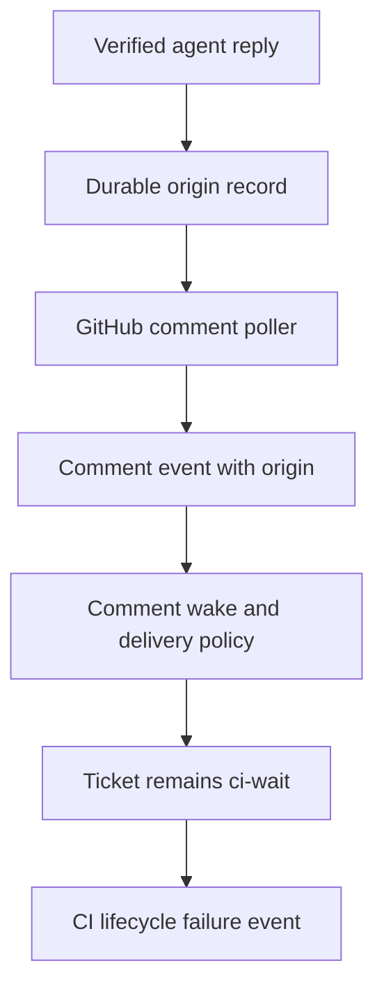

# fix: Preserve CI wait after agent replies

## Summary

Record the exact GitHub comment verified after an agent replies to a review
thread, then carry that provenance into inbound comment events. Comment wake
routes will ignore only those recorded agent replies. A fresh trusted comment
from the same shared GitHub login remains actionable, so CODEOWNERS trust and
the normal human-comment wake path stay intact.

---

## Requirements

- R1. An agent-authored PR conversation or review-resolution comment must not
  move its own `ci-wait` or `human-review` ticket to `rework`.
- R2. A new trusted human comment must still wake the ticket when the human and
  agent use the same GitHub login.
- R3. A terminal CI failure after an agent reply must be observed and emitted
  once while the ticket remains in the CI polling set.
- R4. The provenance decision must be visible in inbound events and lifecycle
  logs without relying on comment-body heuristics.
- R5. The regression must reproduce reply, CI wait, self-comment ingestion,
  then later CI failure.

---

## Scope Boundaries

- Do not configure `github.bot_account` for the shared operator/agent login or
  change `Publisher.bot_self_loop?/1`.
- Do not weaken CODEOWNERS trust, infer origin from a GitHub username, or
  suppress all comments from the shared login.
- Do not change CI terminal-event deduplication; preserve the existing
  ticket/outcome/head behavior once the issue remains eligible for polling.

### Deferred to Follow-Up Work

- Provenance for comments created outside Aiur's verified agent reply path.

---

## Context & Research

### Relevant Code and Patterns

- `src/lib/aiur/github/review_threads/reply.ex` verifies the latest GitHub
  comment and returns its identifier after a successful agent reply.
- `src/lib/aiur/codex/dynamic_tool/review_threads.ex` is the agent-tool seam
  where that verified result can be recorded before success reaches the agent.
- `src/lib/aiur/events/github_comments_poller.ex` constructs the inbound
  issue, PR-conversation, and review-thread comment events.
- `src/lib/aiur/orchestrator/comment_wake.ex` makes the trusted-comment
  transition decision; `pr_anchored.ex` and delivery policy reuse its trust
  predicates.
- `src/lib/aiur/orchestrator/ci_lifecycle.ex` polls only `ci-wait` and
  `human-review`, and already deduplicates terminal CI outcomes by head.
- `src/lib/aiur/ci_approval_store.ex` and `src/lib/aiur/json_store.ex`
  demonstrate the repository's durable JSON state pattern.

---

## Key Technical Decisions

| Decision | Rationale |
| --- | --- |
| Match origin by verified comment ID plus ticket, not actor login | The identity is stable across shared-login agent and operator comments. |
| Persist the record before reporting the reply tool as successful | A restart or poll between reply and lifecycle transition must not lose the guard. |
| Attach a positive `agent` origin marker only to exact recorded comments | Unrecorded same-login comments continue through existing CODEOWNERS trust. |
| Centralize comment actionability in `CommentWake` | All lifecycle and routing callers apply the same provenance rule and log reason. |

---

## High-Level Technical Design

*This illustrates the intended approach and is directional guidance for review,
not implementation specification. The implementing agent should treat it as
context, not code to reproduce.*

```mermaid
sequenceDiagram
  participant Agent
  participant ReplyTool
  participant OriginStore
  participant Poller
  participant Wake
  participant CI

  Agent->>ReplyTool: verified review reply
  ReplyTool->>OriginStore: persist ticket + comment identity
  Poller->>OriginStore: resolve inbound comment identity
  OriginStore-->>Poller: agent origin marker
  Poller->>Wake: trusted comment event with provenance
  Wake-->>Wake: ignore agent-origin comment; retain CI wait
  CI->>Agent: one terminal CI failure event
```

---

## Implementation Units

### U1. Persist verified agent-reply provenance

**Goal:** Durably associate a ticket with the exact comment GitHub verified as
an agent-authored reply.

**Requirements:** R1, R2, R4

**Dependencies:** None

**Files:**

- Create: `src/lib/aiur/github/agent_comment_origins.ex`
- Modify: `src/lib/aiur.ex`
- Modify: `src/lib/aiur/codex/dynamic_tool/review_threads.ex`
- Test: `src/test/aiur/github/agent_comment_origins_test.exs`
- Test: `src/test/aiur/codex/dynamic_tool/review_threads_test.exs`

**Approach:** Follow the durable JSON store convention to save only the
ticket-scoped verified comment identity and minimal origin metadata. Inject
recording from the review-reply dynamic tool so a successful verified reply is
recorded before it can be followed by the poller.

**Patterns to follow:** `Aiur.CIApprovalStore`, `Aiur.JsonStore`, and the
verified reply result in `Aiur.GitHub.ReviewThreads.Reply`.

**Test scenarios:**

- Happy path: a verified reply stores an exact comment identity for its ticket.
- Edge case: a comment with the same shared-login actor but an unrecorded
  identity is not agent-origin.
- Durability: a newly started store reads a previously written origin record.
- Integration: the dynamic tool calls its recorder only after GitHub verifies
  the reply.

**Verification:** Provenance is durable, exact-ID scoped, and does not use the
GitHub actor as a discriminator.

### U2. Annotate inbound comments and apply the central wake guard

**Goal:** Make agent origin observable on GitHub comment events and prevent it
from taking any trusted-human wake route.

**Requirements:** R1, R2, R4

**Dependencies:** U1

**Files:**

- Modify: `src/lib/aiur/events/github_comments_poller.ex`
- Modify: `src/lib/aiur/orchestrator/comment_wake.ex`
- Modify: `src/lib/aiur/orchestrator/pr_anchored.ex`
- Modify: `src/lib/aiur/orchestrator/operator_messages/delivery_policy.ex`
- Test: `src/test/aiur/events/github_comments_poller_test.exs`
- Test: `src/test/aiur/orchestrator/comment_wake_test.exs`

**Approach:** Resolve the inbound comment against durable provenance and add an
explicit origin field to the event payload. Extend the shared comment
actionability predicate so agent-origin events are skipped with a structured,
reason-bearing log while ordinary trusted comments, including those from the
same login, retain their current behavior.

**Patterns to follow:** existing comment sanitization and trust stamping,
`CommentWake.trusted_comment_event?/1`, and caller-side benign-comment checks.

**Test scenarios:**

- Happy path: the poller emits an agent-origin marker for a recorded review
  reply.
- Shared-login path: an otherwise identical unrecorded trusted comment remains
  actionable.
- Lifecycle path: an agent-origin comment does not transition a deactivated
  `ci-wait` or `human-review` ticket to `rework`.
- Observability: the skip reason is present in lifecycle logging and the
  accepted/ignored origin remains present on the event.

**Verification:** Every comment consumer uses the same origin-aware predicate,
and the shared GitHub account is not globally filtered.

### U3. Lock the reply-to-CI-failure ordering in regression coverage

**Goal:** Prove that a self-comment cannot evict the ticket before terminal CI
failure polling and delivery.

**Requirements:** R1, R3, R5

**Dependencies:** U1, U2

**Files:**

- Modify: `src/test/aiur/orchestrator_ci_lifecycle_test.exs`
- Modify: `src/test/aiur/orchestrator_deactivate_test.exs`

**Approach:** Model the production ordering with the ticket held in the CI
wait state after an agent reply, ingest the marked self-comment, then provide
a later failed terminal CI result. Assert the ticket remains pollable and the
waiting agent receives one CI-failed event despite repeated polling.

**Patterns to follow:** existing CI lifecycle terminal-failure and deactivated
comment-wake regressions.

**Test scenarios:**

- Integration: reply provenance, CI wait, self-comment ingestion, and later
  failure leave the ticket in the CI lifecycle path.
- Deduplication: a second poll of the identical failed head does not emit a
  second terminal event.
- Control: a new trusted human comment still triggers existing rework behavior.

**Verification:** Focused lifecycle tests prove one delivery for the retained
CI-wait ticket and preserve the trusted-human transition.

---

## System-Wide Impact



- Agent tooling gains a narrow provenance write at the verified GitHub response
  boundary.
- The poller preserves source and CODEOWNERS trust while adding origin context.
- Orchestration consumes that context consistently; CI lifecycle code remains
  responsible only for terminal outcome polling and one-event delivery.

---

## Risks & Mitigation

| Risk | Mitigation |
| --- | --- |
| A process restart loses provenance before polling | Persist the verified comment record before tool success. |
| A human and agent share a login | Match only the stored ticket/comment identity, never the actor. |
| A new comment route bypasses the guard | Reuse the centralized actionability predicate in every current caller. |
| CI event delivery duplicates after retries | Keep and exercise the existing head/outcome deduplication path. |

---

## Assumptions

- The verified response from the supported review-reply tool contains a stable
  GitHub comment identity that matches the poller's comment representation.
- The visible production ordering is represented by current comment wake and
  CI lifecycle test helpers; implementation may refine test placement without
  changing the acceptance scenarios.

---

## Sources & References

- Issue: #1151
- Production evidence: #1087 / PR #1145 (2026-07-14)
- Related code: `src/lib/aiur/events/github_comments_poller.ex`
- Related code: `src/lib/aiur/orchestrator/ci_lifecycle.ex`
