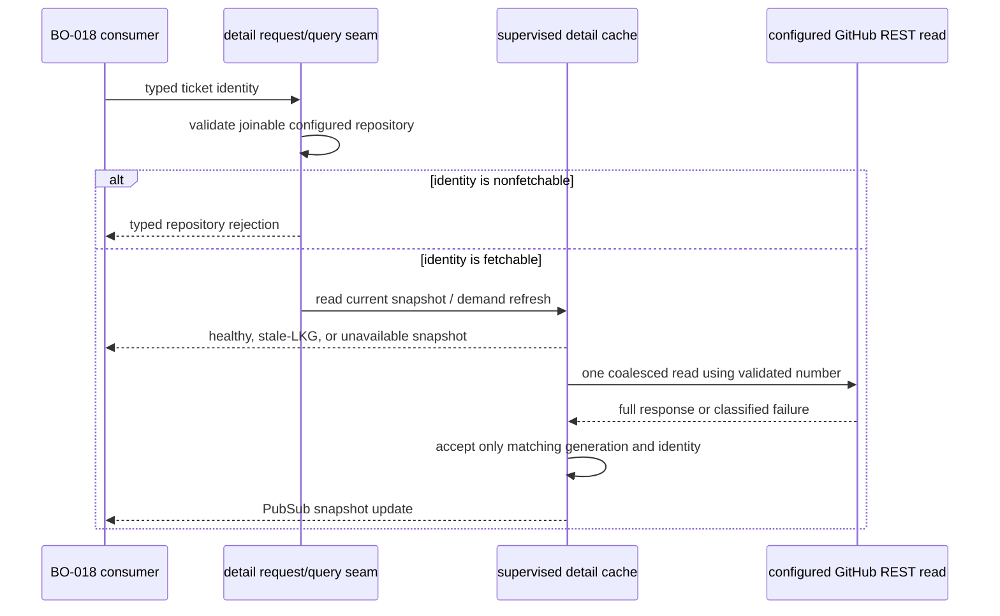

# feat: Configured-repository ticket detail

## Summary

Add one daemon-owned GitHub ticket-detail provider for a typed ticket identity. It will validate the configured repository before any cache or transport work, publish bounded immutable snapshots, and retain only a health-marked last-known-good result across refresh failures.

---

## Problem Frame

Build Order cards must remain body-free and bounded, but a selected ticket needs its current GitHub description and lifecycle facts. Fetching per browser or per graph member would multiply authenticated reads and could expose unbounded or unsafe provider content.

---

## Assumptions

*This plan was authored without synchronous user confirmation. These are implementation-level inferences that must remain reviewable during execution.*

- The cache configuration belongs under a new bounded `build_order` configuration section, so BO-018 and later Build Order providers can consume one namespaced settings surface without reusing dashboard TTL settings.
- A request returns the current snapshot immediately and starts at most one background refresh for an identity; consumers receive a PubSub update when that refresh changes state.
- Cache generations are monotonically increasing for the lifetime of the process. A restart honestly resets the in-memory cache to unavailable rather than implying continuity.

---

## Requirements

- R1. Implement the BOREQ-011 configured-repository, root-independent, bounded ticket-detail portion: one typed GitHub identity can request a sanitized on-demand detail snapshot.
- R2. Reject an absent, unjoinable, non-GitHub, or differently configured repository identity before cache lookup, write, task creation, token lookup, or provider I/O.
- R3. Preserve GitHub issue lifecycle, canonical URL, timestamps, title, and bounded sanitized description (including an explicit known-absent description) without copying graph, activity, relationship, runtime-action, or raw response fields.
- R4. Classify GitHub auth, permission, rate-limit, timeout, schema, validation, not-found, and repository/provider-identity mismatch failures in a safe typed health result; raw responses, headers, credentials, local paths, and unbounded error text never leave the adapter.
- R5. Coalesce identical concurrent demand; bound independent retention; prevent stale completion from overwriting a newer generation; retain last-known-good content across a failed refresh; expose cold/no-LKG and restart state as unavailable.
- R6. Publish a narrow query/request/subscribe seam for BO-018 without adding UI, polling, graph hydration, arbitrary repository reads, or mutation.

**Origin acceptance:** BOREQ-011 requires repository-qualified bounded on-demand ticket detail and rejection of a different repository before I/O.

---

## Scope Boundaries

- No LiveView/component/rendering work, root selection, graph membership, adjacency, edge/readiness, ticket history, progress, logs, or destination CTA implementation.
- No Linear or cross-repository support, no fallback to the checkout remote, and no cache key based on number, URL, title, topic, or workspace path.
- No GitHub mutations, browser polling, per-member hydration, durable persistence, or recovery that fabricates a post-restart snapshot.

### Deferred to Follow-Up Work

- BO-018 composes this snapshot with activity/history into the accessible ticket context.
- BO-019 owns bounded recent history; BO-003 owns graph projection/cache behavior unrelated to detail bodies.

---

## Context & Research

### Relevant Code and Patterns

- `src/lib/aiur/tracker_identity.ex` establishes BO-004’s canonical join key: GitHub kind, configured owner/repository, provider node ID, and validated display number.
- `src/lib/aiur/github/issues.ex` supplies the authenticated REST issue read and `src/lib/aiur/github/errors.ex` supplies structured transport/status classification.
- `src/lib/aiur/github/config.ex` exposes `configured_repo/0`, which must be used instead of the legacy checkout-derived fallback behind `repo/0`.
- `src/lib/aiur/build_order/bounded.ex` already contains bounded GitHub URL/repository helpers; detail needs a stricter configured owner/repository prefix validation.
- `src/lib/aiur/secret_redactor.ex`, `src/lib/aiur/agent_pubsub.ex`, `src/lib/aiur.ex`, and `src/lib/aiur_web/control_center_cache.ex` provide redaction, PubSub, supervision, and bounded-cache conventions, but the dashboard cache lacks LKG/generation semantics and must not be reused.
- `src/test/support/test_support.exs` provides isolated configuration and deterministic test workflows; `src/test/aiur/application_test.exs` verifies supervision ordering.

### Institutional Learnings

- The approved Build Order authority explicitly records that no reusable LKG/health cache exists; the provider/cache contract must be a fresh implementation with only OTP, `Aiur.TaskSupervisor`, and Phoenix PubSub reused.
- The same approved authority identifies the application child list as a serialized seam with BO-003, BO-005, and BO-019, so this plan limits that edit to a single named child.

### External References

- GitHub REST issue reads are already encapsulated by the authenticated repository transport; no new external API or unauthenticated client is introduced.

---

## Key Technical Decisions

- **Identity is the cache key:** Use the complete joinable `TrackerIdentity` tuple `{kind, owner, repository, provider_id}`. The number is a request locator only and the returned node ID must match before a snapshot is accepted. This prevents same-number collisions and delayed cross-identity writes.
- **Validate before side effects:** The public request and subscribe entry points first compare the identity’s repository to `GitHub.Config.configured_repo/0`. Rejection returns a typed `:nonfetchable_repository` result before lookup, task creation, token lookup, or request function invocation.
- **Separate pure adapter from supervised state:** A pure detail-normalization module bounds/redacts provider fields and normalizes safe errors. The GenServer alone owns freshness, demand coalescing, task correlation, LRU retention, health, generation, and PubSub notification.
- **Preserve complete LKG only:** A successful GitHub *issue* response becomes a complete immutable snapshot; a pull-request-shaped response through the issue endpoint is a schema failure. A refresh failure changes health and attempt metadata only; it never overwrites prior content with partial data or a provider error. Without LKG, the snapshot is explicitly unavailable.
- **Bound every attacker-controlled surface:** Enforce conservative hard maxima on title, description, URL, labels/facts, and evidence. Strip invalid/control content and redact known credential tokens before snapshot construction; failure records contain stable codes and safe structured rate/timeout information only.
- **Asynchronous coalesced demand:** The first stale/cold request records an in-flight generation and delegates one task. Same-key demand observes the current snapshot and joins that work; distinct keys remain independent. Completion applies only when its identity and generation still match the active request.

---

## Open Questions

### Resolved During Planning

- **Should detail reuse `ControlCenterCache`?** No. It is a synchronous TTL map without health, LKG, in-flight coalescing, or generation protection.
- **Can a configured-repository detail read use the checkout fallback?** No. The provider’s gate is `configured_repo/0`; the legacy `repo/0` fallback remains outside this contract.
- **What restarts retain?** Nothing in memory. The new cache reports unavailable until a fresh demand succeeds.

### Deferred to Implementation

- Exact field/module names and hard limits will be finalized against the landed BO-003/BO-004 integration surface, while preserving the contract above.
- If all retained entries are in flight at capacity, the concrete bounded-admission result will be chosen during implementation; it must reject/defer the additional demand rather than evicting an in-flight generation or exceeding capacity.

---

## High-Level Technical Design

> *This illustrates the intended approach and is directional guidance for review, not implementation specification. The implementing agent should treat it as context, not code to reproduce.*

---

## Implementation Units

### U1. Detail contract and strict GitHub adapter

**Goal:** Define the immutable request/snapshot/health contract and transform a configured-repository GitHub issue response into bounded, sanitized detail without transport side effects for invalid requests.

**Requirements:** R1, R2, R3, R4

**Dependencies:** BO-004 identity foundation

**Files:**
- Create: `src/lib/aiur/build_order/ticket_detail.ex`
- Modify: `src/lib/aiur/build_order/bounded.ex`
- Modify: `src/lib/aiur/github/issues.ex`
- Test: `src/test/aiur/build_order/ticket_detail_test.exs`
- Test: `src/test/aiur/github/issues_test.exs`

**Approach:**
- Accept only a joinable GitHub identity whose exact owner/repository matches the explicitly configured GitHub repository, then use its validated display number as a locator for the existing authenticated read.
- Make the raw read’s repository selection explicit so no configured-detail path can silently use `GitHub.Config.repo/0`’s checkout fallback.
- Require the response node ID, number, optional response repository metadata, issue-kind marker, lifecycle, canonical URL, and timestamps to agree with the requested identity before creating a snapshot.
- Normalize only the approved detail facts. Preserve a missing GitHub body as an explicit known-absent description; enforce UTF-8/control-character, size, and secret-redaction policies before nonempty data enters a snapshot; convert malformed/oversized content into a preserving typed failure rather than a partial success.
- Convert existing GitHub errors into a small detail error vocabulary, mapping HTTP 404 to not-found and refusing raw status body/header text.

**Patterns to follow:**
- `src/lib/aiur/tracker_identity.ex`
- `src/lib/aiur/github/issues.ex`
- `src/lib/aiur/github/errors.ex`
- `src/lib/aiur/build_order/bounded.ex`
- `src/lib/aiur/secret_redactor.ex`

**Test scenarios:**
- Happy path: an exact configured identity and complete response yield a bounded immutable snapshot with matching provider ID, locator, lifecycle, safe canonical URL, and observation time.
- Edge case: two repositories using the same issue number produce distinct request keys; the nonconfigured identity cannot read or share the configured entry.
- Error path: absent/unjoinable/wrong-kind/wrong-repository identities return a typed nonfetchable result and the injected request function receives no call.
- Error path: missing/mismatched response node ID, response repository, number, URL, timestamps, or title—and a pull-request-shaped or malformed nonempty body—returns a typed validation/schema/mismatch failure without a partial snapshot.
- Edge case: an ordinary GitHub issue with no body remains a complete snapshot with an explicit known-absent description rather than a fabricated empty/error state.
- Error path: auth, permission, rate-limit, timeout, transport, not-found, and malformed response cases preserve only the approved structured error fields.
- Security: malformed/oversized title/body/URL/error content, credential-like strings, private-header-like input, and local paths never appear in snapshots or errors.

**Verification:**
- Every accepted detail response is complete, identity-bound, bounded, and sanitized; every mismatch is rejected before an unsafe value becomes observable.

### U2. Supervised on-demand LKG cache and subscription seam

**Goal:** Provide one process-owned cache that coalesces identical demand, publishes health-qualified snapshots, retains LKG safely, and prevents delayed result corruption.

**Requirements:** R1, R2, R4, R5, R6

**Dependencies:** U1

**Files:**
- Create: `src/lib/aiur/build_order/ticket_detail_cache.ex`
- Modify: `src/lib/aiur/build_order/ticket_detail.ex`
- Test: `src/test/aiur/build_order/ticket_detail_cache_test.exs`

**Approach:**
- Expose request/current/subscribe APIs that validate the identity before any state operation and publish only immutable contract snapshots on an identity-derived Phoenix PubSub topic.
- Track each entry’s current snapshot, LKG, last access, refresh attempt, safe failure state, and in-flight `{identity, generation, task_ref}` correlation; use one process-local monotonic generation stream.
- Treat freshness, capacity, and retention as independent bounded policies. Evict least-recently-used completed entries only; never discard a live generation to make room or silently let distinct demand grow unbounded.
- Build refreshes under `Aiur.TaskSupervisor` using injected reader and clock seams. A matching success atomically replaces the snapshot and LKG; a matching failure preserves LKG as stale or exposes unavailable when none exists. Ignore stale/delayed task completions.
- Start empty/unavailable after process restart and broadcast only state transitions that a subscriber can safely render.

**Patterns to follow:**
- `src/lib/aiur.ex`
- `src/lib/aiur/agent_pubsub.ex`
- `src/lib/aiur_web/control_center_cache.ex`
- `src/lib/aiur/build_order/lifecycle.ex`

**Test scenarios:**
- Happy path: cold demand produces an unavailable/loading state, one successful completion produces generation one, and a fresh repeated demand reads without provider work.
- Integration: concurrent identical demand from multiple callers invokes one deterministic reader and each subscriber receives the same published generation.
- Edge case: distinct identities, including equal numbers from different repositories, never share tasks, state, snapshots, generations, or PubSub topics.
- Edge case: capacity/retention evicts the least-recently-used completed entry while preserving the configured hard bound and no graph-wide hydration occurs.
- Error path: failed stale refresh preserves prior complete content with stale health; a cold failure, not-found, timeout, auth, permission, rate-limit, validation, or schema failure remains unavailable with a safe typed reason.
- Error path: deterministic delayed success/failure after a newer generation or eviction cannot overwrite current state; task down/timeout handling leaves no false healthy snapshot.
- Restart: a stopped/restarted cache exposes no fabricated LKG, then recovers only after a new successful request.

**Verification:**
- Identical demand coalesces, LKG is never replaced by an incomplete value, and every accepted completion matches its current identity/generation.

### U3. Bounded runtime configuration and supervision registration

**Goal:** Make cache freshness and retention configurable within safe maximums and start the provider in every daemon shape without altering dashboard/UI ownership.

**Requirements:** R5, R6

**Dependencies:** U2

**Files:**
- Create: `src/lib/aiur/config/schema/build_order.ex`
- Modify: `src/lib/aiur/config/schema.ex`
- Modify: `src/lib/aiur.ex`
- Modify: `src/test/support/test_support.exs`
- Test: `src/test/aiur/config/schema_test.exs`
- Test: `src/test/aiur/application_test.exs`

**Approach:**
- Add a namespaced Build Order detail-cache settings contract with conservative defaults for freshness, retention, and maximum sanitized description size, plus positive validation and hard upper bounds that keep untrusted provider content and memory usage bounded.
- Pass the resolved settings only at cache startup. Keep injected reader/clock/task seams as test-only startup options rather than user configuration.
- Register exactly one detail-cache child after its required PubSub/Task dependencies and before dashboard consumers in the application tree. Do not make it conditional on the dashboard, so headless and future BO-018 consumers observe the same provider contract.

**Patterns to follow:**
- `src/lib/aiur/config/schema/polling.ex`
- `src/lib/aiur/config/schema.ex`
- `src/lib/aiur.ex`
- `src/test/aiur/application_test.exs`

**Test scenarios:**
- Happy path: omitted Build Order settings resolve safe defaults and cache startup receives them in both foreground and headless shapes.
- Edge case: explicit valid freshness/retention settings reach the provider without changing unrelated tracker/dashboard configuration.
- Error path: zero, negative, malformed, or over-cap configuration fails through the existing dotted-path validation surface.
- Integration: application child ordering guarantees PubSub and `Aiur.TaskSupervisor` are available before the detail cache in all run shapes.

**Verification:**
- Runtime settings are valid, bounded, and available to one supervised provider without a UI-specific startup dependency.

### U4. Contract hardening and focused regression coverage

**Goal:** Close the privacy, concurrency, and negative-space cases across the adapter/cache boundary before the provider becomes a BO-018 dependency.

**Requirements:** R1, R2, R3, R4, R5, R6

**Dependencies:** U1, U2, U3

**Files:**
- Modify: `src/test/aiur/build_order/ticket_detail_test.exs`
- Modify: `src/test/aiur/build_order/ticket_detail_cache_test.exs`
- Modify: `src/test/aiur/build_order/catalog_test.exs`
- Modify: `src/test/aiur/application_test.exs`

**Approach:**
- Use deterministic reader barriers, injected clocks, and task messages instead of sleep-based race tests.
- Assert the negative boundary directly: invalid repository identities do not invoke the mock transport or touch cache state, and ordinary graph/catalog construction does not instantiate detail demand.
- Exercise sanitized output rather than merely verifying adapter success, including snapshot/error serialization and PubSub payloads.

**Patterns to follow:**
- `src/test/aiur/tracker_identity_test.exs`
- `src/test/aiur/github/issues_test.exs`
- `src/test/aiur/build_order/catalog_test.exs`
- `src/test/support/test_support.exs`

**Test scenarios:**
- Integration: a BO-004 identity is the only accepted key, while a same-number other-repository identity proves reject-before-I/O and no cache collision.
- Integration: cache query/subscription consumers can observe healthy, stale-LKG, unavailable, recovery, eviction, and restart states without receiving raw provider data.
- Security: inspect all public snapshot/error/PubSub terms for credentials, authorization text, private headers, raw response maps, paths, and disallowed relationship/UI/action fields.
- Regression: catalog/graph constructors remain body-free and do not trigger provider calls or background demand.

**Verification:**
- The focused suite proves every accepted state transition and the explicit negative contract boundaries described in this plan.

---

## System-Wide Impact

- **Interaction graph:** BO-004 supplies the identity; this provider owns only configured GitHub detail and Phoenix PubSub updates; BO-018 later consumes snapshots without provider access.
- **Error propagation:** Adapter errors become safe typed cache health. The cache never raises raw transport/provider terms into consumers and failed refreshes preserve existing LKG.
- **State lifecycle risks:** In-flight task references and generations fence stale results; LRU admission protects retention independently from browser count; restart clears memory to unavailable.
- **API surface parity:** The request/query/subscribe seam is daemon-local and repository-qualified. It does not create HTTP, LiveView, mutation, or arbitrary-URL APIs.
- **Integration coverage:** Deterministic concurrent demand, delayed completion, eviction, recovery, and restart tests cover behavior that pure normalizer tests cannot.
- **Unchanged invariants:** Graph cards remain body-free, GitHub stays the ticket-fact authority, `StatusReport` retains runtime/activity ownership, and no detail request can infer a repository from a number or local checkout.

---

## Risks & Dependencies

| Risk | Mitigation |
|---|---|
| A bare issue number selects the wrong repository | Require BO-004’s joinable identity and compare the exact configured repository before cache/transport work. |
| GitHub response/URL/body leaks unsafe or unbounded content | Validate response identity and configured URL prefix; cap, sanitize, redact, and use safe typed errors only. |
| Concurrent callers exhaust GitHub quota | One supervised cache coalesces same-key demand, uses freshness, and caps distinct retained/in-flight admission. |
| Failed or delayed refresh destroys a usable view | Only matching generation completions apply; failures preserve complete LKG and cold state stays explicitly unavailable. |
| Shared application child-list conflict | Keep a minimal, documented insertion and reconcile the integration branch immediately before the final push. |
| BO-018 assumes data survives restart | Document and test in-memory reset to unavailable; a consumer must wait for a new successful demand. |

---

## Documentation / Operational Notes

- The provider has no independent manual-CLI evidence requirement. It is verified through focused deterministic module tests; BO-015 owns end-to-end feature proof.
- Document the in-memory restart contract in the public module documentation and snapshot health type so consumers do not treat unavailable as empty detail.

---

## Sources & References

- **Approved planning authority:** `4d8de9508206e08e314f2730cd916501a3b4cafd`
- **Origin requirement:** `docs/brainstorms/2026-07-12-build-order-requirements.md` (BOREQ-011 at the approved planning authority)
- **Ticket contract:** `docs/build-order/tickets/BO-016-provide-ticket-detail.md` (approved planning authority)
- **Technical decisions:** `docs/build-order/05-technical-decisions.md` (DEC-001 and DEC-005 at the approved planning authority)
- Related code: `src/lib/aiur/tracker_identity.ex`, `src/lib/aiur/github/issues.ex`, `src/lib/aiur/github/errors.ex`, `src/lib/aiur/build_order/bounded.ex`, `src/lib/aiur.ex`
- Related issue: #1103
