# feat: Recover canonical current-run membership

## Summary

Add a supervised, headless-safe membership projection that retains every BO-017-qualified ticket observed in one `Aiur.Boot.run_id/0` generation. A bounded append journal and checksummed checkpoint make a projection-only restart exact while keeping lifecycle ownership in the tracker and `Orchestrator.StatusReport`.

---

## Problem Frame

`StatusReport` represents only the present orchestrator view: retrying, replaced, completed, and temporarily absent tickets can disappear even though they belong in the current-run denominator. DREQ-002 requires a recoverable membership authority without turning agent events or the dashboard into a second lifecycle reducer.

---

## Assumptions

*This plan was authored without synchronous user confirmation. The items below are agent inferences that should be reviewed before implementation proceeds.*

- The projection will treat the BO-017 identity already present in `StatusReport` rows as the only eligible key; it will not synthesize identity from an identifier, topic, workspace, or branch.
- A `StatusReport` snapshot is sufficient for reconciliation when paired with durable prior membership: an absent current row does not remove a retained member.
- The recovery files will use a dedicated membership state path next to the existing daemon-private stores, not the decision-named path as a semantic home.

---

## Requirements

- DREQ-002: journal every qualified ticket observed in the active run, retain terminal membership through that run, and reconstruct the same set after only the projection restarts.
- Preserve `run_id` generation isolation, terminal retention, idempotence, persist-before-membership-publish ordering, bounded content-free records, and owner-only path containment.
- Expose bounded snapshot, lookup, generation, health, freshness, and PubSub APIs; distinguish healthy empty, stale last-known-good, degraded/corrupt, and unavailable states.

---

## Scope Boundaries

- `StatusReport` and tracker records remain lifecycle authority; the projection only records qualifying observations and retains members.
- Do not build `UnitsRow` values, filters, counts, dashboard rendering, activity joins, Decision counts, progress, model/effort facts, URL state, or cross-run history.
- Do not persist titles, descriptions, issue bodies, prompts, workspaces, logs, provider payloads, credentials, or account facts.

### Deferred to Follow-Up Work

- DASH-016 owns joining this membership set to activity and defining Units policy.
- DASH-014 and DASH-003 consume the downstream DASH-016 contract rather than this store directly for presentation.

---

## Context & Research

### Relevant Code and Patterns

- `src/lib/aiur/ticket_observation.ex` and `src/lib/aiur/tracker_identity.ex` provide BO-017's trusted, repository-qualified identity boundary.
- `src/lib/aiur/orchestrator/status_report.ex` produces typed running, retrying, and idle lifecycle observations; `Aiur.Orchestrator.DispatchPolicy` is the terminal-state authority.
- `src/lib/aiur/decision_log.ex`, `src/lib/aiur/fs.ex`, and `src/lib/aiur/json_store.ex` establish owner-only append, torn-tail replay, fsync, and atomic-rename behavior.
- `src/lib/aiur/recent_merge_store.ex` is the closest single-writer health, injected-persistence, last-known-good, and observability notification precedent.
- `src/lib/aiur.ex` contains the shared supervision list; the membership child must start before the Orchestrator so headless and interactive runs have the same authority.

### Institutional Learnings

- The approved Build Order pointer for DASH-002 explicitly identifies this projection as greenfield and warns that the existing Decision state path needs a sibling membership path helper.
- Existing PubSub is refresh-only. Consumers must reload the authoritative snapshot after a notification rather than treating a broadcast as a durable event stream.

### External References

- No external research is needed: the repository already contains direct, recently maintained persistence and supervision patterns for this design.

---

## Key Technical Decisions

- **Use `run_id` plus the complete `TrackerIdentity` as the membership key:** opaque provider identity and repository qualification prevent bare-number collisions.
- **Persist an append record before advancing or broadcasting membership generation:** accepted observations remain replayable even if the process dies immediately after the write.
- **Use a validated checkpoint as an acceleration and last-known-good boundary, not as a replacement for the journal:** replay validates schema, run generation, and checksum, then applies idempotent journal records.
- **Reconciliation is additive for the active generation:** current snapshots add or advance known members but never use absence as evidence to delete historical membership.
- **Use a dedicated `CurrentRunMembershipPubSub` topic and observability refresh:** typed membership facts are published only after durable acceptance; dashboard-shaped rows and filters stay outside the store.

---

## Open Questions

### Resolved During Planning

- **Which identity field is safe to persist?** The BO-017 `TrackerIdentity` is the contract. It is persisted only after `joinable?/1` validation; display identifiers remain locators, never keys.
- **Which lifecycle source should drive reconciliation?** `StatusReport` snapshot rows, adapted into a narrow membership observation, because they already carry running, retrying, idle, pause, wait, and tracker state.
- **Which durability primitives apply?** Reuse `DecisionLog` append/replay and `Fs.atomic_write` with injected filesystem hooks, following `RecentMergeStore` health behavior.

### Deferred to Implementation

- The exact checkpoint cadence and compacted-journal bound should be selected after the deterministic fault tests establish the smallest robust protocol.
- The compatibility adapter should normalize only lifecycle vocabulary proven by the current `StatusReport` shapes; no attempt should be made to infer richer lifecycle semantics from agent-event payloads.

---

## High-Level Technical Design

> *This illustrates the intended approach and is directional guidance for review, not implementation specification. The implementing agent should treat it as context, not code to reproduce.*

```mermaid
stateDiagram-v2
  [*] --> Recovering
  Recovering --> Healthy: checkpoint + journal validate\nthen current snapshot reconciles
  Recovering --> Degraded: last-known-good preserved\ncorrupt tail/checkpoint quarantined
  Recovering --> Unavailable: no trustworthy state
  Healthy --> Healthy: duplicate or newer\nqualified observation persists
  Healthy --> Degraded: append/checkpoint failure
  Degraded --> Healthy: later durable reconciliation
  Healthy --> [*]: daemon ends; next Boot run uses a new generation
```

---

## Implementation Units

### U1. Define bounded membership records and pure projection

**Goal:** Establish the public typed member, lifecycle-fact, health, and snapshot contract together with deterministic idempotent transition/replay rules.

**Requirements:** DREQ-002; typed-identity collision resistance; duplicate/out-of-order and terminal-retention invariants.

**Dependencies:** BO-017 identity propagation already merged (`d3d6999a`).

**Files:**
- Create: `src/lib/aiur/current_run_membership.ex`
- Create: `src/lib/aiur/current_run_membership_event.ex`
- Create: `src/lib/aiur/current_run_membership_projection.ex`
- Test: `src/test/aiur/current_run_membership_projection_test.exs`

**Approach:**
- Model a member by validated `TrackerIdentity`, first/last observation timestamps, last non-regressing lifecycle fact, and terminal retention state.
- Define a versioned, content-free durable event with run generation, identity, lifecycle provenance, bounded timestamp/sequence data, and an integrity hash.
- Make projection transitions deterministic: duplicates are no-ops, an older observation cannot regress a terminal member, and two repositories sharing an issue number remain distinct.

**Execution note:** Implement the pure transition and replay cases test-first before adding persistence or supervision.

**Patterns to follow:**
- `src/lib/aiur/ticket_observation.ex`
- `src/lib/aiur/tracker_identity.ex`
- `src/lib/aiur/decision_projection.ex`

**Test scenarios:**
- Happy path: queued, allocated, running, paused, waiting, retrying, replaced, completed, and cancelled qualified observations produce one member per typed identity.
- Edge case: two joinable identities with the same display number but different repositories remain two members.
- Edge case: duplicate and out-of-order observations do not duplicate a member or regress terminal state.
- Error path: unjoinable, legacy, malformed, or content-bearing records are rejected before projection.
- Integration: replaying the same accepted fact sequence recreates the identical member set and generation.

**Verification:** The pure projection is deterministic, bounded, identity-safe, and can represent an empty healthy generation without conflating it with unavailable state.

---

### U2. Add owner-only journal, checkpoint, and recovery store

**Goal:** Persist accepted membership transitions and recover the exact active generation after a store-only crash.

**Requirements:** DREQ-002; persist-before-publish; schema/checksum/generation validation; last-known-good, degraded, and unavailable distinctions.

**Dependencies:** U1.

**Files:**
- Modify: `src/lib/aiur/config/paths.ex`
- Create: `src/lib/aiur/current_run_membership_store.ex`
- Create: `src/lib/aiur/current_run_membership_pub_sub.ex`
- Test: `src/test/aiur/current_run_membership_store_test.exs`

**Approach:**
- Resolve a dedicated, owner-only current-run membership state directory through a sibling Config Paths helper and include the active `Boot.run_id/0` in every durable generation.
- Append and fsync an accepted fact before updating the in-memory projection or publishing its generation; then atomically publish a checksummed candidate checkpoint under the same serialized owner. A checkpoint failure after a durable append exposes degraded health and retains the prior last-known-good checkpoint; it never publishes the candidate as healthy, and same-run replay must recover the journaled fact.
- On restart, validate checkpoint schema/hash/run, replay the journal through the event validator, quarantine malformed tails/checkpoints, retain validated state where possible, and expose explicit degraded or unavailable health.
- Only clean obsolete generations after the active generation is durable and cannot replay them; never read a prior run into the new generation.

**Patterns to follow:**
- `src/lib/aiur/decision_log.ex`
- `src/lib/aiur/fs.ex`
- `src/lib/aiur/json_store.ex`
- `src/lib/aiur/recent_merge_store.ex`

**Test scenarios:**
- Happy path: an accepted fact updates lookup, bounded snapshot, generation, freshness, and an owner-only journal/checkpoint.
- Integration: stopping and restarting only the store returns queued and terminal members exactly for the same run ID.
- Error path: injected append, fsync, checkpoint write, rename, and cleanup failures leave prior durable state readable and health truthful.
- Integration: a checkpoint failure immediately after a successful append does not publish a healthy candidate and a store-only restart replays the journaled member exactly once.
- Edge case: torn journal tail is truncated safely; a corrupt complete line or checksum never reports a healthy truncated set.
- Edge case: malformed checkpoint is quarantined and recovery uses a valid journal prefix when possible; otherwise health is unavailable.
- Security: symlink/path-containment rejection and serialized files contain identity/lifecycle provenance only, not titles, bodies, workspaces, logs, provider data, credentials, or account facts.

**Verification:** A projection-only restart is exact for the same run, a daemon restart creates a new isolated generation, and every public health state explains whether data is healthy, stale, degraded, or unavailable.

---

### U3. Reconcile lifecycle snapshots and supervise the projection

**Goal:** Feed the store with BO-017-qualified `StatusReport` lifecycle observations in both headless and interactive runs without making it lifecycle authority.

**Requirements:** DREQ-002; queue/allocation/retry/pause/wait/replacement/terminal coverage; bounded reconciliation and typed PubSub facts.

**Dependencies:** U1, U2.

**Files:**
- Create: `src/lib/aiur/current_run_membership_status_adapter.ex`
- Modify: `src/lib/aiur/orchestrator/status_report.ex`
- Modify: `src/lib/aiur.ex`
- Modify: `src/test/aiur/application_test.exs`
- Test: `src/test/aiur/current_run_membership_status_adapter_test.exs`
- Test: `src/test/aiur/current_run_membership_integration_test.exs`

**Approach:**
- Adapt only the documented `StatusReport` running, retrying, and idle shapes into a narrow typed observation; terminal classification delegates to the current DispatchPolicy/tracker-state authority.
- Reconcile the current snapshot at startup and on lifecycle refreshes. `StatusReport` hands the adapter a nonblocking compatibility observation after it has formed its own lifecycle state; the membership owner retries an initial snapshot after a store-only restart. Reconciliation adds or advances qualified members but does not remove prior members when a source row is temporarily absent.
- Start the store before the Orchestrator in `Aiur.Application.child_specs/1`, subscribe through a small PubSub wrapper, and publish only membership generation/health/lifecycle facts after durable acceptance.
- Inject snapshot, clock, filesystem, and PubSub hooks so integration and fault tests do not need a real dashboard or external tracker.

**Patterns to follow:**
- `src/lib/aiur/orchestrator/status_report.ex`
- `src/lib/aiur/agent_pubsub.ex`
- `src/lib/aiur/recent_merge_store.ex`
- `src/test/aiur/application_test.exs`

**Test scenarios:**
- Happy path: one current snapshot covers queue, allocation, running, pause, wait, retry, replacement, completion, and cancellation observations.
- Integration: a restart of only the membership child recovers durable members, then reconciles a current snapshot without losing a temporarily absent terminal member.
- Edge case: a new boot run with the same state directory cannot expose members from the earlier generation.
- Error path: unavailable/timeout snapshot input marks freshness or health without clearing validated membership.
- Integration: a typed membership PubSub notification is emitted after persistence and consumers can reload the matching snapshot generation.

**Verification:** `child_specs/1` includes the membership owner in both run shapes before `Aiur.Orchestrator`, and reconciliation remains a compatibility consumer of StatusReport rather than a reducer replacement.

---

### U4. Harden recovery and public-contract tests

**Goal:** Prove the crash, ordering, security, and consumer-facing API guarantees as one focused regression suite.

**Requirements:** DREQ-002 acceptance and agent gate fault/security coverage.

**Dependencies:** U1, U2, U3.

**Files:**
- Modify: `src/test/aiur/current_run_membership_projection_test.exs`
- Modify: `src/test/aiur/current_run_membership_store_test.exs`
- Modify: `src/test/aiur/current_run_membership_integration_test.exs`

**Approach:**
- Drive deterministic fake snapshot/clock/filesystem hooks through append/checkpoint races, corruption, recovery, and publication ordering.
- Assert API bounds and absence of forbidden content in every durable record and public snapshot.

**Patterns to follow:**
- `src/test/aiur/recent_merge_store_test.exs`
- `src/test/aiur/decision_log_test.exs`
- `src/test/aiur/application_test.exs`

**Test scenarios:**
- Integration: process kill/restart between append, checkpoint, and publish yields either the prior validated generation or the exact replayed generation, never an unexplained healthy truncation.
- Error path: corrupt checkpoint plus corrupt journal exposes unavailable/degraded state and a stable human-readable reason.
- Security: grep-like assertions over encoded records and snapshots reject prohibited fields and credentials-shaped sentinel data.
- API: bounded lookup/snapshot, generation, health, freshness, and PubSub contracts remain deterministic across empty, stale, degraded, and unavailable states.

**Verification:** The focused suite covers all listed agent-gate scenarios and the scoped pre-PR gate can exercise it without starting the full application.

---

## System-Wide Impact

- **Interaction graph:** Tracker/StatusReport remain sources; the membership store is an additive consumer; DASH-016 is the first row/filter consumer.
- **Error propagation:** Journal/checkpoint or source-read failures degrade the membership store explicitly and do not mutate Orchestrator lifecycle state.
- **State lifecycle risks:** The main hazards are append/checkpoint races, malformed recovery artifacts, process-only restarts, and new-run leakage; serialization, checksums, replay validation, and run-qualified paths address them.
- **API surface parity:** Snapshot/lookup and PubSub must work in headless runs because dashboard consumers are optional.
- **Unchanged invariants:** Agent event topics stay routing-only, StatusReport remains lifecycle authority, and no dashboard or activity data joins enter this ticket.

---

## Risk Analysis & Mitigation

| Risk | Likelihood | Impact | Mitigation |
|------|------------|--------|------------|
| Current source temporarily omits a member | Medium | High | Reconciliation is additive; only durable run end discards the generation. |
| Corrupt recovery file appears empty | Medium | High | Validate schema/hash/run, quarantine bad artifacts, retain validated prefix where possible, and expose degraded/unavailable health. |
| Persistence blocks or fails during lifecycle activity | Medium | High | Single writer, injected failure tests, persist-before-membership-publish ordering, and no mutation of source lifecycle state. |
| Cross-run member leakage | Low | High | Run-qualified records/checkpoints, startup validation, and only-after-establishment obsolete-generation cleanup. |
| Shared supervision-tree merge conflict | High | Medium | Limit the shared edit to one child insertion plus a focused ordering assertion; rebase on the configured integration target before merge. |

---

## Documentation / Operational Notes

- Document recovery artifact schema/version, rollback behavior, and the stable human-readable health reasons in module documentation.
- Operators can inspect the membership snapshot health and generation; no separate visual proof is required for this ticket.
- Manual dashboard proof remains owned by DASH-003 after DASH-016; this ticket verifies a synthetic same-run projection restart through focused tests only.

---

## Sources & References

- **Origin requirement:** `docs/brainstorms/2026-07-12-build-order-requirements.md` at approved planning commit `4d8de9508206e08e314f2730cd916501a3b4cafd` (DREQ-002).
- **Approved companion contract:** `docs/build-order/companion-tickets/DASH-002-current-run-membership.md` at the same commit.
- **Identity prerequisite:** BO-017 integration commit `d3d6999a` (`src/lib/aiur/ticket_observation.ex`, `src/lib/aiur/tracker_identity.ex`).
- **Persistence precedent:** `src/lib/aiur/decision_log.ex`, `src/lib/aiur/recent_merge_store.ex`.
- **Lifecycle source:** `src/lib/aiur/orchestrator/status_report.ex`.
