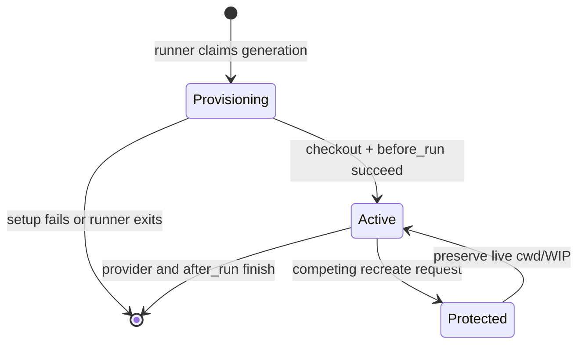

# fix: Protect workspace provisioning ownership

## Summary

Make workspace preparation recognize a real checkout rather than any directory, and give each running issue generation exclusive ownership until its provider session ends. Incomplete log-only paths will be rebuilt through the configured hook while retaining their transcripts; a second setup or refresh cannot remove a live workspace.

---

## Problem Frame

Production reproductions on #1103, #1108, and #1162 showed that the early event logger can create `logs/` before checkout provisioning. `Aiur.Workspace.Provisioner.ensure_workspace/5` accepts that directory as complete, skips `after_create`, and lets a later `before_run` repair delete the same path while a provider may already hold it as its cwd.

---

## Assumptions

*This plan was authored without synchronous user confirmation. The items below are agent inferences that fill gaps in the input — un-validated bets that should be reviewed before implementation proceeds.*

- A process-scoped ownership lease in the central Aiur BEAM is the correct boundary because all local and SSH worker setup is initiated by its agent-runner task.
- An incomplete local directory should be cold-hook provisioned rather than treated as safely materializable, so the configured hook can preserve its logs before cloning.

---

## Requirements

- R1. Treat a workspace as reusable only when it is a usable checkout rooted at the expected workspace path; logs-only and other non-git directories must run initial provisioning.
- R2. Preserve `logs/` across incomplete-workspace recovery and retain it if clone or hook materialization fails.
- R3. Hold one ownership generation for an issue from provisioning through provider shutdown; overlapping setup attempts must not run hooks or start another provider against that workspace.
- R4. Preserve #577 stale-`todo` recovery and #653 in-flight dirty-WIP behavior, while refusing destructive recreation once a generation is active.
- R5. Record correlated provisioning lifecycle start/end evidence with owner and generation identifiers.
- R6. Cover log-only repair, materialization/cold-clone fallback, ownership contention, active-generation refresh refusal, and existing lifecycle regressions.

---

## Scope Boundaries

- No workspace-layout or workflow-schema redesign.
- No change to terminal-state workspace cleanup policy.
- No remote-worker filesystem protocol redesign beyond retaining its existing behavior.

### Deferred to Follow-Up Work

- Cross-node ownership coordination if worker dispatch is later moved out of the central BEAM.

---

## Context & Research

### Relevant Code and Patterns

- `src/lib/aiur/workspace/provisioner.ex` currently equates `File.dir?/1` with a reusable workspace and owns prewarm fallback.
- `src/lib/aiur/workspace/refresh.ex` owns the #577/#653 destructive-recreate decision.
- `src/lib/aiur/agent_runner.ex` already defines the full setup-to-session lifetime and emits `workspace_setup` telemetry.
- `.aiur/hooks` contains the existing logs-preserving `before_run` reconstruction pattern.
- `src/lib/aiur.ex` supervises named registries before `Aiur.TaskSupervisor`.

### Institutional Learnings

- No `docs/solutions/` material applies in this checkout.

---

## Key Technical Decisions

- **Checkout validity rather than directory existence:** Reuse only a workspace whose Git top level resolves to the workspace itself, preserving valid linked worktrees.
- **Runner-held generation lease:** Register ownership before provisioning, promote it only after `before_run` succeeds, and release it after the session and `after_run` hook finish. A crashed runner releases its registry ownership automatically.
- **Recovery is phase-aware:** Keep the existing stale `todo` recreate path during provisioning, but reject it when an active generation owns the same issue.
- **Lifecycle evidence is data-only:** Extend the existing run-telemetry vocabulary with safe owner and generation IDs; never emit hook command text or output.

---

## High-Level Technical Design

> *This illustrates the intended approach and is directional guidance for review, not implementation specification. The implementing agent should treat it as context, not code to reproduce.*

---

## Implementation Units

### U1. Classify and recover incomplete workspaces

**Goal:** Route logs-only and non-git workspace directories through first-time provisioning without losing transcripts.

**Requirements:** R1, R2, R6

**Dependencies:** None

**Files:**
- Modify: `src/lib/aiur/workspace/provisioner.ex`
- Modify: `src/lib/aiur/workspace/checkout.ex`
- Modify: `.aiur/hooks`
- Test: `src/test/aiur/workspace/provisioner_test.exs`
- Test: `src/test/aiur/dogfood_hooks_test.exs`

**Approach:**
- Add an explicit local checkout-validity predicate that accepts a repository or linked worktree only when its resolved Git top level is the workspace.
- Keep valid existing workspaces unchanged; mark incomplete directories as newly created so `after_create` is responsible for reconstruction.
- Adapt the dogfood `after_create` hook’s existing `before_run` backup/restore pattern so it can clear an incomplete path, clone, and restore `logs/` both on success and failure.

**Execution note:** Start with characterization coverage for the logs-only directory and failed clone before changing the provisioner branch.

**Patterns to follow:**
- `Aiur.Workspace.Checkout.current_branch/1` for Git probing.
- The logs backup trap in `.aiur/hooks` `before_run`.
- Linked-worktree coverage in `src/test/aiur/dogfood_hooks_test.exs`.

**Test scenarios:**
- Happy path: a logs-only workspace runs `after_create`, becomes a checkout, and retains both log files.
- Edge case: a valid linked worktree remains reusable without a fresh clone.
- Error path: a failed clone restores the original logs and leaves no partial checkout accepted as valid.
- Integration: prewarm-unavailable recovery still takes the configured cold-clone hook path.

**Verification:**
- Provisioner and dogfood-hook suites show an incomplete workspace cannot skip initial population.

---

### U2. Own an issue workspace for its full runtime generation

**Goal:** Prevent duplicate setup and destructive refresh while a provider can use the workspace cwd.

**Requirements:** R3, R4, R5, R6

**Dependencies:** U1

**Files:**
- Create: `src/lib/aiur/workspace/ownership.ex`
- Modify: `src/lib/aiur.ex`
- Modify: `src/lib/aiur/agent_runner.ex`
- Modify: `src/lib/aiur/workspace/refresh.ex`
- Modify: `src/lib/aiur/run_telemetry/lifecycle.ex`
- Test: `src/test/aiur/workspace/ownership_test.exs`
- Test: `src/test/aiur/workspace/provisioner_lifecycle_test.exs`
- Test: `src/test/aiur/run_telemetry/lifecycle_test.exs`
- Test: `src/test/aiur/application_test.exs`

**Approach:**
- Supervise a unique ownership registry before runner tasks begin; the runner claims an issue-specific generation before workspace setup and releases it in an unconditional cleanup path.
- Promote the lease from provisioning to active immediately before provider startup. Contending claims fail safely, and the existing refresh recreate branch consults active ownership before it can remove an active workspace.
- Add safe owner/generation fields and a provisioning lifecycle event around lease acquisition/release, retaining existing setup telemetry as the outcome record.

**Patterns to follow:**
- Named registry setup in `Aiur.Application.child_specs/1`.
- Task lifetime cleanup in `Aiur.AgentRunner.run_on_worker_host/4`.
- Existing #577/#653 branch in `Aiur.Workspace.Refresh`.

**Test scenarios:**
- Happy path: a runner generation claims, activates, and releases its workspace ownership.
- Edge case: a paused `before_run` generation keeps ownership through resume without becoming active prematurely.
- Error path: a competing claim is rejected and an active generation blocks stale-`todo` recreation without changing workspace contents.
- Integration: telemetry start/end records share owner and generation values and exclude unsafe hook output.

**Verification:**
- No second setup can proceed during a claimed generation, and a live dirty workspace survives a refresh/retry request.

---

### U3. Consolidate regression coverage around production reproduction

**Goal:** Make the #1103/#1108/#1162 shape directly testable without altering unrelated lifecycle behavior.

**Requirements:** R2, R3, R4, R6

**Dependencies:** U1, U2

**Files:**
- Modify: `src/test/aiur/regression/workspace_lifecycle_test.exs`
- Test: `src/test/aiur/workspace/ownership_test.exs`
- Test: `src/test/aiur/dogfood_hooks_test.exs`

**Approach:**
- Extend the existing lifecycle decision-table suite instead of creating a second recovery policy.
- Exercise incomplete checkout setup and active-generation refusal with deterministic ownership and hooks; retain the existing tests for clean reuse, stale leftovers, and in-flight WIP.

**Patterns to follow:**
- `bootstrap_dirty_refresh_workspace!/2` in the lifecycle regression suite.
- Existing temporary repository helpers in dogfood hook tests.

**Test scenarios:**
- Integration: two overlapping setup attempts for one ticket produce one owner and no partial provider launch.
- Edge case: repeated provisioning after a failed cold clone preserves logs for the next bounded recovery.
- Regression: valid workspaces, stale dirty leftovers, and resumed dirty WIP retain their existing outcomes.

**Verification:**
- Focused workspace lifecycle suites cover the full production reproduction shape and remain green.

---

## System-Wide Impact

- **Interaction graph:** `AgentRunner` becomes the owner of a workspace generation; `Provisioner`, hooks, and `Refresh` act only within that lease.
- **Error propagation:** A contention or active-recreate refusal fails setup safely instead of deleting a cwd; ordinary hook errors preserve their existing pause/error behavior.
- **State lifecycle risks:** Lease release must occur on every runner exit, while registry ownership must outlive setup tasks but not dead task processes.
- **Integration coverage:** Logs-only recovery crosses provisioner, shell hook, Git metadata, and runner setup; active protection crosses runner and refresh.
- **Unchanged invariants:** Valid workspaces reuse in place, #577 stale `todo` cleanup remains available before activation, #653 WIP stays non-fatal, and terminal cleanup remains separate.

---

## Risks & Dependencies

| Risk | Mitigation |
|------|------------|
| Lease lingers after a runner crash | Registry registration is owned by the runner process and auto-removes on exit. |
| New checkout predicate rejects linked worktrees | Test Git top-level equality using a real linked-worktree fixture. |
| Recovery loses evidence on clone failure | Hook backup trap restores logs in all exit paths. |
| Stale recovery stops working | Keep the #577 branch for provisioning generations and characterize the decision table. |

---

## Documentation / Operational Notes

- Debug telemetry will identify a provisioning generation and owner on both lifecycle boundaries, making future hook failures attributable without logging hook bodies or output.

---

## Sources & References

- Related issue: #1161
- Production reproductions: #1103, #1108, #1162
- Related code: `src/lib/aiur/workspace/provisioner.ex`, `src/lib/aiur/workspace/refresh.ex`, `src/lib/aiur/agent_runner.ex`
