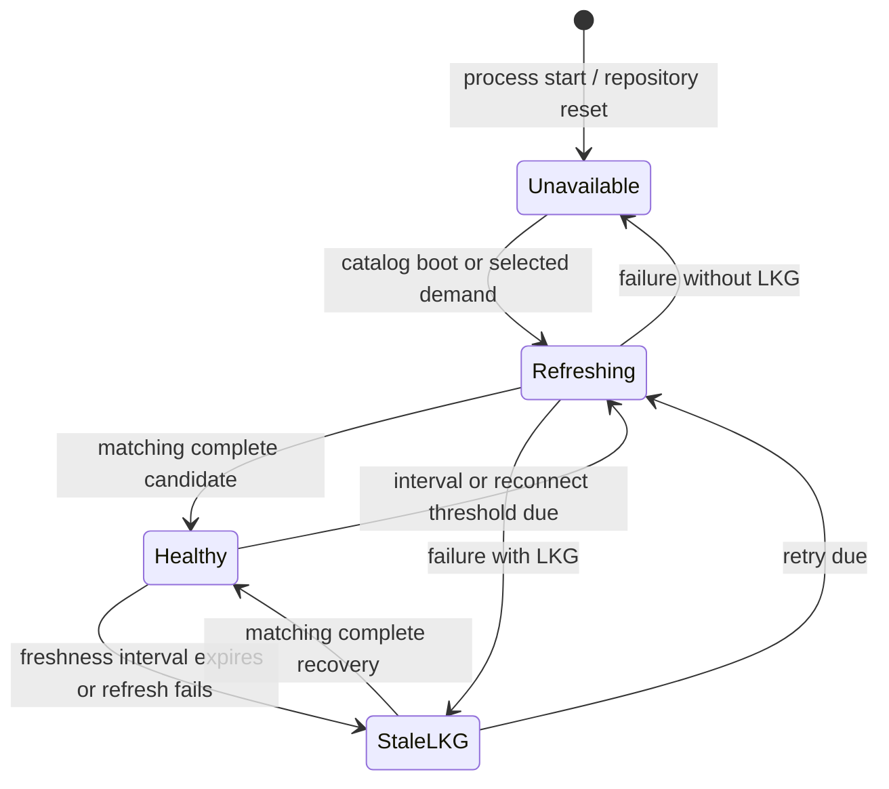
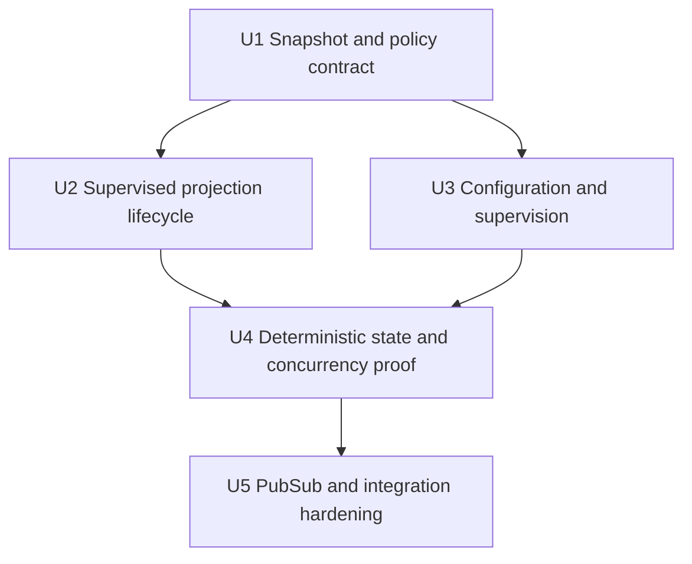
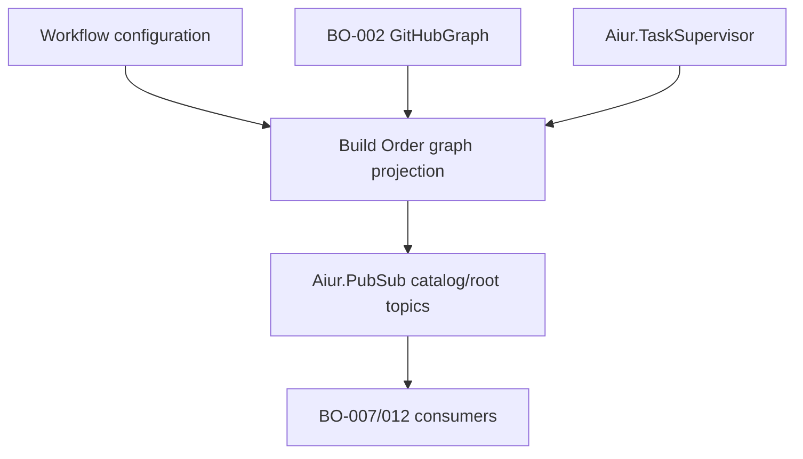

# feat: Atomic Build Order planning projection

## Summary

Add one daemon-owned projection over the shipped `GitHubGraph` candidate API. It will publish an independently healthy root catalog and bounded selected-root last-known-good generations, coalesce monitored demand, and expose deterministic freshness, refresh, retry, and failure metadata without creating another graph model or browser-owned polling loop.

---

## Problem Frame

BO-002 can fetch and validate complete provider candidates, but it deliberately owns no long-lived state. Without a supervised atomic projection, each browser would have to poll independently, provider failures could erase known-good membership or blockers, and catalog failure could be conflated with one selected root's structural or provider failure.

---

## Assumptions

*This plan was reconstructed in an automated ticket workflow without synchronous user confirmation. These implementation-level inferences remain reviewable during execution.*

- Active selected-root demand follows the requesting process lifetime: repeated demand from the same caller/root coalesces, caller death or explicit release stops periodic refresh, and the last-known-good entry remains retained until bounded eviction.
- A small projection snapshot envelope carries health and timing around the shipped `Catalog` or `SelectedRoot`; it does not duplicate their roots, members, dependencies, metadata, or validation rules.
- Refresh work beyond the configured in-flight bound is queued once per catalog/root key rather than rejected or allowed to grow with browser count.
- Validated provider retry hints take precedence when present; untrusted or out-of-range hints are ignored/clamped to a safe future bound, and otherwise a deterministic exponential retry is capped by the corresponding catalog or demanded-root interval.

---

## Requirements

- R1. Satisfy BOREQ-001 by keying the catalog to the exact configured GitHub repository and selected state to the canonical root `TrackerIdentity`, never a bare number, URL, title, or browser-local selection.
- R2. Satisfy BOREQ-004 by projecting only BO-002 `ProviderResult` complete candidates as visible data generations; partial, failed, over-budget, overflow, or structurally invalid candidates must never contribute visible roots, members, or edges.
- R3. Keep catalog data/health, catalog-entry validity, selected-root data/health, and member metadata warnings independent so a malformed root cannot hide valid siblings and one selected-root failure cannot erase the catalog.
- R4. Publish immutable, monotonically identified catalog and selected-root generations with configured repository/root identity and provider observation time. A successful swap emits exactly one data-generation notification before refresh completion.
- R5. Preserve last-known-good content on every failed refresh while updating only health metadata: freshness, refreshing state, last success, last attempt, safe failure class, retry count, and next retry. Without LKG, expose unavailable rather than an empty graph.
- R6. Default catalog reconciliation to 60 seconds, actively demanded selected-root reconciliation to 15 seconds, and selection/reconnect refresh demand to snapshots at least 5 seconds old. Validate configurable positive overrides and require the demand threshold not to exceed the selected interval.
- R7. Coalesce identical catalog/root work, fence delayed or out-of-order completion by repository/configuration generation plus task/generation token, bound in-flight tasks and retained selected roots independently of browser count, and terminate or ignore obsolete work safely.
- R8. Schedule deterministic refresh, timeout, and observable retry/backoff behavior; honor BO-002 safe rate-limit hints without leaking raw provider responses or credentials.
- R9. Keep v1 state in memory. A projection or daemon restart begins unavailable, publishes no invented stale generation, and recovers only from a new complete BO-002 result.
- R10. Expose daemon-local current/demand/release/subscribe seams and Phoenix PubSub topics for later BO-007/012 consumers, with no LiveView policy knobs, GitHub mutation, event/activity join, ticket-body hydration, persistence, or dashboard rendering.

**Origin acceptance:** BOREQ-001, BOREQ-004, and acceptance examples 1, 4, and 5 govern this projection. DEC-002 and DEC-005 require canonical root membership and complete atomic generations.

---

## Scope Boundaries

- No new graph, catalog-entry, member, dependency, readiness, lifecycle, metadata, or diagnostic schema parallel to `Aiur.BuildOrder.GitHubGraph` and the existing `Aiur.BuildOrder` records.
- No issue/activity event folding, runtime status join, readiness inference beyond BO-001/002 validation, ticket detail/history/body hydration, LiveView state, route work, layout, or browser rendering.
- No durable cache, cross-repository or Linear fallback, checkout-derived authority, webhook-only consistency, per-browser intervals, unbounded task admission, or GitHub mutation.
- No publication of BO-002 failed-result candidates, even when they contain partial provider data for diagnostics.

### Deferred to Follow-Up Work

- BO-007 consumes these immutable snapshots in the pure planning/runtime presenter.
- BO-012 owns URL-backed root selection and LiveView subscription/rendering behavior.
- BO-015 owns end-to-end degradation and recovery evidence; BO-003 has no separate manual evidence gate.

---

## Context & Research

### Relevant Code and Patterns

- `src/lib/aiur/build_order/github_graph.ex` and `src/lib/aiur/build_order/provider_result.ex` are BO-002's only provider candidate surface; complete candidates are already body-free, bounded, and fully normalized.
- `src/lib/aiur/build_order/catalog.ex`, `src/lib/aiur/build_order/selected_root.ex`, and `src/lib/aiur/build_order/lifecycle.ex` define the shipped catalog/selected/provider-health contracts that the projection must extend rather than replace.
- `src/lib/aiur/build_order/ticket_detail_cache.ex` splits one supervised owner from `TicketDetailCache.Configuration`, `Options`, `Policy`, and `TaskLifecycle`; it provides current repository-reset, task fencing, coalescing, timeout, LRU, LKG, restart, and PubSub patterns.
- `src/lib/aiur/config/schema/build_order.ex` and `Aiur.Config.build_order_ticket_detail_cache_options/0` are the DEC-015-owned settings seam. Projection intervals and bounds belong there, not in tracker provider-fetch bounds or dashboard cache settings.
- `src/lib/aiur.ex` starts PubSub, `Aiur.TaskSupervisor`, and `Aiur.WorkflowStore` before the existing detail cache. The planning projection must share this always-supervised core ordering.
- `src/test/aiur/build_order/ticket_detail_cache_test.exs` demonstrates barrier-based task tests, configuration-generation fencing, capacity, timeout, restart, and subscriber behavior without wall-clock sleeps.

### Institutional Learnings

- The approved planning pack originally found no reusable generation/LKG cache, but current `develop` now includes BO-016's hardened cache patterns. DEC-015 explicitly binds BO-003 to those patterns and forbids a parallel graph schema or cache.
- BO-002 intentionally returns safe failed envelopes with optional diagnostic candidates. Those candidates are evidence only; treating them as publishable would violate the complete-generation boundary.
- The application child list is a serialized seam. This ticket owns one narrow insertion and must integrate the exact current `develop` head before review, CI, and merge.

### External References

- No new external API or framework research is needed. BO-002 encapsulates the GitHub contract, and the repository's current OTP/PubSub/configuration patterns are authoritative for this state owner.

---

## Key Technical Decisions

- **One projection, two independent health domains:** The GenServer owns a catalog slot plus a bounded map of selected-root slots. They share configuration/task capacity but never share LKG, generation, health, retry, or freshness state.
- **Reuse data records; add a state envelope:** Public snapshots wrap `Catalog` or `SelectedRoot` (or `nil` when unavailable) with one extended `ProviderHealth` record. Catalog entries, members, edge states, diagnostics, and warnings remain BO-001/002-owned values.
- **Complete result is the only swap gate:** Only `{:ok, %ProviderResult{status: :complete, candidate: expected_type}}` with matching configured repository/root identity may increment a visible data generation. Every error path updates health around the existing LKG and sends a health-only notification.
- **Structural invalidity is health, not partial data:** An invalid catalog entry remains isolated inside a complete catalog. A selected structural failure records a controlled failure class; it preserves any prior selected LKG, or returns unavailable/structural-invalid metadata with `nil` data when none exists.
- **Monitored demand separates activity from retention:** The first live demander for a root activates its 15-second schedule; additional demanders coalesce. Releasing or losing the last demander stops periodic work but does not erase LKG. Retention remains a separate bounded LRU policy.
- **Policy is pure and time-injected:** Freshness thresholds, due/retry decisions, admission, eviction, health transitions, and next-timer calculation live in a pure policy module driven by injected monotonic/wall clocks. The GenServer handles messages and the task-lifecycle module owns task references, timeouts, and cancellation.
- **Configuration changes are generation fences:** A validated repository or BO-002 provider-authority/bounds change cancels work and clears generations that are no longer provably compatible. Projection-only interval/capacity changes for the same authority preserve compatible LKG, reschedule timers, and evict only as required by a reduced retention bound. Invalid configuration cannot fabricate an authority change.
- **Literal Phoenix PubSub, not Aiur Events:** Catalog and root topics use `Aiur.PubSub`; data-generation and health-only events have distinct message tags. `Aiur.Events.Exchange` is reserved for cross-ticket agent events and is not a cache bus.

---

## Open Questions

### Resolved During Planning

- **Should BO-003 reuse `ControlCenterCache` or make catalog/selected caches?** No. One dedicated projection extends the `TicketDetailCache` policy/lifecycle pattern and owns both independent graph domains.
- **May a BO-002 error candidate become visible to explain structural failure?** No. Its safe classification/diagnostics may inform health, but its roots, members, and edges never enter visible data.
- **What makes a selected root active?** A monitored daemon consumer demand lease, not a browser-selectable interval or global polling of every retained root.
- **What changes on ordinary age versus failure?** Age determines freshness and whether work is due; refresh-in-progress may coexist with usable data. A failed attempt adds degraded/stale health while preserving content and generation.
- **What survives restart?** Nothing in the projection. Subscribers observe a reset/unavailable generation and must wait for new complete reads.

### Deferred to Implementation

- Exact public function/message names and the conservative hard maxima for retained roots, in-flight refreshes, timeout, and retry count will be finalized against Credo/spec pressure while keeping every configured value positive and bounded.
- The smallest safe representation for demand leases and monitor indexes may change during implementation, but caller death/release, same-root coalescing, and browser-independent bounds are fixed requirements.

---

## High-Level Technical Design

> *This illustrates the intended approach and is directional guidance for review, not implementation specification. The implementing agent should treat it as context, not code to reproduce.*

The catalog follows this lifecycle continuously. Each selected root follows it only while actively demanded. If its last demander leaves during an in-flight attempt, that attempt may finish and publish a matching complete result, but it schedules no periodic refresh or failure retry afterward; the bounded LKG remains retained.

---

## Implementation Units

### U1. Projection snapshot and pure policy contract

**Goal:** Extend the shipped Build Order records with the health/freshness envelope and pure decisions needed for complete atomic publication.

**Requirements:** R1, R2, R3, R4, R5, R6, R8, R9

**Dependencies:** BO-002 merged candidate API; DEC-015 binding

**Files:**
- Create: `src/lib/aiur/build_order/graph_projection_contract.ex`
- Create: `src/lib/aiur/build_order/graph_projection_policy.ex`
- Modify: `src/lib/aiur/build_order/lifecycle.ex`
- Modify: `src/lib/aiur/build_order/provider_result.ex`
- Test: `src/test/aiur/build_order/graph_projection_policy_test.exs`
- Test: `src/test/aiur/build_order/provider_result_test.exs`

**Approach:**
- Define one immutable projection snapshot that identifies catalog versus selected-root scope, configured repository/root identity, current data generation, existing candidate or `nil`, and the extended safe provider-health record.
- Extend provider health with observation/freshness, refresh state, last success/attempt, safe failure class, retry count, and next retry while preserving existing `usable?/1` callers and no raw provider terms.
- Centralize type/identity validation for successful `ProviderResult` candidates. A wrong candidate kind, mismatched root/repository, incomplete result, or error envelope can update health only.
- Implement pure interval/reconnect boundary checks with exact `>=` semantics, deterministic failure backoff, validated and safely clamped provider retry hints, and candidate-preserving health transitions.

**Patterns to follow:**
- `src/lib/aiur/build_order/catalog.ex`
- `src/lib/aiur/build_order/selected_root.ex`
- `src/lib/aiur/build_order/provider_result.ex`
- `src/lib/aiur/build_order/ticket_detail_cache_policy.ex`

**Test scenarios:**
- Happy path: a matching complete catalog or selected candidate becomes a new immutable healthy generation with repository/root identity and observation time.
- Error path: partial/error/wrong-kind/mismatched-identity candidates leave data and generation unchanged while health records only a controlled failure.
- Edge case: a selected structural-invalid result yields no data without LKG and preserves data as stale-LKG when one exists.
- Boundary: catalog 60 seconds, selected 15 seconds, and selection/reconnect 5 seconds are tested at `-1`, exact, and `+1`; exact is due and threshold overrides remain valid only when positive and no greater than selected interval.
- Failure path: exact-bound-plus-one, page-budget, call-budget, timeout, rate-limit, schema, transport, and structural failures map to safe health classes and deterministic next retry without exposing the failed candidate; malformed, past, negative, or excessive retry hints cannot create invalid or unbounded timers.
- Restart: a newly constructed snapshot is unavailable with unknown generation and no stale content.

**Verification:**
- The pure contract can represent healthy, refreshing, stale-LKG, structural-invalid/unavailable, retrying, and recovery states without duplicating graph facts or accepting incomplete data.

### U2. Supervised coalesced projection lifecycle

**Goal:** Add the always-supervised owner that runs BO-002 reads off-process, coalesces catalog/root demand, atomically swaps complete results, and bounds work and retention.

**Requirements:** R1, R2, R3, R4, R5, R7, R8, R9, R10

**Dependencies:** U1

**Files:**
- Create: `src/lib/aiur/build_order/graph_projection.ex`
- Create: `src/lib/aiur/build_order/graph_projection_options.ex`
- Create: `src/lib/aiur/build_order/graph_projection_configuration.ex`
- Create: `src/lib/aiur/build_order/graph_projection_task_lifecycle.ex`
- Modify: `src/lib/aiur/github/client.ex`
- Test: `src/test/aiur/build_order/graph_projection_test.exs`

**Approach:**
- Expose current catalog/selected snapshots, asynchronous demand, explicit selected-demand release, and subscription helpers. Every selected request validates a joinable configured-repository root before entry admission or provider work.
- Start catalog reconciliation asynchronously after init. Track catalog separately from selected entries, and track selected demanders by caller monitor so duplicate consumers do not duplicate provider work or timers.
- Use `Aiur.TaskSupervisor` with injected catalog/selected readers, clocks, and timer scheduling. Correlate every task with scope key, repository/configuration generation, data-attempt token, ref, and timeout.
- Admit at most the configured number of tasks; retain a bounded deduplicated pending set and bounded selected LRU. Never evict demanded or in-flight roots, exceed the bound, or let one root block independent catalog health.
- Apply a complete matching result in one GenServer message, broadcast its data generation exactly once, then finish the refresh and schedule the next due work. Failures update health, broadcast health-only, preserve LKG, and schedule bounded retry.
- On caller `DOWN` or explicit release, remove only that lease; when the last lease disappears, allow an already-running matching attempt to finish but schedule no selected-root retry or periodic timer. Timeout, task `DOWN`, delayed result, configuration notification, and process termination cancel/reschedule only owned work and ignore obsolete completions.

**Patterns to follow:**
- `src/lib/aiur/build_order/ticket_detail_cache.ex`
- `src/lib/aiur/build_order/ticket_detail_cache_configuration.ex`
- `src/lib/aiur/build_order/ticket_detail_cache_task_lifecycle.ex`
- `src/lib/aiur/build_order/ticket_detail_cache_policy.ex`
- `src/lib/aiur/build_order/github_graph.ex`

**Test scenarios:**
- Cold start: catalog is immediately unavailable/refreshing while one task starts; no selected task starts before demand.
- Happy path: catalog and two selected roots complete independently with separate generations, identities, health, and schedules.
- Concurrency: many simultaneous catalog calls and many callers demanding one root invoke one reader per scope; a different root is independent but total active tasks never exceed the configured cap.
- Demand churn: repeated demand from one pid is idempotent, multiple pids share one active root, release or caller death removes only that lease, and last release stops periodic refresh without deleting LKG.
- Eviction: undemanded completed roots are evicted by deterministic LRU; demanded/in-flight roots are protected; all-protected capacity produces a bounded typed unavailable/capacity state.
- Out-of-order: timeout/configuration reset/newer attempt followed by old success or old failure cannot overwrite data, health, retry, or generation.
- Provider restart/failure: task supervisor absence/down, task crash, timeout, and later recovery remain unavailable or stale-LKG and leave no orphaned in-flight entry.
- Configuration: a repository or BO-002 authority/bounds fingerprint change cancels and clears incompatible state; same-authority projection interval/capacity changes preserve compatible LKG, reschedule timers, and apply reduced retention deterministically.

**Verification:**
- One process owns all provider work, active/queued work and retained roots stay within bounds, and every visible generation comes from one matching complete BO-002 result.

### U3. Bounded configuration, documentation, and application supervision

**Goal:** Extend the existing Build Order settings and always-supervised application tree without introducing a second schema or UI-specific lifecycle.

**Requirements:** R6, R7, R8, R9, R10

**Dependencies:** U1; may land alongside U2

**Files:**
- Modify: `src/lib/aiur/config/schema/build_order.ex`
- Modify: `src/lib/aiur/config.ex`
- Modify: `src/lib/aiur.ex`
- Modify: `.aiur/examples/config.example`
- Modify: `src/examples/workflows/github-codex.aiurconfig`
- Modify: `src/examples/workflows/github-claude.aiurconfig`
- Test: `src/test/aiur/config/build_order_test.exs`
- Test: `src/test/aiur/application_test.exs`

**Approach:**
- Add the 60/15/5-second defaults plus bounded selected retention, in-flight work, and refresh timeout settings to `Config.Schema.BuildOrder`, preserving BO-016's existing detail settings.
- Validate every value as a finite positive integer, enforce hard maxima, and add a cross-field check that reconnect/demand threshold does not exceed the selected interval.
- Resolve one runtime projection options list plus a BO-002 authority/bounds fingerprint through `Aiur.Config`; keep readers, clocks, timers, barriers, and names as test-only startup injection rather than workflow policy.
- Register exactly one projection after PubSub, `Aiur.TaskSupervisor`, and `Aiur.WorkflowStore`, available in foreground, headless, dashboard, and no-dashboard shapes. Document that restart clears graph LKG.

**Patterns to follow:**
- `src/lib/aiur/config/schema/build_order.ex`
- `src/lib/aiur/config.ex`
- `src/lib/aiur.ex`
- `src/test/aiur/config/build_order_test.exs`
- `src/test/aiur/application_test.exs`

**Test scenarios:**
- Happy path: omitted settings resolve 60,000/15,000/5,000 millisecond defaults and bounded capacity/timeout defaults alongside unchanged ticket-detail settings.
- Boundary: valid minimum/maximum values and exact threshold-equals-selected interval parse; zero, negative, over-cap, malformed, or threshold-greater-than-selected values fail through the existing `build_order` validation path.
- Integration: every application run shape starts one projection after task/workflow dependencies and before future consumers, without making it conditional on dashboard presence.
- Documentation: example configurations describe daemon-owned intervals, bounded retention/work, and in-memory restart loss without suggesting per-view knobs.

**Verification:**
- Configuration is bounded and internally consistent, and the projection is part of core daemon supervision in every supported run shape.

### U4. Deterministic freshness, retry, and atomicity proof

**Goal:** Prove the full state machine and concurrency boundary without sleep-based timing or partial-generation observability.

**Requirements:** R2, R3, R4, R5, R6, R7, R8, R9

**Dependencies:** U1, U2, U3

**Files:**
- Modify: `src/test/aiur/build_order/graph_projection_policy_test.exs`
- Modify: `src/test/aiur/build_order/graph_projection_test.exs`
- Modify: `src/test/support/build_order_github_graph_test_adapter.ex`

**Approach:**
- Drive time through injected monotonic/wall clocks and timer messages, and drive completion through explicit reader barriers and task refs.
- Use complete and failed BO-002 envelopes, including failed envelopes carrying tempting partial candidates, to assert that visible content changes only in a successful matching swap.
- Exercise catalog and selected scopes concurrently so shared task capacity cannot accidentally couple their health or generation state.

**Patterns to follow:**
- `src/test/aiur/build_order/ticket_detail_cache_test.exs`
- `src/test/aiur/build_order/github_graph_test.exs`
- `src/test/support/build_order_github_graph_test_adapter.ex`

**Test scenarios:**
- Covers AE4. A page-two/partial dependency failure after a healthy selected generation preserves every prior member and edge, marks stale LKG, and never makes a blocker disappear or readiness improve.
- Covers AE5. A complete catalog containing one invalid root publishes valid siblings; selecting the invalid entry reports structural-invalid independently of catalog health.
- Boundary matrix: all 60/15/5 defaults and valid overrides are exercised at `-1`, exact, and `+1`, including immediate cold demand, reconnect coalescing, periodic selected demand, and stopped schedules after release.
- Recovery: cold failure, repeated backoff, success, stale failure, rate-limit retry, and later success preserve monotonic data generations and exact health timestamps.
- Partial injection: a failed result carrying new roots, members, cleared edges, or warnings never changes visible data and emits no data-generation notification.
- Restart: projection termination/restart, task-supervisor restart, and subscriber churn expose unavailable/new-process state until fresh success without leaked monitors or stale timers.

**Verification:**
- The deterministic suite covers every accepted lifecycle transition, timing boundary, and preserving failure without `Process.sleep/1` or probabilistic scheduling assertions.

### U5. PubSub ordering and integration hardening

**Goal:** Lock the consumer-facing notification contract and negative boundaries before BO-007/012 depend on it.

**Requirements:** R1, R3, R4, R5, R7, R10

**Dependencies:** U2, U3, U4

**Files:**
- Modify: `src/lib/aiur/build_order/graph_projection.ex`
- Modify: `src/test/aiur/build_order/graph_projection_test.exs`
- Modify: `src/test/aiur/build_order/catalog_test.exs`
- Modify: `src/test/aiur/build_order/github_graph_test.exs`
- Modify: `src/test/aiur/application_test.exs`

**Approach:**
- Publish separate catalog and root topics whose generation and health event tags let consumers distinguish new immutable data from health-only changes.
- Add barrier hooks around the broadcast/completion boundary in tests only; assert one generation message is queued/observable before the successful refresh handler completes and zero generation messages occur for failure.
- Assert negative ownership: PubSub payloads contain only normalized bounded planning facts, the projection never invokes ticket detail/activity/history APIs, and subscriber count cannot alter retention or provider concurrency.
- Reconcile the exact current `develop` head before final verification and resolve any supervision/configuration drift from serialized sibling work.

**Patterns to follow:**
- `src/lib/aiur/agent_pubsub.ex`
- `src/lib/aiur/build_order/ticket_detail_cache.ex`
- `src/test/aiur/agent_pubsub_test.exs`
- `src/test/aiur/application_test.exs`

**Test scenarios:**
- PubSub success: exactly one data-generation message with the complete matching snapshot is observable before refresh completion, followed by no duplicate health-only message for the same transition.
- PubSub failure: exactly one deterministic health-only transition is published, prior data/generation are unchanged, and no failed candidate content is present.
- Subscriber churn: subscribe/unsubscribe/process death does not create provider work, change bounds, or crash the projection; only explicit monitored demand controls selected refresh.
- Identity isolation: two configured roots have different topics and cannot receive or apply one another's generation.
- Integration: catalog, selected, configuration, application, BO-002 adapter, compile/spec, and affected tests pass on a head containing the exact current `develop` target.

**Verification:**
- BO-007/012 can subscribe to a stable, generation-safe contract and can never observe a partial candidate or confuse health-only degradation with new planning data.

---

## System-Wide Impact

- **Interaction graph:** Workflow configuration establishes repository and bounded policy; the projection alone calls BO-002 through supervised tasks; future consumers use current snapshots plus literal PubSub topics.
- **Error propagation:** BO-002 safe error classifications become projection health. Failed candidates stop at the owner and never reach data-generation payloads.
- **State lifecycle risks:** Repository/configuration generation, task ref, attempt token, caller monitor, timeout, pending queue, and LRU state must remain mutually consistent across completion, failure, eviction, release, reset, and restart.
- **API surface parity:** Catalog and selected scopes share one request/current/subscribe posture but retain distinct topics, identities, intervals, generations, and health. No HTTP, LiveView, or event-bus API is introduced.
- **Integration coverage:** Barrier-based task/PubSub tests prove atomicity and ordering that pure policy tests cannot; configuration/application tests prove the always-supervised production shape.
- **Unchanged invariants:** BO-002 remains the sole candidate builder; BO-001/002 records remain body-free and preserve all five edge states/member warnings; BO-016 detail cache remains independent; GitHub remains authoritative; stale or unknown planning data never newly clears a blocker.

---

## Risks & Dependencies

| Risk | Likelihood | Impact | Mitigation |
|---|---:|---:|---|
| A failed/partial provider result clears members or edges | Medium | High | Accept only matching complete BO-002 envelopes; inject partial candidates in atomicity tests and assert no generation event. |
| Browser churn multiplies polling or leaves roots permanently active | Medium | High | Monitor demand callers, coalesce by canonical root, remove leases on release/`DOWN`, and bound retention separately. |
| Timer/task races overwrite newer state | High | High | Correlate authority/config generation, task ref, attempt token, and scope key; cancel/ignore obsolete work with deterministic out-of-order tests. |
| Provider retry metadata creates invalid or denial-scale timers | Low | High | Accept only bounded positive future hints, clamp to a documented safe maximum, and fall back to deterministic local backoff. |
| Retry storms exhaust GitHub or shared task capacity | Medium | High | Bound active tasks and pending keys, use provider hints plus capped deterministic backoff, and keep one in-flight attempt per scope. |
| Structural invalidity is confused with provider outage or empty data | Medium | High | Isolate invalid catalog entries, publish selected structural failure as health with no partial candidate, and preserve prior LKG when present. |
| Configuration reload mixes repositories | Low | High | Validate configured repository before admission, cancel/clear on proven repository change, and fence completions by configuration generation. |
| Shared application/config files drift under serialized sibling work | High | Medium | Keep edits narrow, fetch `develop`, require its exact current head as an ancestor before CI/review, and rerun focused application/config tests after integration. |

---

## Documentation / Operational Notes

- Document the projection as deliberately in-memory: daemon/process restart begins unavailable and no migration or stale snapshot is synthesized.
- Document data-generation versus health-only PubSub messages and exact timestamp/freshness fields so later accessible presenters do not infer state from age or missing data.
- Add only bounded planning-projection options to the existing Build Order example section; do not expose test seams or per-view cache policy.
- The authoritative integration target is `develop` under DEC-015. The owning head must contain the exact current target before review, CI, or merge.

---

## Sources & References

- **Approved planning authority:** `4d8de9508206e08e314f2730cd916501a3b4cafd`
- **Execution amendment:** `docs/build-order/11-execution-amendment.md` (DEC-015 BO-003 row; policy authority `c6a8bafe3b777ba1781e8a786a71ae87ddf873d9`)
- **Origin requirements:** `docs/brainstorms/2026-07-12-build-order-requirements.md` (BOREQ-001, BOREQ-004; acceptance examples 1, 4, 5 at the approved authority)
- **Ticket contract:** `docs/build-order/tickets/BO-003-project-root-catalog.md` at the approved authority
- **Technical decisions:** `docs/build-order/05-technical-decisions.md` (DEC-002, DEC-005 at the approved authority)
- **State model:** `docs/build-order/03-source-of-truth-and-state.md` (Dedicated GitHub graph projection)
- Related code: `src/lib/aiur/build_order/github_graph.ex`, `src/lib/aiur/build_order/provider_result.ex`, `src/lib/aiur/build_order/ticket_detail_cache.ex`, `src/lib/aiur/config/schema/build_order.ex`, `src/lib/aiur.ex`
- Related issue/merged dependency: #1092 / #1091
