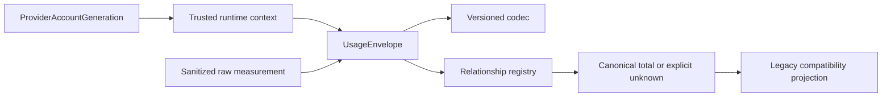

# feat: Add attributed usage envelope

## Summary

Add a pure, versioned usage-envelope API that preserves provider measurements,
trusted attribution, exact money, and the source-specific token relationships
needed by future persistence and pricing work. The contract will consume the
existing account-generation value without taking ownership of its lifecycle.

---

## Problem Frame

The current token helpers normalize a display-oriented subset of Codex data and
can fill absent dimensions with zero. They cannot express source identity,
absolute versus delta semantics, trusted account correlation, or the
relationships required to avoid duplicated cache/reasoning tokens. DREQ-008
requires that boundary before later adapter, ledger, and pricing tickets can
make durable decisions safely.

---

## Assumptions

*This plan was authored without synchronous user confirmation. The items below are agent inferences that should be reviewed during implementation and PR review.*

- The portable envelope receives a previously obtained,
  provider-account-generation snapshot as trusted runtime context; it does not
  call the lifecycle owner or accept provider payloads.
- A small compatibility projection is the appropriate bridge to the existing
  transient token-count consumers, while provider-boundary wiring remains
  DASH-029 work.

---

## Requirements

- R1. Satisfy DREQ-008 with a versioned, provider-neutral raw measurement
  envelope covering typed attribution, source identity, occurrence/ingestion
  times, scopes, epochs, and full/partial coverage.
- R2. Preserve all raw input, cache, output, and reasoning dimensions; pin a
  provider/source/source-version relationship revision for every token-bearing
  envelope.
- R3. Derive totals only under a complete known relationship contract; preserve
  an authoritative provider total and report discrepancies without guessing.
- R4. Decode provider cost from exact strings, integers, or existing decimal
  values only; reject decoded floats and never represent missing cost as zero.
- R5. Carry the opaque `Aiur.ProviderAccountGeneration` value as a distinct
  account-correlation namespace, never as a counter epoch or local substitute.
- R6. Fulfil DEC-015's DASH-008 binding correction: publish one copyable
  `UsageEnvelope` and relationship registry contract.
- R7. Preserve a deterministic raw idempotency and source-order identity so a
  later ledger can distinguish retries, reordered observations, and overlapping
  absolute streams without deriving a delta here.
- R8. Represent provider cost with an explicit currency, unit/scale, cost
  measurement kind/scope, source/version, and coverage rather than inferring
  major versus minor units from a numeric value.

---

## Scope Boundaries

- Do not wire Codex or Claude payloads, persistence, checkpoints, deduplication,
  delta derivation, pricing, meter joins, dashboard presentation, or
  supervision.
- Do not mint, rotate, persist, infer, or look up provider-account generations.
- Do not replace `Aiur.Orchestrator.TokenAccounting`; its runtime integration
  remains a downstream compatibility consumer.

### Deferred to Follow-Up Work

- Provider source mappings and lifecycle wiring: DASH-029 and DASH-010.
- Durable delta/checkpoint policy: DASH-009.
- Exact pricing and meter composition: DASH-011, DASH-012, and DASH-015.

---

## Context & Research

### Relevant Code and Patterns

- `src/lib/aiur/provider_account_generation.ex` exposes the existing opaque,
  binding-scoped generation contract this ticket consumes.
- `src/lib/aiur/tracker_identity.ex` defines the repository-qualified trusted
  tracker identity used for attribution.
- `src/lib/aiur/token_usage.ex` and
  `src/lib/aiur/orchestrator/token_accounting.ex` show the legacy transient
  token shape that needs an explicit compatibility projection rather than a
  schema rewrite.
- `src/lib/aiur/current_run_membership/event/codec.ex` demonstrates strict,
  versioned record validation and serialization.

### Institutional Learnings

- No relevant `docs/solutions/` pattern was found; the approved DREQ-008 and
  DASH-018 contracts are the governing local design evidence.

### External References

- [Decimal documentation](https://decimal.hexdocs.pm/Decimal.html) confirms
  exact string/integer construction and documents why float casting is unsafe
  for monetary inputs.

---

## Key Technical Decisions

- One copyable contract: the public API consists of a self-contained envelope,
  a versioned relationship registry, and serialization/compatibility helpers;
  it has no process, filesystem, or provider-payload dependency.
- Snapshot-derived account context: callers normalize the versioned
  `ProviderAccountGeneration` snapshot into provider, backend, generation (or
  explicit unknown), freshness, health, and bounded reason. Envelope validation
  checks that shape and never mints, queries, or replaces the shared value.
- Tagged exact money: canonical serialization stores an exact major-unit Decimal
  string with a three-letter currency; integer minor-unit inputs additionally
  carry their explicit nonnegative decimal scale before conversion. Cost kind,
  scope, source/version, and coverage remain alongside the normalized value.
- Relationship-first reconciliation: token dimensions retain raw values while
  canonical totals and compatibility values are calculated only through the
  pinned source revision.
- Historical revision lookup: the pure registry catalog keeps source revisions
  immutable. A replay resolves only the envelope's pinned revision; an absent
  historic revision is explicit coverage failure, never an upgrade to current
  semantics.
- Explicit unknowns: absent/untrusted occurrence time, account generation,
  money, attribution, or relationship coverage remain named unknown states
  rather than zero or an inferred fallback.

---

## Open Questions

### Resolved During Planning

- Which account-generation owner should be used? The existing
  `Aiur.ProviderAccountGeneration` snapshot contract; no local namespace is
  created.
- Should decoded numeric costs accept floats? No. Exact decimal strings and
  Decimal values are accepted as tagged major units; integer values are tagged
  minor units with an explicit scale. Floats are rejected at the decode
  boundary.
- How are old relationship revisions resolved? The in-memory catalog is an
  immutable pure input. An envelope may resolve only its exact pinned revision,
  while a missing historic definition stays explicitly unreconciled.

### Deferred to Implementation

- The final compact error atoms and internal helper names can be selected while
  making the public validation and test cases coherent.

---

## Output Structure

    src/lib/aiur/
    ├── usage_envelope.ex
    └── usage_envelope/
        ├── exact_money.ex
        ├── codec.ex
        └── relationship_registry.ex

---

## High-Level Technical Design

> *This illustrates the intended approach and is directional guidance for review, not implementation specification. The implementing agent should treat it as context, not code to reproduce.*

---

## Implementation Units

### U1. Versioned envelope and exact-money boundary

**Goal:** Establish the immutable, serializable provider-neutral measurement
contract without any source-adapter or persistence wiring.

**Requirements:** R1, R4, R5, R6, R7, R8.

**Dependencies:** Existing `Aiur.ProviderAccountGeneration` and
`Aiur.TrackerIdentity` contracts.

**Files:**

- Create: `src/lib/aiur/usage_envelope.ex`
- Create: `src/lib/aiur/usage_envelope/exact_money.ex`
- Create: `src/lib/aiur/usage_envelope/codec.ex`
- Create: `src/test/aiur/usage_envelope_test.exs`
- Create: `src/test/aiur/usage_envelope/codec_test.exs`

**Approach:**

- Model stable idempotency key, trusted source event ID/sequence, independent
  counter epoch, measurement/counter/update kinds, trusted occurrence and
  ingestion times, typed tracker attribution, scope identities, runtime
  context, raw dimensions, cost coverage, and pinned relationship revision as
  one schema-versioned value. Counter-bearing measurements require the source
  identity and relevant scope fields but never derive a cross-message delta.
- Normalize only the public, redacted account-generation snapshot fields:
  provider, backend, generation-or-unknown, freshness, health, and bounded
  reason. A known generation must carry current/healthy snapshot status;
  unknown state remains uncorrelated.
- Derive the UTC pricing date only from a trusted UTC occurrence time; preserve
  a named unknown coverage reason when that trust is absent.
- Decode tagged monetary values into Decimal from exact representations,
  normalize to a major-unit string plus three-letter currency, preserve cost
  kind/scope/source/version/coverage, and reject float inputs before any
  conversion. Minor-unit integers require an explicit scale rather than an
  inferred currency table.
- Bound opaque metadata and rejection/coverage reasons so the contract never
  retains raw provider response, credentials, account identity, prose, or
  workspace data.

**Patterns to follow:**

- `src/lib/aiur/current_run_membership/event/codec.ex`
- `src/lib/aiur/tracker_identity.ex`
- `src/lib/aiur/provider_account_generation.ex`

**Test scenarios:**

- Happy path: a complete delta request with a stable source identity, trusted
  UTC occurrence time, repository-qualified identity, a healthy shared
  generation snapshot, raw dimensions, and tagged string provider cost
  round-trips without a changed value.
- Edge case: midnight UTC produces the exact occurrence-date bucket, while an
  untrusted/missing occurrence time does not fall back to ingestion time.
- Error path: missing idempotency/source ordering for a resettable counter, an
  invalid counter epoch, forged/unjoinable attribution, or an account
  generation used as a counter epoch is rejected with a bounded reason.
- Error path: a malformed account snapshot, known generation with
  unknown/unhealthy status, or a rotation snapshot cannot be silently joined to
  the prior generation.
- Error path: float, malformed, infinite, unsupported-currency, inconsistent
  scale, or missing-with-currency provider money cannot become a zero or a
  different exact value; 100 minor USD units at scale two normalize to 1.00.
- Integration: duplicate, reordered, and same-source/different-context
  fixtures retain distinct raw identity facts for the downstream ledger.
- Security: serialization excludes raw payload, credentials, account IDs,
  workspace paths, and arbitrary nested metadata.

**Verification:**

- A valid envelope is versioned, JSON-safe, content-free, and exactly
  round-trippable; invalid measurements return explicit failures rather than
  creating partial guessed values.

---

### U2. Provider/source token-relationship registry

**Goal:** Publish one revisioned source contract that classifies every raw
dimension and resolves an authoritative or safely derived canonical total.

**Requirements:** R2, R3, R6, R7.

**Dependencies:** U1.

**Files:**

- Create: `src/lib/aiur/usage_envelope/relationship_registry.ex`
- Create: `src/test/aiur/usage_envelope/relationship_registry_test.exs`
- Modify: `src/lib/aiur/usage_envelope.ex`
- Modify: `src/test/aiur/usage_envelope_test.exs`

**Approach:**

- Key relationships by provider, source, and source version; require a stable,
  immutable registry revision and an explicit disposition for each token
  dimension. Resolve only the exact envelope-pinned revision, and record
  missing historical revisions as explicit coverage failure.
- Support additive dimensions, subsets, mutually exclusive alternatives, and
  explicit unknowns while retaining all raw measurements.
- Let an explicitly authoritative provider total remain canonical even when
  reconciliation reports partial, contradictory, or discrepant dimensions;
  otherwise fail closed and publish no derived value.

**Patterns to follow:**

- `src/lib/aiur/provider_account_generation/validation.ex`
- `src/lib/aiur/current_run_membership/event/codec.ex`

**Test scenarios:**

- Happy path: Claude-style additive base/cache-create/cache-read input and
  output dimensions resolve to the expected exact integer total.
- Happy path: Codex-style cached-input and reasoning subsets count their parent
  once and expose the selected revision.
- Edge case: one nonzero mutually exclusive alternative is accepted; two
  nonzero alternatives in the same group remain explicitly unreconciled.
- Error path: unknown, missing, contradictory, or unpinned relationships do
  not produce a dimension-derived total or pricing-compatible input.
- Integration: an old envelope resolves its original revision after a newer
  source mapping is added, while an unavailable historic revision cannot fall
  forward to current semantics.
- Integration: an authoritative provider total stays canonical and exposes a
  discrepancy when dimensions disagree rather than discarding raw evidence.

**Verification:**

- Every supported source revision is explicit and one envelope can be replayed
  against its pinned revision with the same reconciliation result.

---

### U3. Compatibility projection and contract characterization

**Goal:** Provide the narrow transient token-count projection future adapters
can choose to wire while preserving the existing display accounting behavior.

**Requirements:** R1, R2, R3, R6.

**Dependencies:** U1, U2.

**Files:**

- Modify: `src/lib/aiur/usage_envelope.ex`
- Modify: `src/lib/aiur/usage_envelope/relationship_registry.ex`
- Create: `src/test/aiur/usage_envelope/compatibility_test.exs`
- Modify: `src/test/aiur/token_usage_test.exs`

**Approach:**

- Project only a safely reconciled input/output/total view and retain named
  unknown coverage for partial or unreconciled data.
- Characterize the legacy `Aiur.TokenUsage` behavior separately so this ticket
  introduces no hidden adapter wiring, cross-message delta state, or global
  cache/reasoning assumption.

**Patterns to follow:**

- `src/lib/aiur/token_usage.ex`
- `src/lib/aiur/orchestrator/token_accounting.ex`

**Test scenarios:**

- Happy path: a fully reconciled envelope projects a stable transient token
  view without changing legacy direct token normalization.
- Edge case: provider-total authority with partial dimensional coverage carries
  the total but marks compatibility/pricing coverage explicitly.
- Error path: an absolute counter, duplicate source identity, counter reset, or
  lower cumulative value remains raw contract evidence and never derives a
  cross-message delta in this layer.
- Integration: known and unknown provider-account generations remain separate
  in identity/compatibility metadata and cannot be substituted with counter,
  run, or session values.

**Verification:**

- The new projection is pure and optional, current orchestrator token
  accounting remains behaviorally unchanged, and no adapter or ledger state is
  introduced.

---

## System-Wide Impact

- **Interaction graph:** Future source normalizers receive trusted runtime
  context and publish this contract; DASH-009 persists it and DASH-011 prices
  only its pinned relationship meaning.
- **Error propagation:** Invalid source or cost data is returned as bounded
  validation/coverage information; it cannot crash a worker or silently become
  zero usage.
- **State lifecycle risks:** This ticket creates no state or process lifecycle;
  account-generation rotation and durable counter checkpoints remain owned by
  their existing and downstream contracts.
- **API surface parity:** Codec, reconciliation, and compatibility projection
  use the same schema/revision semantics for every provider.
- **Integration coverage:** Pure contract fixtures prove the future adapter,
  ledger, and pricing handoff without simulating a provider process.
- **Unchanged invariants:** Legacy transient accounting, account-generation
  ownership, and provider payload routing are not modified.

---

## Risks & Dependencies

| Risk | Mitigation |
| --- | --- |
| A new contract guesses cache/reasoning semantics | Require source-versioned relationships and fail closed when they are unknown or contradictory. |
| Float decoding changes money before persistence | Accept only exact representations and test both rejection and round trips. |
| Exact money has ambiguous unit or currency | Tag major/minor input form, require minor scale and currency, then serialize one canonical major-unit Decimal string. |
| Account and counter namespaces become conflated | Model them as distinct required fields and include substitution-negative tests. |
| A registry update reinterprets retained data | Resolve only immutable envelope-pinned revisions and fail closed when an old definition is unavailable. |
| Compatibility work rewires runtime accounting | Keep the projection pure and characterize the unchanged legacy module. |

---

## Documentation / Operational Notes

- This is a library contract with no separate visual or CLI evidence; its
  review evidence is sanitized, provider-neutral fixtures and focused tests.
- Provider adapters must drop raw payloads after later normalization; no new
  log or dashboard output is introduced here.

---

## Sources & References

- **Origin document:** [DREQ-008](../brainstorms/2026-07-12-build-order-requirements.md)
- **Owner packet:** [DASH-008](../build-order/companion-tickets/DASH-008-usage-envelope.md)
- **Binding correction:** [DEC-015](../build-order/11-execution-amendment.md)
- Related code: `src/lib/aiur/provider_account_generation.ex`,
  `src/lib/aiur/tracker_identity.ex`, `src/lib/aiur/token_usage.ex`
- Related issue: #1114
