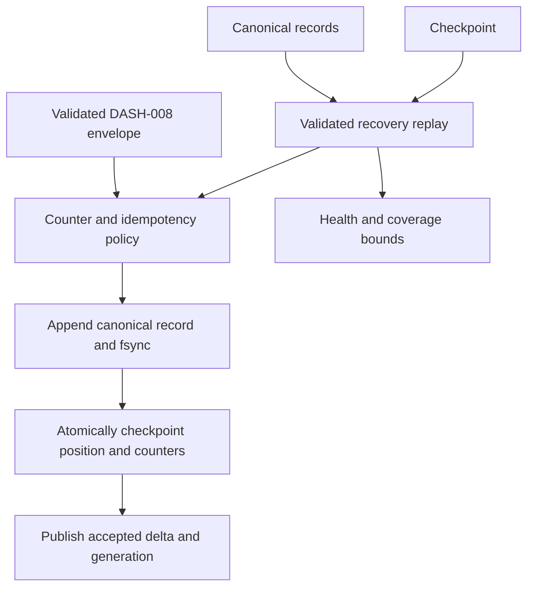
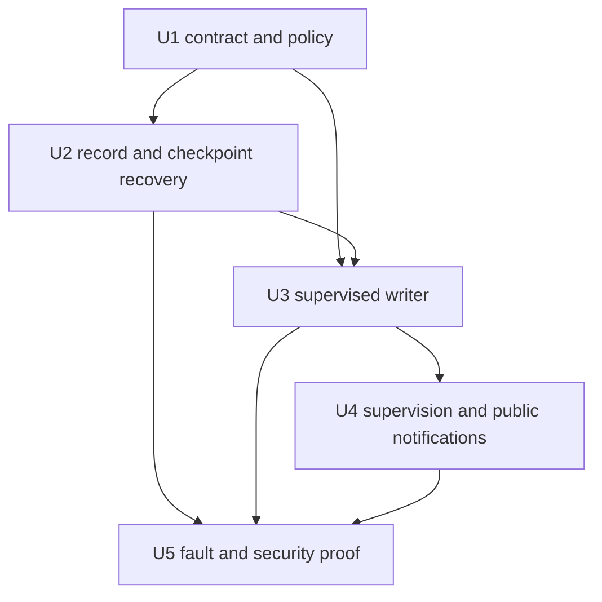
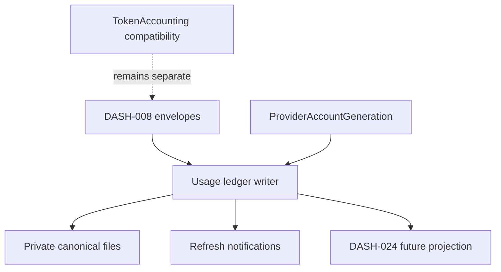

# feat: Add canonical usage ledger

## Summary

Add one supervised, file-backed usage-ledger authority that durably accepts
DASH-008 envelopes, derives raw deltas once, and recovers the same ordered
facts after a process restart. Its public seam will be stable for DASH-024,
while aggregation, retention, pricing, and source-adapter wiring remain out of
scope.

---

## Problem Frame

Current token accounting is transient orchestrator state. It cannot survive a
restart or safely distinguish a retried cumulative counter from new usage.
DREQ-009 requires a daemon-owned raw authority that retains the original
source-version and relationship-revision evidence rather than reconstructing
it from a newer registry or display-oriented totals.

---

## Assumptions

*This plan was authored without synchronous user confirmation. The items below
are agent inferences that should be reviewed during implementation and PR
review.*

- A single active canonical segment is sufficient for this ticket; segment
  rotation, retention, and compaction remain DASH-025 work.
- DASH-008 currently provides no accepted declaration that an absolute and a
  delta stream sharing a counter namespace are independent. The default policy
  will reject their overlap until a trusted source-version policy explicitly
  proves independence.
- The live derived-delta notification is a refresh signal only. Consumers use
  the ordered ledger scan/replay API as the durable authority.

---

## Requirements

- R1. Satisfy DREQ-009 with one daemon-supervised, append-only NDJSON ledger
  and crash-safe counter/idempotency checkpoint.
- R2. Persist every accepted DASH-008 `UsageEnvelope` before an accepted
  position/generation is observable, preserving source, source version, and
  `relationship_revision` byte-for-byte in records and replayed deltas.
- R3. Derive each raw token and provider-cost delta exactly once: monotonic
  absolute counters advance their durable checkpoint; source deltas are
  accepted once by durable event identity; duplicates and older observations
  add zero; unexplained decreases remain explicit reset/coverage failures.
- R4. Keep provider-account generation, counter epoch, and ledger generation
  separate, and include the full trusted scope/model/basis identity in the
  counter checkpoint key.
- R5. Recover safely from daemon or writer restart, missing/corrupt checkpoint,
  torn tail, malformed segment, checksum/schema error, and persistence
  failure; quarantine corruption and never silently reset authoritative usage.
- R6. Expose append acknowledgement, ordered replay/scan, accepted-delta
  refresh, store generation, raw coverage bounds, and human-readable health
  behind a behavior suitable for DASH-024's future backend-independent use.
- R7. Admit only content-free normalized identity facts, enforce bounded
  canonical-segment/checkpoint/idempotency capacity, and preserve owner-only
  state-path containment; do not expose raw storage paths or account data in
  public health.
- R8. Honour DEC-015: this individual-ticket change targets `develop`, and
  its final reviewed/CI head contains the exact current `develop` head.

---

## Scope Boundaries

- Do not implement aggregate or grouped query snapshots, browser/API totals,
  price calculation, retention, deletion, rotation, compaction, Postgres,
  Ecto, SQLite, or per-ticket files.
- Do not parse provider payloads or alter source-adapter ownership; only typed
  `UsageEnvelope` inputs are accepted.
- Do not replace or remove `Aiur.Orchestrator.TokenAccounting`; it remains the
  transient compatibility consumer until a separately owned migration.
- Do not resolve a historical relationship revision through the installed
  registry, or reinterpret a historical envelope's dimensions.

### Deferred to Follow-Up Work

- DASH-024 owns aggregate/query projection and is the only aggregate consumer
  of the ledger seam.
- DASH-025 owns rotation, retention, compaction, and retained-coverage policy.
- DASH-029 and DASH-010 own provider-source normalization and any trusted
  independent-stream declaration needed to accept overlapping streams.
- DASH-011 owns price calculation and historical relationship-resolution use.

---

## Context & Research

### Relevant Code and Patterns

- `src/lib/aiur/usage_envelope.ex` and
  `src/lib/aiur/usage_envelope/codec.ex` provide the exact validated,
  content-free envelope boundary and source/revision serialization to retain.
- `src/lib/aiur/decision_log.ex` provides owner-only append, fsync-before-ack,
  symlink rejection, semantic replay validation, and torn-tail repair.
- `src/lib/aiur/json_store.ex` and `src/lib/aiur/fs.ex` provide atomic
  fsynced checkpoint publication and filesystem-entry barriers.
- `src/lib/aiur/current_run_membership/store/{recovery,runtime,paths,checkpoint,file_ops}.ex`
  demonstrate injected persistence operations, checksummed recovery,
  sanitised health, quarantine, and a supervised single-writer boundary.
- `src/lib/aiur/config/paths.ex` supplies daemon-private, contained state-root
  resolution; `src/lib/aiur.ex` is the shared application-child order.
- `src/lib/aiur/orchestrator/token_accounting.ex` shows the legacy in-memory
  absolute-counter behavior that remains untouched by this change.

### Institutional Learnings

- The approved DASH-009 implementation pointer and DEC-015 require extending
  the existing private-state and recovery patterns rather than creating a
  parallel persistence framework or moving ownership into a dashboard.

### External References

- No external research is required: the repository contains recently merged,
  direct patterns for every required file, checkpoint, recovery, supervision,
  and permission boundary.

---

## Key Technical Decisions

- **Canonical raw record plus acknowledgement checkpoint:** append and fsync a
  validated record first, then atomically persist the advanced counter,
  idempotency, and position checkpoint before exposing the new generation or
  delta. A restart rebuilds any uncheckpointed suffix from the canonical
  record order.
- **Counter identity is deliberately broader than an envelope ID:** each raw
  dimension and provider-cost measurement carries the provider/transport,
  account generation, counter epoch, declared scope identities, source,
  model context, monetary basis/currency, and counter kind required to prevent
  accidental stream merging.
- **Conservative stream overlap:** a delta and absolute stream in the same
  counter namespace conflict by default. Only an explicit trusted,
  source-version declaration can partition them as independent.
- **Historical evidence is opaque to the ledger:** records and derived deltas
  copy the pinned relationship revision; the writer never consults or replaces
  it with a current relationship registry entry.
- **Recovery preserves truth over availability:** a missing/corrupt checkpoint
  can rebuild from fully validated raw records; a malformed complete record or
  unsafe quarantine leaves the last validated prefix visible with degraded or
  unavailable health and stops new acknowledgement.
- **Dedicated state leaf and one child:** add a contained usage-ledger state
  directory and one writer immediately after the account-generation owner in
  the application child list. There are no per-ticket writers or readers.
- **Defensive admission and capacity:** validate every persisted opaque fact at
  the ledger boundary against the trusted content-free identifier contract and
  reject a record before append when it cannot be safely retained. Bound record,
  segment, checkpoint, and idempotency growth; capacity exhaustion is a
  fail-closed, sanitized health/result state, never an eviction or a hidden
  rollover.

---

## Open Questions

### Resolved During Planning

- **Which envelope contract is persisted?** The current DASH-008
  `Aiur.UsageEnvelope` and its codec; no alternate raw map is introduced.
- **Which durability primitives apply?** `DecisionLog` for append/replay,
  `Fs.atomic_write`/`JsonStore` for checkpoints, and the membership store's
  injected recovery/health conventions.
- **How are raw and projected responsibilities separated?** The ledger owns
  raw append, idempotency, counter state, and ordered delta derivation;
  DASH-024 performs aggregate/query projection later.

### Deferred to Implementation

- Internal module and helper names may be refined while preserving the public
  behavior and the record/checkpoint version contracts.
- Checkpoint record-size limits and default segment-size limits will be set
  alongside deterministic boundary tests, without adding rotation behavior.

---

## Output Structure

    src/lib/aiur/
    ├── usage_ledger.ex
    └── usage_ledger/
        ├── counter_policy.ex
        ├── record.ex
        ├── checkpoint.ex
        ├── paths.ex
        ├── recovery.ex
        └── store.ex

---

## High-Level Technical Design

> *This illustrates the intended approach and is directional guidance for
> review, not implementation specification. The implementing agent should
> treat it as context, not code to reproduce.*

---

## Implementation Units

### U1. Define the ledger seam and pure counter policy

**Goal:** Establish the stable future-backend behavior, derived-delta facts,
record identity, and deterministic policy for idempotency, absolute counters,
source deltas, coverage/reset rejection, and stream overlap.

**Requirements:** R2, R3, R4, R6, R7.

**Dependencies:** Merged DASH-008 `UsageEnvelope` and `UsageEnvelope.Codec`.

**Files:**

- Create: `src/lib/aiur/usage_ledger.ex`
- Create: `src/lib/aiur/usage_ledger/counter_policy.ex`
- Create: `src/lib/aiur/usage_ledger/record.ex`
- Test: `src/test/aiur/usage_ledger/counter_policy_test.exs`
- Test: `src/test/aiur/usage_ledger/record_test.exs`

**Approach:**

- Define a behavior and public, daemon-owned façade for append acknowledgement,
  ordered raw scan/replay, accepted derived-delta refresh, generation, coverage,
  and health. Keep the file adapter private to this implementation so a future
  backend can retain the contract without a dual writer.
- Represent a canonical record as a versioned wrapper around the validated
  envelope plus monotonic ledger position. Decode it through the DASH-008
  codec, reject unexpected/content-bearing fields, and retain source version
  and relationship revision exactly as decoded.
- Make the pure policy key every token dimension and cost basis by the full
  trusted counter namespace. Deduplicate source deltas by durable event
  identity; advance only monotonic absolute values; treat older or equal
  observations as zero-delta; reject an unexplained lower value or unproven
  mixed stream without mutating candidate state.
- Apply the ledger's content-free admission policy to every envelope field that
  can reach a record or checkpoint. It accepts normalized identity syntax and
  rejects prompt/output fragments, credentials, paths, capability URLs, and
  account-PII-shaped values before append; public errors and health report only
  a normalized rejection class.

**Execution note:** Implement the pure policy and codec tests first; persistence
must consume this tested candidate state rather than duplicate the logic.

**Patterns to follow:**

- `src/lib/aiur/usage_envelope.ex`
- `src/lib/aiur/usage_envelope/codec.ex`
- `src/lib/aiur/current_run_membership/{event,projection}.ex`

**Test scenarios:**

- Happy path: successive absolute token and exact-cost counters produce only
  the incremental raw dimensions and preserve the source version and pinned
  relationship revision in every derived fact.
- Happy path: source-delta tokens and cost add once for a durable event
  identity, including retry/attempt/session and completed-ticket attribution.
- Edge case: duplicate, equal, and older absolute observations return zero
  delta and do not advance the stored high-water value.
- Error path: a newer unexplained lower absolute counter is rejected with a
  reset/coverage error; changing the trusted counter epoch or account
  generation establishes a distinct first value.
- Edge case: fallback or resolved-model changes partition counters where the
  model context differs; a mixed absolute/delta namespace is rejected unless a
  trusted source contract marks it independent.
- Security: malformed records, forged schema/version fields, or unexpected
  content-bearing keys are rejected before any record/policy state exists.
- Security: valid-envelope opaque fields that contain a prompt fragment,
  credential, path, raw provider fragment, or account PII are rejected at the
  ledger admission boundary and never reach records, checkpoints, health, or
  diagnostics.

**Verification:** The same ordered envelope sequence produces the same
candidate deltas and checkpoint state without filesystem or process state.

---

### U2. Add contained record, checkpoint, and recovery storage

**Goal:** Build the owner-only on-disk layout and recovery protocol that turns
canonical records plus a checksummed acknowledgement checkpoint into a safe
replay authority.

**Requirements:** R1, R2, R4, R5, R7.

**Dependencies:** U1.

**Files:**

- Modify: `src/lib/aiur/config/paths.ex`
- Modify: `src/test/aiur/config_paths_test.exs`
- Create: `src/lib/aiur/usage_ledger/paths.ex`
- Create: `src/lib/aiur/usage_ledger/checkpoint.ex`
- Create: `src/lib/aiur/usage_ledger/recovery.ex`
- Test: `src/test/aiur/usage_ledger/checkpoint_test.exs`
- Test: `src/test/aiur/usage_ledger/recovery_test.exs`

**Approach:**

- Resolve one dedicated contained usage-ledger leaf through `Config.Paths`,
  harden every created directory/file to owner-only permissions, and reject
  symlinks/non-regular recovery entries before reading or writing.
- Reuse `DecisionLog` for a newline-terminated, fsynced canonical segment and
  `Fs.atomic_write` for a versioned, checksummed checkpoint containing the
  acknowledged position, idempotency set, per-counter high waters, store
  generation, and raw coverage bounds. Sync directory-entry creation and
  checkpoint publication before treating a candidate as durable.
- Enforce configured record, segment, checkpoint, and idempotency-cardinality
  limits before an append can make an unacknowledgeable candidate durable. A
  new event past a limit receives a sanitized capacity result and explicit
  coverage/health state; no identity is evicted and no implicit rotation is
  introduced.
- On boot, validate checkpoint schema/checksum and semantically validate its
  canonical prefix before using the validated checkpoint to replay only the
  suffix after its acknowledged position. If the checkpoint is missing or
  unusable, rebuild from a fully validated raw prefix; repair only a torn tail,
  quarantine malformed complete artifacts, and surface degraded/unavailable
  health without exposing contents or paths.

**Patterns to follow:**

- `src/lib/aiur/decision_log.ex`
- `src/lib/aiur/json_store.ex`
- `src/lib/aiur/current_run_membership/store/{checkpoint,file_ops,paths,recovery}.ex`

**Test scenarios:**

- Happy path: a checkpoint round-trip retains position, generation,
  idempotency, absolute high waters, coverage bounds, source version, and
  relationship revision exactly.
- Integration: missing checkpoint rebuilds the identical checkpoint state and
  ordered deltas from valid canonical records; restarting after a valid
  checkpoint replays only its suffix.
- Edge case: a non-newline-terminated tail is truncated and synced without
  losing its preceding valid records.
- Error path: bad checksum/schema, oversized or malformed checkpoint, malformed
  complete record, symlink, permission, and unavailable path produce sanitized
  health and no writable acknowledgement state.
- Integration: a validated prefix is checkpointed before corrupt raw material
  is quarantined; later recovery never silently skips over the corruption or
  resets prior authority to zero.
- Security: public recovery/health values contain only normalized reason atoms,
  never raw record contents, account identifiers, or filesystem paths.
- Error path: a unique-event flood reaches the configured limit before resource
  exhaustion, rejects subsequent new identities without eviction, and retains
  deterministic replay of the validated prefix.

**Verification:** Recovery either reconstructs the exact accepted raw state or
reports why acknowledgement is unavailable while preserving the last validated
authority.

---

### U3. Implement the supervised single writer and acknowledgement boundary

**Goal:** Serialize append, checkpoint, generation, and derived-delta
publication in one GenServer-backed file implementation of the ledger seam.

**Requirements:** R1, R2, R3, R4, R5, R6.

**Dependencies:** U1, U2.

**Files:**

- Create: `src/lib/aiur/usage_ledger/store.ex`
- Test: `src/test/aiur/usage_ledger/store_test.exs`

**Approach:**

- Boot the writer through recovery, then accept one envelope at a time. For an
  accepted candidate, append/fsync the canonical record, atomically persist
  the advanced acknowledgement checkpoint, and only then replace in-memory
  state, return its position/generation, and issue the accepted-delta refresh.
- Inject append, checkpoint, directory-sync, clock, and publish operations so
  deterministic tests can stop at every durability boundary. A failure at any
  operation returns no success acknowledgement, changes health appropriately,
  and prevents further writes until safe recovery.
- Expose ordered canonical scans/replay and bounded coverage/generation/health
  facts through the façade. Preserve original relationship revision and source
  version in replayed deltas without calling the relationship registry.

**Patterns to follow:**

- `src/lib/aiur/current_run_membership/store.ex`
- `src/lib/aiur/current_run_membership/store/runtime.ex`
- `src/lib/aiur/current_run_membership.ex`
- `src/lib/aiur/decision_pubsub.ex`

**Test scenarios:**

- Happy path: append returns a durable position/generation only after record
  and checkpoint success; subscribers receive the accepted content-free delta
  after that acknowledgement boundary.
- Integration: restarting the writer after absolute cumulative input reproduces
  the original deltas once; replaying the same cumulative observation cannot
  re-add prior totals.
- Crash boundary: stopping after record append but before checkpoint rebuilds
  and emits the missing accepted delta once; stopping after checkpoint but
  before publication does not create a second raw delta on restart.
- Error path: injected append, flush/sync, rename, directory, disk-full, and
  permission failures never return success or publish a new accepted position.
- Error path: a record, segment, checkpoint, or idempotency-capacity limit
  returns a non-success acknowledgement and publishes no new delta or
  generation.
- Edge case: empty healthy ledger, rejected measurement, unknown attribution,
  partial raw coverage, degraded corruption, and unavailable storage remain
  distinct public facts.

**Verification:** The writer is the only mutable raw-accounting authority and
the append/checkpoint/replay sequence is deterministic across writer crashes.

---

### U4. Register the daemon child without changing transient compatibility ownership

**Goal:** Supervise the usage ledger in every run shape at the agreed ownership
boundary, while leaving legacy TokenAccounting behavior intact.

**Requirements:** R1, R6, R8.

**Dependencies:** U3.

**Files:**

- Modify: `src/lib/aiur.ex`
- Modify: `src/test/aiur/application_test.exs`
- Test: `src/test/aiur/orchestrator/token_accounting_test.exs`

**Approach:**

- Register one ledger writer immediately after `Aiur.ProviderAccountGeneration`
  in `Aiur.Application.child_specs/1`, before the Orchestrator, so headless
  and interactive runs share one raw authority and future source adapters do
  not race a missing ledger.
- Re-read the current `develop` child order immediately before this edit and
  preserve every declared serialization peer; resolve only the resulting
  narrow merge conflict rather than refactoring the wider supervision tree.
- Characterize the existing transient accounting tests and assert no source
  parser or in-memory compatibility behavior moves into the ledger.

**Patterns to follow:**

- `src/lib/aiur.ex`
- `src/test/aiur/application_test.exs`
- `src/lib/aiur/orchestrator/token_accounting.ex`

**Test scenarios:**

- Integration: interactive and headless child specs include exactly one ledger
  child after the account-generation owner and before the Orchestrator.
- Edge case: a failed ledger recovery leaves the application child observable
  through truthful health without changing TokenAccounting's transient
  parsing/compatibility behavior.
- Regression: existing token-accounting totals and completed-session behavior
  remain unchanged when no source adapter sends a ledger envelope.

**Verification:** Application ordering creates one shared daemon writer in all
supported run shapes and does not introduce a competing accounting owner.

---

### U5. Prove recovery, permission, and replay invariants end to end

**Goal:** Harden the composed ledger against the failure, corruption, and
historical-evidence cases that cross pure policy and durable writer boundaries.

**Requirements:** R2, R3, R4, R5, R6, R7.

**Dependencies:** U2, U3, U4.

**Files:**

- Test: `src/test/aiur/usage_ledger/store_test.exs`
- Test: `src/test/aiur/usage_ledger/recovery_test.exs`
- Test: `src/test/aiur/usage_ledger/record_test.exs`
- Test: `src/test/aiur/config_paths_test.exs`

**Approach:**

- Use deterministic temp state roots and injected fault points to prove the
  durable contract, rather than a load test or provider payload fixture.
- Test the record, checkpoint, and scan/replay sequence as one protocol,
  including process restart and corruption of a synthetic private-state copy.
  Keep manual daemon/TUI proof as Executor-root work because agent workspaces
  cannot launch the guarded `--test` harness.

**Patterns to follow:**

- `src/test/aiur/decision_log_test.exs`
- `src/test/aiur/current_run_membership_store_test.exs`
- `src/test/aiur/current_run_membership_checkpoint_test.exs`

**Test scenarios:**

- Integration: two envelopes with identical raw dimensions but different
  source versions or relationship revisions survive append, checkpoint loss,
  and replay without acquiring each other's semantics.
- Integration: account rotation, epoch reset, retry/attempt change, resumed
  session, fallback model, and completed ticket each retain the intended
  counter partition and delta behavior.
- Crash boundary: the same sequence is tested across append, checkpoint,
  checkpoint-rename, directory-sync, and publish boundaries, with exactly one
  accepted delta after recovery.
- Error path: corrupt synthetic checkpoint/segment copies demonstrate explicit
  health and quarantine; failed quarantine does not erase or acknowledge an
  unsafe authority.
- Security: all generated state files/directories are owner-only, contained
  beneath the injected daemon state root, and contain no prompt, output,
  provider payload, credential, path, or account-PII field.
- Error path: a synthetic unique-event flood is rejected at configured storage
  and idempotency bounds without dropping prior identities or changing their
  replayed deltas.

**Verification:** The complete test matrix demonstrates exactly-once raw delta
derivation and historical-evidence preservation without a database, dashboard,
or second writer.

---

## System-Wide Impact

- **Interaction graph:** trusted envelope producers call the single writer;
  subscribers receive only post-acknowledgement refresh facts; DASH-024 later
  consumes scan/replay rather than raw files.
- **Error propagation:** append or checkpoint failures return an explicit
  persistence/rejection result and stop acknowledgement; no caller sees a
  successful position before the durable protocol completes.
- **State lifecycle risks:** append/checkpoint crashes, torn tails, corrupt
  artifacts, checkpoint loss, and stream resets all preserve a validated prefix
  or report explicit degraded/unavailable health.
- **API surface parity:** public façade, ordered replay/scan, and health facts
  are backend-independent; file paths and raw content remain private.
- **Integration coverage:** restart and injected-boundary tests exercise policy,
  append, checkpoint, recovery, publication, and application supervision
  together.
- **Unchanged invariants:** `UsageEnvelope` remains the source contract;
  relationship interpretation, pricing, aggregates, retention, and transient
  `TokenAccounting` ownership are unchanged.

---

## Risks & Dependencies

| Risk | Mitigation |
|---|---|
| Cumulative counters inflate after a retry or restart | Persist/rebuild idempotency and high-water state in canonical order; test every crash boundary. |
| A changed relationship revision acquires current semantics | Retain the envelope's source version and revision in records and deltas; do not consult the registry in ledger replay. |
| Corruption appears as an empty healthy ledger | Validate semantic records and checksums, quarantine unsafe artifacts, and expose degraded/unavailable health. |
| A faulty producer exhausts raw authority | Enforce record, segment, checkpoint, and idempotency limits before append; retain the valid prefix and fail closed without eviction. |
| Supervision-tree conflict on `develop` | Re-fetch and integrate the exact current target before CI/review; limit the application edit to the one child position. |
| A future backend needs a second writer | Make append/replay/delta behavior a behavior boundary; future migrations replace the implementation behind it. |

---

## Documentation / Operational Notes

- Update module documentation to state the append/checkpoint acknowledgement
  order, recovery/quarantine behavior, content-free admission and capacity
  limits, and the distinction between ledger generation, counter epoch, and
  account generation.
- Record focused test evidence in the PR. The required interactive daemon
  restart/corruption demonstration must be run from the Executor repository
  root; an agent workspace uses the focused deterministic suite instead.

---

## Sources & References

- **Origin document:** [docs/brainstorms/2026-07-12-build-order-requirements.md](docs/brainstorms/2026-07-12-build-order-requirements.md)
- **Approved implementation pointer:** [docs/build-order/08-implementation-pointers.md](docs/build-order/08-implementation-pointers.md)
- **Technical decision:** [docs/build-order/05-technical-decisions.md](docs/build-order/05-technical-decisions.md)
- **Execution amendment:** [docs/build-order/11-execution-amendment.md](docs/build-order/11-execution-amendment.md)
- Related issue: #1115
