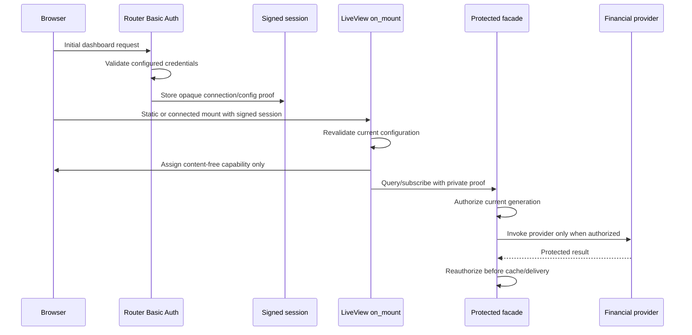
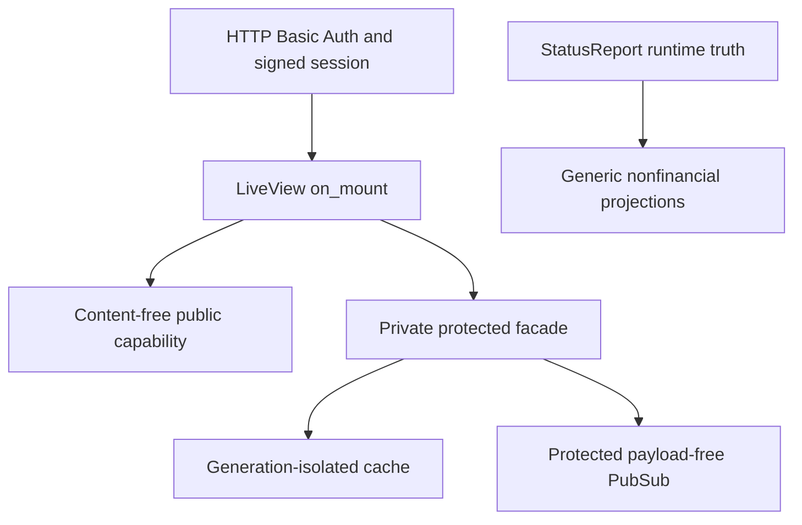

# feat: Enforce financial data authentication

## Summary

Establish a server-owned financial access proof at the existing Basic Auth and
LiveView session boundary, then require that proof at one protected query,
cache, and PubSub facade. Keep the shared DashboardLive composition unchanged
and remove legacy accounting facts from generic web projections so future
financial UI can consume only the protected seam.

---

## Problem Frame

The current HTTP routes enforce optional Basic Auth, but the LiveView websocket
does not traverse router pipelines and receives no trusted authentication
evidence. StatusReport-derived web projections also still include token and
rate-limit facts, so hiding future cards in HEEx would not create a server-side
financial boundary (see origin: `docs/brainstorms/2026-07-12-build-order-requirements.md`).

---

## Assumptions

*This plan was authored without synchronous user confirmation. The items below
are agent inferences that fill implementation details not fixed by DREQ-021 or
DEC-015 and should remain visible during review.*

- A random browser-session connection generation plus an opaque keyed
  authentication-configuration generation is the smallest safe identity for
  cache isolation and reconnect invalidation; no credential-derived value is
  exposed in a public assign.
- Existing StatusReport token totals and rate-limit records are removed from
  generic dashboard, Build Order, and observability projections for every
  caller. Authenticated financial consumers must use the new protected facade
  instead of the generic runtime payload.
- Protected PubSub carries payload-free invalidation messages. Consumers reload
  through the same authorized facade, which avoids placing accounting records
  in the event bus while still supporting live refresh.

---

## Requirements

- R1. Derive financial access only from configured Basic Auth and trusted
  server session evidence; browser params, local state, route possession,
  writable mode, and supervisor authority never grant access. Traces to
  DREQ-021 and issue #1125.
- R2. Expose distinct, source-classified usage/grouping and provider-meter
  query paths and invoke their loaders only after a current access decision
  succeeds; denied callers receive the stable, content-free
  `authentication_required` result.
- R3. Publish only a versioned, content-free LiveView capability assign while
  retaining opaque proof material in server-private socket state. The locked
  descriptor has a concise accessible name, authentication-required reason,
  and authentication path without provider, account, usage, plan, quota,
  reset, freshness, or monetary facts.
- R4. Authenticate before protected cache lookup/store and PubSub subscribe,
  delivery, or reload. Cache and subscription identity must change across
  browser connection or auth-configuration generations.
- R5. Reject reconnects, old session markers, stale queued updates, and
  in-flight provider results after credentials or enforced-auth configuration
  changes; stale protected payloads must not be assigned, cached, emitted, or
  rendered.
- R6. Remove usage, token, and provider-meter facts from generic web/API/Build
  Order projections while preserving source-classified nonfinancial runtime
  state such as lifecycle, waiting reason, runtime, CI/review, identity, and
  progress.
- R7. Preserve Basic Auth, supervisor authentication, CSRF/same-origin,
  writable/read-only, Analytics, static asset, and existing nonfinancial
  dashboard behavior.
- R8. Keep `AiurWeb.DashboardLive`, dashboard components, and CSS outside this
  ticket in accordance with the DEC-015 individual-owner correction.

**Origin acceptance examples:** DREQ-021 in the origin document; issue #1125's
agent acceptance matrix supplies the security-specific scenarios.

---

## Scope Boundaries

- Do not edit or re-compose `AiurWeb.DashboardLive`, its HEEx component tree,
  dashboard CSS, or the merged DASH-007 Commands implementation.
- Do not ingest provider data, define usage/meter business semantics, render
  provider or cost cards, or implement DASH-015/DASH-031 presentation.
- Do not require authentication for currently permitted nonfinancial loopback
  read-only status.
- Do not grant financial access from supervisor credentials, writable mode,
  CSRF state, loopback origin, URL possession, or client-controlled values.
- Do not redesign the complete dashboard authentication scheme or modify
  runtime mutation authority.

### Deferred to Follow-Up Work

- Provider-meter and usage/cost composition: DASH-015 and DASH-031 consume the
  protected seam after their data providers land.
- Current-run nonfinancial presentation: DASH-022 consumes StatusReport/Units
  facts independently of financial availability.

---

## Context & Research

### Relevant Code and Patterns

- `src/lib/aiur_web/router.ex` owns optional Basic Auth and browser session
  pipelines; the protected session marker belongs at this trusted boundary.
- `src/lib/aiur_web/endpoint.ex` passes the signed cookie session to the
  `/live` socket but the socket bypasses router pipelines.
- `src/lib/aiur_web/supervisor_auth.ex` demonstrates isolated, constant-time
  credential policy and fixed authority separation.
- `src/lib/aiur_web/control_center_cache.ex` supplies bounded serialized-cache
  conventions, but protected caching needs independent generation-aware state.
- `src/lib/aiur_web/observability_pubsub.ex` supplies payload-free invalidation
  precedent; financial updates require a separate authorized topic.
- `src/lib/aiur_web/presenter.ex` and
  `src/lib/aiur_web/build_order_presenter.ex` currently project legacy
  StatusReport token/rate-limit facts and are the generic nonleakage boundary.

### Institutional Learnings

- `CONTRIBUTING.md` requires boundary validation, structured errors, adjacent
  public specs, deterministic tests without sleeps, and security-critical
  primitives with one implementation.
- The approved implementation pointers require a signed session marker, a
  router-level `on_mount` hook, authorization before provider calls, and
  source/context classification rather than global field-name redaction.

### External References

- Phoenix LiveView 1.1.25 lifecycle and private socket state:
  https://hexdocs.pm/phoenix_live_view/1.1.25/Phoenix.LiveView.html
- Phoenix LiveView 1.1.25 router `live_session` contract:
  https://hexdocs.pm/phoenix_live_view/1.1.25/Phoenix.LiveView.Router.html
- Plug 1.19.1 session and Basic Auth contracts:
  https://hexdocs.pm/plug/1.19.1/Plug.Conn.html and
  https://hexdocs.pm/plug/1.19.1/Plug.BasicAuth.html

---

## Key Technical Decisions

- Use one `FinancialDataAccess` policy for HTTP authentication evidence,
  signed-session verification, configuration-generation rechecks, LiveView
  capability projection, and source-aware public StatusReport filtering. This
  prevents parallel auth or classification rules.
- Attach the policy through a router `live_session on_mount` contract. Store
  opaque access context only in socket private state and expose a separate
  value-free capability assign for DASH-015.
- Use a dedicated supervised protected facade for query/cache/PubSub rather
  than extending the generic Control Center cache or observability topic. This
  makes authorization ordering and eviction independently testable.
- Keep usage/grouping and provider-meter query classes explicit at the facade
  boundary. Callers cannot smuggle an unclassified record source through a
  generic protected-loader entrypoint.
- Recheck authorization both immediately before a provider call/cache delivery
  and after a provider call completes. A generation change during an in-flight
  load discards the result instead of caching or returning it.
- Keep generic runtime projections explicitly nonfinancial. Removal happens at
  known StatusReport-derived construction sites, not by recursively deleting
  fields with names such as provider, backend, model, or progress.

---

## Open Questions

### Resolved During Planning

- How can LiveView receive trusted auth evidence without editing
  `DashboardLive`? Persist a server-generated proof in the signed browser
  session and validate it in router-owned `live_session on_mount`.
- Should the generic observability API reveal financial fields when Basic Auth
  succeeds? No. The issue makes generic APIs nonfinancial and reserves
  accounting access for the protected facade, preventing accidental bypass.
- Can the generic dashboard PubSub topic be reused because its current message
  is payload-free? No. DREQ-021 requires an independently authorized
  subscription/delivery seam even when invalidations contain no facts.

### Deferred to Implementation

- Exact internal encoding of the keyed configuration proof may follow the
  repository's available crypto primitives, provided tests prove no raw or
  directly hashable credentials enter session, assigns, logs, cache keys, or
  events.

---

## High-Level Technical Design

> *This illustrates the intended approach and is directional guidance for
> review, not implementation specification. The implementing agent should
> treat it as context, not code to reproduce.*

---

## Implementation Units

### U1. Establish trusted HTTP and LiveView access evidence

**Goal:** Create the single financial policy, persist opaque evidence only
after successful configured Basic Auth, and attach a content-free capability
through router-owned `on_mount` without changing `DashboardLive`.

**Requirements:** R1, R3, R5, R7, R8

**Dependencies:** None

**Files:**
- Create: `src/lib/aiur_web/financial_data_access.ex`
- Modify: `src/lib/aiur_web/router.ex`
- Test: `src/test/aiur_web/financial_data_access_test.exs`
- Test: `src/test/aiur_web/router_auth_test.exs`
- Test: `src/test/aiur_web/live/dashboard_live_test.exs`

**Approach:**
- Snapshot configured Basic Auth inputs at the trusted router boundary and
  create a random connection generation only after credential validation.
- Bind connection and auth-configuration generations with a keyed proof kept
  inside the signed cookie session; fail closed when credentials, endpoint
  configuration, proof material, or session evidence are absent/ambiguous.
- Run the hook for both static and connected mounts, retain proof context in
  socket private state, and assign only the versioned locked/available
  capability descriptor, including the value-free accessible locked
  name/reason/authentication path required by the ticket.

**Execution note:** Start with failing policy and LiveView integration tests;
credential/session ordering is the security property, not an implementation
detail to test afterward.

**Patterns to follow:**
- `src/lib/aiur_web/router.ex` Basic Auth and browser pipelines
- `src/lib/aiur_web/supervisor_auth.ex` fixed authority and constant-time
  credential handling
- Phoenix LiveView `live_session` and `put_private` contracts

**Test scenarios:**
- Happy path: configured credentials plus matching Basic Auth produce a signed
  session proof and an available content-free capability on static and
  connected mounts.
- Error path: absent, partial, invalid, ambiguous, or stale credentials never
  produce an authorized proof; required HTTP access retains its existing 401
  behavior and optional loopback access mounts with the locked descriptor.
- Edge case: password, username, auth-required configuration, or endpoint
  secret changes invalidate an old session/reconnect; writable mode and
  supervisor token changes do not grant or revoke financial read access.
- Security: client params and a forged marker cannot change the capability;
  rendered HTML and assigns contain no credential, proof, generation, provider,
  account, plan, quota, usage, token, cost, reset, or freshness sentinel.
- Accessibility: locked mode exposes only its stable name, reason, and
  authentication path; those fields contain none of the protected fixture
  vocabulary.

**Verification:**
- Every dashboard LiveView route is under one router-owned hook and
  `src/lib/aiur_web/live/dashboard_live.ex` remains byte-for-byte unchanged.

### U2. Add the protected query, cache, and PubSub facade

**Goal:** Provide the only supported financial provider boundary, with
authorization before provider/cache/subscription activity and generation-safe
delivery.

**Requirements:** R2, R4, R5, R7

**Dependencies:** U1

**Files:**
- Create: `src/lib/aiur_web/financial_data.ex`
- Modify: `src/lib/aiur.ex`
- Test: `src/test/aiur_web/financial_data_test.exs`
- Test: `src/test/aiur/application_test.exs`

**Approach:**
- Supervise a bounded cache whose keys include both opaque connection and
  current auth-configuration generations; prune stale generations before any
  lookup and never place denied results in cache state.
- Offer explicit usage/grouping and provider-meter operations over the shared
  authorization/cache machinery; reject unknown record-source classes before
  loader execution.
- Wrap direct and cached provider calls with pre- and post-load authorization
  checks so rotation during a load discards the result.
- Subscribe only authorized contexts to a dedicated generation-scoped topic,
  broadcast payload-free invalidations, and require event revalidation before
  reload/delivery.

**Execution note:** Build concurrency tests with messages, monitors, and
controlled provider functions; do not use sleeps.

**Patterns to follow:**
- `src/lib/aiur_web/control_center_cache.ex` serialized bounded caching
- `src/lib/aiur_web/observability_pubsub.ex` payload-free update delivery
- `src/test/aiur_web/control_center_cache_test.exs` deterministic blocked-loader
  concurrency

**Test scenarios:**
- Happy path: authorized direct/cached queries call the provider, reuse only the
  same connection/config cache identity, and authorized subscriptions receive
  a payload-free invalidation that reloads successfully.
- Error path: denied direct, cached, subscribe, and reload calls return
  `authentication_required` without invoking the provider, reading a protected
  cache entry, or joining a protected topic.
- Error path: an unknown or mismatched record-source class fails before loader
  execution and cannot populate either protected cache namespace.
- Edge case: a second authenticated connection cannot reuse the first
  connection's cache entry; credential/config rotation evicts old entries and
  invalidates old subscriptions and queued events.
- Concurrency: rotate configuration after a provider starts but before it
  returns; the sentinel result is discarded and absent from reply/cache/logs.
  Broadcast concurrently with subscriber termination without crash or leaked
  payload.

**Verification:**
- Tests establish the temporal order `authorize -> provider -> reauthorize ->
  cache/deliver` and prove no denied code path executes the provider closure.

### U3. Close legacy generic projection leaks

**Goal:** Ensure existing web/API/Build Order projections remain a
source-classified nonfinancial surface and cannot bypass the protected facade.

**Requirements:** R5, R6, R7, R8

**Dependencies:** U1

**Files:**
- Modify: `src/lib/aiur_web/presenter.ex`
- Modify: `src/lib/aiur_web/control_center_presenter.ex`
- Modify: `src/lib/aiur_web/build_order_presenter.ex`
- Test: `src/test/aiur_web/presenter_test.exs`
- Test: `src/test/aiur_web/control_center_presenter_test.exs`
- Test: `src/test/aiur_web/build_order_presenter_test.exs`
- Test: `src/test/aiur_web/controllers/observability_api_controller_test.exs`
- Test: `src/test/aiur_web/live/dashboard_live_test.exs`

**Approach:**
- Stop constructing token totals, per-agent token records, and provider
  rate-limit snapshots in generic Presenter and Build Order view models.
- Preserve explicit nonfinancial StatusReport/Build Order facts at the same
  construction sites rather than applying a recursive field-name filter.
- Assert generic JSON, disconnected HTML, connected assigns, and rendered
  diffs contain none of the financial sentinel vocabulary.

**Execution note:** Characterize the current generic payload first, then turn
the sentinel assertions red before removing protected fields.

**Patterns to follow:**
- `src/lib/aiur_web/presenter.ex` explicit allowlisted web projection
- `src/lib/aiur_web/build_order_presenter.ex` pure source-aware view model

**Test scenarios:**
- Security: StatusReport fixtures containing unique token and rate-limit
  sentinels produce generic state/issue JSON, DashboardLive assigns/HTML, and
  Build Order view models with no sentinel or protected record key.
- Regression: lifecycle, work state, waiting reason, runtime, tracker identity,
  CI/review, activity stage, and progress sentinels remain present and correct.
- Classification: nonfinancial backend/model-style values in runtime or
  Decision provenance remain visible; only accounting records from known
  StatusReport financial contexts are removed.
- Error path: provider-unavailable fallbacks remain nonfinancial and preserve
  their existing health/error semantics.

**Verification:**
- Generic controllers and LiveView assign state contain no protected legacy
  records in optional unauthenticated mode, and no generic authorized bypass is
  introduced.

### U4. Prove the composed security matrix and regressions

**Goal:** Exercise the policy and facade across route, session, LiveView,
PubSub/cache race, generic API, and existing authorization boundaries before
handoff.

**Requirements:** R1-R8

**Dependencies:** U1, U2, U3

**Files:**
- Test: `src/test/aiur_web/financial_data_access_test.exs`
- Test: `src/test/aiur_web/financial_data_test.exs`
- Test: `src/test/aiur_web/router_auth_test.exs`
- Test: `src/test/aiur_web/live/dashboard_live_test.exs`
- Test: `src/test/aiur_web/controllers/observability_api_controller_test.exs`
- Test: `src/test/aiur_web/supervisor_auth_test.exs`
- Test: `src/test/aiur/decision_api_integration_test.exs`

**Approach:**
- Use synthetic, unmistakable financial sentinels and explicit nonfinancial
  controls across HTML, serialized JSON, assigns/process state, cache state,
  PubSub messages, and captured logs.
- Cover optional read-only, enforced read-only, writable, supervisor, invalid
  credential, reconnect, config-rotation, and stale-delivery combinations.
- Re-run focused existing Analytics, CSRF/same-origin, supervisor, and write
  gate regressions without changing their authority decisions.

**Patterns to follow:**
- Existing router and LiveView endpoint setup helpers in
  `src/test/aiur_web/router_auth_test.exs` and
  `src/test/aiur_web/live/dashboard_live_test.exs`
- `CONTRIBUTING.md` deterministic concurrency and focused gate policy

**Test scenarios:**
- Matrix: financial access varies only with configured validated dashboard
  Basic Auth; writable/read-only and supervisor dimensions do not affect it.
- Nonleakage: every denied surface is free of provider/account/auth-mode/plan/
  quota/rate/credit/cost/token/percentage/reset/freshness/LKG sentinels while
  public runtime controls remain visible.
- Regression: existing Analytics access, Basic Auth response shape, supervisor
  bearer behavior, CSRF/same-origin checks, and writable mutation rejection are
  unchanged.

**Verification:**
- Focused security/LiveView tests, formatting, warnings-as-errors compilation,
  strict lint/spec checks, and Dialyzer pass on the exact current-base-integrated
  head.

---

## System-Wide Impact

- **Interaction graph:** Router authentication establishes session evidence;
  `on_mount` converts it into private server context and a public capability;
  protected consumers query/cache/subscribe only through the facade. Generic
  presenters independently allowlist nonfinancial runtime facts.
- **Error propagation:** Missing, stale, or ambiguous access always becomes the
  same content-free authentication-required result. Provider failures remain
  provider results only after authorization and never replace auth errors.
- **State lifecycle risks:** Credential/config rotation can race cache loads and
  queued PubSub events; pre/post authorization plus generation eviction is the
  mitigation. Reconnect re-runs the same session proof validation.
- **API surface parity:** Generic state/issue JSON and Build Order view models
  lose legacy accounting records. Future financial HTTP/LiveView consumers
  must use the protected facade rather than adding fields back.
- **Integration coverage:** Endpoint-level LiveView tests must prove the signed
  session reaches both static and connected hooks; unit tests alone cannot.
- **Unchanged invariants:** DashboardLive composition, nonfinancial status,
  supervisor authority, write gates, same-origin/CSRF, Analytics, and provider
  business semantics remain owned by their existing modules/tickets.

---

## Risks & Dependencies

| Risk | Mitigation |
|------|------------|
| A credential-derived generation leaks an offline-verifiable secret hint | Use a keyed opaque proof under endpoint secret material; expose neither proof nor generation in assigns/events/logs. |
| Config rotates during provider execution | Reauthorize after completion and discard before reply/cache when the generation no longer matches. |
| A generic projection silently reintroduces token or meter fields | Explicit construction-site allowlists plus sentinel tests across API, LiveView state, and Build Order models. |
| Shared DashboardLive work conflicts with merged DASH-007 or lane L2 | Do not modify DashboardLive/components/CSS; attach via router `live_session`. |
| Cache or topic identity crosses browser sessions | Include random connection generation and auth-config generation; test second-session isolation. |
| Security tests become flaky | Use controlled messages, monitors, and process-state inspection; no sleeps or timing guesses. |

---

## Documentation / Operational Notes

- The content-free capability contract is versioned for DASH-015 and should be
  documented in module docs/specs; no operator configuration key or stored-data
  migration is introduced.
- Auth credential rotation intentionally invalidates connected financial
  access until the browser completes a new authenticated HTTP/session cycle.
- Manual authenticated-versus-optional browser proof remains an Executor-root
  acceptance step after integration; this agent worktree must not bypass the
  repository's guarded `--test` workflow.

---

## Sources & References

- **Origin document:**
  [docs/brainstorms/2026-07-12-build-order-requirements.md](../brainstorms/2026-07-12-build-order-requirements.md)
- Approved issue contract and DEC-015 amendment: #1125
- Planning authority: commit `4d8de9508206e08e314f2730cd916501a3b4cafd`
- Execution amendment authority: commit
  `c6a8bafe3b777ba1781e8a786a71ae87ddf873d9`
- Related code: `src/lib/aiur_web/router.ex`,
  `src/lib/aiur_web/endpoint.ex`, `src/lib/aiur_web/presenter.ex`,
  `src/lib/aiur_web/control_center_cache.ex`,
  `src/lib/aiur_web/observability_pubsub.ex`
- Phoenix LiveView 1.1.25:
  https://hexdocs.pm/phoenix_live_view/1.1.25/Phoenix.LiveView.html
- Plug 1.19.1: https://hexdocs.pm/plug/1.19.1/Plug.Conn.html
