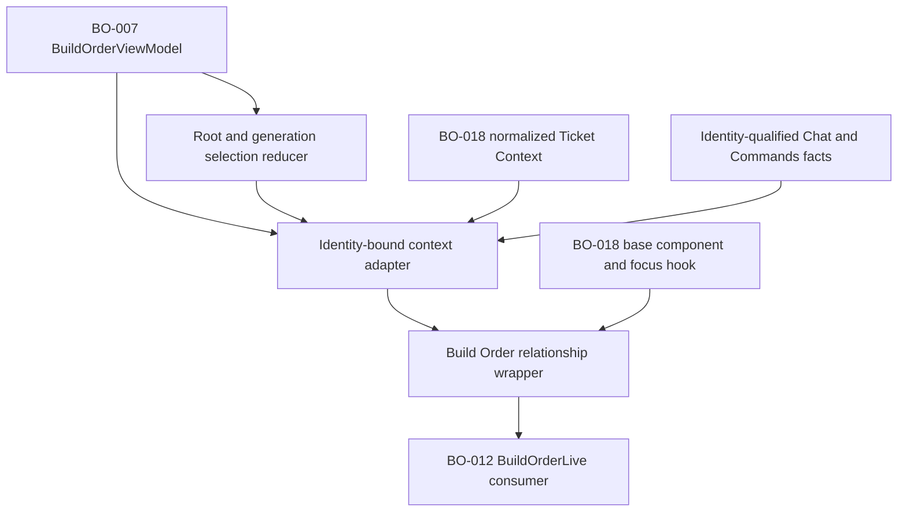
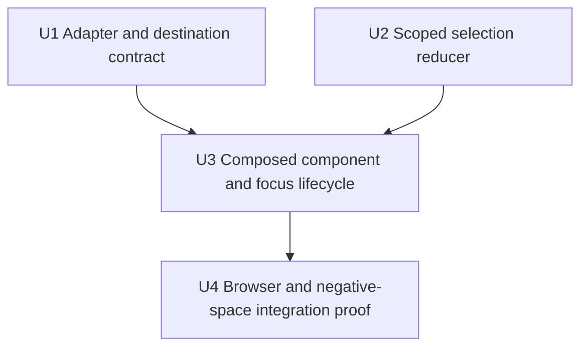
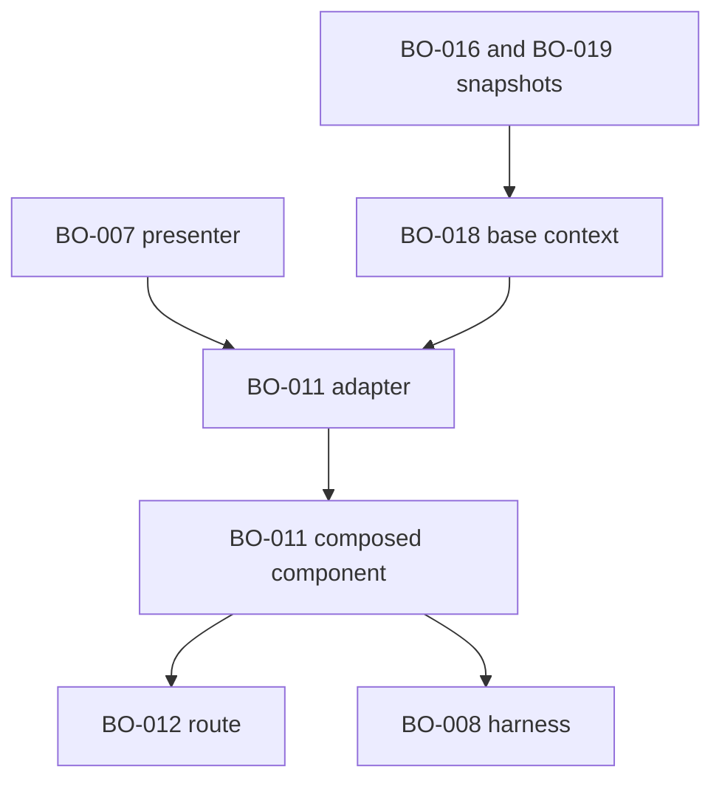

# feat: Adapt ticket context to Build Order

## Summary

Add a pure identity-bound adapter and root/generation-scoped selection reducer, then compose BO-007 relationship truth into BO-018's existing accessible Ticket Context through a narrow read-only component seam. Reuse the shipped browser harness to prove relationship replacement, focus lifecycle, destination gating, and non-mutation before BO-012 wires the real route.

---

## Problem Frame

BO-007 now exposes bounded selected-member relationships and BO-018 exposes normalized all-state ticket context, but no contract safely composes them. Without BO-011, a route consumer would have to duplicate identity joins, edge diagnostics, destination eligibility, selection reconciliation, and focus policy in LiveView assigns, risking stale-root context and mutable-looking graph behavior (see origin: `docs/brainstorms/2026-07-12-build-order-requirements.md`).

---

## Assumptions

*This plan was authored without synchronous user confirmation. The items below are agent inferences that fill gaps in the input — un-validated bets that should be reviewed before implementation proceeds.*

- The generic BO-018 component should gain a neutral extension slot and focus metadata rather than accepting Build Order-specific fields or being copied into a second dialog.
- Same-root graph-generation changes should retain an open selection only when the exact repository-qualified member remains present; root changes, removed members, and LiveView reconnect initialization should clear it.
- Chat and Commands route owners supply normalized identity-qualified destination facts. BO-011 validates and presents those facts but does not invent a route or infer eligibility from navigation state.
- Until BO-012 lands the production route, BO-008's deterministic Ticket Context fixture is the correct integration surface for real-browser replacement and focus evidence.

---

## Requirements

- R1. Compose BO-007's selected node, upstream/downstream edges, all five edge states, readiness, health, activity, metadata warnings, and diagnostics with BO-018's base context without recomputing or rewriting either owner's truth. (BOREQ-011)
- R2. Join graph selection, base context, and destination facts only by exact joinable repository-qualified identity; bare identifiers, titles, topics, and paths are never join keys. (BOREQ-011)
- R3. Render semantic `Blocked by` and `Blocking` lists with direction, edge-state text, affected readiness, and supplied external, missing, cyclic, terminal-unsatisfied, and metadata diagnostics. (BOREQ-011)
- R4. Allow relationship replacement and back navigation only for exact configured-repository members. Other-repository endpoints remain nonfetchable diagnostics and may expose only an identity-matched canonical outbound GitHub issue link; missing endpoints remain unavailable. (BOREQ-011)
- R5. Scope disposable selection to canonical root, graph generation, and ticket identity; reconcile same-root generations deterministically and reject stale completion tokens, prior-root patches, and reconnect state. (BOREQ-011)
- R6. Bind Issue/Pull request, Chat, and Commands destinations truthfully. GitHub links remain canonical to the selected configured-repository identity; Chat requires an exact active/readable route; Commands requires an exact readable Decision destination; missing, stale, unauthorized, inactive, unreadable, and invalid destinations remain unavailable with controlled reasons. (BOREQ-011)
- R7. Preserve BO-018 detail/history/loading/stale/missing/restart, bounded Logs, capability, and focus-trap semantics while adding replacement-heading focus, Escape/close behavior, and deterministic origin-card restoration. (BOREQ-011)
- R8. Keep the adapter and component read-only: no provider, filesystem, log, clock, or process lookup and no GitHub, Decision, chat, pause/resume, capacity, lifecycle, membership, label, phase, lane, or dependency mutation handler. (DEC-008)

**Origin acceptance examples:** AE7 (keyboard relationship navigation and origin focus restoration)

---

## Scope Boundaries

- Do not fetch or cache ticket detail/history, parse logs, sanitize provider content, or change BO-016/019 ownership.
- Do not recompute adjacency, SCCs, edge states, readiness, activity joins, provider health, or graph diagnostics outside BO-007.
- Do not own Build Order catalog/root URLs, route loading, graph-card rendering, pan/zoom, canvas-wide interaction hardening, or responsive/performance capstone work.
- Do not create Chat or Commands destinations, treat navigation as action success, or add any mutation protocol.
- Do not widen graph-card or layout-worker payloads with issue bodies or other context-only data.

### Deferred to Follow-Up Work

- BO-012/#1099 wires this adapter and selection reducer into the production `BuildOrderLive` route instead of recreating their policy.
- BO-013/#1100 and BO-014/#1101 harden canvas-wide interaction, touch, redraw, responsive scale, and performance while preserving this context contract.
- BO-015/#1102 owns final integrated authenticated browser and real CLI/TUI acceptance evidence.

---

## Context & Research

### Relevant Code and Patterns

- `src/lib/aiur_web/build_order_presenter.ex` and `src/lib/aiur_web/build_order_view_model.ex` own relationship selection, edge/readiness truth, diagnostics, and normalized capability facts.
- `src/lib/aiur_web/build_order/ticket_context_presenter.ex` owns exact-identity base context normalization, bounded Logs, canonical Issue/Pull request validation, and relative Chat/Commands route validation.
- `src/lib/aiur_web/components/operator_control_center/ticket_context.ex` and `src/priv/static/ticket-context-dialog-hook.js` own the reusable semantic dialog/region and focus trap.
- `src/lib/aiur_web/components/operator_control_center/build_order_graph.ex` provides the current semantic graph-card seam that BO-012 will make selectable.
- `src/lib/aiur_web/components/operator_control_center/fleet_filters.ex` is the established pure-reducer/thin-LiveView pattern; `src/lib/aiur_web/operator_control_center/decision_path.ex` is the bounded relative-route codec precedent.
- `src/test/browser/fixture_server.exs` and `src/browser/tests/ticket-context.browser.spec.mjs` are the shipped BO-008 browser harness and current Ticket Context keyboard/accessibility proof.

### Institutional Learnings

- No `docs/solutions/` directory exists in this checkout. The current merged BO-007 and BO-018 implementations, their focused tests, and DEC-015's one-writer lane packet are the authoritative local precedents.

### External References

- External research is intentionally omitted: the required Phoenix/LiveView, focus-hook, URL, identity, and browser-test patterns are current and directly represented in the repository.

---

## Key Technical Decisions

- Keep graph truth immutable: the adapter invokes BO-007's relationship API and carries edge states, readiness, diagnostics, and warnings through unchanged; it may classify endpoint eligibility but never edge semantics.
- Introduce one pure selection policy: model root identity plus planning generation define the scope, deterministic opaque member keys prevent bare-number joins, and monotonically rotated request tokens guard delayed detail completion even when navigation returns to a previously selected identity.
- Compose rather than fork: add a generic extension slot and bounded focus metadata to BO-018's component, then render Build Order relationship sections from a dedicated wrapper component.
- Qualify destination facts twice: BO-007 keeps normalized route facts with their trusted identity/readability state, and BO-011 requires exact selected identity before forwarding them through BO-018's existing URL validators.
- Keep external links diagnostic-only: an other-repository edge is never selectable and only gets an outbound link when its supplied URL canonically matches that edge endpoint's repository-qualified identity.
- Make focus policy data-driven: a navigation-only focus revision triggers heading focus after open, replacement, or back without reacting to ordinary generation patches, while a root-qualified bounded origin element identifier lets the existing hook restore focus only to the originating graph scope when the dialog is destroyed.
- Fix the component event surface to three navigation-only event names owned by BO-011 (`open` remains the graph-card caller's concern; the context owns replace, back, and close). BO-012 implements those exact handlers and cannot substitute a mutation event name through component assigns.

---

## Open Questions

### Resolved During Planning

- Should BO-011 create Chat or Commands routes? No. Current code has no Chat route, and DEC-008 requires route owners to supply normalized capabilities; BO-011 only checks identity/readability and renders availability.
- Should selection live only in client JavaScript? No. The ticket explicitly rejects client-only selection truth; a pure server-side reducer owns root/generation/ticket reconciliation, while the hook owns focus mechanics only.
- Should relationship diagnostics be rebuilt for display? No. BO-007's controlled `Diagnostic` values and edge text remain authoritative and are rendered directly.
- Should root changes preserve the open dialog? No. Canonical root changes clear selection to prevent a prior root from reopening through delayed completion or reconnect.

### Deferred to Implementation

- The final internal names of adapter view records and selection tokens may adjust to match formatter/spec ergonomics, provided the public identity, scope, and no-I/O contracts remain explicit.
- BO-012 may choose LiveView assign names when it consumes the reducer, but it implements BO-011's fixed replace/back/close navigation event names rather than supplying arbitrary callbacks; BO-011 still owns no LiveView handler.

---

## High-Level Technical Design

> *This illustrates the intended approach and is directional guidance for review, not implementation specification. The implementing agent should treat it as context, not code to reproduce.*

The adapter accepts only normalized in-memory values. A selection token binds canonical root, graph generation, and exact member identity; the same token must still be current when base-context data is composed. Relationship rows preserve BO-007 edge/diagnostic records, add only endpoint eligibility and affected-readiness references, and forward safe destinations through BO-018's URL boundary.

---

## Implementation Units

### U1. Add the identity-bound context adapter

**Goal:** Produce one bounded Build Order context view from current BO-007 relationships, a current BO-018 base view, and exact destination facts without I/O or semantic recomputation.

**Requirements:** R1, R2, R3, R4, R6, R8

**Dependencies:** Landed BO-007 and BO-018 contracts

**Files:**
- Create: `src/lib/aiur_web/build_order/ticket_context_adapter.ex`
- Modify: `src/lib/aiur_web/build_order_presenter.ex`
- Modify: `src/lib/aiur_web/build_order_view_model.ex`
- Modify: `src/lib/aiur_web/build_order/ticket_context_presenter.ex`
- Test: `src/test/aiur_web/build_order/ticket_context_adapter_test.exs`
- Test: `src/test/aiur_web/build_order_presenter_test.exs`
- Test: `src/test/aiur_web/build_order/ticket_context_presenter_test.exs`

**Approach:**
- Preserve identity and controlled availability/readability reason metadata in BO-007 capability normalization so a consumer can prove the route belongs to the selected member.
- Require current model scope, selected identity, and base-context identity to agree exactly before returning an available view; otherwise return a controlled unavailable status with no guessed join.
- Convert each authoritative edge into a bounded relationship row that retains the edge record, direction, state, diagnostics, and affected node readiness unchanged while separately deriving endpoint selectability.
- Resolve internal endpoints only against the current model's exact member identities. Treat missing or other-repository endpoints as nonfetchable; validate a diagnostic outbound GitHub issue URL against the external endpoint identity before retaining it.
- Retain only BO-018's exact Issue/Pull request capabilities plus identity-qualified Chat and Commands facts. Re-run BO-018's canonical URL/relative-route validation and map controlled stale/missing/unauthorized/inactive/unreadable reasons to concise text.

**Execution note:** Implement the public normalization and identity-failure tables test-first because malformed typed inputs are the primary security boundary.

**Patterns to follow:**
- Exact joins through `Aiur.TrackerIdentity.github_key/1`
- Controlled diagnostics through `Aiur.BuildOrder.Diagnostic`
- Canonical URL checks through `Aiur.BuildOrder.Bounded`
- Fail-closed view normalization in `AiurWeb.BuildOrder.TicketContextPresenter`

**Test scenarios:**
- Happy path: exact selected member and exact base identity preserve every base detail/history/log field while rendering both relationship directions and Issue/Pull request/Chat/Commands capabilities.
- Happy path: each of `cleared`, `blocking`, `terminal_unsatisfied`, `unknown`, and `cyclic` remains unchanged and carries non-color text plus the authoritative affected readiness.
- Edge case: metadata warnings and edge diagnostics remain controlled, bounded, ordered, and unchanged rather than being cleared or reclassified.
- Edge case: same issue number in another repository, same repository with a different provider ID, bare number, title, and local path all fail the join.
- Edge case: a current configured-repository endpoint is selectable; a missing native endpoint stays diagnostic; an other-repository endpoint is never selectable.
- Security: an external URL appears only when it canonically matches the external endpoint identity; cross-repository, credential-bearing, non-HTTPS, malformed, and oversized URLs are dropped.
- Destination: exact active/readable Chat and readable Commands routes are available; missing, stale, unauthorized, inactive, unreadable, identity-mismatched, and malformed routes are unavailable with controlled reasons.
- Integration: adapter output preserves BO-007 edge/readiness structs and BO-018 all-state fields without exposing provider callbacks, issue bodies in graph records, raw errors, paths, credentials, or capability URLs outside rendered links.

**Verification:**
- A caller can obtain a complete read-only adapter view using normalized values alone, and every mismatch or malformed input fails closed without altering source truth.

### U2. Add root/generation-scoped selection policy

**Goal:** Give BO-012 one pure reducer for open, relationship replacement, back, reconcile, close, reconnect, and stale-completion decisions.

**Requirements:** R2, R4, R5, R7, R8

**Dependencies:** Landed BO-007 view model

**Files:**
- Create: `src/lib/aiur_web/build_order/ticket_context_selection.ex`
- Test: `src/test/aiur_web/build_order/ticket_context_selection_test.exs`

**Approach:**
- Derive selection scope only from the current model's canonical root identity and planning generation; derive opaque member navigation values from full repository-qualified identities.
- Keep selected identity, relationship history capped to BO-007's 100-member graph bound, root-qualified origin element identifier, a navigation focus revision, and a monotonically increasing request sequence/token in immutable state. Suppress consecutive duplicate history entries.
- Permit open/replacement only when the opaque navigation value resolves uniquely to a current configured-repository member. Keep the original graph-card focus target across replacements and back navigation.
- On a same-root generation change, retain selection only when the exact selected member remains and filter history to surviving exact members. Rotate the request token for the reconciled generation without changing the navigation focus revision. Clear on root change, removal, invalid generation, reconnect initialization, or close.
- Rotate the request sequence/token for every accepted open, replacement, back, and retained-generation reconciliation. Make delayed data application conditional on that full current token so old-root, old-generation, replayed-same-identity, or replaced-ticket completion cannot reopen or overwrite context.

**Execution note:** Build the state-transition matrix test-first, including replayed and out-of-order transitions.

**Patterns to follow:**
- Pure reducer shape in `src/lib/aiur_web/components/operator_control_center/fleet_filters.ex`
- Generation-safe model contracts in `src/lib/aiur_web/build_order_view_model.ex`
- Opaque bounded identifiers through `Aiur.OpaqueIdentifier`

**Test scenarios:**
- Covers AE7. Happy path: opening from a card, replacing through `Blocked by`, replacing through `Blocking`, going back twice, and closing preserve the original root-qualified focus target and exact identity order while keeping history at or below 100 entries.
- Edge case: a same-root new generation retains the selected exact member and surviving history, while a removed selected member closes context.
- Edge case: a different canonical root with the same issue numbers clears selection and history.
- Error path: external, missing, duplicate, unjoinable, bare-number, wrong-repository, and stale-generation navigation values leave selection unchanged or closed.
- Error path: a delayed base-context token from a prior identity, generation, root, replacement, or reconnect is rejected; the current token is accepted.
- Lifecycle: close and reconnect initialization are idempotent and never reopen the previous selection.

**Verification:**
- Every selection transition is deterministic over immutable model/state inputs, and BO-012 can use the reducer without reproducing identity or generation policy in LiveView assigns.

### U3. Compose relationship rendering with the base context and focus hook

**Goal:** Render accessible Build Order relationship context without copying BO-018 markup or adding mutation handlers.

**Requirements:** R3, R4, R6, R7, R8

**Dependencies:** U1, U2

**Files:**
- Create: `src/lib/aiur_web/components/operator_control_center/build_order_ticket_context.ex`
- Modify: `src/lib/aiur_web/components/operator_control_center/ticket_context.ex`
- Modify: `src/priv/static/ticket-context-dialog-hook.js`
- Modify: `src/priv/static/dashboard.css`
- Test: `src/test/aiur_web/operator_control_center/build_order_ticket_context_test.exs`
- Test: `src/test/aiur_web/operator_control_center/ticket_context_test.exs`

**Approach:**
- Add a neutral optional section slot plus bounded focus-key/origin metadata to the existing base component; keep all base facts, Logs, destination rendering, close behavior, and dialog/region modes owned there.
- Add a dedicated wrapper that renders `Blocked by` and `Blocking` as semantic sections/lists. Use buttons only for selectable internal replacements, anchors only for validated external diagnostics, and plain unavailable diagnostics for missing endpoints.
- Render direction, controlled edge-state text, affected-readiness text, and diagnostic text independently of color. Keep touch targets at least 44px and namespace Build Order context styles.
- Extend the existing hook to focus the heading when the navigation focus revision changes and to restore the recorded root-qualified origin element when the dialog is destroyed. Keep focus trapping, Escape delivery, listener cleanup, and missing-origin behavior intact. A generation/token-only patch must not refocus the heading.
- Use BO-011-owned fixed event names for close, replace, and back navigation; do not accept caller-supplied callback names, define a LiveView handler, or render a form or mutating action.

**Patterns to follow:**
- Existing BO-018 dialog semantics and `TicketContextDialog` hook
- `Phoenix.Component` attr/slot declarations and semantic detail blocks
- Namespaced responsive/forced-color/reduced-motion rules in `src/priv/static/dashboard.css`

**Test scenarios:**
- Happy path: both named sections render semantic headings/lists, all five edge states, readiness, metadata warnings, and exact internal replacement values.
- Edge case: empty relationship directions render concise empty states without omitting the section name.
- Edge case: external and missing endpoints render as link-only and diagnostic-only respectively, never as replacement buttons.
- All-state: every BO-018 detail and history state remains visible and unchanged when relationship sections are present.
- Focus: initial mount focuses the heading, an accepted open/replacement/back navigation revision refocuses it, generation/token-only and unrelated LiveView patches do not steal focus, Escape closes, and destroy restores an existing root-qualified origin while tolerating a removed or different-root origin.
- Security: rendered HTML contains only the fixed close/back/replacement navigation callbacks and safe links; caller-supplied event names, prohibited GitHub/Decision/chat/pause/resume/capacity/membership/label/phase/lane/lifecycle/dependency mutation names, forms, and unsafe URLs are absent.
- Regression: generic region mode and dialog mode without Build Order sections retain existing BO-018 output and focus behavior.

**Verification:**
- The wrapper visibly composes rather than duplicates the base component, remains keyboard/touch accessible, and exposes navigation-only interaction.

### U4. Prove the composition in the browser harness

**Goal:** Exercise real LiveView patches and browser focus behavior without taking BO-012's production route ownership.

**Requirements:** R3, R4, R5, R6, R7, R8

**Dependencies:** U3

**Files:**
- Modify: `src/test/browser/fixture_server.exs`
- Modify: `src/browser/tests/ticket-context.browser.spec.mjs`
- Test: `src/test/aiur_web/build_order/ticket_context_adapter_test.exs`
- Test: `src/test/aiur_web/build_order/ticket_context_selection_test.exs`

**Approach:**
- Extend the deterministic Ticket Context fixture with internal upstream/downstream members, one external diagnostic, controlled unavailable destinations, and server-side reducer transitions.
- Drive opening from a real focusable origin card, keyboard relationship replacement/back, root/generation change, stale completion attempt, Escape/close, and focus restoration through LiveView events.
- Assert responsive 320/768/1440 behavior, 200% text zoom, reduced motion, forced colors, minimum interaction targets, no document overflow, and axe results using the existing spec infrastructure.
- Keep fixture data synthetic and normalized; do not start providers, hydrate every graph member, parse logs, or add a browser-only selection cache.

**Patterns to follow:**
- Current `/ticket-context` fixture and Playwright/axe setup
- Browser measurement helpers and exact LiveView connection readiness checks
- BO-008 fixture isolation and synthetic marker policy

**Test scenarios:**
- Covers AE7. Keyboard-only user opens from a graph-card control, follows both relationship directions, goes back, closes with Escape, and returns focus to the original card.
- Integration: replacement/back changes the heading after a LiveView patch and focuses it; a generation/token-only or unrelated patch leaves the user's focused destination/control alone.
- Integration: switching roots or removing the selected member closes context; a delayed old token cannot restore it.
- Destination: available Issue/Pull request/Chat/Commands links have exact safe href/target semantics; unavailable stale/missing/unauthorized variants show reasons; external diagnostic opens only its validated outbound URL.
- Responsive/accessibility: semantic lists, non-color states, 44px controls, focus visibility, forced colors, reduced motion, 200% zoom, and no overflow pass at all fixture sizes.
- Negative space: fixture events contain only open/replace/back/close/root-generation navigation and no domain/runtime mutation path.

**Verification:**
- The focused browser spec passes against the production component/hook assets and proves operator-visible replacement/focus behavior across real LiveView patches.

---

## System-Wide Impact

- **Interaction graph:** BO-007 and BO-018 feed pure adapter output; the wrapper delegates base rendering and focus mechanics; BO-012 later owns LiveView provider subscriptions/events.
- **Error propagation:** Invalid identity, stale token, malformed route, and unsafe external URL become controlled unavailable states. Raw provider errors and unsafe values never reach the adapter view or DOM.
- **State lifecycle risks:** Root/generation changes, removed members, replacement history, reconnect, and delayed completions can otherwise resurrect stale selection; U2 makes those transitions explicit and testable.
- **API surface parity:** BO-018 remains root-independent for Units and other consumers. Only the generic extension/focus metadata seam changes; Build Order-specific relationships remain in the wrapper.
- **Integration coverage:** Browser tests prove hook behavior across actual LiveView patches; pure and component tests prove exhaustive truth tables and mutation absence.
- **Unchanged invariants:** GitHub remains dependency truth, BO-016/019 remain provider owners, BO-007 remains the only edge/readiness owner, BO-018 remains the base context owner, and Build Order remains read-only.

---

## Risks & Dependencies

| Risk | Mitigation |
|------|------------|
| Adapter accidentally reclassifies edge/readiness truth | Store/render authoritative BO-007 records and table-test all states plus struct equality. |
| Same issue number or stale completion crosses root/repository/generation | Use exact `TrackerIdentity.github_key/1`-derived navigation/scope tokens, rotate a monotonic request sequence on every accepted transition, and reject mismatched request tokens. |
| Component fork causes BO-018 all-state drift | Add a neutral slot to the existing component and regression-test every base detail/history state. |
| Destination path is safe syntactically but belongs to another ticket | Preserve trusted capability identity/readability status and require exact selected identity before BO-018 revalidates the href. |
| Focus restoration steals focus on ordinary patches or a new root's similarly numbered card | Refocus only when a navigation revision changes; root-qualify the origin identifier and restore only on destroy to that exact existing origin. |
| L1/L2 shared focus/CSS seam drifts | Keep hook changes generic and CSS namespaced; BO-018 is already merged and no other L1/L2 writer is dispatched. |
| BO-012 duplicates policy before consumption | Publish the reducer/adapter as explicit public contracts and record the required consumer boundary in workpad/PR handoff. |

---

## Dependencies / Prerequisites

- BO-007/#1095 and BO-018/#1105 are closed and merged into `develop` through PRs #1196 and #1209.
- DEC-015 assigns BO-011 to L1 under BO-007 and requires work to target exact current `develop` while preserving this ticket's individual acceptance evidence.
- BO-012/#1099 remains blocked on BO-011 and is not dispatched, so no production route consumer currently competes for these files.

---

## Documentation / Operational Notes

- No runtime configuration, persistence, migration, provider process, or rollout flag is introduced.
- Public functions added under `src/lib/` require adjacent specs and the scoped gate must include compile-as-errors, format, affected ExUnit tests with `--max-cases 4`, and the focused browser spec.
- Agent workspaces must not run the real `aiurdev --test` manual path. BO-015 owns final integrated manual evidence; this ticket supplies focused browser and contract evidence.
- Before CI handoff, integrate the exact current `develop` tip and prove it is an ancestor of the pushed head as required by DEC-015.

---

## Sources & References

- **Origin document:** `docs/brainstorms/2026-07-12-build-order-requirements.md`
- Ticket contract: `docs/build-order/tickets/BO-011-build-ticket-context.md`
- Implementation anchors: `docs/build-order/08-implementation-pointers.md`
- Decisions: `docs/build-order/05-technical-decisions.md` (DEC-003, DEC-008, DEC-009)
- Execution ownership: `docs/build-order/11-execution-amendment.md` (DEC-015, L1)
- Approved planning authority: `4d8de9508206e08e314f2730cd916501a3b4cafd`
- DEC-015 policy authority: `c6a8bafe3b777ba1781e8a786a71ae87ddf873d9`
- Related issues/PRs: #1095 / #1196, #1105 / #1209, #1098, #1099
