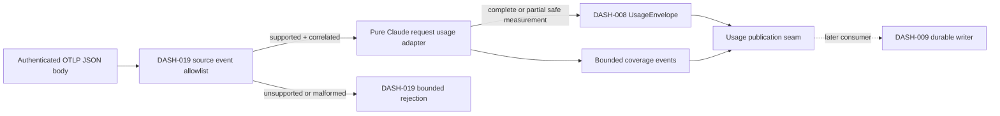

# feat: Normalize Claude request usage

## Summary

Extend the authenticated Claude telemetry boundary just enough to preserve its pinned request accounting fields exactly, then map accepted `claude-repl` events through a pure adapter into versioned `UsageEnvelope` and bounded coverage outputs. Runtime wiring remains on DASH-019's receiver and deliberately adds no persistence, alternate correlation, or interactive-output source.

---

## Problem Frame

DASH-019 authenticates and correlates Claude Code `api_request` events, while DASH-008 defines the raw accounting envelope, but the landed boundary currently drops exact cost, occurrence time, query source, and effort. DREQ-010 requires those trusted events to become exactly attributed request deltas with additive Claude cache semantics and no transcript, TUI, browser, or receipt-time inference (see origin: `docs/brainstorms/2026-07-12-build-order-requirements.md`).

---

## Assumptions

*This plan was authored without synchronous user confirmation. The items below are agent inferences that fill gaps in the input — un-validated bets that should be reviewed before implementation proceeds.*

- Add `query_source` as an optional, bounded top-level `UsageEnvelope` field beside model and effort; the landed contract has no semantically correct existing field for this required source value, and placing it in `attribution`, `source`, `thread_id`, or `turn_id` would corrupt downstream identity semantics. Keep it optional so existing schema-version-1 records remain valid before DASH-009 durability exists.
- Map DASH-019's trusted `claude-repl` backend to the fixed envelope backend `remote_control` and its `otlp_http_json` transport to `otlp`; headless `claude` normalization remains DASH-029 work.
- Use an explicit unknown Claude account-generation context and auth mode because the landed DASH-019 correlation proves the worker/session generation but does not prove provider-account continuity. Do not mint or infer an account generation locally.
- Publish normalized envelope and coverage messages beside the existing authenticated telemetry broadcast so downstream durability can subscribe later; do not call or anticipate DASH-009's still-separate writer API.
- Treat the pinned `claude_code.api_request` contract as non-authoritative for provider totals because it exposes dimensions and estimated cost but no separately declared structured total.

---

## Requirements

- R1 (DREQ-010). Only DASH-019-authenticated, source-version-allowlisted, current-generation Claude request events may produce a DASH-008 envelope.
- R2 (DREQ-010). Preserve exact request identity, trusted run/repository-qualified ticket/attempt/session/backend correlation, model, query source, effort, occurrence time, source revision, and exact USD estimate without raw content. Require trusted worker and producer generations and bind them into the counter epoch and deterministic identity without inventing new account or tracker attribution fields.
- R3 (DREQ-010 / DREQ-008). Map base input, cache creation, cache read, and output into distinct raw request dimensions; pin a relationship revision under which the three input dimensions are additive and no provider total is authoritative.
- R4. Derive deterministic idempotency from official request-or-sequence identity plus authenticated producer/session generation so exporter retry is stable while replacement generations remain distinct; never deduplicate or persist in this ticket.
- R5. Return and publish bounded, content-free coverage for unsupported source or relationship revisions, missing identity, ambiguous measurement semantics, and absent optional fields; missing values never become zero.
- R6. Preserve the negative source boundary: HookTurn, HookEvents, transcript, DisplayTailer, StatusLine, and browser state cannot create or alter accounting output.
- R7. Keep source-specific exact decimal decoding ahead of binary float conversion and retain no disallowed attribute, capability, account identity, credential, path, prompt, response, or raw payload.

---

## Scope Boundaries

- Do not add or reimplement OTLP listener lifecycle, capabilities, rate/replay controls, session correlation, child launch, or Remote Control protocol work owned by DASH-019.
- Do not persist, deduplicate, checkpoint, aggregate, price, group, fetch provider meters, or render accounting data.
- Do not normalize headless Claude app-server events owned by DASH-029 or weaken required Remote Control coverage to unsupported.
- Do not scrape `/usage`, terminal output, StatusLine, transcript JSONL, browser storage, account pages, or credentials.
- Do not run a real Claude turn; DEC-015 requires sanitized pinned fixtures for this mapping ticket.

### Deferred to Follow-Up Work

- Durable append/deduplication and replay: DASH-009.
- Headless Codex/Claude source adapters: DASH-029.
- Pricing/grouping and Claude account meters: DASH-011/DASH-030 and DASH-013.

---

## Context & Research

### Relevant Code and Patterns

- `src/lib/aiur/claude/telemetry/event.ex` is DASH-019's strict content-free OTLP allowlist and the sole trusted source-event normalizer.
- `src/lib/aiur/claude/telemetry/receiver.ex` owns authenticated JSON decode; Jason's existing `floats: :decimals` option is the available exact decode boundary.
- `src/lib/aiur/claude/telemetry.ex` owns current run/ticket/attempt/session/worker/producer correlation, replay fencing, and authenticated PubSub delivery.
- `src/lib/aiur/usage_envelope.ex`, `src/lib/aiur/usage_envelope/exact_money.ex`, and `src/lib/aiur/usage_envelope/relationship_registry.ex` are the landed DASH-008 contracts to construct rather than duplicate.
- `src/test/fixtures/claude/telemetry-2.1.210-api-request.json` is the sanitized gate-approved compatibility fixture to complete with accounting fields.
- `src/lib/aiur/codex/event_normalizer.ex` supplies the pure map-in/map-out adapter style; existing Claude hook/display/transcript modules define the forbidden-source inventory.

### Institutional Learnings

- No relevant `docs/solutions/` entry exists. The binding guidance is DEC-015's DASH-010 row in `docs/build-order/11-execution-amendment.md`: own mapping only and use sanitized pinned fixtures without a Claude turn.

### External References

- Claude Code's official monitoring contract documents `claude_code.api_request`, session-scoped event sequence, model, estimated `cost_usd`, input/output/cache dimensions, optional request ID, query source, effort, and event timestamp: https://code.claude.com/docs/en/monitoring-usage
- Anthropic's pricing contract keeps base input, cache writes, cache reads, and output separately priced, supporting additive raw input dimensions: https://platform.claude.com/docs/en/about-claude/pricing

---

## Key Technical Decisions

- Exact decode at ingress: configure the already-authenticated receiver decode to produce `Decimal` values, then permit `cost_usd` only through the pinned field/type validator. This prevents a float from entering even temporarily.
- Versioned pure mapping: add a Claude request usage adapter keyed to the exact DASH-019 source version and expose its immutable relationship definition; later source versions fail closed instead of falling forward.
- Request-scoped delta: every accepted event is one raw request delta with event sequence preserved as source order. Request ID is preferred for official source identity; the session-scoped sequence is the documented deterministic fallback.
- Generation-qualified identity: deterministic identity includes the authenticated worker generation, producer generation, and session. The counter epoch is derived from the same trusted worker/producer generation pair and remains separate from the unknown account generation; neither generation is guessed from the Claude session ID.
- Query source is runtime context, not identity: add one optional top-level field beside effort/model, include it in strict codec round trips, and leave `raw_identity/1` and the fixed attribution map unchanged.
- Closed source vocabularies: the 2.1.210 adapter accepts only the reviewed query-source and effort values (or their explicitly reviewed bounded identifier grammar) for that revision. An authenticated producer still cannot smuggle arbitrary content through an allowlisted key.
- Resolvable relationship mapping: an immutable source-version mapping selects the exact relationship revision and definition. A missing or mismatched mapping returns bounded unsupported-relationship coverage, making that acceptance path executable without trusting a provider-supplied revision.
- Additive Claude relationship: input, cached input, cache-creation input, and output contribute once; reasoning output is represented only as a subset of output because this source revision does not expose it independently; provider-total authority is false.
- Coverage as data: normalization returns an envelope plus zero or more safe optional-field notices, or one terminal safe coverage event. Runtime publishes those normalized outputs without logging provider values.

---

## Open Questions

### Resolved During Planning

- Which source revision is supported? DASH-019 and GATE-003 pin `claude-code-2.1.210`; current official docs confirm the required field vocabulary, but runtime support remains exact-version-only.
- Can receipt time replace missing occurrence time? No. Preserve a missing trusted occurrence time and its coverage reason; ingestion time is recorded separately.
- Is the provider total authoritative? No. The pinned request event declares no structured total field, so the relationship definition derives only from complete known dimensions.
- Where does durable deduplication happen? DASH-009 alone; this adapter only produces stable identity inputs.

### Deferred to Implementation

- The narrowest internal coverage-message representation and topic helper names may follow existing module naming discovered while implementing, but must retain the classes and redaction boundary above.

---

## High-Level Technical Design

> *This illustrates the intended approach and is directional guidance for review, not implementation specification. The implementing agent should treat it as context, not code to reproduce.*

---

## Implementation Units

### U1. Preserve the pinned request accounting event exactly

**Goal:** Extend the authenticated source normalizer and fixture so every field required by the adapter reaches it with exact types and trusted occurrence semantics.

**Requirements:** R1, R2, R5, R7.

**Dependencies:** Landed DASH-019 source/correlation contract.

**Files:**

- Modify: `src/lib/aiur/claude/telemetry/receiver.ex`
- Modify: `src/lib/aiur/claude/telemetry/event.ex`
- Modify: `src/test/fixtures/claude/telemetry-2.1.210-api-request.json`
- Modify/Test: `src/test/aiur/claude/telemetry_test.exs`

**Approach:**

- Decode authenticated JSON decimal numbers exactly and add only the pinned `cost_usd`, query-source, effort, and occurrence-time fields to the existing strict field/type grammars.
- Pin the accepted query-source and effort vocabularies for 2.1.210; reject unexpected strings instead of relying only on generic redaction or byte bounds.
- Preserve `timeUnixNano` as trusted UTC occurrence time without substituting receiver time; continue dropping every unrelated attribute before broadcast.
- Keep request ID optional and retain the already-canonical event sequence fallback. Missing optional dimensions remain absent rather than normalized to zero.

**Execution note:** Start by completing the sanitized pinned fixture and failing boundary tests before changing the decoder/allowlist.

**Patterns to follow:**

- `src/lib/aiur/claude/telemetry/event.ex`
- `src/test/aiur/claude/telemetry_test.exs`
- `src/lib/aiur/usage_envelope/exact_money.ex`

**Test scenarios:**

- Happy path: the exact 2.1.210 fixture preserves all required token fields, a non-binary-float USD decimal, safe query source, effort, and trusted UTC occurrence time while removing account/org attributes.
- Edge case: request ID absent retains sequence identity; optional effort, cost, cache dimensions, or occurrence time remain absent and never become zero or receipt time.
- Error path: float-native injection, negative/nonfinite/oversized money, invalid effort/query source, malformed timestamp, unsupported emitter/source version, or forbidden content is rejected without restarting the receiver.
- Security: disallowed attributes, active capability/header values, paths, emails, raw API bodies, and arbitrary strings are absent from event inspection, logs, and receiver health.
- Integration: exporter retry with equivalent OTLP integer/decimal encodings yields the same normalized event identity and exact value.

**Verification:**

- The authenticated event delivered to subscribers contains only the reviewed source fields with exact money and trusted time, and all existing DASH-019 bounds/replay/correlation tests remain valid.

---

### U2. Normalize trusted Claude requests into envelopes and coverage

**Goal:** Implement the pure versioned adapter, additive relationship definition, stable identity, exact cost, and explicit coverage contract.

**Requirements:** R2, R3, R4, R5, R7.

**Dependencies:** U1 and landed DASH-008 envelope/registry contracts.

**Files:**

- Create: `src/lib/aiur/claude/telemetry/usage_adapter.ex`
- Create/Test: `src/test/aiur/claude/telemetry/usage_adapter_test.exs`
- Modify: `src/lib/aiur/usage_envelope.ex`
- Modify/Test: `src/test/aiur/usage_envelope_test.exs`
- Modify/Test: `src/test/aiur/usage_envelope/codec_test.exs`

**Approach:**

- Validate the exact event/source revision, resolve it through the immutable source-to-relationship mapping, and validate every required trusted correlation field before construction; represent failures as stable field-name/class coverage only. Tests may supply a missing/mismatched mapping catalog to exercise unsupported-relationship coverage, while runtime uses only the adapter's pinned catalog.
- Construct one request-delta envelope with worker/producer/session-qualified idempotency and counter epoch, source sequence/order, repository-qualified attribution, mapped backend/transport, exact model/effort/query source, unknown account generation, raw dimensions, exact provider estimate, and the pinned additive relationship revision.
- Expose the immutable relationship definition beside the adapter and prove reconciliation derives base `100` + cache creation `20` + cache read `30` + output `10` as `160` with no authoritative provider total.
- Return optional-field coverage alongside otherwise valid partial envelopes; never fabricate zero usage or accept ambiguous missing core input/output semantics.

**Execution note:** Implement the adapter test-first with sanitized maps; no process or provider call is needed.

**Patterns to follow:**

- `src/lib/aiur/codex/event_normalizer.ex`
- `src/lib/aiur/usage_envelope.ex`
- `src/lib/aiur/usage_envelope/relationship_registry.ex`

**Test scenarios:**

- Happy path: REPL and Remote Control fixtures produce exactly attributed envelopes whose cost round-trips as Decimal and whose additive reconciliation is exactly 160.
- Happy path: model, effort, and query-source changes are preserved per request without changing source-revision semantics.
- Edge case: request ID fallback, reconnect/replay, same-session resume, and replacement producer/attempt generations produce stable-or-distinct idempotency exactly where required.
- Edge case: missing optional request ID, effort, cache fields, cost, or occurrence time returns bounded optional-field coverage and preserves nil/partial state.
- Error path: unsupported source or relationship revision, missing/stale run-ticket-attempt-session-worker/producer identity, wrong backend, or missing core measurement returns terminal bounded coverage and no envelope.
- Property: any supported nonnegative base/cache-create/cache-read/output tuple reconciles to their exact sum without float conversion or Codex subset behavior.
- Security: arbitrary/disallowed nested fields and sensitive strings never enter envelope, coverage, relationship definition, error, or inspected output.

**Verification:**

- The adapter is deterministic and pure, the relationship registry resolves only the pinned revision, and all output satisfies `UsageEnvelope` validation without provider payload retention.

---

### U3. Publish only authenticated normalized accounting output

**Goal:** Connect DASH-019's accepted event path to the adapter and prove every forbidden source remains unable to affect accounting.

**Requirements:** R1, R4, R5, R6, R7.

**Dependencies:** U1, U2.

**Files:**

- Modify: `src/lib/aiur/claude/telemetry.ex`
- Modify/Test: `src/test/aiur/claude/telemetry_test.exs`
- Create/Test: `src/test/aiur/claude/telemetry_usage_integration_test.exs`

**Approach:**

- Invoke the pure adapter only after DASH-019 authentication, source validation, current-generation session fencing, and replay admission have succeeded.
- Publish envelopes and coverage on a bounded content-free accounting seam while retaining the existing raw authenticated telemetry subscription behavior for DASH-019 compatibility.
- Keep unsupported headless/interactive/display/browser inputs outside the adapter invocation path and ensure normalization failure cannot crash or mutate the telemetry receiver.

**Patterns to follow:**

- `src/lib/aiur/claude/telemetry.ex`
- `src/lib/aiur/events/exchange.ex`
- `src/test/aiur/claude/telemetry_test.exs`

**Test scenarios:**

- Integration: authenticated REPL and Remote Control requests travel through receiver, correlation, adapter, and publication with the exact run/ticket/attempt/session/backend identity and stable idempotency.
- Integration: reconnect and resume under proven continuity retain attribution; replacement attempt/worker/producer generation cannot reuse or cross a prior ticket's identity.
- Error path: stale session, wrong generation, replay, unsupported source revision, and malformed/ambiguous measurements publish no envelope and only the appropriate bounded rejection/coverage fact.
- Negative integration: HookTurn, HookEvents, transcript, DisplayTailer, StatusLine-shaped, and browser-shaped inputs publish no accounting output and cannot change a prior total.
- Security: raw payloads and disallowed attributes are unreachable from published envelopes, coverage messages, receiver state, logs, and errors.

**Verification:**

- Only the authenticated real telemetry path emits accounting output, no second receiver/correlation/dedup owner exists, and existing Claude lifecycle behavior remains unchanged.

---

## System-Wide Impact

- **Interaction graph:** DASH-019 receiver decode and accepted-event broadcast gain a pure mapping consumer; `UsageEnvelope` gains only the optional top-level query-source context required by this adapter.
- **Error propagation:** transport/auth/replay/source-shape failures remain DASH-019 rejections; mapping failures become bounded coverage without crashing or logging provider values.
- **State lifecycle risks:** no adapter state is introduced. Producer/session generation participates in identity, while DASH-019 remains the only replay fence and DASH-009 remains the only durable deduplicator.
- **API surface parity:** existing Claude telemetry subscribers continue receiving the same authenticated event class with additional allowlisted fields; accounting subscribers receive only envelope/coverage outputs.
- **Integration coverage:** focused receiver-to-publication tests prove correlation and forbidden-source isolation that pure adapter tests cannot.
- **Unchanged invariants:** no listener, capability, process/session registry, child launch, account-generation owner, ledger, pricing, UI, HookTurn, transcript, or DisplayTailer ownership moves.

---

## Risks & Dependencies

| Risk | Mitigation |
|------|------------|
| Adding exact decimal decoding changes generic OTLP numeric representation | Limit the behavior to the authenticated Claude receiver and add regression coverage for every accepted/rejected numeric kind. |
| Required query source has no landed envelope field | Use one bounded optional top-level field beside model/effort, keep it schema-compatible, and leave the fixed identity-attribution map unchanged. |
| `claude-repl` does not distinguish local REPL from promoted Remote Control in DASH-019 correlation | Normalize both through the fixed `remote_control` envelope backend as an explicit reviewed assumption; never guess from browser or session URL state. |
| Unknown account generation prevents tier joins | Preserve explicit unknown generation/auth coverage; DASH-013/DASH-018 own trustworthy account lifecycle rather than this adapter minting a join key. |
| Concurrent DASH-009 work may add a publication consumer | Keep this ticket's seam producer-only and avoid its branch/API; rebase on `develop` and reconcile only if the durable contract lands first. |
| Current official docs may evolve beyond 2.1.210 | Pin runtime mapping and fixtures to 2.1.210; documentation refresh confirms semantics but never authorizes a later source version. |

---

## Documentation / Operational Notes

- Update only source-contract/module documentation needed to identify the pinned revision and coverage classes. No user-facing UI or rollout migration is introduced.
- Human/manual evidence remains an Executor-root synthetic-safe REPL and Remote Control run through the real receiver path; agent workspaces must not run guarded `aiurdev --test` scenarios.

---

## Sources & References

- **Origin document:** [docs/brainstorms/2026-07-12-build-order-requirements.md](../../brainstorms/2026-07-12-build-order-requirements.md)
- Ticket contract: `docs/build-order/companion-tickets/DASH-010-claude-remote-usage.md`
- Accounting design: `docs/build-order/04-usage-accounting.md`
- Execution amendment: `docs/build-order/11-execution-amendment.md`
- Landed dependencies: #1114 (DASH-008), #1123 (DASH-019)
- Official monitoring contract: https://code.claude.com/docs/en/monitoring-usage
- Official pricing contract: https://platform.claude.com/docs/en/about-claude/pricing
