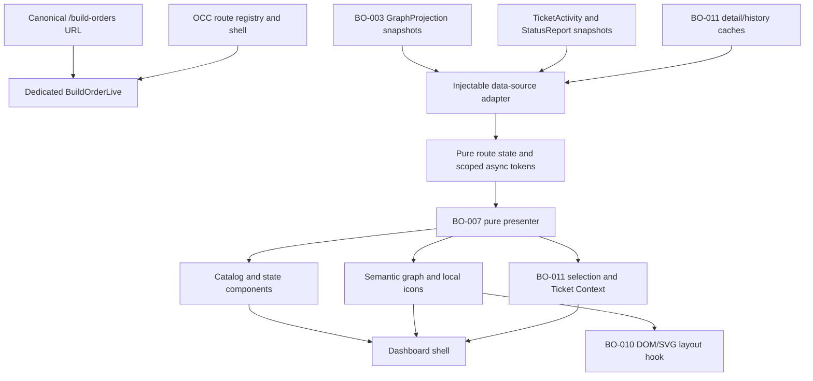
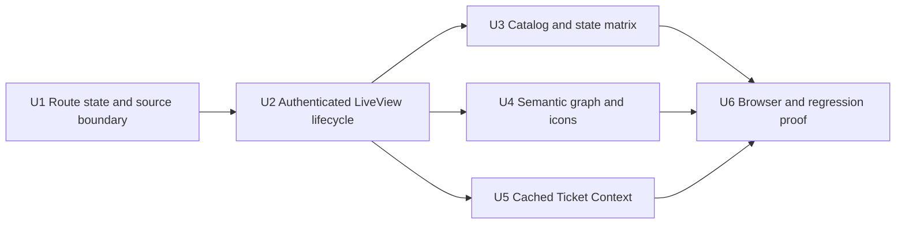

# feat: Ship the selectable minimum Build Order route

## Summary

Add a dedicated authenticated `BuildOrderLive` vertical for the catalog and canonical selected-root URLs. The LiveView will consume the landed projection, presenter, DOM/SVG layout, and Ticket Context contracts through generation-scoped state, while namespaced components render every truthful catalog, graph, freshness, warning, and unavailable state without adding any mutation surface.

---

## Problem Frame

The Build Order providers and presentation adapters are now landed, but Executors still cannot select a real planning root from the dashboard or share and refresh a URL that renders its graph. BO-012 is the first production route that must compose those contracts without regressing the existing Operator Control Center shell or smuggling provider policy, graph semantics, or client-only selection state into the page.

---

## Assumptions

*This plan was authored without synchronous user confirmation. The items below are agent inferences that fill gaps in the input — un-validated bets that should be reviewed before implementation proceeds.*

- DEC-015's consolidated L1 lane is satisfied by adding one dedicated `BuildOrderLive` vertical plus namespaced components/styles/browser coverage. The shared route registry and authenticated LiveView session remain the accepted navigation seam; BO-012 does not fold graph state into `DashboardLive`.
- The catalog URL is `/build-orders`; the only selected URL shape is `/build-orders/:root_number`, where `root_number` is a canonical positive decimal issue number without signs, whitespace, leading zeroes, overflow, or trailing segments. Internal state remains repository-qualified even though the configured repository makes the public URL number-only.
- A selected-root URL is a repository-qualified locator, not a join key: the route must resolve its issue number to exactly one joinable catalog identity before it can subscribe or demand, because GitHub's opaque provider ID cannot be reconstructed from the URL. A stale catalog LKG may resolve the identity; unavailable catalog data cannot, and a healthy catalog with no unique match is the only source of selected not-found truth.
- The landed `GraphProjection` remains the sole owner of the configurable 60/15/5-second refresh policy. The route calls subscription/demand/release once per scoped transition and proves those calls are coalesced; it does not add LiveView timers or direct GitHub calls.
- The route may load the already-cached activity, execution, detail, and history snapshots asynchronously behind an injectable local dependency boundary. It must generation-check results before presentation and use deterministic barriers in tests rather than blocking navigation or sleeping.
- BO-011's fixed open/replace/back/close events are the complete Build Order interaction surface for this ticket. Advanced canvas navigation, zoom, redraw/scale hardening, and final real-root evidence remain with BO-013, BO-014, and BO-015.

---

## Requirements

- R1. Register authenticated `/build-orders` and `/build-orders/:root_number` LiveView routes in the current Operator Control Center shell, with canonical number URLs, exact repository-qualified server identity, parameter validation, Basic Auth, read-only behavior, and browser share/refresh/back/forward survival. (BOREQ-001, BOREQ-012; DEC-002, DEC-008, DEC-015)
- R2. Render catalog health independently from individual entries: loading, empty, unavailable, stale/LKG, valid entries, and per-entry structural invalidity must remain distinct, and one malformed root must never hide or disable valid siblings. (BOREQ-004, BOREQ-012)
- R3. Subscribe to and demand the landed projection generation-safely, preserving its configurable 60-second catalog, 15-second active selected-root, and older-than-5-second selection/reconnect policy without direct provider calls, per-browser polling, or duplicate refresh ownership. (BOREQ-004, BOREQ-012)
- R4. Present selected-root loading, valid empty, valid graph, structurally invalid, unavailable, stale/degraded LKG, cycle, external-reference, and member-warning states through the landed BO-007 view model. Stale generations and delayed local loads must never overwrite a new root or a newer generation, and accepted local updates must render within 1,000 ms. (BOREQ-004, BOREQ-007, BOREQ-012)
- R5. Render server-side lane and phase groupings, body-free semantic cards, complete accessible title/status/progress provenance, all five non-color dependency states, metadata warnings, provider health/freshness/age, bounded diagnostics, cycle and external-reference truth, and empty-state semantics from one presenter model. (BOREQ-007, BOREQ-012, BOREQ-014; DEC-003, DEC-010)
- R6. Map every BO-007-derived lane and status icon key to Aiur-owned local components with accessible text and a generic fallback; never consume icon metadata from GitHub, the prototype, or provider payloads. (BOREQ-012)
- R7. Feed BO-010's DOM/SVG adapter with root- and generation-scoped semantic markup while preserving meaningful pre-layout and fallback content. The worker owns geometry only and stale layout results cannot cross roots or provider generations. (BOREQ-009, BOREQ-010; DEC-007)
- R8. Wire BO-011's cached Ticket Context using exact selected identity, root/generation-scoped selection tokens, asynchronous cached detail/history reads, safe destinations, focus restoration, relationship replacement/back navigation, and stale-completion rejection. No graph card or context action may mutate GitHub planning state or Aiur runtime state. (BOREQ-011; DEC-008)
- R9. Preserve existing Units, Commands/Decisions, Analytics, authentication, theme, online/offline, writable/read-only, navigation, and route behavior while enabling Build Order through the accepted registry seam. (BOREQ-012; DEC-009, DEC-015)
- R10. Provide deterministic LiveView, component, provider-contract, and real-browser evidence for canonical/deep-link navigation, multiple roots, reconnect/back behavior, generation races, the complete state matrix, semantic fallback/worker layout, context navigation, icon fallback, existing-route regression, and the absence of mutation handlers or extra GitHub calls. (BOREQ-001, BOREQ-004, BOREQ-007, BOREQ-009, BOREQ-010, BOREQ-011, BOREQ-012, BOREQ-014)

**Origin actors:** Authenticated Aiur Executor

**Origin flows:** Select a Build Order root; inspect planning graph truth; open cached ticket context; navigate safely through canonical URLs and browser history

**Origin acceptance examples:** Example 1 (two roots never mix), Example 2 (runtime progress cannot clear planning dependency truth), Example 3 (terminal not-planned blockers remain unsatisfied), Example 5 (catalog LKG and per-entry invalidity), Example 7 (keyboard context navigation and focus restoration)

---

## Scope Boundaries

- Do not poll GitHub from a LiveView/browser, add a second refresh scheduler, recompute graph policy in JavaScript, or perform provider work in render functions.
- Do not mutate membership, dependencies, labels, lanes, phases, lifecycle, issue/root state, Decision state, agent state, capacity, or any Aiur runtime control. Safe links remain navigation, not action success.
- Do not add issue bodies, raw provider errors, credentials, paths, unbounded logs, provider icon metadata, or prototype fixture fields to cards or client layout payloads.
- Do not replace `DashboardLive`, the route registry, shell/auth/theme primitives, existing dashboard URLs, or Analytics with prototype placeholders.
- Do not implement advanced pan/zoom/chain interaction, canvas-wide keyboard/touch hardening, final responsive/performance caps, dependency editing, or final packaged real-root proof.

### Deferred to Follow-Up Work

- BO-013/#1100 owns advanced canvas interaction and accessibility hardening.
- BO-014/#1101 owns redraw, responsive scale, and performance hardening.
- BO-015/#1102 owns final packaged-dashboard and real-root/manual acceptance evidence.

---

## Context & Research

### Relevant Code and Patterns

- `src/lib/aiur/build_order/graph_projection.ex` owns catalog/selected snapshots, subscription, demand/release, LKG, refresh scheduling, and generation publication. Its policy and barrier tests already prove the exact 60/15/5-second boundaries.
- `src/lib/aiur_web/build_order_presenter.ex` and `src/lib/aiur_web/build_order_view_model.ex` own the pure join, graph states, lane/phase groups, derived cards/icons, relationship truth, health, generations, and bounded diagnostics.
- `src/lib/aiur_web/components/operator_control_center/build_order_graph.ex` is BO-010's semantic card/SVG adapter seam; `src/priv/static/aiur-dom-svg-layout-adapter.js` rejects stale root/generation layout results and preserves document-flow fallback.
- `src/lib/aiur_web/build_order/ticket_context_selection.ex`, `ticket_context_adapter.ex`, and `components/operator_control_center/build_order_ticket_context.ex` own BO-011's exact-identity navigation, stale-token rejection, context composition, and fixed read-only event surface.
- `src/lib/aiur_web/operator_control_center/route_registry.ex`, `components/operator_control_center/dashboard_shell.ex`, and `src/lib/aiur_web/router.ex` are the landed OCC navigation/authentication seam.
- `src/lib/aiur_web/live/dashboard_live.ex` provides current LiveView lifecycle and shell composition patterns, but DEC-015 requires the Build Order data lifecycle to remain in a dedicated vertical.
- `src/test/browser/fixture_server.exs`, `src/browser/tests/route-shell.browser.spec.mjs`, `dom-svg-layout-adapter.browser.spec.mjs`, and `ticket-context.browser.spec.mjs` provide the current real-browser harness and regression surface.
- `docs/build-order/prototype/Aiur Operator Control Center.2026-07-13-refresh.html` supplies visual hierarchy evidence only. Its sample data, client tab state, stored icon values, progress-cleared edges, fixed geometry, and mouse-only behaviors are explicitly non-production.

### Institutional Learnings

- No `docs/solutions/` directory exists in this checkout. The merged BO-003/007/010/011 code, their focused tests, and DEC-015's commit-pinned lane packet are the authoritative local precedents.
- BO-011's review history makes exact identity and request-token rotation load-bearing: returning to the same member after replacement is still a different request, and a delayed completion from the first request must be rejected.

### External References

- External research is intentionally omitted. The repository contains the current Phoenix LiveView async-test patterns and every domain/provider/layout/context contract this route must consume.

---

## Key Technical Decisions

- Add `AiurWeb.BuildOrderLive` rather than extending `DashboardLive`: this applies DEC-015's one-writer L1 vertical and keeps graph subscriptions, demand ownership, async tokens, and context state out of the existing Units/Commands assigns.
- Introduce a small pure `AiurWeb.BuildOrder.RouteState` boundary: it parses canonical URL numbers, resolves them through exactly one joinable configured-repository catalog entry, classifies catalog/selected states, tracks the active root and accepted generations, and decides whether incoming snapshots/completions belong to the current route. It never constructs or guesses a provider identity and performs no provider calls.
- Put external calls behind an injectable `AiurWeb.BuildOrder.DataSource` behavior/default adapter: production delegates to `GraphProjection`, `TicketActivity`, `StatusReport`, `TicketDetailCache`, and `TicketHistoryProvider`; LiveView tests use a deterministic process-backed fake to prove call counts, barriers, failure, and race ordering without GitHub access or sleeps.
- Treat selection as a scoped resource lifecycle: subscribe before reading, demand once after catalog-backed identity resolution or connected reconnect, release/unsubscribe the prior root before adopting another, and rely on projection demander monitoring as crash cleanup. Catalog and selected subscriptions are separate; a cold catalog keeps a valid locator pending rather than issuing an unjoinable demand.
- Use `start_async/4` only for cached local snapshot/context composition that could block the LiveView. Every task key/result carries a route epoch plus root/generation/request token; `handle_async/3` coalesces same-scope reloads and applies results only when `RouteState` and BO-011 selection still recognize them.
- Rebuild the BO-007 presenter model only from the latest accepted planning, execution, and activity snapshots. Rendered counts, groups, cards, relationships, warnings, health, and diagnostics all come from that one model; components do not independently filter or infer truth.
- Keep one semantic graph DOM as both fallback and layout input. Extend BO-010's component to accept the typed view model and selection metadata while retaining its root/provider/DOM generation attributes; the SVG remains decorative and dependency truth remains in accessible text.
- Keep icon selection closed over known local atom keys. A dedicated component maps every current lane/status key to local SVG/path markup plus readable text and funnels unknown input to `:generic`; provider fields never influence asset selection.
- Preserve same-generation health truth: accept health-only publications for the current scope even when their projection generation is unchanged, while replacing graph data and advancing DOM generation only for a newer complete data generation.
- Preserve safe diagnostic boundaries: render controlled diagnostic messages and normalized health only, never inspect or print raw provider failures.
- Make the information hierarchy explicit: the catalog route shows heading/health followed by independently selectable entries; the selected route shows a catalog back link, selected root identity/health/summary, semantic graph/dependency truth, then the disposable Ticket Context overlay. It does not repeat the entire catalog beside the graph.
- Extend the route registry with a LiveView ownership group. The shell uses `patch` only within the same owner (`Units`/`Commands` or catalog/selected Build Order) and `navigate` across owners, preserving same-LiveView patches without asking Phoenix to patch from `DashboardLive` into `BuildOrderLive`.

---

## Open Questions

### Resolved During Planning

- Can a selected-root deep link demand before the catalog resolves it? No. `TrackerIdentity.github_key/1` and `GraphProjection.demand/2` require GitHub's opaque provider ID. A stale catalog LKG may supply the exact joinable identity; cold/unavailable catalog data renders pending/unavailable selection, and only a healthy catalog may establish not-found.
- Should BO-012 duplicate the 60/15/5 timers to meet its acceptance gate? No. BO-003 already owns and tests those configurable boundaries. BO-012 proves it invokes demand/subscription once at the right route/reconnect boundary and never invokes a provider or refresh timer itself.
- Should a malformed catalog entry remain selectable? A structurally invalid entry with a valid exact identity retains its canonical diagnostic link so selecting it can show selected structural-invalid truth. An entry whose identity cannot be safely qualified renders a non-link diagnostic.
- Should stale LKG block navigation or clear cards? No. The route renders current LKG immediately with refreshing/age/degraded health and lets projection publication replace it generation-safely.
- Should issue progress alter edge display? No. Edge state and readiness stay exactly as BO-007 presents them; execution progress is provenance on the card only.
- Can Ticket Context load synchronously in an event handler? No. Cached detail/history requests are dispatched asynchronously and bound to BO-011's current request token so replacement, close, reconnect, and root changes stay responsive and race-safe.

### Deferred to Implementation

- Exact CSS class names and the internal struct field names may change to match component ergonomics, provided the namespaced ownership and state/identity contracts remain explicit.
- The deterministic fake may use process messages or an Agent internally; it must remain test-only and preserve the production dependency behavior's return shapes.

---

## High-Level Technical Design

> *This illustrates the intended approach and is directional guidance for review, not implementation specification. The implementing agent should treat it as context, not code to reproduce.*

The LiveView owns only route-local orchestration. Projection health and generations arrive as immutable snapshots; local execution/activity/context reads complete behind scope tokens. The presenter is the single join point, and the server-rendered model feeds the catalog, status surface, semantic cards, dependency summary, layout metadata, and context adapter without a second truth path.

---

## Implementation Units

### U1. Add the pure route state and injectable data-source boundary

**Goal:** Isolate canonical identity parsing, accepted-scope decisions, and external read/subscription calls so the LiveView can be deterministic and race-testable.

**Requirements:** R1, R2, R3, R4, R8, R10

**Dependencies:** Landed BO-003, BO-007, and BO-011 contracts

**Files:**
- Create: `src/lib/aiur_web/build_order/route_state.ex`
- Create: `src/lib/aiur_web/build_order/data_source.ex`
- Test: `src/test/aiur_web/build_order/route_state_test.exs`
- Test: `src/test/aiur_web/build_order/data_source_test.exs`

**Approach:**
- Parse only canonical positive decimal issue numbers within the tracker identifier bound; derive selected identity from the configured GitHub repository plus number, never from title/path/topic or a bare cross-repository join.
- Model route epoch, requested root locator, catalog snapshot, resolved selected identity/snapshot, planning/execution/activity generations, DOM generation, queued local-reload scope, and controlled route diagnostics as immutable state.
- Resolve a locator only against exactly one catalog entry whose repository and display identifier match and whose full identity is joinable. Keep the locator pending while catalog data is absent, use stale LKG when available, fail duplicate/malformed matches closed, and declare not-found only from a healthy complete catalog.
- Provide predicates/transitions for catalog generation/health publication, selected generation/health publication, root change, reconnect, local reload request/completion, and reset. Reject wrong repository/root, older data generations, prior route epoch, and prior context token; accept current-scope equal-generation health changes without incrementing DOM generation or replacing graph data.
- Define the narrow production adapter over existing public APIs. Keep projection subscription/demand/release separate from snapshot reads; expose no GitHub provider callback or mutation function.

**Execution note:** Implement the parser and transition matrix test-first because URL/identity ambiguity and stale-generation adoption are the highest-risk page boundary.

**Patterns to follow:**
- Exact identity through `Aiur.TrackerIdentity`
- Bounded values through `Aiur.BuildOrder.Bounded`
- Pure reducer/token style in `AiurWeb.BuildOrder.TicketContextSelection`
- Projection public contract in `Aiur.BuildOrder.GraphProjection`

**Test scenarios:**
- Happy path: canonical `1`, configured repository, and current snapshots establish one exact selected scope.
- Edge case: zero, negatives, signs, leading zeroes, whitespace, decimals, overflow, encoded separators, non-decimal text, and extra path data fail closed without a demand.
- Race: root A generation N, root B generation 1, then delayed A generation N+1 leaves B unchanged.
- Race: same-root older data generation and prior route-epoch local completion are ignored; an equal-generation health-only update changes visible health without replacing data, and one newer complete generation increments DOM scope exactly once.
- State: catalog unavailable, stale LKG, empty, and per-entry invalidity remain separate normalized results.
- Contract: production adapter delegates only to cache/subscription/snapshot APIs and exposes no provider or mutation call.

**Verification:**
- Route transitions and call boundaries are fully testable without a running endpoint, GitHub, arbitrary sleeps, or component rendering.

### U2. Register and orchestrate the dedicated authenticated LiveView

**Goal:** Make both Build Order URLs real shell routes whose state survives deep link, reconnect, patch navigation, refresh, and browser history without mixing roots.

**Requirements:** R1, R3, R4, R8, R9, R10

**Dependencies:** U1

**Files:**
- Create: `src/lib/aiur_web/live/build_order_live.ex`
- Modify: `src/lib/aiur_web/router.ex`
- Modify: `src/lib/aiur_web/operator_control_center/route_registry.ex`
- Modify: `src/lib/aiur_web/components/operator_control_center/dashboard_shell.ex`
- Test: `src/test/aiur_web/live/build_order_live_test.exs`
- Test: `src/test/aiur_web/router_auth_test.exs`
- Test: `src/test/aiur_web/financial_data_access_test.exs`
- Test: `src/test/aiur_web/operator_control_center/route_registry_test.exs`
- Test: `src/test/aiur_web/operator_control_center_components_test.exs`

**Approach:**
- Add both routes before the authenticated catch-all in the existing `:dashboard` LiveView session, with distinct route actions and a Build Order LiveView ownership group recognized by the registry. Update the shell so within-owner links patch and cross-owner links navigate. Continue using the shared shell, financial-data on-mount gate, theme, and route metadata.
- On connected mount subscribe to catalog/activity/running changes. On each selected `handle_params`, retain the validated number as a pending locator until current catalog data resolves exactly one joinable identity. Then release/unsubscribe the previous identity, subscribe before reading the resolved projection scope, and demand once. Render current data/health immediately while any refresh runs.
- Handle projection generation/health/reset messages only through `RouteState`. Apply equal-generation health-only messages to the current scope, but rebuild graph/DOM data only for a newer generation. Coalesce execution/activity reloads per accepted planning scope with `start_async`; reload the full cached snapshots rather than trusting partial PubSub payloads.
- Build the presenter model from accepted snapshots, reconcile open context on new planning generations, and keep catalog/selected states independent. On disconnect/reconnect initialize a new route epoch and clear disposable context before one reconnect demand.
- Release the current selected demand on normal termination while relying on projection caller monitoring for crash cleanup.
- Implement only the fixed BO-011 navigation event names; no forms, mutation callbacks, or passthrough event names are accepted.

**Patterns to follow:**
- `AiurWeb.DashboardLive` shell and `handle_params` conventions
- Phoenix LiveView `start_async/4`, `handle_async/3`, and `render_async/1` test synchronization
- Subscribe-before-read pattern in `GraphProjection.subscribe_catalog/1` and `subscribe_selected/2`

**Test scenarios:**
- Navigation: catalog to root A to root B, deep-link root B, refresh, reconnect, browser-style patch back/forward, and closed-root link preserve the exact URL and never render another root. Units/Commands patch within `DashboardLive`, Build Order catalog/selection patch within `BuildOrderLive`, and links between those owners use live navigation.
- Invalid input: every malformed parameter renders a controlled invalid/not-found state and makes zero selected demand/provider calls.
- Identity lookup: a stale catalog LKG resolves a valid locator; cold/unavailable catalog data leaves it pending/unavailable with zero selected demand; healthy no-match is not found; duplicate or unjoinable matches fail closed.
- Call count: one selected demand per accepted selection/reconnect, release on switch/termination, no route timers, no direct refresh/provider calls, and coalesced local reloads for burst PubSub messages.
- Race: out-of-order selected, activity, execution, and async completions cannot replace a current root/generation; one current completion renders within the 1,000 ms local budget using a barrier, not a sleep.
- Health: selected structural-invalid differs from selected unavailable and stale LKG; valid empty differs from loading.
- Security/regression: both routes require Basic Auth, remain available in read-only mode, inherit CSRF/write separation, and do not change existing Units/Commands/Analytics route behavior.

**Verification:**
- LiveView tests can deterministically drive every lifecycle and race through the fake data source while asserting rendered route identity and external call counts.

### U3. Render the catalog and truthful route-state matrix

**Goal:** Let an Executor understand catalog truth and select any safely identified root without one bad entry obscuring its siblings.

**Requirements:** R2, R4, R5, R9

**Dependencies:** U2

**Files:**
- Create: `src/lib/aiur_web/components/operator_control_center/build_order_catalog.ex`
- Create: `src/lib/aiur_web/components/operator_control_center/build_order_status.ex`
- Modify: `src/priv/static/dashboard.css`
- Test: `src/test/aiur_web/operator_control_center/build_order_catalog_test.exs`
- Test: `src/test/aiur_web/operator_control_center/build_order_status_test.exs`

**Approach:**
- On the catalog route, render page health followed by the entry list. On the selected route, render a catalog back link followed by selected identity/health/summary and the graph; do not repeat the entire entry list beside the graph.
- Render catalog loading, empty, stale/LKG, unavailable, and refreshing health at the collection level, then render each entry independently with exact issue number, title, lifecycle, controlled diagnostics, and canonical patch link when its identity is joinable.
- Keep a malformed identity nonselectable while retaining its diagnostic; keep a structurally invalid but exact identity selectable so its selected view can show the distinct structural-invalid state.
- Render selected provider freshness, age, refreshing/degraded status, health, current generation, counts, and bounded diagnostics in a common status region without replacing LKG content.
- Use semantic navigation/headings/lists/articles/status/alert roles and visible, non-color labels before JavaScript loads.

**Test scenarios:**
- Catalog: two valid roots and one malformed root render three independent rows; both valid links remain canonical and usable.
- Catalog state: cold loading, true empty, unavailable without data, stale/LKG with data, and refreshing remain distinguishable by text and semantics.
- Selected state: not found, invalid parameter, cold loading, valid empty, structural invalid, unavailable, and stale/degraded LKG have distinct names and diagnostics.
- Safety: controlled diagnostics render; raw failure structs/messages, issue bodies, credentials, and paths do not.

**Verification:**
- Component output communicates the complete collection/selection matrix with JavaScript disabled and does not derive counts outside the supplied model.

### U4. Upgrade the semantic graph and local icon surface

**Goal:** Render the BO-007 view model as accessible body-free cards and dependency truth while retaining BO-010's worker/fallback contract.

**Requirements:** R4, R5, R6, R7, R10

**Dependencies:** U2

**Files:**
- Create: `src/lib/aiur_web/components/operator_control_center/build_order_icon.ex`
- Modify: `src/lib/aiur_web/components/operator_control_center/build_order_graph.ex`
- Modify: `src/priv/static/dashboard.css`
- Test: `src/test/aiur_web/operator_control_center/build_order_icon_test.exs`
- Modify: `src/test/aiur_web/operator_control_center_components_test.exs`

**Approach:**
- Accept the typed presenter model and BO-011 navigation values instead of fixture-shaped maps, but preserve BO-010's root/provider/DOM generation, node, lane, phase, edge, asset, and fallback data attributes.
- Render lane sections and phase metadata from presenter groups, and render each card as a semantic selectable button with exact identifier/title/lifecycle/readiness/execution/agent stage/progress provenance, warnings, local lane/status icons, and a complete accessible label. Never render an issue body.
- Render all five dependency states as bounded text rows with source/target/state/readiness/diagnostics; cycles and external/missing endpoints remain visible independent of SVG/color.
- Map every current `Aiur.BuildOrder.Icon` lane/status atom to local SVG markup and readable text. Unknown/non-atom keys use the generic icon and supplied accessible fallback label.
- Keep the SVG decorative; the worker changes only geometry. Root/generation changes replace layout scope so stale worker results are discarded by the existing adapter.

**Test scenarios:**
- Cards: every lifecycle/readiness/execution/agent-stage/progress known/unknown combination carries non-color text and provenance without a body.
- Warnings: member metadata warnings leave the card selectable and render controlled diagnostics.
- Edges: cleared, blocking, terminal-unsatisfied, unknown, and cyclic plus missing/external diagnostics render in semantic fallback.
- Truth: 100% runtime progress does not reclassify a blocking edge; not-planned blocking remains terminal-unsatisfied.
- Icons: every derived lane/status key renders its local icon and text; unknown/provider/prototype icon metadata yields the generic fallback and is absent from attributes/markup.
- Layout: root/generation metadata remains compatible with the existing adapter and DOM-generation increments only on an accepted model.

**Verification:**
- The graph remains fully understandable before layout completes or when worker/layout loading fails, and the adapter receives geometry-only, root-scoped data.

### U5. Wire cached Ticket Context into graph selection

**Goal:** Open and navigate exact-member context without blocking the route, leaking stale data, or adding action semantics.

**Requirements:** R8, R10

**Dependencies:** U2, U4, landed BO-011

**Files:**
- Modify: `src/lib/aiur_web/live/build_order_live.ex`
- Modify: `src/lib/aiur_web/components/operator_control_center/build_order_graph.ex`
- Test: `src/test/aiur_web/live/build_order_live_test.exs`
- Test: `src/test/aiur_web/operator_control_center/build_order_ticket_context_test.exs`

**Approach:**
- Route card open, relationship replace/back, and close through `TicketContextSelection`; never store a bare identifier or client-only selected ticket.
- Request cached detail/history through scoped async work keyed by the current BO-011 request token. Subscribe once to cache publications and reload only when the exact selected identity is affected.
- Compose the accepted base context through `TicketContextPresenter` and `TicketContextAdapter`, preserving loading/stale/missing/restart states, relationship truth, bounded logs, safe capabilities, heading focus, and origin-card restoration.
- Reconcile on accepted same-root planning generations and clear on root change, selected-member removal, reconnect, or close. Ignore delayed results after every token-changing transition.

**Test scenarios:**
- Open/replace/back/close: exact current members navigate with correct history and focus origin while external/missing/cross-repository targets never trigger cache requests.
- Race: close, replacement, same-root generation rotation, root switch, and reconnect all reject the prior detail/history completion, including replay of the same identity.
- All-state: cached context loading, ready, stale, missing, unavailable, history restart, and bounded logs render without changing graph truth.
- Destinations: canonical Issue/Pull request and exact readable Chat/Commands links render; unavailable capabilities retain controlled reasons and perform no action.
- Negative surface: rendered events are limited to navigation; prohibited GitHub/runtime/Decision mutation events, forms, and unsafe URLs are absent.

**Verification:**
- Ticket Context remains responsive and exact across route/generation changes, with all data coming from the landed cache contracts and no mutation path.

### U6. Prove the integrated route in the real-browser harness

**Goal:** Cover the production route's semantic, layout, context, history, and regression behavior in a browser while preserving existing harness suites.

**Requirements:** R1, R4, R5, R6, R7, R8, R9, R10

**Dependencies:** U3, U4, U5

**Files:**
- Modify: `src/test/browser/fixture_server.exs`
- Create: `src/browser/tests/build-order-route.browser.spec.mjs`
- Modify: `src/browser/tests/route-shell.browser.spec.mjs`
- Modify: `src/browser/package.json`
- Test: `src/test/aiur_web/live/build_order_live_test.exs`

**Approach:**
- Register the production `AiurWeb.BuildOrderLive` module on deterministic fixture routes and configure it with the process-backed fake data source in the isolated browser-harness VM. Drive real LiveView updates without GitHub or clock sleeps, while reusing the pinned layout worker and existing Ticket Context hook.
- Exercise catalog selection, canonical URLs, two-root patch navigation/back/forward, semantic pre-layout output, fallback on layout failure, successful real-worker geometry, stale-layout rejection, context open/replacement/back/close, and focus restoration.
- Render all five edge states, cycle, external/missing endpoints, member warnings, stale/degraded health, and unknown icon fallback in one bounded fixture matrix.
- Retain the existing Units/Commands/Analytics shell tests and replace the old Build Order unavailable expectation with available-route navigation. Assert no prohibited mutation event/form/network request is emitted.

**Test scenarios:**
- Browser navigation: select root A then root B, go back/forward, refresh/deep-link, and observe only the URL-selected root.
- Layout: semantic cards/dependencies exist before layout; real worker positions cards/edges; forced failure remains readable; a delayed old-root layout cannot patch the new root.
- Context: keyboard open, relationship replacement/back, Escape close, focus restore, and safe destination navigation work across LiveView updates.
- Accessibility: headings, nav current state, card names, status/progress provenance, icon text, dependency summaries, focus visibility, and non-color diagnostics remain perceivable.
- Regression/security: existing dashboard routes still navigate, Basic Auth remains required at the route layer, and the page emits no GitHub/planning/runtime mutation handlers or extra provider calls.

**Verification:**
- Focused Elixir tests and the Build Order/route-shell/layout/context browser suites pass against the pinned local assets with deterministic state transitions.

---

## System-Wide Impact

- **Interaction graph:** Router and route registry expose `BuildOrderLive`; the LiveView subscribes to graph/activity/runtime/cache publications, reads cached snapshots through `DataSource`, feeds the presenter, renders graph/status/context components, and supplies generation metadata to existing hooks. No API controller or write pipeline changes.
- **Error propagation:** Provider failures remain normalized snapshot health/diagnostics. The route translates only URL and local dependency failures into controlled page states; raw terms are neither logged to rendered output nor passed to components.
- **State lifecycle risks:** Root switches, reconnects, PubSub bursts, async completion ordering, subscriber reset races, and layout worker completion can all replay stale state. Repository-qualified identities, route epochs, planning generations, context request tokens, coalesced async tasks, and existing layout scope checks jointly reject them.
- **API surface parity:** The HTML LiveView routes and route registry change; REST APIs, Supervisor Decision APIs, TUI endpoints, provider APIs, and Analytics document route do not.
- **Integration coverage:** Component tests cannot prove browser history, hook focus, real worker geometry, stale layout rejection, or route-shell navigation; the focused browser suite covers those seams. LiveView fakes prove provider call counts and stale server completions.
- **Unchanged invariants:** Basic Auth, financial-data access rules, existing dashboard URLs, read-only default, CSRF/write separation, provider refresh ownership, BO-007 graph semantics, BO-010 geometry-only ownership, BO-011 context safety, and BO-003 cache/LKG behavior remain unchanged.

---

## Alternative Approaches Considered

- Extend `DashboardLive`: rejected because graph subscription/context state would couple to Units/Commands and violate DEC-015's dedicated L1 vertical.
- Use client-only selected tab state: rejected because share/refresh/back/reconnect would not be authoritative and stale graphs could cross URLs.
- Add LiveView polling timers: rejected because BO-003 already owns configurable refresh, coalescing, LKG, and provider backoff; duplicate timers would create per-browser GitHub work.
- Render the prototype or client graph directly: rejected because it carries sample data, noncanonical icon fields, progress-derived dependency behavior, fixed geometry, and mouse-first interactions.
- Fetch all context before rendering selection: rejected because navigation would block and delayed work could overwrite later root/member choices.

---

## Risk Analysis & Mitigation

| Risk | Likelihood | Impact | Mitigation |
|------|------------|--------|------------|
| Stale root/generation data crosses URL navigation | High | High | Exact identity, route epoch, monotonic generation, async token, and browser back/forward race tests |
| Route accidentally duplicates provider refresh/load ownership | Medium | High | Narrow data-source behavior, call-count assertions, no timers/provider callbacks, reuse BO-003 boundary tests |
| Catalog and selected failure states collapse into a generic error | Medium | High | Pure state matrix plus independent catalog/selected component and LiveView tests |
| Shared OCC navigation or auth regresses | Medium | High | Additive route registry actions, same live session/shell, route-auth/financial-access/route-shell regressions |
| Layout-only UI becomes unreadable or stale | Medium | High | Semantic DOM and dependency summary first, decorative SVG, existing root/generation adapter checks, real-worker/fallback browser cases |
| Context races leak old member data or expose mutations | High | High | Reuse BO-011 selection tokens/fixed events, async cache boundaries, negative-surface tests, focus browser coverage |
| Component scope grows beyond one reviewable lane vertical | Medium | Medium | Keep orchestration in one LiveView, pure route state, small catalog/status/icon components, namespaced CSS and browser suite |

---

## Success Metrics

- Both authenticated Build Order URLs render and navigate canonically while existing dashboard routes remain green.
- Every catalog/selected health state and every BO-007 edge/icon state has deterministic component or LiveView coverage.
- Root/generation/context race tests demonstrate no stale overwrite and one current render inside the 1,000 ms local acceptance budget without sleeps.
- Browser coverage demonstrates semantic fallback, real worker layout, stale-layout rejection, context focus/navigation, and no mutation surface.
- Scoped compile, format, affected Elixir tests, focused browser suites, and repository CI complete successfully against `develop`.

---

## Documentation / Operational Notes

- No migration, feature flag, new provider setting, or persisted state is introduced.
- Record `develop` as the authoritative PR base and DEC-015 L1/BO-007 as the lane authority in the workpad and PR handoff.
- The issue's own acceptance evidence remains required even though implementation/review flows through the consolidated L1 lane.
- Agent workspaces cannot run the guarded `scripts/aiurdev --test` manual harness. BO-012 will provide focused automated browser evidence here; BO-015/Executor-root owns final packaged/manual proof.

---

## Sources & References

- **Origin document:** [docs/brainstorms/2026-07-12-build-order-requirements.md](../brainstorms/2026-07-12-build-order-requirements.md)
- Execution amendment: [docs/build-order/11-execution-amendment.md](../build-order/11-execution-amendment.md)
- Implementation pointers: [docs/build-order/08-implementation-pointers.md](../build-order/08-implementation-pointers.md)
- Technical decisions: [docs/build-order/05-technical-decisions.md](../build-order/05-technical-decisions.md)
- Design evidence: [docs/build-order/design/manifest.md](../build-order/design/manifest.md)
- Approved planning authority: commit `4d8de9508206e08e314f2730cd916501a3b4cafd`
- DEC-015 execution authority: commit `c6a8bafe3b777ba1781e8a786a71ae87ddf873d9`
- Landed dependency PRs: BO-007/#1196 and BO-011/#1233
- Tracker issue: #1099
